```python
import networkx as nx
import numpy as np
import random
import math
```


```python
from matplotlib import pyplot as plt
```


```python
HISTORY = []

LAMDA0 = 0.00001
K = 50

Time = 1000
T_lim = 100
```


```python
def FLamda(D):
    return LAMDA0 * 2 ** (K * D / 10)


def P(lamda):
    return math.exp(-lamda * Time)


def F(p, epsi):
    res = 1
    for i in range(len(p)):
        if p[i] > 0:
            res *= p[i] ** epsi[i]
    return res
```


```python
martx = [
    [0, 500],
    [0, 0]
] 

G_task_1 = nx.DiGraph(np.array(martx))

task_1_weight = [10, 500]
epsi_1 = [1, 1]

pos = nx.planar_layout(G_task_1)
nx.draw(G_task_1, pos, with_labels=True)
nx.draw_networkx_edge_labels(G_task_1, pos, {(x, y): z['weight'] for (x, y, z) in nx.to_edgelist(G_task_1)},font_color='red')
```


    {(0, 1): Text(0.0, 0.0, '500')}


    
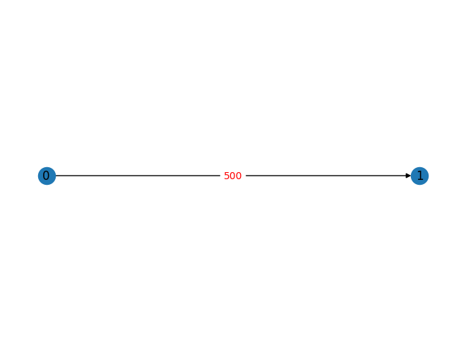
    


```python
martx = [
    [0, 5000],
    [0, 0]
] 

G_task_2 = nx.DiGraph(np.array(martx))

task_2_weight = [10, 500]
epsi_2 = [1, 1]

pos = nx.planar_layout(G_task_2)
nx.draw(G_task_2, pos, with_labels=True)
nx.draw_networkx_edge_labels(G_task_2, pos, {(x, y): z['weight'] for (x, y, z) in nx.to_edgelist(G_task_2)},font_color='red')
```


    {(0, 1): Text(0.0, 0.0, '5000')}


    
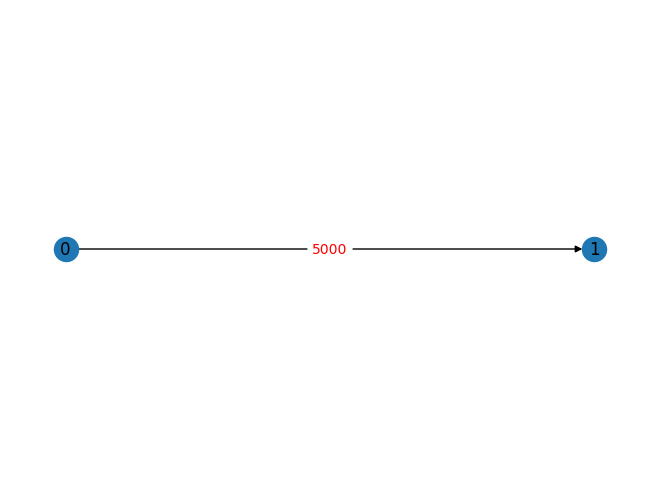
    


```python
martx = [
[0, 1000, 500, 1000, 0, 0, 0, 0, 0, 0], 
[0, 0, 0, 0, 0, 500, 0, 0, 0, 0], 
[0, 0, 0, 0, 0, 300, 0, 0, 0, 0], 
[0, 0, 0, 0, 500, 0, 0, 0, 0, 0], 
[0, 0, 0, 0, 0, 300, 0, 0, 0, 0], 
[0, 0, 0, 0, 0, 0, 100, 0, 0, 0], 
[0, 0, 0, 0, 0, 0, 0, 100, 100, 50], 
[0, 0, 0, 0, 0, 0, 0, 0, 100, 0], 
[0, 0, 0, 0, 0, 0, 0, 0, 0, 50], 
[0, 0, 0, 0, 0, 0, 0, 0, 0, 0], 
] 

G_task_3 = nx.DiGraph(np.array(martx))

task_3_weight = [100, 300, 300, 300, 200, 150, 100, 100, 200, 100]
epsi_3 = [1, 1, 1, 1, 1, 1, 1, 1, 1, 1]

pos = nx.planar_layout(G_task_3)
nx.draw(G_task_3, pos, with_labels=True)
nx.draw_networkx_edge_labels(G_task_3, pos, {(x, y): z['weight'] for (x, y, z) in nx.to_edgelist(G_task_3)},font_color='red')
```


    {(0, 1): Text(-0.09090909090909094, -0.36363636363636365, '1000'),
     (0, 2): Text(-0.20454545454545459, -0.3068181818181818, '500'),
     (0, 3): Text(-0.7727272727272727, -0.13636363636363638, '1000'),
     (1, 5): Text(0.7045454545454545, -0.25, '500'),
     (2, 5): Text(0.5909090909090908, -0.19318181818181818, '300'),
     (3, 4): Text(-0.4886363636363637, 0.03409090909090907, '500'),
     (4, 5): Text(0.07954545454545447, -0.07954545454545456, '300'),
     (5, 6): Text(0.42045454545454536, 0.034090909090909075, '100'),
     (6, 7): Text(-0.03409090909090916, 0.1477272727272727, '100'),
     (6, 8): Text(0.13636363636363627, 0.3181818181818181, '100'),
     (6, 9): Text(0.13636363636363627, 0.26136363636363635, '50'),
     (7, 8): Text(-0.1477272727272728, 0.26136363636363635, '100'),
     (8, 9): Text(0.022727272727272645, 0.375, '50')}


    
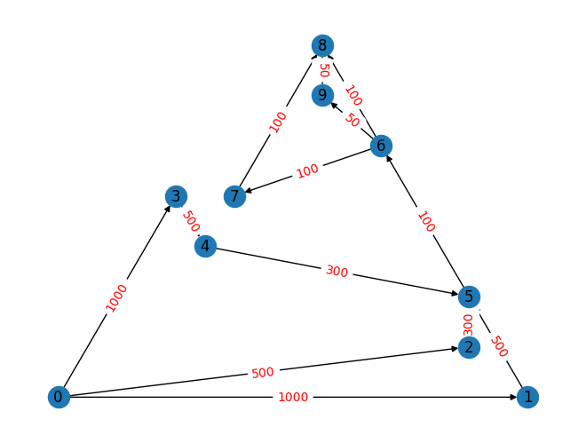
    


```python
martx = [
    [0, 1, 0, 0, 0], 
    [1, 0, 1, 0, 0], 
    [0, 1, 0, 1, 0], 
    [0, 0, 1, 0, 1], 
    [0, 0, 0, 1, 0], 
] 

G_net_1 = nx.Graph(np.array(martx))

net_1_power = [100, 100, 100, 100, 100]
epsi_1 = [1, 1, 1, 1, 1]
nx.draw(G_net_1, with_labels=True)
```


    
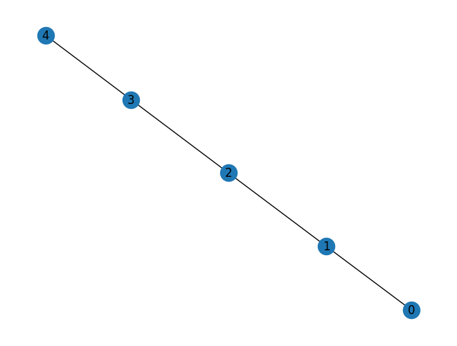
    


```python
martx = [
    [0, 1, 0, 0, 0], 
    [1, 0, 1, 0, 0], 
    [0, 1, 0, 1, 0], 
    [0, 0, 1, 0, 1], 
    [0, 0, 0, 1, 0], 
] 

G_net_2 = nx.Graph(np.array(martx))

net_2_power = [100, 200, 300, 400, 500]
epsi_2 = [1, 1, 1, 1, 1]
nx.draw(G_net_2, with_labels=True)
```


    
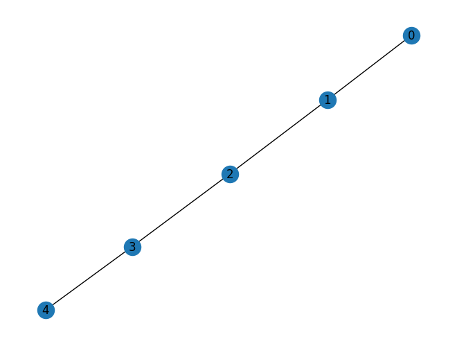
    


```python
martx = [
    [0, 1, 0, 1, 0, 0, 0], 
    [1, 0, 1, 1, 0, 0, 0], 
    [0, 1, 0, 1, 0, 0, 1], 
    [1, 1, 1, 0, 1, 1, 1], 
    [0, 0, 0, 1, 0, 1, 0], 
    [0, 0, 0, 1, 1, 0, 1], 
    [0, 0, 1, 1, 0, 1, 0], 
] 

G_net_3 = nx.Graph(np.array(martx))

net_3_power = [500, 500, 200, 200, 500, 500, 1000]
epsi_3 = [1, 1, 1, 1, 1, 1, 1]
nx.draw(G_net_3, with_labels=True)
```


    
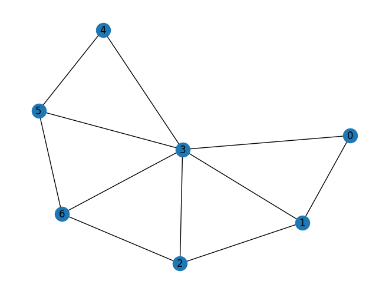
    


```python
def generate_random_task_distribution(COUNT_NODE_NET, COUNT_NODE_TASK, CONST_DISTRIBUTION={}):
    random_task_distribution = [[] for _ in range(COUNT_NODE_NET)]
    temp = [x for x in range(COUNT_NODE_TASK)]
    for node, task in CONST_DISTRIBUTION.items():
        random_task_distribution[node].append(temp.pop(task))
    while not len(temp) == 0:
        random_task_distribution[random.randint(0, COUNT_NODE_NET - 1)].append(
            temp.pop(random.randint(0, len(temp) - 1)))
    return random_task_distribution


def node_from_distribution(distribution, node):
    for i in range(len(distribution)):
        if node in distribution[i]:
            return i


def algoritm(network_graph, tasks_graph, distribution, net_p, task_w, epsi):
    """
    network_graph - сетевой график
    tasks_graph - график задач
    distribution - распределение задач по вершинам
    """
    # 'Задача1задача2:ПутьВГрафеСети'
    CONST_path = {}
    # Словарь путей
    # Задача:Узел
    relationship = {}
    for start, end, weight in nx.to_edgelist(tasks_graph):
        relationship[start] = node_from_distribution(distribution, start)
        relationship[end] = node_from_distribution(distribution, end)
        if relationship[start] == relationship[end]:
            CONST_path[str(start) + str(end)] = [relationship[start]]
        else:
            CONST_path[str(start) + str(end)] = random.choice(
                [item for item in nx.all_shortest_paths(network_graph, relationship[start], relationship[end])])

    # Подсчет трудоемкости
    W = [0 for _ in range(len(net_p))]

    for start, end, weight in nx.to_edgelist(tasks_graph):
        if not len(CONST_path[str(start) + str(end)]) == 1:
            temp = CONST_path[str(start) + str(end)].copy()
            W[temp[0]] += task_w[start] + weight['weight']
            W[temp[-1]] += task_w[end] + weight['weight']
            temp.pop(0)
            temp.pop(-1)
            for i in temp:
                W[i] += 2 * weight['weight']
        else:
            W[relationship[start]] += task_w[start]
            W[relationship[end]] += task_w[end]

    # Оценка времени задач изначально
    arr = ([a for a in nx.all_simple_paths(tasks_graph, 0, len(task_w) - 1)])
    arr.sort(key=lambda x: len(x), reverse=True)
    T_task = [0 for _ in range(len(task_w))]

    for task in arr[0]:
        T_task[task] = T_lim / len(arr[0])

    # Оценка времени задач
    for path_task in arr[1:]:
        sum_t = 0
        temp = []
        for task in path_task:
            if T_task[task] == 0:
                temp.append(task)
            sum_t += T_task[task]
        for task in temp:
            T_task[task] = (T_lim - sum_t) / len(temp)

    T_NET = [0 for _ in range(len(net_p))]
    # Оценка времени сети
    for start, end, weight in nx.to_edgelist(tasks_graph):
        path_net = CONST_path[str(start) + str(end)].copy()
        if len(path_net) == 1:
            if T_NET[path_net[-1]] == 0:
                T_NET[path_net[-1]] = min(T_task[end], T_task[start])
            else:
                T_NET[path_net[-1]] = min(T_task[end], T_task[start], T_NET[path_net[-1]])
        else:
            # Обработка поледего узла в пути
            if T_NET[path_net[-1]] == 0:
                T_NET[path_net[-1]] = T_task[end]
            else:
                T_NET[path_net[-1]] = min(T_task[end], T_NET[path_net[-1]])
            # Если будет > 1 узла то
            for node in path_net[:-1]:
                if T_NET[node] == 0:
                    T_NET[node] = T_task[start] / len(path_net[:-1])
                else:
                    T_NET[node] = min(T_NET[node], T_task[start] / len(path_net[:-1]))

    # Оценка кр. пути задач для сети
    special_t = T_lim / len(arr[0])
    for node in range(len(net_p)):
        if len(set(distribution[node]) & set(arr[0])) > 1:
            T_NET[node] = special_t * len(set(distribution[node]) & set(arr[0]))

    D = [0. for i in range(len(net_p))]

    for i in range(len(net_p)):
        if not T_NET[i] == 0:
            D[i] = W[i] / (net_p[i] * T_NET[i])

    for d in D:
        if d > 1:
            return {'f': 0, 'res': {
                'Нагруженность на узлы': W,
                'Производительность': net_p,
                'D': D,
                'T_task': T_task,
                'T_NET': (T_NET),
                'Распределение': distribution,
                'Задача1задача2:ПутьВГрафеСети': CONST_path,
                'кр путь': arr[0],
                't': special_t,
                'epsilon': epsi
            }}

    lamda = [FLamda(D[i]) for i in range(len(net_p))]
    p = [P(L) for L in lamda]
    f = F(p, epsi)
    return {'f': f, 'res': {
        'Нагруженность на узлы': W,
        'Производительность': net_p,
        'D': D,
        'T_task': T_task,
        'T_NET': (T_NET),
        'Распределение': distribution,
        'Задача1задача2:ПутьВГрафеСети': CONST_path,
        'кр путь': arr[0],
        't': special_t,
        'epsilon': epsi
    }}
```


```python
def random_search(N, G_net, G_task, net_power, task_weight, epsi, CONST_DISTRIBUTION = {}):
    RES_ = {'f': 0, 'res': {
        'Нагруженность на узлы': 0,
        'Производительность': 0,
        'D': 0,
        'T_task': 0,
        'T_NET': (0),
        'Распределение': 0,
        'Задача1задача2:ПутьВГрафеСети': 0,
        'кр путь': 0,
        't': 0,
        'epsilon': 0}
    }

    HISTORY = []

    for _ in range(10_000):
        distribution = generate_random_task_distribution(len(net_power), len(task_weight), CONST_DISTRIBUTION)
        res = algoritm(G_net, G_task, distribution, net_power, task_weight, epsi)
        if res['f'] > RES_['f']:
            RES_ = res
        if not res['f'] == 0:
            HISTORY.append(res)
    return RES_, HISTORY
```


```python

```


```python
pos = nx.planar_layout(G_task_1)
nx.draw(G_task_1, pos, with_labels=True)
nx.draw_networkx_edge_labels(G_task_1, pos, {(x, y): z['weight'] for (x, y, z) in nx.to_edgelist(G_task_1)},font_color='red')
plt.title('G_task_1')
plt.show()

nx.draw(G_net_1, with_labels=True)
plt.title('G_net_1')
plt.show()

print("T огр = ", T_lim)
print("t = ", Time)

HISTORY = []
while len(HISTORY) < 4: 
    RES_ , HISTORY = random_search(10_000, G_net_1, G_task_1, net_1_power, task_1_weight, epsi_1, {0:0})


for i in range(4):
    print("---------------------------")
    print(i+1,' решение')
    for x, y in [x for x in HISTORY if x['f'] > 0][i].items():
        if x == "res":
            for x1, y1 in y.items():
                print(x1, y1)
        else:
            print(x, y)
print("---------------------------")
print("После оптимизации")
for x, y in RES_.items():
    if x == "res":
        for x1, y1 in y.items():
            print(x1, y1)
    else:
        print(x, y)
print("---------------------------")
```


    

    


    
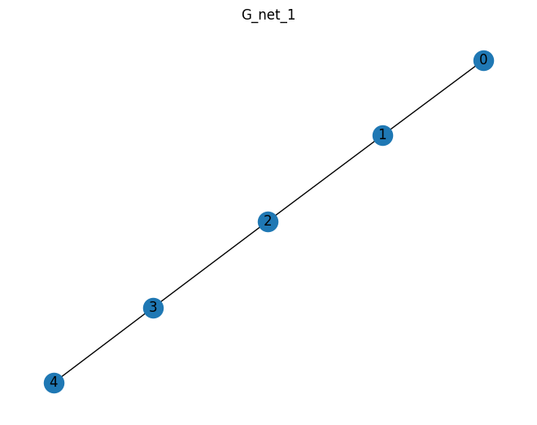
    


    T огр =  100
    t =  1000
    ---------------------------
    1  решение
    f 0.9045848321042758
    Нагруженность на узлы [510, 1000, 1000, 0, 0]
    Производительность [100, 100, 100, 100, 100]
    D [0.204, 0.4, 0.2, 0.0, 0.0]
    T_task [50.0, 50.0]
    T_NET [25.0, 25.0, 50.0, 0, 0]
    Распределение [[0], [], [1], [], []]
    Задача1задача2:ПутьВГрафеСети {'01': [0, 1, 2]}
    кр путь [0, 1]
    t 50.0
    epsilon [1, 1, 1, 1, 1]
    ---------------------------
    2  решение
    f 0.5820932893792801
    Нагруженность на узлы [510, 1000, 1000, 1000, 1000]
    Производительность [100, 100, 100, 100, 100]
    D [0.408, 0.8, 0.8, 0.8, 0.2]
    T_task [50.0, 50.0]
    T_NET [12.5, 12.5, 12.5, 12.5, 50.0]
    Распределение [[0], [], [], [], [1]]
    Задача1задача2:ПутьВГрафеСети {'01': [0, 1, 2, 3, 4]}
    кр путь [0, 1]
    t 50.0
    epsilon [1, 1, 1, 1, 1]
    ---------------------------
    3  решение
    f 0.9377794346191205
    Нагруженность на узлы [510, 1000, 0, 0, 0]
    Производительность [100, 100, 100, 100, 100]
    D [0.102, 0.2, 0.0, 0.0, 0.0]
    T_task [50.0, 50.0]
    T_NET [50.0, 50.0, 0, 0, 0]
    Распределение [[0], [1], [], [], []]
    Задача1задача2:ПутьВГрафеСети {'01': [0, 1]}
    кр путь [0, 1]
    t 50.0
    epsilon [1, 1, 1, 1, 1]
    ---------------------------
    4  решение
    f 0.9493921346661919
    Нагруженность на узлы [510, 0, 0, 0, 0]
    Производительность [100, 100, 100, 100, 100]
    D [0.051, 0.0, 0.0, 0.0, 0.0]
    T_task [50.0, 50.0]
    T_NET [100.0, 0, 0, 0, 0]
    Распределение [[0, 1], [], [], [], []]
    Задача1задача2:ПутьВГрафеСети {'01': [0]}
    кр путь [0, 1]
    t 50.0
    epsilon [1, 1, 1, 1, 1]
    ---------------------------
    После оптимизации
    f 0.9493921346661919
    Нагруженность на узлы [510, 0, 0, 0, 0]
    Производительность [100, 100, 100, 100, 100]
    D [0.051, 0.0, 0.0, 0.0, 0.0]
    T_task [50.0, 50.0]
    T_NET [100.0, 0, 0, 0, 0]
    Распределение [[0, 1], [], [], [], []]
    Задача1задача2:ПутьВГрафеСети {'01': [0]}
    кр путь [0, 1]
    t 50.0
    epsilon [1, 1, 1, 1, 1]
    ---------------------------


```python
pos = nx.planar_layout(G_task_1)
nx.draw(G_task_1, pos, with_labels=True)
nx.draw_networkx_edge_labels(G_task_1, pos, {(x, y): z['weight'] for (x, y, z) in nx.to_edgelist(G_task_1)},font_color='red')
plt.title('G_task_1')
plt.show()

nx.draw(G_net_2, with_labels=True)
plt.title('G_net_2')
plt.show()

print("T огр = ", T_lim)
print("t = ", Time)

HISTORY = []
while len(HISTORY) < 4: 
    RES_ , HISTORY = random_search(10_000, G_net_2, G_task_1, net_2_power, task_1_weight, epsi_1, {0:0})

for i in range(4):
    print("---------------------------")
    print(i+1,' решение')
    for x, y in [x for x in HISTORY if x['f'] > 0][i].items():
        if x == "res":
            for x1, y1 in y.items():
                print(x1, y1)
        else:
            print(x, y)
print("---------------------------")
print("После оптимизации")
for x, y in RES_.items():
    if x == "res":
        for x1, y1 in y.items():
            print(x1, y1)
    else:
        print(x, y)
print("---------------------------")
```


    
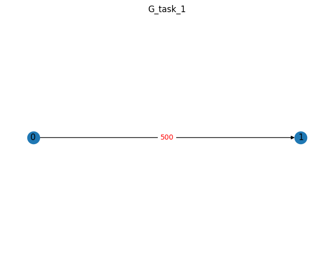
    


    
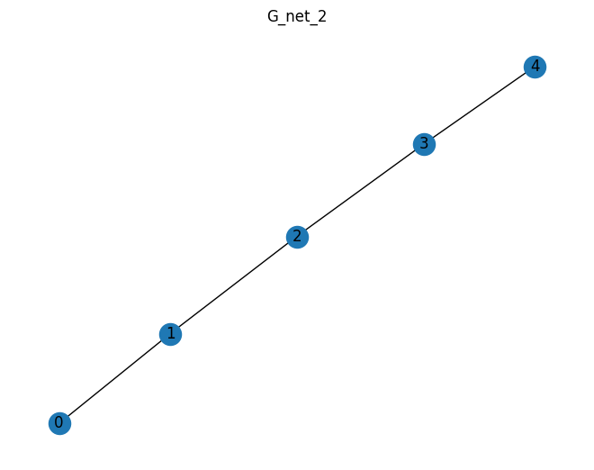
    


    T огр =  100
    t =  1000
    ---------------------------
    1  решение
    f 0.929713876271712
    Нагруженность на узлы [510, 1000, 1000, 0, 0]
    Производительность [100, 200, 300, 400, 500]
    D [0.204, 0.2, 0.06666666666666667, 0.0, 0.0]
    T_task [50.0, 50.0]
    T_NET [25.0, 25.0, 50.0, 0, 0]
    Распределение [[0], [], [1], [], []]
    Задача1задача2:ПутьВГрафеСети {'01': [0, 1, 2]}
    кр путь [0, 1]
    t 50.0
    epsilon [1, 1, 1, 1, 1]
    ---------------------------
    2  решение
    f 0.8712642531508668
    Нагруженность на узлы [510, 1000, 1000, 1000, 1000]
    Производительность [100, 200, 300, 400, 500]
    D [0.408, 0.4, 0.26666666666666666, 0.2, 0.04]
    T_task [50.0, 50.0]
    T_NET [12.5, 12.5, 12.5, 12.5, 50.0]
    Распределение [[0], [], [], [], [1]]
    Задача1задача2:ПутьВГрафеСети {'01': [0, 1, 2, 3, 4]}
    кр путь [0, 1]
    t 50.0
    epsilon [1, 1, 1, 1, 1]
    ---------------------------
    3  решение
    f 0.9493921346661919
    Нагруженность на узлы [510, 0, 0, 0, 0]
    Производительность [100, 200, 300, 400, 500]
    D [0.051, 0.0, 0.0, 0.0, 0.0]
    T_task [50.0, 50.0]
    T_NET [100.0, 0, 0, 0, 0]
    Распределение [[0, 1], [], [], [], []]
    Задача1задача2:ПутьВГрафеСети {'01': [0]}
    кр путь [0, 1]
    t 50.0
    epsilon [1, 1, 1, 1, 1]
    ---------------------------
    4  решение
    f 0.943288940576626
    Нагруженность на узлы [510, 1000, 0, 0, 0]
    Производительность [100, 200, 300, 400, 500]
    D [0.102, 0.1, 0.0, 0.0, 0.0]
    T_task [50.0, 50.0]
    T_NET [50.0, 50.0, 0, 0, 0]
    Распределение [[0], [1], [], [], []]
    Задача1задача2:ПутьВГрафеСети {'01': [0, 1]}
    кр путь [0, 1]
    t 50.0
    epsilon [1, 1, 1, 1, 1]
    ---------------------------
    После оптимизации
    f 0.9493921346661919
    Нагруженность на узлы [510, 0, 0, 0, 0]
    Производительность [100, 200, 300, 400, 500]
    D [0.051, 0.0, 0.0, 0.0, 0.0]
    T_task [50.0, 50.0]
    T_NET [100.0, 0, 0, 0, 0]
    Распределение [[0, 1], [], [], [], []]
    Задача1задача2:ПутьВГрафеСети {'01': [0]}
    кр путь [0, 1]
    t 50.0
    epsilon [1, 1, 1, 1, 1]
    ---------------------------


```python
pos = nx.planar_layout(G_task_2)
nx.draw(G_task_2, pos, with_labels=True)
nx.draw_networkx_edge_labels(G_task_2, pos, {(x, y): z['weight'] for (x, y, z) in nx.to_edgelist(G_task_2)},font_color='red')
plt.title('G_task_2')
plt.show()

nx.draw(G_net_1, with_labels=True)
plt.title('G_net_1')
plt.show()

print("T огр = ", T_lim)
print("t = ", Time)

HISTORY = []
while len(HISTORY) < 4: 
    RES_ , HISTORY = random_search(10_000, G_net_1, G_task_2, net_2_power, task_2_weight, epsi_1, {0:0})

for i in range(4):
    print("---------------------------")
    print(i+1,' решение')
    for x, y in [x for x in HISTORY if x['f'] > 0][i].items():
        if x == "res":
            for x1, y1 in y.items():
                print(x1, y1)
        else:
            print(x, y)
            
print("---------------------------")
print("После оптимизации")
for x, y in RES_.items():
    if x == "res":
        for x1, y1 in y.items():
            print(x1, y1)
    else:
        print(x, y)
print("---------------------------")
```


    
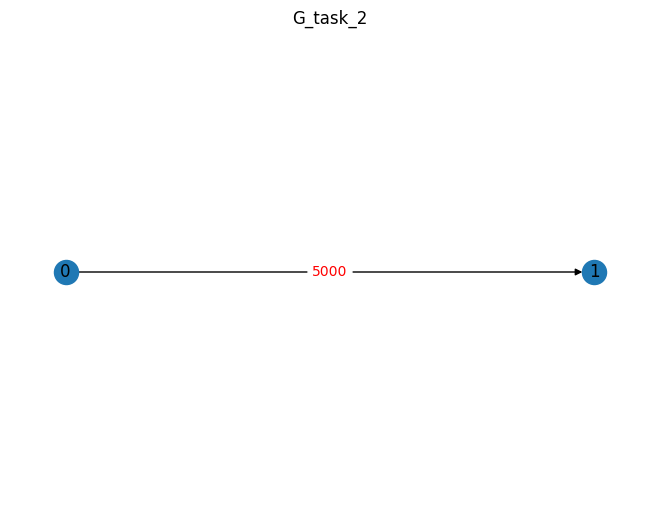
    


    
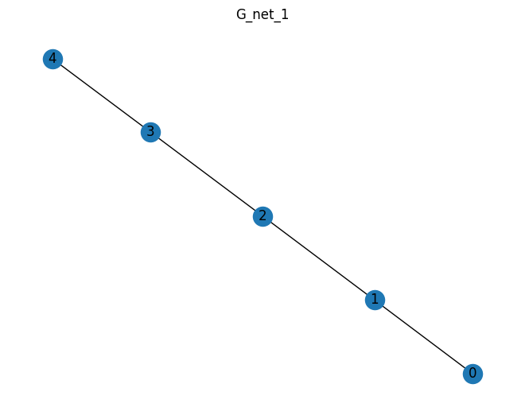
    


    T огр =  100
    t =  1000
    ---------------------------
    1  решение
    f 0.9493921346661919
    Нагруженность на узлы [510, 0, 0, 0, 0]
    Производительность [100, 200, 300, 400, 500]
    D [0.051, 0.0, 0.0, 0.0, 0.0]
    T_task [50.0, 50.0]
    T_NET [100.0, 0, 0, 0, 0]
    Распределение [[0, 1], [], [], [], []]
    Задача1задача2:ПутьВГрафеСети {'01': [0]}
    кр путь [0, 1]
    t 50.0
    epsilon [1, 1, 1, 1, 1]
    ---------------------------
    2  решение
    f 0.9493921346661919
    Нагруженность на узлы [510, 0, 0, 0, 0]
    Производительность [100, 200, 300, 400, 500]
    D [0.051, 0.0, 0.0, 0.0, 0.0]
    T_task [50.0, 50.0]
    T_NET [100.0, 0, 0, 0, 0]
    Распределение [[0, 1], [], [], [], []]
    Задача1задача2:ПутьВГрафеСети {'01': [0]}
    кр путь [0, 1]
    t 50.0
    epsilon [1, 1, 1, 1, 1]
    ---------------------------
    3  решение
    f 0.9493921346661919
    Нагруженность на узлы [510, 0, 0, 0, 0]
    Производительность [100, 200, 300, 400, 500]
    D [0.051, 0.0, 0.0, 0.0, 0.0]
    T_task [50.0, 50.0]
    T_NET [100.0, 0, 0, 0, 0]
    Распределение [[0, 1], [], [], [], []]
    Задача1задача2:ПутьВГрафеСети {'01': [0]}
    кр путь [0, 1]
    t 50.0
    epsilon [1, 1, 1, 1, 1]
    ---------------------------
    4  решение
    f 0.9493921346661919
    Нагруженность на узлы [510, 0, 0, 0, 0]
    Производительность [100, 200, 300, 400, 500]
    D [0.051, 0.0, 0.0, 0.0, 0.0]
    T_task [50.0, 50.0]
    T_NET [100.0, 0, 0, 0, 0]
    Распределение [[0, 1], [], [], [], []]
    Задача1задача2:ПутьВГрафеСети {'01': [0]}
    кр путь [0, 1]
    t 50.0
    epsilon [1, 1, 1, 1, 1]
    ---------------------------
    После оптимизации
    f 0.9493921346661919
    Нагруженность на узлы [510, 0, 0, 0, 0]
    Производительность [100, 200, 300, 400, 500]
    D [0.051, 0.0, 0.0, 0.0, 0.0]
    T_task [50.0, 50.0]
    T_NET [100.0, 0, 0, 0, 0]
    Распределение [[0, 1], [], [], [], []]
    Задача1задача2:ПутьВГрафеСети {'01': [0]}
    кр путь [0, 1]
    t 50.0
    epsilon [1, 1, 1, 1, 1]
    ---------------------------


```python
pos = nx.planar_layout(G_task_2)
nx.draw(G_task_2, pos, with_labels=True)
nx.draw_networkx_edge_labels(G_task_2, pos, {(x, y): z['weight'] for (x, y, z) in nx.to_edgelist(G_task_2)},font_color='red')
plt.title('G_task_2')
plt.show()

nx.draw(G_net_2, with_labels=True)
plt.title('G_net_2')
plt.show()

print("T огр = ", T_lim)
print("t = ", Time)

HISTORY = []
while len(HISTORY) < 4: 
    RES_ , HISTORY = random_search(10_000, G_net_2, G_task_2, net_2_power, task_2_weight, epsi_1, {0:0})

for i in range(4):
    print("---------------------------")
    print(i+1,' решение')
    for x, y in [x for x in HISTORY if x['f'] > 0][i].items():
        if x == "res":
            for x1, y1 in y.items():
                print(x1, y1)
        else:
            print(x, y)
print("---------------------------")
print("После оптимизации")
for x, y in RES_.items():
    if x == "res":
        for x1, y1 in y.items():
            print(x1, y1)
    else:
        print(x, y)
print("---------------------------")
```


    

    


    
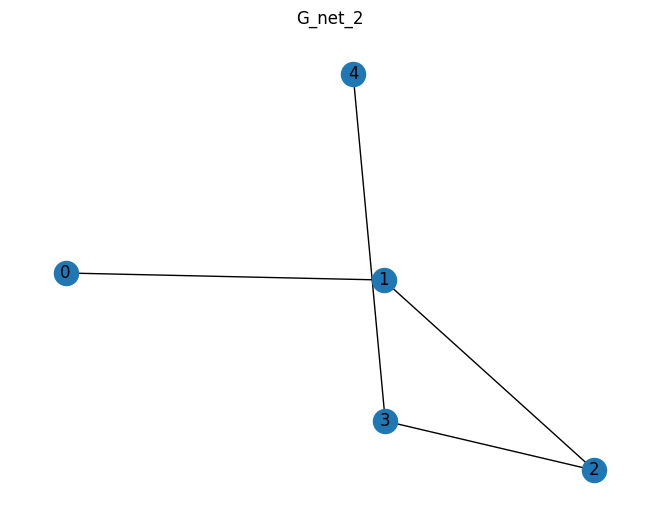
    


    T огр =  100
    t =  1000
    ---------------------------
    1  решение
    f 0.9493921346661919
    Нагруженность на узлы [510, 0, 0, 0, 0]
    Производительность [100, 200, 300, 400, 500]
    D [0.051, 0.0, 0.0, 0.0, 0.0]
    T_task [50.0, 50.0]
    T_NET [100.0, 0, 0, 0, 0]
    Распределение [[0, 1], [], [], [], []]
    Задача1задача2:ПутьВГрафеСети {'01': [0]}
    кр путь [0, 1]
    t 50.0
    epsilon [1, 1, 1, 1, 1]
    ---------------------------
    2  решение
    f 0.9493921346661919
    Нагруженность на узлы [510, 0, 0, 0, 0]
    Производительность [100, 200, 300, 400, 500]
    D [0.051, 0.0, 0.0, 0.0, 0.0]
    T_task [50.0, 50.0]
    T_NET [100.0, 0, 0, 0, 0]
    Распределение [[0, 1], [], [], [], []]
    Задача1задача2:ПутьВГрафеСети {'01': [0]}
    кр путь [0, 1]
    t 50.0
    epsilon [1, 1, 1, 1, 1]
    ---------------------------
    3  решение
    f 0.9493921346661919
    Нагруженность на узлы [510, 0, 0, 0, 0]
    Производительность [100, 200, 300, 400, 500]
    D [0.051, 0.0, 0.0, 0.0, 0.0]
    T_task [50.0, 50.0]
    T_NET [100.0, 0, 0, 0, 0]
    Распределение [[0, 1], [], [], [], []]
    Задача1задача2:ПутьВГрафеСети {'01': [0]}
    кр путь [0, 1]
    t 50.0
    epsilon [1, 1, 1, 1, 1]
    ---------------------------
    4  решение
    f 0.9493921346661919
    Нагруженность на узлы [510, 0, 0, 0, 0]
    Производительность [100, 200, 300, 400, 500]
    D [0.051, 0.0, 0.0, 0.0, 0.0]
    T_task [50.0, 50.0]
    T_NET [100.0, 0, 0, 0, 0]
    Распределение [[0, 1], [], [], [], []]
    Задача1задача2:ПутьВГрафеСети {'01': [0]}
    кр путь [0, 1]
    t 50.0
    epsilon [1, 1, 1, 1, 1]
    ---------------------------
    После оптимизации
    f 0.9493921346661919
    Нагруженность на узлы [510, 0, 0, 0, 0]
    Производительность [100, 200, 300, 400, 500]
    D [0.051, 0.0, 0.0, 0.0, 0.0]
    T_task [50.0, 50.0]
    T_NET [100.0, 0, 0, 0, 0]
    Распределение [[0, 1], [], [], [], []]
    Задача1задача2:ПутьВГрафеСети {'01': [0]}
    кр путь [0, 1]
    t 50.0
    epsilon [1, 1, 1, 1, 1]
    ---------------------------


```python
pos = nx.planar_layout(G_task_3)
nx.draw(G_task_3, pos, with_labels=True)
nx.draw_networkx_edge_labels(G_task_3, pos, {(x, y): z['weight'] for (x, y, z) in nx.to_edgelist(G_task_3)},font_color='red')
plt.title('G_task_3')
plt.show()

nx.draw(G_net_3, with_labels=True)
plt.title('G_net_3')
plt.show()

print("T огр = ", T_lim)
print("t = ", Time)

RES_ , HISTORY = random_search(10_000, G_net_3, G_task_3, net_3_power, task_3_weight, epsi_3, {0:0})

print("---------------------------")
print('1 решение')
for x, y in [x for x in HISTORY if x['f'] > 0][0].items():
    if x == "res":
        for x1, y1 in y.items():
            print(x1, y1)
    else:
        print(x, y)
print("---------------------------")
print("После оптимизации")
for x, y in RES_.items():
    if x == "res":
        for x1, y1 in y.items():
            print(x1, y1)
    else:
        print(x, y)
print("---------------------------")
```


    
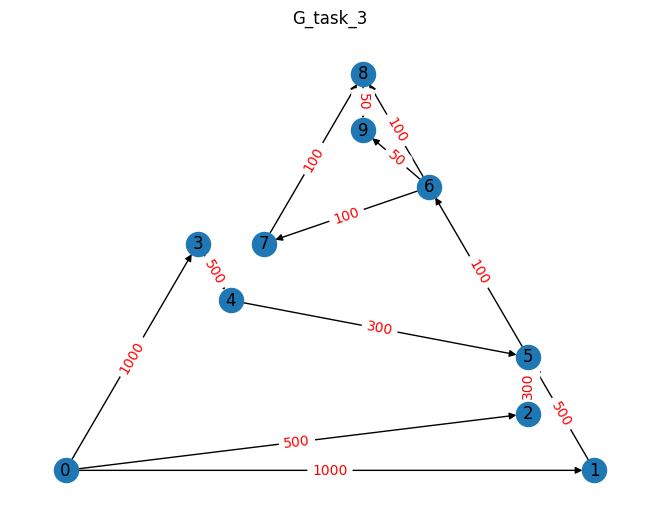
    


    
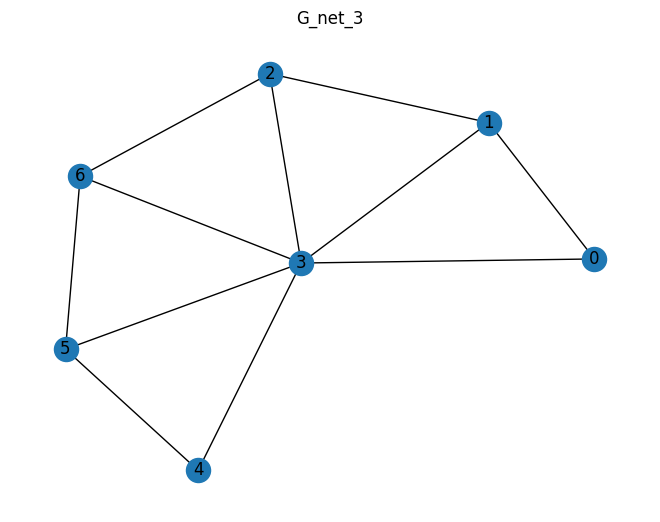
    


    T огр =  100
    t =  1000
    ---------------------------
    1 решение
    f 0.749777798167498
    Нагруженность на узлы [3200, 2900, 1200, 2950, 850, 400, 300]
    Производительность [500, 500, 200, 200, 500, 500, 1000]
    D [0.512, 0.464, 0.48, 0.59, 0.272, 0.064, 0.024]
    T_task [12.5, 25.0, 25.0, 12.5, 12.5, 12.5, 12.5, 12.5, 12.5, 12.5]
    T_NET [12.5, 12.5, 12.5, 25.0, 6.25, 12.5, 12.5]
    Распределение [[0, 2], [5, 1], [4], [3, 6], [8], [7], [9]]
    Задача1задача2:ПутьВГрафеСети {'01': [0, 1], '02': [0], '03': [0, 3], '15': [1], '25': [0, 1], '34': [3, 2], '45': [2, 1], '56': [1, 3], '67': [3, 5], '68': [3, 4], '69': [3, 6], '78': [5, 4], '89': [4, 3, 6]}
    кр путь [0, 3, 4, 5, 6, 7, 8, 9]
    t 12.5
    epsilon [1, 1, 1, 1, 1, 1, 1]
    ---------------------------
    После оптимизации
    f 0.9035810164695264
    Нагруженность на узлы [3600, 1200, 0, 1500, 0, 400, 0]
    Производительность [500, 500, 200, 200, 500, 500, 1000]
    D [0.192, 0.192, 0.0, 0.2, 0.0, 0.064, 0.0]
    T_task [12.5, 25.0, 25.0, 12.5, 12.5, 12.5, 12.5, 12.5, 12.5, 12.5]
    T_NET [37.5, 12.5, 0, 37.5, 0, 12.5, 0]
    Распределение [[0, 2, 1, 5, 3], [4], [], [6, 9, 8], [], [7], []]
    Задача1задача2:ПутьВГрафеСети {'01': [0], '02': [0], '03': [0], '15': [0], '25': [0], '34': [0, 1], '45': [1, 0], '56': [0, 3], '67': [3, 5], '68': [3], '69': [3], '78': [5, 3], '89': [3]}
    кр путь [0, 3, 4, 5, 6, 7, 8, 9]
    t 12.5
    epsilon [1, 1, 1, 1, 1, 1, 1]
    ---------------------------


```python

```
