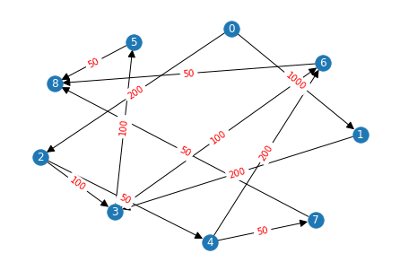
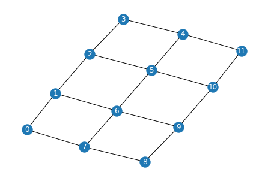
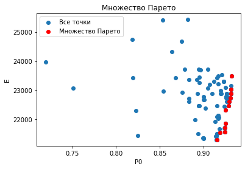

# Результат

# NSGA-II
    Cвертка : 41.07535,
    ВБР: 0.9291244649698247, Энергопотребление : 22620.0,
    Распределение: [[], [], [9, 6], [8, 7], [], [5], [2], [], [], [3, 0, 1], [4], []],  
    Нагруженность на узлы: [0, 0, 950, 1050, 0, 1800, 1400, 0, 0, 3000, 2200, 0],  
    Производительность узлов: [300, 300, 300, 300, 300, 300, 300, 300, 300, 300, 300, 300] 
    трудоемкость задач: [100, 300, 300, 300, 200, 150, 100, 100, 200, 100] 
    D [0.0, 0.0, 0.1688888888888889, 0.18666666666666668, 0.0, 0.32, 0.12444444444444444, 0.0, 0.0, 0.5333333333333333, 0.39111111111111113, 0.0] 
    Сколько времени уделено задаче (T_task) [18.75, 37.5, 37.5, 18.75, 18.75, 18.75, 18.75, 18.75, 18.75, 18.75] 
    Сколько времени работает узел (T_NET) [0, 0, 37.5, 37.5, 0, 18.75, 37.5, 0, 0, 37.5, 18.75, 0]  
    Энергопотребление на каждый узел (Ei) : [10.0, 10.0, 25.200000000000003, 26.8, 10.0, 38.8, 21.2, 10.0, 10.0, 58.0, 45.2, 10.0]

    Кратчайший путь (short_path) [0, 3, 4, 5, 6, 7, 8, 9] 
    # Сколько каждый узел должен обработать задач  
    [0, 0, 750, 700, 0, 950, 400, 0, 0, 1500, 500, 0] 
    # Сколько каждый узел должен отправить 
    [0, 0, 200, 50, 0, 100, 300, 0, 0, 1500, 800, 0]  
    # Сколько каждый узел должен принять  
    [0, 0, 150, 200, 0, 1100, 500, 0, 0, 0, 1000, 0] 
    'Задача1задача2:ПутьВГрафеСети {'01': [9], '02': [9, 6], '03': [9], '15': [9, 10, 5], '25': [6, 5], '34': [9, 10], '45': [10, 5], '56': [5, 2], '67': [2, 3], '68': [2, 3], '69': [2], '78': [3], '89': [3, 2]}'  

    Cвертка : 38.88525,
    ВБР: 0.8830840623841891, Энергопотребление : 22710.0,
    Распределение: [[], [], [], [8], [7, 9, 6], [5], [2, 0], [], [], [3, 1], [4], []],  
    Нагруженность на узлы: [0, 0, 0, 850, 1150, 1800, 4200, 0, 0, 4200, 1200, 0],  
    Производительность узлов: [300, 300, 300, 300, 300, 300, 300, 300, 300, 300, 300, 300] 
    трудоемкость задач: [100, 300, 300, 300, 200, 150, 100, 100, 200, 100] 
    D [0.0, 0.0, 0.0, 0.1511111111111111, 0.20444444444444446, 0.32, 0.7466666666666667, 0.0, 0.0, 0.7466666666666667, 0.21333333333333335, 0.0] 
    Сколько времени уделено задаче (T_task) [18.75, 37.5, 37.5, 18.75, 18.75, 18.75, 18.75, 18.75, 18.75, 18.75] 
    Сколько времени работает узел (T_NET) [0, 0, 0, 18.75, 56.25, 18.75, 18.75, 0, 0, 18.75, 18.75, 0]  
    Энергопотребление на каждый узел (Ei) : [10.0, 10.0, 10.0, 23.6, 28.400000000000002, 38.8, 77.2, 10.0, 10.0, 77.2, 29.200000000000003, 10.0]

    Кратчайший путь (short_path) [0, 3, 4, 5, 6, 7, 8, 9] 
    # Сколько каждый узел должен обработать задач  
    [0, 0, 0, 400, 950, 950, 900, 0, 0, 800, 500, 0] 
    # Сколько каждый узел должен отправить 
    [0, 0, 0, 50, 200, 100, 2800, 0, 0, 1000, 300, 0]  
    # Сколько каждый узел должен принять  
    [0, 0, 0, 200, 150, 1100, 500, 0, 0, 2000, 500, 0] 
    'Задача1задача2:ПутьВГрафеСети {'01': [6, 9], '02': [6], '03': [6, 9], '15': [9, 6, 5], '25': [6, 5], '34': [9, 10], '45': [10, 5], '56': [5, 4], '67': [4], '68': [4, 3], '69': [4], '78': [4, 3], '89': [3, 4]}'      
    
# Парейто фронт
    
    Cвертка : 41.07535,
    ВБР: 0.9291244649698247, Энергопотребление : 22620.0,
    Распределение: [[], [], [9, 6], [8, 7], [], [5], [2], [], [], [3, 0, 1], [4], []],  
    Нагруженность на узлы: [0, 0, 950, 1050, 0, 1800, 1400, 0, 0, 3000, 2200, 0],  
    Производительность узлов: [300, 300, 300, 300, 300, 300, 300, 300, 300, 300, 300, 300] 
    трудоемкость задач: [100, 300, 300, 300, 200, 150, 100, 100, 200, 100] 
    D [0.0, 0.0, 0.1688888888888889, 0.18666666666666668, 0.0, 0.32, 0.12444444444444444, 0.0, 0.0, 0.5333333333333333, 0.39111111111111113, 0.0] 
    Сколько времени уделено задаче (T_task) [18.75, 37.5, 37.5, 18.75, 18.75, 18.75, 18.75, 18.75, 18.75, 18.75] 
    Сколько времени работает узел (T_NET) [0, 0, 37.5, 37.5, 0, 18.75, 37.5, 0, 0, 37.5, 18.75, 0]  
    Энергопотребление на каждый узел (Ei) : [10.0, 10.0, 25.200000000000003, 26.8, 10.0, 38.8, 21.2, 10.0, 10.0, 58.0, 45.2, 10.0]

    Кратчайший путь (short_path) [0, 3, 4, 5, 6, 7, 8, 9] 
    # Сколько каждый узел должен обработать задач  
    [0, 0, 750, 700, 0, 950, 400, 0, 0, 1500, 500, 0] 
    # Сколько каждый узел должен отправить 
    [0, 0, 200, 50, 0, 100, 300, 0, 0, 1500, 800, 0]  
    # Сколько каждый узел должен принять  
    [0, 0, 150, 200, 0, 1100, 500, 0, 0, 0, 1000, 0] 
    'Задача1задача2:ПутьВГрафеСети {'01': [9], '02': [9, 6], '03': [9], '15': [9, 10, 5], '25': [6, 5], '34': [9, 10], '45': [10, 5], '56': [5, 2], '67': [2, 3], '68': [2, 3], '69': [2], '78': [3], '89': [3, 2]}'    

    Cвертка : 40.43515,
    ВБР: 0.9316258934321543, Энергопотребление : 23040.0,
    Распределение: [[], [], [8, 7, 6], [9], [], [5], [1, 2], [], [], [0, 3], [4], []],  
    Нагруженность на узлы: [0, 0, 1400, 300, 0, 1800, 3500, 0, 0, 2900, 1200, 0],  
    Производительность узлов: [300, 300, 300, 300, 300, 300, 300, 300, 300, 300, 300, 300] 
    трудоемкость задач: [100, 300, 300, 300, 200, 150, 100, 100, 200, 100] 
    D [0.0, 0.0, 0.24888888888888888, 0.05333333333333334, 0.0, 0.32, 0.3111111111111111, 0.0, 0.0, 0.5155555555555555, 0.21333333333333335, 0.0] 
    Сколько времени уделено задаче (T_task) [18.75, 37.5, 37.5, 18.75, 18.75, 18.75, 18.75, 18.75, 18.75, 18.75] 
    Сколько времени работает узел (T_NET) [0, 0, 56.25, 18.75, 0, 18.75, 37.5, 0, 0, 37.5, 18.75, 0]  
    Энергопотребление на каждый узел (Ei) : [10.0, 10.0, 32.4, 14.8, 10.0, 38.8, 38.0, 10.0, 10.0, 56.4, 29.200000000000003, 10.0]

    Кратчайший путь (short_path) [0, 3, 4, 5, 6, 7, 8, 9] 
    # Сколько каждый узел должен обработать задач  
    [0, 0, 1250, 300, 0, 950, 800, 0, 0, 900, 500, 0] 
    # Сколько каждый узел должен отправить 
    [0, 0, 100, 0, 0, 100, 800, 0, 0, 2000, 300, 0]  
    # Сколько каждый узел должен принять  
    [0, 0, 100, 100, 0, 1100, 1500, 0, 0, 0, 500, 0] 
    'Задача1задача2:ПутьВГрафеСети {'01': [9, 6], '02': [9, 6], '03': [9], '15': [6, 5], '25': [6, 5], '34': [9, 10], '45': [10, 5], '56': [5, 2], '67': [2], '68': [2], '69': [2, 3], '78': [2], '89': [2, 3]}'    

    Cвертка : 39.66677,
    ВБР: 0.9317725129005804, Энергопотребление : 23490.0,
    Распределение: [[], [], [9, 6, 8, 7], [], [], [5], [2, 1], [], [], [0, 3], [4], []],  
    Нагруженность на узлы: [0, 0, 1500, 0, 0, 1800, 3500, 0, 0, 2900, 1200, 0],  
    Производительность узлов: [300, 300, 300, 300, 300, 300, 300, 300, 300, 300, 300, 300] 
    трудоемкость задач: [100, 300, 300, 300, 200, 150, 100, 100, 200, 100] 
    D [0.0, 0.0, 0.26666666666666666, 0.0, 0.0, 0.32, 0.3111111111111111, 0.0, 0.0, 0.5155555555555555, 0.21333333333333335, 0.0] 
    Сколько времени уделено задаче (T_task) [18.75, 37.5, 37.5, 18.75, 18.75, 18.75, 18.75, 18.75, 18.75, 18.75] 
    Сколько времени работает узел (T_NET) [0, 0, 75.0, 0, 0, 18.75, 37.5, 0, 0, 37.5, 18.75, 0]  
    Энергопотребление на каждый узел (Ei) : [10.0, 10.0, 34.0, 10.0, 10.0, 38.8, 38.0, 10.0, 10.0, 56.4, 29.200000000000003, 10.0]

    Кратчайший путь (short_path) [0, 3, 4, 5, 6, 7, 8, 9] 
    # Сколько каждый узел должен обработать задач  
    [0, 0, 1450, 0, 0, 950, 800, 0, 0, 900, 500, 0] 
    # Сколько каждый узел должен отправить 
    [0, 0, 0, 0, 0, 100, 800, 0, 0, 2000, 300, 0]  
    # Сколько каждый узел должен принять  
    [0, 0, 100, 0, 0, 1100, 1500, 0, 0, 0, 500, 0] 
    'Задача1задача2:ПутьВГрафеСети {'01': [9, 6], '02': [9, 6], '03': [9], '15': [6, 5], '25': [6, 5], '34': [9, 10], '45': [10, 5], '56': [5, 2], '67': [2], '68': [2], '69': [2], '78': [2], '89': [2]}'    

    Cвертка : 41.07535,
    ВБР: 0.9291244649698247, Энергопотребление : 22620.0,
    Распределение: [[], [], [7, 6], [9, 8], [], [5], [2], [], [], [0, 3, 1], [4], []],  
    Нагруженность на узлы: [0, 0, 950, 1050, 0, 1800, 1400, 0, 0, 3000, 2200, 0],  
    Производительность узлов: [300, 300, 300, 300, 300, 300, 300, 300, 300, 300, 300, 300] 
    трудоемкость задач: [100, 300, 300, 300, 200, 150, 100, 100, 200, 100] 
    D [0.0, 0.0, 0.1688888888888889, 0.18666666666666668, 0.0, 0.32, 0.12444444444444444, 0.0, 0.0, 0.5333333333333333, 0.39111111111111113, 0.0] 
    Сколько времени уделено задаче (T_task) [18.75, 37.5, 37.5, 18.75, 18.75, 18.75, 18.75, 18.75, 18.75, 18.75] 
    Сколько времени работает узел (T_NET) [0, 0, 37.5, 37.5, 0, 18.75, 37.5, 0, 0, 37.5, 18.75, 0]  
    Энергопотребление на каждый узел (Ei) : [10.0, 10.0, 25.200000000000003, 26.8, 10.0, 38.8, 21.2, 10.0, 10.0, 58.0, 45.2, 10.0]

    Кратчайший путь (short_path) [0, 3, 4, 5, 6, 7, 8, 9] 
    # Сколько каждый узел должен обработать задач  
    [0, 0, 650, 600, 0, 950, 400, 0, 0, 1500, 500, 0] 
    # Сколько каждый узел должен отправить 
    [0, 0, 250, 0, 0, 100, 300, 0, 0, 1500, 800, 0]  
    # Сколько каждый узел должен принять  
    [0, 0, 100, 250, 0, 1100, 500, 0, 0, 0, 1000, 0] 
    'Задача1задача2:ПутьВГрафеСети {'01': [9], '02': [9, 6], '03': [9], '15': [9, 10, 5], '25': [6, 5], '34': [9, 10], '45': [10, 5], '56': [5, 2], '67': [2], '68': [2, 3], '69': [2, 3], '78': [2, 3], '89': [3]}'    

    Cвертка : 41.33138,
    ВБР: 0.9287161491824625, Энергопотребление : 22470.0,
    Распределение: [[], [7], [6, 8], [9], [], [5], [2], [], [], [0, 1, 3], [4], []],  
    Нагруженность на узлы: [0, 400, 1400, 300, 0, 1800, 1400, 0, 0, 3000, 2200, 0],  
    Производительность узлов: [300, 300, 300, 300, 300, 300, 300, 300, 300, 300, 300, 300] 
    трудоемкость задач: [100, 300, 300, 300, 200, 150, 100, 100, 200, 100] 
    D [0.0, 0.07111111111111111, 0.24888888888888888, 0.05333333333333334, 0.0, 0.32, 0.12444444444444444, 0.0, 0.0, 0.5333333333333333, 0.39111111111111113, 0.0] 
    Сколько времени уделено задаче (T_task) [18.75, 37.5, 37.5, 18.75, 18.75, 18.75, 18.75, 18.75, 18.75, 18.75] 
    Сколько времени работает узел (T_NET) [0, 18.75, 37.5, 18.75, 0, 18.75, 37.5, 0, 0, 37.5, 18.75, 0]  
    Энергопотребление на каждый узел (Ei) : [10.0, 16.4, 32.4, 14.8, 10.0, 38.8, 21.2, 10.0, 10.0, 58.0, 45.2, 10.0]

    Кратчайший путь (short_path) [0, 3, 4, 5, 6, 7, 8, 9] 
    # Сколько каждый узел должен обработать задач  
    [0, 200, 950, 300, 0, 950, 400, 0, 0, 1500, 500, 0] 
    # Сколько каждый узел должен отправить 
    [0, 100, 200, 0, 0, 100, 300, 0, 0, 1500, 800, 0]  
    # Сколько каждый узел должен принять  
    [0, 100, 200, 100, 0, 1100, 500, 0, 0, 0, 1000, 0] 
    'Задача1задача2:ПутьВГрафеСети {'01': [9], '02': [9, 6], '03': [9], '15': [9, 10, 5], '25': [6, 5], '34': [9, 10], '45': [10, 5], '56': [5, 2], '67': [2, 1], '68': [2], '69': [2, 3], '78': [1, 2], '89': [2, 3]}'    

    Cвертка : 42.57091,
    ВБР: 0.9246400968895908, Энергопотребление : 21720.0,
    Распределение: [[], [], [6, 7], [8, 9], [], [5], [1, 2, 0], [], [], [3], [4], []],  
    Нагруженность на узлы: [0, 0, 950, 1050, 0, 1800, 3300, 0, 0, 2100, 1200, 0],  
    Производительность узлов: [300, 300, 300, 300, 300, 300, 300, 300, 300, 300, 300, 300] 
    трудоемкость задач: [100, 300, 300, 300, 200, 150, 100, 100, 200, 100] 
    D [0.0, 0.0, 0.1688888888888889, 0.18666666666666668, 0.0, 0.32, 0.5866666666666667, 0.0, 0.0, 0.37333333333333335, 0.21333333333333335, 0.0] 
    Сколько времени уделено задаче (T_task) [18.75, 37.5, 37.5, 18.75, 18.75, 18.75, 18.75, 18.75, 18.75, 18.75] 
    Сколько времени работает узел (T_NET) [0, 0, 37.5, 37.5, 0, 18.75, 18.75, 0, 0, 18.75, 18.75, 0]  
    Энергопотребление на каждый узел (Ei) : [10.0, 10.0, 25.200000000000003, 26.8, 10.0, 38.8, 62.8, 10.0, 10.0, 43.6, 29.200000000000003, 10.0]

    Кратчайший путь (short_path) [0, 3, 4, 5, 6, 7, 8, 9] 
    # Сколько каждый узел должен обработать задач  
    [0, 0, 650, 600, 0, 950, 1500, 0, 0, 400, 500, 0] 
    # Сколько каждый узел должен отправить 
    [0, 0, 250, 0, 0, 100, 1800, 0, 0, 500, 300, 0]  
    # Сколько каждый узел должен принять  
    [0, 0, 100, 250, 0, 1100, 0, 0, 0, 1000, 500, 0] 
    'Задача1задача2:ПутьВГрафеСети {'01': [6], '02': [6], '03': [6, 9], '15': [6, 5], '25': [6, 5], '34': [9, 10], '45': [10, 5], '56': [5, 2], '67': [2], '68': [2, 3], '69': [2, 3], '78': [2, 3], '89': [3]}'    

    Cвертка : 41.07535,
    ВБР: 0.9291244649698247, Энергопотребление : 22620.0,
    Распределение: [[], [9, 8], [6, 7], [], [], [5], [2], [], [], [0, 3, 1], [4], []],  
    Нагруженность на узлы: [0, 1050, 950, 0, 0, 1800, 1400, 0, 0, 3000, 2200, 0],  
    Производительность узлов: [300, 300, 300, 300, 300, 300, 300, 300, 300, 300, 300, 300] 
    трудоемкость задач: [100, 300, 300, 300, 200, 150, 100, 100, 200, 100] 
    D [0.0, 0.18666666666666668, 0.1688888888888889, 0.0, 0.0, 0.32, 0.12444444444444444, 0.0, 0.0, 0.5333333333333333, 0.39111111111111113, 0.0] 
    Сколько времени уделено задаче (T_task) [18.75, 37.5, 37.5, 18.75, 18.75, 18.75, 18.75, 18.75, 18.75, 18.75] 
    Сколько времени работает узел (T_NET) [0, 37.5, 37.5, 0, 0, 18.75, 37.5, 0, 0, 37.5, 18.75, 0]  
    Энергопотребление на каждый узел (Ei) : [10.0, 26.8, 25.200000000000003, 10.0, 10.0, 38.8, 21.2, 10.0, 10.0, 58.0, 45.2, 10.0]

    Кратчайший путь (short_path) [0, 3, 4, 5, 6, 7, 8, 9] 
    # Сколько каждый узел должен обработать задач  
    [0, 600, 650, 0, 0, 950, 400, 0, 0, 1500, 500, 0] 
    # Сколько каждый узел должен отправить 
    [0, 0, 250, 0, 0, 100, 300, 0, 0, 1500, 800, 0]  
    # Сколько каждый узел должен принять  
    [0, 250, 100, 0, 0, 1100, 500, 0, 0, 0, 1000, 0] 
    'Задача1задача2:ПутьВГрафеСети {'01': [9], '02': [9, 6], '03': [9], '15': [9, 10, 5], '25': [6, 5], '34': [9, 10], '45': [10, 5], '56': [5, 2], '67': [2], '68': [2, 1], '69': [2, 1], '78': [2, 1], '89': [1]}'    

    Cвертка : 42.57091,
    ВБР: 0.9246400968895908, Энергопотребление : 21720.0,
    Распределение: [[], [], [], [7, 8], [9, 6], [5], [1, 0, 2], [], [], [3], [4], []],  
    Нагруженность на узлы: [0, 0, 0, 1050, 950, 1800, 3300, 0, 0, 2100, 1200, 0],  
    Производительность узлов: [300, 300, 300, 300, 300, 300, 300, 300, 300, 300, 300, 300] 
    трудоемкость задач: [100, 300, 300, 300, 200, 150, 100, 100, 200, 100] 
    D [0.0, 0.0, 0.0, 0.18666666666666668, 0.1688888888888889, 0.32, 0.5866666666666667, 0.0, 0.0, 0.37333333333333335, 0.21333333333333335, 0.0] 
    Сколько времени уделено задаче (T_task) [18.75, 37.5, 37.5, 18.75, 18.75, 18.75, 18.75, 18.75, 18.75, 18.75] 
    Сколько времени работает узел (T_NET) [0, 0, 0, 37.5, 37.5, 18.75, 18.75, 0, 0, 18.75, 18.75, 0]  
    Энергопотребление на каждый узел (Ei) : [10.0, 10.0, 10.0, 26.8, 25.200000000000003, 38.8, 62.8, 10.0, 10.0, 43.6, 29.200000000000003, 10.0]

    Кратчайший путь (short_path) [0, 3, 4, 5, 6, 7, 8, 9] 
    # Сколько каждый узел должен обработать задач  
    [0, 0, 0, 700, 750, 950, 1500, 0, 0, 400, 500, 0] 
    # Сколько каждый узел должен отправить 
    [0, 0, 0, 50, 200, 100, 1800, 0, 0, 500, 300, 0]  
    # Сколько каждый узел должен принять  
    [0, 0, 0, 200, 150, 1100, 0, 0, 0, 1000, 500, 0] 
    'Задача1задача2:ПутьВГрафеСети {'01': [6], '02': [6], '03': [6, 9], '15': [6, 5], '25': [6, 5], '34': [9, 10], '45': [10, 5], '56': [5, 4], '67': [4, 3], '68': [4, 3], '69': [4], '78': [3], '89': [3, 4]}'    

    Cвертка : 42.63178,
    ВБР: 0.9189280746747525, Энергопотребление : 21555.0,
    Распределение: [[], [9, 8], [6], [7], [], [5], [2, 0, 1], [], [], [3], [4], []],  
    Нагруженность на узлы: [0, 1050, 950, 400, 0, 1800, 3300, 0, 0, 2100, 1200, 0],  
    Производительность узлов: [300, 300, 300, 300, 300, 300, 300, 300, 300, 300, 300, 300] 
    трудоемкость задач: [100, 300, 300, 300, 200, 150, 100, 100, 200, 100] 
    D [0.0, 0.18666666666666668, 0.3377777777777778, 0.14222222222222222, 0.0, 0.32, 0.5866666666666667, 0.0, 0.0, 0.37333333333333335, 0.21333333333333335, 0.0] 
    Сколько времени уделено задаче (T_task) [18.75, 37.5, 37.5, 18.75, 18.75, 18.75, 18.75, 18.75, 18.75, 18.75] 
    Сколько времени работает узел (T_NET) [0, 37.5, 9.375, 9.375, 0, 18.75, 18.75, 0, 0, 18.75, 18.75, 0]  
    Энергопотребление на каждый узел (Ei) : [10.0, 26.8, 40.400000000000006, 22.8, 10.0, 38.8, 62.8, 10.0, 10.0, 43.6, 29.200000000000003, 10.0]

    Кратчайший путь (short_path) [0, 3, 4, 5, 6, 7, 8, 9] 
    # Сколько каждый узел должен обработать задач  
    [0, 600, 450, 200, 0, 950, 1500, 0, 0, 400, 500, 0] 
    # Сколько каждый узел должен отправить 
    [0, 0, 350, 100, 0, 100, 1800, 0, 0, 500, 300, 0]  
    # Сколько каждый узел должен принять  
    [0, 250, 200, 100, 0, 1100, 0, 0, 0, 1000, 500, 0] 
    'Задача1задача2:ПутьВГрафеСети {'01': [6], '02': [6], '03': [6, 9], '15': [6, 5], '25': [6, 5], '34': [9, 10], '45': [10, 5], '56': [5, 2], '67': [2, 3], '68': [2, 1], '69': [2, 1], '78': [3, 2, 1], '89': [1]}'    

    Cвертка : 42.84811,
    ВБР: 0.9242337518158983, Энергопотребление : 21570.0,
    Распределение: [[], [9], [8, 6], [7], [], [5], [2, 1, 0], [], [], [3], [4], []],  
    Нагруженность на узлы: [0, 300, 1400, 400, 0, 1800, 3300, 0, 0, 2100, 1200, 0],  
    Производительность узлов: [300, 300, 300, 300, 300, 300, 300, 300, 300, 300, 300, 300] 
    трудоемкость задач: [100, 300, 300, 300, 200, 150, 100, 100, 200, 100] 
    D [0.0, 0.05333333333333334, 0.24888888888888888, 0.07111111111111111, 0.0, 0.32, 0.5866666666666667, 0.0, 0.0, 0.37333333333333335, 0.21333333333333335, 0.0] 
    Сколько времени уделено задаче (T_task) [18.75, 37.5, 37.5, 18.75, 18.75, 18.75, 18.75, 18.75, 18.75, 18.75] 
    Сколько времени работает узел (T_NET) [0, 18.75, 37.5, 18.75, 0, 18.75, 18.75, 0, 0, 18.75, 18.75, 0]  
    Энергопотребление на каждый узел (Ei) : [10.0, 14.8, 32.4, 16.4, 10.0, 38.8, 62.8, 10.0, 10.0, 43.6, 29.200000000000003, 10.0]

    Кратчайший путь (short_path) [0, 3, 4, 5, 6, 7, 8, 9] 
    # Сколько каждый узел должен обработать задач  
    [0, 300, 950, 200, 0, 950, 1500, 0, 0, 400, 500, 0] 
    # Сколько каждый узел должен отправить 
    [0, 0, 200, 100, 0, 100, 1800, 0, 0, 500, 300, 0]  
    # Сколько каждый узел должен принять  
    [0, 100, 200, 100, 0, 1100, 0, 0, 0, 1000, 500, 0] 
    'Задача1задача2:ПутьВГрафеСети {'01': [6], '02': [6], '03': [6, 9], '15': [6, 5], '25': [6, 5], '34': [9, 10], '45': [10, 5], '56': [5, 2], '67': [2, 3], '68': [2], '69': [2, 1], '78': [3, 2], '89': [2, 1]}'    

    Cвертка : 42.57091,
    ВБР: 0.9246400968895908, Энергопотребление : 21720.0,
    Распределение: [[], [9, 8], [6, 7], [], [], [5], [1, 2, 0], [], [], [3], [4], []],  
    Нагруженность на узлы: [0, 1050, 950, 0, 0, 1800, 3300, 0, 0, 2100, 1200, 0],  
    Производительность узлов: [300, 300, 300, 300, 300, 300, 300, 300, 300, 300, 300, 300] 
    трудоемкость задач: [100, 300, 300, 300, 200, 150, 100, 100, 200, 100] 
    D [0.0, 0.18666666666666668, 0.1688888888888889, 0.0, 0.0, 0.32, 0.5866666666666667, 0.0, 0.0, 0.37333333333333335, 0.21333333333333335, 0.0] 
    Сколько времени уделено задаче (T_task) [18.75, 37.5, 37.5, 18.75, 18.75, 18.75, 18.75, 18.75, 18.75, 18.75] 
    Сколько времени работает узел (T_NET) [0, 37.5, 37.5, 0, 0, 18.75, 18.75, 0, 0, 18.75, 18.75, 0]  
    Энергопотребление на каждый узел (Ei) : [10.0, 26.8, 25.200000000000003, 10.0, 10.0, 38.8, 62.8, 10.0, 10.0, 43.6, 29.200000000000003, 10.0]

    Кратчайший путь (short_path) [0, 3, 4, 5, 6, 7, 8, 9] 
    # Сколько каждый узел должен обработать задач  
    [0, 600, 650, 0, 0, 950, 1500, 0, 0, 400, 500, 0] 
    # Сколько каждый узел должен отправить 
    [0, 0, 250, 0, 0, 100, 1800, 0, 0, 500, 300, 0]  
    # Сколько каждый узел должен принять  
    [0, 250, 100, 0, 0, 1100, 0, 0, 0, 1000, 500, 0] 
    'Задача1задача2:ПутьВГрафеСети {'01': [6], '02': [6], '03': [6, 9], '15': [6, 5], '25': [6, 5], '34': [9, 10], '45': [10, 5], '56': [5, 2], '67': [2], '68': [2, 1], '69': [2, 1], '78': [2, 1], '89': [1]}'    

    Cвертка : 41.33138,
    ВБР: 0.9287161491824625, Энергопотребление : 22470.0,
    Распределение: [[], [9], [6, 8], [7], [], [5], [2], [], [], [0, 3, 1], [4], []],  
    Нагруженность на узлы: [0, 300, 1400, 400, 0, 1800, 1400, 0, 0, 3000, 2200, 0],  
    Производительность узлов: [300, 300, 300, 300, 300, 300, 300, 300, 300, 300, 300, 300] 
    трудоемкость задач: [100, 300, 300, 300, 200, 150, 100, 100, 200, 100] 
    D [0.0, 0.05333333333333334, 0.24888888888888888, 0.07111111111111111, 0.0, 0.32, 0.12444444444444444, 0.0, 0.0, 0.5333333333333333, 0.39111111111111113, 0.0] 
    Сколько времени уделено задаче (T_task) [18.75, 37.5, 37.5, 18.75, 18.75, 18.75, 18.75, 18.75, 18.75, 18.75] 
    Сколько времени работает узел (T_NET) [0, 18.75, 37.5, 18.75, 0, 18.75, 37.5, 0, 0, 37.5, 18.75, 0]  
    Энергопотребление на каждый узел (Ei) : [10.0, 14.8, 32.4, 16.4, 10.0, 38.8, 21.2, 10.0, 10.0, 58.0, 45.2, 10.0]

    Кратчайший путь (short_path) [0, 3, 4, 5, 6, 7, 8, 9] 
    # Сколько каждый узел должен обработать задач  
    [0, 300, 950, 200, 0, 950, 400, 0, 0, 1500, 500, 0] 
    # Сколько каждый узел должен отправить 
    [0, 0, 200, 100, 0, 100, 300, 0, 0, 1500, 800, 0]  
    # Сколько каждый узел должен принять  
    [0, 100, 200, 100, 0, 1100, 500, 0, 0, 0, 1000, 0] 
    'Задача1задача2:ПутьВГрафеСети {'01': [9], '02': [9, 6], '03': [9], '15': [9, 10, 5], '25': [6, 5], '34': [9, 10], '45': [10, 5], '56': [5, 2], '67': [2, 3], '68': [2], '69': [2, 1], '78': [3, 2], '89': [2, 1]}'    

    Cвертка : 42.98599,
    ВБР: 0.915601551625009, Энергопотребление : 21300.0,
    Распределение: [[], [9], [6], [8], [7], [5], [2, 1, 0], [], [], [3], [4], []],  
    Нагруженность на узлы: [0, 300, 850, 1050, 400, 1800, 3300, 0, 0, 2100, 1200, 0],  
    Производительность узлов: [300, 300, 300, 300, 300, 300, 300, 300, 300, 300, 300, 300] 
    трудоемкость задач: [100, 300, 300, 300, 200, 150, 100, 100, 200, 100] 
    D [0.0, 0.05333333333333334, 0.3022222222222222, 0.37333333333333335, 0.07111111111111111, 0.32, 0.5866666666666667, 0.0, 0.0, 0.37333333333333335, 0.21333333333333335, 0.0] 
    Сколько времени уделено задаче (T_task) [18.75, 37.5, 37.5, 18.75, 18.75, 18.75, 18.75, 18.75, 18.75, 18.75] 
    Сколько времени работает узел (T_NET) [0, 18.75, 9.375, 9.375, 18.75, 18.75, 18.75, 0, 0, 18.75, 18.75, 0]  
    Энергопотребление на каждый узел (Ei) : [10.0, 14.8, 37.2, 43.6, 16.4, 38.8, 62.8, 10.0, 10.0, 43.6, 29.200000000000003, 10.0]

    Кратчайший путь (short_path) [0, 3, 4, 5, 6, 7, 8, 9] 
    # Сколько каждый узел должен обработать задач  
    [0, 300, 450, 400, 200, 950, 1500, 0, 0, 400, 500, 0] 
    # Сколько каждый узел должен отправить 
    [0, 0, 300, 150, 100, 100, 1800, 0, 0, 500, 300, 0]  
    # Сколько каждый узел должен принять  
    [0, 100, 150, 300, 100, 1100, 0, 0, 0, 1000, 500, 0] 
    'Задача1задача2:ПутьВГрафеСети {'01': [6], '02': [6], '03': [6, 9], '15': [6, 5], '25': [6, 5], '34': [9, 10], '45': [10, 5], '56': [5, 2], '67': [2, 3, 4], '68': [2, 3], '69': [2, 1], '78': [4, 3], '89': [3, 2, 1]}'    

    Cвертка : 42.98599,
    ВБР: 0.915601551625009, Энергопотребление : 21300.0,
    Распределение: [[7], [8], [6], [9], [], [5], [2, 0, 1], [], [], [3], [4], []],  
    Нагруженность на узлы: [400, 1050, 850, 300, 0, 1800, 3300, 0, 0, 2100, 1200, 0],  
    Производительность узлов: [300, 300, 300, 300, 300, 300, 300, 300, 300, 300, 300, 300] 
    трудоемкость задач: [100, 300, 300, 300, 200, 150, 100, 100, 200, 100] 
    D [0.07111111111111111, 0.37333333333333335, 0.3022222222222222, 0.05333333333333334, 0.0, 0.32, 0.5866666666666667, 0.0, 0.0, 0.37333333333333335, 0.21333333333333335, 0.0] 
    Сколько времени уделено задаче (T_task) [18.75, 37.5, 37.5, 18.75, 18.75, 18.75, 18.75, 18.75, 18.75, 18.75] 
    Сколько времени работает узел (T_NET) [18.75, 9.375, 9.375, 18.75, 0, 18.75, 18.75, 0, 0, 18.75, 18.75, 0]  
    Энергопотребление на каждый узел (Ei) : [16.4, 43.6, 37.2, 14.8, 10.0, 38.8, 62.8, 10.0, 10.0, 43.6, 29.200000000000003, 10.0]

    Кратчайший путь (short_path) [0, 3, 4, 5, 6, 7, 8, 9] 
    # Сколько каждый узел должен обработать задач  
    [200, 400, 450, 300, 0, 950, 1500, 0, 0, 400, 500, 0] 
    # Сколько каждый узел должен отправить 
    [100, 150, 300, 0, 0, 100, 1800, 0, 0, 500, 300, 0]  
    # Сколько каждый узел должен принять  
    [100, 300, 150, 100, 0, 1100, 0, 0, 0, 1000, 500, 0] 
    'Задача1задача2:ПутьВГрафеСети {'01': [6], '02': [6], '03': [6, 9], '15': [6, 5], '25': [6, 5], '34': [9, 10], '45': [10, 5], '56': [5, 2], '67': [2, 1, 0], '68': [2, 1], '69': [2, 3], '78': [0, 1], '89': [1, 2, 3]}'    

    Cвертка : 40.6839,
    ВБР: 0.9312543652382311, Энергопотребление : 22890.0,
    Распределение: [[], [7, 8], [6, 9], [], [], [5], [4], [], [], [3, 0], [1, 2], []],  
    Нагруженность на узлы: [0, 1050, 950, 0, 0, 1800, 1200, 0, 0, 2900, 3500, 0],  
    Производительность узлов: [300, 300, 300, 300, 300, 300, 300, 300, 300, 300, 300, 300] 
    трудоемкость задач: [100, 300, 300, 300, 200, 150, 100, 100, 200, 100] 
    D [0.0, 0.18666666666666668, 0.1688888888888889, 0.0, 0.0, 0.32, 0.21333333333333335, 0.0, 0.0, 0.5155555555555555, 0.3111111111111111, 0.0] 
    Сколько времени уделено задаче (T_task) [18.75, 37.5, 37.5, 18.75, 18.75, 18.75, 18.75, 18.75, 18.75, 18.75] 
    Сколько времени работает узел (T_NET) [0, 37.5, 37.5, 0, 0, 18.75, 18.75, 0, 0, 37.5, 37.5, 0]  
    Энергопотребление на каждый узел (Ei) : [10.0, 26.8, 25.200000000000003, 10.0, 10.0, 38.8, 29.200000000000003, 10.0, 10.0, 56.4, 38.0, 10.0]

    Кратчайший путь (short_path) [0, 3, 4, 5, 6, 7, 8, 9] 
    # Сколько каждый узел должен обработать задач  
    [0, 700, 750, 0, 0, 950, 500, 0, 0, 900, 800, 0] 
    # Сколько каждый узел должен отправить 
    [0, 50, 200, 0, 0, 100, 300, 0, 0, 2000, 800, 0]  
    # Сколько каждый узел должен принять  
    [0, 200, 150, 0, 0, 1100, 500, 0, 0, 0, 1500, 0] 
    'Задача1задача2:ПутьВГрафеСети {'01': [9, 10], '02': [9, 10], '03': [9], '15': [10, 5], '25': [10, 5], '34': [9, 6], '45': [6, 5], '56': [5, 2], '67': [2, 1], '68': [2, 1], '69': [2], '78': [1], '89': [1, 2]}'    

    Cвертка : 42.57091,
    ВБР: 0.9246400968895908, Энергопотребление : 21720.0,
    Распределение: [[], [], [], [9, 8], [6, 7], [5], [2, 1, 0], [], [], [3], [4], []],  
    Нагруженность на узлы: [0, 0, 0, 1050, 950, 1800, 3300, 0, 0, 2100, 1200, 0],  
    Производительность узлов: [300, 300, 300, 300, 300, 300, 300, 300, 300, 300, 300, 300] 
    трудоемкость задач: [100, 300, 300, 300, 200, 150, 100, 100, 200, 100] 
    D [0.0, 0.0, 0.0, 0.18666666666666668, 0.1688888888888889, 0.32, 0.5866666666666667, 0.0, 0.0, 0.37333333333333335, 0.21333333333333335, 0.0] 
    Сколько времени уделено задаче (T_task) [18.75, 37.5, 37.5, 18.75, 18.75, 18.75, 18.75, 18.75, 18.75, 18.75] 
    Сколько времени работает узел (T_NET) [0, 0, 0, 37.5, 37.5, 18.75, 18.75, 0, 0, 18.75, 18.75, 0]  
    Энергопотребление на каждый узел (Ei) : [10.0, 10.0, 10.0, 26.8, 25.200000000000003, 38.8, 62.8, 10.0, 10.0, 43.6, 29.200000000000003, 10.0]

    Кратчайший путь (short_path) [0, 3, 4, 5, 6, 7, 8, 9] 
    # Сколько каждый узел должен обработать задач  
    [0, 0, 0, 600, 650, 950, 1500, 0, 0, 400, 500, 0] 
    # Сколько каждый узел должен отправить 
    [0, 0, 0, 0, 250, 100, 1800, 0, 0, 500, 300, 0]  
    # Сколько каждый узел должен принять  
    [0, 0, 0, 250, 100, 1100, 0, 0, 0, 1000, 500, 0] 
    'Задача1задача2:ПутьВГрафеСети {'01': [6], '02': [6], '03': [6, 9], '15': [6, 5], '25': [6, 5], '34': [9, 10], '45': [10, 5], '56': [5, 4], '67': [4], '68': [4, 3], '69': [4, 3], '78': [4, 3], '89': [3]}'    

    Cвертка : 41.33138,
    ВБР: 0.9287161491824625, Энергопотребление : 22470.0,
    Распределение: [[], [9], [6, 8], [7], [], [5], [4], [], [], [0, 3, 1], [2], []],  
    Нагруженность на узлы: [0, 300, 1400, 400, 0, 1800, 2200, 0, 0, 3000, 1400, 0],  
    Производительность узлов: [300, 300, 300, 300, 300, 300, 300, 300, 300, 300, 300, 300] 
    трудоемкость задач: [100, 300, 300, 300, 200, 150, 100, 100, 200, 100] 
    D [0.0, 0.05333333333333334, 0.24888888888888888, 0.07111111111111111, 0.0, 0.32, 0.39111111111111113, 0.0, 0.0, 0.5333333333333333, 0.12444444444444444, 0.0] 
    Сколько времени уделено задаче (T_task) [18.75, 37.5, 37.5, 18.75, 18.75, 18.75, 18.75, 18.75, 18.75, 18.75] 
    Сколько времени работает узел (T_NET) [0, 18.75, 37.5, 18.75, 0, 18.75, 18.75, 0, 0, 37.5, 37.5, 0]  
    Энергопотребление на каждый узел (Ei) : [10.0, 14.8, 32.4, 16.4, 10.0, 38.8, 45.2, 10.0, 10.0, 58.0, 21.2, 10.0]

    Кратчайший путь (short_path) [0, 3, 4, 5, 6, 7, 8, 9] 
    # Сколько каждый узел должен обработать задач  
    [0, 300, 950, 200, 0, 950, 500, 0, 0, 1500, 400, 0] 
    # Сколько каждый узел должен отправить 
    [0, 0, 200, 100, 0, 100, 800, 0, 0, 1500, 300, 0]  
    # Сколько каждый узел должен принять  
    [0, 100, 200, 100, 0, 1100, 1000, 0, 0, 0, 500, 0] 
    'Задача1задача2:ПутьВГрафеСети {'01': [9], '02': [9, 10], '03': [9], '15': [9, 6, 5], '25': [10, 5], '34': [9, 6], '45': [6, 5], '56': [5, 2], '67': [2, 3], '68': [2], '69': [2, 1], '78': [3, 2], '89': [2, 1]}'    

    Cвертка : 40.43515,
    ВБР: 0.9316258934321543, Энергопотребление : 23040.0,
    Распределение: [[], [9], [6, 8, 7], [], [], [5], [4], [], [], [3, 0], [1, 2], []],  
    Нагруженность на узлы: [0, 300, 1400, 0, 0, 1800, 1200, 0, 0, 2900, 3500, 0],  
    Производительность узлов: [300, 300, 300, 300, 300, 300, 300, 300, 300, 300, 300, 300] 
    трудоемкость задач: [100, 300, 300, 300, 200, 150, 100, 100, 200, 100] 
    D [0.0, 0.05333333333333334, 0.24888888888888888, 0.0, 0.0, 0.32, 0.21333333333333335, 0.0, 0.0, 0.5155555555555555, 0.3111111111111111, 0.0] 
    Сколько времени уделено задаче (T_task) [18.75, 37.5, 37.5, 18.75, 18.75, 18.75, 18.75, 18.75, 18.75, 18.75] 
    Сколько времени работает узел (T_NET) [0, 18.75, 56.25, 0, 0, 18.75, 18.75, 0, 0, 37.5, 37.5, 0]  
    Энергопотребление на каждый узел (Ei) : [10.0, 14.8, 32.4, 10.0, 10.0, 38.8, 29.200000000000003, 10.0, 10.0, 56.4, 38.0, 10.0]

    Кратчайший путь (short_path) [0, 3, 4, 5, 6, 7, 8, 9] 
    # Сколько каждый узел должен обработать задач  
    [0, 300, 1250, 0, 0, 950, 500, 0, 0, 900, 800, 0] 
    # Сколько каждый узел должен отправить 
    [0, 0, 100, 0, 0, 100, 300, 0, 0, 2000, 800, 0]  
    # Сколько каждый узел должен принять  
    [0, 100, 100, 0, 0, 1100, 500, 0, 0, 0, 1500, 0] 
    'Задача1задача2:ПутьВГрафеСети {'01': [9, 10], '02': [9, 10], '03': [9], '15': [10, 5], '25': [10, 5], '34': [9, 6], '45': [6, 5], '56': [5, 2], '67': [2], '68': [2], '69': [2, 1], '78': [2], '89': [2, 1]}'    

    Cвертка : 40.6839,
    ВБР: 0.9312543652382311, Энергопотребление : 22890.0,
    Распределение: [[], [], [6, 9], [8, 7], [], [5], [4], [], [], [3, 0], [1, 2], []],  
    Нагруженность на узлы: [0, 0, 950, 1050, 0, 1800, 1200, 0, 0, 2900, 3500, 0],  
    Производительность узлов: [300, 300, 300, 300, 300, 300, 300, 300, 300, 300, 300, 300] 
    трудоемкость задач: [100, 300, 300, 300, 200, 150, 100, 100, 200, 100] 
    D [0.0, 0.0, 0.1688888888888889, 0.18666666666666668, 0.0, 0.32, 0.21333333333333335, 0.0, 0.0, 0.5155555555555555, 0.3111111111111111, 0.0] 
    Сколько времени уделено задаче (T_task) [18.75, 37.5, 37.5, 18.75, 18.75, 18.75, 18.75, 18.75, 18.75, 18.75] 
    Сколько времени работает узел (T_NET) [0, 0, 37.5, 37.5, 0, 18.75, 18.75, 0, 0, 37.5, 37.5, 0]  
    Энергопотребление на каждый узел (Ei) : [10.0, 10.0, 25.200000000000003, 26.8, 10.0, 38.8, 29.200000000000003, 10.0, 10.0, 56.4, 38.0, 10.0]

    Кратчайший путь (short_path) [0, 3, 4, 5, 6, 7, 8, 9] 
    # Сколько каждый узел должен обработать задач  
    [0, 0, 750, 700, 0, 950, 500, 0, 0, 900, 800, 0] 
    # Сколько каждый узел должен отправить 
    [0, 0, 200, 50, 0, 100, 300, 0, 0, 2000, 800, 0]  
    # Сколько каждый узел должен принять  
    [0, 0, 150, 200, 0, 1100, 500, 0, 0, 0, 1500, 0] 
    'Задача1задача2:ПутьВГрафеСети {'01': [9, 10], '02': [9, 10], '03': [9], '15': [10, 5], '25': [10, 5], '34': [9, 6], '45': [6, 5], '56': [5, 2], '67': [2, 3], '68': [2, 3], '69': [2], '78': [3], '89': [3, 2]}'    

    Cвертка : 40.43515,
    ВБР: 0.9316258934321543, Энергопотребление : 23040.0,
    Распределение: [[], [], [6, 7, 8], [9], [], [5], [4], [], [], [3, 0], [2, 1], []],  
    Нагруженность на узлы: [0, 0, 1400, 300, 0, 1800, 1200, 0, 0, 2900, 3500, 0],  
    Производительность узлов: [300, 300, 300, 300, 300, 300, 300, 300, 300, 300, 300, 300] 
    трудоемкость задач: [100, 300, 300, 300, 200, 150, 100, 100, 200, 100] 
    D [0.0, 0.0, 0.24888888888888888, 0.05333333333333334, 0.0, 0.32, 0.21333333333333335, 0.0, 0.0, 0.5155555555555555, 0.3111111111111111, 0.0] 
    Сколько времени уделено задаче (T_task) [18.75, 37.5, 37.5, 18.75, 18.75, 18.75, 18.75, 18.75, 18.75, 18.75] 
    Сколько времени работает узел (T_NET) [0, 0, 56.25, 18.75, 0, 18.75, 18.75, 0, 0, 37.5, 37.5, 0]  
    Энергопотребление на каждый узел (Ei) : [10.0, 10.0, 32.4, 14.8, 10.0, 38.8, 29.200000000000003, 10.0, 10.0, 56.4, 38.0, 10.0]

    Кратчайший путь (short_path) [0, 3, 4, 5, 6, 7, 8, 9] 
    # Сколько каждый узел должен обработать задач  
    [0, 0, 1250, 300, 0, 950, 500, 0, 0, 900, 800, 0] 
    # Сколько каждый узел должен отправить 
    [0, 0, 100, 0, 0, 100, 300, 0, 0, 2000, 800, 0]  
    # Сколько каждый узел должен принять  
    [0, 0, 100, 100, 0, 1100, 500, 0, 0, 0, 1500, 0] 
    'Задача1задача2:ПутьВГрафеСети {'01': [9, 10], '02': [9, 10], '03': [9], '15': [10, 5], '25': [10, 5], '34': [9, 6], '45': [6, 5], '56': [5, 2], '67': [2], '68': [2], '69': [2, 3], '78': [2], '89': [2, 3]}'    

    Cвертка : 41.07535,
    ВБР: 0.9291244649698247, Энергопотребление : 22620.0,
    Распределение: [[], [], [], [9, 8], [6, 7], [5], [2], [], [], [3, 0, 1], [4], []],  
    Нагруженность на узлы: [0, 0, 0, 1050, 950, 1800, 1400, 0, 0, 3000, 2200, 0],  
    Производительность узлов: [300, 300, 300, 300, 300, 300, 300, 300, 300, 300, 300, 300] 
    трудоемкость задач: [100, 300, 300, 300, 200, 150, 100, 100, 200, 100] 
    D [0.0, 0.0, 0.0, 0.18666666666666668, 0.1688888888888889, 0.32, 0.12444444444444444, 0.0, 0.0, 0.5333333333333333, 0.39111111111111113, 0.0] 
    Сколько времени уделено задаче (T_task) [18.75, 37.5, 37.5, 18.75, 18.75, 18.75, 18.75, 18.75, 18.75, 18.75] 
    Сколько времени работает узел (T_NET) [0, 0, 0, 37.5, 37.5, 18.75, 37.5, 0, 0, 37.5, 18.75, 0]  
    Энергопотребление на каждый узел (Ei) : [10.0, 10.0, 10.0, 26.8, 25.200000000000003, 38.8, 21.2, 10.0, 10.0, 58.0, 45.2, 10.0]

    Кратчайший путь (short_path) [0, 3, 4, 5, 6, 7, 8, 9] 
    # Сколько каждый узел должен обработать задач  
    [0, 0, 0, 600, 650, 950, 400, 0, 0, 1500, 500, 0] 
    # Сколько каждый узел должен отправить 
    [0, 0, 0, 0, 250, 100, 300, 0, 0, 1500, 800, 0]  
    # Сколько каждый узел должен принять  
    [0, 0, 0, 250, 100, 1100, 500, 0, 0, 0, 1000, 0] 
    'Задача1задача2:ПутьВГрафеСети {'01': [9], '02': [9, 6], '03': [9], '15': [9, 10, 5], '25': [6, 5], '34': [9, 10], '45': [10, 5], '56': [5, 4], '67': [4], '68': [4, 3], '69': [4, 3], '78': [4, 3], '89': [3]}'    

    Cвертка : 40.6839,
    ВБР: 0.9312543652382311, Энергопотребление : 22890.0,
    Распределение: [[], [9, 8], [6, 7], [], [], [5], [4], [], [], [3, 0], [1, 2], []],  
    Нагруженность на узлы: [0, 1050, 950, 0, 0, 1800, 1200, 0, 0, 2900, 3500, 0],  
    Производительность узлов: [300, 300, 300, 300, 300, 300, 300, 300, 300, 300, 300, 300] 
    трудоемкость задач: [100, 300, 300, 300, 200, 150, 100, 100, 200, 100] 
    D [0.0, 0.18666666666666668, 0.1688888888888889, 0.0, 0.0, 0.32, 0.21333333333333335, 0.0, 0.0, 0.5155555555555555, 0.3111111111111111, 0.0] 
    Сколько времени уделено задаче (T_task) [18.75, 37.5, 37.5, 18.75, 18.75, 18.75, 18.75, 18.75, 18.75, 18.75] 
    Сколько времени работает узел (T_NET) [0, 37.5, 37.5, 0, 0, 18.75, 18.75, 0, 0, 37.5, 37.5, 0]  
    Энергопотребление на каждый узел (Ei) : [10.0, 26.8, 25.200000000000003, 10.0, 10.0, 38.8, 29.200000000000003, 10.0, 10.0, 56.4, 38.0, 10.0]

    Кратчайший путь (short_path) [0, 3, 4, 5, 6, 7, 8, 9] 
    # Сколько каждый узел должен обработать задач  
    [0, 600, 650, 0, 0, 950, 500, 0, 0, 900, 800, 0] 
    # Сколько каждый узел должен отправить 
    [0, 0, 250, 0, 0, 100, 300, 0, 0, 2000, 800, 0]  
    # Сколько каждый узел должен принять  
    [0, 250, 100, 0, 0, 1100, 500, 0, 0, 0, 1500, 0] 
    'Задача1задача2:ПутьВГрафеСети {'01': [9, 10], '02': [9, 10], '03': [9], '15': [10, 5], '25': [10, 5], '34': [9, 6], '45': [6, 5], '56': [5, 2], '67': [2], '68': [2, 1], '69': [2, 1], '78': [2, 1], '89': [1]}'    

    Cвертка : 41.33138,
    ВБР: 0.9287161491824625, Энергопотребление : 22470.0,
    Распределение: [[], [7], [6, 8], [9], [], [5], [4], [], [], [0, 3, 1], [2], []],  
    Нагруженность на узлы: [0, 400, 1400, 300, 0, 1800, 2200, 0, 0, 3000, 1400, 0],  
    Производительность узлов: [300, 300, 300, 300, 300, 300, 300, 300, 300, 300, 300, 300] 
    трудоемкость задач: [100, 300, 300, 300, 200, 150, 100, 100, 200, 100] 
    D [0.0, 0.07111111111111111, 0.24888888888888888, 0.05333333333333334, 0.0, 0.32, 0.39111111111111113, 0.0, 0.0, 0.5333333333333333, 0.12444444444444444, 0.0] 
    Сколько времени уделено задаче (T_task) [18.75, 37.5, 37.5, 18.75, 18.75, 18.75, 18.75, 18.75, 18.75, 18.75] 
    Сколько времени работает узел (T_NET) [0, 18.75, 37.5, 18.75, 0, 18.75, 18.75, 0, 0, 37.5, 37.5, 0]  
    Энергопотребление на каждый узел (Ei) : [10.0, 16.4, 32.4, 14.8, 10.0, 38.8, 45.2, 10.0, 10.0, 58.0, 21.2, 10.0]

    Кратчайший путь (short_path) [0, 3, 4, 5, 6, 7, 8, 9] 
    # Сколько каждый узел должен обработать задач  
    [0, 200, 950, 300, 0, 950, 500, 0, 0, 1500, 400, 0] 
    # Сколько каждый узел должен отправить 
    [0, 100, 200, 0, 0, 100, 800, 0, 0, 1500, 300, 0]  
    # Сколько каждый узел должен принять  
    [0, 100, 200, 100, 0, 1100, 1000, 0, 0, 0, 500, 0] 
    'Задача1задача2:ПутьВГрафеСети {'01': [9], '02': [9, 10], '03': [9], '15': [9, 6, 5], '25': [10, 5], '34': [9, 6], '45': [6, 5], '56': [5, 2], '67': [2, 1], '68': [2], '69': [2, 3], '78': [1, 2], '89': [2, 3]}'    

    Cвертка : 39.66677,
    ВБР: 0.9317725129005804, Энергопотребление : 23490.0,
    Распределение: [[], [], [6, 9, 8, 7], [], [], [5], [4], [], [], [3, 0], [2, 1], []],  
    Нагруженность на узлы: [0, 0, 1500, 0, 0, 1800, 1200, 0, 0, 2900, 3500, 0],  
    Производительность узлов: [300, 300, 300, 300, 300, 300, 300, 300, 300, 300, 300, 300] 
    трудоемкость задач: [100, 300, 300, 300, 200, 150, 100, 100, 200, 100] 
    D [0.0, 0.0, 0.26666666666666666, 0.0, 0.0, 0.32, 0.21333333333333335, 0.0, 0.0, 0.5155555555555555, 0.3111111111111111, 0.0] 
    Сколько времени уделено задаче (T_task) [18.75, 37.5, 37.5, 18.75, 18.75, 18.75, 18.75, 18.75, 18.75, 18.75] 
    Сколько времени работает узел (T_NET) [0, 0, 75.0, 0, 0, 18.75, 18.75, 0, 0, 37.5, 37.5, 0]  
    Энергопотребление на каждый узел (Ei) : [10.0, 10.0, 34.0, 10.0, 10.0, 38.8, 29.200000000000003, 10.0, 10.0, 56.4, 38.0, 10.0]

    Кратчайший путь (short_path) [0, 3, 4, 5, 6, 7, 8, 9] 
    # Сколько каждый узел должен обработать задач  
    [0, 0, 1450, 0, 0, 950, 500, 0, 0, 900, 800, 0] 
    # Сколько каждый узел должен отправить 
    [0, 0, 0, 0, 0, 100, 300, 0, 0, 2000, 800, 0]  
    # Сколько каждый узел должен принять  
    [0, 0, 100, 0, 0, 1100, 500, 0, 0, 0, 1500, 0] 
    'Задача1задача2:ПутьВГрафеСети {'01': [9, 10], '02': [9, 10], '03': [9], '15': [10, 5], '25': [10, 5], '34': [9, 6], '45': [6, 5], '56': [5, 2], '67': [2], '68': [2], '69': [2], '78': [2], '89': [2]}'    

    Cвертка : 40.6839,
    ВБР: 0.9312543652382311, Энергопотребление : 22890.0,
    Распределение: [[], [], [6, 7], [8, 9], [], [5], [4], [], [], [3, 0], [2, 1], []],  
    Нагруженность на узлы: [0, 0, 950, 1050, 0, 1800, 1200, 0, 0, 2900, 3500, 0],  
    Производительность узлов: [300, 300, 300, 300, 300, 300, 300, 300, 300, 300, 300, 300] 
    трудоемкость задач: [100, 300, 300, 300, 200, 150, 100, 100, 200, 100] 
    D [0.0, 0.0, 0.1688888888888889, 0.18666666666666668, 0.0, 0.32, 0.21333333333333335, 0.0, 0.0, 0.5155555555555555, 0.3111111111111111, 0.0] 
    Сколько времени уделено задаче (T_task) [18.75, 37.5, 37.5, 18.75, 18.75, 18.75, 18.75, 18.75, 18.75, 18.75] 
    Сколько времени работает узел (T_NET) [0, 0, 37.5, 37.5, 0, 18.75, 18.75, 0, 0, 37.5, 37.5, 0]  
    Энергопотребление на каждый узел (Ei) : [10.0, 10.0, 25.200000000000003, 26.8, 10.0, 38.8, 29.200000000000003, 10.0, 10.0, 56.4, 38.0, 10.0]

    Кратчайший путь (short_path) [0, 3, 4, 5, 6, 7, 8, 9] 
    # Сколько каждый узел должен обработать задач  
    [0, 0, 650, 600, 0, 950, 500, 0, 0, 900, 800, 0] 
    # Сколько каждый узел должен отправить 
    [0, 0, 250, 0, 0, 100, 300, 0, 0, 2000, 800, 0]  
    # Сколько каждый узел должен принять  
    [0, 0, 100, 250, 0, 1100, 500, 0, 0, 0, 1500, 0] 
    'Задача1задача2:ПутьВГрафеСети {'01': [9, 10], '02': [9, 10], '03': [9], '15': [10, 5], '25': [10, 5], '34': [9, 6], '45': [6, 5], '56': [5, 2], '67': [2], '68': [2, 3], '69': [2, 3], '78': [2, 3], '89': [3]}'    

    Cвертка : 40.6839,
    ВБР: 0.9312543652382311, Энергопотребление : 22890.0,
    Распределение: [[], [], [], [7, 8], [6, 9], [5], [4], [], [], [0, 3], [2, 1], []],  
    Нагруженность на узлы: [0, 0, 0, 1050, 950, 1800, 1200, 0, 0, 2900, 3500, 0],  
    Производительность узлов: [300, 300, 300, 300, 300, 300, 300, 300, 300, 300, 300, 300] 
    трудоемкость задач: [100, 300, 300, 300, 200, 150, 100, 100, 200, 100] 
    D [0.0, 0.0, 0.0, 0.18666666666666668, 0.1688888888888889, 0.32, 0.21333333333333335, 0.0, 0.0, 0.5155555555555555, 0.3111111111111111, 0.0] 
    Сколько времени уделено задаче (T_task) [18.75, 37.5, 37.5, 18.75, 18.75, 18.75, 18.75, 18.75, 18.75, 18.75] 
    Сколько времени работает узел (T_NET) [0, 0, 0, 37.5, 37.5, 18.75, 18.75, 0, 0, 37.5, 37.5, 0]  
    Энергопотребление на каждый узел (Ei) : [10.0, 10.0, 10.0, 26.8, 25.200000000000003, 38.8, 29.200000000000003, 10.0, 10.0, 56.4, 38.0, 10.0]

    Кратчайший путь (short_path) [0, 3, 4, 5, 6, 7, 8, 9] 
    # Сколько каждый узел должен обработать задач  
    [0, 0, 0, 700, 750, 950, 500, 0, 0, 900, 800, 0] 
    # Сколько каждый узел должен отправить 
    [0, 0, 0, 50, 200, 100, 300, 0, 0, 2000, 800, 0]  
    # Сколько каждый узел должен принять  
    [0, 0, 0, 200, 150, 1100, 500, 0, 0, 0, 1500, 0] 
    'Задача1задача2:ПутьВГрафеСети {'01': [9, 10], '02': [9, 10], '03': [9], '15': [10, 5], '25': [10, 5], '34': [9, 6], '45': [6, 5], '56': [5, 4], '67': [4, 3], '68': [4, 3], '69': [4], '78': [3], '89': [3, 4]}'    

    Cвертка : 42.57091,
    ВБР: 0.9246400968895908, Энергопотребление : 21720.0,
    Распределение: [[], [8, 7], [6, 9], [], [], [5], [1, 2, 0], [], [], [3], [4], []],  
    Нагруженность на узлы: [0, 1050, 950, 0, 0, 1800, 3300, 0, 0, 2100, 1200, 0],  
    Производительность узлов: [300, 300, 300, 300, 300, 300, 300, 300, 300, 300, 300, 300] 
    трудоемкость задач: [100, 300, 300, 300, 200, 150, 100, 100, 200, 100] 
    D [0.0, 0.18666666666666668, 0.1688888888888889, 0.0, 0.0, 0.32, 0.5866666666666667, 0.0, 0.0, 0.37333333333333335, 0.21333333333333335, 0.0] 
    Сколько времени уделено задаче (T_task) [18.75, 37.5, 37.5, 18.75, 18.75, 18.75, 18.75, 18.75, 18.75, 18.75] 
    Сколько времени работает узел (T_NET) [0, 37.5, 37.5, 0, 0, 18.75, 18.75, 0, 0, 18.75, 18.75, 0]  
    Энергопотребление на каждый узел (Ei) : [10.0, 26.8, 25.200000000000003, 10.0, 10.0, 38.8, 62.8, 10.0, 10.0, 43.6, 29.200000000000003, 10.0]

    Кратчайший путь (short_path) [0, 3, 4, 5, 6, 7, 8, 9] 
    # Сколько каждый узел должен обработать задач  
    [0, 700, 750, 0, 0, 950, 1500, 0, 0, 400, 500, 0] 
    # Сколько каждый узел должен отправить 
    [0, 50, 200, 0, 0, 100, 1800, 0, 0, 500, 300, 0]  
    # Сколько каждый узел должен принять  
    [0, 200, 150, 0, 0, 1100, 0, 0, 0, 1000, 500, 0] 
    'Задача1задача2:ПутьВГрафеСети {'01': [6], '02': [6], '03': [6, 9], '15': [6, 5], '25': [6, 5], '34': [9, 10], '45': [10, 5], '56': [5, 2], '67': [2, 1], '68': [2, 1], '69': [2], '78': [1], '89': [1, 2]}'    

    Cвертка : 40.43515,
    ВБР: 0.9316258934321543, Энергопотребление : 23040.0,
    Распределение: [[], [9], [6, 8, 7], [], [], [5], [1, 2], [], [], [3, 0], [4], []],  
    Нагруженность на узлы: [0, 300, 1400, 0, 0, 1800, 3500, 0, 0, 2900, 1200, 0],  
    Производительность узлов: [300, 300, 300, 300, 300, 300, 300, 300, 300, 300, 300, 300] 
    трудоемкость задач: [100, 300, 300, 300, 200, 150, 100, 100, 200, 100] 
    D [0.0, 0.05333333333333334, 0.24888888888888888, 0.0, 0.0, 0.32, 0.3111111111111111, 0.0, 0.0, 0.5155555555555555, 0.21333333333333335, 0.0] 
    Сколько времени уделено задаче (T_task) [18.75, 37.5, 37.5, 18.75, 18.75, 18.75, 18.75, 18.75, 18.75, 18.75] 
    Сколько времени работает узел (T_NET) [0, 18.75, 56.25, 0, 0, 18.75, 37.5, 0, 0, 37.5, 18.75, 0]  
    Энергопотребление на каждый узел (Ei) : [10.0, 14.8, 32.4, 10.0, 10.0, 38.8, 38.0, 10.0, 10.0, 56.4, 29.200000000000003, 10.0]

    Кратчайший путь (short_path) [0, 3, 4, 5, 6, 7, 8, 9] 
    # Сколько каждый узел должен обработать задач  
    [0, 300, 1250, 0, 0, 950, 800, 0, 0, 900, 500, 0] 
    # Сколько каждый узел должен отправить 
    [0, 0, 100, 0, 0, 100, 800, 0, 0, 2000, 300, 0]  
    # Сколько каждый узел должен принять  
    [0, 100, 100, 0, 0, 1100, 1500, 0, 0, 0, 500, 0] 
    'Задача1задача2:ПутьВГрафеСети {'01': [9, 6], '02': [9, 6], '03': [9], '15': [6, 5], '25': [6, 5], '34': [9, 10], '45': [10, 5], '56': [5, 2], '67': [2], '68': [2], '69': [2, 1], '78': [2], '89': [2, 1]}'    

    Cвертка : 42.29579,
    ВБР: 0.9250089862908648, Энергопотребление : 21870.0,
    Распределение: [[], [], [8, 6, 7], [9], [], [5], [1, 0, 2], [], [], [3], [4], []],  
    Нагруженность на узлы: [0, 0, 1400, 300, 0, 1800, 3300, 0, 0, 2100, 1200, 0],  
    Производительность узлов: [300, 300, 300, 300, 300, 300, 300, 300, 300, 300, 300, 300] 
    трудоемкость задач: [100, 300, 300, 300, 200, 150, 100, 100, 200, 100] 
    D [0.0, 0.0, 0.24888888888888888, 0.05333333333333334, 0.0, 0.32, 0.5866666666666667, 0.0, 0.0, 0.37333333333333335, 0.21333333333333335, 0.0] 
    Сколько времени уделено задаче (T_task) [18.75, 37.5, 37.5, 18.75, 18.75, 18.75, 18.75, 18.75, 18.75, 18.75] 
    Сколько времени работает узел (T_NET) [0, 0, 56.25, 18.75, 0, 18.75, 18.75, 0, 0, 18.75, 18.75, 0]  
    Энергопотребление на каждый узел (Ei) : [10.0, 10.0, 32.4, 14.8, 10.0, 38.8, 62.8, 10.0, 10.0, 43.6, 29.200000000000003, 10.0]

    Кратчайший путь (short_path) [0, 3, 4, 5, 6, 7, 8, 9] 
    # Сколько каждый узел должен обработать задач  
    [0, 0, 1250, 300, 0, 950, 1500, 0, 0, 400, 500, 0] 
    # Сколько каждый узел должен отправить 
    [0, 0, 100, 0, 0, 100, 1800, 0, 0, 500, 300, 0]  
    # Сколько каждый узел должен принять  
    [0, 0, 100, 100, 0, 1100, 0, 0, 0, 1000, 500, 0] 
    'Задача1задача2:ПутьВГрафеСети {'01': [6], '02': [6], '03': [6, 9], '15': [6, 5], '25': [6, 5], '34': [9, 10], '45': [10, 5], '56': [5, 2], '67': [2], '68': [2], '69': [2, 3], '78': [2], '89': [2, 3]}'    

    Cвертка : 41.07535,
    ВБР: 0.9291244649698247, Энергопотребление : 22620.0,
    Распределение: [[], [7, 8], [6, 9], [], [], [5], [2], [], [], [1, 0, 3], [4], []],  
    Нагруженность на узлы: [0, 1050, 950, 0, 0, 1800, 1400, 0, 0, 3000, 2200, 0],  
    Производительность узлов: [300, 300, 300, 300, 300, 300, 300, 300, 300, 300, 300, 300] 
    трудоемкость задач: [100, 300, 300, 300, 200, 150, 100, 100, 200, 100] 
    D [0.0, 0.18666666666666668, 0.1688888888888889, 0.0, 0.0, 0.32, 0.12444444444444444, 0.0, 0.0, 0.5333333333333333, 0.39111111111111113, 0.0] 
    Сколько времени уделено задаче (T_task) [18.75, 37.5, 37.5, 18.75, 18.75, 18.75, 18.75, 18.75, 18.75, 18.75] 
    Сколько времени работает узел (T_NET) [0, 37.5, 37.5, 0, 0, 18.75, 37.5, 0, 0, 37.5, 18.75, 0]  
    Энергопотребление на каждый узел (Ei) : [10.0, 26.8, 25.200000000000003, 10.0, 10.0, 38.8, 21.2, 10.0, 10.0, 58.0, 45.2, 10.0]

    Кратчайший путь (short_path) [0, 3, 4, 5, 6, 7, 8, 9] 
    # Сколько каждый узел должен обработать задач  
    [0, 700, 750, 0, 0, 950, 400, 0, 0, 1500, 500, 0] 
    # Сколько каждый узел должен отправить 
    [0, 50, 200, 0, 0, 100, 300, 0, 0, 1500, 800, 0]  
    # Сколько каждый узел должен принять  
    [0, 200, 150, 0, 0, 1100, 500, 0, 0, 0, 1000, 0] 
    'Задача1задача2:ПутьВГрафеСети {'01': [9], '02': [9, 6], '03': [9], '15': [9, 10, 5], '25': [6, 5], '34': [9, 10], '45': [10, 5], '56': [5, 2], '67': [2, 1], '68': [2, 1], '69': [2], '78': [1], '89': [1, 2]}'    

    Cвертка : 42.57091,
    ВБР: 0.9246400968895908, Энергопотребление : 21720.0,
    Распределение: [[], [], [6, 9], [8, 7], [], [5], [1, 2, 0], [], [], [3], [4], []],  
    Нагруженность на узлы: [0, 0, 950, 1050, 0, 1800, 3300, 0, 0, 2100, 1200, 0],  
    Производительность узлов: [300, 300, 300, 300, 300, 300, 300, 300, 300, 300, 300, 300] 
    трудоемкость задач: [100, 300, 300, 300, 200, 150, 100, 100, 200, 100] 
    D [0.0, 0.0, 0.1688888888888889, 0.18666666666666668, 0.0, 0.32, 0.5866666666666667, 0.0, 0.0, 0.37333333333333335, 0.21333333333333335, 0.0] 
    Сколько времени уделено задаче (T_task) [18.75, 37.5, 37.5, 18.75, 18.75, 18.75, 18.75, 18.75, 18.75, 18.75] 
    Сколько времени работает узел (T_NET) [0, 0, 37.5, 37.5, 0, 18.75, 18.75, 0, 0, 18.75, 18.75, 0]  
    Энергопотребление на каждый узел (Ei) : [10.0, 10.0, 25.200000000000003, 26.8, 10.0, 38.8, 62.8, 10.0, 10.0, 43.6, 29.200000000000003, 10.0]

    Кратчайший путь (short_path) [0, 3, 4, 5, 6, 7, 8, 9] 
    # Сколько каждый узел должен обработать задач  
    [0, 0, 750, 700, 0, 950, 1500, 0, 0, 400, 500, 0] 
    # Сколько каждый узел должен отправить 
    [0, 0, 200, 50, 0, 100, 1800, 0, 0, 500, 300, 0]  
    # Сколько каждый узел должен принять  
    [0, 0, 150, 200, 0, 1100, 0, 0, 0, 1000, 500, 0] 
    'Задача1задача2:ПутьВГрафеСети {'01': [6], '02': [6], '03': [6, 9], '15': [6, 5], '25': [6, 5], '34': [9, 10], '45': [10, 5], '56': [5, 2], '67': [2, 3], '68': [2, 3], '69': [2], '78': [3], '89': [3, 2]}'    

    Cвертка : 40.93426,
    ВБР: 0.9308451134385931, Энергопотребление : 22740.0,
    Распределение: [[], [9], [8, 6], [7], [], [5], [4], [], [], [3, 0], [1, 2], []],  
    Нагруженность на узлы: [0, 300, 1400, 400, 0, 1800, 1200, 0, 0, 2900, 3500, 0],  
    Производительность узлов: [300, 300, 300, 300, 300, 300, 300, 300, 300, 300, 300, 300] 
    трудоемкость задач: [100, 300, 300, 300, 200, 150, 100, 100, 200, 100] 
    D [0.0, 0.05333333333333334, 0.24888888888888888, 0.07111111111111111, 0.0, 0.32, 0.21333333333333335, 0.0, 0.0, 0.5155555555555555, 0.3111111111111111, 0.0] 
    Сколько времени уделено задаче (T_task) [18.75, 37.5, 37.5, 18.75, 18.75, 18.75, 18.75, 18.75, 18.75, 18.75] 
    Сколько времени работает узел (T_NET) [0, 18.75, 37.5, 18.75, 0, 18.75, 18.75, 0, 0, 37.5, 37.5, 0]  
    Энергопотребление на каждый узел (Ei) : [10.0, 14.8, 32.4, 16.4, 10.0, 38.8, 29.200000000000003, 10.0, 10.0, 56.4, 38.0, 10.0]

    Кратчайший путь (short_path) [0, 3, 4, 5, 6, 7, 8, 9] 
    # Сколько каждый узел должен обработать задач  
    [0, 300, 950, 200, 0, 950, 500, 0, 0, 900, 800, 0] 
    # Сколько каждый узел должен отправить 
    [0, 0, 200, 100, 0, 100, 300, 0, 0, 2000, 800, 0]  
    # Сколько каждый узел должен принять  
    [0, 100, 200, 100, 0, 1100, 500, 0, 0, 0, 1500, 0] 
    'Задача1задача2:ПутьВГрафеСети {'01': [9, 10], '02': [9, 10], '03': [9], '15': [10, 5], '25': [10, 5], '34': [9, 6], '45': [6, 5], '56': [5, 2], '67': [2, 3], '68': [2], '69': [2, 1], '78': [3, 2], '89': [2, 1]}'    

    Cвертка : 40.93426,
    ВБР: 0.9308451134385931, Энергопотребление : 22740.0,
    Распределение: [[], [7], [8, 6], [9], [], [5], [4], [], [], [3, 0], [2, 1], []],  
    Нагруженность на узлы: [0, 400, 1400, 300, 0, 1800, 1200, 0, 0, 2900, 3500, 0],  
    Производительность узлов: [300, 300, 300, 300, 300, 300, 300, 300, 300, 300, 300, 300] 
    трудоемкость задач: [100, 300, 300, 300, 200, 150, 100, 100, 200, 100] 
    D [0.0, 0.07111111111111111, 0.24888888888888888, 0.05333333333333334, 0.0, 0.32, 0.21333333333333335, 0.0, 0.0, 0.5155555555555555, 0.3111111111111111, 0.0] 
    Сколько времени уделено задаче (T_task) [18.75, 37.5, 37.5, 18.75, 18.75, 18.75, 18.75, 18.75, 18.75, 18.75] 
    Сколько времени работает узел (T_NET) [0, 18.75, 37.5, 18.75, 0, 18.75, 18.75, 0, 0, 37.5, 37.5, 0]  
    Энергопотребление на каждый узел (Ei) : [10.0, 16.4, 32.4, 14.8, 10.0, 38.8, 29.200000000000003, 10.0, 10.0, 56.4, 38.0, 10.0]

    Кратчайший путь (short_path) [0, 3, 4, 5, 6, 7, 8, 9] 
    # Сколько каждый узел должен обработать задач  
    [0, 200, 950, 300, 0, 950, 500, 0, 0, 900, 800, 0] 
    # Сколько каждый узел должен отправить 
    [0, 100, 200, 0, 0, 100, 300, 0, 0, 2000, 800, 0]  
    # Сколько каждый узел должен принять  
    [0, 100, 200, 100, 0, 1100, 500, 0, 0, 0, 1500, 0] 
    'Задача1задача2:ПутьВГрафеСети {'01': [9, 10], '02': [9, 10], '03': [9], '15': [10, 5], '25': [10, 5], '34': [9, 6], '45': [6, 5], '56': [5, 2], '67': [2, 1], '68': [2], '69': [2, 3], '78': [1, 2], '89': [2, 3]}'    

    Cвертка : 42.29579,
    ВБР: 0.9250089862908648, Энергопотребление : 21870.0,
    Распределение: [[], [9], [6, 7, 8], [], [], [5], [2, 1, 0], [], [], [3], [4], []],  
    Нагруженность на узлы: [0, 300, 1400, 0, 0, 1800, 3300, 0, 0, 2100, 1200, 0],  
    Производительность узлов: [300, 300, 300, 300, 300, 300, 300, 300, 300, 300, 300, 300] 
    трудоемкость задач: [100, 300, 300, 300, 200, 150, 100, 100, 200, 100] 
    D [0.0, 0.05333333333333334, 0.24888888888888888, 0.0, 0.0, 0.32, 0.5866666666666667, 0.0, 0.0, 0.37333333333333335, 0.21333333333333335, 0.0] 
    Сколько времени уделено задаче (T_task) [18.75, 37.5, 37.5, 18.75, 18.75, 18.75, 18.75, 18.75, 18.75, 18.75] 
    Сколько времени работает узел (T_NET) [0, 18.75, 56.25, 0, 0, 18.75, 18.75, 0, 0, 18.75, 18.75, 0]  
    Энергопотребление на каждый узел (Ei) : [10.0, 14.8, 32.4, 10.0, 10.0, 38.8, 62.8, 10.0, 10.0, 43.6, 29.200000000000003, 10.0]

    Кратчайший путь (short_path) [0, 3, 4, 5, 6, 7, 8, 9] 
    # Сколько каждый узел должен обработать задач  
    [0, 300, 1250, 0, 0, 950, 1500, 0, 0, 400, 500, 0] 
    # Сколько каждый узел должен отправить 
    [0, 0, 100, 0, 0, 100, 1800, 0, 0, 500, 300, 0]  
    # Сколько каждый узел должен принять  
    [0, 100, 100, 0, 0, 1100, 0, 0, 0, 1000, 500, 0] 
    'Задача1задача2:ПутьВГрафеСети {'01': [6], '02': [6], '03': [6, 9], '15': [6, 5], '25': [6, 5], '34': [9, 10], '45': [10, 5], '56': [5, 2], '67': [2], '68': [2], '69': [2, 1], '78': [2], '89': [2, 1]}'    

    Cвертка : 41.44958,
    ВБР: 0.9251545643891288, Энергопотребление : 22320.0,
    Распределение: [[], [], [9, 7, 6, 8], [], [], [5], [2, 1, 0], [], [], [3], [4], []],  
    Нагруженность на узлы: [0, 0, 1500, 0, 0, 1800, 3300, 0, 0, 2100, 1200, 0],  
    Производительность узлов: [300, 300, 300, 300, 300, 300, 300, 300, 300, 300, 300, 300] 
    трудоемкость задач: [100, 300, 300, 300, 200, 150, 100, 100, 200, 100] 
    D [0.0, 0.0, 0.26666666666666666, 0.0, 0.0, 0.32, 0.5866666666666667, 0.0, 0.0, 0.37333333333333335, 0.21333333333333335, 0.0] 
    Сколько времени уделено задаче (T_task) [18.75, 37.5, 37.5, 18.75, 18.75, 18.75, 18.75, 18.75, 18.75, 18.75] 
    Сколько времени работает узел (T_NET) [0, 0, 75.0, 0, 0, 18.75, 18.75, 0, 0, 18.75, 18.75, 0]  
    Энергопотребление на каждый узел (Ei) : [10.0, 10.0, 34.0, 10.0, 10.0, 38.8, 62.8, 10.0, 10.0, 43.6, 29.200000000000003, 10.0]

    Кратчайший путь (short_path) [0, 3, 4, 5, 6, 7, 8, 9] 
    # Сколько каждый узел должен обработать задач  
    [0, 0, 1450, 0, 0, 950, 1500, 0, 0, 400, 500, 0] 
    # Сколько каждый узел должен отправить 
    [0, 0, 0, 0, 0, 100, 1800, 0, 0, 500, 300, 0]  
    # Сколько каждый узел должен принять  
    [0, 0, 100, 0, 0, 1100, 0, 0, 0, 1000, 500, 0] 
    'Задача1задача2:ПутьВГрафеСети {'01': [6], '02': [6], '03': [6, 9], '15': [6, 5], '25': [6, 5], '34': [9, 10], '45': [10, 5], '56': [5, 2], '67': [2], '68': [2], '69': [2], '78': [2], '89': [2]}'    

    Cвертка : 42.84811,
    ВБР: 0.9242337518158983, Энергопотребление : 21570.0,
    Распределение: [[], [7], [8, 6], [9], [], [5], [1, 0, 2], [], [], [3], [4], []],  
    Нагруженность на узлы: [0, 400, 1400, 300, 0, 1800, 3300, 0, 0, 2100, 1200, 0],  
    Производительность узлов: [300, 300, 300, 300, 300, 300, 300, 300, 300, 300, 300, 300] 
    трудоемкость задач: [100, 300, 300, 300, 200, 150, 100, 100, 200, 100] 
    D [0.0, 0.07111111111111111, 0.24888888888888888, 0.05333333333333334, 0.0, 0.32, 0.5866666666666667, 0.0, 0.0, 0.37333333333333335, 0.21333333333333335, 0.0] 
    Сколько времени уделено задаче (T_task) [18.75, 37.5, 37.5, 18.75, 18.75, 18.75, 18.75, 18.75, 18.75, 18.75] 
    Сколько времени работает узел (T_NET) [0, 18.75, 37.5, 18.75, 0, 18.75, 18.75, 0, 0, 18.75, 18.75, 0]  
    Энергопотребление на каждый узел (Ei) : [10.0, 16.4, 32.4, 14.8, 10.0, 38.8, 62.8, 10.0, 10.0, 43.6, 29.200000000000003, 10.0]

    Кратчайший путь (short_path) [0, 3, 4, 5, 6, 7, 8, 9] 
    # Сколько каждый узел должен обработать задач  
    [0, 200, 950, 300, 0, 950, 1500, 0, 0, 400, 500, 0] 
    # Сколько каждый узел должен отправить 
    [0, 100, 200, 0, 0, 100, 1800, 0, 0, 500, 300, 0]  
    # Сколько каждый узел должен принять  
    [0, 100, 200, 100, 0, 1100, 0, 0, 0, 1000, 500, 0] 
    'Задача1задача2:ПутьВГрафеСети {'01': [6], '02': [6], '03': [6, 9], '15': [6, 5], '25': [6, 5], '34': [9, 10], '45': [10, 5], '56': [5, 2], '67': [2, 1], '68': [2], '69': [2, 3], '78': [1, 2], '89': [2, 3]}'    

    Cвертка : 42.63178,
    ВБР: 0.9189280746747525, Энергопотребление : 21555.0,
    Распределение: [[], [7], [6], [8, 9], [], [5], [2, 0, 1], [], [], [3], [4], []],  
    Нагруженность на узлы: [0, 400, 950, 1050, 0, 1800, 3300, 0, 0, 2100, 1200, 0],  
    Производительность узлов: [300, 300, 300, 300, 300, 300, 300, 300, 300, 300, 300, 300] 
    трудоемкость задач: [100, 300, 300, 300, 200, 150, 100, 100, 200, 100] 
    D [0.0, 0.14222222222222222, 0.3377777777777778, 0.18666666666666668, 0.0, 0.32, 0.5866666666666667, 0.0, 0.0, 0.37333333333333335, 0.21333333333333335, 0.0] 
    Сколько времени уделено задаче (T_task) [18.75, 37.5, 37.5, 18.75, 18.75, 18.75, 18.75, 18.75, 18.75, 18.75] 
    Сколько времени работает узел (T_NET) [0, 9.375, 9.375, 37.5, 0, 18.75, 18.75, 0, 0, 18.75, 18.75, 0]  
    Энергопотребление на каждый узел (Ei) : [10.0, 22.8, 40.400000000000006, 26.8, 10.0, 38.8, 62.8, 10.0, 10.0, 43.6, 29.200000000000003, 10.0]

    Кратчайший путь (short_path) [0, 3, 4, 5, 6, 7, 8, 9] 
    # Сколько каждый узел должен обработать задач  
    [0, 200, 450, 600, 0, 950, 1500, 0, 0, 400, 500, 0] 
    # Сколько каждый узел должен отправить 
    [0, 100, 350, 0, 0, 100, 1800, 0, 0, 500, 300, 0]  
    # Сколько каждый узел должен принять  
    [0, 100, 200, 250, 0, 1100, 0, 0, 0, 1000, 500, 0] 
    'Задача1задача2:ПутьВГрафеСети {'01': [6], '02': [6], '03': [6, 9], '15': [6, 5], '25': [6, 5], '34': [9, 10], '45': [10, 5], '56': [5, 2], '67': [2, 1], '68': [2, 3], '69': [2, 3], '78': [1, 2, 3], '89': [3]}