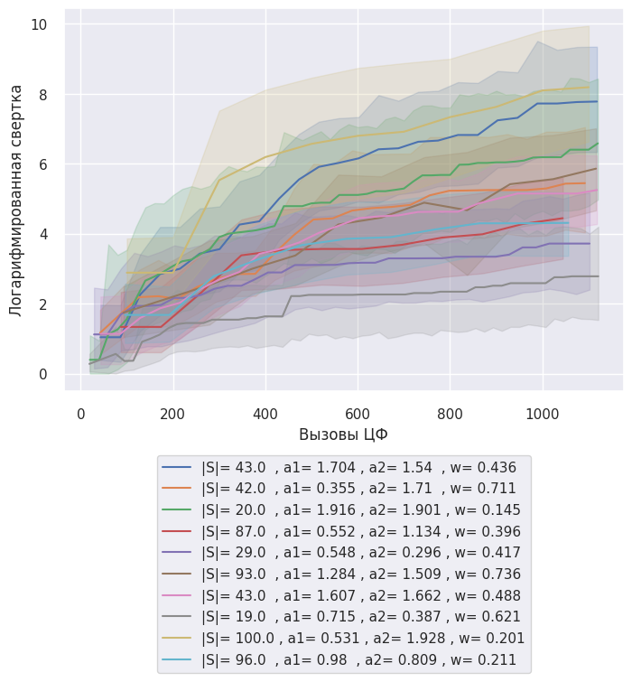
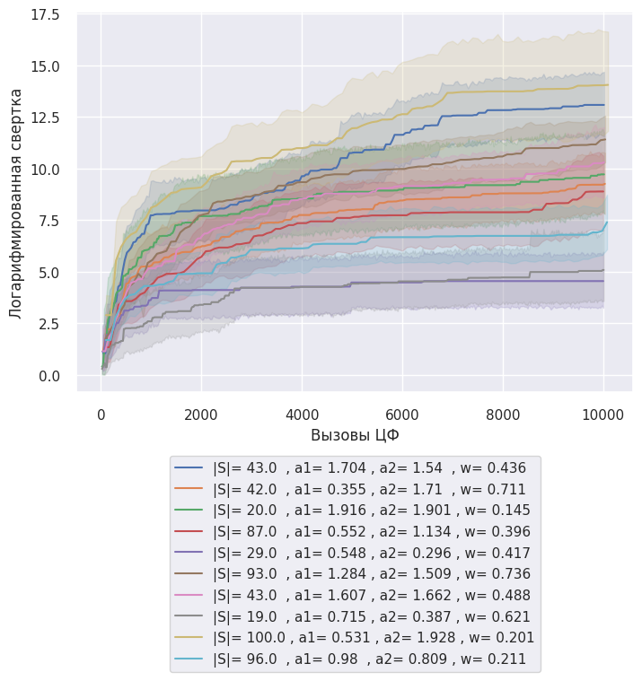

---
jupyter:
  colab:
    gpuType: T4
  kernelspec:
    display_name: Python 3
    name: python3
  language_info:
    codemirror_mode:
      name: ipython
      version: 3
    file_extension: .py
    mimetype: text/x-python
    name: python
    nbconvert_exporter: python
    pygments_lexer: ipython3
    version: 3.12.1
  nbformat: 4
  nbformat_minor: 0
---

EFFECTIVENESS_INTERACTION
```
    array([[ 0.25      ,  0.11111111,  0.0625    ,  0.04      ,  0.02777778,
             0.02040816],
           [ 6.        ,  0.25      ,  0.11111111,  0.0625    ,  0.04      ,
             0.02777778],
           [ 7.        ,  6.        ,  0.25      ,  0.11111111,  0.0625    ,
             0.04      ],
           [ 8.        ,  7.        ,  6.        ,  0.25      ,  0.11111111,
             0.0625    ],
           [ 9.        ,  8.        ,  7.        ,  6.        ,  0.25      ,
             0.11111111],
           [10.        ,  9.        ,  8.        ,  7.        ,  6.        ,
             0.25      ]])
```
# 100x100




# 100x100
# Вызовы ЦФ 0
```
    Расчет доверительных интервалов для каждой группы
    Параметры
    |S|= 19.0  , a1= 0.715 , a2= 0.387 , w= 0.621      (0.398903510682813, 1.2506955411544165)
    |S|= 20.0  , a1= 1.916 , a2= 1.901 , w= 0.145     (-0.5088906087277341, 17.76490718534785)
    |S|= 29.0  , a1= 0.548 , a2= 0.296 , w= 0.417     (-3475.816656975441, 10759.426671240817)
    |S|= 42.0  , a1= 0.355 , a2= 1.71  , w= 0.711     (3.4031615467114333, 16.135669578745297)
    |S|= 43.0  , a1= 1.607 , a2= 1.662 , w= 0.488       (-36.1855970890624, 281.7436702126493)
    |S|= 43.0  , a1= 1.704 , a2= 1.54  , w= 0.436    (-156.79221715457845, 497.73399025718845)
    Name: Свертка, dtype: object
```
## MIN
|       |   Коль-во частиц |   MAX Количесво итераций | c1_c2_w                                                   |   № эксперемента |       Время |   Вызовы ЦФ |   Свертка | Распределение                                                            |   Логарифмированная свертка | Параметры                                     |   score |    AVG t |   AVG score | t                                                                        | Score                                                                    |
|------:|-----------------:|-------------------------:|:----------------------------------------------------------|-----------------:|------------:|------------:|----------:|:-------------------------------------------------------------------------|----------------------------:|:----------------------------------------------|--------:|---------:|------------:|:-------------------------------------------------------------------------|:-------------------------------------------------------------------------|
| 35481 |               19 |                      526 | 0.7152822531830084_0.3866134304565536_0.620747578431883   |                1 | 0.0379748   |          38 |         0 | [-1 -1 -1 -1  0 -1 -1 -1 -1 -1 -1 -1 -1 -1 -1  0 -1 -1  0 -1 -1  0 -1 -1 |                        -inf | |S|= 19.0  , a1= 0.715 , a2= 0.387 , w= 0.621 |     0.1 | 0.256477 |    0.000625 | [0.         0.         0.         0.         0.05555556 0.               | [0.0625 1.     1.     1.     1.     1.     1.     1.     1.     1.       |
|       |                  |                          |                                                           |                  |             |             |           |   0 -1 -1 -1 -1 -1 -1 -1 -1 -1 -1 -1 -1 -1 -1 -1 -1 -1 -1 -1 -1 -1 -1  0 |                             |                                               |         |          |             |  0.         0.         0.         0.         0.         0.               |  1.     1.     1.     1.     1.     1.     1.     1.     1.     1.       |
|       |                  |                          |                                                           |                  |             |             |           |  -1 -1 -1 -1 -1 -1 -1 -1 -1 -1 -1 -1  0 -1 -1 -1 -1 -1  0  0 -1 -1 -1 -1 |                             |                                               |         |          |             |  0.         0.         0.         1.62882204 0.         0.               |  1.     1.     1.     1.     1.     1.     1.     1.     1.     1.       |
|       |                  |                          |                                                           |                  |             |             |           |  -1 -1 -1 -1 -1 -1 -1 -1 -1 -1 -1 -1 -1 -1 -1 -1 -1 -1 -1  0 -1 -1 -1 -1 |                             |                                               |         |          |             |  2.83986176 0.         0.         2.90380763 0.         0.               |  1.     1.     1.     1.     1.     1.     1.     1.     1.     1.       |
|       |                  |                          |                                                           |                  |             |             |           |  -1 -1 -1 -1]                                                            |                             |                                               |         |          |             |  3.24197728 0.         0.         0.         0.         0.               |  1.     1.     1.     1.     1.     1.     1.     1.     1.     1.       |
|       |                  |                          |                                                           |                  |             |             |           |                                                                          |                             |                                               |         |          |             |  0.         0.         0.         0.         0.         0.               |  1.     1.     1.     1.     1.     1.     1.     1.     1.     1.       |
|       |                  |                          |                                                           |                  |             |             |           |                                                                          |                             |                                               |         |          |             |  0.         0.         0.         0.         0.         0.               |  1.     1.     1.     1.     1.     1.     1.     1.     1.     1.       |
|       |                  |                          |                                                           |                  |             |             |           |                                                                          |                             |                                               |         |          |             |  0.         0.         0.         0.         0.         1.81859018       |  1.     1.     1.     1.     1.     1.     1.     1.     1.     1.       |
|       |                  |                          |                                                           |                  |             |             |           |                                                                          |                             |                                               |         |          |             |  0.         0.         0.         0.         0.         0.               |  1.     1.     1.     1.     1.     1.     1.     1.     1.     1.       |
|       |                  |                          |                                                           |                  |             |             |           |                                                                          |                             |                                               |         |          |             |  0.         0.         0.         0.         0.         0.               |  1.     1.     1.     1.     1.     1.     1.     1.     1.     1.    ]  |
|       |                  |                          |                                                           |                  |             |             |           |                                                                          |                             |                                               |         |          |             |  3.40261337 0.         0.         0.         0.         0.               |                                                                          |
|       |                  |                          |                                                           |                  |             |             |           |                                                                          |                             |                                               |         |          |             |  3.12916389 3.37966645 0.         0.         0.         0.               |                                                                          |
|       |                  |                          |                                                           |                  |             |             |           |                                                                          |                             |                                               |         |          |             |  0.         0.         0.         0.         0.         0.               |                                                                          |
|       |                  |                          |                                                           |                  |             |             |           |                                                                          |                             |                                               |         |          |             |  0.         0.         0.         0.         0.         0.               |                                                                          |
|       |                  |                          |                                                           |                  |             |             |           |                                                                          |                             |                                               |         |          |             |  0.         0.         0.         0.         0.         0.               |                                                                          |
|       |                  |                          |                                                           |                  |             |             |           |                                                                          |                             |                                               |         |          |             |  0.         3.24759526 0.         0.         0.         0.               |                                                                          |
|       |                  |                          |                                                           |                  |             |             |           |                                                                          |                             |                                               |         |          |             |  0.         0.         0.         0.        ]                            |                                                                          |
|  9440 |               20 |                      500 | 1.9164651165895739_1.900872225412764_0.14524109418144696  |                1 | 9.53674e-07 |          20 |         1 | [-1 -1 -1 -1 -1 -1 -1 -1 -1 -1 -1 -1 -1 -1 -1 -1 -1 -1 -1 -1 -1 -1 -1 -1 |                           0 | |S|= 20.0  , a1= 1.916 , a2= 1.901 , w= 0.145 |     0   | 0        |    0        | [0. 0. 0. 0. 0. 0. 0. 0. 0. 0. 0. 0. 0. 0. 0. 0. 0. 0. 0. 0. 0. 0. 0. 0. | [1. 1. 1. 1. 1. 1. 1. 1. 1. 1. 1. 1. 1. 1. 1. 1. 1. 1. 1. 1. 1. 1. 1. 1. |
|       |                  |                          |                                                           |                  |             |             |           |  -1 -1 -1 -1 -1 -1 -1 -1 -1 -1 -1 -1 -1 -1 -1 -1 -1 -1 -1 -1 -1 -1 -1 -1 |                             |                                               |         |          |             |  0. 0. 0. 0. 0. 0. 0. 0. 0. 0. 0. 0. 0. 0. 0. 0. 0. 0. 0. 0. 0. 0. 0. 0. |  1. 1. 1. 1. 1. 1. 1. 1. 1. 1. 1. 1. 1. 1. 1. 1. 1. 1. 1. 1. 1. 1. 1. 1. |
|       |                  |                          |                                                           |                  |             |             |           |  -1 -1 -1 -1 -1 -1 -1 -1 -1 -1 -1 -1 -1 -1 -1 -1 -1 -1 -1 -1 -1 -1 -1 -1 |                             |                                               |         |          |             |  0. 0. 0. 0. 0. 0. 0. 0. 0. 0. 0. 0. 0. 0. 0. 0. 0. 0. 0. 0. 0. 0. 0. 0. |  1. 1. 1. 1. 1. 1. 1. 1. 1. 1. 1. 1. 1. 1. 1. 1. 1. 1. 1. 1. 1. 1. 1. 1. |
|       |                  |                          |                                                           |                  |             |             |           |  -1 -1 -1 -1 -1 -1 -1 -1 -1 -1 -1 -1 -1 -1 -1 -1 -1 -1 -1 -1 -1 -1 -1 -1 |                             |                                               |         |          |             |  0. 0. 0. 0. 0. 0. 0. 0. 0. 0. 0. 0. 0. 0. 0. 0. 0. 0. 0. 0. 0. 0. 0. 0. |  1. 1. 1. 1. 1. 1. 1. 1. 1. 1. 1. 1. 1. 1. 1. 1. 1. 1. 1. 1. 1. 1. 1. 1. |
|       |                  |                          |                                                           |                  |             |             |           |  -1 -1 -1 -1]                                                            |                             |                                               |         |          |             |  0. 0. 0. 0.]                                                            |  1. 1. 1. 1.]                                                            |
| 21760 |               29 |                      344 | 0.5484913705011256_0.29601546503836_0.41684659408854485   |                1 | 7.15256e-07 |          29 |         1 | [-1 -1 -1 -1 -1 -1 -1 -1 -1 -1 -1 -1 -1 -1 -1 -1 -1 -1 -1 -1 -1 -1 -1 -1 |                           0 | |S|= 29.0  , a1= 0.548 , a2= 0.296 , w= 0.417 |     0   | 0        |    0        | [0. 0. 0. 0. 0. 0. 0. 0. 0. 0. 0. 0. 0. 0. 0. 0. 0. 0. 0. 0. 0. 0. 0. 0. | [1. 1. 1. 1. 1. 1. 1. 1. 1. 1. 1. 1. 1. 1. 1. 1. 1. 1. 1. 1. 1. 1. 1. 1. |
|       |                  |                          |                                                           |                  |             |             |           |  -1 -1 -1 -1 -1 -1 -1 -1 -1 -1 -1 -1 -1 -1 -1 -1 -1 -1 -1 -1 -1 -1 -1 -1 |                             |                                               |         |          |             |  0. 0. 0. 0. 0. 0. 0. 0. 0. 0. 0. 0. 0. 0. 0. 0. 0. 0. 0. 0. 0. 0. 0. 0. |  1. 1. 1. 1. 1. 1. 1. 1. 1. 1. 1. 1. 1. 1. 1. 1. 1. 1. 1. 1. 1. 1. 1. 1. |
|       |                  |                          |                                                           |                  |             |             |           |  -1 -1 -1 -1 -1 -1 -1 -1 -1 -1 -1 -1 -1 -1 -1 -1 -1 -1 -1 -1 -1 -1 -1 -1 |                             |                                               |         |          |             |  0. 0. 0. 0. 0. 0. 0. 0. 0. 0. 0. 0. 0. 0. 0. 0. 0. 0. 0. 0. 0. 0. 0. 0. |  1. 1. 1. 1. 1. 1. 1. 1. 1. 1. 1. 1. 1. 1. 1. 1. 1. 1. 1. 1. 1. 1. 1. 1. |
|       |                  |                          |                                                           |                  |             |             |           |  -1 -1 -1 -1 -1 -1 -1 -1 -1 -1 -1 -1 -1 -1 -1 -1 -1 -1 -1 -1 -1 -1 -1 -1 |                             |                                               |         |          |             |  0. 0. 0. 0. 0. 0. 0. 0. 0. 0. 0. 0. 0. 0. 0. 0. 0. 0. 0. 0. 0. 0. 0. 0. |  1. 1. 1. 1. 1. 1. 1. 1. 1. 1. 1. 1. 1. 1. 1. 1. 1. 1. 1. 1. 1. 1. 1. 1. |
|       |                  |                          |                                                           |                  |             |             |           |  -1 -1 -1 -1]                                                            |                             |                                               |         |          |             |  0. 0. 0. 0.]                                                            |  1. 1. 1. 1.]                                                            |
|  4660 |               42 |                      238 | 0.35529206381356226_1.7101241001807421_0.7110196951812913 |                1 | 7.15256e-07 |          42 |         1 | [-1 -1 -1 -1 -1 -1 -1 -1 -1 -1 -1 -1 -1 -1 -1 -1 -1 -1 -1 -1 -1 -1 -1 -1 |                           0 | |S|= 42.0  , a1= 0.355 , a2= 1.71  , w= 0.711 |     0   | 0        |    0        | [0. 0. 0. 0. 0. 0. 0. 0. 0. 0. 0. 0. 0. 0. 0. 0. 0. 0. 0. 0. 0. 0. 0. 0. | [1. 1. 1. 1. 1. 1. 1. 1. 1. 1. 1. 1. 1. 1. 1. 1. 1. 1. 1. 1. 1. 1. 1. 1. |
|       |                  |                          |                                                           |                  |             |             |           |  -1 -1 -1 -1 -1 -1 -1 -1 -1 -1 -1 -1 -1 -1 -1 -1 -1 -1 -1 -1 -1 -1 -1 -1 |                             |                                               |         |          |             |  0. 0. 0. 0. 0. 0. 0. 0. 0. 0. 0. 0. 0. 0. 0. 0. 0. 0. 0. 0. 0. 0. 0. 0. |  1. 1. 1. 1. 1. 1. 1. 1. 1. 1. 1. 1. 1. 1. 1. 1. 1. 1. 1. 1. 1. 1. 1. 1. |
|       |                  |                          |                                                           |                  |             |             |           |  -1 -1 -1 -1 -1 -1 -1 -1 -1 -1 -1 -1 -1 -1 -1 -1 -1 -1 -1 -1 -1 -1 -1 -1 |                             |                                               |         |          |             |  0. 0. 0. 0. 0. 0. 0. 0. 0. 0. 0. 0. 0. 0. 0. 0. 0. 0. 0. 0. 0. 0. 0. 0. |  1. 1. 1. 1. 1. 1. 1. 1. 1. 1. 1. 1. 1. 1. 1. 1. 1. 1. 1. 1. 1. 1. 1. 1. |
|       |                  |                          |                                                           |                  |             |             |           |  -1 -1 -1 -1 -1 -1 -1 -1 -1 -1 -1 -1 -1 -1 -1 -1 -1 -1 -1 -1 -1 -1 -1 -1 |                             |                                               |         |          |             |  0. 0. 0. 0. 0. 0. 0. 0. 0. 0. 0. 0. 0. 0. 0. 0. 0. 0. 0. 0. 0. 0. 0. 0. |  1. 1. 1. 1. 1. 1. 1. 1. 1. 1. 1. 1. 1. 1. 1. 1. 1. 1. 1. 1. 1. 1. 1. 1. |
|       |                  |                          |                                                           |                  |             |             |           |  -1 -1 -1 -1]                                                            |                             |                                               |         |          |             |  0. 0. 0. 0.]                                                            |  1. 1. 1. 1.]                                                            |
| 30820 |               43 |                      232 | 1.6073461591471596_1.6617126804074809_0.48802770234475623 |                1 | 1.43051e-06 |          43 |         1 | [-1 -1 -1 -1 -1 -1 -1 -1 -1 -1 -1 -1 -1 -1 -1 -1 -1 -1 -1 -1 -1 -1 -1 -1 |                           0 | |S|= 43.0  , a1= 1.607 , a2= 1.662 , w= 0.488 |     0   | 0        |    0        | [0. 0. 0. 0. 0. 0. 0. 0. 0. 0. 0. 0. 0. 0. 0. 0. 0. 0. 0. 0. 0. 0. 0. 0. | [1. 1. 1. 1. 1. 1. 1. 1. 1. 1. 1. 1. 1. 1. 1. 1. 1. 1. 1. 1. 1. 1. 1. 1. |
|       |                  |                          |                                                           |                  |             |             |           |  -1 -1 -1 -1 -1 -1 -1 -1 -1 -1 -1 -1 -1 -1 -1 -1 -1 -1 -1 -1 -1 -1 -1 -1 |                             |                                               |         |          |             |  0. 0. 0. 0. 0. 0. 0. 0. 0. 0. 0. 0. 0. 0. 0. 0. 0. 0. 0. 0. 0. 0. 0. 0. |  1. 1. 1. 1. 1. 1. 1. 1. 1. 1. 1. 1. 1. 1. 1. 1. 1. 1. 1. 1. 1. 1. 1. 1. |
|       |                  |                          |                                                           |                  |             |             |           |  -1 -1 -1 -1 -1 -1 -1 -1 -1 -1 -1 -1 -1 -1 -1 -1 -1 -1 -1 -1 -1 -1 -1 -1 |                             |                                               |         |          |             |  0. 0. 0. 0. 0. 0. 0. 0. 0. 0. 0. 0. 0. 0. 0. 0. 0. 0. 0. 0. 0. 0. 0. 0. |  1. 1. 1. 1. 1. 1. 1. 1. 1. 1. 1. 1. 1. 1. 1. 1. 1. 1. 1. 1. 1. 1. 1. 1. |
|       |                  |                          |                                                           |                  |             |             |           |  -1 -1 -1 -1 -1 -1 -1 -1 -1 -1 -1 -1 -1 -1 -1 -1 -1 -1 -1 -1 -1 -1 -1 -1 |                             |                                               |         |          |             |  0. 0. 0. 0. 0. 0. 0. 0. 0. 0. 0. 0. 0. 0. 0. 0. 0. 0. 0. 0. 0. 0. 0. 0. |  1. 1. 1. 1. 1. 1. 1. 1. 1. 1. 1. 1. 1. 1. 1. 1. 1. 1. 1. 1. 1. 1. 1. 1. |
|       |                  |                          |                                                           |                  |             |             |           |  -1 -1 -1 -1]                                                            |                             |                                               |         |          |             |  0. 0. 0. 0.]                                                            |  1. 1. 1. 1.]                                                            |
|   233 |               43 |                      232 | 1.7044015178975915_1.5401133655865746_0.43645726466467605 |                2 | 1.66893e-06 |          43 |         1 | [-1 -1 -1 -1 -1 -1 -1 -1 -1 -1 -1 -1 -1 -1 -1 -1 -1 -1 -1 -1 -1 -1 -1 -1 |                           0 | |S|= 43.0  , a1= 1.704 , a2= 1.54  , w= 0.436 |     0   | 0        |    0        | [0. 0. 0. 0. 0. 0. 0. 0. 0. 0. 0. 0. 0. 0. 0. 0. 0. 0. 0. 0. 0. 0. 0. 0. | [1. 1. 1. 1. 1. 1. 1. 1. 1. 1. 1. 1. 1. 1. 1. 1. 1. 1. 1. 1. 1. 1. 1. 1. |
|       |                  |                          |                                                           |                  |             |             |           |  -1 -1 -1 -1 -1 -1 -1 -1 -1 -1 -1 -1 -1 -1 -1 -1 -1 -1 -1 -1 -1 -1 -1 -1 |                             |                                               |         |          |             |  0. 0. 0. 0. 0. 0. 0. 0. 0. 0. 0. 0. 0. 0. 0. 0. 0. 0. 0. 0. 0. 0. 0. 0. |  1. 1. 1. 1. 1. 1. 1. 1. 1. 1. 1. 1. 1. 1. 1. 1. 1. 1. 1. 1. 1. 1. 1. 1. |
|       |                  |                          |                                                           |                  |             |             |           |  -1 -1 -1 -1 -1 -1 -1 -1 -1 -1 -1 -1 -1 -1 -1 -1 -1 -1 -1 -1 -1 -1 -1 -1 |                             |                                               |         |          |             |  0. 0. 0. 0. 0. 0. 0. 0. 0. 0. 0. 0. 0. 0. 0. 0. 0. 0. 0. 0. 0. 0. 0. 0. |  1. 1. 1. 1. 1. 1. 1. 1. 1. 1. 1. 1. 1. 1. 1. 1. 1. 1. 1. 1. 1. 1. 1. 1. |
|       |                  |                          |                                                           |                  |             |             |           |  -1 -1 -1 -1 -1 -1 -1 -1 -1 -1 -1 -1 -1 -1 -1 -1 -1 -1 -1 -1 -1 -1 -1 -1 |                             |                                               |         |          |             |  0. 0. 0. 0. 0. 0. 0. 0. 0. 0. 0. 0. 0. 0. 0. 0. 0. 0. 0. 0. 0. 0. 0. 0. |  1. 1. 1. 1. 1. 1. 1. 1. 1. 1. 1. 1. 1. 1. 1. 1. 1. 1. 1. 1. 1. 1. 1. 1. |
|       |                  |                          |                                                           |                  |             |             |           |  -1 -1 -1 -1]                                                            |                             |                                               |         |          |             |  0. 0. 0. 0.]                                                            |  1. 1. 1. 1.]                                                            |
```
    AVG
    Коль-во частиц                32.666667
    MAX Количесво итераций       345.333333
    № эксперемента                 1.166667
    Время                          0.006330
    Вызовы ЦФ                     35.833333
    Свертка                        0.833333
    Логарифмированная свертка          -inf
    score                          0.016667
    AVG t                          0.042746
    AVG score                      0.000104
    dtype: float64

    Cвертка : -1,
    Распределение: [-1, -1, -1, -1, 0, -1, -1, -1, -1, -1, -1, -1, -1, -1, -1, 0, -1, -1, 0, -1, -1, 0, -1, -1, 0, -1, -1, -1, -1, -1, -1, -1, -1, -1, -1, -1, -1, -1, -1, -1, -1, -1, -1, -1, -1, -1, -1, 0, -1, -1, -1, -1, -1, -1, -1, -1, -1, -1, -1, -1, 0, -1, -1, -1, -1, -1, 0, 0, -1, -1, -1, -1, -1, -1, -1, -1, -1, -1, -1, -1, -1, -1, -1, -1, -1, -1, -1, -1, -1, -1, -1, 0, -1, -1, -1, -1, -1, -1, -1, -1]
    Колисчесвто целей:100. Количесвто UAV:100
    Ограниечнеи выбор целей не > 1: {'Цель 0 (Количестов нацеленных)': 10, 'Цель 1 (Количестов нацеленных)': 0, 'Цель 2 (Количестов нацеленных)': 0, 'Цель 3 (Количестов нацеленных)': 0, 'Цель 4 (Количестов нацеленных)': 0, 'Цель 5 (Количестов нацеленных)': 0, 'Цель 6 (Количестов нацеленных)': 0, 'Цель 7 (Количестов нацеленных)': 0, 'Цель 8 (Количестов нацеленных)': 0, 'Цель 9 (Количестов нацеленных)': 0, 'Цель 10 (Количестов нацеленных)': 0, 'Цель 11 (Количестов нацеленных)': 0, 'Цель 12 (Количестов нацеленных)': 0, 'Цель 13 (Количестов нацеленных)': 0, 'Цель 14 (Количестов нацеленных)': 0, 'Цель 15 (Количестов нацеленных)': 0, 'Цель 16 (Количестов нацеленных)': 0, 'Цель 17 (Количестов нацеленных)': 0, 'Цель 18 (Количестов нацеленных)': 0, 'Цель 19 (Количестов нацеленных)': 0, 'Цель 20 (Количестов нацеленных)': 0, 'Цель 21 (Количестов нацеленных)': 0, 'Цель 22 (Количестов нацеленных)': 0, 'Цель 23 (Количестов нацеленных)': 0, 'Цель 24 (Количестов нацеленных)': 0, 'Цель 25 (Количестов нацеленных)': 0, 'Цель 26 (Количестов нацеленных)': 0, 'Цель 27 (Количестов нацеленных)': 0, 'Цель 28 (Количестов нацеленных)': 0, 'Цель 29 (Количестов нацеленных)': 0, 'Цель 30 (Количестов нацеленных)': 0, 'Цель 31 (Количестов нацеленных)': 0, 'Цель 32 (Количестов нацеленных)': 0, 'Цель 33 (Количестов нацеленных)': 0, 'Цель 34 (Количестов нацеленных)': 0, 'Цель 35 (Количестов нацеленных)': 0, 'Цель 36 (Количестов нацеленных)': 0, 'Цель 37 (Количестов нацеленных)': 0, 'Цель 38 (Количестов нацеленных)': 0, 'Цель 39 (Количестов нацеленных)': 0, 'Цель 40 (Количестов нацеленных)': 0, 'Цель 41 (Количестов нацеленных)': 0, 'Цель 42 (Количестов нацеленных)': 0, 'Цель 43 (Количестов нацеленных)': 0, 'Цель 44 (Количестов нацеленных)': 0, 'Цель 45 (Количестов нацеленных)': 0, 'Цель 46 (Количестов нацеленных)': 0, 'Цель 47 (Количестов нацеленных)': 0, 'Цель 48 (Количестов нацеленных)': 0, 'Цель 49 (Количестов нацеленных)': 0, 'Цель 50 (Количестов нацеленных)': 0, 'Цель 51 (Количестов нацеленных)': 0, 'Цель 52 (Количестов нацеленных)': 0, 'Цель 53 (Количестов нацеленных)': 0, 'Цель 54 (Количестов нацеленных)': 0, 'Цель 55 (Количестов нацеленных)': 0, 'Цель 56 (Количестов нацеленных)': 0, 'Цель 57 (Количестов нацеленных)': 0, 'Цель 58 (Количестов нацеленных)': 0, 'Цель 59 (Количестов нацеленных)': 0, 'Цель 60 (Количестов нацеленных)': 0, 'Цель 61 (Количестов нацеленных)': 0, 'Цель 62 (Количестов нацеленных)': 0, 'Цель 63 (Количестов нацеленных)': 0, 'Цель 64 (Количестов нацеленных)': 0, 'Цель 65 (Количестов нацеленных)': 0, 'Цель 66 (Количестов нацеленных)': 0, 'Цель 67 (Количестов нацеленных)': 0, 'Цель 68 (Количестов нацеленных)': 0, 'Цель 69 (Количестов нацеленных)': 0, 'Цель 70 (Количестов нацеленных)': 0, 'Цель 71 (Количестов нацеленных)': 0, 'Цель 72 (Количестов нацеленных)': 0, 'Цель 73 (Количестов нацеленных)': 0, 'Цель 74 (Количестов нацеленных)': 0, 'Цель 75 (Количестов нацеленных)': 0, 'Цель 76 (Количестов нацеленных)': 0, 'Цель 77 (Количестов нацеленных)': 0, 'Цель 78 (Количестов нацеленных)': 0, 'Цель 79 (Количестов нацеленных)': 0, 'Цель 80 (Количестов нацеленных)': 0, 'Цель 81 (Количестов нацеленных)': 0, 'Цель 82 (Количестов нацеленных)': 0, 'Цель 83 (Количестов нацеленных)': 0, 'Цель 84 (Количестов нацеленных)': 0, 'Цель 85 (Количестов нацеленных)': 0, 'Цель 86 (Количестов нацеленных)': 0, 'Цель 87 (Количестов нацеленных)': 0, 'Цель 88 (Количестов нацеленных)': 0, 'Цель 89 (Количестов нацеленных)': 0, 'Цель 90 (Количестов нацеленных)': 0, 'Цель 91 (Количестов нацеленных)': 0, 'Цель 92 (Количестов нацеленных)': 0, 'Цель 93 (Количестов нацеленных)': 0, 'Цель 94 (Количестов нацеленных)': 0, 'Цель 95 (Количестов нацеленных)': 0, 'Цель 96 (Количестов нацеленных)': 0, 'Цель 97 (Количестов нацеленных)': 0, 'Цель 98 (Количестов нацеленных)': 0, 'Цель 99 (Количестов нацеленных)': 0}
    t: [0.         0.         0.         0.         0.05555556 0.
    0.         0.         0.         0.         0.         0.
    0.         0.         0.         1.62882204 0.         0.
    2.83986176 0.         0.         2.90380763 0.         0.
    3.24197728 0.         0.         0.         0.         0.
    0.         0.         0.         0.         0.         0.
    0.         0.         0.         0.         0.         0.
    0.         0.         0.         0.         0.         1.81859018
    0.         0.         0.         0.         0.         0.
    0.         0.         0.         0.         0.         0.
    3.40261337 0.         0.         0.         0.         0.
    3.12916389 3.37966645 0.         0.         0.         0.
    0.         0.         0.         0.         0.         0.
    0.         0.         0.         0.         0.         0.
    0.         0.         0.         0.         0.         0.
    0.         3.24759526 0.         0.         0.         0.
    0.         0.         0.         0.        ]
    AVG t: 0.25647653421985434
    score: [0.0625 1.     1.     1.     1.     1.     1.     1.     1.     1.
    1.     1.     1.     1.     1.     1.     1.     1.     1.     1.
    1.     1.     1.     1.     1.     1.     1.     1.     1.     1.
    1.     1.     1.     1.     1.     1.     1.     1.     1.     1.
    1.     1.     1.     1.     1.     1.     1.     1.     1.     1.
    1.     1.     1.     1.     1.     1.     1.     1.     1.     1.
    1.     1.     1.     1.     1.     1.     1.     1.     1.     1.
    1.     1.     1.     1.     1.     1.     1.     1.     1.     1.
    1.     1.     1.     1.     1.     1.     1.     1.     1.     1.
    1.     1.     1.     1.     1.     1.     1.     1.     1.     1.    ]
    AVG score: 0.000625
    Количесво задействоанных UAV: 10


    Cвертка : 1.0,
    Распределение: [-1, -1, -1, -1, -1, -1, -1, -1, -1, -1, -1, -1, -1, -1, -1, -1, -1, -1, -1, -1, -1, -1, -1, -1, -1, -1, -1, -1, -1, -1, -1, -1, -1, -1, -1, -1, -1, -1, -1, -1, -1, -1, -1, -1, -1, -1, -1, -1, -1, -1, -1, -1, -1, -1, -1, -1, -1, -1, -1, -1, -1, -1, -1, -1, -1, -1, -1, -1, -1, -1, -1, -1, -1, -1, -1, -1, -1, -1, -1, -1, -1, -1, -1, -1, -1, -1, -1, -1, -1, -1, -1, -1, -1, -1, -1, -1, -1, -1, -1, -1]
    Колисчесвто целей:100. Количесвто UAV:100
    Ограниечнеи выбор целей не > 1: {'Цель 0 (Количестов нацеленных)': 0, 'Цель 1 (Количестов нацеленных)': 0, 'Цель 2 (Количестов нацеленных)': 0, 'Цель 3 (Количестов нацеленных)': 0, 'Цель 4 (Количестов нацеленных)': 0, 'Цель 5 (Количестов нацеленных)': 0, 'Цель 6 (Количестов нацеленных)': 0, 'Цель 7 (Количестов нацеленных)': 0, 'Цель 8 (Количестов нацеленных)': 0, 'Цель 9 (Количестов нацеленных)': 0, 'Цель 10 (Количестов нацеленных)': 0, 'Цель 11 (Количестов нацеленных)': 0, 'Цель 12 (Количестов нацеленных)': 0, 'Цель 13 (Количестов нацеленных)': 0, 'Цель 14 (Количестов нацеленных)': 0, 'Цель 15 (Количестов нацеленных)': 0, 'Цель 16 (Количестов нацеленных)': 0, 'Цель 17 (Количестов нацеленных)': 0, 'Цель 18 (Количестов нацеленных)': 0, 'Цель 19 (Количестов нацеленных)': 0, 'Цель 20 (Количестов нацеленных)': 0, 'Цель 21 (Количестов нацеленных)': 0, 'Цель 22 (Количестов нацеленных)': 0, 'Цель 23 (Количестов нацеленных)': 0, 'Цель 24 (Количестов нацеленных)': 0, 'Цель 25 (Количестов нацеленных)': 0, 'Цель 26 (Количестов нацеленных)': 0, 'Цель 27 (Количестов нацеленных)': 0, 'Цель 28 (Количестов нацеленных)': 0, 'Цель 29 (Количестов нацеленных)': 0, 'Цель 30 (Количестов нацеленных)': 0, 'Цель 31 (Количестов нацеленных)': 0, 'Цель 32 (Количестов нацеленных)': 0, 'Цель 33 (Количестов нацеленных)': 0, 'Цель 34 (Количестов нацеленных)': 0, 'Цель 35 (Количестов нацеленных)': 0, 'Цель 36 (Количестов нацеленных)': 0, 'Цель 37 (Количестов нацеленных)': 0, 'Цель 38 (Количестов нацеленных)': 0, 'Цель 39 (Количестов нацеленных)': 0, 'Цель 40 (Количестов нацеленных)': 0, 'Цель 41 (Количестов нацеленных)': 0, 'Цель 42 (Количестов нацеленных)': 0, 'Цель 43 (Количестов нацеленных)': 0, 'Цель 44 (Количестов нацеленных)': 0, 'Цель 45 (Количестов нацеленных)': 0, 'Цель 46 (Количестов нацеленных)': 0, 'Цель 47 (Количестов нацеленных)': 0, 'Цель 48 (Количестов нацеленных)': 0, 'Цель 49 (Количестов нацеленных)': 0, 'Цель 50 (Количестов нацеленных)': 0, 'Цель 51 (Количестов нацеленных)': 0, 'Цель 52 (Количестов нацеленных)': 0, 'Цель 53 (Количестов нацеленных)': 0, 'Цель 54 (Количестов нацеленных)': 0, 'Цель 55 (Количестов нацеленных)': 0, 'Цель 56 (Количестов нацеленных)': 0, 'Цель 57 (Количестов нацеленных)': 0, 'Цель 58 (Количестов нацеленных)': 0, 'Цель 59 (Количестов нацеленных)': 0, 'Цель 60 (Количестов нацеленных)': 0, 'Цель 61 (Количестов нацеленных)': 0, 'Цель 62 (Количестов нацеленных)': 0, 'Цель 63 (Количестов нацеленных)': 0, 'Цель 64 (Количестов нацеленных)': 0, 'Цель 65 (Количестов нацеленных)': 0, 'Цель 66 (Количестов нацеленных)': 0, 'Цель 67 (Количестов нацеленных)': 0, 'Цель 68 (Количестов нацеленных)': 0, 'Цель 69 (Количестов нацеленных)': 0, 'Цель 70 (Количестов нацеленных)': 0, 'Цель 71 (Количестов нацеленных)': 0, 'Цель 72 (Количестов нацеленных)': 0, 'Цель 73 (Количестов нацеленных)': 0, 'Цель 74 (Количестов нацеленных)': 0, 'Цель 75 (Количестов нацеленных)': 0, 'Цель 76 (Количестов нацеленных)': 0, 'Цель 77 (Количестов нацеленных)': 0, 'Цель 78 (Количестов нацеленных)': 0, 'Цель 79 (Количестов нацеленных)': 0, 'Цель 80 (Количестов нацеленных)': 0, 'Цель 81 (Количестов нацеленных)': 0, 'Цель 82 (Количестов нацеленных)': 0, 'Цель 83 (Количестов нацеленных)': 0, 'Цель 84 (Количестов нацеленных)': 0, 'Цель 85 (Количестов нацеленных)': 0, 'Цель 86 (Количестов нацеленных)': 0, 'Цель 87 (Количестов нацеленных)': 0, 'Цель 88 (Количестов нацеленных)': 0, 'Цель 89 (Количестов нацеленных)': 0, 'Цель 90 (Количестов нацеленных)': 0, 'Цель 91 (Количестов нацеленных)': 0, 'Цель 92 (Количестов нацеленных)': 0, 'Цель 93 (Количестов нацеленных)': 0, 'Цель 94 (Количестов нацеленных)': 0, 'Цель 95 (Количестов нацеленных)': 0, 'Цель 96 (Количестов нацеленных)': 0, 'Цель 97 (Количестов нацеленных)': 0, 'Цель 98 (Количестов нацеленных)': 0, 'Цель 99 (Количестов нацеленных)': 0}
    t: [0. 0. 0. 0. 0. 0. 0. 0. 0. 0. 0. 0. 0. 0. 0. 0. 0. 0. 0. 0. 0. 0. 0. 0.
    0. 0. 0. 0. 0. 0. 0. 0. 0. 0. 0. 0. 0. 0. 0. 0. 0. 0. 0. 0. 0. 0. 0. 0.
    0. 0. 0. 0. 0. 0. 0. 0. 0. 0. 0. 0. 0. 0. 0. 0. 0. 0. 0. 0. 0. 0. 0. 0.
    0. 0. 0. 0. 0. 0. 0. 0. 0. 0. 0. 0. 0. 0. 0. 0. 0. 0. 0. 0. 0. 0. 0. 0.
    0. 0. 0. 0.]
    AVG t: 0.0
    score: [1. 1. 1. 1. 1. 1. 1. 1. 1. 1. 1. 1. 1. 1. 1. 1. 1. 1. 1. 1. 1. 1. 1. 1.
    1. 1. 1. 1. 1. 1. 1. 1. 1. 1. 1. 1. 1. 1. 1. 1. 1. 1. 1. 1. 1. 1. 1. 1.
    1. 1. 1. 1. 1. 1. 1. 1. 1. 1. 1. 1. 1. 1. 1. 1. 1. 1. 1. 1. 1. 1. 1. 1.
    1. 1. 1. 1. 1. 1. 1. 1. 1. 1. 1. 1. 1. 1. 1. 1. 1. 1. 1. 1. 1. 1. 1. 1.
    1. 1. 1. 1.]
    AVG score: 0.0
    Количесво задействоанных UAV: 0


    Cвертка : 1.0,
    Распределение: [-1, -1, -1, -1, -1, -1, -1, -1, -1, -1, -1, -1, -1, -1, -1, -1, -1, -1, -1, -1, -1, -1, -1, -1, -1, -1, -1, -1, -1, -1, -1, -1, -1, -1, -1, -1, -1, -1, -1, -1, -1, -1, -1, -1, -1, -1, -1, -1, -1, -1, -1, -1, -1, -1, -1, -1, -1, -1, -1, -1, -1, -1, -1, -1, -1, -1, -1, -1, -1, -1, -1, -1, -1, -1, -1, -1, -1, -1, -1, -1, -1, -1, -1, -1, -1, -1, -1, -1, -1, -1, -1, -1, -1, -1, -1, -1, -1, -1, -1, -1]
    Колисчесвто целей:100. Количесвто UAV:100
    Ограниечнеи выбор целей не > 1: {'Цель 0 (Количестов нацеленных)': 0, 'Цель 1 (Количестов нацеленных)': 0, 'Цель 2 (Количестов нацеленных)': 0, 'Цель 3 (Количестов нацеленных)': 0, 'Цель 4 (Количестов нацеленных)': 0, 'Цель 5 (Количестов нацеленных)': 0, 'Цель 6 (Количестов нацеленных)': 0, 'Цель 7 (Количестов нацеленных)': 0, 'Цель 8 (Количестов нацеленных)': 0, 'Цель 9 (Количестов нацеленных)': 0, 'Цель 10 (Количестов нацеленных)': 0, 'Цель 11 (Количестов нацеленных)': 0, 'Цель 12 (Количестов нацеленных)': 0, 'Цель 13 (Количестов нацеленных)': 0, 'Цель 14 (Количестов нацеленных)': 0, 'Цель 15 (Количестов нацеленных)': 0, 'Цель 16 (Количестов нацеленных)': 0, 'Цель 17 (Количестов нацеленных)': 0, 'Цель 18 (Количестов нацеленных)': 0, 'Цель 19 (Количестов нацеленных)': 0, 'Цель 20 (Количестов нацеленных)': 0, 'Цель 21 (Количестов нацеленных)': 0, 'Цель 22 (Количестов нацеленных)': 0, 'Цель 23 (Количестов нацеленных)': 0, 'Цель 24 (Количестов нацеленных)': 0, 'Цель 25 (Количестов нацеленных)': 0, 'Цель 26 (Количестов нацеленных)': 0, 'Цель 27 (Количестов нацеленных)': 0, 'Цель 28 (Количестов нацеленных)': 0, 'Цель 29 (Количестов нацеленных)': 0, 'Цель 30 (Количестов нацеленных)': 0, 'Цель 31 (Количестов нацеленных)': 0, 'Цель 32 (Количестов нацеленных)': 0, 'Цель 33 (Количестов нацеленных)': 0, 'Цель 34 (Количестов нацеленных)': 0, 'Цель 35 (Количестов нацеленных)': 0, 'Цель 36 (Количестов нацеленных)': 0, 'Цель 37 (Количестов нацеленных)': 0, 'Цель 38 (Количестов нацеленных)': 0, 'Цель 39 (Количестов нацеленных)': 0, 'Цель 40 (Количестов нацеленных)': 0, 'Цель 41 (Количестов нацеленных)': 0, 'Цель 42 (Количестов нацеленных)': 0, 'Цель 43 (Количестов нацеленных)': 0, 'Цель 44 (Количестов нацеленных)': 0, 'Цель 45 (Количестов нацеленных)': 0, 'Цель 46 (Количестов нацеленных)': 0, 'Цель 47 (Количестов нацеленных)': 0, 'Цель 48 (Количестов нацеленных)': 0, 'Цель 49 (Количестов нацеленных)': 0, 'Цель 50 (Количестов нацеленных)': 0, 'Цель 51 (Количестов нацеленных)': 0, 'Цель 52 (Количестов нацеленных)': 0, 'Цель 53 (Количестов нацеленных)': 0, 'Цель 54 (Количестов нацеленных)': 0, 'Цель 55 (Количестов нацеленных)': 0, 'Цель 56 (Количестов нацеленных)': 0, 'Цель 57 (Количестов нацеленных)': 0, 'Цель 58 (Количестов нацеленных)': 0, 'Цель 59 (Количестов нацеленных)': 0, 'Цель 60 (Количестов нацеленных)': 0, 'Цель 61 (Количестов нацеленных)': 0, 'Цель 62 (Количестов нацеленных)': 0, 'Цель 63 (Количестов нацеленных)': 0, 'Цель 64 (Количестов нацеленных)': 0, 'Цель 65 (Количестов нацеленных)': 0, 'Цель 66 (Количестов нацеленных)': 0, 'Цель 67 (Количестов нацеленных)': 0, 'Цель 68 (Количестов нацеленных)': 0, 'Цель 69 (Количестов нацеленных)': 0, 'Цель 70 (Количестов нацеленных)': 0, 'Цель 71 (Количестов нацеленных)': 0, 'Цель 72 (Количестов нацеленных)': 0, 'Цель 73 (Количестов нацеленных)': 0, 'Цель 74 (Количестов нацеленных)': 0, 'Цель 75 (Количестов нацеленных)': 0, 'Цель 76 (Количестов нацеленных)': 0, 'Цель 77 (Количестов нацеленных)': 0, 'Цель 78 (Количестов нацеленных)': 0, 'Цель 79 (Количестов нацеленных)': 0, 'Цель 80 (Количестов нацеленных)': 0, 'Цель 81 (Количестов нацеленных)': 0, 'Цель 82 (Количестов нацеленных)': 0, 'Цель 83 (Количестов нацеленных)': 0, 'Цель 84 (Количестов нацеленных)': 0, 'Цель 85 (Количестов нацеленных)': 0, 'Цель 86 (Количестов нацеленных)': 0, 'Цель 87 (Количестов нацеленных)': 0, 'Цель 88 (Количестов нацеленных)': 0, 'Цель 89 (Количестов нацеленных)': 0, 'Цель 90 (Количестов нацеленных)': 0, 'Цель 91 (Количестов нацеленных)': 0, 'Цель 92 (Количестов нацеленных)': 0, 'Цель 93 (Количестов нацеленных)': 0, 'Цель 94 (Количестов нацеленных)': 0, 'Цель 95 (Количестов нацеленных)': 0, 'Цель 96 (Количестов нацеленных)': 0, 'Цель 97 (Количестов нацеленных)': 0, 'Цель 98 (Количестов нацеленных)': 0, 'Цель 99 (Количестов нацеленных)': 0}
    t: [0. 0. 0. 0. 0. 0. 0. 0. 0. 0. 0. 0. 0. 0. 0. 0. 0. 0. 0. 0. 0. 0. 0. 0.
    0. 0. 0. 0. 0. 0. 0. 0. 0. 0. 0. 0. 0. 0. 0. 0. 0. 0. 0. 0. 0. 0. 0. 0.
    0. 0. 0. 0. 0. 0. 0. 0. 0. 0. 0. 0. 0. 0. 0. 0. 0. 0. 0. 0. 0. 0. 0. 0.
    0. 0. 0. 0. 0. 0. 0. 0. 0. 0. 0. 0. 0. 0. 0. 0. 0. 0. 0. 0. 0. 0. 0. 0.
    0. 0. 0. 0.]
    AVG t: 0.0
    score: [1. 1. 1. 1. 1. 1. 1. 1. 1. 1. 1. 1. 1. 1. 1. 1. 1. 1. 1. 1. 1. 1. 1. 1.
    1. 1. 1. 1. 1. 1. 1. 1. 1. 1. 1. 1. 1. 1. 1. 1. 1. 1. 1. 1. 1. 1. 1. 1.
    1. 1. 1. 1. 1. 1. 1. 1. 1. 1. 1. 1. 1. 1. 1. 1. 1. 1. 1. 1. 1. 1. 1. 1.
    1. 1. 1. 1. 1. 1. 1. 1. 1. 1. 1. 1. 1. 1. 1. 1. 1. 1. 1. 1. 1. 1. 1. 1.
    1. 1. 1. 1.]
    AVG score: 0.0
    Количесво задействоанных UAV: 0


    Cвертка : 1.0,
    Распределение: [-1, -1, -1, -1, -1, -1, -1, -1, -1, -1, -1, -1, -1, -1, -1, -1, -1, -1, -1, -1, -1, -1, -1, -1, -1, -1, -1, -1, -1, -1, -1, -1, -1, -1, -1, -1, -1, -1, -1, -1, -1, -1, -1, -1, -1, -1, -1, -1, -1, -1, -1, -1, -1, -1, -1, -1, -1, -1, -1, -1, -1, -1, -1, -1, -1, -1, -1, -1, -1, -1, -1, -1, -1, -1, -1, -1, -1, -1, -1, -1, -1, -1, -1, -1, -1, -1, -1, -1, -1, -1, -1, -1, -1, -1, -1, -1, -1, -1, -1, -1]
    Колисчесвто целей:100. Количесвто UAV:100
    Ограниечнеи выбор целей не > 1: {'Цель 0 (Количестов нацеленных)': 0, 'Цель 1 (Количестов нацеленных)': 0, 'Цель 2 (Количестов нацеленных)': 0, 'Цель 3 (Количестов нацеленных)': 0, 'Цель 4 (Количестов нацеленных)': 0, 'Цель 5 (Количестов нацеленных)': 0, 'Цель 6 (Количестов нацеленных)': 0, 'Цель 7 (Количестов нацеленных)': 0, 'Цель 8 (Количестов нацеленных)': 0, 'Цель 9 (Количестов нацеленных)': 0, 'Цель 10 (Количестов нацеленных)': 0, 'Цель 11 (Количестов нацеленных)': 0, 'Цель 12 (Количестов нацеленных)': 0, 'Цель 13 (Количестов нацеленных)': 0, 'Цель 14 (Количестов нацеленных)': 0, 'Цель 15 (Количестов нацеленных)': 0, 'Цель 16 (Количестов нацеленных)': 0, 'Цель 17 (Количестов нацеленных)': 0, 'Цель 18 (Количестов нацеленных)': 0, 'Цель 19 (Количестов нацеленных)': 0, 'Цель 20 (Количестов нацеленных)': 0, 'Цель 21 (Количестов нацеленных)': 0, 'Цель 22 (Количестов нацеленных)': 0, 'Цель 23 (Количестов нацеленных)': 0, 'Цель 24 (Количестов нацеленных)': 0, 'Цель 25 (Количестов нацеленных)': 0, 'Цель 26 (Количестов нацеленных)': 0, 'Цель 27 (Количестов нацеленных)': 0, 'Цель 28 (Количестов нацеленных)': 0, 'Цель 29 (Количестов нацеленных)': 0, 'Цель 30 (Количестов нацеленных)': 0, 'Цель 31 (Количестов нацеленных)': 0, 'Цель 32 (Количестов нацеленных)': 0, 'Цель 33 (Количестов нацеленных)': 0, 'Цель 34 (Количестов нацеленных)': 0, 'Цель 35 (Количестов нацеленных)': 0, 'Цель 36 (Количестов нацеленных)': 0, 'Цель 37 (Количестов нацеленных)': 0, 'Цель 38 (Количестов нацеленных)': 0, 'Цель 39 (Количестов нацеленных)': 0, 'Цель 40 (Количестов нацеленных)': 0, 'Цель 41 (Количестов нацеленных)': 0, 'Цель 42 (Количестов нацеленных)': 0, 'Цель 43 (Количестов нацеленных)': 0, 'Цель 44 (Количестов нацеленных)': 0, 'Цель 45 (Количестов нацеленных)': 0, 'Цель 46 (Количестов нацеленных)': 0, 'Цель 47 (Количестов нацеленных)': 0, 'Цель 48 (Количестов нацеленных)': 0, 'Цель 49 (Количестов нацеленных)': 0, 'Цель 50 (Количестов нацеленных)': 0, 'Цель 51 (Количестов нацеленных)': 0, 'Цель 52 (Количестов нацеленных)': 0, 'Цель 53 (Количестов нацеленных)': 0, 'Цель 54 (Количестов нацеленных)': 0, 'Цель 55 (Количестов нацеленных)': 0, 'Цель 56 (Количестов нацеленных)': 0, 'Цель 57 (Количестов нацеленных)': 0, 'Цель 58 (Количестов нацеленных)': 0, 'Цель 59 (Количестов нацеленных)': 0, 'Цель 60 (Количестов нацеленных)': 0, 'Цель 61 (Количестов нацеленных)': 0, 'Цель 62 (Количестов нацеленных)': 0, 'Цель 63 (Количестов нацеленных)': 0, 'Цель 64 (Количестов нацеленных)': 0, 'Цель 65 (Количестов нацеленных)': 0, 'Цель 66 (Количестов нацеленных)': 0, 'Цель 67 (Количестов нацеленных)': 0, 'Цель 68 (Количестов нацеленных)': 0, 'Цель 69 (Количестов нацеленных)': 0, 'Цель 70 (Количестов нацеленных)': 0, 'Цель 71 (Количестов нацеленных)': 0, 'Цель 72 (Количестов нацеленных)': 0, 'Цель 73 (Количестов нацеленных)': 0, 'Цель 74 (Количестов нацеленных)': 0, 'Цель 75 (Количестов нацеленных)': 0, 'Цель 76 (Количестов нацеленных)': 0, 'Цель 77 (Количестов нацеленных)': 0, 'Цель 78 (Количестов нацеленных)': 0, 'Цель 79 (Количестов нацеленных)': 0, 'Цель 80 (Количестов нацеленных)': 0, 'Цель 81 (Количестов нацеленных)': 0, 'Цель 82 (Количестов нацеленных)': 0, 'Цель 83 (Количестов нацеленных)': 0, 'Цель 84 (Количестов нацеленных)': 0, 'Цель 85 (Количестов нацеленных)': 0, 'Цель 86 (Количестов нацеленных)': 0, 'Цель 87 (Количестов нацеленных)': 0, 'Цель 88 (Количестов нацеленных)': 0, 'Цель 89 (Количестов нацеленных)': 0, 'Цель 90 (Количестов нацеленных)': 0, 'Цель 91 (Количестов нацеленных)': 0, 'Цель 92 (Количестов нацеленных)': 0, 'Цель 93 (Количестов нацеленных)': 0, 'Цель 94 (Количестов нацеленных)': 0, 'Цель 95 (Количестов нацеленных)': 0, 'Цель 96 (Количестов нацеленных)': 0, 'Цель 97 (Количестов нацеленных)': 0, 'Цель 98 (Количестов нацеленных)': 0, 'Цель 99 (Количестов нацеленных)': 0}
    t: [0. 0. 0. 0. 0. 0. 0. 0. 0. 0. 0. 0. 0. 0. 0. 0. 0. 0. 0. 0. 0. 0. 0. 0.
    0. 0. 0. 0. 0. 0. 0. 0. 0. 0. 0. 0. 0. 0. 0. 0. 0. 0. 0. 0. 0. 0. 0. 0.
    0. 0. 0. 0. 0. 0. 0. 0. 0. 0. 0. 0. 0. 0. 0. 0. 0. 0. 0. 0. 0. 0. 0. 0.
    0. 0. 0. 0. 0. 0. 0. 0. 0. 0. 0. 0. 0. 0. 0. 0. 0. 0. 0. 0. 0. 0. 0. 0.
    0. 0. 0. 0.]
    AVG t: 0.0
    score: [1. 1. 1. 1. 1. 1. 1. 1. 1. 1. 1. 1. 1. 1. 1. 1. 1. 1. 1. 1. 1. 1. 1. 1.
    1. 1. 1. 1. 1. 1. 1. 1. 1. 1. 1. 1. 1. 1. 1. 1. 1. 1. 1. 1. 1. 1. 1. 1.
    1. 1. 1. 1. 1. 1. 1. 1. 1. 1. 1. 1. 1. 1. 1. 1. 1. 1. 1. 1. 1. 1. 1. 1.
    1. 1. 1. 1. 1. 1. 1. 1. 1. 1. 1. 1. 1. 1. 1. 1. 1. 1. 1. 1. 1. 1. 1. 1.
    1. 1. 1. 1.]
    AVG score: 0.0
    Количесво задействоанных UAV: 0


    Cвертка : 1.0,
    Распределение: [-1, -1, -1, -1, -1, -1, -1, -1, -1, -1, -1, -1, -1, -1, -1, -1, -1, -1, -1, -1, -1, -1, -1, -1, -1, -1, -1, -1, -1, -1, -1, -1, -1, -1, -1, -1, -1, -1, -1, -1, -1, -1, -1, -1, -1, -1, -1, -1, -1, -1, -1, -1, -1, -1, -1, -1, -1, -1, -1, -1, -1, -1, -1, -1, -1, -1, -1, -1, -1, -1, -1, -1, -1, -1, -1, -1, -1, -1, -1, -1, -1, -1, -1, -1, -1, -1, -1, -1, -1, -1, -1, -1, -1, -1, -1, -1, -1, -1, -1, -1]
    Колисчесвто целей:100. Количесвто UAV:100
    Ограниечнеи выбор целей не > 1: {'Цель 0 (Количестов нацеленных)': 0, 'Цель 1 (Количестов нацеленных)': 0, 'Цель 2 (Количестов нацеленных)': 0, 'Цель 3 (Количестов нацеленных)': 0, 'Цель 4 (Количестов нацеленных)': 0, 'Цель 5 (Количестов нацеленных)': 0, 'Цель 6 (Количестов нацеленных)': 0, 'Цель 7 (Количестов нацеленных)': 0, 'Цель 8 (Количестов нацеленных)': 0, 'Цель 9 (Количестов нацеленных)': 0, 'Цель 10 (Количестов нацеленных)': 0, 'Цель 11 (Количестов нацеленных)': 0, 'Цель 12 (Количестов нацеленных)': 0, 'Цель 13 (Количестов нацеленных)': 0, 'Цель 14 (Количестов нацеленных)': 0, 'Цель 15 (Количестов нацеленных)': 0, 'Цель 16 (Количестов нацеленных)': 0, 'Цель 17 (Количестов нацеленных)': 0, 'Цель 18 (Количестов нацеленных)': 0, 'Цель 19 (Количестов нацеленных)': 0, 'Цель 20 (Количестов нацеленных)': 0, 'Цель 21 (Количестов нацеленных)': 0, 'Цель 22 (Количестов нацеленных)': 0, 'Цель 23 (Количестов нацеленных)': 0, 'Цель 24 (Количестов нацеленных)': 0, 'Цель 25 (Количестов нацеленных)': 0, 'Цель 26 (Количестов нацеленных)': 0, 'Цель 27 (Количестов нацеленных)': 0, 'Цель 28 (Количестов нацеленных)': 0, 'Цель 29 (Количестов нацеленных)': 0, 'Цель 30 (Количестов нацеленных)': 0, 'Цель 31 (Количестов нацеленных)': 0, 'Цель 32 (Количестов нацеленных)': 0, 'Цель 33 (Количестов нацеленных)': 0, 'Цель 34 (Количестов нацеленных)': 0, 'Цель 35 (Количестов нацеленных)': 0, 'Цель 36 (Количестов нацеленных)': 0, 'Цель 37 (Количестов нацеленных)': 0, 'Цель 38 (Количестов нацеленных)': 0, 'Цель 39 (Количестов нацеленных)': 0, 'Цель 40 (Количестов нацеленных)': 0, 'Цель 41 (Количестов нацеленных)': 0, 'Цель 42 (Количестов нацеленных)': 0, 'Цель 43 (Количестов нацеленных)': 0, 'Цель 44 (Количестов нацеленных)': 0, 'Цель 45 (Количестов нацеленных)': 0, 'Цель 46 (Количестов нацеленных)': 0, 'Цель 47 (Количестов нацеленных)': 0, 'Цель 48 (Количестов нацеленных)': 0, 'Цель 49 (Количестов нацеленных)': 0, 'Цель 50 (Количестов нацеленных)': 0, 'Цель 51 (Количестов нацеленных)': 0, 'Цель 52 (Количестов нацеленных)': 0, 'Цель 53 (Количестов нацеленных)': 0, 'Цель 54 (Количестов нацеленных)': 0, 'Цель 55 (Количестов нацеленных)': 0, 'Цель 56 (Количестов нацеленных)': 0, 'Цель 57 (Количестов нацеленных)': 0, 'Цель 58 (Количестов нацеленных)': 0, 'Цель 59 (Количестов нацеленных)': 0, 'Цель 60 (Количестов нацеленных)': 0, 'Цель 61 (Количестов нацеленных)': 0, 'Цель 62 (Количестов нацеленных)': 0, 'Цель 63 (Количестов нацеленных)': 0, 'Цель 64 (Количестов нацеленных)': 0, 'Цель 65 (Количестов нацеленных)': 0, 'Цель 66 (Количестов нацеленных)': 0, 'Цель 67 (Количестов нацеленных)': 0, 'Цель 68 (Количестов нацеленных)': 0, 'Цель 69 (Количестов нацеленных)': 0, 'Цель 70 (Количестов нацеленных)': 0, 'Цель 71 (Количестов нацеленных)': 0, 'Цель 72 (Количестов нацеленных)': 0, 'Цель 73 (Количестов нацеленных)': 0, 'Цель 74 (Количестов нацеленных)': 0, 'Цель 75 (Количестов нацеленных)': 0, 'Цель 76 (Количестов нацеленных)': 0, 'Цель 77 (Количестов нацеленных)': 0, 'Цель 78 (Количестов нацеленных)': 0, 'Цель 79 (Количестов нацеленных)': 0, 'Цель 80 (Количестов нацеленных)': 0, 'Цель 81 (Количестов нацеленных)': 0, 'Цель 82 (Количестов нацеленных)': 0, 'Цель 83 (Количестов нацеленных)': 0, 'Цель 84 (Количестов нацеленных)': 0, 'Цель 85 (Количестов нацеленных)': 0, 'Цель 86 (Количестов нацеленных)': 0, 'Цель 87 (Количестов нацеленных)': 0, 'Цель 88 (Количестов нацеленных)': 0, 'Цель 89 (Количестов нацеленных)': 0, 'Цель 90 (Количестов нацеленных)': 0, 'Цель 91 (Количестов нацеленных)': 0, 'Цель 92 (Количестов нацеленных)': 0, 'Цель 93 (Количестов нацеленных)': 0, 'Цель 94 (Количестов нацеленных)': 0, 'Цель 95 (Количестов нацеленных)': 0, 'Цель 96 (Количестов нацеленных)': 0, 'Цель 97 (Количестов нацеленных)': 0, 'Цель 98 (Количестов нацеленных)': 0, 'Цель 99 (Количестов нацеленных)': 0}
    t: [0. 0. 0. 0. 0. 0. 0. 0. 0. 0. 0. 0. 0. 0. 0. 0. 0. 0. 0. 0. 0. 0. 0. 0.
    0. 0. 0. 0. 0. 0. 0. 0. 0. 0. 0. 0. 0. 0. 0. 0. 0. 0. 0. 0. 0. 0. 0. 0.
    0. 0. 0. 0. 0. 0. 0. 0. 0. 0. 0. 0. 0. 0. 0. 0. 0. 0. 0. 0. 0. 0. 0. 0.
    0. 0. 0. 0. 0. 0. 0. 0. 0. 0. 0. 0. 0. 0. 0. 0. 0. 0. 0. 0. 0. 0. 0. 0.
    0. 0. 0. 0.]
    AVG t: 0.0
    score: [1. 1. 1. 1. 1. 1. 1. 1. 1. 1. 1. 1. 1. 1. 1. 1. 1. 1. 1. 1. 1. 1. 1. 1.
    1. 1. 1. 1. 1. 1. 1. 1. 1. 1. 1. 1. 1. 1. 1. 1. 1. 1. 1. 1. 1. 1. 1. 1.
    1. 1. 1. 1. 1. 1. 1. 1. 1. 1. 1. 1. 1. 1. 1. 1. 1. 1. 1. 1. 1. 1. 1. 1.
    1. 1. 1. 1. 1. 1. 1. 1. 1. 1. 1. 1. 1. 1. 1. 1. 1. 1. 1. 1. 1. 1. 1. 1.
    1. 1. 1. 1.]
    AVG score: 0.0
    Количесво задействоанных UAV: 0


    Cвертка : 1.0,
    Распределение: [-1, -1, -1, -1, -1, -1, -1, -1, -1, -1, -1, -1, -1, -1, -1, -1, -1, -1, -1, -1, -1, -1, -1, -1, -1, -1, -1, -1, -1, -1, -1, -1, -1, -1, -1, -1, -1, -1, -1, -1, -1, -1, -1, -1, -1, -1, -1, -1, -1, -1, -1, -1, -1, -1, -1, -1, -1, -1, -1, -1, -1, -1, -1, -1, -1, -1, -1, -1, -1, -1, -1, -1, -1, -1, -1, -1, -1, -1, -1, -1, -1, -1, -1, -1, -1, -1, -1, -1, -1, -1, -1, -1, -1, -1, -1, -1, -1, -1, -1, -1]
    Колисчесвто целей:100. Количесвто UAV:100
    Ограниечнеи выбор целей не > 1: {'Цель 0 (Количестов нацеленных)': 0, 'Цель 1 (Количестов нацеленных)': 0, 'Цель 2 (Количестов нацеленных)': 0, 'Цель 3 (Количестов нацеленных)': 0, 'Цель 4 (Количестов нацеленных)': 0, 'Цель 5 (Количестов нацеленных)': 0, 'Цель 6 (Количестов нацеленных)': 0, 'Цель 7 (Количестов нацеленных)': 0, 'Цель 8 (Количестов нацеленных)': 0, 'Цель 9 (Количестов нацеленных)': 0, 'Цель 10 (Количестов нацеленных)': 0, 'Цель 11 (Количестов нацеленных)': 0, 'Цель 12 (Количестов нацеленных)': 0, 'Цель 13 (Количестов нацеленных)': 0, 'Цель 14 (Количестов нацеленных)': 0, 'Цель 15 (Количестов нацеленных)': 0, 'Цель 16 (Количестов нацеленных)': 0, 'Цель 17 (Количестов нацеленных)': 0, 'Цель 18 (Количестов нацеленных)': 0, 'Цель 19 (Количестов нацеленных)': 0, 'Цель 20 (Количестов нацеленных)': 0, 'Цель 21 (Количестов нацеленных)': 0, 'Цель 22 (Количестов нацеленных)': 0, 'Цель 23 (Количестов нацеленных)': 0, 'Цель 24 (Количестов нацеленных)': 0, 'Цель 25 (Количестов нацеленных)': 0, 'Цель 26 (Количестов нацеленных)': 0, 'Цель 27 (Количестов нацеленных)': 0, 'Цель 28 (Количестов нацеленных)': 0, 'Цель 29 (Количестов нацеленных)': 0, 'Цель 30 (Количестов нацеленных)': 0, 'Цель 31 (Количестов нацеленных)': 0, 'Цель 32 (Количестов нацеленных)': 0, 'Цель 33 (Количестов нацеленных)': 0, 'Цель 34 (Количестов нацеленных)': 0, 'Цель 35 (Количестов нацеленных)': 0, 'Цель 36 (Количестов нацеленных)': 0, 'Цель 37 (Количестов нацеленных)': 0, 'Цель 38 (Количестов нацеленных)': 0, 'Цель 39 (Количестов нацеленных)': 0, 'Цель 40 (Количестов нацеленных)': 0, 'Цель 41 (Количестов нацеленных)': 0, 'Цель 42 (Количестов нацеленных)': 0, 'Цель 43 (Количестов нацеленных)': 0, 'Цель 44 (Количестов нацеленных)': 0, 'Цель 45 (Количестов нацеленных)': 0, 'Цель 46 (Количестов нацеленных)': 0, 'Цель 47 (Количестов нацеленных)': 0, 'Цель 48 (Количестов нацеленных)': 0, 'Цель 49 (Количестов нацеленных)': 0, 'Цель 50 (Количестов нацеленных)': 0, 'Цель 51 (Количестов нацеленных)': 0, 'Цель 52 (Количестов нацеленных)': 0, 'Цель 53 (Количестов нацеленных)': 0, 'Цель 54 (Количестов нацеленных)': 0, 'Цель 55 (Количестов нацеленных)': 0, 'Цель 56 (Количестов нацеленных)': 0, 'Цель 57 (Количестов нацеленных)': 0, 'Цель 58 (Количестов нацеленных)': 0, 'Цель 59 (Количестов нацеленных)': 0, 'Цель 60 (Количестов нацеленных)': 0, 'Цель 61 (Количестов нацеленных)': 0, 'Цель 62 (Количестов нацеленных)': 0, 'Цель 63 (Количестов нацеленных)': 0, 'Цель 64 (Количестов нацеленных)': 0, 'Цель 65 (Количестов нацеленных)': 0, 'Цель 66 (Количестов нацеленных)': 0, 'Цель 67 (Количестов нацеленных)': 0, 'Цель 68 (Количестов нацеленных)': 0, 'Цель 69 (Количестов нацеленных)': 0, 'Цель 70 (Количестов нацеленных)': 0, 'Цель 71 (Количестов нацеленных)': 0, 'Цель 72 (Количестов нацеленных)': 0, 'Цель 73 (Количестов нацеленных)': 0, 'Цель 74 (Количестов нацеленных)': 0, 'Цель 75 (Количестов нацеленных)': 0, 'Цель 76 (Количестов нацеленных)': 0, 'Цель 77 (Количестов нацеленных)': 0, 'Цель 78 (Количестов нацеленных)': 0, 'Цель 79 (Количестов нацеленных)': 0, 'Цель 80 (Количестов нацеленных)': 0, 'Цель 81 (Количестов нацеленных)': 0, 'Цель 82 (Количестов нацеленных)': 0, 'Цель 83 (Количестов нацеленных)': 0, 'Цель 84 (Количестов нацеленных)': 0, 'Цель 85 (Количестов нацеленных)': 0, 'Цель 86 (Количестов нацеленных)': 0, 'Цель 87 (Количестов нацеленных)': 0, 'Цель 88 (Количестов нацеленных)': 0, 'Цель 89 (Количестов нацеленных)': 0, 'Цель 90 (Количестов нацеленных)': 0, 'Цель 91 (Количестов нацеленных)': 0, 'Цель 92 (Количестов нацеленных)': 0, 'Цель 93 (Количестов нацеленных)': 0, 'Цель 94 (Количестов нацеленных)': 0, 'Цель 95 (Количестов нацеленных)': 0, 'Цель 96 (Количестов нацеленных)': 0, 'Цель 97 (Количестов нацеленных)': 0, 'Цель 98 (Количестов нацеленных)': 0, 'Цель 99 (Количестов нацеленных)': 0}
    t: [0. 0. 0. 0. 0. 0. 0. 0. 0. 0. 0. 0. 0. 0. 0. 0. 0. 0. 0. 0. 0. 0. 0. 0.
    0. 0. 0. 0. 0. 0. 0. 0. 0. 0. 0. 0. 0. 0. 0. 0. 0. 0. 0. 0. 0. 0. 0. 0.
    0. 0. 0. 0. 0. 0. 0. 0. 0. 0. 0. 0. 0. 0. 0. 0. 0. 0. 0. 0. 0. 0. 0. 0.
    0. 0. 0. 0. 0. 0. 0. 0. 0. 0. 0. 0. 0. 0. 0. 0. 0. 0. 0. 0. 0. 0. 0. 0.
    0. 0. 0. 0.]
    AVG t: 0.0
    score: [1. 1. 1. 1. 1. 1. 1. 1. 1. 1. 1. 1. 1. 1. 1. 1. 1. 1. 1. 1. 1. 1. 1. 1.
    1. 1. 1. 1. 1. 1. 1. 1. 1. 1. 1. 1. 1. 1. 1. 1. 1. 1. 1. 1. 1. 1. 1. 1.
    1. 1. 1. 1. 1. 1. 1. 1. 1. 1. 1. 1. 1. 1. 1. 1. 1. 1. 1. 1. 1. 1. 1. 1.
    1. 1. 1. 1. 1. 1. 1. 1. 1. 1. 1. 1. 1. 1. 1. 1. 1. 1. 1. 1. 1. 1. 1. 1.
    1. 1. 1. 1.]
    AVG score: 0.0
    Количесво задействоанных UAV: 0


    Параметры
    |S|= 19.0  , a1= 0.715 , a2= 0.387 , w= 0.621    0.0
    |S|= 20.0  , a1= 1.916 , a2= 1.901 , w= 0.145    1.0
    |S|= 29.0  , a1= 0.548 , a2= 0.296 , w= 0.417    1.0
    |S|= 42.0  , a1= 0.355 , a2= 1.71  , w= 0.711    1.0
    |S|= 43.0  , a1= 1.607 , a2= 1.662 , w= 0.488    1.0
    |S|= 43.0  , a1= 1.704 , a2= 1.54  , w= 0.436    1.0
    Name: Свертка, dtype: float64
```
## MAX
|       |   Коль-во частиц |   MAX Количесво итераций | c1_c2_w                                                   |   № эксперемента |       Время |   Вызовы ЦФ |     Свертка | Распределение                                                            |   Логарифмированная свертка | Параметры                                     |   score |     AVG t |   AVG score | t                                                                        | Score                                                                    |
|------:|-----------------:|-------------------------:|:----------------------------------------------------------|-----------------:|------------:|------------:|------------:|:-------------------------------------------------------------------------|----------------------------:|:----------------------------------------------|--------:|----------:|------------:|:-------------------------------------------------------------------------|:-------------------------------------------------------------------------|
| 44439 |               19 |                      526 | 0.7152822531830084_0.3866134304565536_0.620747578431883   |               18 | 1.43051e-06 |          19 |     6.95888 | [-1 -1 -1 -1 -1 -1 -1 -1 -1 -1 -1 54 -1 -1 -1 -1 -1 -1 -1 -1 -1 -1 -1 -1 |                     1.94002 | |S|= 19.0  , a1= 0.715 , a2= 0.387 , w= 0.621 |    1.42 | 0.0533364 |    0.14     | [0.         0.         0.         0.         0.         0.               | [1. 1. 1. 1. 1. 1. 1. 1. 1. 1. 1. 1. 1. 1. 1. 1. 1. 1. 1. 1. 1. 1. 1. 1. |
|       |                  |                          |                                                           |                  |             |             |             |  -1 -1 -1 -1 -1 -1 -1 -1 -1 -1 -1 -1 -1 -1 -1 -1 -1 -1 -1 -1 -1 -1 -1 -1 |                             |                                               |         |           |             |  0.         0.         0.         0.         0.         1.88480768       |  1. 1. 1. 1. 1. 1. 1. 1. 1. 1. 1. 1. 1. 1. 1. 1. 1. 1. 1. 1. 1. 1. 1. 1. |
|       |                  |                          |                                                           |                  |             |             |             |  -1 -1 -1 -1 -1 -1 -1 -1 -1 -1 -1 -1 -1 -1 -1 -1 -1 -1 -1 -1 -1 -1 -1 -1 |                             |                                               |         |           |             |  0.         0.         0.         0.         0.         0.               |  1. 1. 1. 1. 1. 1. 6. 1. 1. 1. 1. 1. 1. 1. 1. 1. 1. 1. 1. 1. 1. 1. 1. 1. |
|       |                  |                          |                                                           |                  |             |             |             |  -1 -1 -1 -1 -1 -1 -1 86 -1 -1 -1 -1 -1 -1 -1 -1 -1 -1 -1 -1 -1 -1 -1 -1 |                             |                                               |         |           |             |  0.         0.         0.         0.         0.         0.               |  1. 1. 1. 1. 1. 1. 1. 1. 1. 1. 1. 1. 1. 1. 8. 1. 1. 1. 1. 1. 1. 1. 1. 1. |
|       |                  |                          |                                                           |                  |             |             |             |  -1 -1 -1 -1]                                                            |                             |                                               |         |           |             |  0.         0.         0.         0.         0.         0.               |  1. 1. 1. 1.]                                                            |
|       |                  |                          |                                                           |                  |             |             |             |                                                                          |                             |                                               |         |           |             |  0.         0.         0.         0.         0.         0.               |                                                                          |
|       |                  |                          |                                                           |                  |             |             |             |                                                                          |                             |                                               |         |           |             |  0.         0.         0.         0.         0.         0.               |                                                                          |
|       |                  |                          |                                                           |                  |             |             |             |                                                                          |                             |                                               |         |           |             |  0.         0.         0.         0.         0.         0.               |                                                                          |
|       |                  |                          |                                                           |                  |             |             |             |                                                                          |                             |                                               |         |           |             |  0.         0.         0.         0.         0.         0.               |                                                                          |
|       |                  |                          |                                                           |                  |             |             |             |                                                                          |                             |                                               |         |           |             |  0.         0.         0.         0.         0.         0.               |                                                                          |
|       |                  |                          |                                                           |                  |             |             |             |                                                                          |                             |                                               |         |           |             |  0.         0.         0.         0.         0.         0.               |                                                                          |
|       |                  |                          |                                                           |                  |             |             |             |                                                                          |                             |                                               |         |           |             |  0.         0.         0.         0.         0.         0.               |                                                                          |
|       |                  |                          |                                                           |                  |             |             |             |                                                                          |                             |                                               |         |           |             |  0.         0.         0.         0.         0.         0.               |                                                                          |
|       |                  |                          |                                                           |                  |             |             |             |                                                                          |                             |                                               |         |           |             |  0.         3.44883233 0.         0.         0.         0.               |                                                                          |
|       |                  |                          |                                                           |                  |             |             |             |                                                                          |                             |                                               |         |           |             |  0.         0.         0.         0.         0.         0.               |                                                                          |
|       |                  |                          |                                                           |                  |             |             |             |                                                                          |                             |                                               |         |           |             |  0.         0.         0.         0.         0.         0.               |                                                                          |
|       |                  |                          |                                                           |                  |             |             |             |                                                                          |                             |                                               |         |           |             |  0.         0.         0.         0.        ]                            |                                                                          |
| 14450 |               20 |                      500 | 1.9164651165895739_1.900872225412764_0.14524109418144696  |               11 | 1.19209e-06 |          20 |   134.187   | [40 -1 -1 -1 -1 43  6 -1 -1 10 -1 -1 -1 -1 29 -1 -1 -1 -1 -1 64 -1 -1 -1 |                     4.89924 | |S|= 20.0  , a1= 1.916 , a2= 1.901 , w= 0.145 |    4.47 | 1.04248   |    0.694011 | [ 8.34499184  0.          0.          0.          0.         10.21126829 | [ 1.          1.          0.04        1.          1.          1.         |
|       |                  |                          |                                                           |                  |             |             |             |  -1 -1 -1 -1 -1 -1 -1 20 -1 -1 -1 45 -1 -1 -1 -1 -1 -1 -1 -1 -1 -1 -1 -1 |                             |                                               |         |           |             |   1.48145435  0.          0.          1.09713431  0.          0.         |   6.          1.          1.          1.         10.          1.         |
|       |                  |                          |                                                           |                  |             |             |             |  -1 -1 -1 -1 -1 -1 -1 -1 -1 -1 -1 -1 -1 -1 -1 -1 -1 -1 -1 -1 -1 -1 -1 -1 |                             |                                               |         |           |             |   0.          0.          8.17801932  0.          0.          0.         |   1.          1.          1.          1.          1.          1.         |
|       |                  |                          |                                                           |                  |             |             |             |  -1 -1 -1  2 -1 -1 -1 42 -1 -1 -1 -1 -1 -1 -1 -1 -1 97 -1 -1 -1 37 -1 -1 |                             |                                               |         |           |             |   0.          0.          2.93466265  0.          0.          0.         |   1.          1.          7.          1.          1.          1.         |
|       |                  |                          |                                                           |                  |             |             |             |  -1 -1 -1 -1]                                                            |                             |                                               |         |           |             |   0.          0.          0.          0.          0.          0.         |   1.          1.          1.          1.          1.          0.25       |
|       |                  |                          |                                                           |                  |             |             |             |                                                                          |                             |                                               |         |           |             |   0.          1.97303247  0.          0.          0.          1.90241951 |   1.          1.          1.          1.          1.          1.         |
|       |                  |                          |                                                           |                  |             |             |             |                                                                          |                             |                                               |         |           |             |   0.          0.          0.          0.          0.          0.         |   1.          9.          1.          1.          6.          1.         |
|       |                  |                          |                                                           |                  |             |             |             |                                                                          |                             |                                               |         |           |             |   0.          0.          0.          0.          0.          0.         |  10.          8.          1.          6.          1.          1.         |
|       |                  |                          |                                                           |                  |             |             |             |                                                                          |                             |                                               |         |           |             |   0.          0.          0.          0.          0.          0.         |   1.          1.          1.          1.          1.          1.         |
|       |                  |                          |                                                           |                  |             |             |             |                                                                          |                             |                                               |         |           |             |   0.          0.          0.          0.          0.          0.         |   1.          1.          1.          1.          1.          1.         |
|       |                  |                          |                                                           |                  |             |             |             |                                                                          |                             |                                               |         |           |             |   0.          0.          0.          0.          0.          0.         |   1.          1.          1.          1.          7.          1.         |
|       |                  |                          |                                                           |                  |             |             |             |                                                                          |                             |                                               |         |           |             |   0.          0.          0.          0.          0.          0.         |   1.          1.          1.          1.          1.          1.         |
|       |                  |                          |                                                           |                  |             |             |             |                                                                          |                             |                                               |         |           |             |   0.          0.          0.          2.50059165  0.          0.         |   1.          1.          1.          1.          1.          1.         |
|       |                  |                          |                                                           |                  |             |             |             |                                                                          |                             |                                               |         |           |             |   0.          3.03662825  0.          0.          0.          0.         |   1.          1.          1.          1.          1.          1.         |
|       |                  |                          |                                                           |                  |             |             |             |                                                                          |                             |                                               |         |           |             |   0.          0.          0.          0.          0.         10.0041658  |   1.          1.          1.          1.          1.          1.         |
|       |                  |                          |                                                           |                  |             |             |             |                                                                          |                             |                                               |         |           |             |   0.          0.          0.         52.5832673   0.          0.         |   1.          1.          1.          1.          1.          1.         |
|       |                  |                          |                                                           |                  |             |             |             |                                                                          |                             |                                               |         |           |             |   0.          0.          0.          0.        ]                        |   1.          0.11111111  1.          1.        ]                        |
| 27280 |               29 |                      344 | 0.5484913705011256_0.29601546503836_0.41684659408854485   |               17 | 7.15256e-07 |          29 | 72639       | [-1 -1 -1 60 -1 -1 -1 28 -1 19 -1 -1 -1 -1 -1 -1 -1 98 -1 -1 -1 -1 -1 -1 |                    11.1933  | |S|= 29.0  , a1= 0.548 , a2= 0.296 , w= 0.417 |    4.12 | 0.215186  |    0.6325   | [0.         0.         0.         1.4488525  0.         0.               | [ 1.    1.    1.   10.    1.    1.    1.    1.    1.    1.    1.    1.   |
|       |                  |                          |                                                           |                  |             |             |             |  -1 -1 -1 -1 -1 -1 -1 -1 -1 -1 -1 -1 -1  3 30 51 -1 -1 -1 -1 -1 -1 -1 -1 |                             |                                               |         |           |             |  0.         5.18068588 0.         2.33465571 0.         0.               |   1.    1.    1.    1.    1.    1.    1.    8.    1.    1.    1.    1.   |
|       |                  |                          |                                                           |                  |             |             |             |  -1 -1 -1 -1 -1 -1 -1 -1 -1 -1 -1 -1 -1 -1 -1 -1 -1 -1 62 -1 -1 -1 -1 -1 |                             |                                               |         |           |             |  0.         0.         0.         0.         0.         2.92677175       |   1.    1.    1.    1.    9.    1.    8.    1.    1.    1.    1.    1.   |
|       |                  |                          |                                                           |                  |             |             |             |  -1 -1 -1 -1 -1 -1 -1 -1 -1 -1 -1 -1 52 -1 -1 -1 -1 -1 -1 -1 -1 -1 -1 -1 |                             |                                               |         |           |             |  0.         0.         0.         0.         0.         0.               |   1.    1.    1.    1.    1.    1.    1.    1.    1.    1.    1.    1.   |
|       |                  |                          |                                                           |                  |             |             |             |  -1 -1 -1 -1]                                                            |                             |                                               |         |           |             |  0.         0.         0.         0.         0.         0.               |   1.    1.    1.    7.    6.    1.    1.    1.    1.    1.    1.    1.   |
|       |                  |                          |                                                           |                  |             |             |             |                                                                          |                             |                                               |         |           |             |  0.         0.         0.         0.         0.         0.               |   8.    1.    7.    1.    1.    1.    1.    1.    1.    1.    1.    1.   |
|       |                  |                          |                                                           |                  |             |             |             |                                                                          |                             |                                               |         |           |             |  0.         1.61245155 1.25830574 0.98425098 0.         0.               |   1.    1.    1.    1.    1.    1.    1.    1.    1.    1.    1.    1.   |
|       |                  |                          |                                                           |                  |             |             |             |                                                                          |                             |                                               |         |           |             |  0.         0.         0.         0.         0.         0.               |   1.    1.    1.    1.    1.    1.    1.    1.    1.    1.    1.    1.   |
|       |                  |                          |                                                           |                  |             |             |             |                                                                          |                             |                                               |         |           |             |  0.         0.         0.         0.         0.         0.               |   1.    1.    0.25  1.  ]                                                |
|       |                  |                          |                                                           |                  |             |             |             |                                                                          |                             |                                               |         |           |             |  0.         0.         0.         0.         0.         0.               |                                                                          |
|       |                  |                          |                                                           |                  |             |             |             |                                                                          |                             |                                               |         |           |             |  0.         0.         0.         0.         0.         0.               |                                                                          |
|       |                  |                          |                                                           |                  |             |             |             |                                                                          |                             |                                               |         |           |             |  3.39730285 0.         0.         0.         0.         0.               |                                                                          |
|       |                  |                          |                                                           |                  |             |             |             |                                                                          |                             |                                               |         |           |             |  0.         0.         0.         0.         0.         0.               |                                                                          |
|       |                  |                          |                                                           |                  |             |             |             |                                                                          |                             |                                               |         |           |             |  0.         0.         0.         0.         0.         0.               |                                                                          |
|       |                  |                          |                                                           |                  |             |             |             |                                                                          |                             |                                               |         |           |             |  2.37528426 0.         0.         0.         0.         0.               |                                                                          |
|       |                  |                          |                                                           |                  |             |             |             |                                                                          |                             |                                               |         |           |             |  0.         0.         0.         0.         0.         0.               |                                                                          |
|       |                  |                          |                                                           |                  |             |             |             |                                                                          |                             |                                               |         |           |             |  0.         0.         0.         0.        ]                            |                                                                          |
|  8245 |               42 |                      238 | 0.35529206381356226_1.7101241001807421_0.7110196951812913 |               16 | 9.53674e-07 |          42 |    41.4144  | [-1 -1 -1 -1 -1 -1  1 -1 -1 49 -1 -1 -1 -1 -1 -1 30 -1 -1 -1 -1 -1 -1 -1 |                     3.72363 | |S|= 42.0  , a1= 0.355 , a2= 1.71  , w= 0.711 |   10.92 | 0.554305  |    0.973439 | [ 0.          0.          0.          0.          0.          0.         | [ 1.         10.          1.          1.          1.          1.         |
|       |                  |                          |                                                           |                  |             |             |             |  -1 -1 -1 28 -1 -1 -1 96 -1 -1 -1 -1 85 46 -1 56 -1 -1 -1 -1 -1 -1 17 -1 |                             |                                               |         |           |             |   2.21483228  0.          0.          2.31474074  0.          0.         |   1.          1.          1.          1.          1.          1.         |
|       |                  |                          |                                                           |                  |             |             |             |  -1 -1 -1 -1 57 -1 73 -1 -1 -1 -1 -1 77 -1 -1 -1 84 -1 -1 -1 78 25 -1 -1 |                             |                                               |         |           |             |   0.          0.          0.          0.          2.37865216  0.         |   1.          1.          1.          1.          1.          6.         |
|       |                  |                          |                                                           |                  |             |             |             |  -1 -1 -1 64 -1 -1 -1 -1 -1 -1 -1 43 65 32 -1 -1 -1 -1 -1 -1 -1 -1 66 -1 |                             |                                               |         |           |             |   0.          0.          0.          0.          0.          0.         |   1.          1.          1.          1.          1.          1.         |
|       |                  |                          |                                                           |                  |             |             |             |  -1 -1 -1 -1]                                                            |                             |                                               |         |           |             |   0.          0.          0.          3.52455671  0.          0.         |   1.          0.11111111  1.          1.          7.          1.         |
|       |                  |                          |                                                           |                  |             |             |             |                                                                          |                             |                                               |         |           |             |   0.          1.51354429  0.          0.          0.          0.         |   7.          1.          0.04        1.          1.          1.         |
|       |                  |                          |                                                           |                  |             |             |             |                                                                          |                             |                                               |         |           |             |   6.09559267  0.70880181  0.          2.38812165  0.          0.         |   1.          1.          1.          1.          1.          1.         |
|       |                  |                          |                                                           |                  |             |             |             |                                                                          |                             |                                               |         |           |             |   0.          0.          0.          0.          2.57769883  0.         |   1.          0.0625      1.          1.          8.          1.         |
|       |                  |                          |                                                           |                  |             |             |             |                                                                          |                             |                                               |         |           |             |   0.          0.          0.          0.          3.98862018  0.         |   1.          6.          1.          1.          1.          1.         |
|       |                  |                          |                                                           |                  |             |             |             |                                                                          |                             |                                               |         |           |             |   3.929365    0.          0.          0.          0.          0.         |   1.          1.          9.          0.02777778  1.          1.         |
|       |                  |                          |                                                           |                  |             |             |             |                                                                          |                             |                                               |         |           |             |   1.13724814  0.          0.          0.         11.04033011  0.         |   1.          1.          1.          1.          0.0625      8.         |
|       |                  |                          |                                                           |                  |             |             |             |                                                                          |                             |                                               |         |           |             |   0.          0.          0.66357307  2.48724557  0.          0.         |   6.          1.          1.          1.          1.          1.         |
|       |                  |                          |                                                           |                  |             |             |             |                                                                          |                             |                                               |         |           |             |   0.          0.          0.          1.43188542  0.          0.         |   1.          6.          1.          1.          1.          6.         |
|       |                  |                          |                                                           |                  |             |             |             |                                                                          |                             |                                               |         |           |             |   0.          0.          0.          0.          0.          1.30202391 |   6.          1.          1.          1.          1.          1.         |
|       |                  |                          |                                                           |                  |             |             |             |                                                                          |                             |                                               |         |           |             |   1.51308876  2.55467555  0.          0.          0.          0.         |   6.          0.04        1.          1.          1.          1.         |
|       |                  |                          |                                                           |                  |             |             |             |                                                                          |                             |                                               |         |           |             |   0.          0.          0.          0.          1.66591342  0.         |   1.          1.          1.          1.          1.          1.         |
|       |                  |                          |                                                           |                  |             |             |             |                                                                          |                             |                                               |         |           |             |   0.          0.          0.          0.        ]                        |   6.          1.          1.          1.        ]                        |
| 31519 |               43 |                      232 | 1.6073461591471596_1.6617126804074809_0.48802770234475623 |                4 | 7.15256e-07 |          43 |  1186.86    | [-1 -1 -1 -1 -1  3 86 36 -1 -1 -1 71 -1 -1 -1 12 -1 -1 -1 -1 -1 -1 -1 -1 |                     7.07907 | |S|= 43.0  , a1= 1.607 , a2= 1.662 , w= 0.488 |    7.69 | 0.784594  |    0.931736 | [ 0.          0.          0.          0.          0.         10.34456379 | [ 1.          8.          1.         10.          9.          1.         |
|       |                  |                          |                                                           |                  |             |             |             |  -1 -1 -1 -1  8 -1 -1 82 -1 59 -1 80 -1 -1 -1 -1 -1 -1 -1 -1 -1 -1  4 -1 |                             |                                               |         |           |             |   3.99810919  4.52769257  0.          0.          0.          2.11009478 |   1.          1.          0.25        1.          1.          1.         |
|       |                  |                          |                                                           |                  |             |             |             |  -1 -1 -1 -1 -1 -1 52 -1 20 -1 -1 -1 -1 -1 -1 -1 -1 99 -1 -1 27 -1 -1 -1 |                             |                                               |         |           |             |   0.          0.          0.          8.47204286  0.          0.         |   0.25        1.          1.          1.          1.          1.         |
|       |                  |                          |                                                           |                  |             |             |             |  -1 -1 -1 -1 -1 -1 -1 -1 -1 -1 -1 -1  1 37 -1 75 -1 -1 -1 -1 -1 -1 -1 -1 |                             |                                               |         |           |             |   0.          0.          0.          0.          0.          0.         |   1.          1.          0.0625      1.          1.          1.         |
|       |                  |                          |                                                           |                  |             |             |             |  -1 -1 -1 -1]                                                            |                             |                                               |         |           |             |   0.          0.          0.          0.          5.20409883  0.         |   1.          1.          1.          0.25        1.          1.         |
|       |                  |                          |                                                           |                  |             |             |             |                                                                          |                             |                                               |         |           |             |   0.          3.06727294  0.          8.1643279   0.          0.73539105 |   1.          1.          1.          1.          1.          1.         |
|       |                  |                          |                                                           |                  |             |             |             |                                                                          |                             |                                               |         |           |             |   0.          0.          0.          0.          0.          0.         |   0.25        7.          1.          1.          1.          1.         |
|       |                  |                          |                                                           |                  |             |             |             |                                                                          |                             |                                               |         |           |             |   0.          0.          0.          0.          2.10096704  0.         |   1.          1.          1.          1.          1.          1.         |
|       |                  |                          |                                                           |                  |             |             |             |                                                                          |                             |                                               |         |           |             |   0.          0.          0.          0.          0.          0.         |   1.          1.          1.          1.          7.          1.         |
|       |                  |                          |                                                           |                  |             |             |             |                                                                          |                             |                                               |         |           |             |   2.78724012  0.          3.03560143  0.          0.          0.         |   1.          1.          1.          1.          1.         10.         |
|       |                  |                          |                                                           |                  |             |             |             |                                                                          |                             |                                               |         |           |             |   0.          0.          0.          0.          0.          1.55640612 |   1.          1.          1.          1.          1.          1.         |
|       |                  |                          |                                                           |                  |             |             |             |                                                                          |                             |                                               |         |           |             |   0.          0.          2.78886676  0.          0.          0.         |   1.          1.          1.          1.          1.         10.         |
|       |                  |                          |                                                           |                  |             |             |             |                                                                          |                             |                                               |         |           |             |   0.          0.          0.          0.          0.          0.         |   1.          1.          1.          0.11111111  1.          1.         |
|       |                  |                          |                                                           |                  |             |             |             |                                                                          |                             |                                               |         |           |             |   0.          0.          0.          0.          0.          0.         |   1.          1.         10.          1.          6.          1.         |
|       |                  |                          |                                                           |                  |             |             |             |                                                                          |                             |                                               |         |           |             |   2.73171688  0.89758791  0.         15.93737745  0.          0.         |   1.          1.          8.          1.          1.          1.         |
|       |                  |                          |                                                           |                  |             |             |             |                                                                          |                             |                                               |         |           |             |   0.          0.          0.          0.          0.          0.         |   1.          1.          1.          1.          1.          1.         |
|       |                  |                          |                                                           |                  |             |             |             |                                                                          |                             |                                               |         |           |             |   0.          0.          0.          0.        ]                        |   1.          1.          1.          7.        ]                        |
|  3029 |               43 |                      232 | 1.7044015178975915_1.5401133655865746_0.43645726466467605 |               14 | 9.53674e-07 |          43 |  3342.87    | [-1 -1 -1 73 -1 -1 95  7 -1 -1 49 -1 -1 71 70 -1 -1 -1 -1 -1 -1 -1 93 -1 |                     8.11458 | |S|= 43.0  , a1= 1.704 , a2= 1.54  , w= 0.436 |   11.75 | 0.942234  |    1.17458  | [ 0.          0.          0.          6.02817078  0.          0.         | [ 1.          1.          1.          9.          1.          1.         |
|       |                  |                          |                                                           |                  |             |             |             |  -1 -1 15 -1 -1 -1 -1 -1 -1 -1 -1 -1 -1 -1 94 55 -1 -1 -1  3 -1 -1 20 -1 |                             |                                               |         |           |             |   1.94294808  1.96967754  0.          0.          2.51292953  0.         |   1.          7.          1.          1.          9.          1.         |
|       |                  |                          |                                                           |                  |             |             |             |  -1 -1 -1 57 -1 47 -1 -1 -1 -1 -1 -1 99 -1 -1 -1 -1 -1 -1 -1 31 10 -1 -1 |                             |                                               |         |           |             |   0.          1.96342293  9.85088828  0.          0.          0.         |   1.          1.          1.          0.02777778  1.          1.         |
|       |                  |                          |                                                           |                  |             |             |             |  -1 63 -1 -1 -1 -1 50 -1 -1 -1 -1 -1 -1 37 -1 -1 80 -1 34 -1 -1 -1 -1 -1 |                             |                                               |         |           |             |   0.          0.          0.          0.          7.28332857  0.         |   1.          1.          6.          1.          1.          1.         |
|       |                  |                          |                                                           |                  |             |             |             |  -1 -1 -1 -1]                                                            |                             |                                               |         |           |             |   0.          0.          2.56629072  0.          0.          0.         |   1.          1.          1.          1.          1.          1.         |
|       |                  |                          |                                                           |                  |             |             |             |                                                                          |                             |                                               |         |           |             |   0.          0.          0.          0.          0.          0.         |   1.          0.0625      1.          1.          0.0625      1.         |
|       |                  |                          |                                                           |                  |             |             |             |                                                                          |                             |                                               |         |           |             |   0.          0.          4.46384654  1.26175033  0.          0.         |   1.          7.          1.          1.          1.          1.         |
|       |                  |                          |                                                           |                  |             |             |             |                                                                          |                             |                                               |         |           |             |   0.          2.17735962  0.          0.          4.75411006  0.         |   1.          1.          1.          1.          1.          6.         |
|       |                  |                          |                                                           |                  |             |             |             |                                                                          |                             |                                               |         |           |             |   0.          0.          0.          4.29525538  0.          0.61628946 |   1.          0.02777778  0.02777778  1.          1.          1.         |
|       |                  |                          |                                                           |                  |             |             |             |                                                                          |                             |                                               |         |           |             |   0.          0.          0.          0.          0.          0.         |   1.         10.          1.          6.          1.          1.         |
|       |                  |                          |                                                           |                  |             |             |             |                                                                          |                             |                                               |         |           |             |   2.78567766  0.          0.          0.          0.          0.         |   1.          1.          1.          8.          1.          1.         |
|       |                  |                          |                                                           |                  |             |             |             |                                                                          |                             |                                               |         |           |             |   0.          0.          1.3466414   2.83938905  0.          0.         |   1.          1.          1.          1.          8.          7.         |
|       |                  |                          |                                                           |                  |             |             |             |                                                                          |                             |                                               |         |           |             |   0.          2.18938411  0.          0.          0.          0.         |   1.          6.          1.          1.          1.          1.         |
|       |                  |                          |                                                           |                  |             |             |             |                                                                          |                             |                                               |         |           |             |  13.28062499  0.          0.          0.          0.          0.         |   1.          1.          6.          1.          1.          1.         |
|       |                  |                          |                                                           |                  |             |             |             |                                                                          |                             |                                               |         |           |             |   0.          0.89758791  0.          0.         15.11115279  0.         |   1.          1.          1.          1.          1.          1.         |
|       |                  |                          |                                                           |                  |             |             |             |                                                                          |                             |                                               |         |           |             |   4.08666502  0.          0.          0.          0.          0.         |   1.          1.          1.          8.          6.          0.25       |
|       |                  |                          |                                                           |                  |             |             |             |                                                                          |                             |                                               |         |           |             |   0.          0.          0.          0.        ]                        |   1.          1.          1.          8.        ]                        |
```
    AVG
    Коль-во частиц               3.266667e+01
    MAX Количесво итераций       3.453333e+02
    № эксперемента               1.333333e+01
    Время                        9.934107e-07
    Вызовы ЦФ                    3.266667e+01
    Свертка                      1.289189e+04
    Логарифмированная свертка    6.158298e+00
    score                        6.728333e+00
    AVG t                        5.986885e-01
    AVG score                    7.577116e-01
    dtype: float64

    Cвертка : 6.95887700518435,
    Распределение: [-1, -1, -1, -1, -1, -1, -1, -1, -1, -1, -1, 54, -1, -1, -1, -1, -1, -1, -1, -1, -1, -1, -1, -1, -1, -1, -1, -1, -1, -1, -1, -1, -1, -1, -1, -1, -1, -1, -1, -1, -1, -1, -1, -1, -1, -1, -1, -1, -1, -1, -1, -1, -1, -1, -1, -1, -1, -1, -1, -1, -1, -1, -1, -1, -1, -1, -1, -1, -1, -1, -1, -1, -1, -1, -1, -1, -1, -1, -1, 86, -1, -1, -1, -1, -1, -1, -1, -1, -1, -1, -1, -1, -1, -1, -1, -1, -1, -1, -1, -1]
    Колисчесвто целей:100. Количесвто UAV:100
    Ограниечнеи выбор целей не > 1: {'Цель 0 (Количестов нацеленных)': 0, 'Цель 1 (Количестов нацеленных)': 0, 'Цель 2 (Количестов нацеленных)': 0, 'Цель 3 (Количестов нацеленных)': 0, 'Цель 4 (Количестов нацеленных)': 0, 'Цель 5 (Количестов нацеленных)': 0, 'Цель 6 (Количестов нацеленных)': 0, 'Цель 7 (Количестов нацеленных)': 0, 'Цель 8 (Количестов нацеленных)': 0, 'Цель 9 (Количестов нацеленных)': 0, 'Цель 10 (Количестов нацеленных)': 0, 'Цель 11 (Количестов нацеленных)': 0, 'Цель 12 (Количестов нацеленных)': 0, 'Цель 13 (Количестов нацеленных)': 0, 'Цель 14 (Количестов нацеленных)': 0, 'Цель 15 (Количестов нацеленных)': 0, 'Цель 16 (Количестов нацеленных)': 0, 'Цель 17 (Количестов нацеленных)': 0, 'Цель 18 (Количестов нацеленных)': 0, 'Цель 19 (Количестов нацеленных)': 0, 'Цель 20 (Количестов нацеленных)': 0, 'Цель 21 (Количестов нацеленных)': 0, 'Цель 22 (Количестов нацеленных)': 0, 'Цель 23 (Количестов нацеленных)': 0, 'Цель 24 (Количестов нацеленных)': 0, 'Цель 25 (Количестов нацеленных)': 0, 'Цель 26 (Количестов нацеленных)': 0, 'Цель 27 (Количестов нацеленных)': 0, 'Цель 28 (Количестов нацеленных)': 0, 'Цель 29 (Количестов нацеленных)': 0, 'Цель 30 (Количестов нацеленных)': 0, 'Цель 31 (Количестов нацеленных)': 0, 'Цель 32 (Количестов нацеленных)': 0, 'Цель 33 (Количестов нацеленных)': 0, 'Цель 34 (Количестов нацеленных)': 0, 'Цель 35 (Количестов нацеленных)': 0, 'Цель 36 (Количестов нацеленных)': 0, 'Цель 37 (Количестов нацеленных)': 0, 'Цель 38 (Количестов нацеленных)': 0, 'Цель 39 (Количестов нацеленных)': 0, 'Цель 40 (Количестов нацеленных)': 0, 'Цель 41 (Количестов нацеленных)': 0, 'Цель 42 (Количестов нацеленных)': 0, 'Цель 43 (Количестов нацеленных)': 0, 'Цель 44 (Количестов нацеленных)': 0, 'Цель 45 (Количестов нацеленных)': 0, 'Цель 46 (Количестов нацеленных)': 0, 'Цель 47 (Количестов нацеленных)': 0, 'Цель 48 (Количестов нацеленных)': 0, 'Цель 49 (Количестов нацеленных)': 0, 'Цель 50 (Количестов нацеленных)': 0, 'Цель 51 (Количестов нацеленных)': 0, 'Цель 52 (Количестов нацеленных)': 0, 'Цель 53 (Количестов нацеленных)': 0, 'Цель 54 (Количестов нацеленных)': 1, 'Цель 55 (Количестов нацеленных)': 0, 'Цель 56 (Количестов нацеленных)': 0, 'Цель 57 (Количестов нацеленных)': 0, 'Цель 58 (Количестов нацеленных)': 0, 'Цель 59 (Количестов нацеленных)': 0, 'Цель 60 (Количестов нацеленных)': 0, 'Цель 61 (Количестов нацеленных)': 0, 'Цель 62 (Количестов нацеленных)': 0, 'Цель 63 (Количестов нацеленных)': 0, 'Цель 64 (Количестов нацеленных)': 0, 'Цель 65 (Количестов нацеленных)': 0, 'Цель 66 (Количестов нацеленных)': 0, 'Цель 67 (Количестов нацеленных)': 0, 'Цель 68 (Количестов нацеленных)': 0, 'Цель 69 (Количестов нацеленных)': 0, 'Цель 70 (Количестов нацеленных)': 0, 'Цель 71 (Количестов нацеленных)': 0, 'Цель 72 (Количестов нацеленных)': 0, 'Цель 73 (Количестов нацеленных)': 0, 'Цель 74 (Количестов нацеленных)': 0, 'Цель 75 (Количестов нацеленных)': 0, 'Цель 76 (Количестов нацеленных)': 0, 'Цель 77 (Количестов нацеленных)': 0, 'Цель 78 (Количестов нацеленных)': 0, 'Цель 79 (Количестов нацеленных)': 0, 'Цель 80 (Количестов нацеленных)': 0, 'Цель 81 (Количестов нацеленных)': 0, 'Цель 82 (Количестов нацеленных)': 0, 'Цель 83 (Количестов нацеленных)': 0, 'Цель 84 (Количестов нацеленных)': 0, 'Цель 85 (Количестов нацеленных)': 0, 'Цель 86 (Количестов нацеленных)': 1, 'Цель 87 (Количестов нацеленных)': 0, 'Цель 88 (Количестов нацеленных)': 0, 'Цель 89 (Количестов нацеленных)': 0, 'Цель 90 (Количестов нацеленных)': 0, 'Цель 91 (Количестов нацеленных)': 0, 'Цель 92 (Количестов нацеленных)': 0, 'Цель 93 (Количестов нацеленных)': 0, 'Цель 94 (Количестов нацеленных)': 0, 'Цель 95 (Количестов нацеленных)': 0, 'Цель 96 (Количестов нацеленных)': 0, 'Цель 97 (Количестов нацеленных)': 0, 'Цель 98 (Количестов нацеленных)': 0, 'Цель 99 (Количестов нацеленных)': 0}
    t: [0.         0.         0.         0.         0.         0.
    0.         0.         0.         0.         0.         1.88480768
    0.         0.         0.         0.         0.         0.
    0.         0.         0.         0.         0.         0.
    0.         0.         0.         0.         0.         0.
    0.         0.         0.         0.         0.         0.
    0.         0.         0.         0.         0.         0.
    0.         0.         0.         0.         0.         0.
    0.         0.         0.         0.         0.         0.
    0.         0.         0.         0.         0.         0.
    0.         0.         0.         0.         0.         0.
    0.         0.         0.         0.         0.         0.
    0.         0.         0.         0.         0.         0.
    0.         3.44883233 0.         0.         0.         0.
    0.         0.         0.         0.         0.         0.
    0.         0.         0.         0.         0.         0.
    0.         0.         0.         0.        ]
    AVG t: 0.05333640013075709
    score: [1. 1. 1. 1. 1. 1. 1. 1. 1. 1. 1. 1. 1. 1. 1. 1. 1. 1. 1. 1. 1. 1. 1. 1.
    1. 1. 1. 1. 1. 1. 1. 1. 1. 1. 1. 1. 1. 1. 1. 1. 1. 1. 1. 1. 1. 1. 1. 1.
    1. 1. 1. 1. 1. 1. 6. 1. 1. 1. 1. 1. 1. 1. 1. 1. 1. 1. 1. 1. 1. 1. 1. 1.
    1. 1. 1. 1. 1. 1. 1. 1. 1. 1. 1. 1. 1. 1. 8. 1. 1. 1. 1. 1. 1. 1. 1. 1.
    1. 1. 1. 1.]
    AVG score: 0.14
    Количесво задействоанных UAV: 2


    Cвертка : 134.18717326314925,
    Распределение: [40, -1, -1, -1, -1, 43, 6, -1, -1, 10, -1, -1, -1, -1, 29, -1, -1, -1, -1, -1, 64, -1, -1, -1, -1, -1, -1, -1, -1, -1, -1, 20, -1, -1, -1, 45, -1, -1, -1, -1, -1, -1, -1, -1, -1, -1, -1, -1, -1, -1, -1, -1, -1, -1, -1, -1, -1, -1, -1, -1, -1, -1, -1, -1, -1, -1, -1, -1, -1, -1, -1, -1, -1, -1, -1, 2, -1, -1, -1, 42, -1, -1, -1, -1, -1, -1, -1, -1, -1, 97, -1, -1, -1, 37, -1, -1, -1, -1, -1, -1]
    Колисчесвто целей:100. Количесвто UAV:100
    Ограниечнеи выбор целей не > 1: {'Цель 0 (Количестов нацеленных)': 0, 'Цель 1 (Количестов нацеленных)': 0, 'Цель 2 (Количестов нацеленных)': 1, 'Цель 3 (Количестов нацеленных)': 0, 'Цель 4 (Количестов нацеленных)': 0, 'Цель 5 (Количестов нацеленных)': 0, 'Цель 6 (Количестов нацеленных)': 1, 'Цель 7 (Количестов нацеленных)': 0, 'Цель 8 (Количестов нацеленных)': 0, 'Цель 9 (Количестов нацеленных)': 0, 'Цель 10 (Количестов нацеленных)': 1, 'Цель 11 (Количестов нацеленных)': 0, 'Цель 12 (Количестов нацеленных)': 0, 'Цель 13 (Количестов нацеленных)': 0, 'Цель 14 (Количестов нацеленных)': 0, 'Цель 15 (Количестов нацеленных)': 0, 'Цель 16 (Количестов нацеленных)': 0, 'Цель 17 (Количестов нацеленных)': 0, 'Цель 18 (Количестов нацеленных)': 0, 'Цель 19 (Количестов нацеленных)': 0, 'Цель 20 (Количестов нацеленных)': 1, 'Цель 21 (Количестов нацеленных)': 0, 'Цель 22 (Количестов нацеленных)': 0, 'Цель 23 (Количестов нацеленных)': 0, 'Цель 24 (Количестов нацеленных)': 0, 'Цель 25 (Количестов нацеленных)': 0, 'Цель 26 (Количестов нацеленных)': 0, 'Цель 27 (Количестов нацеленных)': 0, 'Цель 28 (Количестов нацеленных)': 0, 'Цель 29 (Количестов нацеленных)': 1, 'Цель 30 (Количестов нацеленных)': 0, 'Цель 31 (Количестов нацеленных)': 0, 'Цель 32 (Количестов нацеленных)': 0, 'Цель 33 (Количестов нацеленных)': 0, 'Цель 34 (Количестов нацеленных)': 0, 'Цель 35 (Количестов нацеленных)': 0, 'Цель 36 (Количестов нацеленных)': 0, 'Цель 37 (Количестов нацеленных)': 1, 'Цель 38 (Количестов нацеленных)': 0, 'Цель 39 (Количестов нацеленных)': 0, 'Цель 40 (Количестов нацеленных)': 1, 'Цель 41 (Количестов нацеленных)': 0, 'Цель 42 (Количестов нацеленных)': 1, 'Цель 43 (Количестов нацеленных)': 1, 'Цель 44 (Количестов нацеленных)': 0, 'Цель 45 (Количестов нацеленных)': 1, 'Цель 46 (Количестов нацеленных)': 0, 'Цель 47 (Количестов нацеленных)': 0, 'Цель 48 (Количестов нацеленных)': 0, 'Цель 49 (Количестов нацеленных)': 0, 'Цель 50 (Количестов нацеленных)': 0, 'Цель 51 (Количестов нацеленных)': 0, 'Цель 52 (Количестов нацеленных)': 0, 'Цель 53 (Количестов нацеленных)': 0, 'Цель 54 (Количестов нацеленных)': 0, 'Цель 55 (Количестов нацеленных)': 0, 'Цель 56 (Количестов нацеленных)': 0, 'Цель 57 (Количестов нацеленных)': 0, 'Цель 58 (Количестов нацеленных)': 0, 'Цель 59 (Количестов нацеленных)': 0, 'Цель 60 (Количестов нацеленных)': 0, 'Цель 61 (Количестов нацеленных)': 0, 'Цель 62 (Количестов нацеленных)': 0, 'Цель 63 (Количестов нацеленных)': 0, 'Цель 64 (Количестов нацеленных)': 1, 'Цель 65 (Количестов нацеленных)': 0, 'Цель 66 (Количестов нацеленных)': 0, 'Цель 67 (Количестов нацеленных)': 0, 'Цель 68 (Количестов нацеленных)': 0, 'Цель 69 (Количестов нацеленных)': 0, 'Цель 70 (Количестов нацеленных)': 0, 'Цель 71 (Количестов нацеленных)': 0, 'Цель 72 (Количестов нацеленных)': 0, 'Цель 73 (Количестов нацеленных)': 0, 'Цель 74 (Количестов нацеленных)': 0, 'Цель 75 (Количестов нацеленных)': 0, 'Цель 76 (Количестов нацеленных)': 0, 'Цель 77 (Количестов нацеленных)': 0, 'Цель 78 (Количестов нацеленных)': 0, 'Цель 79 (Количестов нацеленных)': 0, 'Цель 80 (Количестов нацеленных)': 0, 'Цель 81 (Количестов нацеленных)': 0, 'Цель 82 (Количестов нацеленных)': 0, 'Цель 83 (Количестов нацеленных)': 0, 'Цель 84 (Количестов нацеленных)': 0, 'Цель 85 (Количестов нацеленных)': 0, 'Цель 86 (Количестов нацеленных)': 0, 'Цель 87 (Количестов нацеленных)': 0, 'Цель 88 (Количестов нацеленных)': 0, 'Цель 89 (Количестов нацеленных)': 0, 'Цель 90 (Количестов нацеленных)': 0, 'Цель 91 (Количестов нацеленных)': 0, 'Цель 92 (Количестов нацеленных)': 0, 'Цель 93 (Количестов нацеленных)': 0, 'Цель 94 (Количестов нацеленных)': 0, 'Цель 95 (Количестов нацеленных)': 0, 'Цель 96 (Количестов нацеленных)': 0, 'Цель 97 (Количестов нацеленных)': 1, 'Цель 98 (Количестов нацеленных)': 0, 'Цель 99 (Количестов нацеленных)': 0}
    t: [ 8.34499184  0.          0.          0.          0.         10.21126829
    1.48145435  0.          0.          1.09713431  0.          0.
    0.          0.          8.17801932  0.          0.          0.
    0.          0.          2.93466265  0.          0.          0.
    0.          0.          0.          0.          0.          0.
    0.          1.97303247  0.          0.          0.          1.90241951
    0.          0.          0.          0.          0.          0.
    0.          0.          0.          0.          0.          0.
    0.          0.          0.          0.          0.          0.
    0.          0.          0.          0.          0.          0.
    0.          0.          0.          0.          0.          0.
    0.          0.          0.          0.          0.          0.
    0.          0.          0.          2.50059165  0.          0.
    0.          3.03662825  0.          0.          0.          0.
    0.          0.          0.          0.          0.         10.0041658
    0.          0.          0.         52.5832673   0.          0.
    0.          0.          0.          0.        ]
    AVG t: 1.0424763574925395
    score: [ 1.          1.          0.04        1.          1.          1.
    6.          1.          1.          1.         10.          1.
    1.          1.          1.          1.          1.          1.
    1.          1.          7.          1.          1.          1.
    1.          1.          1.          1.          1.          0.25
    1.          1.          1.          1.          1.          1.
    1.          9.          1.          1.          6.          1.
    10.          8.          1.          6.          1.          1.
    1.          1.          1.          1.          1.          1.
    1.          1.          1.          1.          1.          1.
    1.          1.          1.          1.          7.          1.
    1.          1.          1.          1.          1.          1.
    1.          1.          1.          1.          1.          1.
    1.          1.          1.          1.          1.          1.
    1.          1.          1.          1.          1.          1.
    1.          1.          1.          1.          1.          1.
    1.          0.11111111  1.          1.        ]
    AVG score: 0.694011111111111
    Количесво задействоанных UAV: 12


    Cвертка : 72639.03058737371,
    Распределение: [-1, -1, -1, 60, -1, -1, -1, 28, -1, 19, -1, -1, -1, -1, -1, -1, -1, 98, -1, -1, -1, -1, -1, -1, -1, -1, -1, -1, -1, -1, -1, -1, -1, -1, -1, -1, -1, 3, 30, 51, -1, -1, -1, -1, -1, -1, -1, -1, -1, -1, -1, -1, -1, -1, -1, -1, -1, -1, -1, -1, -1, -1, -1, -1, -1, -1, 62, -1, -1, -1, -1, -1, -1, -1, -1, -1, -1, -1, -1, -1, -1, -1, -1, -1, 52, -1, -1, -1, -1, -1, -1, -1, -1, -1, -1, -1, -1, -1, -1, -1]
    Колисчесвто целей:100. Количесвто UAV:100
    Ограниечнеи выбор целей не > 1: {'Цель 0 (Количестов нацеленных)': 0, 'Цель 1 (Количестов нацеленных)': 0, 'Цель 2 (Количестов нацеленных)': 0, 'Цель 3 (Количестов нацеленных)': 1, 'Цель 4 (Количестов нацеленных)': 0, 'Цель 5 (Количестов нацеленных)': 0, 'Цель 6 (Количестов нацеленных)': 0, 'Цель 7 (Количестов нацеленных)': 0, 'Цель 8 (Количестов нацеленных)': 0, 'Цель 9 (Количестов нацеленных)': 0, 'Цель 10 (Количестов нацеленных)': 0, 'Цель 11 (Количестов нацеленных)': 0, 'Цель 12 (Количестов нацеленных)': 0, 'Цель 13 (Количестов нацеленных)': 0, 'Цель 14 (Количестов нацеленных)': 0, 'Цель 15 (Количестов нацеленных)': 0, 'Цель 16 (Количестов нацеленных)': 0, 'Цель 17 (Количестов нацеленных)': 0, 'Цель 18 (Количестов нацеленных)': 0, 'Цель 19 (Количестов нацеленных)': 1, 'Цель 20 (Количестов нацеленных)': 0, 'Цель 21 (Количестов нацеленных)': 0, 'Цель 22 (Количестов нацеленных)': 0, 'Цель 23 (Количестов нацеленных)': 0, 'Цель 24 (Количестов нацеленных)': 0, 'Цель 25 (Количестов нацеленных)': 0, 'Цель 26 (Количестов нацеленных)': 0, 'Цель 27 (Количестов нацеленных)': 0, 'Цель 28 (Количестов нацеленных)': 1, 'Цель 29 (Количестов нацеленных)': 0, 'Цель 30 (Количестов нацеленных)': 1, 'Цель 31 (Количестов нацеленных)': 0, 'Цель 32 (Количестов нацеленных)': 0, 'Цель 33 (Количестов нацеленных)': 0, 'Цель 34 (Количестов нацеленных)': 0, 'Цель 35 (Количестов нацеленных)': 0, 'Цель 36 (Количестов нацеленных)': 0, 'Цель 37 (Количестов нацеленных)': 0, 'Цель 38 (Количестов нацеленных)': 0, 'Цель 39 (Количестов нацеленных)': 0, 'Цель 40 (Количестов нацеленных)': 0, 'Цель 41 (Количестов нацеленных)': 0, 'Цель 42 (Количестов нацеленных)': 0, 'Цель 43 (Количестов нацеленных)': 0, 'Цель 44 (Количестов нацеленных)': 0, 'Цель 45 (Количестов нацеленных)': 0, 'Цель 46 (Количестов нацеленных)': 0, 'Цель 47 (Количестов нацеленных)': 0, 'Цель 48 (Количестов нацеленных)': 0, 'Цель 49 (Количестов нацеленных)': 0, 'Цель 50 (Количестов нацеленных)': 0, 'Цель 51 (Количестов нацеленных)': 1, 'Цель 52 (Количестов нацеленных)': 1, 'Цель 53 (Количестов нацеленных)': 0, 'Цель 54 (Количестов нацеленных)': 0, 'Цель 55 (Количестов нацеленных)': 0, 'Цель 56 (Количестов нацеленных)': 0, 'Цель 57 (Количестов нацеленных)': 0, 'Цель 58 (Количестов нацеленных)': 0, 'Цель 59 (Количестов нацеленных)': 0, 'Цель 60 (Количестов нацеленных)': 1, 'Цель 61 (Количестов нацеленных)': 0, 'Цель 62 (Количестов нацеленных)': 1, 'Цель 63 (Количестов нацеленных)': 0, 'Цель 64 (Количестов нацеленных)': 0, 'Цель 65 (Количестов нацеленных)': 0, 'Цель 66 (Количестов нацеленных)': 0, 'Цель 67 (Количестов нацеленных)': 0, 'Цель 68 (Количестов нацеленных)': 0, 'Цель 69 (Количестов нацеленных)': 0, 'Цель 70 (Количестов нацеленных)': 0, 'Цель 71 (Количестов нацеленных)': 0, 'Цель 72 (Количестов нацеленных)': 0, 'Цель 73 (Количестов нацеленных)': 0, 'Цель 74 (Количестов нацеленных)': 0, 'Цель 75 (Количестов нацеленных)': 0, 'Цель 76 (Количестов нацеленных)': 0, 'Цель 77 (Количестов нацеленных)': 0, 'Цель 78 (Количестов нацеленных)': 0, 'Цель 79 (Количестов нацеленных)': 0, 'Цель 80 (Количестов нацеленных)': 0, 'Цель 81 (Количестов нацеленных)': 0, 'Цель 82 (Количестов нацеленных)': 0, 'Цель 83 (Количестов нацеленных)': 0, 'Цель 84 (Количестов нацеленных)': 0, 'Цель 85 (Количестов нацеленных)': 0, 'Цель 86 (Количестов нацеленных)': 0, 'Цель 87 (Количестов нацеленных)': 0, 'Цель 88 (Количестов нацеленных)': 0, 'Цель 89 (Количестов нацеленных)': 0, 'Цель 90 (Количестов нацеленных)': 0, 'Цель 91 (Количестов нацеленных)': 0, 'Цель 92 (Количестов нацеленных)': 0, 'Цель 93 (Количестов нацеленных)': 0, 'Цель 94 (Количестов нацеленных)': 0, 'Цель 95 (Количестов нацеленных)': 0, 'Цель 96 (Количестов нацеленных)': 0, 'Цель 97 (Количестов нацеленных)': 0, 'Цель 98 (Количестов нацеленных)': 1, 'Цель 99 (Количестов нацеленных)': 0}
    t: [0.         0.         0.         1.4488525  0.         0.
    0.         5.18068588 0.         2.33465571 0.         0.
    0.         0.         0.         0.         0.         2.92677175
    0.         0.         0.         0.         0.         0.
    0.         0.         0.         0.         0.         0.
    0.         0.         0.         0.         0.         0.
    0.         1.61245155 1.25830574 0.98425098 0.         0.
    0.         0.         0.         0.         0.         0.
    0.         0.         0.         0.         0.         0.
    0.         0.         0.         0.         0.         0.
    0.         0.         0.         0.         0.         0.
    3.39730285 0.         0.         0.         0.         0.
    0.         0.         0.         0.         0.         0.
    0.         0.         0.         0.         0.         0.
    2.37528426 0.         0.         0.         0.         0.
    0.         0.         0.         0.         0.         0.
    0.         0.         0.         0.        ]
    AVG t: 0.21518561215566784
    score: [ 1.    1.    1.   10.    1.    1.    1.    1.    1.    1.    1.    1.
    1.    1.    1.    1.    1.    1.    1.    8.    1.    1.    1.    1.
    1.    1.    1.    1.    9.    1.    8.    1.    1.    1.    1.    1.
    1.    1.    1.    1.    1.    1.    1.    1.    1.    1.    1.    1.
    1.    1.    1.    7.    6.    1.    1.    1.    1.    1.    1.    1.
    8.    1.    7.    1.    1.    1.    1.    1.    1.    1.    1.    1.
    1.    1.    1.    1.    1.    1.    1.    1.    1.    1.    1.    1.
    1.    1.    1.    1.    1.    1.    1.    1.    1.    1.    1.    1.
    1.    1.    0.25  1.  ]
    AVG score: 0.6325
    Количесво задействоанных UAV: 9


    Cвертка : 41.414413838725885,
    Распределение: [-1, -1, -1, -1, -1, -1, 1, -1, -1, 49, -1, -1, -1, -1, -1, -1, 30, -1, -1, -1, -1, -1, -1, -1, -1, -1, -1, 28, -1, -1, -1, 96, -1, -1, -1, -1, 85, 46, -1, 56, -1, -1, -1, -1, -1, -1, 17, -1, -1, -1, -1, -1, 57, -1, 73, -1, -1, -1, -1, -1, 77, -1, -1, -1, 84, -1, -1, -1, 78, 25, -1, -1, -1, -1, -1, 64, -1, -1, -1, -1, -1, -1, -1, 43, 65, 32, -1, -1, -1, -1, -1, -1, -1, -1, 66, -1, -1, -1, -1, -1]
    Колисчесвто целей:100. Количесвто UAV:100
    Ограниечнеи выбор целей не > 1: {'Цель 0 (Количестов нацеленных)': 0, 'Цель 1 (Количестов нацеленных)': 1, 'Цель 2 (Количестов нацеленных)': 0, 'Цель 3 (Количестов нацеленных)': 0, 'Цель 4 (Количестов нацеленных)': 0, 'Цель 5 (Количестов нацеленных)': 0, 'Цель 6 (Количестов нацеленных)': 0, 'Цель 7 (Количестов нацеленных)': 0, 'Цель 8 (Количестов нацеленных)': 0, 'Цель 9 (Количестов нацеленных)': 0, 'Цель 10 (Количестов нацеленных)': 0, 'Цель 11 (Количестов нацеленных)': 0, 'Цель 12 (Количестов нацеленных)': 0, 'Цель 13 (Количестов нацеленных)': 0, 'Цель 14 (Количестов нацеленных)': 0, 'Цель 15 (Количестов нацеленных)': 0, 'Цель 16 (Количестов нацеленных)': 0, 'Цель 17 (Количестов нацеленных)': 1, 'Цель 18 (Количестов нацеленных)': 0, 'Цель 19 (Количестов нацеленных)': 0, 'Цель 20 (Количестов нацеленных)': 0, 'Цель 21 (Количестов нацеленных)': 0, 'Цель 22 (Количестов нацеленных)': 0, 'Цель 23 (Количестов нацеленных)': 0, 'Цель 24 (Количестов нацеленных)': 0, 'Цель 25 (Количестов нацеленных)': 1, 'Цель 26 (Количестов нацеленных)': 0, 'Цель 27 (Количестов нацеленных)': 0, 'Цель 28 (Количестов нацеленных)': 1, 'Цель 29 (Количестов нацеленных)': 0, 'Цель 30 (Количестов нацеленных)': 1, 'Цель 31 (Количестов нацеленных)': 0, 'Цель 32 (Количестов нацеленных)': 1, 'Цель 33 (Количестов нацеленных)': 0, 'Цель 34 (Количестов нацеленных)': 0, 'Цель 35 (Количестов нацеленных)': 0, 'Цель 36 (Количестов нацеленных)': 0, 'Цель 37 (Количестов нацеленных)': 0, 'Цель 38 (Количестов нацеленных)': 0, 'Цель 39 (Количестов нацеленных)': 0, 'Цель 40 (Количестов нацеленных)': 0, 'Цель 41 (Количестов нацеленных)': 0, 'Цель 42 (Количестов нацеленных)': 0, 'Цель 43 (Количестов нацеленных)': 1, 'Цель 44 (Количестов нацеленных)': 0, 'Цель 45 (Количестов нацеленных)': 0, 'Цель 46 (Количестов нацеленных)': 1, 'Цель 47 (Количестов нацеленных)': 0, 'Цель 48 (Количестов нацеленных)': 0, 'Цель 49 (Количестов нацеленных)': 1, 'Цель 50 (Количестов нацеленных)': 0, 'Цель 51 (Количестов нацеленных)': 0, 'Цель 52 (Количестов нацеленных)': 0, 'Цель 53 (Количестов нацеленных)': 0, 'Цель 54 (Количестов нацеленных)': 0, 'Цель 55 (Количестов нацеленных)': 0, 'Цель 56 (Количестов нацеленных)': 1, 'Цель 57 (Количестов нацеленных)': 1, 'Цель 58 (Количестов нацеленных)': 0, 'Цель 59 (Количестов нацеленных)': 0, 'Цель 60 (Количестов нацеленных)': 0, 'Цель 61 (Количестов нацеленных)': 0, 'Цель 62 (Количестов нацеленных)': 0, 'Цель 63 (Количестов нацеленных)': 0, 'Цель 64 (Количестов нацеленных)': 1, 'Цель 65 (Количестов нацеленных)': 1, 'Цель 66 (Количестов нацеленных)': 1, 'Цель 67 (Количестов нацеленных)': 0, 'Цель 68 (Количестов нацеленных)': 0, 'Цель 69 (Количестов нацеленных)': 0, 'Цель 70 (Количестов нацеленных)': 0, 'Цель 71 (Количестов нацеленных)': 0, 'Цель 72 (Количестов нацеленных)': 0, 'Цель 73 (Количестов нацеленных)': 1, 'Цель 74 (Количестов нацеленных)': 0, 'Цель 75 (Количестов нацеленных)': 0, 'Цель 76 (Количестов нацеленных)': 0, 'Цель 77 (Количестов нацеленных)': 1, 'Цель 78 (Количестов нацеленных)': 1, 'Цель 79 (Количестов нацеленных)': 0, 'Цель 80 (Количестов нацеленных)': 0, 'Цель 81 (Количестов нацеленных)': 0, 'Цель 82 (Количестов нацеленных)': 0, 'Цель 83 (Количестов нацеленных)': 0, 'Цель 84 (Количестов нацеленных)': 1, 'Цель 85 (Количестов нацеленных)': 1, 'Цель 86 (Количестов нацеленных)': 0, 'Цель 87 (Количестов нацеленных)': 0, 'Цель 88 (Количестов нацеленных)': 0, 'Цель 89 (Количестов нацеленных)': 0, 'Цель 90 (Количестов нацеленных)': 0, 'Цель 91 (Количестов нацеленных)': 0, 'Цель 92 (Количестов нацеленных)': 0, 'Цель 93 (Количестов нацеленных)': 0, 'Цель 94 (Количестов нацеленных)': 0, 'Цель 95 (Количестов нацеленных)': 0, 'Цель 96 (Количестов нацеленных)': 1, 'Цель 97 (Количестов нацеленных)': 0, 'Цель 98 (Количестов нацеленных)': 0, 'Цель 99 (Количестов нацеленных)': 0}
    t: [ 0.          0.          0.          0.          0.          0.
    2.21483228  0.          0.          2.31474074  0.          0.
    0.          0.          0.          0.          2.37865216  0.
    0.          0.          0.          0.          0.          0.
    0.          0.          0.          3.52455671  0.          0.
    0.          1.51354429  0.          0.          0.          0.
    6.09559267  0.70880181  0.          2.38812165  0.          0.
    0.          0.          0.          0.          2.57769883  0.
    0.          0.          0.          0.          3.98862018  0.
    3.929365    0.          0.          0.          0.          0.
    1.13724814  0.          0.          0.         11.04033011  0.
    0.          0.          0.66357307  2.48724557  0.          0.
    0.          0.          0.          1.43188542  0.          0.
    0.          0.          0.          0.          0.          1.30202391
    1.51308876  2.55467555  0.          0.          0.          0.
    0.          0.          0.          0.          1.66591342  0.
    0.          0.          0.          0.        ]
    AVG t: 0.55430510273515
    score: [ 1.         10.          1.          1.          1.          1.
    1.          1.          1.          1.          1.          1.
    1.          1.          1.          1.          1.          6.
    1.          1.          1.          1.          1.          1.
    1.          0.11111111  1.          1.          7.          1.
    7.          1.          0.04        1.          1.          1.
    1.          1.          1.          1.          1.          1.
    1.          0.0625      1.          1.          8.          1.
    1.          6.          1.          1.          1.          1.
    1.          1.          9.          0.02777778  1.          1.
    1.          1.          1.          1.          0.0625      8.
    6.          1.          1.          1.          1.          1.
    1.          6.          1.          1.          1.          6.
    6.          1.          1.          1.          1.          1.
    6.          0.04        1.          1.          1.          1.
    1.          1.          1.          1.          1.          1.
    6.          1.          1.          1.        ]
    AVG score: 0.9734388888888889
    Количесво задействоанных UAV: 20


    Cвертка : 1186.8603372925832,
    Распределение: [-1, -1, -1, -1, -1, 3, 86, 36, -1, -1, -1, 71, -1, -1, -1, 12, -1, -1, -1, -1, -1, -1, -1, -1, -1, -1, -1, -1, 8, -1, -1, 82, -1, 59, -1, 80, -1, -1, -1, -1, -1, -1, -1, -1, -1, -1, 4, -1, -1, -1, -1, -1, -1, -1, 52, -1, 20, -1, -1, -1, -1, -1, -1, -1, -1, 99, -1, -1, 27, -1, -1, -1, -1, -1, -1, -1, -1, -1, -1, -1, -1, -1, -1, -1, 1, 37, -1, 75, -1, -1, -1, -1, -1, -1, -1, -1, -1, -1, -1, -1]
    Колисчесвто целей:100. Количесвто UAV:100
    Ограниечнеи выбор целей не > 1: {'Цель 0 (Количестов нацеленных)': 0, 'Цель 1 (Количестов нацеленных)': 1, 'Цель 2 (Количестов нацеленных)': 0, 'Цель 3 (Количестов нацеленных)': 1, 'Цель 4 (Количестов нацеленных)': 1, 'Цель 5 (Количестов нацеленных)': 0, 'Цель 6 (Количестов нацеленных)': 0, 'Цель 7 (Количестов нацеленных)': 0, 'Цель 8 (Количестов нацеленных)': 1, 'Цель 9 (Количестов нацеленных)': 0, 'Цель 10 (Количестов нацеленных)': 0, 'Цель 11 (Количестов нацеленных)': 0, 'Цель 12 (Количестов нацеленных)': 1, 'Цель 13 (Количестов нацеленных)': 0, 'Цель 14 (Количестов нацеленных)': 0, 'Цель 15 (Количестов нацеленных)': 0, 'Цель 16 (Количестов нацеленных)': 0, 'Цель 17 (Количестов нацеленных)': 0, 'Цель 18 (Количестов нацеленных)': 0, 'Цель 19 (Количестов нацеленных)': 0, 'Цель 20 (Количестов нацеленных)': 1, 'Цель 21 (Количестов нацеленных)': 0, 'Цель 22 (Количестов нацеленных)': 0, 'Цель 23 (Количестов нацеленных)': 0, 'Цель 24 (Количестов нацеленных)': 0, 'Цель 25 (Количестов нацеленных)': 0, 'Цель 26 (Количестов нацеленных)': 0, 'Цель 27 (Количестов нацеленных)': 1, 'Цель 28 (Количестов нацеленных)': 0, 'Цель 29 (Количестов нацеленных)': 0, 'Цель 30 (Количестов нацеленных)': 0, 'Цель 31 (Количестов нацеленных)': 0, 'Цель 32 (Количестов нацеленных)': 0, 'Цель 33 (Количестов нацеленных)': 0, 'Цель 34 (Количестов нацеленных)': 0, 'Цель 35 (Количестов нацеленных)': 0, 'Цель 36 (Количестов нацеленных)': 1, 'Цель 37 (Количестов нацеленных)': 1, 'Цель 38 (Количестов нацеленных)': 0, 'Цель 39 (Количестов нацеленных)': 0, 'Цель 40 (Количестов нацеленных)': 0, 'Цель 41 (Количестов нацеленных)': 0, 'Цель 42 (Количестов нацеленных)': 0, 'Цель 43 (Количестов нацеленных)': 0, 'Цель 44 (Количестов нацеленных)': 0, 'Цель 45 (Количестов нацеленных)': 0, 'Цель 46 (Количестов нацеленных)': 0, 'Цель 47 (Количестов нацеленных)': 0, 'Цель 48 (Количестов нацеленных)': 0, 'Цель 49 (Количестов нацеленных)': 0, 'Цель 50 (Количестов нацеленных)': 0, 'Цель 51 (Количестов нацеленных)': 0, 'Цель 52 (Количестов нацеленных)': 1, 'Цель 53 (Количестов нацеленных)': 0, 'Цель 54 (Количестов нацеленных)': 0, 'Цель 55 (Количестов нацеленных)': 0, 'Цель 56 (Количестов нацеленных)': 0, 'Цель 57 (Количестов нацеленных)': 0, 'Цель 58 (Количестов нацеленных)': 0, 'Цель 59 (Количестов нацеленных)': 1, 'Цель 60 (Количестов нацеленных)': 0, 'Цель 61 (Количестов нацеленных)': 0, 'Цель 62 (Количестов нацеленных)': 0, 'Цель 63 (Количестов нацеленных)': 0, 'Цель 64 (Количестов нацеленных)': 0, 'Цель 65 (Количестов нацеленных)': 0, 'Цель 66 (Количестов нацеленных)': 0, 'Цель 67 (Количестов нацеленных)': 0, 'Цель 68 (Количестов нацеленных)': 0, 'Цель 69 (Количестов нацеленных)': 0, 'Цель 70 (Количестов нацеленных)': 0, 'Цель 71 (Количестов нацеленных)': 1, 'Цель 72 (Количестов нацеленных)': 0, 'Цель 73 (Количестов нацеленных)': 0, 'Цель 74 (Количестов нацеленных)': 0, 'Цель 75 (Количестов нацеленных)': 1, 'Цель 76 (Количестов нацеленных)': 0, 'Цель 77 (Количестов нацеленных)': 0, 'Цель 78 (Количестов нацеленных)': 0, 'Цель 79 (Количестов нацеленных)': 0, 'Цель 80 (Количестов нацеленных)': 1, 'Цель 81 (Количестов нацеленных)': 0, 'Цель 82 (Количестов нацеленных)': 1, 'Цель 83 (Количестов нацеленных)': 0, 'Цель 84 (Количестов нацеленных)': 0, 'Цель 85 (Количестов нацеленных)': 0, 'Цель 86 (Количестов нацеленных)': 1, 'Цель 87 (Количестов нацеленных)': 0, 'Цель 88 (Количестов нацеленных)': 0, 'Цель 89 (Количестов нацеленных)': 0, 'Цель 90 (Количестов нацеленных)': 0, 'Цель 91 (Количестов нацеленных)': 0, 'Цель 92 (Количестов нацеленных)': 0, 'Цель 93 (Количестов нацеленных)': 0, 'Цель 94 (Количестов нацеленных)': 0, 'Цель 95 (Количестов нацеленных)': 0, 'Цель 96 (Количестов нацеленных)': 0, 'Цель 97 (Количестов нацеленных)': 0, 'Цель 98 (Количестов нацеленных)': 0, 'Цель 99 (Количестов нацеленных)': 1}
    t: [ 0.          0.          0.          0.          0.         10.34456379
    3.99810919  4.52769257  0.          0.          0.          2.11009478
    0.          0.          0.          8.47204286  0.          0.
    0.          0.          0.          0.          0.          0.
    0.          0.          0.          0.          5.20409883  0.
    0.          3.06727294  0.          8.1643279   0.          0.73539105
    0.          0.          0.          0.          0.          0.
    0.          0.          0.          0.          2.10096704  0.
    0.          0.          0.          0.          0.          0.
    2.78724012  0.          3.03560143  0.          0.          0.
    0.          0.          0.          0.          0.          1.55640612
    0.          0.          2.78886676  0.          0.          0.
    0.          0.          0.          0.          0.          0.
    0.          0.          0.          0.          0.          0.
    2.73171688  0.89758791  0.         15.93737745  0.          0.
    0.          0.          0.          0.          0.          0.
    0.          0.          0.          0.        ]
    AVG t: 0.7845935761017434
    score: [ 1.          8.          1.         10.          9.          1.
    1.          1.          0.25        1.          1.          1.
    0.25        1.          1.          1.          1.          1.
    1.          1.          0.0625      1.          1.          1.
    1.          1.          1.          0.25        1.          1.
    1.          1.          1.          1.          1.          1.
    0.25        7.          1.          1.          1.          1.
    1.          1.          1.          1.          1.          1.
    1.          1.          1.          1.          7.          1.
    1.          1.          1.          1.          1.         10.
    1.          1.          1.          1.          1.          1.
    1.          1.          1.          1.          1.         10.
    1.          1.          1.          0.11111111  1.          1.
    1.          1.         10.          1.          6.          1.
    1.          1.          8.          1.          1.          1.
    1.          1.          1.          1.          1.          1.
    1.          1.          1.          7.        ]
    AVG score: 0.9317361111111111
    Количесво задействоанных UAV: 17


    Cвертка : 3342.8651104161177,
    Распределение: [-1, -1, -1, 73, -1, -1, 95, 7, -1, -1, 49, -1, -1, 71, 70, -1, -1, -1, -1, -1, -1, -1, 93, -1, -1, -1, 15, -1, -1, -1, -1, -1, -1, -1, -1, -1, -1, -1, 94, 55, -1, -1, -1, 3, -1, -1, 20, -1, -1, -1, -1, 57, -1, 47, -1, -1, -1, -1, -1, -1, 99, -1, -1, -1, -1, -1, -1, -1, 31, 10, -1, -1, -1, 63, -1, -1, -1, -1, 50, -1, -1, -1, -1, -1, -1, 37, -1, -1, 80, -1, 34, -1, -1, -1, -1, -1, -1, -1, -1, -1]
    Колисчесвто целей:100. Количесвто UAV:100
    Ограниечнеи выбор целей не > 1: {'Цель 0 (Количестов нацеленных)': 0, 'Цель 1 (Количестов нацеленных)': 0, 'Цель 2 (Количестов нацеленных)': 0, 'Цель 3 (Количестов нацеленных)': 1, 'Цель 4 (Количестов нацеленных)': 0, 'Цель 5 (Количестов нацеленных)': 0, 'Цель 6 (Количестов нацеленных)': 0, 'Цель 7 (Количестов нацеленных)': 1, 'Цель 8 (Количестов нацеленных)': 0, 'Цель 9 (Количестов нацеленных)': 0, 'Цель 10 (Количестов нацеленных)': 1, 'Цель 11 (Количестов нацеленных)': 0, 'Цель 12 (Количестов нацеленных)': 0, 'Цель 13 (Количестов нацеленных)': 0, 'Цель 14 (Количестов нацеленных)': 0, 'Цель 15 (Количестов нацеленных)': 1, 'Цель 16 (Количестов нацеленных)': 0, 'Цель 17 (Количестов нацеленных)': 0, 'Цель 18 (Количестов нацеленных)': 0, 'Цель 19 (Количестов нацеленных)': 0, 'Цель 20 (Количестов нацеленных)': 1, 'Цель 21 (Количестов нацеленных)': 0, 'Цель 22 (Количестов нацеленных)': 0, 'Цель 23 (Количестов нацеленных)': 0, 'Цель 24 (Количестов нацеленных)': 0, 'Цель 25 (Количестов нацеленных)': 0, 'Цель 26 (Количестов нацеленных)': 0, 'Цель 27 (Количестов нацеленных)': 0, 'Цель 28 (Количестов нацеленных)': 0, 'Цель 29 (Количестов нацеленных)': 0, 'Цель 30 (Количестов нацеленных)': 0, 'Цель 31 (Количестов нацеленных)': 1, 'Цель 32 (Количестов нацеленных)': 0, 'Цель 33 (Количестов нацеленных)': 0, 'Цель 34 (Количестов нацеленных)': 1, 'Цель 35 (Количестов нацеленных)': 0, 'Цель 36 (Количестов нацеленных)': 0, 'Цель 37 (Количестов нацеленных)': 1, 'Цель 38 (Количестов нацеленных)': 0, 'Цель 39 (Количестов нацеленных)': 0, 'Цель 40 (Количестов нацеленных)': 0, 'Цель 41 (Количестов нацеленных)': 0, 'Цель 42 (Количестов нацеленных)': 0, 'Цель 43 (Количестов нацеленных)': 0, 'Цель 44 (Количестов нацеленных)': 0, 'Цель 45 (Количестов нацеленных)': 0, 'Цель 46 (Количестов нацеленных)': 0, 'Цель 47 (Количестов нацеленных)': 1, 'Цель 48 (Количестов нацеленных)': 0, 'Цель 49 (Количестов нацеленных)': 1, 'Цель 50 (Количестов нацеленных)': 1, 'Цель 51 (Количестов нацеленных)': 0, 'Цель 52 (Количестов нацеленных)': 0, 'Цель 53 (Количестов нацеленных)': 0, 'Цель 54 (Количестов нацеленных)': 0, 'Цель 55 (Количестов нацеленных)': 1, 'Цель 56 (Количестов нацеленных)': 0, 'Цель 57 (Количестов нацеленных)': 1, 'Цель 58 (Количестов нацеленных)': 0, 'Цель 59 (Количестов нацеленных)': 0, 'Цель 60 (Количестов нацеленных)': 0, 'Цель 61 (Количестов нацеленных)': 0, 'Цель 62 (Количестов нацеленных)': 0, 'Цель 63 (Количестов нацеленных)': 1, 'Цель 64 (Количестов нацеленных)': 0, 'Цель 65 (Количестов нацеленных)': 0, 'Цель 66 (Количестов нацеленных)': 0, 'Цель 67 (Количестов нацеленных)': 0, 'Цель 68 (Количестов нацеленных)': 0, 'Цель 69 (Количестов нацеленных)': 0, 'Цель 70 (Количестов нацеленных)': 1, 'Цель 71 (Количестов нацеленных)': 1, 'Цель 72 (Количестов нацеленных)': 0, 'Цель 73 (Количестов нацеленных)': 1, 'Цель 74 (Количестов нацеленных)': 0, 'Цель 75 (Количестов нацеленных)': 0, 'Цель 76 (Количестов нацеленных)': 0, 'Цель 77 (Количестов нацеленных)': 0, 'Цель 78 (Количестов нацеленных)': 0, 'Цель 79 (Количестов нацеленных)': 0, 'Цель 80 (Количестов нацеленных)': 1, 'Цель 81 (Количестов нацеленных)': 0, 'Цель 82 (Количестов нацеленных)': 0, 'Цель 83 (Количестов нацеленных)': 0, 'Цель 84 (Количестов нацеленных)': 0, 'Цель 85 (Количестов нацеленных)': 0, 'Цель 86 (Количестов нацеленных)': 0, 'Цель 87 (Количестов нацеленных)': 0, 'Цель 88 (Количестов нацеленных)': 0, 'Цель 89 (Количестов нацеленных)': 0, 'Цель 90 (Количестов нацеленных)': 0, 'Цель 91 (Количестов нацеленных)': 0, 'Цель 92 (Количестов нацеленных)': 0, 'Цель 93 (Количестов нацеленных)': 1, 'Цель 94 (Количестов нацеленных)': 1, 'Цель 95 (Количестов нацеленных)': 1, 'Цель 96 (Количестов нацеленных)': 0, 'Цель 97 (Количестов нацеленных)': 0, 'Цель 98 (Количестов нацеленных)': 0, 'Цель 99 (Количестов нацеленных)': 1}
    t: [ 0.          0.          0.          6.02817078  0.          0.
    1.94294808  1.96967754  0.          0.          2.51292953  0.
    0.          1.96342293  9.85088828  0.          0.          0.
    0.          0.          0.          0.          7.28332857  0.
    0.          0.          2.56629072  0.          0.          0.
    0.          0.          0.          0.          0.          0.
    0.          0.          4.46384654  1.26175033  0.          0.
    0.          2.17735962  0.          0.          4.75411006  0.
    0.          0.          0.          4.29525538  0.          0.61628946
    0.          0.          0.          0.          0.          0.
    2.78567766  0.          0.          0.          0.          0.
    0.          0.          1.3466414   2.83938905  0.          0.
    0.          2.18938411  0.          0.          0.          0.
    13.28062499  0.          0.          0.          0.          0.
    0.          0.89758791  0.          0.         15.11115279  0.
    4.08666502  0.          0.          0.          0.          0.
    0.          0.          0.          0.        ]
    AVG t: 0.9422339075769992
    score: [ 1.          1.          1.          9.          1.          1.
    1.          7.          1.          1.          9.          1.
    1.          1.          1.          0.02777778  1.          1.
    1.          1.          6.          1.          1.          1.
    1.          1.          1.          1.          1.          1.
    1.          0.0625      1.          1.          0.0625      1.
    1.          7.          1.          1.          1.          1.
    1.          1.          1.          1.          1.          6.
    1.          0.02777778  0.02777778  1.          1.          1.
    1.         10.          1.          6.          1.          1.
    1.          1.          1.          8.          1.          1.
    1.          1.          1.          1.          8.          7.
    1.          6.          1.          1.          1.          1.
    1.          1.          6.          1.          1.          1.
    1.          1.          1.          1.          1.          1.
    1.          1.          1.          8.          6.          0.25
    1.          1.          1.          8.        ]
    AVG score: 1.1745833333333333
    Количесво задействоанных UAV: 22
    <ipython-input-19-61b7ca33d1a0>:31: FutureWarning: The default value of numeric_only in DataFrame.mean is deprecated. In a future version, it will default to False. In addition, specifying 'numeric_only=None' is deprecated. Select only valid columns or specify the value of numeric_only to silence this warning.
    print(confidence_intervals.mean())
    <ipython-input-19-61b7ca33d1a0>:54: FutureWarning: The default value of numeric_only in DataFrame.mean is deprecated. In a future version, it will default to False. In addition, specifying 'numeric_only=None' is deprecated. Select only valid columns or specify the value of numeric_only to silence this warning.
    print(confidence_intervals.mean())


    Параметры
    |S|= 19.0  , a1= 0.715 , a2= 0.387 , w= 0.621        6.958877
    |S|= 20.0  , a1= 1.916 , a2= 1.901 , w= 0.145      134.187173
    |S|= 29.0  , a1= 0.548 , a2= 0.296 , w= 0.417    72639.030587
    |S|= 42.0  , a1= 0.355 , a2= 1.71  , w= 0.711       41.414414
    |S|= 43.0  , a1= 1.607 , a2= 1.662 , w= 0.488     1186.860337
    |S|= 43.0  , a1= 1.704 , a2= 1.54  , w= 0.436     3342.865110
    Name: Свертка, dtype: float64
```


# Вызовы ЦФ 1000
```
    Расчет доверительных интервалов для каждой группы
    Параметры
    |S|= 100.0 , a1= 0.531 , a2= 1.928 , w= 0.201    (-224398.24429630412, 1134419.8428569115)
    |S|= 19.0  , a1= 0.715 , a2= 0.387 , w= 0.621        (1494.91242675786, 9128.239821152569)
    |S|= 20.0  , a1= 1.916 , a2= 1.901 , w= 0.145       (862783.1243718462, 11248895.74888511)
    |S|= 29.0  , a1= 0.548 , a2= 0.296 , w= 0.417      (511.59640058331934, 7466.885059165468)
    |S|= 42.0  , a1= 0.355 , a2= 1.71  , w= 0.711     (13902.399825591689, 121985.59169631294)
    |S|= 43.0  , a1= 1.607 , a2= 1.662 , w= 0.488       (633.2040940194479, 3988.237203891967)
    |S|= 43.0  , a1= 1.704 , a2= 1.54  , w= 0.436     (-41414.36776065908, 1191702.5683943937)
    |S|= 87.0  , a1= 0.552 , a2= 1.134 , w= 0.396     (63.624361950184834, 2081.9965354321284)
    |S|= 93.0  , a1= 1.284 , a2= 1.509 , w= 0.736     (-4412.044858727078, 20504.255479221367)
    |S|= 96.0  , a1= 0.98  , a2= 0.809 , w= 0.211      (-8.161868156133323, 791.2809018115904)
    Name: Свертка, dtype: object
```
## MIN
|       |   Коль-во частиц |   MAX Количесво итераций | c1_c2_w                                                   |   № эксперемента |   Время |   Вызовы ЦФ |   Свертка | Распределение                                                            |   Логарифмированная свертка | Параметры                                     |   score |     AVG t |   AVG score | t                                                                        | Score                                                                    |
|------:|-----------------:|-------------------------:|:----------------------------------------------------------|-----------------:|--------:|------------:|----------:|:-------------------------------------------------------------------------|----------------------------:|:----------------------------------------------|--------:|----------:|------------:|:-------------------------------------------------------------------------|:-------------------------------------------------------------------------|
| 46231 |              100 |                      100 | 0.5307411328239927_1.9283605680853273_0.20106471892068767 |                3 | 2.72469 |        1000 |   5.73914 | [-1 -1 -1 -1 -1 -1 -1 -1 -1 -1 -1 -1 -1 -1 -1 -1 -1 -1 -1 -1 -1 -1 -1 -1 |                    1.74731  | |S|= 100.0 , a1= 0.531 , a2= 1.928 , w= 0.201 |    1.66 | 0.247154  |    0.22     | [ 0.          0.          0.          0.          0.          0.         | [1. 1. 1. 1. 1. 1. 1. 1. 1. 1. 1. 1. 1. 1. 1. 1. 1. 1. 1. 1. 1. 1. 1. 1. |
|       |                  |                          |                                                           |                  |         |             |           |  -1 -1 -1 -1 -1 -1 -1 -1 -1 -1 -1 -1 -1 -1 -1 -1 -1 -1 -1 -1 -1 -1 -1 -1 |                             |                                               |         |           |             |   0.          0.          0.          0.          0.          0.         |  1. 1. 1. 1. 1. 1. 1. 1. 1. 9. 1. 1. 1. 7. 1. 1. 1. 1. 1. 1. 1. 1. 1. 1. |
|       |                  |                          |                                                           |                  |         |             |           |  -1 -1 -1 -1 -1 -1 -1 -1 -1 -1 -1 -1 -1 -1 -1 -1 -1 -1 -1 -1 -1 -1 -1 93 |                             |                                               |         |           |             |   0.          0.          0.          0.          0.          0.         |  1. 1. 1. 1. 1. 1. 1. 1. 1. 1. 1. 1. 1. 1. 1. 1. 1. 1. 1. 1. 1. 1. 1. 1. |
|       |                  |                          |                                                           |                  |         |             |           |  -1 -1 -1 -1 -1 -1 -1 -1 -1 -1 -1 -1 -1 -1 -1 -1 -1 -1 -1 -1 -1 33 37 -1 |                             |                                               |         |           |             |   0.          0.          0.          0.          0.          0.         |  1. 1. 1. 1. 1. 1. 1. 1. 1. 1. 1. 1. 1. 1. 1. 1. 1. 1. 1. 1. 1. 6. 1. 1. |
|       |                  |                          |                                                           |                  |         |             |           |  -1 -1 -1 -1]                                                            |                             |                                               |         |           |             |   0.          0.          0.          0.          0.          0.         |  1. 1. 1. 1.]                                                            |
|       |                  |                          |                                                           |                  |         |             |           |                                                                          |                             |                                               |         |           |             |   0.          0.          0.          0.          0.          0.         |                                                                          |
|       |                  |                          |                                                           |                  |         |             |           |                                                                          |                             |                                               |         |           |             |   0.          0.          0.          0.          0.          0.         |                                                                          |
|       |                  |                          |                                                           |                  |         |             |           |                                                                          |                             |                                               |         |           |             |   0.          0.          0.          0.          0.          0.         |                                                                          |
|       |                  |                          |                                                           |                  |         |             |           |                                                                          |                             |                                               |         |           |             |   0.          0.          0.          0.          0.          0.         |                                                                          |
|       |                  |                          |                                                           |                  |         |             |           |                                                                          |                             |                                               |         |           |             |   0.          0.          0.          0.          0.          0.         |                                                                          |
|       |                  |                          |                                                           |                  |         |             |           |                                                                          |                             |                                               |         |           |             |   0.          0.          0.          0.          0.          0.         |                                                                          |
|       |                  |                          |                                                           |                  |         |             |           |                                                                          |                             |                                               |         |           |             |   0.          0.          0.          0.          0.          2.48943345 |                                                                          |
|       |                  |                          |                                                           |                  |         |             |           |                                                                          |                             |                                               |         |           |             |   0.          0.          0.          0.          0.          0.         |                                                                          |
|       |                  |                          |                                                           |                  |         |             |           |                                                                          |                             |                                               |         |           |             |   0.          0.          0.          0.          0.          0.         |                                                                          |
|       |                  |                          |                                                           |                  |         |             |           |                                                                          |                             |                                               |         |           |             |   0.          0.          0.          0.          0.          0.         |                                                                          |
|       |                  |                          |                                                           |                  |         |             |           |                                                                          |                             |                                               |         |           |             |   0.          0.          0.         21.9544984   0.27151751  0.         |                                                                          |
|       |                  |                          |                                                           |                  |         |             |           |                                                                          |                             |                                               |         |           |             |   0.          0.          0.          0.        ]                        |                                                                          |
| 36583 |               19 |                      526 | 0.7152822531830084_0.3866134304565536_0.620747578431883   |                3 | 3.08036 |         950 |   1       | [-1 -1 -1 -1 -1 -1 -1 -1 -1 -1 -1 -1 -1 -1 -1 -1 -1 -1 -1 -1 -1 -1 -1 -1 |                    0        | |S|= 19.0  , a1= 0.715 , a2= 0.387 , w= 0.621 |    0    | 0         |    0        | [0. 0. 0. 0. 0. 0. 0. 0. 0. 0. 0. 0. 0. 0. 0. 0. 0. 0. 0. 0. 0. 0. 0. 0. | [1. 1. 1. 1. 1. 1. 1. 1. 1. 1. 1. 1. 1. 1. 1. 1. 1. 1. 1. 1. 1. 1. 1. 1. |
|       |                  |                          |                                                           |                  |         |             |           |  -1 -1 -1 -1 -1 -1 -1 -1 -1 -1 -1 -1 -1 -1 -1 -1 -1 -1 -1 -1 -1 -1 -1 -1 |                             |                                               |         |           |             |  0. 0. 0. 0. 0. 0. 0. 0. 0. 0. 0. 0. 0. 0. 0. 0. 0. 0. 0. 0. 0. 0. 0. 0. |  1. 1. 1. 1. 1. 1. 1. 1. 1. 1. 1. 1. 1. 1. 1. 1. 1. 1. 1. 1. 1. 1. 1. 1. |
|       |                  |                          |                                                           |                  |         |             |           |  -1 -1 -1 -1 -1 -1 -1 -1 -1 -1 -1 -1 -1 -1 -1 -1 -1 -1 -1 -1 -1 -1 -1 -1 |                             |                                               |         |           |             |  0. 0. 0. 0. 0. 0. 0. 0. 0. 0. 0. 0. 0. 0. 0. 0. 0. 0. 0. 0. 0. 0. 0. 0. |  1. 1. 1. 1. 1. 1. 1. 1. 1. 1. 1. 1. 1. 1. 1. 1. 1. 1. 1. 1. 1. 1. 1. 1. |
|       |                  |                          |                                                           |                  |         |             |           |  -1 -1 -1 -1 -1 -1 -1 -1 -1 -1 -1 -1 -1 -1 -1 -1 -1 -1 -1 -1 -1 -1 -1 -1 |                             |                                               |         |           |             |  0. 0. 0. 0. 0. 0. 0. 0. 0. 0. 0. 0. 0. 0. 0. 0. 0. 0. 0. 0. 0. 0. 0. 0. |  1. 1. 1. 1. 1. 1. 1. 1. 1. 1. 1. 1. 1. 1. 1. 1. 1. 1. 1. 1. 1. 1. 1. 1. |
|       |                  |                          |                                                           |                  |         |             |           |  -1 -1 -1 -1]                                                            |                             |                                               |         |           |             |  0. 0. 0. 0.]                                                            |  1. 1. 1. 1.]                                                            |
| 14998 |               20 |                      500 | 1.9164651165895739_1.900872225412764_0.14524109418144696  |               12 | 1.8286  |         960 |   1.8506  | [-1 -1 -1 -1 -1 -1 -1 -1 -1 -1 -1 -1 -1 -1 -1 -1 -1 -1 -1 -1 -1 -1 -1 -1 |                    0.615509 | |S|= 20.0  , a1= 1.916 , a2= 1.901 , w= 0.145 |    0.02 | 0.032422  |    0.06     | [0.         0.         0.         0.         0.         0.               | [1. 6. 1. 1. 1. 1. 1. 1. 1. 1. 1. 1. 1. 1. 1. 1. 1. 1. 1. 1. 1. 1. 1. 1. |
|       |                  |                          |                                                           |                  |         |             |           |  -1 -1 -1 -1 -1 -1 -1 -1 -1 -1 -1 -1 -1 -1 -1 -1 -1 -1 -1 -1 -1 -1 -1 -1 |                             |                                               |         |           |             |  0.         0.         0.         0.         0.         0.               |  1. 1. 1. 1. 1. 1. 1. 1. 1. 1. 1. 1. 1. 1. 1. 1. 1. 1. 1. 1. 1. 1. 1. 1. |
|       |                  |                          |                                                           |                  |         |             |           |  -1 -1 -1 -1 -1 -1 -1 -1 -1 -1 -1 -1 -1 -1 -1 -1 -1 -1 -1 -1 -1 -1 -1 -1 |                             |                                               |         |           |             |  0.         0.         0.         0.         0.         0.               |  1. 1. 1. 1. 1. 1. 1. 1. 1. 1. 1. 1. 1. 1. 1. 1. 1. 1. 1. 1. 1. 1. 1. 1. |
|       |                  |                          |                                                           |                  |         |             |           |  -1 -1 -1 -1 -1 -1 -1 -1 -1  1 -1 -1 -1 -1 -1 -1 -1 -1 -1 -1 -1 -1 -1 -1 |                             |                                               |         |           |             |  0.         0.         0.         0.         0.         0.               |  1. 1. 1. 1. 1. 1. 1. 1. 1. 1. 1. 1. 1. 1. 1. 1. 1. 1. 1. 1. 1. 1. 1. 1. |
|       |                  |                          |                                                           |                  |         |             |           |  -1 -1 -1 -1]                                                            |                             |                                               |         |           |             |  0.         0.         0.         0.         0.         0.               |  1. 1. 1. 1.]                                                            |
|       |                  |                          |                                                           |                  |         |             |           |                                                                          |                             |                                               |         |           |             |  0.         0.         0.         0.         0.         0.               |                                                                          |
|       |                  |                          |                                                           |                  |         |             |           |                                                                          |                             |                                               |         |           |             |  0.         0.         0.         0.         0.         0.               |                                                                          |
|       |                  |                          |                                                           |                  |         |             |           |                                                                          |                             |                                               |         |           |             |  0.         0.         0.         0.         0.         0.               |                                                                          |
|       |                  |                          |                                                           |                  |         |             |           |                                                                          |                             |                                               |         |           |             |  0.         0.         0.         0.         0.         0.               |                                                                          |
|       |                  |                          |                                                           |                  |         |             |           |                                                                          |                             |                                               |         |           |             |  0.         0.         0.         0.         0.         0.               |                                                                          |
|       |                  |                          |                                                           |                  |         |             |           |                                                                          |                             |                                               |         |           |             |  0.         0.         0.         0.         0.         0.               |                                                                          |
|       |                  |                          |                                                           |                  |         |             |           |                                                                          |                             |                                               |         |           |             |  0.         0.         0.         0.         0.         0.               |                                                                          |
|       |                  |                          |                                                           |                  |         |             |           |                                                                          |                             |                                               |         |           |             |  0.         0.         0.         0.         0.         0.               |                                                                          |
|       |                  |                          |                                                           |                  |         |             |           |                                                                          |                             |                                               |         |           |             |  0.         0.         0.         3.24219591 0.         0.               |                                                                          |
|       |                  |                          |                                                           |                  |         |             |           |                                                                          |                             |                                               |         |           |             |  0.         0.         0.         0.         0.         0.               |                                                                          |
|       |                  |                          |                                                           |                  |         |             |           |                                                                          |                             |                                               |         |           |             |  0.         0.         0.         0.         0.         0.               |                                                                          |
|       |                  |                          |                                                           |                  |         |             |           |                                                                          |                             |                                               |         |           |             |  0.         0.         0.         0.        ]                            |                                                                          |
| 22137 |               29 |                      344 | 0.5484913705011256_0.29601546503836_0.41684659408854485   |                2 | 3.32314 |         957 |   1       | [-1 -1 -1 -1 -1 -1 -1 -1 -1 -1 -1 -1 -1 -1 -1 -1 -1 -1 -1 -1 -1 -1 -1 -1 |                    0        | |S|= 29.0  , a1= 0.548 , a2= 0.296 , w= 0.417 |    0    | 0         |    0        | [0. 0. 0. 0. 0. 0. 0. 0. 0. 0. 0. 0. 0. 0. 0. 0. 0. 0. 0. 0. 0. 0. 0. 0. | [1. 1. 1. 1. 1. 1. 1. 1. 1. 1. 1. 1. 1. 1. 1. 1. 1. 1. 1. 1. 1. 1. 1. 1. |
|       |                  |                          |                                                           |                  |         |             |           |  -1 -1 -1 -1 -1 -1 -1 -1 -1 -1 -1 -1 -1 -1 -1 -1 -1 -1 -1 -1 -1 -1 -1 -1 |                             |                                               |         |           |             |  0. 0. 0. 0. 0. 0. 0. 0. 0. 0. 0. 0. 0. 0. 0. 0. 0. 0. 0. 0. 0. 0. 0. 0. |  1. 1. 1. 1. 1. 1. 1. 1. 1. 1. 1. 1. 1. 1. 1. 1. 1. 1. 1. 1. 1. 1. 1. 1. |
|       |                  |                          |                                                           |                  |         |             |           |  -1 -1 -1 -1 -1 -1 -1 -1 -1 -1 -1 -1 -1 -1 -1 -1 -1 -1 -1 -1 -1 -1 -1 -1 |                             |                                               |         |           |             |  0. 0. 0. 0. 0. 0. 0. 0. 0. 0. 0. 0. 0. 0. 0. 0. 0. 0. 0. 0. 0. 0. 0. 0. |  1. 1. 1. 1. 1. 1. 1. 1. 1. 1. 1. 1. 1. 1. 1. 1. 1. 1. 1. 1. 1. 1. 1. 1. |
|       |                  |                          |                                                           |                  |         |             |           |  -1 -1 -1 -1 -1 -1 -1 -1 -1 -1 -1 -1 -1 -1 -1 -1 -1 -1 -1 -1 -1 -1 -1 -1 |                             |                                               |         |           |             |  0. 0. 0. 0. 0. 0. 0. 0. 0. 0. 0. 0. 0. 0. 0. 0. 0. 0. 0. 0. 0. 0. 0. 0. |  1. 1. 1. 1. 1. 1. 1. 1. 1. 1. 1. 1. 1. 1. 1. 1. 1. 1. 1. 1. 1. 1. 1. 1. |
|       |                  |                          |                                                           |                  |         |             |           |  -1 -1 -1 -1]                                                            |                             |                                               |         |           |             |  0. 0. 0. 0.]                                                            |  1. 1. 1. 1.]                                                            |
|  8745 |               42 |                      238 | 0.35529206381356226_1.7101241001807421_0.7110196951812913 |               18 | 1.755   |         966 |   7.45924 | [-1 -1 -1 -1 -1 -1 -1  1 -1 -1 -1 -1 -1 -1 -1 -1 -1 -1 -1 -1 -1 -1 -1 -1 |                    2.00945  | |S|= 42.0  , a1= 0.355 , a2= 1.71  , w= 0.711 |    0.03 | 0.0800924 |    0.16     | [0.         0.         0.         0.         0.         0.               | [7. 9. 1. 1. 1. 1. 1. 1. 1. 1. 1. 1. 1. 1. 1. 1. 1. 1. 1. 1. 1. 1. 1. 1. |
|       |                  |                          |                                                           |                  |         |             |           |  -1 -1 -1 -1 -1 -1 -1 -1 -1 -1 -1 -1 -1 -1 -1 -1 -1 -1 -1 -1 -1 -1 -1 -1 |                             |                                               |         |           |             |  0.         4.22295315 0.         0.         0.         0.               |  1. 1. 1. 1. 1. 1. 1. 1. 1. 1. 1. 1. 1. 1. 1. 1. 1. 1. 1. 1. 1. 1. 1. 1. |
|       |                  |                          |                                                           |                  |         |             |           |  -1 -1 -1 -1 -1 -1 -1 -1 -1 -1 -1 -1 -1 -1  0 -1 -1 -1 -1 -1 -1 -1 -1 -1 |                             |                                               |         |           |             |  0.         0.         0.         0.         0.         0.               |  1. 1. 1. 1. 1. 1. 1. 1. 1. 1. 1. 1. 1. 1. 1. 1. 1. 1. 1. 1. 1. 1. 1. 1. |
|       |                  |                          |                                                           |                  |         |             |           |  -1 -1 -1 -1 -1 -1 -1 -1 -1 -1 -1 -1 -1 -1 -1 -1 -1 -1 -1 -1 -1 -1 -1 -1 |                             |                                               |         |           |             |  0.         0.         0.         0.         0.         0.               |  1. 1. 1. 1. 1. 1. 1. 1. 1. 1. 1. 1. 1. 1. 1. 1. 1. 1. 1. 1. 1. 1. 1. 1. |
|       |                  |                          |                                                           |                  |         |             |           |  -1 -1 -1 -1]                                                            |                             |                                               |         |           |             |  0.         0.         0.         0.         0.         0.               |  1. 1. 1. 1.]                                                            |
|       |                  |                          |                                                           |                  |         |             |           |                                                                          |                             |                                               |         |           |             |  0.         0.         0.         0.         0.         0.               |                                                                          |
|       |                  |                          |                                                           |                  |         |             |           |                                                                          |                             |                                               |         |           |             |  0.         0.         0.         0.         0.         0.               |                                                                          |
|       |                  |                          |                                                           |                  |         |             |           |                                                                          |                             |                                               |         |           |             |  0.         0.         0.         0.         0.         0.               |                                                                          |
|       |                  |                          |                                                           |                  |         |             |           |                                                                          |                             |                                               |         |           |             |  0.         0.         0.         0.         0.         0.               |                                                                          |
|       |                  |                          |                                                           |                  |         |             |           |                                                                          |                             |                                               |         |           |             |  0.         0.         0.         0.         0.         0.               |                                                                          |
|       |                  |                          |                                                           |                  |         |             |           |                                                                          |                             |                                               |         |           |             |  0.         0.         3.78628281 0.         0.         0.               |                                                                          |
|       |                  |                          |                                                           |                  |         |             |           |                                                                          |                             |                                               |         |           |             |  0.         0.         0.         0.         0.         0.               |                                                                          |
|       |                  |                          |                                                           |                  |         |             |           |                                                                          |                             |                                               |         |           |             |  0.         0.         0.         0.         0.         0.               |                                                                          |
|       |                  |                          |                                                           |                  |         |             |           |                                                                          |                             |                                               |         |           |             |  0.         0.         0.         0.         0.         0.               |                                                                          |
|       |                  |                          |                                                           |                  |         |             |           |                                                                          |                             |                                               |         |           |             |  0.         0.         0.         0.         0.         0.               |                                                                          |
|       |                  |                          |                                                           |                  |         |             |           |                                                                          |                             |                                               |         |           |             |  0.         0.         0.         0.         0.         0.               |                                                                          |
|       |                  |                          |                                                           |                  |         |             |           |                                                                          |                             |                                               |         |           |             |  0.         0.         0.         0.        ]                            |                                                                          |
| 30842 |               43 |                      232 | 1.6073461591471596_1.6617126804074809_0.48802770234475623 |                1 | 2.91946 |         989 |   4.77183 | [-1 -1 -1 -1 -1 -1 -1 -1 -1  0 -1 -1 -1 -1 -1 -1 -1 -1 -1 -1 -1 -1 -1 -1 |                    1.56273  | |S|= 43.0  , a1= 1.607 , a2= 1.662 , w= 0.488 |    0.03 | 0.0566335 |    0.13     | [0.         0.         0.         0.         0.         0.               | [7. 6. 1. 1. 1. 1. 1. 1. 1. 1. 1. 1. 1. 1. 1. 1. 1. 1. 1. 1. 1. 1. 1. 1. |
|       |                  |                          |                                                           |                  |         |             |           |  -1 -1 -1 -1 -1 -1 -1 -1 -1 -1 -1 -1 -1 -1 -1 -1 -1 -1 -1 -1 -1 -1 -1 -1 |                             |                                               |         |           |             |  0.         0.         0.         4.40082764 0.         0.               |  1. 1. 1. 1. 1. 1. 1. 1. 1. 1. 1. 1. 1. 1. 1. 1. 1. 1. 1. 1. 1. 1. 1. 1. |
|       |                  |                          |                                                           |                  |         |             |           |  -1 -1 -1 -1 -1 -1 -1 -1 -1 -1 -1 -1 -1 -1 -1  1 -1 -1 -1 -1 -1 -1 -1 -1 |                             |                                               |         |           |             |  0.         0.         0.         0.         0.         0.               |  1. 1. 1. 1. 1. 1. 1. 1. 1. 1. 1. 1. 1. 1. 1. 1. 1. 1. 1. 1. 1. 1. 1. 1. |
|       |                  |                          |                                                           |                  |         |             |           |  -1 -1 -1 -1 -1 -1 -1 -1 -1 -1 -1 -1 -1 -1 -1 -1 -1 -1 -1 -1 -1 -1 -1 -1 |                             |                                               |         |           |             |  0.         0.         0.         0.         0.         0.               |  1. 1. 1. 1. 1. 1. 1. 1. 1. 1. 1. 1. 1. 1. 1. 1. 1. 1. 1. 1. 1. 1. 1. 1. |
|       |                  |                          |                                                           |                  |         |             |           |  -1 -1 -1 -1]                                                            |                             |                                               |         |           |             |  0.         0.         0.         0.         0.         0.               |  1. 1. 1. 1.]                                                            |
|       |                  |                          |                                                           |                  |         |             |           |                                                                          |                             |                                               |         |           |             |  0.         0.         0.         0.         0.         0.               |                                                                          |
|       |                  |                          |                                                           |                  |         |             |           |                                                                          |                             |                                               |         |           |             |  0.         0.         0.         0.         0.         0.               |                                                                          |
|       |                  |                          |                                                           |                  |         |             |           |                                                                          |                             |                                               |         |           |             |  0.         0.         0.         0.         0.         0.               |                                                                          |
|       |                  |                          |                                                           |                  |         |             |           |                                                                          |                             |                                               |         |           |             |  0.         0.         0.         0.         0.         0.               |                                                                          |
|       |                  |                          |                                                           |                  |         |             |           |                                                                          |                             |                                               |         |           |             |  0.         0.         0.         0.         0.         0.               |                                                                          |
|       |                  |                          |                                                           |                  |         |             |           |                                                                          |                             |                                               |         |           |             |  0.         0.         0.         1.262523   0.         0.               |                                                                          |
|       |                  |                          |                                                           |                  |         |             |           |                                                                          |                             |                                               |         |           |             |  0.         0.         0.         0.         0.         0.               |                                                                          |
|       |                  |                          |                                                           |                  |         |             |           |                                                                          |                             |                                               |         |           |             |  0.         0.         0.         0.         0.         0.               |                                                                          |
|       |                  |                          |                                                           |                  |         |             |           |                                                                          |                             |                                               |         |           |             |  0.         0.         0.         0.         0.         0.               |                                                                          |
|       |                  |                          |                                                           |                  |         |             |           |                                                                          |                             |                                               |         |           |             |  0.         0.         0.         0.         0.         0.               |                                                                          |
|       |                  |                          |                                                           |                  |         |             |           |                                                                          |                             |                                               |         |           |             |  0.         0.         0.         0.         0.         0.               |                                                                          |
|       |                  |                          |                                                           |                  |         |             |           |                                                                          |                             |                                               |         |           |             |  0.         0.         0.         0.        ]                            |                                                                          |
|  1886 |               43 |                      232 | 1.7044015178975915_1.5401133655865746_0.43645726466467605 |                9 | 1.99796 |         989 |   9.89743 | [-1 -1 -1 -1 -1 -1 -1 -1 -1 -1 -1 -1 -1 -1 -1 -1 -1 -1 -1 -1 -1 -1 -1 -1 |                    2.29228  | |S|= 43.0  , a1= 1.704 , a2= 1.54  , w= 0.436 |    0.02 | 0.0101036 |    0.1      | [0.         0.         0.         0.         0.         0.               | [ 1. 10.  1.  1.  1.  1.  1.  1.  1.  1.  1.  1.  1.  1.  1.  1.  1.  1. |
|       |                  |                          |                                                           |                  |         |             |           |  -1 -1 -1 -1 -1 -1 -1 -1 -1 -1 -1 -1 -1 -1 -1 -1 -1 -1 -1 -1 -1 -1 -1 -1 |                             |                                               |         |           |             |  0.         0.         0.         0.         0.         0.               |   1.  1.  1.  1.  1.  1.  1.  1.  1.  1.  1.  1.  1.  1.  1.  1.  1.  1. |
|       |                  |                          |                                                           |                  |         |             |           |  -1 -1 -1 -1 -1 -1 -1 -1 -1 -1 -1 -1 -1 -1 -1 -1 -1 -1  1 -1 -1 -1 -1 -1 |                             |                                               |         |           |             |  0.         0.         0.         0.         0.         0.               |   1.  1.  1.  1.  1.  1.  1.  1.  1.  1.  1.  1.  1.  1.  1.  1.  1.  1. |
|       |                  |                          |                                                           |                  |         |             |           |  -1 -1 -1 -1 -1 -1 -1 -1 -1 -1 -1 -1 -1 -1 -1 -1 -1 -1 -1 -1 -1 -1 -1 -1 |                             |                                               |         |           |             |  0.         0.         0.         0.         0.         0.               |   1.  1.  1.  1.  1.  1.  1.  1.  1.  1.  1.  1.  1.  1.  1.  1.  1.  1. |
|       |                  |                          |                                                           |                  |         |             |           |  -1 -1 -1 -1]                                                            |                             |                                               |         |           |             |  0.         0.         0.         0.         0.         0.               |   1.  1.  1.  1.  1.  1.  1.  1.  1.  1.  1.  1.  1.  1.  1.  1.  1.  1. |
|       |                  |                          |                                                           |                  |         |             |           |                                                                          |                             |                                               |         |           |             |  0.         0.         0.         0.         0.         0.               |   1.  1.  1.  1.  1.  1.  1.  1.  1.  1.]                                |
|       |                  |                          |                                                           |                  |         |             |           |                                                                          |                             |                                               |         |           |             |  0.         0.         0.         0.         0.         0.               |                                                                          |
|       |                  |                          |                                                           |                  |         |             |           |                                                                          |                             |                                               |         |           |             |  0.         0.         0.         0.         0.         0.               |                                                                          |
|       |                  |                          |                                                           |                  |         |             |           |                                                                          |                             |                                               |         |           |             |  0.         0.         0.         0.         0.         0.               |                                                                          |
|       |                  |                          |                                                           |                  |         |             |           |                                                                          |                             |                                               |         |           |             |  0.         0.         0.         0.         0.         0.               |                                                                          |
|       |                  |                          |                                                           |                  |         |             |           |                                                                          |                             |                                               |         |           |             |  0.         0.         0.         0.         0.         0.               |                                                                          |
|       |                  |                          |                                                           |                  |         |             |           |                                                                          |                             |                                               |         |           |             |  1.01036297 0.         0.         0.         0.         0.               |                                                                          |
|       |                  |                          |                                                           |                  |         |             |           |                                                                          |                             |                                               |         |           |             |  0.         0.         0.         0.         0.         0.               |                                                                          |
|       |                  |                          |                                                           |                  |         |             |           |                                                                          |                             |                                               |         |           |             |  0.         0.         0.         0.         0.         0.               |                                                                          |
|       |                  |                          |                                                           |                  |         |             |           |                                                                          |                             |                                               |         |           |             |  0.         0.         0.         0.         0.         0.               |                                                                          |
|       |                  |                          |                                                           |                  |         |             |           |                                                                          |                             |                                               |         |           |             |  0.         0.         0.         0.         0.         0.               |                                                                          |
|       |                  |                          |                                                           |                  |         |             |           |                                                                          |                             |                                               |         |           |             |  0.         0.         0.         0.        ]                            |                                                                          |
| 20505 |               87 |                      114 | 0.5521327914745936_1.1340355280623087_0.39596413323846347 |               10 | 1.77521 |         957 |   1       | [-1 -1 -1 -1 -1 -1 -1 -1 -1 -1 -1 -1 -1 -1 -1 -1 -1 -1 -1 -1 -1 -1 -1 -1 |                    0        | |S|= 87.0  , a1= 0.552 , a2= 1.134 , w= 0.396 |    0    | 0         |    0        | [0. 0. 0. 0. 0. 0. 0. 0. 0. 0. 0. 0. 0. 0. 0. 0. 0. 0. 0. 0. 0. 0. 0. 0. | [1. 1. 1. 1. 1. 1. 1. 1. 1. 1. 1. 1. 1. 1. 1. 1. 1. 1. 1. 1. 1. 1. 1. 1. |
|       |                  |                          |                                                           |                  |         |             |           |  -1 -1 -1 -1 -1 -1 -1 -1 -1 -1 -1 -1 -1 -1 -1 -1 -1 -1 -1 -1 -1 -1 -1 -1 |                             |                                               |         |           |             |  0. 0. 0. 0. 0. 0. 0. 0. 0. 0. 0. 0. 0. 0. 0. 0. 0. 0. 0. 0. 0. 0. 0. 0. |  1. 1. 1. 1. 1. 1. 1. 1. 1. 1. 1. 1. 1. 1. 1. 1. 1. 1. 1. 1. 1. 1. 1. 1. |
|       |                  |                          |                                                           |                  |         |             |           |  -1 -1 -1 -1 -1 -1 -1 -1 -1 -1 -1 -1 -1 -1 -1 -1 -1 -1 -1 -1 -1 -1 -1 -1 |                             |                                               |         |           |             |  0. 0. 0. 0. 0. 0. 0. 0. 0. 0. 0. 0. 0. 0. 0. 0. 0. 0. 0. 0. 0. 0. 0. 0. |  1. 1. 1. 1. 1. 1. 1. 1. 1. 1. 1. 1. 1. 1. 1. 1. 1. 1. 1. 1. 1. 1. 1. 1. |
|       |                  |                          |                                                           |                  |         |             |           |  -1 -1 -1 -1 -1 -1 -1 -1 -1 -1 -1 -1 -1 -1 -1 -1 -1 -1 -1 -1 -1 -1 -1 -1 |                             |                                               |         |           |             |  0. 0. 0. 0. 0. 0. 0. 0. 0. 0. 0. 0. 0. 0. 0. 0. 0. 0. 0. 0. 0. 0. 0. 0. |  1. 1. 1. 1. 1. 1. 1. 1. 1. 1. 1. 1. 1. 1. 1. 1. 1. 1. 1. 1. 1. 1. 1. 1. |
|       |                  |                          |                                                           |                  |         |             |           |  -1 -1 -1 -1]                                                            |                             |                                               |         |           |             |  0. 0. 0. 0.]                                                            |  1. 1. 1. 1.]                                                            |
| 28778 |               93 |                      107 | 1.2835132202904338_1.5093952795953858_0.7361548524525573  |                2 | 3.2449  |        1023 |   3.70209 | [-1 -1 -1 -1 -1 74 -1 -1 -1 -1 -1 -1 -1 -1 -1 -1 -1 -1 -1 -1 -1 -1 -1 -1 |                    1.3089   | |S|= 93.0  , a1= 1.284 , a2= 1.509 , w= 0.736 |    5.73 | 0.886483  |    0.570604 | [ 0.          0.          0.          0.          0.          2.38746728 | [ 1.          1.          1.          1.          1.          1.         |
|       |                  |                          |                                                           |                  |         |             |           |  -1 -1 -1 -1 -1 -1 -1 -1 -1 -1 80 -1 -1 -1 -1 -1 -1 -1 -1 -1 -1 -1 -1 -1 |                             |                                               |         |           |             |   0.          0.          0.          0.          0.          0.         |   1.          1.          1.          1.          1.          1.         |
|       |                  |                          |                                                           |                  |         |             |           |  -1 58 -1 -1 -1 -1 -1 -1 -1 -1 -1 -1 -1 23 37 -1 -1 83 -1 -1 -1 -1 -1 -1 |                             |                                               |         |           |             |   0.          0.          0.          0.          0.          0.         |   1.          1.          1.          1.          1.          1.         |
|       |                  |                          |                                                           |                  |         |             |           |  -1 -1 -1 -1 -1 -1 59 -1 -1 -1 -1 85 -1 -1 -1 65 -1 -1 -1 -1 -1 -1 -1 -1 |                             |                                               |         |           |             |   0.          0.          0.          0.          0.          0.         |   1.          1.          1.          1.          1.          0.04       |
|       |                  |                          |                                                           |                  |         |             |           |  -1 -1 -1 -1]                                                            |                             |                                               |         |           |             |   0.          0.          0.          0.          0.          0.         |   1.          1.          1.          1.          1.          1.         |
|       |                  |                          |                                                           |                  |         |             |           |                                                                          |                             |                                               |         |           |             |   0.          0.          0.          0.          5.50224421  0.         |   1.          1.          1.          1.          1.          1.         |
|       |                  |                          |                                                           |                  |         |             |           |                                                                          |                             |                                               |         |           |             |   0.          0.          0.          0.          0.          0.         |   1.         10.          1.          1.          1.          1.         |
|       |                  |                          |                                                           |                  |         |             |           |                                                                          |                             |                                               |         |           |             |   0.          0.          0.          0.          0.          0.         |   1.          1.          1.          1.          1.          1.         |
|       |                  |                          |                                                           |                  |         |             |           |                                                                          |                             |                                               |         |           |             |   0.          2.31516738  0.          0.          0.          0.         |   1.          1.          1.          1.          1.          1.         |
|       |                  |                          |                                                           |                  |         |             |           |                                                                          |                             |                                               |         |           |             |   0.          0.          0.          0.          0.          0.         |   1.          1.          1.          1.          9.          6.         |
|       |                  |                          |                                                           |                  |         |             |           |                                                                          |                             |                                               |         |           |             |   0.          5.82027109  2.61680268  0.          0.          1.27812362 |   1.          1.          1.          1.          1.          8.         |
|       |                  |                          |                                                           |                  |         |             |           |                                                                          |                             |                                               |         |           |             |   0.          0.          0.          0.          0.          0.         |   1.          1.          1.          1.          1.          1.         |
|       |                  |                          |                                                           |                  |         |             |           |                                                                          |                             |                                               |         |           |             |   0.          0.          0.          0.          0.          0.         |   1.          1.          9.          1.          1.          1.         |
|       |                  |                          |                                                           |                  |         |             |           |                                                                          |                             |                                               |         |           |             |  15.12654951  0.          0.          0.          0.          2.16241428 |   1.          1.          6.          1.          1.          9.         |
|       |                  |                          |                                                           |                  |         |             |           |                                                                          |                             |                                               |         |           |             |   0.          0.          0.         51.4392846   0.          0.         |   1.          0.02040816  1.          1.          1.          1.         |
|       |                  |                          |                                                           |                  |         |             |           |                                                                          |                             |                                               |         |           |             |   0.          0.          0.          0.          0.          0.         |   1.          1.          1.          1.          1.          1.         |
|       |                  |                          |                                                           |                  |         |             |           |                                                                          |                             |                                               |         |           |             |   0.          0.          0.          0.        ]                        |   1.          1.          1.          1.        ]                        |
| 48574 |               96 |                      104 | 0.9797139798485407_0.8092926696505798_0.21083153001156418 |                6 | 1.99174 |         960 |   1       | [-1 -1 -1 -1 -1 -1 -1 -1 -1 -1 -1 -1 -1 -1 -1 -1 -1 -1 -1 -1 -1 -1 -1 -1 |                    0        | |S|= 96.0  , a1= 0.98  , a2= 0.809 , w= 0.211 |    0    | 0         |    0        | [0. 0. 0. 0. 0. 0. 0. 0. 0. 0. 0. 0. 0. 0. 0. 0. 0. 0. 0. 0. 0. 0. 0. 0. | [1. 1. 1. 1. 1. 1. 1. 1. 1. 1. 1. 1. 1. 1. 1. 1. 1. 1. 1. 1. 1. 1. 1. 1. |
|       |                  |                          |                                                           |                  |         |             |           |  -1 -1 -1 -1 -1 -1 -1 -1 -1 -1 -1 -1 -1 -1 -1 -1 -1 -1 -1 -1 -1 -1 -1 -1 |                             |                                               |         |           |             |  0. 0. 0. 0. 0. 0. 0. 0. 0. 0. 0. 0. 0. 0. 0. 0. 0. 0. 0. 0. 0. 0. 0. 0. |  1. 1. 1. 1. 1. 1. 1. 1. 1. 1. 1. 1. 1. 1. 1. 1. 1. 1. 1. 1. 1. 1. 1. 1. |
|       |                  |                          |                                                           |                  |         |             |           |  -1 -1 -1 -1 -1 -1 -1 -1 -1 -1 -1 -1 -1 -1 -1 -1 -1 -1 -1 -1 -1 -1 -1 -1 |                             |                                               |         |           |             |  0. 0. 0. 0. 0. 0. 0. 0. 0. 0. 0. 0. 0. 0. 0. 0. 0. 0. 0. 0. 0. 0. 0. 0. |  1. 1. 1. 1. 1. 1. 1. 1. 1. 1. 1. 1. 1. 1. 1. 1. 1. 1. 1. 1. 1. 1. 1. 1. |
|       |                  |                          |                                                           |                  |         |             |           |  -1 -1 -1 -1 -1 -1 -1 -1 -1 -1 -1 -1 -1 -1 -1 -1 -1 -1 -1 -1 -1 -1 -1 -1 |                             |                                               |         |           |             |  0. 0. 0. 0. 0. 0. 0. 0. 0. 0. 0. 0. 0. 0. 0. 0. 0. 0. 0. 0. 0. 0. 0. 0. |  1. 1. 1. 1. 1. 1. 1. 1. 1. 1. 1. 1. 1. 1. 1. 1. 1. 1. 1. 1. 1. 1. 1. 1. |
|       |                  |                          |                                                           |                  |         |             |           |  -1 -1 -1 -1]                                                            |                             |                                               |         |           |             |  0. 0. 0. 0.]                                                            |  1. 1. 1. 1.]                                                            |
```
    AVG
    Коль-во частиц                57.200000
    MAX Количесво итераций       249.700000
    № эксперемента                 6.600000
    Время                          2.464107
    Вызовы ЦФ                    975.100000
    Свертка                        3.742032
    Логарифмированная свертка      0.953617
    score                          0.749000
    AVG t                          0.131289
    AVG score                      0.124060
    dtype: float64

    Cвертка : 5.739142735295889,
    Распределение: [-1, -1, -1, -1, -1, -1, -1, -1, -1, -1, -1, -1, -1, -1, -1, -1, -1, -1, -1, -1, -1, -1, -1, -1, -1, -1, -1, -1, -1, -1, -1, -1, -1, -1, -1, -1, -1, -1, -1, -1, -1, -1, -1, -1, -1, -1, -1, -1, -1, -1, -1, -1, -1, -1, -1, -1, -1, -1, -1, -1, -1, -1, -1, -1, -1, -1, -1, -1, -1, -1, -1, 93, -1, -1, -1, -1, -1, -1, -1, -1, -1, -1, -1, -1, -1, -1, -1, -1, -1, -1, -1, -1, -1, 33, 37, -1, -1, -1, -1, -1]
    Колисчесвто целей:100. Количесвто UAV:100
    Ограниечнеи выбор целей не > 1: {'Цель 0 (Количестов нацеленных)': 0, 'Цель 1 (Количестов нацеленных)': 0, 'Цель 2 (Количестов нацеленных)': 0, 'Цель 3 (Количестов нацеленных)': 0, 'Цель 4 (Количестов нацеленных)': 0, 'Цель 5 (Количестов нацеленных)': 0, 'Цель 6 (Количестов нацеленных)': 0, 'Цель 7 (Количестов нацеленных)': 0, 'Цель 8 (Количестов нацеленных)': 0, 'Цель 9 (Количестов нацеленных)': 0, 'Цель 10 (Количестов нацеленных)': 0, 'Цель 11 (Количестов нацеленных)': 0, 'Цель 12 (Количестов нацеленных)': 0, 'Цель 13 (Количестов нацеленных)': 0, 'Цель 14 (Количестов нацеленных)': 0, 'Цель 15 (Количестов нацеленных)': 0, 'Цель 16 (Количестов нацеленных)': 0, 'Цель 17 (Количестов нацеленных)': 0, 'Цель 18 (Количестов нацеленных)': 0, 'Цель 19 (Количестов нацеленных)': 0, 'Цель 20 (Количестов нацеленных)': 0, 'Цель 21 (Количестов нацеленных)': 0, 'Цель 22 (Количестов нацеленных)': 0, 'Цель 23 (Количестов нацеленных)': 0, 'Цель 24 (Количестов нацеленных)': 0, 'Цель 25 (Количестов нацеленных)': 0, 'Цель 26 (Количестов нацеленных)': 0, 'Цель 27 (Количестов нацеленных)': 0, 'Цель 28 (Количестов нацеленных)': 0, 'Цель 29 (Количестов нацеленных)': 0, 'Цель 30 (Количестов нацеленных)': 0, 'Цель 31 (Количестов нацеленных)': 0, 'Цель 32 (Количестов нацеленных)': 0, 'Цель 33 (Количестов нацеленных)': 1, 'Цель 34 (Количестов нацеленных)': 0, 'Цель 35 (Количестов нацеленных)': 0, 'Цель 36 (Количестов нацеленных)': 0, 'Цель 37 (Количестов нацеленных)': 1, 'Цель 38 (Количестов нацеленных)': 0, 'Цель 39 (Количестов нацеленных)': 0, 'Цель 40 (Количестов нацеленных)': 0, 'Цель 41 (Количестов нацеленных)': 0, 'Цель 42 (Количестов нацеленных)': 0, 'Цель 43 (Количестов нацеленных)': 0, 'Цель 44 (Количестов нацеленных)': 0, 'Цель 45 (Количестов нацеленных)': 0, 'Цель 46 (Количестов нацеленных)': 0, 'Цель 47 (Количестов нацеленных)': 0, 'Цель 48 (Количестов нацеленных)': 0, 'Цель 49 (Количестов нацеленных)': 0, 'Цель 50 (Количестов нацеленных)': 0, 'Цель 51 (Количестов нацеленных)': 0, 'Цель 52 (Количестов нацеленных)': 0, 'Цель 53 (Количестов нацеленных)': 0, 'Цель 54 (Количестов нацеленных)': 0, 'Цель 55 (Количестов нацеленных)': 0, 'Цель 56 (Количестов нацеленных)': 0, 'Цель 57 (Количестов нацеленных)': 0, 'Цель 58 (Количестов нацеленных)': 0, 'Цель 59 (Количестов нацеленных)': 0, 'Цель 60 (Количестов нацеленных)': 0, 'Цель 61 (Количестов нацеленных)': 0, 'Цель 62 (Количестов нацеленных)': 0, 'Цель 63 (Количестов нацеленных)': 0, 'Цель 64 (Количестов нацеленных)': 0, 'Цель 65 (Количестов нацеленных)': 0, 'Цель 66 (Количестов нацеленных)': 0, 'Цель 67 (Количестов нацеленных)': 0, 'Цель 68 (Количестов нацеленных)': 0, 'Цель 69 (Количестов нацеленных)': 0, 'Цель 70 (Количестов нацеленных)': 0, 'Цель 71 (Количестов нацеленных)': 0, 'Цель 72 (Количестов нацеленных)': 0, 'Цель 73 (Количестов нацеленных)': 0, 'Цель 74 (Количестов нацеленных)': 0, 'Цель 75 (Количестов нацеленных)': 0, 'Цель 76 (Количестов нацеленных)': 0, 'Цель 77 (Количестов нацеленных)': 0, 'Цель 78 (Количестов нацеленных)': 0, 'Цель 79 (Количестов нацеленных)': 0, 'Цель 80 (Количестов нацеленных)': 0, 'Цель 81 (Количестов нацеленных)': 0, 'Цель 82 (Количестов нацеленных)': 0, 'Цель 83 (Количестов нацеленных)': 0, 'Цель 84 (Количестов нацеленных)': 0, 'Цель 85 (Количестов нацеленных)': 0, 'Цель 86 (Количестов нацеленных)': 0, 'Цель 87 (Количестов нацеленных)': 0, 'Цель 88 (Количестов нацеленных)': 0, 'Цель 89 (Количестов нацеленных)': 0, 'Цель 90 (Количестов нацеленных)': 0, 'Цель 91 (Количестов нацеленных)': 0, 'Цель 92 (Количестов нацеленных)': 0, 'Цель 93 (Количестов нацеленных)': 1, 'Цель 94 (Количестов нацеленных)': 0, 'Цель 95 (Количестов нацеленных)': 0, 'Цель 96 (Количестов нацеленных)': 0, 'Цель 97 (Количестов нацеленных)': 0, 'Цель 98 (Количестов нацеленных)': 0, 'Цель 99 (Количестов нацеленных)': 0}
    t: [ 0.          0.          0.          0.          0.          0.
    0.          0.          0.          0.          0.          0.
    0.          0.          0.          0.          0.          0.
    0.          0.          0.          0.          0.          0.
    0.          0.          0.          0.          0.          0.
    0.          0.          0.          0.          0.          0.
    0.          0.          0.          0.          0.          0.
    0.          0.          0.          0.          0.          0.
    0.          0.          0.          0.          0.          0.
    0.          0.          0.          0.          0.          0.
    0.          0.          0.          0.          0.          0.
    0.          0.          0.          0.          0.          2.48943345
    0.          0.          0.          0.          0.          0.
    0.          0.          0.          0.          0.          0.
    0.          0.          0.          0.          0.          0.
    0.          0.          0.         21.9544984   0.27151751  0.
    0.          0.          0.          0.        ]
    AVG t: 0.24715449364922393
    score: [1. 1. 1. 1. 1. 1. 1. 1. 1. 1. 1. 1. 1. 1. 1. 1. 1. 1. 1. 1. 1. 1. 1. 1.
    1. 1. 1. 1. 1. 1. 1. 1. 1. 9. 1. 1. 1. 7. 1. 1. 1. 1. 1. 1. 1. 1. 1. 1.
    1. 1. 1. 1. 1. 1. 1. 1. 1. 1. 1. 1. 1. 1. 1. 1. 1. 1. 1. 1. 1. 1. 1. 1.
    1. 1. 1. 1. 1. 1. 1. 1. 1. 1. 1. 1. 1. 1. 1. 1. 1. 1. 1. 1. 1. 6. 1. 1.
    1. 1. 1. 1.]
    AVG score: 0.22
    Количесво задействоанных UAV: 3


    Cвертка : 1.0,
    Распределение: [-1, -1, -1, -1, -1, -1, -1, -1, -1, -1, -1, -1, -1, -1, -1, -1, -1, -1, -1, -1, -1, -1, -1, -1, -1, -1, -1, -1, -1, -1, -1, -1, -1, -1, -1, -1, -1, -1, -1, -1, -1, -1, -1, -1, -1, -1, -1, -1, -1, -1, -1, -1, -1, -1, -1, -1, -1, -1, -1, -1, -1, -1, -1, -1, -1, -1, -1, -1, -1, -1, -1, -1, -1, -1, -1, -1, -1, -1, -1, -1, -1, -1, -1, -1, -1, -1, -1, -1, -1, -1, -1, -1, -1, -1, -1, -1, -1, -1, -1, -1]
    Колисчесвто целей:100. Количесвто UAV:100
    Ограниечнеи выбор целей не > 1: {'Цель 0 (Количестов нацеленных)': 0, 'Цель 1 (Количестов нацеленных)': 0, 'Цель 2 (Количестов нацеленных)': 0, 'Цель 3 (Количестов нацеленных)': 0, 'Цель 4 (Количестов нацеленных)': 0, 'Цель 5 (Количестов нацеленных)': 0, 'Цель 6 (Количестов нацеленных)': 0, 'Цель 7 (Количестов нацеленных)': 0, 'Цель 8 (Количестов нацеленных)': 0, 'Цель 9 (Количестов нацеленных)': 0, 'Цель 10 (Количестов нацеленных)': 0, 'Цель 11 (Количестов нацеленных)': 0, 'Цель 12 (Количестов нацеленных)': 0, 'Цель 13 (Количестов нацеленных)': 0, 'Цель 14 (Количестов нацеленных)': 0, 'Цель 15 (Количестов нацеленных)': 0, 'Цель 16 (Количестов нацеленных)': 0, 'Цель 17 (Количестов нацеленных)': 0, 'Цель 18 (Количестов нацеленных)': 0, 'Цель 19 (Количестов нацеленных)': 0, 'Цель 20 (Количестов нацеленных)': 0, 'Цель 21 (Количестов нацеленных)': 0, 'Цель 22 (Количестов нацеленных)': 0, 'Цель 23 (Количестов нацеленных)': 0, 'Цель 24 (Количестов нацеленных)': 0, 'Цель 25 (Количестов нацеленных)': 0, 'Цель 26 (Количестов нацеленных)': 0, 'Цель 27 (Количестов нацеленных)': 0, 'Цель 28 (Количестов нацеленных)': 0, 'Цель 29 (Количестов нацеленных)': 0, 'Цель 30 (Количестов нацеленных)': 0, 'Цель 31 (Количестов нацеленных)': 0, 'Цель 32 (Количестов нацеленных)': 0, 'Цель 33 (Количестов нацеленных)': 0, 'Цель 34 (Количестов нацеленных)': 0, 'Цель 35 (Количестов нацеленных)': 0, 'Цель 36 (Количестов нацеленных)': 0, 'Цель 37 (Количестов нацеленных)': 0, 'Цель 38 (Количестов нацеленных)': 0, 'Цель 39 (Количестов нацеленных)': 0, 'Цель 40 (Количестов нацеленных)': 0, 'Цель 41 (Количестов нацеленных)': 0, 'Цель 42 (Количестов нацеленных)': 0, 'Цель 43 (Количестов нацеленных)': 0, 'Цель 44 (Количестов нацеленных)': 0, 'Цель 45 (Количестов нацеленных)': 0, 'Цель 46 (Количестов нацеленных)': 0, 'Цель 47 (Количестов нацеленных)': 0, 'Цель 48 (Количестов нацеленных)': 0, 'Цель 49 (Количестов нацеленных)': 0, 'Цель 50 (Количестов нацеленных)': 0, 'Цель 51 (Количестов нацеленных)': 0, 'Цель 52 (Количестов нацеленных)': 0, 'Цель 53 (Количестов нацеленных)': 0, 'Цель 54 (Количестов нацеленных)': 0, 'Цель 55 (Количестов нацеленных)': 0, 'Цель 56 (Количестов нацеленных)': 0, 'Цель 57 (Количестов нацеленных)': 0, 'Цель 58 (Количестов нацеленных)': 0, 'Цель 59 (Количестов нацеленных)': 0, 'Цель 60 (Количестов нацеленных)': 0, 'Цель 61 (Количестов нацеленных)': 0, 'Цель 62 (Количестов нацеленных)': 0, 'Цель 63 (Количестов нацеленных)': 0, 'Цель 64 (Количестов нацеленных)': 0, 'Цель 65 (Количестов нацеленных)': 0, 'Цель 66 (Количестов нацеленных)': 0, 'Цель 67 (Количестов нацеленных)': 0, 'Цель 68 (Количестов нацеленных)': 0, 'Цель 69 (Количестов нацеленных)': 0, 'Цель 70 (Количестов нацеленных)': 0, 'Цель 71 (Количестов нацеленных)': 0, 'Цель 72 (Количестов нацеленных)': 0, 'Цель 73 (Количестов нацеленных)': 0, 'Цель 74 (Количестов нацеленных)': 0, 'Цель 75 (Количестов нацеленных)': 0, 'Цель 76 (Количестов нацеленных)': 0, 'Цель 77 (Количестов нацеленных)': 0, 'Цель 78 (Количестов нацеленных)': 0, 'Цель 79 (Количестов нацеленных)': 0, 'Цель 80 (Количестов нацеленных)': 0, 'Цель 81 (Количестов нацеленных)': 0, 'Цель 82 (Количестов нацеленных)': 0, 'Цель 83 (Количестов нацеленных)': 0, 'Цель 84 (Количестов нацеленных)': 0, 'Цель 85 (Количестов нацеленных)': 0, 'Цель 86 (Количестов нацеленных)': 0, 'Цель 87 (Количестов нацеленных)': 0, 'Цель 88 (Количестов нацеленных)': 0, 'Цель 89 (Количестов нацеленных)': 0, 'Цель 90 (Количестов нацеленных)': 0, 'Цель 91 (Количестов нацеленных)': 0, 'Цель 92 (Количестов нацеленных)': 0, 'Цель 93 (Количестов нацеленных)': 0, 'Цель 94 (Количестов нацеленных)': 0, 'Цель 95 (Количестов нацеленных)': 0, 'Цель 96 (Количестов нацеленных)': 0, 'Цель 97 (Количестов нацеленных)': 0, 'Цель 98 (Количестов нацеленных)': 0, 'Цель 99 (Количестов нацеленных)': 0}
    t: [0. 0. 0. 0. 0. 0. 0. 0. 0. 0. 0. 0. 0. 0. 0. 0. 0. 0. 0. 0. 0. 0. 0. 0.
    0. 0. 0. 0. 0. 0. 0. 0. 0. 0. 0. 0. 0. 0. 0. 0. 0. 0. 0. 0. 0. 0. 0. 0.
    0. 0. 0. 0. 0. 0. 0. 0. 0. 0. 0. 0. 0. 0. 0. 0. 0. 0. 0. 0. 0. 0. 0. 0.
    0. 0. 0. 0. 0. 0. 0. 0. 0. 0. 0. 0. 0. 0. 0. 0. 0. 0. 0. 0. 0. 0. 0. 0.
    0. 0. 0. 0.]
    AVG t: 0.0
    score: [1. 1. 1. 1. 1. 1. 1. 1. 1. 1. 1. 1. 1. 1. 1. 1. 1. 1. 1. 1. 1. 1. 1. 1.
    1. 1. 1. 1. 1. 1. 1. 1. 1. 1. 1. 1. 1. 1. 1. 1. 1. 1. 1. 1. 1. 1. 1. 1.
    1. 1. 1. 1. 1. 1. 1. 1. 1. 1. 1. 1. 1. 1. 1. 1. 1. 1. 1. 1. 1. 1. 1. 1.
    1. 1. 1. 1. 1. 1. 1. 1. 1. 1. 1. 1. 1. 1. 1. 1. 1. 1. 1. 1. 1. 1. 1. 1.
    1. 1. 1. 1.]
    AVG score: 0.0
    Количесво задействоанных UAV: 0


    Cвертка : 1.8505976092599974,
    Распределение: [-1, -1, -1, -1, -1, -1, -1, -1, -1, -1, -1, -1, -1, -1, -1, -1, -1, -1, -1, -1, -1, -1, -1, -1, -1, -1, -1, -1, -1, -1, -1, -1, -1, -1, -1, -1, -1, -1, -1, -1, -1, -1, -1, -1, -1, -1, -1, -1, -1, -1, -1, -1, -1, -1, -1, -1, -1, -1, -1, -1, -1, -1, -1, -1, -1, -1, -1, -1, -1, -1, -1, -1, -1, -1, -1, -1, -1, -1, -1, -1, -1, 1, -1, -1, -1, -1, -1, -1, -1, -1, -1, -1, -1, -1, -1, -1, -1, -1, -1, -1]
    Колисчесвто целей:100. Количесвто UAV:100
    Ограниечнеи выбор целей не > 1: {'Цель 0 (Количестов нацеленных)': 0, 'Цель 1 (Количестов нацеленных)': 1, 'Цель 2 (Количестов нацеленных)': 0, 'Цель 3 (Количестов нацеленных)': 0, 'Цель 4 (Количестов нацеленных)': 0, 'Цель 5 (Количестов нацеленных)': 0, 'Цель 6 (Количестов нацеленных)': 0, 'Цель 7 (Количестов нацеленных)': 0, 'Цель 8 (Количестов нацеленных)': 0, 'Цель 9 (Количестов нацеленных)': 0, 'Цель 10 (Количестов нацеленных)': 0, 'Цель 11 (Количестов нацеленных)': 0, 'Цель 12 (Количестов нацеленных)': 0, 'Цель 13 (Количестов нацеленных)': 0, 'Цель 14 (Количестов нацеленных)': 0, 'Цель 15 (Количестов нацеленных)': 0, 'Цель 16 (Количестов нацеленных)': 0, 'Цель 17 (Количестов нацеленных)': 0, 'Цель 18 (Количестов нацеленных)': 0, 'Цель 19 (Количестов нацеленных)': 0, 'Цель 20 (Количестов нацеленных)': 0, 'Цель 21 (Количестов нацеленных)': 0, 'Цель 22 (Количестов нацеленных)': 0, 'Цель 23 (Количестов нацеленных)': 0, 'Цель 24 (Количестов нацеленных)': 0, 'Цель 25 (Количестов нацеленных)': 0, 'Цель 26 (Количестов нацеленных)': 0, 'Цель 27 (Количестов нацеленных)': 0, 'Цель 28 (Количестов нацеленных)': 0, 'Цель 29 (Количестов нацеленных)': 0, 'Цель 30 (Количестов нацеленных)': 0, 'Цель 31 (Количестов нацеленных)': 0, 'Цель 32 (Количестов нацеленных)': 0, 'Цель 33 (Количестов нацеленных)': 0, 'Цель 34 (Количестов нацеленных)': 0, 'Цель 35 (Количестов нацеленных)': 0, 'Цель 36 (Количестов нацеленных)': 0, 'Цель 37 (Количестов нацеленных)': 0, 'Цель 38 (Количестов нацеленных)': 0, 'Цель 39 (Количестов нацеленных)': 0, 'Цель 40 (Количестов нацеленных)': 0, 'Цель 41 (Количестов нацеленных)': 0, 'Цель 42 (Количестов нацеленных)': 0, 'Цель 43 (Количестов нацеленных)': 0, 'Цель 44 (Количестов нацеленных)': 0, 'Цель 45 (Количестов нацеленных)': 0, 'Цель 46 (Количестов нацеленных)': 0, 'Цель 47 (Количестов нацеленных)': 0, 'Цель 48 (Количестов нацеленных)': 0, 'Цель 49 (Количестов нацеленных)': 0, 'Цель 50 (Количестов нацеленных)': 0, 'Цель 51 (Количестов нацеленных)': 0, 'Цель 52 (Количестов нацеленных)': 0, 'Цель 53 (Количестов нацеленных)': 0, 'Цель 54 (Количестов нацеленных)': 0, 'Цель 55 (Количестов нацеленных)': 0, 'Цель 56 (Количестов нацеленных)': 0, 'Цель 57 (Количестов нацеленных)': 0, 'Цель 58 (Количестов нацеленных)': 0, 'Цель 59 (Количестов нацеленных)': 0, 'Цель 60 (Количестов нацеленных)': 0, 'Цель 61 (Количестов нацеленных)': 0, 'Цель 62 (Количестов нацеленных)': 0, 'Цель 63 (Количестов нацеленных)': 0, 'Цель 64 (Количестов нацеленных)': 0, 'Цель 65 (Количестов нацеленных)': 0, 'Цель 66 (Количестов нацеленных)': 0, 'Цель 67 (Количестов нацеленных)': 0, 'Цель 68 (Количестов нацеленных)': 0, 'Цель 69 (Количестов нацеленных)': 0, 'Цель 70 (Количестов нацеленных)': 0, 'Цель 71 (Количестов нацеленных)': 0, 'Цель 72 (Количестов нацеленных)': 0, 'Цель 73 (Количестов нацеленных)': 0, 'Цель 74 (Количестов нацеленных)': 0, 'Цель 75 (Количестов нацеленных)': 0, 'Цель 76 (Количестов нацеленных)': 0, 'Цель 77 (Количестов нацеленных)': 0, 'Цель 78 (Количестов нацеленных)': 0, 'Цель 79 (Количестов нацеленных)': 0, 'Цель 80 (Количестов нацеленных)': 0, 'Цель 81 (Количестов нацеленных)': 0, 'Цель 82 (Количестов нацеленных)': 0, 'Цель 83 (Количестов нацеленных)': 0, 'Цель 84 (Количестов нацеленных)': 0, 'Цель 85 (Количестов нацеленных)': 0, 'Цель 86 (Количестов нацеленных)': 0, 'Цель 87 (Количестов нацеленных)': 0, 'Цель 88 (Количестов нацеленных)': 0, 'Цель 89 (Количестов нацеленных)': 0, 'Цель 90 (Количестов нацеленных)': 0, 'Цель 91 (Количестов нацеленных)': 0, 'Цель 92 (Количестов нацеленных)': 0, 'Цель 93 (Количестов нацеленных)': 0, 'Цель 94 (Количестов нацеленных)': 0, 'Цель 95 (Количестов нацеленных)': 0, 'Цель 96 (Количестов нацеленных)': 0, 'Цель 97 (Количестов нацеленных)': 0, 'Цель 98 (Количестов нацеленных)': 0, 'Цель 99 (Количестов нацеленных)': 0}
    t: [0.         0.         0.         0.         0.         0.
    0.         0.         0.         0.         0.         0.
    0.         0.         0.         0.         0.         0.
    0.         0.         0.         0.         0.         0.
    0.         0.         0.         0.         0.         0.
    0.         0.         0.         0.         0.         0.
    0.         0.         0.         0.         0.         0.
    0.         0.         0.         0.         0.         0.
    0.         0.         0.         0.         0.         0.
    0.         0.         0.         0.         0.         0.
    0.         0.         0.         0.         0.         0.
    0.         0.         0.         0.         0.         0.
    0.         0.         0.         0.         0.         0.
    0.         0.         0.         3.24219591 0.         0.
    0.         0.         0.         0.         0.         0.
    0.         0.         0.         0.         0.         0.
    0.         0.         0.         0.        ]
    AVG t: 0.03242195910108861
    score: [1. 6. 1. 1. 1. 1. 1. 1. 1. 1. 1. 1. 1. 1. 1. 1. 1. 1. 1. 1. 1. 1. 1. 1.
    1. 1. 1. 1. 1. 1. 1. 1. 1. 1. 1. 1. 1. 1. 1. 1. 1. 1. 1. 1. 1. 1. 1. 1.
    1. 1. 1. 1. 1. 1. 1. 1. 1. 1. 1. 1. 1. 1. 1. 1. 1. 1. 1. 1. 1. 1. 1. 1.
    1. 1. 1. 1. 1. 1. 1. 1. 1. 1. 1. 1. 1. 1. 1. 1. 1. 1. 1. 1. 1. 1. 1. 1.
    1. 1. 1. 1.]
    AVG score: 0.06
    Количесво задействоанных UAV: 1


    Cвертка : 1.0,
    Распределение: [-1, -1, -1, -1, -1, -1, -1, -1, -1, -1, -1, -1, -1, -1, -1, -1, -1, -1, -1, -1, -1, -1, -1, -1, -1, -1, -1, -1, -1, -1, -1, -1, -1, -1, -1, -1, -1, -1, -1, -1, -1, -1, -1, -1, -1, -1, -1, -1, -1, -1, -1, -1, -1, -1, -1, -1, -1, -1, -1, -1, -1, -1, -1, -1, -1, -1, -1, -1, -1, -1, -1, -1, -1, -1, -1, -1, -1, -1, -1, -1, -1, -1, -1, -1, -1, -1, -1, -1, -1, -1, -1, -1, -1, -1, -1, -1, -1, -1, -1, -1]
    Колисчесвто целей:100. Количесвто UAV:100
    Ограниечнеи выбор целей не > 1: {'Цель 0 (Количестов нацеленных)': 0, 'Цель 1 (Количестов нацеленных)': 0, 'Цель 2 (Количестов нацеленных)': 0, 'Цель 3 (Количестов нацеленных)': 0, 'Цель 4 (Количестов нацеленных)': 0, 'Цель 5 (Количестов нацеленных)': 0, 'Цель 6 (Количестов нацеленных)': 0, 'Цель 7 (Количестов нацеленных)': 0, 'Цель 8 (Количестов нацеленных)': 0, 'Цель 9 (Количестов нацеленных)': 0, 'Цель 10 (Количестов нацеленных)': 0, 'Цель 11 (Количестов нацеленных)': 0, 'Цель 12 (Количестов нацеленных)': 0, 'Цель 13 (Количестов нацеленных)': 0, 'Цель 14 (Количестов нацеленных)': 0, 'Цель 15 (Количестов нацеленных)': 0, 'Цель 16 (Количестов нацеленных)': 0, 'Цель 17 (Количестов нацеленных)': 0, 'Цель 18 (Количестов нацеленных)': 0, 'Цель 19 (Количестов нацеленных)': 0, 'Цель 20 (Количестов нацеленных)': 0, 'Цель 21 (Количестов нацеленных)': 0, 'Цель 22 (Количестов нацеленных)': 0, 'Цель 23 (Количестов нацеленных)': 0, 'Цель 24 (Количестов нацеленных)': 0, 'Цель 25 (Количестов нацеленных)': 0, 'Цель 26 (Количестов нацеленных)': 0, 'Цель 27 (Количестов нацеленных)': 0, 'Цель 28 (Количестов нацеленных)': 0, 'Цель 29 (Количестов нацеленных)': 0, 'Цель 30 (Количестов нацеленных)': 0, 'Цель 31 (Количестов нацеленных)': 0, 'Цель 32 (Количестов нацеленных)': 0, 'Цель 33 (Количестов нацеленных)': 0, 'Цель 34 (Количестов нацеленных)': 0, 'Цель 35 (Количестов нацеленных)': 0, 'Цель 36 (Количестов нацеленных)': 0, 'Цель 37 (Количестов нацеленных)': 0, 'Цель 38 (Количестов нацеленных)': 0, 'Цель 39 (Количестов нацеленных)': 0, 'Цель 40 (Количестов нацеленных)': 0, 'Цель 41 (Количестов нацеленных)': 0, 'Цель 42 (Количестов нацеленных)': 0, 'Цель 43 (Количестов нацеленных)': 0, 'Цель 44 (Количестов нацеленных)': 0, 'Цель 45 (Количестов нацеленных)': 0, 'Цель 46 (Количестов нацеленных)': 0, 'Цель 47 (Количестов нацеленных)': 0, 'Цель 48 (Количестов нацеленных)': 0, 'Цель 49 (Количестов нацеленных)': 0, 'Цель 50 (Количестов нацеленных)': 0, 'Цель 51 (Количестов нацеленных)': 0, 'Цель 52 (Количестов нацеленных)': 0, 'Цель 53 (Количестов нацеленных)': 0, 'Цель 54 (Количестов нацеленных)': 0, 'Цель 55 (Количестов нацеленных)': 0, 'Цель 56 (Количестов нацеленных)': 0, 'Цель 57 (Количестов нацеленных)': 0, 'Цель 58 (Количестов нацеленных)': 0, 'Цель 59 (Количестов нацеленных)': 0, 'Цель 60 (Количестов нацеленных)': 0, 'Цель 61 (Количестов нацеленных)': 0, 'Цель 62 (Количестов нацеленных)': 0, 'Цель 63 (Количестов нацеленных)': 0, 'Цель 64 (Количестов нацеленных)': 0, 'Цель 65 (Количестов нацеленных)': 0, 'Цель 66 (Количестов нацеленных)': 0, 'Цель 67 (Количестов нацеленных)': 0, 'Цель 68 (Количестов нацеленных)': 0, 'Цель 69 (Количестов нацеленных)': 0, 'Цель 70 (Количестов нацеленных)': 0, 'Цель 71 (Количестов нацеленных)': 0, 'Цель 72 (Количестов нацеленных)': 0, 'Цель 73 (Количестов нацеленных)': 0, 'Цель 74 (Количестов нацеленных)': 0, 'Цель 75 (Количестов нацеленных)': 0, 'Цель 76 (Количестов нацеленных)': 0, 'Цель 77 (Количестов нацеленных)': 0, 'Цель 78 (Количестов нацеленных)': 0, 'Цель 79 (Количестов нацеленных)': 0, 'Цель 80 (Количестов нацеленных)': 0, 'Цель 81 (Количестов нацеленных)': 0, 'Цель 82 (Количестов нацеленных)': 0, 'Цель 83 (Количестов нацеленных)': 0, 'Цель 84 (Количестов нацеленных)': 0, 'Цель 85 (Количестов нацеленных)': 0, 'Цель 86 (Количестов нацеленных)': 0, 'Цель 87 (Количестов нацеленных)': 0, 'Цель 88 (Количестов нацеленных)': 0, 'Цель 89 (Количестов нацеленных)': 0, 'Цель 90 (Количестов нацеленных)': 0, 'Цель 91 (Количестов нацеленных)': 0, 'Цель 92 (Количестов нацеленных)': 0, 'Цель 93 (Количестов нацеленных)': 0, 'Цель 94 (Количестов нацеленных)': 0, 'Цель 95 (Количестов нацеленных)': 0, 'Цель 96 (Количестов нацеленных)': 0, 'Цель 97 (Количестов нацеленных)': 0, 'Цель 98 (Количестов нацеленных)': 0, 'Цель 99 (Количестов нацеленных)': 0}
    t: [0. 0. 0. 0. 0. 0. 0. 0. 0. 0. 0. 0. 0. 0. 0. 0. 0. 0. 0. 0. 0. 0. 0. 0.
    0. 0. 0. 0. 0. 0. 0. 0. 0. 0. 0. 0. 0. 0. 0. 0. 0. 0. 0. 0. 0. 0. 0. 0.
    0. 0. 0. 0. 0. 0. 0. 0. 0. 0. 0. 0. 0. 0. 0. 0. 0. 0. 0. 0. 0. 0. 0. 0.
    0. 0. 0. 0. 0. 0. 0. 0. 0. 0. 0. 0. 0. 0. 0. 0. 0. 0. 0. 0. 0. 0. 0. 0.
    0. 0. 0. 0.]
    AVG t: 0.0
    score: [1. 1. 1. 1. 1. 1. 1. 1. 1. 1. 1. 1. 1. 1. 1. 1. 1. 1. 1. 1. 1. 1. 1. 1.
    1. 1. 1. 1. 1. 1. 1. 1. 1. 1. 1. 1. 1. 1. 1. 1. 1. 1. 1. 1. 1. 1. 1. 1.
    1. 1. 1. 1. 1. 1. 1. 1. 1. 1. 1. 1. 1. 1. 1. 1. 1. 1. 1. 1. 1. 1. 1. 1.
    1. 1. 1. 1. 1. 1. 1. 1. 1. 1. 1. 1. 1. 1. 1. 1. 1. 1. 1. 1. 1. 1. 1. 1.
    1. 1. 1. 1.]
    AVG score: 0.0
    Количесво задействоанных UAV: 0


    Cвертка : 7.459235008758462,
    Распределение: [-1, -1, -1, -1, -1, -1, -1, 1, -1, -1, -1, -1, -1, -1, -1, -1, -1, -1, -1, -1, -1, -1, -1, -1, -1, -1, -1, -1, -1, -1, -1, -1, -1, -1, -1, -1, -1, -1, -1, -1, -1, -1, -1, -1, -1, -1, -1, -1, -1, -1, -1, -1, -1, -1, -1, -1, -1, -1, -1, -1, -1, -1, 0, -1, -1, -1, -1, -1, -1, -1, -1, -1, -1, -1, -1, -1, -1, -1, -1, -1, -1, -1, -1, -1, -1, -1, -1, -1, -1, -1, -1, -1, -1, -1, -1, -1, -1, -1, -1, -1]
    Колисчесвто целей:100. Количесвто UAV:100
    Ограниечнеи выбор целей не > 1: {'Цель 0 (Количестов нацеленных)': 1, 'Цель 1 (Количестов нацеленных)': 1, 'Цель 2 (Количестов нацеленных)': 0, 'Цель 3 (Количестов нацеленных)': 0, 'Цель 4 (Количестов нацеленных)': 0, 'Цель 5 (Количестов нацеленных)': 0, 'Цель 6 (Количестов нацеленных)': 0, 'Цель 7 (Количестов нацеленных)': 0, 'Цель 8 (Количестов нацеленных)': 0, 'Цель 9 (Количестов нацеленных)': 0, 'Цель 10 (Количестов нацеленных)': 0, 'Цель 11 (Количестов нацеленных)': 0, 'Цель 12 (Количестов нацеленных)': 0, 'Цель 13 (Количестов нацеленных)': 0, 'Цель 14 (Количестов нацеленных)': 0, 'Цель 15 (Количестов нацеленных)': 0, 'Цель 16 (Количестов нацеленных)': 0, 'Цель 17 (Количестов нацеленных)': 0, 'Цель 18 (Количестов нацеленных)': 0, 'Цель 19 (Количестов нацеленных)': 0, 'Цель 20 (Количестов нацеленных)': 0, 'Цель 21 (Количестов нацеленных)': 0, 'Цель 22 (Количестов нацеленных)': 0, 'Цель 23 (Количестов нацеленных)': 0, 'Цель 24 (Количестов нацеленных)': 0, 'Цель 25 (Количестов нацеленных)': 0, 'Цель 26 (Количестов нацеленных)': 0, 'Цель 27 (Количестов нацеленных)': 0, 'Цель 28 (Количестов нацеленных)': 0, 'Цель 29 (Количестов нацеленных)': 0, 'Цель 30 (Количестов нацеленных)': 0, 'Цель 31 (Количестов нацеленных)': 0, 'Цель 32 (Количестов нацеленных)': 0, 'Цель 33 (Количестов нацеленных)': 0, 'Цель 34 (Количестов нацеленных)': 0, 'Цель 35 (Количестов нацеленных)': 0, 'Цель 36 (Количестов нацеленных)': 0, 'Цель 37 (Количестов нацеленных)': 0, 'Цель 38 (Количестов нацеленных)': 0, 'Цель 39 (Количестов нацеленных)': 0, 'Цель 40 (Количестов нацеленных)': 0, 'Цель 41 (Количестов нацеленных)': 0, 'Цель 42 (Количестов нацеленных)': 0, 'Цель 43 (Количестов нацеленных)': 0, 'Цель 44 (Количестов нацеленных)': 0, 'Цель 45 (Количестов нацеленных)': 0, 'Цель 46 (Количестов нацеленных)': 0, 'Цель 47 (Количестов нацеленных)': 0, 'Цель 48 (Количестов нацеленных)': 0, 'Цель 49 (Количестов нацеленных)': 0, 'Цель 50 (Количестов нацеленных)': 0, 'Цель 51 (Количестов нацеленных)': 0, 'Цель 52 (Количестов нацеленных)': 0, 'Цель 53 (Количестов нацеленных)': 0, 'Цель 54 (Количестов нацеленных)': 0, 'Цель 55 (Количестов нацеленных)': 0, 'Цель 56 (Количестов нацеленных)': 0, 'Цель 57 (Количестов нацеленных)': 0, 'Цель 58 (Количестов нацеленных)': 0, 'Цель 59 (Количестов нацеленных)': 0, 'Цель 60 (Количестов нацеленных)': 0, 'Цель 61 (Количестов нацеленных)': 0, 'Цель 62 (Количестов нацеленных)': 0, 'Цель 63 (Количестов нацеленных)': 0, 'Цель 64 (Количестов нацеленных)': 0, 'Цель 65 (Количестов нацеленных)': 0, 'Цель 66 (Количестов нацеленных)': 0, 'Цель 67 (Количестов нацеленных)': 0, 'Цель 68 (Количестов нацеленных)': 0, 'Цель 69 (Количестов нацеленных)': 0, 'Цель 70 (Количестов нацеленных)': 0, 'Цель 71 (Количестов нацеленных)': 0, 'Цель 72 (Количестов нацеленных)': 0, 'Цель 73 (Количестов нацеленных)': 0, 'Цель 74 (Количестов нацеленных)': 0, 'Цель 75 (Количестов нацеленных)': 0, 'Цель 76 (Количестов нацеленных)': 0, 'Цель 77 (Количестов нацеленных)': 0, 'Цель 78 (Количестов нацеленных)': 0, 'Цель 79 (Количестов нацеленных)': 0, 'Цель 80 (Количестов нацеленных)': 0, 'Цель 81 (Количестов нацеленных)': 0, 'Цель 82 (Количестов нацеленных)': 0, 'Цель 83 (Количестов нацеленных)': 0, 'Цель 84 (Количестов нацеленных)': 0, 'Цель 85 (Количестов нацеленных)': 0, 'Цель 86 (Количестов нацеленных)': 0, 'Цель 87 (Количестов нацеленных)': 0, 'Цель 88 (Количестов нацеленных)': 0, 'Цель 89 (Количестов нацеленных)': 0, 'Цель 90 (Количестов нацеленных)': 0, 'Цель 91 (Количестов нацеленных)': 0, 'Цель 92 (Количестов нацеленных)': 0, 'Цель 93 (Количестов нацеленных)': 0, 'Цель 94 (Количестов нацеленных)': 0, 'Цель 95 (Количестов нацеленных)': 0, 'Цель 96 (Количестов нацеленных)': 0, 'Цель 97 (Количестов нацеленных)': 0, 'Цель 98 (Количестов нацеленных)': 0, 'Цель 99 (Количестов нацеленных)': 0}
    t: [0.         0.         0.         0.         0.         0.
    0.         4.22295315 0.         0.         0.         0.
    0.         0.         0.         0.         0.         0.
    0.         0.         0.         0.         0.         0.
    0.         0.         0.         0.         0.         0.
    0.         0.         0.         0.         0.         0.
    0.         0.         0.         0.         0.         0.
    0.         0.         0.         0.         0.         0.
    0.         0.         0.         0.         0.         0.
    0.         0.         0.         0.         0.         0.
    0.         0.         3.78628281 0.         0.         0.
    0.         0.         0.         0.         0.         0.
    0.         0.         0.         0.         0.         0.
    0.         0.         0.         0.         0.         0.
    0.         0.         0.         0.         0.         0.
    0.         0.         0.         0.         0.         0.
    0.         0.         0.         0.        ]
    AVG t: 0.08009235960821882
    score: [7. 9. 1. 1. 1. 1. 1. 1. 1. 1. 1. 1. 1. 1. 1. 1. 1. 1. 1. 1. 1. 1. 1. 1.
    1. 1. 1. 1. 1. 1. 1. 1. 1. 1. 1. 1. 1. 1. 1. 1. 1. 1. 1. 1. 1. 1. 1. 1.
    1. 1. 1. 1. 1. 1. 1. 1. 1. 1. 1. 1. 1. 1. 1. 1. 1. 1. 1. 1. 1. 1. 1. 1.
    1. 1. 1. 1. 1. 1. 1. 1. 1. 1. 1. 1. 1. 1. 1. 1. 1. 1. 1. 1. 1. 1. 1. 1.
    1. 1. 1. 1.]
    AVG score: 0.16
    Количесво задействоанных UAV: 2


    Cвертка : 4.771829687419393,
    Распределение: [-1, -1, -1, -1, -1, -1, -1, -1, -1, 0, -1, -1, -1, -1, -1, -1, -1, -1, -1, -1, -1, -1, -1, -1, -1, -1, -1, -1, -1, -1, -1, -1, -1, -1, -1, -1, -1, -1, -1, -1, -1, -1, -1, -1, -1, -1, -1, -1, -1, -1, -1, -1, -1, -1, -1, -1, -1, -1, -1, -1, -1, -1, -1, 1, -1, -1, -1, -1, -1, -1, -1, -1, -1, -1, -1, -1, -1, -1, -1, -1, -1, -1, -1, -1, -1, -1, -1, -1, -1, -1, -1, -1, -1, -1, -1, -1, -1, -1, -1, -1]
    Колисчесвто целей:100. Количесвто UAV:100
    Ограниечнеи выбор целей не > 1: {'Цель 0 (Количестов нацеленных)': 1, 'Цель 1 (Количестов нацеленных)': 1, 'Цель 2 (Количестов нацеленных)': 0, 'Цель 3 (Количестов нацеленных)': 0, 'Цель 4 (Количестов нацеленных)': 0, 'Цель 5 (Количестов нацеленных)': 0, 'Цель 6 (Количестов нацеленных)': 0, 'Цель 7 (Количестов нацеленных)': 0, 'Цель 8 (Количестов нацеленных)': 0, 'Цель 9 (Количестов нацеленных)': 0, 'Цель 10 (Количестов нацеленных)': 0, 'Цель 11 (Количестов нацеленных)': 0, 'Цель 12 (Количестов нацеленных)': 0, 'Цель 13 (Количестов нацеленных)': 0, 'Цель 14 (Количестов нацеленных)': 0, 'Цель 15 (Количестов нацеленных)': 0, 'Цель 16 (Количестов нацеленных)': 0, 'Цель 17 (Количестов нацеленных)': 0, 'Цель 18 (Количестов нацеленных)': 0, 'Цель 19 (Количестов нацеленных)': 0, 'Цель 20 (Количестов нацеленных)': 0, 'Цель 21 (Количестов нацеленных)': 0, 'Цель 22 (Количестов нацеленных)': 0, 'Цель 23 (Количестов нацеленных)': 0, 'Цель 24 (Количестов нацеленных)': 0, 'Цель 25 (Количестов нацеленных)': 0, 'Цель 26 (Количестов нацеленных)': 0, 'Цель 27 (Количестов нацеленных)': 0, 'Цель 28 (Количестов нацеленных)': 0, 'Цель 29 (Количестов нацеленных)': 0, 'Цель 30 (Количестов нацеленных)': 0, 'Цель 31 (Количестов нацеленных)': 0, 'Цель 32 (Количестов нацеленных)': 0, 'Цель 33 (Количестов нацеленных)': 0, 'Цель 34 (Количестов нацеленных)': 0, 'Цель 35 (Количестов нацеленных)': 0, 'Цель 36 (Количестов нацеленных)': 0, 'Цель 37 (Количестов нацеленных)': 0, 'Цель 38 (Количестов нацеленных)': 0, 'Цель 39 (Количестов нацеленных)': 0, 'Цель 40 (Количестов нацеленных)': 0, 'Цель 41 (Количестов нацеленных)': 0, 'Цель 42 (Количестов нацеленных)': 0, 'Цель 43 (Количестов нацеленных)': 0, 'Цель 44 (Количестов нацеленных)': 0, 'Цель 45 (Количестов нацеленных)': 0, 'Цель 46 (Количестов нацеленных)': 0, 'Цель 47 (Количестов нацеленных)': 0, 'Цель 48 (Количестов нацеленных)': 0, 'Цель 49 (Количестов нацеленных)': 0, 'Цель 50 (Количестов нацеленных)': 0, 'Цель 51 (Количестов нацеленных)': 0, 'Цель 52 (Количестов нацеленных)': 0, 'Цель 53 (Количестов нацеленных)': 0, 'Цель 54 (Количестов нацеленных)': 0, 'Цель 55 (Количестов нацеленных)': 0, 'Цель 56 (Количестов нацеленных)': 0, 'Цель 57 (Количестов нацеленных)': 0, 'Цель 58 (Количестов нацеленных)': 0, 'Цель 59 (Количестов нацеленных)': 0, 'Цель 60 (Количестов нацеленных)': 0, 'Цель 61 (Количестов нацеленных)': 0, 'Цель 62 (Количестов нацеленных)': 0, 'Цель 63 (Количестов нацеленных)': 0, 'Цель 64 (Количестов нацеленных)': 0, 'Цель 65 (Количестов нацеленных)': 0, 'Цель 66 (Количестов нацеленных)': 0, 'Цель 67 (Количестов нацеленных)': 0, 'Цель 68 (Количестов нацеленных)': 0, 'Цель 69 (Количестов нацеленных)': 0, 'Цель 70 (Количестов нацеленных)': 0, 'Цель 71 (Количестов нацеленных)': 0, 'Цель 72 (Количестов нацеленных)': 0, 'Цель 73 (Количестов нацеленных)': 0, 'Цель 74 (Количестов нацеленных)': 0, 'Цель 75 (Количестов нацеленных)': 0, 'Цель 76 (Количестов нацеленных)': 0, 'Цель 77 (Количестов нацеленных)': 0, 'Цель 78 (Количестов нацеленных)': 0, 'Цель 79 (Количестов нацеленных)': 0, 'Цель 80 (Количестов нацеленных)': 0, 'Цель 81 (Количестов нацеленных)': 0, 'Цель 82 (Количестов нацеленных)': 0, 'Цель 83 (Количестов нацеленных)': 0, 'Цель 84 (Количестов нацеленных)': 0, 'Цель 85 (Количестов нацеленных)': 0, 'Цель 86 (Количестов нацеленных)': 0, 'Цель 87 (Количестов нацеленных)': 0, 'Цель 88 (Количестов нацеленных)': 0, 'Цель 89 (Количестов нацеленных)': 0, 'Цель 90 (Количестов нацеленных)': 0, 'Цель 91 (Количестов нацеленных)': 0, 'Цель 92 (Количестов нацеленных)': 0, 'Цель 93 (Количестов нацеленных)': 0, 'Цель 94 (Количестов нацеленных)': 0, 'Цель 95 (Количестов нацеленных)': 0, 'Цель 96 (Количестов нацеленных)': 0, 'Цель 97 (Количестов нацеленных)': 0, 'Цель 98 (Количестов нацеленных)': 0, 'Цель 99 (Количестов нацеленных)': 0}
    t: [0.         0.         0.         0.         0.         0.
    0.         0.         0.         4.40082764 0.         0.
    0.         0.         0.         0.         0.         0.
    0.         0.         0.         0.         0.         0.
    0.         0.         0.         0.         0.         0.
    0.         0.         0.         0.         0.         0.
    0.         0.         0.         0.         0.         0.
    0.         0.         0.         0.         0.         0.
    0.         0.         0.         0.         0.         0.
    0.         0.         0.         0.         0.         0.
    0.         0.         0.         1.262523   0.         0.
    0.         0.         0.         0.         0.         0.
    0.         0.         0.         0.         0.         0.
    0.         0.         0.         0.         0.         0.
    0.         0.         0.         0.         0.         0.
    0.         0.         0.         0.         0.         0.
    0.         0.         0.         0.        ]
    AVG t: 0.056633506474548165
    score: [7. 6. 1. 1. 1. 1. 1. 1. 1. 1. 1. 1. 1. 1. 1. 1. 1. 1. 1. 1. 1. 1. 1. 1.
    1. 1. 1. 1. 1. 1. 1. 1. 1. 1. 1. 1. 1. 1. 1. 1. 1. 1. 1. 1. 1. 1. 1. 1.
    1. 1. 1. 1. 1. 1. 1. 1. 1. 1. 1. 1. 1. 1. 1. 1. 1. 1. 1. 1. 1. 1. 1. 1.
    1. 1. 1. 1. 1. 1. 1. 1. 1. 1. 1. 1. 1. 1. 1. 1. 1. 1. 1. 1. 1. 1. 1. 1.
    1. 1. 1. 1.]
    AVG score: 0.13
    Количесво задействоанных UAV: 2


    Cвертка : 9.89743318610787,
    Распределение: [-1, -1, -1, -1, -1, -1, -1, -1, -1, -1, -1, -1, -1, -1, -1, -1, -1, -1, -1, -1, -1, -1, -1, -1, -1, -1, -1, -1, -1, -1, -1, -1, -1, -1, -1, -1, -1, -1, -1, -1, -1, -1, -1, -1, -1, -1, -1, -1, -1, -1, -1, -1, -1, -1, -1, -1, -1, -1, -1, -1, -1, -1, -1, -1, -1, -1, 1, -1, -1, -1, -1, -1, -1, -1, -1, -1, -1, -1, -1, -1, -1, -1, -1, -1, -1, -1, -1, -1, -1, -1, -1, -1, -1, -1, -1, -1, -1, -1, -1, -1]
    Колисчесвто целей:100. Количесвто UAV:100
    Ограниечнеи выбор целей не > 1: {'Цель 0 (Количестов нацеленных)': 0, 'Цель 1 (Количестов нацеленных)': 1, 'Цель 2 (Количестов нацеленных)': 0, 'Цель 3 (Количестов нацеленных)': 0, 'Цель 4 (Количестов нацеленных)': 0, 'Цель 5 (Количестов нацеленных)': 0, 'Цель 6 (Количестов нацеленных)': 0, 'Цель 7 (Количестов нацеленных)': 0, 'Цель 8 (Количестов нацеленных)': 0, 'Цель 9 (Количестов нацеленных)': 0, 'Цель 10 (Количестов нацеленных)': 0, 'Цель 11 (Количестов нацеленных)': 0, 'Цель 12 (Количестов нацеленных)': 0, 'Цель 13 (Количестов нацеленных)': 0, 'Цель 14 (Количестов нацеленных)': 0, 'Цель 15 (Количестов нацеленных)': 0, 'Цель 16 (Количестов нацеленных)': 0, 'Цель 17 (Количестов нацеленных)': 0, 'Цель 18 (Количестов нацеленных)': 0, 'Цель 19 (Количестов нацеленных)': 0, 'Цель 20 (Количестов нацеленных)': 0, 'Цель 21 (Количестов нацеленных)': 0, 'Цель 22 (Количестов нацеленных)': 0, 'Цель 23 (Количестов нацеленных)': 0, 'Цель 24 (Количестов нацеленных)': 0, 'Цель 25 (Количестов нацеленных)': 0, 'Цель 26 (Количестов нацеленных)': 0, 'Цель 27 (Количестов нацеленных)': 0, 'Цель 28 (Количестов нацеленных)': 0, 'Цель 29 (Количестов нацеленных)': 0, 'Цель 30 (Количестов нацеленных)': 0, 'Цель 31 (Количестов нацеленных)': 0, 'Цель 32 (Количестов нацеленных)': 0, 'Цель 33 (Количестов нацеленных)': 0, 'Цель 34 (Количестов нацеленных)': 0, 'Цель 35 (Количестов нацеленных)': 0, 'Цель 36 (Количестов нацеленных)': 0, 'Цель 37 (Количестов нацеленных)': 0, 'Цель 38 (Количестов нацеленных)': 0, 'Цель 39 (Количестов нацеленных)': 0, 'Цель 40 (Количестов нацеленных)': 0, 'Цель 41 (Количестов нацеленных)': 0, 'Цель 42 (Количестов нацеленных)': 0, 'Цель 43 (Количестов нацеленных)': 0, 'Цель 44 (Количестов нацеленных)': 0, 'Цель 45 (Количестов нацеленных)': 0, 'Цель 46 (Количестов нацеленных)': 0, 'Цель 47 (Количестов нацеленных)': 0, 'Цель 48 (Количестов нацеленных)': 0, 'Цель 49 (Количестов нацеленных)': 0, 'Цель 50 (Количестов нацеленных)': 0, 'Цель 51 (Количестов нацеленных)': 0, 'Цель 52 (Количестов нацеленных)': 0, 'Цель 53 (Количестов нацеленных)': 0, 'Цель 54 (Количестов нацеленных)': 0, 'Цель 55 (Количестов нацеленных)': 0, 'Цель 56 (Количестов нацеленных)': 0, 'Цель 57 (Количестов нацеленных)': 0, 'Цель 58 (Количестов нацеленных)': 0, 'Цель 59 (Количестов нацеленных)': 0, 'Цель 60 (Количестов нацеленных)': 0, 'Цель 61 (Количестов нацеленных)': 0, 'Цель 62 (Количестов нацеленных)': 0, 'Цель 63 (Количестов нацеленных)': 0, 'Цель 64 (Количестов нацеленных)': 0, 'Цель 65 (Количестов нацеленных)': 0, 'Цель 66 (Количестов нацеленных)': 0, 'Цель 67 (Количестов нацеленных)': 0, 'Цель 68 (Количестов нацеленных)': 0, 'Цель 69 (Количестов нацеленных)': 0, 'Цель 70 (Количестов нацеленных)': 0, 'Цель 71 (Количестов нацеленных)': 0, 'Цель 72 (Количестов нацеленных)': 0, 'Цель 73 (Количестов нацеленных)': 0, 'Цель 74 (Количестов нацеленных)': 0, 'Цель 75 (Количестов нацеленных)': 0, 'Цель 76 (Количестов нацеленных)': 0, 'Цель 77 (Количестов нацеленных)': 0, 'Цель 78 (Количестов нацеленных)': 0, 'Цель 79 (Количестов нацеленных)': 0, 'Цель 80 (Количестов нацеленных)': 0, 'Цель 81 (Количестов нацеленных)': 0, 'Цель 82 (Количестов нацеленных)': 0, 'Цель 83 (Количестов нацеленных)': 0, 'Цель 84 (Количестов нацеленных)': 0, 'Цель 85 (Количестов нацеленных)': 0, 'Цель 86 (Количестов нацеленных)': 0, 'Цель 87 (Количестов нацеленных)': 0, 'Цель 88 (Количестов нацеленных)': 0, 'Цель 89 (Количестов нацеленных)': 0, 'Цель 90 (Количестов нацеленных)': 0, 'Цель 91 (Количестов нацеленных)': 0, 'Цель 92 (Количестов нацеленных)': 0, 'Цель 93 (Количестов нацеленных)': 0, 'Цель 94 (Количестов нацеленных)': 0, 'Цель 95 (Количестов нацеленных)': 0, 'Цель 96 (Количестов нацеленных)': 0, 'Цель 97 (Количестов нацеленных)': 0, 'Цель 98 (Количестов нацеленных)': 0, 'Цель 99 (Количестов нацеленных)': 0}
    t: [0.         0.         0.         0.         0.         0.
    0.         0.         0.         0.         0.         0.
    0.         0.         0.         0.         0.         0.
    0.         0.         0.         0.         0.         0.
    0.         0.         0.         0.         0.         0.
    0.         0.         0.         0.         0.         0.
    0.         0.         0.         0.         0.         0.
    0.         0.         0.         0.         0.         0.
    0.         0.         0.         0.         0.         0.
    0.         0.         0.         0.         0.         0.
    0.         0.         0.         0.         0.         0.
    1.01036297 0.         0.         0.         0.         0.
    0.         0.         0.         0.         0.         0.
    0.         0.         0.         0.         0.         0.
    0.         0.         0.         0.         0.         0.
    0.         0.         0.         0.         0.         0.
    0.         0.         0.         0.        ]
    AVG t: 0.010103629710818452
    score: [ 1. 10.  1.  1.  1.  1.  1.  1.  1.  1.  1.  1.  1.  1.  1.  1.  1.  1.
    1.  1.  1.  1.  1.  1.  1.  1.  1.  1.  1.  1.  1.  1.  1.  1.  1.  1.
    1.  1.  1.  1.  1.  1.  1.  1.  1.  1.  1.  1.  1.  1.  1.  1.  1.  1.
    1.  1.  1.  1.  1.  1.  1.  1.  1.  1.  1.  1.  1.  1.  1.  1.  1.  1.
    1.  1.  1.  1.  1.  1.  1.  1.  1.  1.  1.  1.  1.  1.  1.  1.  1.  1.
    1.  1.  1.  1.  1.  1.  1.  1.  1.  1.]
    AVG score: 0.1
    Количесво задействоанных UAV: 1


    Cвертка : 1.0,
    Распределение: [-1, -1, -1, -1, -1, -1, -1, -1, -1, -1, -1, -1, -1, -1, -1, -1, -1, -1, -1, -1, -1, -1, -1, -1, -1, -1, -1, -1, -1, -1, -1, -1, -1, -1, -1, -1, -1, -1, -1, -1, -1, -1, -1, -1, -1, -1, -1, -1, -1, -1, -1, -1, -1, -1, -1, -1, -1, -1, -1, -1, -1, -1, -1, -1, -1, -1, -1, -1, -1, -1, -1, -1, -1, -1, -1, -1, -1, -1, -1, -1, -1, -1, -1, -1, -1, -1, -1, -1, -1, -1, -1, -1, -1, -1, -1, -1, -1, -1, -1, -1]
    Колисчесвто целей:100. Количесвто UAV:100
    Ограниечнеи выбор целей не > 1: {'Цель 0 (Количестов нацеленных)': 0, 'Цель 1 (Количестов нацеленных)': 0, 'Цель 2 (Количестов нацеленных)': 0, 'Цель 3 (Количестов нацеленных)': 0, 'Цель 4 (Количестов нацеленных)': 0, 'Цель 5 (Количестов нацеленных)': 0, 'Цель 6 (Количестов нацеленных)': 0, 'Цель 7 (Количестов нацеленных)': 0, 'Цель 8 (Количестов нацеленных)': 0, 'Цель 9 (Количестов нацеленных)': 0, 'Цель 10 (Количестов нацеленных)': 0, 'Цель 11 (Количестов нацеленных)': 0, 'Цель 12 (Количестов нацеленных)': 0, 'Цель 13 (Количестов нацеленных)': 0, 'Цель 14 (Количестов нацеленных)': 0, 'Цель 15 (Количестов нацеленных)': 0, 'Цель 16 (Количестов нацеленных)': 0, 'Цель 17 (Количестов нацеленных)': 0, 'Цель 18 (Количестов нацеленных)': 0, 'Цель 19 (Количестов нацеленных)': 0, 'Цель 20 (Количестов нацеленных)': 0, 'Цель 21 (Количестов нацеленных)': 0, 'Цель 22 (Количестов нацеленных)': 0, 'Цель 23 (Количестов нацеленных)': 0, 'Цель 24 (Количестов нацеленных)': 0, 'Цель 25 (Количестов нацеленных)': 0, 'Цель 26 (Количестов нацеленных)': 0, 'Цель 27 (Количестов нацеленных)': 0, 'Цель 28 (Количестов нацеленных)': 0, 'Цель 29 (Количестов нацеленных)': 0, 'Цель 30 (Количестов нацеленных)': 0, 'Цель 31 (Количестов нацеленных)': 0, 'Цель 32 (Количестов нацеленных)': 0, 'Цель 33 (Количестов нацеленных)': 0, 'Цель 34 (Количестов нацеленных)': 0, 'Цель 35 (Количестов нацеленных)': 0, 'Цель 36 (Количестов нацеленных)': 0, 'Цель 37 (Количестов нацеленных)': 0, 'Цель 38 (Количестов нацеленных)': 0, 'Цель 39 (Количестов нацеленных)': 0, 'Цель 40 (Количестов нацеленных)': 0, 'Цель 41 (Количестов нацеленных)': 0, 'Цель 42 (Количестов нацеленных)': 0, 'Цель 43 (Количестов нацеленных)': 0, 'Цель 44 (Количестов нацеленных)': 0, 'Цель 45 (Количестов нацеленных)': 0, 'Цель 46 (Количестов нацеленных)': 0, 'Цель 47 (Количестов нацеленных)': 0, 'Цель 48 (Количестов нацеленных)': 0, 'Цель 49 (Количестов нацеленных)': 0, 'Цель 50 (Количестов нацеленных)': 0, 'Цель 51 (Количестов нацеленных)': 0, 'Цель 52 (Количестов нацеленных)': 0, 'Цель 53 (Количестов нацеленных)': 0, 'Цель 54 (Количестов нацеленных)': 0, 'Цель 55 (Количестов нацеленных)': 0, 'Цель 56 (Количестов нацеленных)': 0, 'Цель 57 (Количестов нацеленных)': 0, 'Цель 58 (Количестов нацеленных)': 0, 'Цель 59 (Количестов нацеленных)': 0, 'Цель 60 (Количестов нацеленных)': 0, 'Цель 61 (Количестов нацеленных)': 0, 'Цель 62 (Количестов нацеленных)': 0, 'Цель 63 (Количестов нацеленных)': 0, 'Цель 64 (Количестов нацеленных)': 0, 'Цель 65 (Количестов нацеленных)': 0, 'Цель 66 (Количестов нацеленных)': 0, 'Цель 67 (Количестов нацеленных)': 0, 'Цель 68 (Количестов нацеленных)': 0, 'Цель 69 (Количестов нацеленных)': 0, 'Цель 70 (Количестов нацеленных)': 0, 'Цель 71 (Количестов нацеленных)': 0, 'Цель 72 (Количестов нацеленных)': 0, 'Цель 73 (Количестов нацеленных)': 0, 'Цель 74 (Количестов нацеленных)': 0, 'Цель 75 (Количестов нацеленных)': 0, 'Цель 76 (Количестов нацеленных)': 0, 'Цель 77 (Количестов нацеленных)': 0, 'Цель 78 (Количестов нацеленных)': 0, 'Цель 79 (Количестов нацеленных)': 0, 'Цель 80 (Количестов нацеленных)': 0, 'Цель 81 (Количестов нацеленных)': 0, 'Цель 82 (Количестов нацеленных)': 0, 'Цель 83 (Количестов нацеленных)': 0, 'Цель 84 (Количестов нацеленных)': 0, 'Цель 85 (Количестов нацеленных)': 0, 'Цель 86 (Количестов нацеленных)': 0, 'Цель 87 (Количестов нацеленных)': 0, 'Цель 88 (Количестов нацеленных)': 0, 'Цель 89 (Количестов нацеленных)': 0, 'Цель 90 (Количестов нацеленных)': 0, 'Цель 91 (Количестов нацеленных)': 0, 'Цель 92 (Количестов нацеленных)': 0, 'Цель 93 (Количестов нацеленных)': 0, 'Цель 94 (Количестов нацеленных)': 0, 'Цель 95 (Количестов нацеленных)': 0, 'Цель 96 (Количестов нацеленных)': 0, 'Цель 97 (Количестов нацеленных)': 0, 'Цель 98 (Количестов нацеленных)': 0, 'Цель 99 (Количестов нацеленных)': 0}
    t: [0. 0. 0. 0. 0. 0. 0. 0. 0. 0. 0. 0. 0. 0. 0. 0. 0. 0. 0. 0. 0. 0. 0. 0.
    0. 0. 0. 0. 0. 0. 0. 0. 0. 0. 0. 0. 0. 0. 0. 0. 0. 0. 0. 0. 0. 0. 0. 0.
    0. 0. 0. 0. 0. 0. 0. 0. 0. 0. 0. 0. 0. 0. 0. 0. 0. 0. 0. 0. 0. 0. 0. 0.
    0. 0. 0. 0. 0. 0. 0. 0. 0. 0. 0. 0. 0. 0. 0. 0. 0. 0. 0. 0. 0. 0. 0. 0.
    0. 0. 0. 0.]
    AVG t: 0.0
    score: [1. 1. 1. 1. 1. 1. 1. 1. 1. 1. 1. 1. 1. 1. 1. 1. 1. 1. 1. 1. 1. 1. 1. 1.
    1. 1. 1. 1. 1. 1. 1. 1. 1. 1. 1. 1. 1. 1. 1. 1. 1. 1. 1. 1. 1. 1. 1. 1.
    1. 1. 1. 1. 1. 1. 1. 1. 1. 1. 1. 1. 1. 1. 1. 1. 1. 1. 1. 1. 1. 1. 1. 1.
    1. 1. 1. 1. 1. 1. 1. 1. 1. 1. 1. 1. 1. 1. 1. 1. 1. 1. 1. 1. 1. 1. 1. 1.
    1. 1. 1. 1.]
    AVG score: 0.0
    Количесво задействоанных UAV: 0


    Cвертка : 3.7020859552734677,
    Распределение: [-1, -1, -1, -1, -1, 74, -1, -1, -1, -1, -1, -1, -1, -1, -1, -1, -1, -1, -1, -1, -1, -1, -1, -1, -1, -1, -1, -1, -1, -1, -1, -1, -1, -1, 80, -1, -1, -1, -1, -1, -1, -1, -1, -1, -1, -1, -1, -1, -1, 58, -1, -1, -1, -1, -1, -1, -1, -1, -1, -1, -1, 23, 37, -1, -1, 83, -1, -1, -1, -1, -1, -1, -1, -1, -1, -1, -1, -1, 59, -1, -1, -1, -1, 85, -1, -1, -1, 65, -1, -1, -1, -1, -1, -1, -1, -1, -1, -1, -1, -1]
    Колисчесвто целей:100. Количесвто UAV:100
    Ограниечнеи выбор целей не > 1: {'Цель 0 (Количестов нацеленных)': 0, 'Цель 1 (Количестов нацеленных)': 0, 'Цель 2 (Количестов нацеленных)': 0, 'Цель 3 (Количестов нацеленных)': 0, 'Цель 4 (Количестов нацеленных)': 0, 'Цель 5 (Количестов нацеленных)': 0, 'Цель 6 (Количестов нацеленных)': 0, 'Цель 7 (Количестов нацеленных)': 0, 'Цель 8 (Количестов нацеленных)': 0, 'Цель 9 (Количестов нацеленных)': 0, 'Цель 10 (Количестов нацеленных)': 0, 'Цель 11 (Количестов нацеленных)': 0, 'Цель 12 (Количестов нацеленных)': 0, 'Цель 13 (Количестов нацеленных)': 0, 'Цель 14 (Количестов нацеленных)': 0, 'Цель 15 (Количестов нацеленных)': 0, 'Цель 16 (Количестов нацеленных)': 0, 'Цель 17 (Количестов нацеленных)': 0, 'Цель 18 (Количестов нацеленных)': 0, 'Цель 19 (Количестов нацеленных)': 0, 'Цель 20 (Количестов нацеленных)': 0, 'Цель 21 (Количестов нацеленных)': 0, 'Цель 22 (Количестов нацеленных)': 0, 'Цель 23 (Количестов нацеленных)': 1, 'Цель 24 (Количестов нацеленных)': 0, 'Цель 25 (Количестов нацеленных)': 0, 'Цель 26 (Количестов нацеленных)': 0, 'Цель 27 (Количестов нацеленных)': 0, 'Цель 28 (Количестов нацеленных)': 0, 'Цель 29 (Количестов нацеленных)': 0, 'Цель 30 (Количестов нацеленных)': 0, 'Цель 31 (Количестов нацеленных)': 0, 'Цель 32 (Количестов нацеленных)': 0, 'Цель 33 (Количестов нацеленных)': 0, 'Цель 34 (Количестов нацеленных)': 0, 'Цель 35 (Количестов нацеленных)': 0, 'Цель 36 (Количестов нацеленных)': 0, 'Цель 37 (Количестов нацеленных)': 1, 'Цель 38 (Количестов нацеленных)': 0, 'Цель 39 (Количестов нацеленных)': 0, 'Цель 40 (Количестов нацеленных)': 0, 'Цель 41 (Количестов нацеленных)': 0, 'Цель 42 (Количестов нацеленных)': 0, 'Цель 43 (Количестов нацеленных)': 0, 'Цель 44 (Количестов нацеленных)': 0, 'Цель 45 (Количестов нацеленных)': 0, 'Цель 46 (Количестов нацеленных)': 0, 'Цель 47 (Количестов нацеленных)': 0, 'Цель 48 (Количестов нацеленных)': 0, 'Цель 49 (Количестов нацеленных)': 0, 'Цель 50 (Количестов нацеленных)': 0, 'Цель 51 (Количестов нацеленных)': 0, 'Цель 52 (Количестов нацеленных)': 0, 'Цель 53 (Количестов нацеленных)': 0, 'Цель 54 (Количестов нацеленных)': 0, 'Цель 55 (Количестов нацеленных)': 0, 'Цель 56 (Количестов нацеленных)': 0, 'Цель 57 (Количестов нацеленных)': 0, 'Цель 58 (Количестов нацеленных)': 1, 'Цель 59 (Количестов нацеленных)': 1, 'Цель 60 (Количестов нацеленных)': 0, 'Цель 61 (Количестов нацеленных)': 0, 'Цель 62 (Количестов нацеленных)': 0, 'Цель 63 (Количестов нацеленных)': 0, 'Цель 64 (Количестов нацеленных)': 0, 'Цель 65 (Количестов нацеленных)': 1, 'Цель 66 (Количестов нацеленных)': 0, 'Цель 67 (Количестов нацеленных)': 0, 'Цель 68 (Количестов нацеленных)': 0, 'Цель 69 (Количестов нацеленных)': 0, 'Цель 70 (Количестов нацеленных)': 0, 'Цель 71 (Количестов нацеленных)': 0, 'Цель 72 (Количестов нацеленных)': 0, 'Цель 73 (Количестов нацеленных)': 0, 'Цель 74 (Количестов нацеленных)': 1, 'Цель 75 (Количестов нацеленных)': 0, 'Цель 76 (Количестов нацеленных)': 0, 'Цель 77 (Количестов нацеленных)': 0, 'Цель 78 (Количестов нацеленных)': 0, 'Цель 79 (Количестов нацеленных)': 0, 'Цель 80 (Количестов нацеленных)': 1, 'Цель 81 (Количестов нацеленных)': 0, 'Цель 82 (Количестов нацеленных)': 0, 'Цель 83 (Количестов нацеленных)': 1, 'Цель 84 (Количестов нацеленных)': 0, 'Цель 85 (Количестов нацеленных)': 1, 'Цель 86 (Количестов нацеленных)': 0, 'Цель 87 (Количестов нацеленных)': 0, 'Цель 88 (Количестов нацеленных)': 0, 'Цель 89 (Количестов нацеленных)': 0, 'Цель 90 (Количестов нацеленных)': 0, 'Цель 91 (Количестов нацеленных)': 0, 'Цель 92 (Количестов нацеленных)': 0, 'Цель 93 (Количестов нацеленных)': 0, 'Цель 94 (Количестов нацеленных)': 0, 'Цель 95 (Количестов нацеленных)': 0, 'Цель 96 (Количестов нацеленных)': 0, 'Цель 97 (Количестов нацеленных)': 0, 'Цель 98 (Количестов нацеленных)': 0, 'Цель 99 (Количестов нацеленных)': 0}
    t: [ 0.          0.          0.          0.          0.          2.38746728
    0.          0.          0.          0.          0.          0.
    0.          0.          0.          0.          0.          0.
    0.          0.          0.          0.          0.          0.
    0.          0.          0.          0.          0.          0.
    0.          0.          0.          0.          5.50224421  0.
    0.          0.          0.          0.          0.          0.
    0.          0.          0.          0.          0.          0.
    0.          2.31516738  0.          0.          0.          0.
    0.          0.          0.          0.          0.          0.
    0.          5.82027109  2.61680268  0.          0.          1.27812362
    0.          0.          0.          0.          0.          0.
    0.          0.          0.          0.          0.          0.
    15.12654951  0.          0.          0.          0.          2.16241428
    0.          0.          0.         51.4392846   0.          0.
    0.          0.          0.          0.          0.          0.
    0.          0.          0.          0.        ]
    AVG t: 0.8864832464231465
    score: [ 1.          1.          1.          1.          1.          1.
    1.          1.          1.          1.          1.          1.
    1.          1.          1.          1.          1.          1.
    1.          1.          1.          1.          1.          0.04
    1.          1.          1.          1.          1.          1.
    1.          1.          1.          1.          1.          1.
    1.         10.          1.          1.          1.          1.
    1.          1.          1.          1.          1.          1.
    1.          1.          1.          1.          1.          1.
    1.          1.          1.          1.          9.          6.
    1.          1.          1.          1.          1.          8.
    1.          1.          1.          1.          1.          1.
    1.          1.          9.          1.          1.          1.
    1.          1.          6.          1.          1.          9.
    1.          0.02040816  1.          1.          1.          1.
    1.          1.          1.          1.          1.          1.
    1.          1.          1.          1.        ]
    AVG score: 0.5706040816326531
    Количесво задействоанных UAV: 9


    Cвертка : 1.0,
    Распределение: [-1, -1, -1, -1, -1, -1, -1, -1, -1, -1, -1, -1, -1, -1, -1, -1, -1, -1, -1, -1, -1, -1, -1, -1, -1, -1, -1, -1, -1, -1, -1, -1, -1, -1, -1, -1, -1, -1, -1, -1, -1, -1, -1, -1, -1, -1, -1, -1, -1, -1, -1, -1, -1, -1, -1, -1, -1, -1, -1, -1, -1, -1, -1, -1, -1, -1, -1, -1, -1, -1, -1, -1, -1, -1, -1, -1, -1, -1, -1, -1, -1, -1, -1, -1, -1, -1, -1, -1, -1, -1, -1, -1, -1, -1, -1, -1, -1, -1, -1, -1]
    Колисчесвто целей:100. Количесвто UAV:100
    Ограниечнеи выбор целей не > 1: {'Цель 0 (Количестов нацеленных)': 0, 'Цель 1 (Количестов нацеленных)': 0, 'Цель 2 (Количестов нацеленных)': 0, 'Цель 3 (Количестов нацеленных)': 0, 'Цель 4 (Количестов нацеленных)': 0, 'Цель 5 (Количестов нацеленных)': 0, 'Цель 6 (Количестов нацеленных)': 0, 'Цель 7 (Количестов нацеленных)': 0, 'Цель 8 (Количестов нацеленных)': 0, 'Цель 9 (Количестов нацеленных)': 0, 'Цель 10 (Количестов нацеленных)': 0, 'Цель 11 (Количестов нацеленных)': 0, 'Цель 12 (Количестов нацеленных)': 0, 'Цель 13 (Количестов нацеленных)': 0, 'Цель 14 (Количестов нацеленных)': 0, 'Цель 15 (Количестов нацеленных)': 0, 'Цель 16 (Количестов нацеленных)': 0, 'Цель 17 (Количестов нацеленных)': 0, 'Цель 18 (Количестов нацеленных)': 0, 'Цель 19 (Количестов нацеленных)': 0, 'Цель 20 (Количестов нацеленных)': 0, 'Цель 21 (Количестов нацеленных)': 0, 'Цель 22 (Количестов нацеленных)': 0, 'Цель 23 (Количестов нацеленных)': 0, 'Цель 24 (Количестов нацеленных)': 0, 'Цель 25 (Количестов нацеленных)': 0, 'Цель 26 (Количестов нацеленных)': 0, 'Цель 27 (Количестов нацеленных)': 0, 'Цель 28 (Количестов нацеленных)': 0, 'Цель 29 (Количестов нацеленных)': 0, 'Цель 30 (Количестов нацеленных)': 0, 'Цель 31 (Количестов нацеленных)': 0, 'Цель 32 (Количестов нацеленных)': 0, 'Цель 33 (Количестов нацеленных)': 0, 'Цель 34 (Количестов нацеленных)': 0, 'Цель 35 (Количестов нацеленных)': 0, 'Цель 36 (Количестов нацеленных)': 0, 'Цель 37 (Количестов нацеленных)': 0, 'Цель 38 (Количестов нацеленных)': 0, 'Цель 39 (Количестов нацеленных)': 0, 'Цель 40 (Количестов нацеленных)': 0, 'Цель 41 (Количестов нацеленных)': 0, 'Цель 42 (Количестов нацеленных)': 0, 'Цель 43 (Количестов нацеленных)': 0, 'Цель 44 (Количестов нацеленных)': 0, 'Цель 45 (Количестов нацеленных)': 0, 'Цель 46 (Количестов нацеленных)': 0, 'Цель 47 (Количестов нацеленных)': 0, 'Цель 48 (Количестов нацеленных)': 0, 'Цель 49 (Количестов нацеленных)': 0, 'Цель 50 (Количестов нацеленных)': 0, 'Цель 51 (Количестов нацеленных)': 0, 'Цель 52 (Количестов нацеленных)': 0, 'Цель 53 (Количестов нацеленных)': 0, 'Цель 54 (Количестов нацеленных)': 0, 'Цель 55 (Количестов нацеленных)': 0, 'Цель 56 (Количестов нацеленных)': 0, 'Цель 57 (Количестов нацеленных)': 0, 'Цель 58 (Количестов нацеленных)': 0, 'Цель 59 (Количестов нацеленных)': 0, 'Цель 60 (Количестов нацеленных)': 0, 'Цель 61 (Количестов нацеленных)': 0, 'Цель 62 (Количестов нацеленных)': 0, 'Цель 63 (Количестов нацеленных)': 0, 'Цель 64 (Количестов нацеленных)': 0, 'Цель 65 (Количестов нацеленных)': 0, 'Цель 66 (Количестов нацеленных)': 0, 'Цель 67 (Количестов нацеленных)': 0, 'Цель 68 (Количестов нацеленных)': 0, 'Цель 69 (Количестов нацеленных)': 0, 'Цель 70 (Количестов нацеленных)': 0, 'Цель 71 (Количестов нацеленных)': 0, 'Цель 72 (Количестов нацеленных)': 0, 'Цель 73 (Количестов нацеленных)': 0, 'Цель 74 (Количестов нацеленных)': 0, 'Цель 75 (Количестов нацеленных)': 0, 'Цель 76 (Количестов нацеленных)': 0, 'Цель 77 (Количестов нацеленных)': 0, 'Цель 78 (Количестов нацеленных)': 0, 'Цель 79 (Количестов нацеленных)': 0, 'Цель 80 (Количестов нацеленных)': 0, 'Цель 81 (Количестов нацеленных)': 0, 'Цель 82 (Количестов нацеленных)': 0, 'Цель 83 (Количестов нацеленных)': 0, 'Цель 84 (Количестов нацеленных)': 0, 'Цель 85 (Количестов нацеленных)': 0, 'Цель 86 (Количестов нацеленных)': 0, 'Цель 87 (Количестов нацеленных)': 0, 'Цель 88 (Количестов нацеленных)': 0, 'Цель 89 (Количестов нацеленных)': 0, 'Цель 90 (Количестов нацеленных)': 0, 'Цель 91 (Количестов нацеленных)': 0, 'Цель 92 (Количестов нацеленных)': 0, 'Цель 93 (Количестов нацеленных)': 0, 'Цель 94 (Количестов нацеленных)': 0, 'Цель 95 (Количестов нацеленных)': 0, 'Цель 96 (Количестов нацеленных)': 0, 'Цель 97 (Количестов нацеленных)': 0, 'Цель 98 (Количестов нацеленных)': 0, 'Цель 99 (Количестов нацеленных)': 0}
    t: [0. 0. 0. 0. 0. 0. 0. 0. 0. 0. 0. 0. 0. 0. 0. 0. 0. 0. 0. 0. 0. 0. 0. 0.
    0. 0. 0. 0. 0. 0. 0. 0. 0. 0. 0. 0. 0. 0. 0. 0. 0. 0. 0. 0. 0. 0. 0. 0.
    0. 0. 0. 0. 0. 0. 0. 0. 0. 0. 0. 0. 0. 0. 0. 0. 0. 0. 0. 0. 0. 0. 0. 0.
    0. 0. 0. 0. 0. 0. 0. 0. 0. 0. 0. 0. 0. 0. 0. 0. 0. 0. 0. 0. 0. 0. 0. 0.
    0. 0. 0. 0.]
    AVG t: 0.0
    score: [1. 1. 1. 1. 1. 1. 1. 1. 1. 1. 1. 1. 1. 1. 1. 1. 1. 1. 1. 1. 1. 1. 1. 1.
    1. 1. 1. 1. 1. 1. 1. 1. 1. 1. 1. 1. 1. 1. 1. 1. 1. 1. 1. 1. 1. 1. 1. 1.
    1. 1. 1. 1. 1. 1. 1. 1. 1. 1. 1. 1. 1. 1. 1. 1. 1. 1. 1. 1. 1. 1. 1. 1.
    1. 1. 1. 1. 1. 1. 1. 1. 1. 1. 1. 1. 1. 1. 1. 1. 1. 1. 1. 1. 1. 1. 1. 1.
    1. 1. 1. 1.]
    AVG score: 0.0
    Количесво задействоанных UAV: 0


    Параметры
    |S|= 100.0 , a1= 0.531 , a2= 1.928 , w= 0.201    5.739143
    |S|= 19.0  , a1= 0.715 , a2= 0.387 , w= 0.621    1.000000
    |S|= 20.0  , a1= 1.916 , a2= 1.901 , w= 0.145    1.850598
    |S|= 29.0  , a1= 0.548 , a2= 0.296 , w= 0.417    1.000000
    |S|= 42.0  , a1= 0.355 , a2= 1.71  , w= 0.711    7.459235
    |S|= 43.0  , a1= 1.607 , a2= 1.662 , w= 0.488    4.771830
    |S|= 43.0  , a1= 1.704 , a2= 1.54  , w= 0.436    9.897433
    |S|= 87.0  , a1= 0.552 , a2= 1.134 , w= 0.396    1.000000
    |S|= 93.0  , a1= 1.284 , a2= 1.509 , w= 0.736    3.702086
    |S|= 96.0  , a1= 0.98  , a2= 0.809 , w= 0.211    1.000000
    Name: Свертка, dtype: float64
```
## MAX
|       |   Коль-во частиц |   MAX Количесво итераций | c1_c2_w                                                   |   № эксперемента |   Время |   Вызовы ЦФ |          Свертка | Распределение                                                            |   Логарифмированная свертка | Параметры                                     |   score |    AVG t |   AVG score | t                                                                        | Score                                                                    |
|------:|-----------------:|-------------------------:|:----------------------------------------------------------|-----------------:|--------:|------------:|-----------------:|:-------------------------------------------------------------------------|----------------------------:|:----------------------------------------------|--------:|---------:|------------:|:-------------------------------------------------------------------------|:-------------------------------------------------------------------------|
| 46938 |              100 |                      100 | 0.5307411328239927_1.9283605680853273_0.20106471892068767 |               10 | 1.85113 |        1000 |      6.93969e+06 | [-1 -1 -1 -1 -1 19 -1 -1 59 30 -1 -1 -1 -1 -1  9 -1 -1 -1 -1 -1 -1 -1 -1 |                    15.7528  | |S|= 100.0 , a1= 0.531 , a2= 1.928 , w= 0.201 |    4.15 | 0.439786 |    0.76     | [0.         0.         0.         0.         0.         7.94355084       | [ 1.  1.  6.  1.  1.  1.  1.  1.  1.  6.  1.  1.  1.  1.  1.  1.  1.  1. |
|       |                  |                          |                                                           |                  |         |             |                  |  -1 -1 -1 -1 -1 -1 -1  2 -1 -1 -1 -1 -1 43 28 -1 -1 -1 -1 -1 -1 -1 -1 81 |                             |                                               |         |          |             |  0.         0.         2.2543361  4.52462399 0.         0.               |   1.  8.  1.  1.  1.  1.  1.  1.  1.  1.  8.  1. 10.  1.  1.  1.  1.  1. |
|       |                  |                          |                                                           |                  |         |             |                  |  -1 -1 -1 -1 -1 -1 -1 -1 -1 -1 -1 -1 -1 -1 -1 -1 58 -1 -1 -1 -1 -1 -1 -1 |                             |                                               |         |          |             |  0.         0.         0.         8.03182446 0.         0.               |   1.  1.  1.  1.  1.  1.  1.  8.  1.  1.  1.  1.  1.  1.  1.  1.  1.  1. |
|       |                  |                          |                                                           |                  |         |             |                  |  -1 -1 -1 -1 -1 -1 -1 -1 -1 -1 -1 -1 -1 -1 -1 -1 -1 -1 -1 -1 -1 -1 -1 -1 |                             |                                               |         |          |             |  0.         0.         0.         0.         0.         0.               |   1.  1.  1.  1.  9.  8.  1.  1.  1.  1.  1.  1.  1.  1.  1.  1.  1.  1. |
|       |                  |                          |                                                           |                  |         |             |                  |  -1 76 -1 -1]                                                            |                             |                                               |         |          |             |  0.         0.         0.         0.         0.         0.               |   1.  1.  1.  1.  6.  1.  1.  1.  1.  7.  1.  1.  1.  1.  1.  1.  1.  1. |
|       |                  |                          |                                                           |                  |         |             |                  |                                                                          |                             |                                               |         |          |             |  0.         4.28094973 0.         0.         0.         0.               |   1.  1.  1.  1.  1.  1.  1.  1.  1.  1.]                                |
|       |                  |                          |                                                           |                  |         |             |                  |                                                                          |                             |                                               |         |          |             |  0.         1.84564352 4.04068812 0.         0.         0.               |                                                                          |
|       |                  |                          |                                                           |                  |         |             |                  |                                                                          |                             |                                               |         |          |             |  0.         0.         0.         0.         0.         1.62752389       |                                                                          |
|       |                  |                          |                                                           |                  |         |             |                  |                                                                          |                             |                                               |         |          |             |  0.         0.         0.         0.         0.         0.               |                                                                          |
|       |                  |                          |                                                           |                  |         |             |                  |                                                                          |                             |                                               |         |          |             |  0.         0.         0.         0.         0.         0.               |                                                                          |
|       |                  |                          |                                                           |                  |         |             |                  |                                                                          |                             |                                               |         |          |             |  0.         0.         0.         0.         4.68152397 0.               |                                                                          |
|       |                  |                          |                                                           |                  |         |             |                  |                                                                          |                             |                                               |         |          |             |  0.         0.         0.         0.         0.         0.               |                                                                          |
|       |                  |                          |                                                           |                  |         |             |                  |                                                                          |                             |                                               |         |          |             |  0.         0.         0.         0.         0.         0.               |                                                                          |
|       |                  |                          |                                                           |                  |         |             |                  |                                                                          |                             |                                               |         |          |             |  0.         0.         0.         0.         0.         0.               |                                                                          |
|       |                  |                          |                                                           |                  |         |             |                  |                                                                          |                             |                                               |         |          |             |  0.         0.         0.         0.         0.         0.               |                                                                          |
|       |                  |                          |                                                           |                  |         |             |                  |                                                                          |                             |                                               |         |          |             |  0.         0.         0.         0.         0.         0.               |                                                                          |
|       |                  |                          |                                                           |                  |         |             |                  |                                                                          |                             |                                               |         |          |             |  0.         4.74796903 0.         0.        ]                            |                                                                          |
| 44488 |               19 |                      526 | 0.7152822531830084_0.3866134304565536_0.620747578431883   |               18 | 3.29149 |         950 |  97586           | [-1 65 -1 -1 -1 -1 -1 -1 -1 -1 -1 -1 -1 -1 78 -1 -1 -1 74 -1 84 -1 -1 -1 |                    11.4885  | |S|= 19.0  , a1= 0.715 , a2= 0.387 , w= 0.621 |    7.29 | 0.58562  |    0.802704 | [ 0.          3.47092744  0.          0.          0.          0.         | [ 1.          1.          6.          1.          1.          1.         |
|       |                  |                          |                                                           |                  |         |             |                  |  -1 -1 -1 -1 -1 83 -1 63 -1 -1 -1 22 -1 -1 -1 -1 -1 -1 -1 -1 -1 -1 -1 -1 |                             |                                               |         |          |             |   0.          0.          0.          0.          0.          0.         |   1.          1.          1.          1.          1.          1.         |
|       |                  |                          |                                                           |                  |         |             |                  |  -1 34 -1 -1 -1 -1 -1 -1 -1 -1 25 -1 -1 -1  2 -1 40 -1 -1 -1 -1 -1 -1 -1 |                             |                                               |         |          |             |   0.          0.         10.29757253  0.          0.          0.         |   1.          1.          1.          1.          1.          1.         |
|       |                  |                          |                                                           |                  |         |             |                  |  -1 -1 53 -1 -1 -1 -1 -1 -1 -1 -1 -1 -1 -1 -1 -1 -1 93 -1 -1 -1 -1 -1 -1 |                             |                                               |         |          |             |   1.11388543  0.          6.01528665  0.          0.          0.         |   1.          1.          1.          1.         10.          1.         |
|       |                  |                          |                                                           |                  |         |             |                  |  -1 -1 -1 -1]                                                            |                             |                                               |         |          |             |   0.          0.          0.          0.          0.          2.26729464 |   1.          0.02040816  1.          1.          1.          1.         |
|       |                  |                          |                                                           |                  |         |             |                  |                                                                          |                             |                                               |         |          |             |   0.          3.9872245   0.          0.          0.          0.79195959 |   1.          1.          1.          1.          6.          1.         |
|       |                  |                          |                                                           |                  |         |             |                  |                                                                          |                             |                                               |         |          |             |   0.          0.          0.          0.          0.          0.         |   1.          1.          1.          1.          7.          1.         |
|       |                  |                          |                                                           |                  |         |             |                  |                                                                          |                             |                                               |         |          |             |   0.          0.          0.          0.          0.          0.         |   1.          1.          1.          1.          1.          1.         |
|       |                  |                          |                                                           |                  |         |             |                  |                                                                          |                             |                                               |         |          |             |   0.          4.70744092  0.          0.          0.          0.         |   1.          1.          1.          1.          1.          6.         |
|       |                  |                          |                                                           |                  |         |             |                  |                                                                          |                             |                                               |         |          |             |   0.          0.          0.          0.          1.98719911  0.         |   1.          1.          1.          1.          1.          1.         |
|       |                  |                          |                                                           |                  |         |             |                  |                                                                          |                             |                                               |         |          |             |   0.          0.          4.5812969   0.          4.25245027  0.         |   1.          1.          1.          9.          1.          6.         |
|       |                  |                          |                                                           |                  |         |             |                  |                                                                          |                             |                                               |         |          |             |   0.          0.          0.          0.          0.          0.         |   1.          1.          1.          1.          1.          1.         |
|       |                  |                          |                                                           |                  |         |             |                  |                                                                          |                             |                                               |         |          |             |   0.          0.          7.96168511  0.          0.          0.         |   1.          1.          0.25        1.          1.          1.         |
|       |                  |                          |                                                           |                  |         |             |                  |                                                                          |                             |                                               |         |          |             |   0.          0.          0.          0.          0.          0.         |   8.          1.          1.          1.          1.          7.         |
|       |                  |                          |                                                           |                  |         |             |                  |                                                                          |                             |                                               |         |          |             |   0.          0.          0.          0.          0.          7.12780159 |   7.          1.          1.          1.          1.          1.         |
|       |                  |                          |                                                           |                  |         |             |                  |                                                                          |                             |                                               |         |          |             |   0.          0.          0.          0.          0.          0.         |   1.          1.          1.          8.          1.          1.         |
|       |                  |                          |                                                           |                  |         |             |                  |                                                                          |                             |                                               |         |          |             |   0.          0.          0.          0.        ]                        |   1.          1.          1.          1.        ]                        |
| 14497 |               20 |                      500 | 1.9164651165895739_1.900872225412764_0.14524109418144696  |               11 | 1.86711 |         960 |      1.20967e+08 | [55 -1 -1 -1 -1 59  9 -1 -1 13 -1 -1 -1 -1 40 -1 -1 -1 -1 -1 94 -1 -1 -1 |                    18.611   | |S|= 20.0  , a1= 1.916 , a2= 1.901 , w= 0.145 |    5.83 | 0.944413 |    0.95     | [14.72148845  0.          0.          0.          0.          8.06597793 | [ 1.  1.  1.  6.  1.  1.  1.  1.  1.  8.  1.  1.  1.  7.  1.  1.  1.  1. |
|       |                  |                          |                                                           |                  |         |             |                  |  -1 -1 -1 -1 -1 -1 -1 28 -1 -1 -1 62 -1 -1 -1 -1 -1 -1 -1 -1 -1 -1 -1 -1 |                             |                                               |         |          |             |   3.04999303  0.          0.          3.56812016  0.          0.         |   1.  1.  1.  1.  1.  1.  1.  1.  1.  1. 10.  1.  1.  1.  1.  1.  1.  1. |
|       |                  |                          |                                                           |                  |         |             |                  |  -1 -1 -1 -1 -1 -1 -1 -1 -1 -1 -1 -1 -1 -1 -1 -1 -1 -1 -1 -1 -1 -1 -1 -1 |                             |                                               |         |          |             |   0.          0.         10.02596629  0.          0.          0.         |   1.  1.  1.  1.  8.  1.  1.  1.  1.  1.  1.  1.  1.  1.  1.  6.  1.  1. |
|       |                  |                          |                                                           |                  |         |             |                  |  -1 -1 -1  3 -1 -1 -1 58 -1 -1 -1 -1 -1 -1 -1 -1 -1 99 -1 -1 -1 51 -1 -1 |                             |                                               |         |          |             |   0.          0.          2.86071206  0.          0.          0.         |   1.  8.  1.  1. 10. 10.  1.  1.  7.  1.  1.  1.  1.  1.  1.  1.  1.  1. |
|       |                  |                          |                                                           |                  |         |             |                  |  -1 -1 -1 -1]                                                            |                             |                                               |         |          |             |   0.          0.          0.          0.          0.          0.         |   1.  1.  1.  1.  1.  1.  1.  1.  1.  1.  1.  1.  1.  1.  1.  1.  1.  1. |
|       |                  |                          |                                                           |                  |         |             |                  |                                                                          |                             |                                               |         |          |             |   0.          4.54344111  0.          0.          0.          0.91564185 |   1.  1.  1.  1.  8.  1.  1.  1.  1.  7.]                                |
|       |                  |                          |                                                           |                  |         |             |                  |                                                                          |                             |                                               |         |          |             |   0.          0.          0.          0.          0.          0.         |                                                                          |
|       |                  |                          |                                                           |                  |         |             |                  |                                                                          |                             |                                               |         |          |             |   0.          0.          0.          0.          0.          0.         |                                                                          |
|       |                  |                          |                                                           |                  |         |             |                  |                                                                          |                             |                                               |         |          |             |   0.          0.          0.          0.          0.          0.         |                                                                          |
|       |                  |                          |                                                           |                  |         |             |                  |                                                                          |                             |                                               |         |          |             |   0.          0.          0.          0.          0.          0.         |                                                                          |
|       |                  |                          |                                                           |                  |         |             |                  |                                                                          |                             |                                               |         |          |             |   0.          0.          0.          0.          0.          0.         |                                                                          |
|       |                  |                          |                                                           |                  |         |             |                  |                                                                          |                             |                                               |         |          |             |   0.          0.          0.          0.          0.          0.         |                                                                          |
|       |                  |                          |                                                           |                  |         |             |                  |                                                                          |                             |                                               |         |          |             |   0.          0.          0.          2.97375104  0.          0.         |                                                                          |
|       |                  |                          |                                                           |                  |         |             |                  |                                                                          |                             |                                               |         |          |             |   0.          1.59547973  0.          0.          0.          0.         |                                                                          |
|       |                  |                          |                                                           |                  |         |             |                  |                                                                          |                             |                                               |         |          |             |   0.          0.          0.          0.          0.          7.27820185 |                                                                          |
|       |                  |                          |                                                           |                  |         |             |                  |                                                                          |                             |                                               |         |          |             |   0.          0.          0.         34.84250278  0.          0.         |                                                                          |
|       |                  |                          |                                                           |                  |         |             |                  |                                                                          |                             |                                               |         |          |             |   0.          0.          0.          0.        ]                        |                                                                          |
| 27312 |               29 |                      344 | 0.5484913705011256_0.29601546503836_0.41684659408854485   |               17 | 2.18891 |         957 |  72639           | [-1 -1 -1 60 -1 -1 -1 28 -1 19 -1 -1 -1 -1 -1 -1 -1 98 -1 -1 -1 -1 -1 -1 |                    11.1933  | |S|= 29.0  , a1= 0.548 , a2= 0.296 , w= 0.417 |    4.12 | 0.215186 |    0.6325   | [0.         0.         0.         1.4488525  0.         0.               | [ 1.    1.    1.   10.    1.    1.    1.    1.    1.    1.    1.    1.   |
|       |                  |                          |                                                           |                  |         |             |                  |  -1 -1 -1 -1 -1 -1 -1 -1 -1 -1 -1 -1 -1  3 30 51 -1 -1 -1 -1 -1 -1 -1 -1 |                             |                                               |         |          |             |  0.         5.18068588 0.         2.33465571 0.         0.               |   1.    1.    1.    1.    1.    1.    1.    8.    1.    1.    1.    1.   |
|       |                  |                          |                                                           |                  |         |             |                  |  -1 -1 -1 -1 -1 -1 -1 -1 -1 -1 -1 -1 -1 -1 -1 -1 -1 -1 62 -1 -1 -1 -1 -1 |                             |                                               |         |          |             |  0.         0.         0.         0.         0.         2.92677175       |   1.    1.    1.    1.    9.    1.    8.    1.    1.    1.    1.    1.   |
|       |                  |                          |                                                           |                  |         |             |                  |  -1 -1 -1 -1 -1 -1 -1 -1 -1 -1 -1 -1 52 -1 -1 -1 -1 -1 -1 -1 -1 -1 -1 -1 |                             |                                               |         |          |             |  0.         0.         0.         0.         0.         0.               |   1.    1.    1.    1.    1.    1.    1.    1.    1.    1.    1.    1.   |
|       |                  |                          |                                                           |                  |         |             |                  |  -1 -1 -1 -1]                                                            |                             |                                               |         |          |             |  0.         0.         0.         0.         0.         0.               |   1.    1.    1.    7.    6.    1.    1.    1.    1.    1.    1.    1.   |
|       |                  |                          |                                                           |                  |         |             |                  |                                                                          |                             |                                               |         |          |             |  0.         0.         0.         0.         0.         0.               |   8.    1.    7.    1.    1.    1.    1.    1.    1.    1.    1.    1.   |
|       |                  |                          |                                                           |                  |         |             |                  |                                                                          |                             |                                               |         |          |             |  0.         1.61245155 1.25830574 0.98425098 0.         0.               |   1.    1.    1.    1.    1.    1.    1.    1.    1.    1.    1.    1.   |
|       |                  |                          |                                                           |                  |         |             |                  |                                                                          |                             |                                               |         |          |             |  0.         0.         0.         0.         0.         0.               |   1.    1.    1.    1.    1.    1.    1.    1.    1.    1.    1.    1.   |
|       |                  |                          |                                                           |                  |         |             |                  |                                                                          |                             |                                               |         |          |             |  0.         0.         0.         0.         0.         0.               |   1.    1.    0.25  1.  ]                                                |
|       |                  |                          |                                                           |                  |         |             |                  |                                                                          |                             |                                               |         |          |             |  0.         0.         0.         0.         0.         0.               |                                                                          |
|       |                  |                          |                                                           |                  |         |             |                  |                                                                          |                             |                                               |         |          |             |  0.         0.         0.         0.         0.         0.               |                                                                          |
|       |                  |                          |                                                           |                  |         |             |                  |                                                                          |                             |                                               |         |          |             |  3.39730285 0.         0.         0.         0.         0.               |                                                                          |
|       |                  |                          |                                                           |                  |         |             |                  |                                                                          |                             |                                               |         |          |             |  0.         0.         0.         0.         0.         0.               |                                                                          |
|       |                  |                          |                                                           |                  |         |             |                  |                                                                          |                             |                                               |         |          |             |  0.         0.         0.         0.         0.         0.               |                                                                          |
|       |                  |                          |                                                           |                  |         |             |                  |                                                                          |                             |                                               |         |          |             |  2.37528426 0.         0.         0.         0.         0.               |                                                                          |
|       |                  |                          |                                                           |                  |         |             |                  |                                                                          |                             |                                               |         |          |             |  0.         0.         0.         0.         0.         0.               |                                                                          |
|       |                  |                          |                                                           |                  |         |             |                  |                                                                          |                             |                                               |         |          |             |  0.         0.         0.         0.        ]                            |                                                                          |
|  8506 |               42 |                      238 | 0.35529206381356226_1.7101241001807421_0.7110196951812913 |               17 | 2.39504 |         966 | 953062           | [-1 -1 -1 -1 -1 -1 -1 46 -1  3  5 -1 -1 -1 -1 -1 -1 -1 -1 -1 -1 -1 -1 -1 |                    13.7674  | |S|= 42.0  , a1= 0.355 , a2= 1.71  , w= 0.711 |    2.78 | 0.537507 |    0.880204 | [ 0.          0.          0.          0.          0.          0.         | [ 1.          1.          1.         10.         10.          0.02040816 |
|       |                  |                          |                                                           |                  |         |             |                  |  -1 -1 -1 -1 -1 -1 -1  4 -1 10 -1 -1 -1 -1 -1 -1 -1 -1 -1 -1 -1 -1 -1 -1 |                             |                                               |         |          |             |   0.          1.3448576   0.          3.08770961  2.73861279  0.         |   1.          7.          1.          1.         10.          1.         |
|       |                  |                          |                                                           |                  |         |             |                  |  -1 14 -1 56 -1 -1 -1 -1 -1 -1 -1 -1 -1 -1 -1 -1 -1 -1 -1 42 22 -1 -1 -1 |                             |                                               |         |          |             |   0.          0.          0.          0.          0.          0.         |   1.          1.          6.          1.          1.          1.         |
|       |                  |                          |                                                           |                  |         |             |                  |  -1 -1 37 -1  7 -1 -1 20 -1 -1 -1 -1 -1 -1 -1 -1 -1 -1 -1 -1 -1 -1 -1 -1 |                             |                                               |         |          |             |   0.          0.          0.          0.          0.          0.         |   1.          1.          7.          1.          8.          1.         |
|       |                  |                          |                                                           |                  |         |             |                  |  -1 -1 -1 -1]                                                            |                             |                                               |         |          |             |   0.          0.          0.          0.          0.          0.         |   1.          1.          1.          1.          1.          1.         |
|       |                  |                          |                                                           |                  |         |             |                  |                                                                          |                             |                                               |         |          |             |   0.          1.31901324  0.         11.08630912  0.          0.         |   1.          1.          1.          1.          1.          1.         |
|       |                  |                          |                                                           |                  |         |             |                  |                                                                          |                             |                                               |         |          |             |   0.          0.          0.          0.          0.          0.         |   1.          6.          1.          1.          1.          1.         |
|       |                  |                          |                                                           |                  |         |             |                  |                                                                          |                             |                                               |         |          |             |   0.          0.          0.          0.          0.          0.         |   8.          1.          1.          1.          7.          1.         |
|       |                  |                          |                                                           |                  |         |             |                  |                                                                          |                             |                                               |         |          |             |   0.         12.69172959  0.          3.69173486  0.          0.         |   1.          1.          1.          1.          1.          1.         |
|       |                  |                          |                                                           |                  |         |             |                  |                                                                          |                             |                                               |         |          |             |   0.          0.          0.          0.          0.          0.         |   1.          1.          9.          1.          1.          1.         |
|       |                  |                          |                                                           |                  |         |             |                  |                                                                          |                             |                                               |         |          |             |   0.          0.          0.          0.          0.          0.         |   1.          1.          1.          1.          1.          1.         |
|       |                  |                          |                                                           |                  |         |             |                  |                                                                          |                             |                                               |         |          |             |   0.          3.03896267  1.53111308  0.          0.          0.         |   1.          1.          1.          1.          1.          1.         |
|       |                  |                          |                                                           |                  |         |             |                  |                                                                          |                             |                                               |         |          |             |   0.          0.          6.0466506   0.          4.82719123  0.         |   1.          1.          1.          1.          1.          1.         |
|       |                  |                          |                                                           |                  |         |             |                  |                                                                          |                             |                                               |         |          |             |   0.          2.34686552  0.          0.          0.          0.         |   1.          1.          1.          1.          1.          1.         |
|       |                  |                          |                                                           |                  |         |             |                  |                                                                          |                             |                                               |         |          |             |   0.          0.          0.          0.          0.          0.         |   1.          1.          1.          1.          1.          1.         |
|       |                  |                          |                                                           |                  |         |             |                  |                                                                          |                             |                                               |         |          |             |   0.          0.          0.          0.          0.          0.         |   1.          1.          1.          1.          1.          1.         |
|       |                  |                          |                                                           |                  |         |             |                  |                                                                          |                             |                                               |         |          |             |   0.          0.          0.          0.        ]                        |   1.          1.          1.          1.        ]                        |
| 31541 |               43 |                      232 | 1.6073461591471596_1.6617126804074809_0.48802770234475623 |                4 | 1.99082 |         989 |  21582           | [-1 -1 -1 -1 -1  3 83 37 -1 -1 -1 69 -1 -1 -1 11 -1 -1 -1 -1 -1 -1 -1 -1 |                     9.97961 | |S|= 43.0  , a1= 1.607 , a2= 1.662 , w= 0.488 |    7.56 | 0.715169 |    1.02597  | [ 0.          0.          0.          0.          0.         10.34456379 | [ 0.11111111  8.          1.         10.          1.          1.         |
|       |                  |                          |                                                           |                  |         |             |                  |  -1 -1 -1 -1 10 -1 -1 79 -1 57 -1 77 -1 -1 -1 -1 -1 -1 -1 -1 -1 -1  6 -1 |                             |                                               |         |          |             |   1.87209132  2.79660288  0.          0.          0.          2.35478237 |   0.25        1.          1.          1.          7.          0.0625     |
|       |                  |                          |                                                           |                  |         |             |                  |  -1 -1 -1 -1 -1 -1 53 -1 19 -1 -1 -1 -1 -1 -1 -1 -1 99 -1 -1 26 -1 -1 -1 |                             |                                               |         |          |             |   0.          0.          0.          9.32847298  0.          0.         |   1.          1.          1.          1.          1.          1.         |
|       |                  |                          |                                                           |                  |         |             |                  |  -1 -1 -1 -1 -1 -1 -1 -1 -1 -1 -1 -1  1 36 -1 72 -1 -1 -1 -1 -1 -1 -1 -1 |                             |                                               |         |          |             |   0.          0.          0.          0.          0.          0.         |   1.          0.11111111  1.          1.          1.          1.         |
|       |                  |                          |                                                           |                  |         |             |                  |  -1  0 -1 -1]                                                            |                             |                                               |         |          |             |   0.          0.          0.          0.          7.66067558  0.         |   1.          1.          6.          1.          1.          1.         |
|       |                  |                          |                                                           |                  |         |             |                  |                                                                          |                             |                                               |         |          |             |   0.          5.47489633  0.          4.90216789  0.          1.94072152 |   1.          1.          1.          1.          1.          1.         |
|       |                  |                          |                                                           |                  |         |             |                  |                                                                          |                             |                                               |         |          |             |   0.          0.          0.          0.          0.          0.         |   0.0625      9.          1.          1.          1.          1.         |
|       |                  |                          |                                                           |                  |         |             |                  |                                                                          |                             |                                               |         |          |             |   0.          0.          0.          0.          3.35235458  0.         |   1.          1.          1.          1.          1.          1.         |
|       |                  |                          |                                                           |                  |         |             |                  |                                                                          |                             |                                               |         |          |             |   0.          0.          0.          0.          0.          0.         |   1.          1.          1.          1.          1.          9.         |
|       |                  |                          |                                                           |                  |         |             |                  |                                                                          |                             |                                               |         |          |             |   2.90241904  0.          1.29206095  0.          0.          0.         |   1.          1.          1.          6.          1.          1.         |
|       |                  |                          |                                                           |                  |         |             |                  |                                                                          |                             |                                               |         |          |             |   0.          0.          0.          0.          0.          1.55640612 |   1.          1.          1.          1.          1.          1.         |
|       |                  |                          |                                                           |                  |         |             |                  |                                                                          |                             |                                               |         |          |             |   0.          0.          1.64011776  0.          0.          0.         |   1.          1.          1.          9.          1.          1.         |
|       |                  |                          |                                                           |                  |         |             |                  |                                                                          |                             |                                               |         |          |             |   0.          0.          0.          0.          0.          0.         |   6.          1.          1.          1.          1.          6.         |
|       |                  |                          |                                                           |                  |         |             |                  |                                                                          |                             |                                               |         |          |             |   0.          0.          0.          0.          0.          0.         |   1.          9.          1.          1.          1.         10.         |
|       |                  |                          |                                                           |                  |         |             |                  |                                                                          |                             |                                               |         |          |             |   2.73171688  2.33037852  0.          3.16227766  0.          0.         |   1.          1.          1.          1.          1.          1.         |
|       |                  |                          |                                                           |                  |         |             |                  |                                                                          |                             |                                               |         |          |             |   0.          0.          0.          0.          0.          0.         |   1.          1.          1.          1.          1.          1.         |
|       |                  |                          |                                                           |                  |         |             |                  |                                                                          |                             |                                               |         |          |             |   0.          5.87419551  0.          0.        ]                        |   1.          1.          1.          7.        ]                        |
|   721 |               43 |                      232 | 1.7044015178975915_1.5401133655865746_0.43645726466467605 |                4 | 1.91354 |         989 |      8.772e+06   | [ 7 -1 -1 -1 -1 62 -1 67 -1 -1 -1 -1 -1 -1 -1 -1 -1 -1 -1 -1 20 28 -1 -1 |                    15.9871  | |S|= 43.0  , a1= 1.704 , a2= 1.54  , w= 0.436 |    5.09 | 0.540762 |    0.831111 | [ 6.58491542  0.          0.          0.          0.          7.06045324 | [ 7.          7.          1.          1.          1.          1.         |
|       |                  |                          |                                                           |                  |         |             |                  |  22  1 -1 -1 -1 -1 -1 -1 -1 -1 -1 -1 -1 -1 -1  0 -1 -1 -1 -1 -1 -1 -1 -1 |                             |                                               |         |          |             |   0.          5.19407307  0.          0.          0.          0.         |   1.          6.          1.          1.          1.          1.         |
|       |                  |                          |                                                           |                  |         |             |                  |  -1 -1 -1 -1 -1 -1 63 -1 -1 -1 -1 -1 -1 -1 -1 -1 -1 -1 -1 -1 -1 -1 -1 -1 |                             |                                               |         |          |             |   0.          0.          0.          0.          0.          0.         |   1.          1.          1.          1.          1.          1.         |
|       |                  |                          |                                                           |                  |         |             |                  |  19 -1 -1 -1 -1 -1 -1 -1 -1 71 -1 -1 70 66 -1 -1 -1 -1 -1 -1 -1 -1 -1 -1 |                             |                                               |         |          |             |   0.          0.          7.67450058 10.18713786  0.          0.         |   1.          6.          7.          1.          7.          1.         |
|       |                  |                          |                                                           |                  |         |             |                  |  -1 -1 -1 -1]                                                            |                             |                                               |         |          |             |   2.62863505  1.96823768  0.          0.          0.          0.         |   1.          1.          1.          1.         10.          1.         |
|       |                  |                          |                                                           |                  |         |             |                  |                                                                          |                             |                                               |         |          |             |   0.          0.          0.          0.          0.          0.         |   1.          1.          1.          1.          1.          1.         |
|       |                  |                          |                                                           |                  |         |             |                  |                                                                          |                             |                                               |         |          |             |   0.          0.          0.          0.96465308  0.          0.         |   1.          1.          1.          1.          1.          1.         |
|       |                  |                          |                                                           |                  |         |             |                  |                                                                          |                             |                                               |         |          |             |   0.          0.          0.          0.          0.          0.         |   1.          1.          1.          1.          1.          1.         |
|       |                  |                          |                                                           |                  |         |             |                  |                                                                          |                             |                                               |         |          |             |   0.          0.          0.          0.          0.          0.         |   1.          1.          1.          1.          1.          1.         |
|       |                  |                          |                                                           |                  |         |             |                  |                                                                          |                             |                                               |         |          |             |   4.02514771  0.          0.          0.          0.          0.         |   1.          1.          1.          1.          1.          1.         |
|       |                  |                          |                                                           |                  |         |             |                  |                                                                          |                             |                                               |         |          |             |   0.          0.          0.          0.          0.          0.         |   1.          1.          7.          8.          1.          1.         |
|       |                  |                          |                                                           |                  |         |             |                  |                                                                          |                             |                                               |         |          |             |   0.          0.          0.          0.          0.          0.         |   6.          0.11111111  1.          1.          6.          6.         |
|       |                  |                          |                                                           |                  |         |             |                  |                                                                          |                             |                                               |         |          |             |   2.48825365  0.          0.          0.          0.          0.         |   1.          1.          1.          1.          1.          1.         |
|       |                  |                          |                                                           |                  |         |             |                  |                                                                          |                             |                                               |         |          |             |   0.          0.          0.          1.71919205  0.          0.         |   1.          1.          1.          1.          1.          1.         |
|       |                  |                          |                                                           |                  |         |             |                  |                                                                          |                             |                                               |         |          |             |   2.9938208   0.58713419  0.          0.          0.          0.         |   1.          1.          1.          1.          1.          1.         |
|       |                  |                          |                                                           |                  |         |             |                  |                                                                          |                             |                                               |         |          |             |   0.          0.          0.          0.          0.          0.         |   1.          1.          1.          1.          1.          1.         |
|       |                  |                          |                                                           |                  |         |             |                  |                                                                          |                             |                                               |         |          |             |   0.          0.          0.          0.        ]                        |   1.          1.          1.          1.        ]                        |
| 20045 |               87 |                      114 | 0.5521327914745936_1.1340355280623087_0.39596413323846347 |                6 | 2.78137 |         957 |  14892.3         | [-1 60 82 -1 -1 -1 89 32 -1  3  9 49 -1 -1 73 72 36 -1 13 -1 65 -1 17 -1 |                     9.6086  | |S|= 87.0  , a1= 0.552 , a2= 1.134 , w= 0.396 |   25.55 | 2.60322  |    2.33159  | [ 0.          3.65040324  3.26529195  0.          0.          0.         | [ 1.          7.          1.         10.          6.          1.         |
|       |                  |                          |                                                           |                  |         |             |                  |  84 -1 42 -1 -1  1 -1 21 -1 54 -1 -1 -1 59 30 -1 -1 78 68 -1 11 -1 -1 -1 |                             |                                               |         |          |             |   2.47062133  5.92442111  0.          3.08770961  3.53727942  2.6622359  |   0.02777778  1.          1.          0.0625      7.          0.02040816 |
|       |                  |                          |                                                           |                  |         |             |                  |  93 77 -1 98 -1 63 -1 62 15 -1 -1 -1 20 26 55 -1 -1 -1 92 76 52 86 -1 81 |                             |                                               |         |          |             |   0.          0.         16.15673234  8.66849798  4.01689142  0.         |   1.          0.0625      1.          0.02777778  1.          6.         |
|       |                  |                          |                                                           |                  |         |             |                  |  23 -1 -1 28 43 -1 79 -1  6 -1 -1 48 80 10 -1 56 -1 69  4 -1 -1 -1 74 41 |                             |                                               |         |          |             |   1.28019096  0.          5.42857143  0.          3.53774292  0.         |   1.          1.          7.          7.          1.          0.25       |
|       |                  |                          |                                                           |                  |         |             |                  |  -1 -1 -1 -1]                                                            |                             |                                               |         |          |             |   3.33775748  0.          2.92696389  0.          0.          0.93541435 |   1.          1.          0.0625      1.          6.          1.         |
|       |                  |                          |                                                           |                  |         |             |                  |                                                                          |                             |                                               |         |          |             |   0.          2.56546929  0.          6.17454452  0.          0.         |   8.          1.          0.11111111  1.          1.          1.         |
|       |                  |                          |                                                           |                  |         |             |                  |                                                                          |                             |                                               |         |          |             |   0.          0.64249514  1.25830574  0.          0.         14.47411483 |   0.0625      1.          1.          1.          1.          6.         |
|       |                  |                          |                                                           |                  |         |             |                  |                                                                          |                             |                                               |         |          |             |   2.37941709  0.         10.24273305  0.          0.          0.         |   6.          7.          1.          1.          1.          1.         |
|       |                  |                          |                                                           |                  |         |             |                  |                                                                          |                             |                                               |         |          |             |   3.86288429  0.69282032  0.          3.57180802  0.          1.88095222 |   0.02777778  6.          1.          1.          6.          1.         |
|       |                  |                          |                                                           |                  |         |             |                  |                                                                          |                             |                                               |         |          |             |   0.          3.03528631  5.28603337  0.          0.          0.         |   6.         10.          7.          1.          1.         10.         |
|       |                  |                          |                                                           |                  |         |             |                  |                                                                          |                             |                                               |         |          |             |   3.58329457  2.98738087  5.47472887  0.          0.          0.         |   0.25        1.          0.25        6.          1.         10.         |
|       |                  |                          |                                                           |                  |         |             |                  |                                                                          |                             |                                               |         |          |             |   5.35023364  4.09827375  0.12283796  1.69972152  0.          3.29157517 |   1.          1.          0.02040816  8.          1.          1.         |
|       |                  |                          |                                                           |                  |         |             |                  |                                                                          |                             |                                               |         |          |             |   1.74329071  0.          0.          2.96353579  7.75436506  0.         |   6.          7.          6.          1.          7.          0.25       |
|       |                  |                          |                                                           |                  |         |             |                  |                                                                          |                             |                                               |         |          |             |  17.71651772  0.          0.44827586  0.          0.          2.60120591 |   8.          0.25        8.          6.          0.0625      1.         |
|       |                  |                          |                                                           |                  |         |             |                  |                                                                          |                             |                                               |         |          |             |   1.03372487  1.58699549  0.         62.4899992   0.          1.74801475 |   0.11111111  1.          7.          1.          1.          0.25       |
|       |                  |                          |                                                           |                  |         |             |                  |                                                                          |                             |                                               |         |          |             |   2.66972355  0.          0.          0.          2.59607313  1.40844872 |   1.          1.          8.          9.          1.          1.         |
|       |                  |                          |                                                           |                  |         |             |                  |                                                                          |                             |                                               |         |          |             |   0.          0.          0.          0.        ]                        |   1.          1.          7.          1.        ]                        |
| 29102 |               93 |                      107 | 1.2835132202904338_1.5093952795953858_0.7361548524525573  |                5 | 1.94417 |        1023 | 128135           | [-1 -1 -1 -1 -1 74 99 -1 -1 -1 -1 -1 -1 -1 -1 -1 -1 -1 -1 -1 -1 -1 -1 -1 |                    11.7608  | |S|= 93.0  , a1= 1.284 , a2= 1.509 , w= 0.736 |    6.61 | 0.478881 |    0.7504   | [ 0.          0.          0.          0.          0.          2.38746728 | [ 7.    1.    1.    1.    1.    1.    1.    1.    1.    1.   10.    1.   |
|       |                  |                          |                                                           |                  |         |             |                  |  -1 -1 -1 83 -1 -1 -1  0 -1 -1 -1 24 -1 -1 -1 -1 -1 72 -1 -1 -1 -1 86 -1 |                             |                                               |         |          |             |   2.17608587  0.          0.          0.          0.          0.         |   1.    1.    1.    1.    1.    1.    1.    1.    1.    1.    1.    1.   |
|       |                  |                          |                                                           |                  |         |             |                  |  -1 -1 -1 -1 -1 -1 -1 -1 -1 -1 -1 -1 -1 -1 -1 42 -1 -1 -1 -1 -1 -1 -1 -1 |                             |                                               |         |          |             |   0.          0.          0.          0.          0.          0.         |   6.    1.    1.    1.    1.    1.    1.    1.    1.    1.    1.    1.   |
|       |                  |                          |                                                           |                  |         |             |                  |  -1 78 -1 -1 -1 -1 -1 10 -1 -1 -1 -1 -1 -1 -1 -1 82 -1 -1 -1 -1 -1 -1 -1 |                             |                                               |         |          |             |   0.          0.          0.          0.          0.          0.         |   1.    1.    1.    1.    1.    1.    6.    1.    1.    1.    1.    1.   |
|       |                  |                          |                                                           |                  |         |             |                  |  -1 -1 -1 -1]                                                            |                             |                                               |         |          |             |   0.          0.          0.          2.09403916  0.          0.         |   1.    1.    1.    1.    1.    1.    1.    1.    1.    1.    1.    1.   |
|       |                  |                          |                                                           |                  |         |             |                  |                                                                          |                             |                                               |         |          |             |   0.          1.79141946  0.          0.          0.          3.35308813 |   1.    1.    1.    1.    1.    1.    1.    1.    1.    1.    1.    1.   |
|       |                  |                          |                                                           |                  |         |             |                  |                                                                          |                             |                                               |         |          |             |   0.          0.          0.          0.          0.         13.65650028 |   8.    1.    9.    1.    1.    1.    7.    1.    1.    1.    0.04  7.   |
|       |                  |                          |                                                           |                  |         |             |                  |                                                                          |                             |                                               |         |          |             |   0.          0.          0.          0.          4.42206824  0.         |   1.    1.    7.    1.    1.    1.    1.    1.    1.    1.    1.    1.   |
|       |                  |                          |                                                           |                  |         |             |                  |                                                                          |                             |                                               |         |          |             |   0.          0.          0.          0.          0.          0.         |   1.    1.    1.    8.  ]                                                |
|       |                  |                          |                                                           |                  |         |             |                  |                                                                          |                             |                                               |         |          |             |   0.          0.          0.          0.          0.          0.         |                                                                          |
|       |                  |                          |                                                           |                  |         |             |                  |                                                                          |                             |                                               |         |          |             |   0.          0.          0.          1.61398212  0.          0.         |                                                                          |
|       |                  |                          |                                                           |                  |         |             |                  |                                                                          |                             |                                               |         |          |             |   0.          0.          0.          0.          0.          0.         |                                                                          |
|       |                  |                          |                                                           |                  |         |             |                  |                                                                          |                             |                                               |         |          |             |   0.          0.58034951  0.          0.          0.          0.         |                                                                          |
|       |                  |                          |                                                           |                  |         |             |                  |                                                                          |                             |                                               |         |          |             |   0.          1.68391079  0.          0.          0.          0.         |                                                                          |
|       |                  |                          |                                                           |                  |         |             |                  |                                                                          |                             |                                               |         |          |             |   0.          0.          0.          0.         14.12914198  0.         |                                                                          |
|       |                  |                          |                                                           |                  |         |             |                  |                                                                          |                             |                                               |         |          |             |   0.          0.          0.          0.          0.          0.         |                                                                          |
|       |                  |                          |                                                           |                  |         |             |                  |                                                                          |                             |                                               |         |          |             |   0.          0.          0.          0.        ]                        |                                                                          |
| 48784 |               96 |                      104 | 0.9797139798485407_0.8092926696505798_0.21083153001156418 |                8 | 3.04184 |         960 |   4093.63        | [-1 -1 -1 -1 -1 -1 -1 -1 20 -1 -1 -1 -1 -1 -1 -1 -1 43 -1 -1 -1 -1 -1 -1 |                     8.31719 | |S|= 96.0  , a1= 0.98  , a2= 0.809 , w= 0.211 |    2.33 | 0.32486  |    0.623611 | [0.         0.         0.         0.         0.         0.               | [ 1.          1.          1.         10.         10.          1.         |
|       |                  |                          |                                                           |                  |         |             |                  |  -1 -1 -1 -1 10 -1 23  3 -1  7 -1 24 -1 -1 -1 70 -1 -1 -1 -1 -1 -1 -1 -1 |                             |                                               |         |          |             |  0.         0.         3.83955564 0.         0.         0.               |   1.          8.          1.          1.          7.          1.         |
|       |                  |                          |                                                           |                  |         |             |                  |   4 -1 -1 -1 -1 -1 -1 -1 19 -1 -1 -1 -1 -1 -1 -1 -1 -1 -1 -1 -1 -1 -1 -1 |                             |                                               |         |          |             |  0.         0.         0.         0.         0.         0.39012788       |   1.          1.          1.          1.          1.          1.         |
|       |                  |                          |                                                           |                  |         |             |                  |  -1 -1 -1 -1 -1 -1 -1 -1 -1 -1 -1 -1 -1 -1 -1 -1 -1 -1 -1 -1 -1 -1 -1 -1 |                             |                                               |         |          |             |  0.         0.         0.         0.         0.         0.               |   1.          0.11111111  0.25        1.          1.          7.         |
|       |                  |                          |                                                           |                  |         |             |                  |  -1 -1 -1 -1]                                                            |                             |                                               |         |          |             |  0.         0.         0.         0.         7.66067558 0.               |   6.          1.          1.          1.          1.          1.         |
|       |                  |                          |                                                           |                  |         |             |                  |                                                                          |                             |                                               |         |          |             |  1.1439589  2.85803557 0.         7.07658993 0.         3.35308813       |   1.          1.          1.          1.          1.          1.         |
|       |                  |                          |                                                           |                  |         |             |                  |                                                                          |                             |                                               |         |          |             |  0.         0.         0.         1.06147827 0.         0.               |   1.          1.          1.          1.          1.          1.         |
|       |                  |                          |                                                           |                  |         |             |                  |                                                                          |                             |                                               |         |          |             |  0.         0.         0.         0.         0.         0.               |   1.          6.          1.          1.          1.          1.         |
|       |                  |                          |                                                           |                  |         |             |                  |                                                                          |                             |                                               |         |          |             |  3.81045027 0.         0.         0.         0.         0.               |   1.          1.          1.          1.          1.          1.         |
|       |                  |                          |                                                           |                  |         |             |                  |                                                                          |                             |                                               |         |          |             |  0.         0.         1.29206095 0.         0.         0.               |   1.          1.          1.          1.          1.          1.         |
|       |                  |                          |                                                           |                  |         |             |                  |                                                                          |                             |                                               |         |          |             |  0.         0.         0.         0.         0.         0.               |   1.          1.          1.          1.          1.          1.         |
|       |                  |                          |                                                           |                  |         |             |                  |                                                                          |                             |                                               |         |          |             |  0.         0.         0.         0.         0.         0.               |   1.          1.          1.          1.          8.          1.         |
|       |                  |                          |                                                           |                  |         |             |                  |                                                                          |                             |                                               |         |          |             |  0.         0.         0.         0.         0.         0.               |   1.          1.          1.          1.          1.          1.         |
|       |                  |                          |                                                           |                  |         |             |                  |                                                                          |                             |                                               |         |          |             |  0.         0.         0.         0.         0.         0.               |   1.          1.          1.          1.          1.          1.         |
|       |                  |                          |                                                           |                  |         |             |                  |                                                                          |                             |                                               |         |          |             |  0.         0.         0.         0.         0.         0.               |   1.          1.          1.          1.          1.          1.         |
|       |                  |                          |                                                           |                  |         |             |                  |                                                                          |                             |                                               |         |          |             |  0.         0.         0.         0.         0.         0.               |   1.          1.          1.          1.          1.          1.         |
|       |                  |                          |                                                           |                  |         |             |                  |                                                                          |                             |                                               |         |          |             |  0.         0.         0.         0.        ]                            |   1.          1.          1.          1.        ]                        |
```
    AVG
    Коль-во частиц               5.720000e+01
    MAX Количесво итераций       2.497000e+02
    № эксперемента               1.000000e+01
    Время                        2.326542e+00
    Вызовы ЦФ                    9.751000e+02
    Свертка                      1.379704e+07
    Логарифмированная свертка    1.264663e+01
    score                        7.131000e+00
    AVG t                        7.385402e-01
    AVG score                    9.588091e-01
    dtype: float64

    Cвертка : 6939689.520086628,
    Распределение: [-1, -1, -1, -1, -1, 19, -1, -1, 59, 30, -1, -1, -1, -1, -1, 9, -1, -1, -1, -1, -1, -1, -1, -1, -1, -1, -1, -1, -1, -1, -1, 2, -1, -1, -1, -1, -1, 43, 28, -1, -1, -1, -1, -1, -1, -1, -1, 81, -1, -1, -1, -1, -1, -1, -1, -1, -1, -1, -1, -1, -1, -1, -1, -1, 58, -1, -1, -1, -1, -1, -1, -1, -1, -1, -1, -1, -1, -1, -1, -1, -1, -1, -1, -1, -1, -1, -1, -1, -1, -1, -1, -1, -1, -1, -1, -1, -1, 76, -1, -1]
    Колисчесвто целей:100. Количесвто UAV:100
    Ограниечнеи выбор целей не > 1: {'Цель 0 (Количестов нацеленных)': 0, 'Цель 1 (Количестов нацеленных)': 0, 'Цель 2 (Количестов нацеленных)': 1, 'Цель 3 (Количестов нацеленных)': 0, 'Цель 4 (Количестов нацеленных)': 0, 'Цель 5 (Количестов нацеленных)': 0, 'Цель 6 (Количестов нацеленных)': 0, 'Цель 7 (Количестов нацеленных)': 0, 'Цель 8 (Количестов нацеленных)': 0, 'Цель 9 (Количестов нацеленных)': 1, 'Цель 10 (Количестов нацеленных)': 0, 'Цель 11 (Количестов нацеленных)': 0, 'Цель 12 (Количестов нацеленных)': 0, 'Цель 13 (Количестов нацеленных)': 0, 'Цель 14 (Количестов нацеленных)': 0, 'Цель 15 (Количестов нацеленных)': 0, 'Цель 16 (Количестов нацеленных)': 0, 'Цель 17 (Количестов нацеленных)': 0, 'Цель 18 (Количестов нацеленных)': 0, 'Цель 19 (Количестов нацеленных)': 1, 'Цель 20 (Количестов нацеленных)': 0, 'Цель 21 (Количестов нацеленных)': 0, 'Цель 22 (Количестов нацеленных)': 0, 'Цель 23 (Количестов нацеленных)': 0, 'Цель 24 (Количестов нацеленных)': 0, 'Цель 25 (Количестов нацеленных)': 0, 'Цель 26 (Количестов нацеленных)': 0, 'Цель 27 (Количестов нацеленных)': 0, 'Цель 28 (Количестов нацеленных)': 1, 'Цель 29 (Количестов нацеленных)': 0, 'Цель 30 (Количестов нацеленных)': 1, 'Цель 31 (Количестов нацеленных)': 0, 'Цель 32 (Количестов нацеленных)': 0, 'Цель 33 (Количестов нацеленных)': 0, 'Цель 34 (Количестов нацеленных)': 0, 'Цель 35 (Количестов нацеленных)': 0, 'Цель 36 (Количестов нацеленных)': 0, 'Цель 37 (Количестов нацеленных)': 0, 'Цель 38 (Количестов нацеленных)': 0, 'Цель 39 (Количестов нацеленных)': 0, 'Цель 40 (Количестов нацеленных)': 0, 'Цель 41 (Количестов нацеленных)': 0, 'Цель 42 (Количестов нацеленных)': 0, 'Цель 43 (Количестов нацеленных)': 1, 'Цель 44 (Количестов нацеленных)': 0, 'Цель 45 (Количестов нацеленных)': 0, 'Цель 46 (Количестов нацеленных)': 0, 'Цель 47 (Количестов нацеленных)': 0, 'Цель 48 (Количестов нацеленных)': 0, 'Цель 49 (Количестов нацеленных)': 0, 'Цель 50 (Количестов нацеленных)': 0, 'Цель 51 (Количестов нацеленных)': 0, 'Цель 52 (Количестов нацеленных)': 0, 'Цель 53 (Количестов нацеленных)': 0, 'Цель 54 (Количестов нацеленных)': 0, 'Цель 55 (Количестов нацеленных)': 0, 'Цель 56 (Количестов нацеленных)': 0, 'Цель 57 (Количестов нацеленных)': 0, 'Цель 58 (Количестов нацеленных)': 1, 'Цель 59 (Количестов нацеленных)': 1, 'Цель 60 (Количестов нацеленных)': 0, 'Цель 61 (Количестов нацеленных)': 0, 'Цель 62 (Количестов нацеленных)': 0, 'Цель 63 (Количестов нацеленных)': 0, 'Цель 64 (Количестов нацеленных)': 0, 'Цель 65 (Количестов нацеленных)': 0, 'Цель 66 (Количестов нацеленных)': 0, 'Цель 67 (Количестов нацеленных)': 0, 'Цель 68 (Количестов нацеленных)': 0, 'Цель 69 (Количестов нацеленных)': 0, 'Цель 70 (Количестов нацеленных)': 0, 'Цель 71 (Количестов нацеленных)': 0, 'Цель 72 (Количестов нацеленных)': 0, 'Цель 73 (Количестов нацеленных)': 0, 'Цель 74 (Количестов нацеленных)': 0, 'Цель 75 (Количестов нацеленных)': 0, 'Цель 76 (Количестов нацеленных)': 1, 'Цель 77 (Количестов нацеленных)': 0, 'Цель 78 (Количестов нацеленных)': 0, 'Цель 79 (Количестов нацеленных)': 0, 'Цель 80 (Количестов нацеленных)': 0, 'Цель 81 (Количестов нацеленных)': 1, 'Цель 82 (Количестов нацеленных)': 0, 'Цель 83 (Количестов нацеленных)': 0, 'Цель 84 (Количестов нацеленных)': 0, 'Цель 85 (Количестов нацеленных)': 0, 'Цель 86 (Количестов нацеленных)': 0, 'Цель 87 (Количестов нацеленных)': 0, 'Цель 88 (Количестов нацеленных)': 0, 'Цель 89 (Количестов нацеленных)': 0, 'Цель 90 (Количестов нацеленных)': 0, 'Цель 91 (Количестов нацеленных)': 0, 'Цель 92 (Количестов нацеленных)': 0, 'Цель 93 (Количестов нацеленных)': 0, 'Цель 94 (Количестов нацеленных)': 0, 'Цель 95 (Количестов нацеленных)': 0, 'Цель 96 (Количестов нацеленных)': 0, 'Цель 97 (Количестов нацеленных)': 0, 'Цель 98 (Количестов нацеленных)': 0, 'Цель 99 (Количестов нацеленных)': 0}
    t: [0.         0.         0.         0.         0.         7.94355084
    0.         0.         2.2543361  4.52462399 0.         0.
    0.         0.         0.         8.03182446 0.         0.
    0.         0.         0.         0.         0.         0.
    0.         0.         0.         0.         0.         0.
    0.         4.28094973 0.         0.         0.         0.
    0.         1.84564352 4.04068812 0.         0.         0.
    0.         0.         0.         0.         0.         1.62752389
    0.         0.         0.         0.         0.         0.
    0.         0.         0.         0.         0.         0.
    0.         0.         0.         0.         4.68152397 0.
    0.         0.         0.         0.         0.         0.
    0.         0.         0.         0.         0.         0.
    0.         0.         0.         0.         0.         0.
    0.         0.         0.         0.         0.         0.
    0.         0.         0.         0.         0.         0.
    0.         4.74796903 0.         0.        ]
    AVG t: 0.4397863364507548
    score: [ 1.  1.  6.  1.  1.  1.  1.  1.  1.  6.  1.  1.  1.  1.  1.  1.  1.  1.
    1.  8.  1.  1.  1.  1.  1.  1.  1.  1.  8.  1. 10.  1.  1.  1.  1.  1.
    1.  1.  1.  1.  1.  1.  1.  8.  1.  1.  1.  1.  1.  1.  1.  1.  1.  1.
    1.  1.  1.  1.  9.  8.  1.  1.  1.  1.  1.  1.  1.  1.  1.  1.  1.  1.
    1.  1.  1.  1.  6.  1.  1.  1.  1.  7.  1.  1.  1.  1.  1.  1.  1.  1.
    1.  1.  1.  1.  1.  1.  1.  1.  1.  1.]
    AVG score: 0.76
    Количесво задействоанных UAV: 10


    Cвертка : 97585.95617182196,
    Распределение: [-1, 65, -1, -1, -1, -1, -1, -1, -1, -1, -1, -1, -1, -1, 78, -1, -1, -1, 74, -1, 84, -1, -1, -1, -1, -1, -1, -1, -1, 83, -1, 63, -1, -1, -1, 22, -1, -1, -1, -1, -1, -1, -1, -1, -1, -1, -1, -1, -1, 34, -1, -1, -1, -1, -1, -1, -1, -1, 25, -1, -1, -1, 2, -1, 40, -1, -1, -1, -1, -1, -1, -1, -1, -1, 53, -1, -1, -1, -1, -1, -1, -1, -1, -1, -1, -1, -1, -1, -1, 93, -1, -1, -1, -1, -1, -1, -1, -1, -1, -1]
    Колисчесвто целей:100. Количесвто UAV:100
    Ограниечнеи выбор целей не > 1: {'Цель 0 (Количестов нацеленных)': 0, 'Цель 1 (Количестов нацеленных)': 0, 'Цель 2 (Количестов нацеленных)': 1, 'Цель 3 (Количестов нацеленных)': 0, 'Цель 4 (Количестов нацеленных)': 0, 'Цель 5 (Количестов нацеленных)': 0, 'Цель 6 (Количестов нацеленных)': 0, 'Цель 7 (Количестов нацеленных)': 0, 'Цель 8 (Количестов нацеленных)': 0, 'Цель 9 (Количестов нацеленных)': 0, 'Цель 10 (Количестов нацеленных)': 0, 'Цель 11 (Количестов нацеленных)': 0, 'Цель 12 (Количестов нацеленных)': 0, 'Цель 13 (Количестов нацеленных)': 0, 'Цель 14 (Количестов нацеленных)': 0, 'Цель 15 (Количестов нацеленных)': 0, 'Цель 16 (Количестов нацеленных)': 0, 'Цель 17 (Количестов нацеленных)': 0, 'Цель 18 (Количестов нацеленных)': 0, 'Цель 19 (Количестов нацеленных)': 0, 'Цель 20 (Количестов нацеленных)': 0, 'Цель 21 (Количестов нацеленных)': 0, 'Цель 22 (Количестов нацеленных)': 1, 'Цель 23 (Количестов нацеленных)': 0, 'Цель 24 (Количестов нацеленных)': 0, 'Цель 25 (Количестов нацеленных)': 1, 'Цель 26 (Количестов нацеленных)': 0, 'Цель 27 (Количестов нацеленных)': 0, 'Цель 28 (Количестов нацеленных)': 0, 'Цель 29 (Количестов нацеленных)': 0, 'Цель 30 (Количестов нацеленных)': 0, 'Цель 31 (Количестов нацеленных)': 0, 'Цель 32 (Количестов нацеленных)': 0, 'Цель 33 (Количестов нацеленных)': 0, 'Цель 34 (Количестов нацеленных)': 1, 'Цель 35 (Количестов нацеленных)': 0, 'Цель 36 (Количестов нацеленных)': 0, 'Цель 37 (Количестов нацеленных)': 0, 'Цель 38 (Количестов нацеленных)': 0, 'Цель 39 (Количестов нацеленных)': 0, 'Цель 40 (Количестов нацеленных)': 1, 'Цель 41 (Количестов нацеленных)': 0, 'Цель 42 (Количестов нацеленных)': 0, 'Цель 43 (Количестов нацеленных)': 0, 'Цель 44 (Количестов нацеленных)': 0, 'Цель 45 (Количестов нацеленных)': 0, 'Цель 46 (Количестов нацеленных)': 0, 'Цель 47 (Количестов нацеленных)': 0, 'Цель 48 (Количестов нацеленных)': 0, 'Цель 49 (Количестов нацеленных)': 0, 'Цель 50 (Количестов нацеленных)': 0, 'Цель 51 (Количестов нацеленных)': 0, 'Цель 52 (Количестов нацеленных)': 0, 'Цель 53 (Количестов нацеленных)': 1, 'Цель 54 (Количестов нацеленных)': 0, 'Цель 55 (Количестов нацеленных)': 0, 'Цель 56 (Количестов нацеленных)': 0, 'Цель 57 (Количестов нацеленных)': 0, 'Цель 58 (Количестов нацеленных)': 0, 'Цель 59 (Количестов нацеленных)': 0, 'Цель 60 (Количестов нацеленных)': 0, 'Цель 61 (Количестов нацеленных)': 0, 'Цель 62 (Количестов нацеленных)': 0, 'Цель 63 (Количестов нацеленных)': 1, 'Цель 64 (Количестов нацеленных)': 0, 'Цель 65 (Количестов нацеленных)': 1, 'Цель 66 (Количестов нацеленных)': 0, 'Цель 67 (Количестов нацеленных)': 0, 'Цель 68 (Количестов нацеленных)': 0, 'Цель 69 (Количестов нацеленных)': 0, 'Цель 70 (Количестов нацеленных)': 0, 'Цель 71 (Количестов нацеленных)': 0, 'Цель 72 (Количестов нацеленных)': 0, 'Цель 73 (Количестов нацеленных)': 0, 'Цель 74 (Количестов нацеленных)': 1, 'Цель 75 (Количестов нацеленных)': 0, 'Цель 76 (Количестов нацеленных)': 0, 'Цель 77 (Количестов нацеленных)': 0, 'Цель 78 (Количестов нацеленных)': 1, 'Цель 79 (Количестов нацеленных)': 0, 'Цель 80 (Количестов нацеленных)': 0, 'Цель 81 (Количестов нацеленных)': 0, 'Цель 82 (Количестов нацеленных)': 0, 'Цель 83 (Количестов нацеленных)': 1, 'Цель 84 (Количестов нацеленных)': 1, 'Цель 85 (Количестов нацеленных)': 0, 'Цель 86 (Количестов нацеленных)': 0, 'Цель 87 (Количестов нацеленных)': 0, 'Цель 88 (Количестов нацеленных)': 0, 'Цель 89 (Количестов нацеленных)': 0, 'Цель 90 (Количестов нацеленных)': 0, 'Цель 91 (Количестов нацеленных)': 0, 'Цель 92 (Количестов нацеленных)': 0, 'Цель 93 (Количестов нацеленных)': 1, 'Цель 94 (Количестов нацеленных)': 0, 'Цель 95 (Количестов нацеленных)': 0, 'Цель 96 (Количестов нацеленных)': 0, 'Цель 97 (Количестов нацеленных)': 0, 'Цель 98 (Количестов нацеленных)': 0, 'Цель 99 (Количестов нацеленных)': 0}
    t: [ 0.          3.47092744  0.          0.          0.          0.
    0.          0.          0.          0.          0.          0.
    0.          0.         10.29757253  0.          0.          0.
    1.11388543  0.          6.01528665  0.          0.          0.
    0.          0.          0.          0.          0.          2.26729464
    0.          3.9872245   0.          0.          0.          0.79195959
    0.          0.          0.          0.          0.          0.
    0.          0.          0.          0.          0.          0.
    0.          4.70744092  0.          0.          0.          0.
    0.          0.          0.          0.          1.98719911  0.
    0.          0.          4.5812969   0.          4.25245027  0.
    0.          0.          0.          0.          0.          0.
    0.          0.          7.96168511  0.          0.          0.
    0.          0.          0.          0.          0.          0.
    0.          0.          0.          0.          0.          7.12780159
    0.          0.          0.          0.          0.          0.
    0.          0.          0.          0.        ]
    AVG t: 0.5856202467557794
    score: [ 1.          1.          6.          1.          1.          1.
    1.          1.          1.          1.          1.          1.
    1.          1.          1.          1.          1.          1.
    1.          1.          1.          1.         10.          1.
    1.          0.02040816  1.          1.          1.          1.
    1.          1.          1.          1.          6.          1.
    1.          1.          1.          1.          7.          1.
    1.          1.          1.          1.          1.          1.
    1.          1.          1.          1.          1.          6.
    1.          1.          1.          1.          1.          1.
    1.          1.          1.          9.          1.          6.
    1.          1.          1.          1.          1.          1.
    1.          1.          0.25        1.          1.          1.
    8.          1.          1.          1.          1.          7.
    7.          1.          1.          1.          1.          1.
    1.          1.          1.          8.          1.          1.
    1.          1.          1.          1.        ]
    AVG score: 0.802704081632653
    Количесво задействоанных UAV: 13


    Cвертка : 120966740.72376728,
    Распределение: [55, -1, -1, -1, -1, 59, 9, -1, -1, 13, -1, -1, -1, -1, 40, -1, -1, -1, -1, -1, 94, -1, -1, -1, -1, -1, -1, -1, -1, -1, -1, 28, -1, -1, -1, 62, -1, -1, -1, -1, -1, -1, -1, -1, -1, -1, -1, -1, -1, -1, -1, -1, -1, -1, -1, -1, -1, -1, -1, -1, -1, -1, -1, -1, -1, -1, -1, -1, -1, -1, -1, -1, -1, -1, -1, 3, -1, -1, -1, 58, -1, -1, -1, -1, -1, -1, -1, -1, -1, 99, -1, -1, -1, 51, -1, -1, -1, -1, -1, -1]
    Колисчесвто целей:100. Количесвто UAV:100
    Ограниечнеи выбор целей не > 1: {'Цель 0 (Количестов нацеленных)': 0, 'Цель 1 (Количестов нацеленных)': 0, 'Цель 2 (Количестов нацеленных)': 0, 'Цель 3 (Количестов нацеленных)': 1, 'Цель 4 (Количестов нацеленных)': 0, 'Цель 5 (Количестов нацеленных)': 0, 'Цель 6 (Количестов нацеленных)': 0, 'Цель 7 (Количестов нацеленных)': 0, 'Цель 8 (Количестов нацеленных)': 0, 'Цель 9 (Количестов нацеленных)': 1, 'Цель 10 (Количестов нацеленных)': 0, 'Цель 11 (Количестов нацеленных)': 0, 'Цель 12 (Количестов нацеленных)': 0, 'Цель 13 (Количестов нацеленных)': 1, 'Цель 14 (Количестов нацеленных)': 0, 'Цель 15 (Количестов нацеленных)': 0, 'Цель 16 (Количестов нацеленных)': 0, 'Цель 17 (Количестов нацеленных)': 0, 'Цель 18 (Количестов нацеленных)': 0, 'Цель 19 (Количестов нацеленных)': 0, 'Цель 20 (Количестов нацеленных)': 0, 'Цель 21 (Количестов нацеленных)': 0, 'Цель 22 (Количестов нацеленных)': 0, 'Цель 23 (Количестов нацеленных)': 0, 'Цель 24 (Количестов нацеленных)': 0, 'Цель 25 (Количестов нацеленных)': 0, 'Цель 26 (Количестов нацеленных)': 0, 'Цель 27 (Количестов нацеленных)': 0, 'Цель 28 (Количестов нацеленных)': 1, 'Цель 29 (Количестов нацеленных)': 0, 'Цель 30 (Количестов нацеленных)': 0, 'Цель 31 (Количестов нацеленных)': 0, 'Цель 32 (Количестов нацеленных)': 0, 'Цель 33 (Количестов нацеленных)': 0, 'Цель 34 (Количестов нацеленных)': 0, 'Цель 35 (Количестов нацеленных)': 0, 'Цель 36 (Количестов нацеленных)': 0, 'Цель 37 (Количестов нацеленных)': 0, 'Цель 38 (Количестов нацеленных)': 0, 'Цель 39 (Количестов нацеленных)': 0, 'Цель 40 (Количестов нацеленных)': 1, 'Цель 41 (Количестов нацеленных)': 0, 'Цель 42 (Количестов нацеленных)': 0, 'Цель 43 (Количестов нацеленных)': 0, 'Цель 44 (Количестов нацеленных)': 0, 'Цель 45 (Количестов нацеленных)': 0, 'Цель 46 (Количестов нацеленных)': 0, 'Цель 47 (Количестов нацеленных)': 0, 'Цель 48 (Количестов нацеленных)': 0, 'Цель 49 (Количестов нацеленных)': 0, 'Цель 50 (Количестов нацеленных)': 0, 'Цель 51 (Количестов нацеленных)': 1, 'Цель 52 (Количестов нацеленных)': 0, 'Цель 53 (Количестов нацеленных)': 0, 'Цель 54 (Количестов нацеленных)': 0, 'Цель 55 (Количестов нацеленных)': 1, 'Цель 56 (Количестов нацеленных)': 0, 'Цель 57 (Количестов нацеленных)': 0, 'Цель 58 (Количестов нацеленных)': 1, 'Цель 59 (Количестов нацеленных)': 1, 'Цель 60 (Количестов нацеленных)': 0, 'Цель 61 (Количестов нацеленных)': 0, 'Цель 62 (Количестов нацеленных)': 1, 'Цель 63 (Количестов нацеленных)': 0, 'Цель 64 (Количестов нацеленных)': 0, 'Цель 65 (Количестов нацеленных)': 0, 'Цель 66 (Количестов нацеленных)': 0, 'Цель 67 (Количестов нацеленных)': 0, 'Цель 68 (Количестов нацеленных)': 0, 'Цель 69 (Количестов нацеленных)': 0, 'Цель 70 (Количестов нацеленных)': 0, 'Цель 71 (Количестов нацеленных)': 0, 'Цель 72 (Количестов нацеленных)': 0, 'Цель 73 (Количестов нацеленных)': 0, 'Цель 74 (Количестов нацеленных)': 0, 'Цель 75 (Количестов нацеленных)': 0, 'Цель 76 (Количестов нацеленных)': 0, 'Цель 77 (Количестов нацеленных)': 0, 'Цель 78 (Количестов нацеленных)': 0, 'Цель 79 (Количестов нацеленных)': 0, 'Цель 80 (Количестов нацеленных)': 0, 'Цель 81 (Количестов нацеленных)': 0, 'Цель 82 (Количестов нацеленных)': 0, 'Цель 83 (Количестов нацеленных)': 0, 'Цель 84 (Количестов нацеленных)': 0, 'Цель 85 (Количестов нацеленных)': 0, 'Цель 86 (Количестов нацеленных)': 0, 'Цель 87 (Количестов нацеленных)': 0, 'Цель 88 (Количестов нацеленных)': 0, 'Цель 89 (Количестов нацеленных)': 0, 'Цель 90 (Количестов нацеленных)': 0, 'Цель 91 (Количестов нацеленных)': 0, 'Цель 92 (Количестов нацеленных)': 0, 'Цель 93 (Количестов нацеленных)': 0, 'Цель 94 (Количестов нацеленных)': 1, 'Цель 95 (Количестов нацеленных)': 0, 'Цель 96 (Количестов нацеленных)': 0, 'Цель 97 (Количестов нацеленных)': 0, 'Цель 98 (Количестов нацеленных)': 0, 'Цель 99 (Количестов нацеленных)': 1}
    t: [14.72148845  0.          0.          0.          0.          8.06597793
    3.04999303  0.          0.          3.56812016  0.          0.
    0.          0.         10.02596629  0.          0.          0.
    0.          0.          2.86071206  0.          0.          0.
    0.          0.          0.          0.          0.          0.
    0.          4.54344111  0.          0.          0.          0.91564185
    0.          0.          0.          0.          0.          0.
    0.          0.          0.          0.          0.          0.
    0.          0.          0.          0.          0.          0.
    0.          0.          0.          0.          0.          0.
    0.          0.          0.          0.          0.          0.
    0.          0.          0.          0.          0.          0.
    0.          0.          0.          2.97375104  0.          0.
    0.          1.59547973  0.          0.          0.          0.
    0.          0.          0.          0.          0.          7.27820185
    0.          0.          0.         34.84250278  0.          0.
    0.          0.          0.          0.        ]
    AVG t: 0.944412762822136
    score: [ 1.  1.  1.  6.  1.  1.  1.  1.  1.  8.  1.  1.  1.  7.  1.  1.  1.  1.
    1.  1.  1.  1.  1.  1.  1.  1.  1.  1. 10.  1.  1.  1.  1.  1.  1.  1.
    1.  1.  1.  1.  8.  1.  1.  1.  1.  1.  1.  1.  1.  1.  1.  6.  1.  1.
    1.  8.  1.  1. 10. 10.  1.  1.  7.  1.  1.  1.  1.  1.  1.  1.  1.  1.
    1.  1.  1.  1.  1.  1.  1.  1.  1.  1.  1.  1.  1.  1.  1.  1.  1.  1.
    1.  1.  1.  1.  8.  1.  1.  1.  1.  7.]
    AVG score: 0.95
    Количесво задействоанных UAV: 12


    Cвертка : 72639.03058737371,
    Распределение: [-1, -1, -1, 60, -1, -1, -1, 28, -1, 19, -1, -1, -1, -1, -1, -1, -1, 98, -1, -1, -1, -1, -1, -1, -1, -1, -1, -1, -1, -1, -1, -1, -1, -1, -1, -1, -1, 3, 30, 51, -1, -1, -1, -1, -1, -1, -1, -1, -1, -1, -1, -1, -1, -1, -1, -1, -1, -1, -1, -1, -1, -1, -1, -1, -1, -1, 62, -1, -1, -1, -1, -1, -1, -1, -1, -1, -1, -1, -1, -1, -1, -1, -1, -1, 52, -1, -1, -1, -1, -1, -1, -1, -1, -1, -1, -1, -1, -1, -1, -1]
    Колисчесвто целей:100. Количесвто UAV:100
    Ограниечнеи выбор целей не > 1: {'Цель 0 (Количестов нацеленных)': 0, 'Цель 1 (Количестов нацеленных)': 0, 'Цель 2 (Количестов нацеленных)': 0, 'Цель 3 (Количестов нацеленных)': 1, 'Цель 4 (Количестов нацеленных)': 0, 'Цель 5 (Количестов нацеленных)': 0, 'Цель 6 (Количестов нацеленных)': 0, 'Цель 7 (Количестов нацеленных)': 0, 'Цель 8 (Количестов нацеленных)': 0, 'Цель 9 (Количестов нацеленных)': 0, 'Цель 10 (Количестов нацеленных)': 0, 'Цель 11 (Количестов нацеленных)': 0, 'Цель 12 (Количестов нацеленных)': 0, 'Цель 13 (Количестов нацеленных)': 0, 'Цель 14 (Количестов нацеленных)': 0, 'Цель 15 (Количестов нацеленных)': 0, 'Цель 16 (Количестов нацеленных)': 0, 'Цель 17 (Количестов нацеленных)': 0, 'Цель 18 (Количестов нацеленных)': 0, 'Цель 19 (Количестов нацеленных)': 1, 'Цель 20 (Количестов нацеленных)': 0, 'Цель 21 (Количестов нацеленных)': 0, 'Цель 22 (Количестов нацеленных)': 0, 'Цель 23 (Количестов нацеленных)': 0, 'Цель 24 (Количестов нацеленных)': 0, 'Цель 25 (Количестов нацеленных)': 0, 'Цель 26 (Количестов нацеленных)': 0, 'Цель 27 (Количестов нацеленных)': 0, 'Цель 28 (Количестов нацеленных)': 1, 'Цель 29 (Количестов нацеленных)': 0, 'Цель 30 (Количестов нацеленных)': 1, 'Цель 31 (Количестов нацеленных)': 0, 'Цель 32 (Количестов нацеленных)': 0, 'Цель 33 (Количестов нацеленных)': 0, 'Цель 34 (Количестов нацеленных)': 0, 'Цель 35 (Количестов нацеленных)': 0, 'Цель 36 (Количестов нацеленных)': 0, 'Цель 37 (Количестов нацеленных)': 0, 'Цель 38 (Количестов нацеленных)': 0, 'Цель 39 (Количестов нацеленных)': 0, 'Цель 40 (Количестов нацеленных)': 0, 'Цель 41 (Количестов нацеленных)': 0, 'Цель 42 (Количестов нацеленных)': 0, 'Цель 43 (Количестов нацеленных)': 0, 'Цель 44 (Количестов нацеленных)': 0, 'Цель 45 (Количестов нацеленных)': 0, 'Цель 46 (Количестов нацеленных)': 0, 'Цель 47 (Количестов нацеленных)': 0, 'Цель 48 (Количестов нацеленных)': 0, 'Цель 49 (Количестов нацеленных)': 0, 'Цель 50 (Количестов нацеленных)': 0, 'Цель 51 (Количестов нацеленных)': 1, 'Цель 52 (Количестов нацеленных)': 1, 'Цель 53 (Количестов нацеленных)': 0, 'Цель 54 (Количестов нацеленных)': 0, 'Цель 55 (Количестов нацеленных)': 0, 'Цель 56 (Количестов нацеленных)': 0, 'Цель 57 (Количестов нацеленных)': 0, 'Цель 58 (Количестов нацеленных)': 0, 'Цель 59 (Количестов нацеленных)': 0, 'Цель 60 (Количестов нацеленных)': 1, 'Цель 61 (Количестов нацеленных)': 0, 'Цель 62 (Количестов нацеленных)': 1, 'Цель 63 (Количестов нацеленных)': 0, 'Цель 64 (Количестов нацеленных)': 0, 'Цель 65 (Количестов нацеленных)': 0, 'Цель 66 (Количестов нацеленных)': 0, 'Цель 67 (Количестов нацеленных)': 0, 'Цель 68 (Количестов нацеленных)': 0, 'Цель 69 (Количестов нацеленных)': 0, 'Цель 70 (Количестов нацеленных)': 0, 'Цель 71 (Количестов нацеленных)': 0, 'Цель 72 (Количестов нацеленных)': 0, 'Цель 73 (Количестов нацеленных)': 0, 'Цель 74 (Количестов нацеленных)': 0, 'Цель 75 (Количестов нацеленных)': 0, 'Цель 76 (Количестов нацеленных)': 0, 'Цель 77 (Количестов нацеленных)': 0, 'Цель 78 (Количестов нацеленных)': 0, 'Цель 79 (Количестов нацеленных)': 0, 'Цель 80 (Количестов нацеленных)': 0, 'Цель 81 (Количестов нацеленных)': 0, 'Цель 82 (Количестов нацеленных)': 0, 'Цель 83 (Количестов нацеленных)': 0, 'Цель 84 (Количестов нацеленных)': 0, 'Цель 85 (Количестов нацеленных)': 0, 'Цель 86 (Количестов нацеленных)': 0, 'Цель 87 (Количестов нацеленных)': 0, 'Цель 88 (Количестов нацеленных)': 0, 'Цель 89 (Количестов нацеленных)': 0, 'Цель 90 (Количестов нацеленных)': 0, 'Цель 91 (Количестов нацеленных)': 0, 'Цель 92 (Количестов нацеленных)': 0, 'Цель 93 (Количестов нацеленных)': 0, 'Цель 94 (Количестов нацеленных)': 0, 'Цель 95 (Количестов нацеленных)': 0, 'Цель 96 (Количестов нацеленных)': 0, 'Цель 97 (Количестов нацеленных)': 0, 'Цель 98 (Количестов нацеленных)': 1, 'Цель 99 (Количестов нацеленных)': 0}
    t: [0.         0.         0.         1.4488525  0.         0.
    0.         5.18068588 0.         2.33465571 0.         0.
    0.         0.         0.         0.         0.         2.92677175
    0.         0.         0.         0.         0.         0.
    0.         0.         0.         0.         0.         0.
    0.         0.         0.         0.         0.         0.
    0.         1.61245155 1.25830574 0.98425098 0.         0.
    0.         0.         0.         0.         0.         0.
    0.         0.         0.         0.         0.         0.
    0.         0.         0.         0.         0.         0.
    0.         0.         0.         0.         0.         0.
    3.39730285 0.         0.         0.         0.         0.
    0.         0.         0.         0.         0.         0.
    0.         0.         0.         0.         0.         0.
    2.37528426 0.         0.         0.         0.         0.
    0.         0.         0.         0.         0.         0.
    0.         0.         0.         0.        ]
    AVG t: 0.21518561215566784
    score: [ 1.    1.    1.   10.    1.    1.    1.    1.    1.    1.    1.    1.
    1.    1.    1.    1.    1.    1.    1.    8.    1.    1.    1.    1.
    1.    1.    1.    1.    9.    1.    8.    1.    1.    1.    1.    1.
    1.    1.    1.    1.    1.    1.    1.    1.    1.    1.    1.    1.
    1.    1.    1.    7.    6.    1.    1.    1.    1.    1.    1.    1.
    8.    1.    7.    1.    1.    1.    1.    1.    1.    1.    1.    1.
    1.    1.    1.    1.    1.    1.    1.    1.    1.    1.    1.    1.
    1.    1.    1.    1.    1.    1.    1.    1.    1.    1.    1.    1.
    1.    1.    0.25  1.  ]
    AVG score: 0.6325
    Количесво задействоанных UAV: 9


    Cвертка : 953061.5913053338,
    Распределение: [-1, -1, -1, -1, -1, -1, -1, 46, -1, 3, 5, -1, -1, -1, -1, -1, -1, -1, -1, -1, -1, -1, -1, -1, -1, -1, -1, -1, -1, -1, -1, 4, -1, 10, -1, -1, -1, -1, -1, -1, -1, -1, -1, -1, -1, -1, -1, -1, -1, 14, -1, 56, -1, -1, -1, -1, -1, -1, -1, -1, -1, -1, -1, -1, -1, -1, -1, 42, 22, -1, -1, -1, -1, -1, 37, -1, 7, -1, -1, 20, -1, -1, -1, -1, -1, -1, -1, -1, -1, -1, -1, -1, -1, -1, -1, -1, -1, -1, -1, -1]
    Колисчесвто целей:100. Количесвто UAV:100
    Ограниечнеи выбор целей не > 1: {'Цель 0 (Количестов нацеленных)': 0, 'Цель 1 (Количестов нацеленных)': 0, 'Цель 2 (Количестов нацеленных)': 0, 'Цель 3 (Количестов нацеленных)': 1, 'Цель 4 (Количестов нацеленных)': 1, 'Цель 5 (Количестов нацеленных)': 1, 'Цель 6 (Количестов нацеленных)': 0, 'Цель 7 (Количестов нацеленных)': 1, 'Цель 8 (Количестов нацеленных)': 0, 'Цель 9 (Количестов нацеленных)': 0, 'Цель 10 (Количестов нацеленных)': 1, 'Цель 11 (Количестов нацеленных)': 0, 'Цель 12 (Количестов нацеленных)': 0, 'Цель 13 (Количестов нацеленных)': 0, 'Цель 14 (Количестов нацеленных)': 1, 'Цель 15 (Количестов нацеленных)': 0, 'Цель 16 (Количестов нацеленных)': 0, 'Цель 17 (Количестов нацеленных)': 0, 'Цель 18 (Количестов нацеленных)': 0, 'Цель 19 (Количестов нацеленных)': 0, 'Цель 20 (Количестов нацеленных)': 1, 'Цель 21 (Количестов нацеленных)': 0, 'Цель 22 (Количестов нацеленных)': 1, 'Цель 23 (Количестов нацеленных)': 0, 'Цель 24 (Количестов нацеленных)': 0, 'Цель 25 (Количестов нацеленных)': 0, 'Цель 26 (Количестов нацеленных)': 0, 'Цель 27 (Количестов нацеленных)': 0, 'Цель 28 (Количестов нацеленных)': 0, 'Цель 29 (Количестов нацеленных)': 0, 'Цель 30 (Количестов нацеленных)': 0, 'Цель 31 (Количестов нацеленных)': 0, 'Цель 32 (Количестов нацеленных)': 0, 'Цель 33 (Количестов нацеленных)': 0, 'Цель 34 (Количестов нацеленных)': 0, 'Цель 35 (Количестов нацеленных)': 0, 'Цель 36 (Количестов нацеленных)': 0, 'Цель 37 (Количестов нацеленных)': 1, 'Цель 38 (Количестов нацеленных)': 0, 'Цель 39 (Количестов нацеленных)': 0, 'Цель 40 (Количестов нацеленных)': 0, 'Цель 41 (Количестов нацеленных)': 0, 'Цель 42 (Количестов нацеленных)': 1, 'Цель 43 (Количестов нацеленных)': 0, 'Цель 44 (Количестов нацеленных)': 0, 'Цель 45 (Количестов нацеленных)': 0, 'Цель 46 (Количестов нацеленных)': 1, 'Цель 47 (Количестов нацеленных)': 0, 'Цель 48 (Количестов нацеленных)': 0, 'Цель 49 (Количестов нацеленных)': 0, 'Цель 50 (Количестов нацеленных)': 0, 'Цель 51 (Количестов нацеленных)': 0, 'Цель 52 (Количестов нацеленных)': 0, 'Цель 53 (Количестов нацеленных)': 0, 'Цель 54 (Количестов нацеленных)': 0, 'Цель 55 (Количестов нацеленных)': 0, 'Цель 56 (Количестов нацеленных)': 1, 'Цель 57 (Количестов нацеленных)': 0, 'Цель 58 (Количестов нацеленных)': 0, 'Цель 59 (Количестов нацеленных)': 0, 'Цель 60 (Количестов нацеленных)': 0, 'Цель 61 (Количестов нацеленных)': 0, 'Цель 62 (Количестов нацеленных)': 0, 'Цель 63 (Количестов нацеленных)': 0, 'Цель 64 (Количестов нацеленных)': 0, 'Цель 65 (Количестов нацеленных)': 0, 'Цель 66 (Количестов нацеленных)': 0, 'Цель 67 (Количестов нацеленных)': 0, 'Цель 68 (Количестов нацеленных)': 0, 'Цель 69 (Количестов нацеленных)': 0, 'Цель 70 (Количестов нацеленных)': 0, 'Цель 71 (Количестов нацеленных)': 0, 'Цель 72 (Количестов нацеленных)': 0, 'Цель 73 (Количестов нацеленных)': 0, 'Цель 74 (Количестов нацеленных)': 0, 'Цель 75 (Количестов нацеленных)': 0, 'Цель 76 (Количестов нацеленных)': 0, 'Цель 77 (Количестов нацеленных)': 0, 'Цель 78 (Количестов нацеленных)': 0, 'Цель 79 (Количестов нацеленных)': 0, 'Цель 80 (Количестов нацеленных)': 0, 'Цель 81 (Количестов нацеленных)': 0, 'Цель 82 (Количестов нацеленных)': 0, 'Цель 83 (Количестов нацеленных)': 0, 'Цель 84 (Количестов нацеленных)': 0, 'Цель 85 (Количестов нацеленных)': 0, 'Цель 86 (Количестов нацеленных)': 0, 'Цель 87 (Количестов нацеленных)': 0, 'Цель 88 (Количестов нацеленных)': 0, 'Цель 89 (Количестов нацеленных)': 0, 'Цель 90 (Количестов нацеленных)': 0, 'Цель 91 (Количестов нацеленных)': 0, 'Цель 92 (Количестов нацеленных)': 0, 'Цель 93 (Количестов нацеленных)': 0, 'Цель 94 (Количестов нацеленных)': 0, 'Цель 95 (Количестов нацеленных)': 0, 'Цель 96 (Количестов нацеленных)': 0, 'Цель 97 (Количестов нацеленных)': 0, 'Цель 98 (Количестов нацеленных)': 0, 'Цель 99 (Количестов нацеленных)': 0}
    t: [ 0.          0.          0.          0.          0.          0.
    0.          1.3448576   0.          3.08770961  2.73861279  0.
    0.          0.          0.          0.          0.          0.
    0.          0.          0.          0.          0.          0.
    0.          0.          0.          0.          0.          0.
    0.          1.31901324  0.         11.08630912  0.          0.
    0.          0.          0.          0.          0.          0.
    0.          0.          0.          0.          0.          0.
    0.         12.69172959  0.          3.69173486  0.          0.
    0.          0.          0.          0.          0.          0.
    0.          0.          0.          0.          0.          0.
    0.          3.03896267  1.53111308  0.          0.          0.
    0.          0.          6.0466506   0.          4.82719123  0.
    0.          2.34686552  0.          0.          0.          0.
    0.          0.          0.          0.          0.          0.
    0.          0.          0.          0.          0.          0.
    0.          0.          0.          0.        ]
    AVG t: 0.5375074990886315
    score: [ 1.          1.          1.         10.         10.          0.02040816
    1.          7.          1.          1.         10.          1.
    1.          1.          6.          1.          1.          1.
    1.          1.          7.          1.          8.          1.
    1.          1.          1.          1.          1.          1.
    1.          1.          1.          1.          1.          1.
    1.          6.          1.          1.          1.          1.
    8.          1.          1.          1.          7.          1.
    1.          1.          1.          1.          1.          1.
    1.          1.          9.          1.          1.          1.
    1.          1.          1.          1.          1.          1.
    1.          1.          1.          1.          1.          1.
    1.          1.          1.          1.          1.          1.
    1.          1.          1.          1.          1.          1.
    1.          1.          1.          1.          1.          1.
    1.          1.          1.          1.          1.          1.
    1.          1.          1.          1.        ]
    AVG score: 0.8802040816326531
    Количесво задействоанных UAV: 12


    Cвертка : 21581.98784770714,
    Распределение: [-1, -1, -1, -1, -1, 3, 83, 37, -1, -1, -1, 69, -1, -1, -1, 11, -1, -1, -1, -1, -1, -1, -1, -1, -1, -1, -1, -1, 10, -1, -1, 79, -1, 57, -1, 77, -1, -1, -1, -1, -1, -1, -1, -1, -1, -1, 6, -1, -1, -1, -1, -1, -1, -1, 53, -1, 19, -1, -1, -1, -1, -1, -1, -1, -1, 99, -1, -1, 26, -1, -1, -1, -1, -1, -1, -1, -1, -1, -1, -1, -1, -1, -1, -1, 1, 36, -1, 72, -1, -1, -1, -1, -1, -1, -1, -1, -1, 0, -1, -1]
    Колисчесвто целей:100. Количесвто UAV:100
    Ограниечнеи выбор целей не > 1: {'Цель 0 (Количестов нацеленных)': 1, 'Цель 1 (Количестов нацеленных)': 1, 'Цель 2 (Количестов нацеленных)': 0, 'Цель 3 (Количестов нацеленных)': 1, 'Цель 4 (Количестов нацеленных)': 0, 'Цель 5 (Количестов нацеленных)': 0, 'Цель 6 (Количестов нацеленных)': 1, 'Цель 7 (Количестов нацеленных)': 0, 'Цель 8 (Количестов нацеленных)': 0, 'Цель 9 (Количестов нацеленных)': 0, 'Цель 10 (Количестов нацеленных)': 1, 'Цель 11 (Количестов нацеленных)': 1, 'Цель 12 (Количестов нацеленных)': 0, 'Цель 13 (Количестов нацеленных)': 0, 'Цель 14 (Количестов нацеленных)': 0, 'Цель 15 (Количестов нацеленных)': 0, 'Цель 16 (Количестов нацеленных)': 0, 'Цель 17 (Количестов нацеленных)': 0, 'Цель 18 (Количестов нацеленных)': 0, 'Цель 19 (Количестов нацеленных)': 1, 'Цель 20 (Количестов нацеленных)': 0, 'Цель 21 (Количестов нацеленных)': 0, 'Цель 22 (Количестов нацеленных)': 0, 'Цель 23 (Количестов нацеленных)': 0, 'Цель 24 (Количестов нацеленных)': 0, 'Цель 25 (Количестов нацеленных)': 0, 'Цель 26 (Количестов нацеленных)': 1, 'Цель 27 (Количестов нацеленных)': 0, 'Цель 28 (Количестов нацеленных)': 0, 'Цель 29 (Количестов нацеленных)': 0, 'Цель 30 (Количестов нацеленных)': 0, 'Цель 31 (Количестов нацеленных)': 0, 'Цель 32 (Количестов нацеленных)': 0, 'Цель 33 (Количестов нацеленных)': 0, 'Цель 34 (Количестов нацеленных)': 0, 'Цель 35 (Количестов нацеленных)': 0, 'Цель 36 (Количестов нацеленных)': 1, 'Цель 37 (Количестов нацеленных)': 1, 'Цель 38 (Количестов нацеленных)': 0, 'Цель 39 (Количестов нацеленных)': 0, 'Цель 40 (Количестов нацеленных)': 0, 'Цель 41 (Количестов нацеленных)': 0, 'Цель 42 (Количестов нацеленных)': 0, 'Цель 43 (Количестов нацеленных)': 0, 'Цель 44 (Количестов нацеленных)': 0, 'Цель 45 (Количестов нацеленных)': 0, 'Цель 46 (Количестов нацеленных)': 0, 'Цель 47 (Количестов нацеленных)': 0, 'Цель 48 (Количестов нацеленных)': 0, 'Цель 49 (Количестов нацеленных)': 0, 'Цель 50 (Количестов нацеленных)': 0, 'Цель 51 (Количестов нацеленных)': 0, 'Цель 52 (Количестов нацеленных)': 0, 'Цель 53 (Количестов нацеленных)': 1, 'Цель 54 (Количестов нацеленных)': 0, 'Цель 55 (Количестов нацеленных)': 0, 'Цель 56 (Количестов нацеленных)': 0, 'Цель 57 (Количестов нацеленных)': 1, 'Цель 58 (Количестов нацеленных)': 0, 'Цель 59 (Количестов нацеленных)': 0, 'Цель 60 (Количестов нацеленных)': 0, 'Цель 61 (Количестов нацеленных)': 0, 'Цель 62 (Количестов нацеленных)': 0, 'Цель 63 (Количестов нацеленных)': 0, 'Цель 64 (Количестов нацеленных)': 0, 'Цель 65 (Количестов нацеленных)': 0, 'Цель 66 (Количестов нацеленных)': 0, 'Цель 67 (Количестов нацеленных)': 0, 'Цель 68 (Количестов нацеленных)': 0, 'Цель 69 (Количестов нацеленных)': 1, 'Цель 70 (Количестов нацеленных)': 0, 'Цель 71 (Количестов нацеленных)': 0, 'Цель 72 (Количестов нацеленных)': 1, 'Цель 73 (Количестов нацеленных)': 0, 'Цель 74 (Количестов нацеленных)': 0, 'Цель 75 (Количестов нацеленных)': 0, 'Цель 76 (Количестов нацеленных)': 0, 'Цель 77 (Количестов нацеленных)': 1, 'Цель 78 (Количестов нацеленных)': 0, 'Цель 79 (Количестов нацеленных)': 1, 'Цель 80 (Количестов нацеленных)': 0, 'Цель 81 (Количестов нацеленных)': 0, 'Цель 82 (Количестов нацеленных)': 0, 'Цель 83 (Количестов нацеленных)': 1, 'Цель 84 (Количестов нацеленных)': 0, 'Цель 85 (Количестов нацеленных)': 0, 'Цель 86 (Количестов нацеленных)': 0, 'Цель 87 (Количестов нацеленных)': 0, 'Цель 88 (Количестов нацеленных)': 0, 'Цель 89 (Количестов нацеленных)': 0, 'Цель 90 (Количестов нацеленных)': 0, 'Цель 91 (Количестов нацеленных)': 0, 'Цель 92 (Количестов нацеленных)': 0, 'Цель 93 (Количестов нацеленных)': 0, 'Цель 94 (Количестов нацеленных)': 0, 'Цель 95 (Количестов нацеленных)': 0, 'Цель 96 (Количестов нацеленных)': 0, 'Цель 97 (Количестов нацеленных)': 0, 'Цель 98 (Количестов нацеленных)': 0, 'Цель 99 (Количестов нацеленных)': 1}
    t: [ 0.          0.          0.          0.          0.         10.34456379
    1.87209132  2.79660288  0.          0.          0.          2.35478237
    0.          0.          0.          9.32847298  0.          0.
    0.          0.          0.          0.          0.          0.
    0.          0.          0.          0.          7.66067558  0.
    0.          5.47489633  0.          4.90216789  0.          1.94072152
    0.          0.          0.          0.          0.          0.
    0.          0.          0.          0.          3.35235458  0.
    0.          0.          0.          0.          0.          0.
    2.90241904  0.          1.29206095  0.          0.          0.
    0.          0.          0.          0.          0.          1.55640612
    0.          0.          1.64011776  0.          0.          0.
    0.          0.          0.          0.          0.          0.
    0.          0.          0.          0.          0.          0.
    2.73171688  2.33037852  0.          3.16227766  0.          0.
    0.          0.          0.          0.          0.          0.
    0.          5.87419551  0.          0.        ]
    AVG t: 0.7151690166361859
    score: [ 0.11111111  8.          1.         10.          1.          1.
    0.25        1.          1.          1.          7.          0.0625
    1.          1.          1.          1.          1.          1.
    1.          0.11111111  1.          1.          1.          1.
    1.          1.          6.          1.          1.          1.
    1.          1.          1.          1.          1.          1.
    0.0625      9.          1.          1.          1.          1.
    1.          1.          1.          1.          1.          1.
    1.          1.          1.          1.          1.          9.
    1.          1.          1.          6.          1.          1.
    1.          1.          1.          1.          1.          1.
    1.          1.          1.          9.          1.          1.
    6.          1.          1.          1.          1.          6.
    1.          9.          1.          1.          1.         10.
    1.          1.          1.          1.          1.          1.
    1.          1.          1.          1.          1.          1.
    1.          1.          1.          7.        ]
    AVG score: 1.0259722222222223
    Количесво задействоанных UAV: 18


    Cвертка : 8771995.37125138,
    Распределение: [7, -1, -1, -1, -1, 62, -1, 67, -1, -1, -1, -1, -1, -1, -1, -1, -1, -1, -1, -1, 20, 28, -1, -1, 22, 1, -1, -1, -1, -1, -1, -1, -1, -1, -1, -1, -1, -1, -1, 0, -1, -1, -1, -1, -1, -1, -1, -1, -1, -1, -1, -1, -1, -1, 63, -1, -1, -1, -1, -1, -1, -1, -1, -1, -1, -1, -1, -1, -1, -1, -1, -1, 19, -1, -1, -1, -1, -1, -1, -1, -1, 71, -1, -1, 70, 66, -1, -1, -1, -1, -1, -1, -1, -1, -1, -1, -1, -1, -1, -1]
    Колисчесвто целей:100. Количесвто UAV:100
    Ограниечнеи выбор целей не > 1: {'Цель 0 (Количестов нацеленных)': 1, 'Цель 1 (Количестов нацеленных)': 1, 'Цель 2 (Количестов нацеленных)': 0, 'Цель 3 (Количестов нацеленных)': 0, 'Цель 4 (Количестов нацеленных)': 0, 'Цель 5 (Количестов нацеленных)': 0, 'Цель 6 (Количестов нацеленных)': 0, 'Цель 7 (Количестов нацеленных)': 1, 'Цель 8 (Количестов нацеленных)': 0, 'Цель 9 (Количестов нацеленных)': 0, 'Цель 10 (Количестов нацеленных)': 0, 'Цель 11 (Количестов нацеленных)': 0, 'Цель 12 (Количестов нацеленных)': 0, 'Цель 13 (Количестов нацеленных)': 0, 'Цель 14 (Количестов нацеленных)': 0, 'Цель 15 (Количестов нацеленных)': 0, 'Цель 16 (Количестов нацеленных)': 0, 'Цель 17 (Количестов нацеленных)': 0, 'Цель 18 (Количестов нацеленных)': 0, 'Цель 19 (Количестов нацеленных)': 1, 'Цель 20 (Количестов нацеленных)': 1, 'Цель 21 (Количестов нацеленных)': 0, 'Цель 22 (Количестов нацеленных)': 1, 'Цель 23 (Количестов нацеленных)': 0, 'Цель 24 (Количестов нацеленных)': 0, 'Цель 25 (Количестов нацеленных)': 0, 'Цель 26 (Количестов нацеленных)': 0, 'Цель 27 (Количестов нацеленных)': 0, 'Цель 28 (Количестов нацеленных)': 1, 'Цель 29 (Количестов нацеленных)': 0, 'Цель 30 (Количестов нацеленных)': 0, 'Цель 31 (Количестов нацеленных)': 0, 'Цель 32 (Количестов нацеленных)': 0, 'Цель 33 (Количестов нацеленных)': 0, 'Цель 34 (Количестов нацеленных)': 0, 'Цель 35 (Количестов нацеленных)': 0, 'Цель 36 (Количестов нацеленных)': 0, 'Цель 37 (Количестов нацеленных)': 0, 'Цель 38 (Количестов нацеленных)': 0, 'Цель 39 (Количестов нацеленных)': 0, 'Цель 40 (Количестов нацеленных)': 0, 'Цель 41 (Количестов нацеленных)': 0, 'Цель 42 (Количестов нацеленных)': 0, 'Цель 43 (Количестов нацеленных)': 0, 'Цель 44 (Количестов нацеленных)': 0, 'Цель 45 (Количестов нацеленных)': 0, 'Цель 46 (Количестов нацеленных)': 0, 'Цель 47 (Количестов нацеленных)': 0, 'Цель 48 (Количестов нацеленных)': 0, 'Цель 49 (Количестов нацеленных)': 0, 'Цель 50 (Количестов нацеленных)': 0, 'Цель 51 (Количестов нацеленных)': 0, 'Цель 52 (Количестов нацеленных)': 0, 'Цель 53 (Количестов нацеленных)': 0, 'Цель 54 (Количестов нацеленных)': 0, 'Цель 55 (Количестов нацеленных)': 0, 'Цель 56 (Количестов нацеленных)': 0, 'Цель 57 (Количестов нацеленных)': 0, 'Цель 58 (Количестов нацеленных)': 0, 'Цель 59 (Количестов нацеленных)': 0, 'Цель 60 (Количестов нацеленных)': 0, 'Цель 61 (Количестов нацеленных)': 0, 'Цель 62 (Количестов нацеленных)': 1, 'Цель 63 (Количестов нацеленных)': 1, 'Цель 64 (Количестов нацеленных)': 0, 'Цель 65 (Количестов нацеленных)': 0, 'Цель 66 (Количестов нацеленных)': 1, 'Цель 67 (Количестов нацеленных)': 1, 'Цель 68 (Количестов нацеленных)': 0, 'Цель 69 (Количестов нацеленных)': 0, 'Цель 70 (Количестов нацеленных)': 1, 'Цель 71 (Количестов нацеленных)': 1, 'Цель 72 (Количестов нацеленных)': 0, 'Цель 73 (Количестов нацеленных)': 0, 'Цель 74 (Количестов нацеленных)': 0, 'Цель 75 (Количестов нацеленных)': 0, 'Цель 76 (Количестов нацеленных)': 0, 'Цель 77 (Количестов нацеленных)': 0, 'Цель 78 (Количестов нацеленных)': 0, 'Цель 79 (Количестов нацеленных)': 0, 'Цель 80 (Количестов нацеленных)': 0, 'Цель 81 (Количестов нацеленных)': 0, 'Цель 82 (Количестов нацеленных)': 0, 'Цель 83 (Количестов нацеленных)': 0, 'Цель 84 (Количестов нацеленных)': 0, 'Цель 85 (Количестов нацеленных)': 0, 'Цель 86 (Количестов нацеленных)': 0, 'Цель 87 (Количестов нацеленных)': 0, 'Цель 88 (Количестов нацеленных)': 0, 'Цель 89 (Количестов нацеленных)': 0, 'Цель 90 (Количестов нацеленных)': 0, 'Цель 91 (Количестов нацеленных)': 0, 'Цель 92 (Количестов нацеленных)': 0, 'Цель 93 (Количестов нацеленных)': 0, 'Цель 94 (Количестов нацеленных)': 0, 'Цель 95 (Количестов нацеленных)': 0, 'Цель 96 (Количестов нацеленных)': 0, 'Цель 97 (Количестов нацеленных)': 0, 'Цель 98 (Количестов нацеленных)': 0, 'Цель 99 (Количестов нацеленных)': 0}
    t: [ 6.58491542  0.          0.          0.          0.          7.06045324
    0.          5.19407307  0.          0.          0.          0.
    0.          0.          0.          0.          0.          0.
    0.          0.          7.67450058 10.18713786  0.          0.
    2.62863505  1.96823768  0.          0.          0.          0.
    0.          0.          0.          0.          0.          0.
    0.          0.          0.          0.96465308  0.          0.
    0.          0.          0.          0.          0.          0.
    0.          0.          0.          0.          0.          0.
    4.02514771  0.          0.          0.          0.          0.
    0.          0.          0.          0.          0.          0.
    0.          0.          0.          0.          0.          0.
    2.48825365  0.          0.          0.          0.          0.
    0.          0.          0.          1.71919205  0.          0.
    2.9938208   0.58713419  0.          0.          0.          0.
    0.          0.          0.          0.          0.          0.
    0.          0.          0.          0.        ]
    AVG t: 0.5407615438535629
    score: [ 7.          7.          1.          1.          1.          1.
    1.          6.          1.          1.          1.          1.
    1.          1.          1.          1.          1.          1.
    1.          6.          7.          1.          7.          1.
    1.          1.          1.          1.         10.          1.
    1.          1.          1.          1.          1.          1.
    1.          1.          1.          1.          1.          1.
    1.          1.          1.          1.          1.          1.
    1.          1.          1.          1.          1.          1.
    1.          1.          1.          1.          1.          1.
    1.          1.          7.          8.          1.          1.
    6.          0.11111111  1.          1.          6.          6.
    1.          1.          1.          1.          1.          1.
    1.          1.          1.          1.          1.          1.
    1.          1.          1.          1.          1.          1.
    1.          1.          1.          1.          1.          1.
    1.          1.          1.          1.        ]
    AVG score: 0.8311111111111111
    Количесво задействоанных UAV: 13


    Cвертка : 14892.334526676648,
    Распределение: [-1, 60, 82, -1, -1, -1, 89, 32, -1, 3, 9, 49, -1, -1, 73, 72, 36, -1, 13, -1, 65, -1, 17, -1, 84, -1, 42, -1, -1, 1, -1, 21, -1, 54, -1, -1, -1, 59, 30, -1, -1, 78, 68, -1, 11, -1, -1, -1, 93, 77, -1, 98, -1, 63, -1, 62, 15, -1, -1, -1, 20, 26, 55, -1, -1, -1, 92, 76, 52, 86, -1, 81, 23, -1, -1, 28, 43, -1, 79, -1, 6, -1, -1, 48, 80, 10, -1, 56, -1, 69, 4, -1, -1, -1, 74, 41, -1, -1, -1, -1]
    Колисчесвто целей:100. Количесвто UAV:100
    Ограниечнеи выбор целей не > 1: {'Цель 0 (Количестов нацеленных)': 0, 'Цель 1 (Количестов нацеленных)': 1, 'Цель 2 (Количестов нацеленных)': 0, 'Цель 3 (Количестов нацеленных)': 1, 'Цель 4 (Количестов нацеленных)': 1, 'Цель 5 (Количестов нацеленных)': 0, 'Цель 6 (Количестов нацеленных)': 1, 'Цель 7 (Количестов нацеленных)': 0, 'Цель 8 (Количестов нацеленных)': 0, 'Цель 9 (Количестов нацеленных)': 1, 'Цель 10 (Количестов нацеленных)': 1, 'Цель 11 (Количестов нацеленных)': 1, 'Цель 12 (Количестов нацеленных)': 0, 'Цель 13 (Количестов нацеленных)': 1, 'Цель 14 (Количестов нацеленных)': 0, 'Цель 15 (Количестов нацеленных)': 1, 'Цель 16 (Количестов нацеленных)': 0, 'Цель 17 (Количестов нацеленных)': 1, 'Цель 18 (Количестов нацеленных)': 0, 'Цель 19 (Количестов нацеленных)': 0, 'Цель 20 (Количестов нацеленных)': 1, 'Цель 21 (Количестов нацеленных)': 1, 'Цель 22 (Количестов нацеленных)': 0, 'Цель 23 (Количестов нацеленных)': 1, 'Цель 24 (Количестов нацеленных)': 0, 'Цель 25 (Количестов нацеленных)': 0, 'Цель 26 (Количестов нацеленных)': 1, 'Цель 27 (Количестов нацеленных)': 0, 'Цель 28 (Количестов нацеленных)': 1, 'Цель 29 (Количестов нацеленных)': 0, 'Цель 30 (Количестов нацеленных)': 1, 'Цель 31 (Количестов нацеленных)': 0, 'Цель 32 (Количестов нацеленных)': 1, 'Цель 33 (Количестов нацеленных)': 0, 'Цель 34 (Количестов нацеленных)': 0, 'Цель 35 (Количестов нацеленных)': 0, 'Цель 36 (Количестов нацеленных)': 1, 'Цель 37 (Количестов нацеленных)': 0, 'Цель 38 (Количестов нацеленных)': 0, 'Цель 39 (Количестов нацеленных)': 0, 'Цель 40 (Количестов нацеленных)': 0, 'Цель 41 (Количестов нацеленных)': 1, 'Цель 42 (Количестов нацеленных)': 1, 'Цель 43 (Количестов нацеленных)': 1, 'Цель 44 (Количестов нацеленных)': 0, 'Цель 45 (Количестов нацеленных)': 0, 'Цель 46 (Количестов нацеленных)': 0, 'Цель 47 (Количестов нацеленных)': 0, 'Цель 48 (Количестов нацеленных)': 1, 'Цель 49 (Количестов нацеленных)': 1, 'Цель 50 (Количестов нацеленных)': 0, 'Цель 51 (Количестов нацеленных)': 0, 'Цель 52 (Количестов нацеленных)': 1, 'Цель 53 (Количестов нацеленных)': 0, 'Цель 54 (Количестов нацеленных)': 1, 'Цель 55 (Количестов нацеленных)': 1, 'Цель 56 (Количестов нацеленных)': 1, 'Цель 57 (Количестов нацеленных)': 0, 'Цель 58 (Количестов нацеленных)': 0, 'Цель 59 (Количестов нацеленных)': 1, 'Цель 60 (Количестов нацеленных)': 1, 'Цель 61 (Количестов нацеленных)': 0, 'Цель 62 (Количестов нацеленных)': 1, 'Цель 63 (Количестов нацеленных)': 1, 'Цель 64 (Количестов нацеленных)': 0, 'Цель 65 (Количестов нацеленных)': 1, 'Цель 66 (Количестов нацеленных)': 0, 'Цель 67 (Количестов нацеленных)': 0, 'Цель 68 (Количестов нацеленных)': 1, 'Цель 69 (Количестов нацеленных)': 1, 'Цель 70 (Количестов нацеленных)': 0, 'Цель 71 (Количестов нацеленных)': 0, 'Цель 72 (Количестов нацеленных)': 1, 'Цель 73 (Количестов нацеленных)': 1, 'Цель 74 (Количестов нацеленных)': 1, 'Цель 75 (Количестов нацеленных)': 0, 'Цель 76 (Количестов нацеленных)': 1, 'Цель 77 (Количестов нацеленных)': 1, 'Цель 78 (Количестов нацеленных)': 1, 'Цель 79 (Количестов нацеленных)': 1, 'Цель 80 (Количестов нацеленных)': 1, 'Цель 81 (Количестов нацеленных)': 1, 'Цель 82 (Количестов нацеленных)': 1, 'Цель 83 (Количестов нацеленных)': 0, 'Цель 84 (Количестов нацеленных)': 1, 'Цель 85 (Количестов нацеленных)': 0, 'Цель 86 (Количестов нацеленных)': 1, 'Цель 87 (Количестов нацеленных)': 0, 'Цель 88 (Количестов нацеленных)': 0, 'Цель 89 (Количестов нацеленных)': 1, 'Цель 90 (Количестов нацеленных)': 0, 'Цель 91 (Количестов нацеленных)': 0, 'Цель 92 (Количестов нацеленных)': 1, 'Цель 93 (Количестов нацеленных)': 1, 'Цель 94 (Количестов нацеленных)': 0, 'Цель 95 (Количестов нацеленных)': 0, 'Цель 96 (Количестов нацеленных)': 0, 'Цель 97 (Количестов нацеленных)': 0, 'Цель 98 (Количестов нацеленных)': 1, 'Цель 99 (Количестов нацеленных)': 0}
    t: [ 0.          3.65040324  3.26529195  0.          0.          0.
    2.47062133  5.92442111  0.          3.08770961  3.53727942  2.6622359
    0.          0.         16.15673234  8.66849798  4.01689142  0.
    1.28019096  0.          5.42857143  0.          3.53774292  0.
    3.33775748  0.          2.92696389  0.          0.          0.93541435
    0.          2.56546929  0.          6.17454452  0.          0.
    0.          0.64249514  1.25830574  0.          0.         14.47411483
    2.37941709  0.         10.24273305  0.          0.          0.
    3.86288429  0.69282032  0.          3.57180802  0.          1.88095222
    0.          3.03528631  5.28603337  0.          0.          0.
    3.58329457  2.98738087  5.47472887  0.          0.          0.
    5.35023364  4.09827375  0.12283796  1.69972152  0.          3.29157517
    1.74329071  0.          0.          2.96353579  7.75436506  0.
    17.71651772  0.          0.44827586  0.          0.          2.60120591
    1.03372487  1.58699549  0.         62.4899992   0.          1.74801475
    2.66972355  0.          0.          0.          2.59607313  1.40844872
    0.          0.          0.          0.        ]
    AVG t: 2.603218065981926
    score: [ 1.          7.          1.         10.          6.          1.
    0.02777778  1.          1.          0.0625      7.          0.02040816
    1.          0.0625      1.          0.02777778  1.          6.
    1.          1.          7.          7.          1.          0.25
    1.          1.          0.0625      1.          6.          1.
    8.          1.          0.11111111  1.          1.          1.
    0.0625      1.          1.          1.          1.          6.
    6.          7.          1.          1.          1.          1.
    0.02777778  6.          1.          1.          6.          1.
    6.         10.          7.          1.          1.         10.
    0.25        1.          0.25        6.          1.         10.
    1.          1.          0.02040816  8.          1.          1.
    6.          7.          6.          1.          7.          0.25
    8.          0.25        8.          6.          0.0625      1.
    0.11111111  1.          7.          1.          1.          0.25
    1.          1.          8.          9.          1.          1.
    1.          1.          7.          1.        ]
    AVG score: 2.3315887188208615
    Количесво задействоанных UAV: 50


    Cвертка : 128135.26198467126,
    Распределение: [-1, -1, -1, -1, -1, 74, 99, -1, -1, -1, -1, -1, -1, -1, -1, -1, -1, -1, -1, -1, -1, -1, -1, -1, -1, -1, -1, 83, -1, -1, -1, 0, -1, -1, -1, 24, -1, -1, -1, -1, -1, 72, -1, -1, -1, -1, 86, -1, -1, -1, -1, -1, -1, -1, -1, -1, -1, -1, -1, -1, -1, -1, -1, 42, -1, -1, -1, -1, -1, -1, -1, -1, -1, 78, -1, -1, -1, -1, -1, 10, -1, -1, -1, -1, -1, -1, -1, -1, 82, -1, -1, -1, -1, -1, -1, -1, -1, -1, -1, -1]
    Колисчесвто целей:100. Количесвто UAV:100
    Ограниечнеи выбор целей не > 1: {'Цель 0 (Количестов нацеленных)': 1, 'Цель 1 (Количестов нацеленных)': 0, 'Цель 2 (Количестов нацеленных)': 0, 'Цель 3 (Количестов нацеленных)': 0, 'Цель 4 (Количестов нацеленных)': 0, 'Цель 5 (Количестов нацеленных)': 0, 'Цель 6 (Количестов нацеленных)': 0, 'Цель 7 (Количестов нацеленных)': 0, 'Цель 8 (Количестов нацеленных)': 0, 'Цель 9 (Количестов нацеленных)': 0, 'Цель 10 (Количестов нацеленных)': 1, 'Цель 11 (Количестов нацеленных)': 0, 'Цель 12 (Количестов нацеленных)': 0, 'Цель 13 (Количестов нацеленных)': 0, 'Цель 14 (Количестов нацеленных)': 0, 'Цель 15 (Количестов нацеленных)': 0, 'Цель 16 (Количестов нацеленных)': 0, 'Цель 17 (Количестов нацеленных)': 0, 'Цель 18 (Количестов нацеленных)': 0, 'Цель 19 (Количестов нацеленных)': 0, 'Цель 20 (Количестов нацеленных)': 0, 'Цель 21 (Количестов нацеленных)': 0, 'Цель 22 (Количестов нацеленных)': 0, 'Цель 23 (Количестов нацеленных)': 0, 'Цель 24 (Количестов нацеленных)': 1, 'Цель 25 (Количестов нацеленных)': 0, 'Цель 26 (Количестов нацеленных)': 0, 'Цель 27 (Количестов нацеленных)': 0, 'Цель 28 (Количестов нацеленных)': 0, 'Цель 29 (Количестов нацеленных)': 0, 'Цель 30 (Количестов нацеленных)': 0, 'Цель 31 (Количестов нацеленных)': 0, 'Цель 32 (Количестов нацеленных)': 0, 'Цель 33 (Количестов нацеленных)': 0, 'Цель 34 (Количестов нацеленных)': 0, 'Цель 35 (Количестов нацеленных)': 0, 'Цель 36 (Количестов нацеленных)': 0, 'Цель 37 (Количестов нацеленных)': 0, 'Цель 38 (Количестов нацеленных)': 0, 'Цель 39 (Количестов нацеленных)': 0, 'Цель 40 (Количестов нацеленных)': 0, 'Цель 41 (Количестов нацеленных)': 0, 'Цель 42 (Количестов нацеленных)': 1, 'Цель 43 (Количестов нацеленных)': 0, 'Цель 44 (Количестов нацеленных)': 0, 'Цель 45 (Количестов нацеленных)': 0, 'Цель 46 (Количестов нацеленных)': 0, 'Цель 47 (Количестов нацеленных)': 0, 'Цель 48 (Количестов нацеленных)': 0, 'Цель 49 (Количестов нацеленных)': 0, 'Цель 50 (Количестов нацеленных)': 0, 'Цель 51 (Количестов нацеленных)': 0, 'Цель 52 (Количестов нацеленных)': 0, 'Цель 53 (Количестов нацеленных)': 0, 'Цель 54 (Количестов нацеленных)': 0, 'Цель 55 (Количестов нацеленных)': 0, 'Цель 56 (Количестов нацеленных)': 0, 'Цель 57 (Количестов нацеленных)': 0, 'Цель 58 (Количестов нацеленных)': 0, 'Цель 59 (Количестов нацеленных)': 0, 'Цель 60 (Количестов нацеленных)': 0, 'Цель 61 (Количестов нацеленных)': 0, 'Цель 62 (Количестов нацеленных)': 0, 'Цель 63 (Количестов нацеленных)': 0, 'Цель 64 (Количестов нацеленных)': 0, 'Цель 65 (Количестов нацеленных)': 0, 'Цель 66 (Количестов нацеленных)': 0, 'Цель 67 (Количестов нацеленных)': 0, 'Цель 68 (Количестов нацеленных)': 0, 'Цель 69 (Количестов нацеленных)': 0, 'Цель 70 (Количестов нацеленных)': 0, 'Цель 71 (Количестов нацеленных)': 0, 'Цель 72 (Количестов нацеленных)': 1, 'Цель 73 (Количестов нацеленных)': 0, 'Цель 74 (Количестов нацеленных)': 1, 'Цель 75 (Количестов нацеленных)': 0, 'Цель 76 (Количестов нацеленных)': 0, 'Цель 77 (Количестов нацеленных)': 0, 'Цель 78 (Количестов нацеленных)': 1, 'Цель 79 (Количестов нацеленных)': 0, 'Цель 80 (Количестов нацеленных)': 0, 'Цель 81 (Количестов нацеленных)': 0, 'Цель 82 (Количестов нацеленных)': 1, 'Цель 83 (Количестов нацеленных)': 1, 'Цель 84 (Количестов нацеленных)': 0, 'Цель 85 (Количестов нацеленных)': 0, 'Цель 86 (Количестов нацеленных)': 1, 'Цель 87 (Количестов нацеленных)': 0, 'Цель 88 (Количестов нацеленных)': 0, 'Цель 89 (Количестов нацеленных)': 0, 'Цель 90 (Количестов нацеленных)': 0, 'Цель 91 (Количестов нацеленных)': 0, 'Цель 92 (Количестов нацеленных)': 0, 'Цель 93 (Количестов нацеленных)': 0, 'Цель 94 (Количестов нацеленных)': 0, 'Цель 95 (Количестов нацеленных)': 0, 'Цель 96 (Количестов нацеленных)': 0, 'Цель 97 (Количестов нацеленных)': 0, 'Цель 98 (Количестов нацеленных)': 0, 'Цель 99 (Количестов нацеленных)': 1}
    t: [ 0.          0.          0.          0.          0.          2.38746728
    2.17608587  0.          0.          0.          0.          0.
    0.          0.          0.          0.          0.          0.
    0.          0.          0.          0.          0.          0.
    0.          0.          0.          2.09403916  0.          0.
    0.          1.79141946  0.          0.          0.          3.35308813
    0.          0.          0.          0.          0.         13.65650028
    0.          0.          0.          0.          4.42206824  0.
    0.          0.          0.          0.          0.          0.
    0.          0.          0.          0.          0.          0.
    0.          0.          0.          1.61398212  0.          0.
    0.          0.          0.          0.          0.          0.
    0.          0.58034951  0.          0.          0.          0.
    0.          1.68391079  0.          0.          0.          0.
    0.          0.          0.          0.         14.12914198  0.
    0.          0.          0.          0.          0.          0.
    0.          0.          0.          0.        ]
    AVG t: 0.47888052814009263
    score: [ 7.    1.    1.    1.    1.    1.    1.    1.    1.    1.   10.    1.
    1.    1.    1.    1.    1.    1.    1.    1.    1.    1.    1.    1.
    6.    1.    1.    1.    1.    1.    1.    1.    1.    1.    1.    1.
    1.    1.    1.    1.    1.    1.    6.    1.    1.    1.    1.    1.
    1.    1.    1.    1.    1.    1.    1.    1.    1.    1.    1.    1.
    1.    1.    1.    1.    1.    1.    1.    1.    1.    1.    1.    1.
    8.    1.    9.    1.    1.    1.    7.    1.    1.    1.    0.04  7.
    1.    1.    7.    1.    1.    1.    1.    1.    1.    1.    1.    1.
    1.    1.    1.    8.  ]
    AVG score: 0.7504
    Количесво задействоанных UAV: 11


    Cвертка : 4093.633734189861,
    Распределение: [-1, -1, -1, -1, -1, -1, -1, -1, 20, -1, -1, -1, -1, -1, -1, -1, -1, 43, -1, -1, -1, -1, -1, -1, -1, -1, -1, -1, 10, -1, 23, 3, -1, 7, -1, 24, -1, -1, -1, 70, -1, -1, -1, -1, -1, -1, -1, -1, 4, -1, -1, -1, -1, -1, -1, -1, 19, -1, -1, -1, -1, -1, -1, -1, -1, -1, -1, -1, -1, -1, -1, -1, -1, -1, -1, -1, -1, -1, -1, -1, -1, -1, -1, -1, -1, -1, -1, -1, -1, -1, -1, -1, -1, -1, -1, -1, -1, -1, -1, -1]
    Колисчесвто целей:100. Количесвто UAV:100
    Ограниечнеи выбор целей не > 1: {'Цель 0 (Количестов нацеленных)': 0, 'Цель 1 (Количестов нацеленных)': 0, 'Цель 2 (Количестов нацеленных)': 0, 'Цель 3 (Количестов нацеленных)': 1, 'Цель 4 (Количестов нацеленных)': 1, 'Цель 5 (Количестов нацеленных)': 0, 'Цель 6 (Количестов нацеленных)': 0, 'Цель 7 (Количестов нацеленных)': 1, 'Цель 8 (Количестов нацеленных)': 0, 'Цель 9 (Количестов нацеленных)': 0, 'Цель 10 (Количестов нацеленных)': 1, 'Цель 11 (Количестов нацеленных)': 0, 'Цель 12 (Количестов нацеленных)': 0, 'Цель 13 (Количестов нацеленных)': 0, 'Цель 14 (Количестов нацеленных)': 0, 'Цель 15 (Количестов нацеленных)': 0, 'Цель 16 (Количестов нацеленных)': 0, 'Цель 17 (Количестов нацеленных)': 0, 'Цель 18 (Количестов нацеленных)': 0, 'Цель 19 (Количестов нацеленных)': 1, 'Цель 20 (Количестов нацеленных)': 1, 'Цель 21 (Количестов нацеленных)': 0, 'Цель 22 (Количестов нацеленных)': 0, 'Цель 23 (Количестов нацеленных)': 1, 'Цель 24 (Количестов нацеленных)': 1, 'Цель 25 (Количестов нацеленных)': 0, 'Цель 26 (Количестов нацеленных)': 0, 'Цель 27 (Количестов нацеленных)': 0, 'Цель 28 (Количестов нацеленных)': 0, 'Цель 29 (Количестов нацеленных)': 0, 'Цель 30 (Количестов нацеленных)': 0, 'Цель 31 (Количестов нацеленных)': 0, 'Цель 32 (Количестов нацеленных)': 0, 'Цель 33 (Количестов нацеленных)': 0, 'Цель 34 (Количестов нацеленных)': 0, 'Цель 35 (Количестов нацеленных)': 0, 'Цель 36 (Количестов нацеленных)': 0, 'Цель 37 (Количестов нацеленных)': 0, 'Цель 38 (Количестов нацеленных)': 0, 'Цель 39 (Количестов нацеленных)': 0, 'Цель 40 (Количестов нацеленных)': 0, 'Цель 41 (Количестов нацеленных)': 0, 'Цель 42 (Количестов нацеленных)': 0, 'Цель 43 (Количестов нацеленных)': 1, 'Цель 44 (Количестов нацеленных)': 0, 'Цель 45 (Количестов нацеленных)': 0, 'Цель 46 (Количестов нацеленных)': 0, 'Цель 47 (Количестов нацеленных)': 0, 'Цель 48 (Количестов нацеленных)': 0, 'Цель 49 (Количестов нацеленных)': 0, 'Цель 50 (Количестов нацеленных)': 0, 'Цель 51 (Количестов нацеленных)': 0, 'Цель 52 (Количестов нацеленных)': 0, 'Цель 53 (Количестов нацеленных)': 0, 'Цель 54 (Количестов нацеленных)': 0, 'Цель 55 (Количестов нацеленных)': 0, 'Цель 56 (Количестов нацеленных)': 0, 'Цель 57 (Количестов нацеленных)': 0, 'Цель 58 (Количестов нацеленных)': 0, 'Цель 59 (Количестов нацеленных)': 0, 'Цель 60 (Количестов нацеленных)': 0, 'Цель 61 (Количестов нацеленных)': 0, 'Цель 62 (Количестов нацеленных)': 0, 'Цель 63 (Количестов нацеленных)': 0, 'Цель 64 (Количестов нацеленных)': 0, 'Цель 65 (Количестов нацеленных)': 0, 'Цель 66 (Количестов нацеленных)': 0, 'Цель 67 (Количестов нацеленных)': 0, 'Цель 68 (Количестов нацеленных)': 0, 'Цель 69 (Количестов нацеленных)': 0, 'Цель 70 (Количестов нацеленных)': 1, 'Цель 71 (Количестов нацеленных)': 0, 'Цель 72 (Количестов нацеленных)': 0, 'Цель 73 (Количестов нацеленных)': 0, 'Цель 74 (Количестов нацеленных)': 0, 'Цель 75 (Количестов нацеленных)': 0, 'Цель 76 (Количестов нацеленных)': 0, 'Цель 77 (Количестов нацеленных)': 0, 'Цель 78 (Количестов нацеленных)': 0, 'Цель 79 (Количестов нацеленных)': 0, 'Цель 80 (Количестов нацеленных)': 0, 'Цель 81 (Количестов нацеленных)': 0, 'Цель 82 (Количестов нацеленных)': 0, 'Цель 83 (Количестов нацеленных)': 0, 'Цель 84 (Количестов нацеленных)': 0, 'Цель 85 (Количестов нацеленных)': 0, 'Цель 86 (Количестов нацеленных)': 0, 'Цель 87 (Количестов нацеленных)': 0, 'Цель 88 (Количестов нацеленных)': 0, 'Цель 89 (Количестов нацеленных)': 0, 'Цель 90 (Количестов нацеленных)': 0, 'Цель 91 (Количестов нацеленных)': 0, 'Цель 92 (Количестов нацеленных)': 0, 'Цель 93 (Количестов нацеленных)': 0, 'Цель 94 (Количестов нацеленных)': 0, 'Цель 95 (Количестов нацеленных)': 0, 'Цель 96 (Количестов нацеленных)': 0, 'Цель 97 (Количестов нацеленных)': 0, 'Цель 98 (Количестов нацеленных)': 0, 'Цель 99 (Количестов нацеленных)': 0}
    t: [0.         0.         0.         0.         0.         0.
    0.         0.         3.83955564 0.         0.         0.
    0.         0.         0.         0.         0.         0.39012788
    0.         0.         0.         0.         0.         0.
    0.         0.         0.         0.         7.66067558 0.
    1.1439589  2.85803557 0.         7.07658993 0.         3.35308813
    0.         0.         0.         1.06147827 0.         0.
    0.         0.         0.         0.         0.         0.
    3.81045027 0.         0.         0.         0.         0.
    0.         0.         1.29206095 0.         0.         0.
    0.         0.         0.         0.         0.         0.
    0.         0.         0.         0.         0.         0.
    0.         0.         0.         0.         0.         0.
    0.         0.         0.         0.         0.         0.
    0.         0.         0.         0.         0.         0.
    0.         0.         0.         0.         0.         0.
    0.         0.         0.         0.        ]
    AVG t: 0.32486021119234765
    score: [ 1.          1.          1.         10.         10.          1.
    1.          8.          1.          1.          7.          1.
    1.          1.          1.          1.          1.          1.
    1.          0.11111111  0.25        1.          1.          7.
    6.          1.          1.          1.          1.          1.
    1.          1.          1.          1.          1.          1.
    1.          1.          1.          1.          1.          1.
    1.          6.          1.          1.          1.          1.
    1.          1.          1.          1.          1.          1.
    1.          1.          1.          1.          1.          1.
    1.          1.          1.          1.          1.          1.
    1.          1.          1.          1.          8.          1.
    1.          1.          1.          1.          1.          1.
    1.          1.          1.          1.          1.          1.
    1.          1.          1.          1.          1.          1.
    1.          1.          1.          1.          1.          1.
    1.          1.          1.          1.        ]
    AVG score: 0.6236111111111111
    Количесво задействоанных UAV: 10


    Параметры
    |S|= 100.0 , a1= 0.531 , a2= 1.928 , w= 0.201    6.939690e+06
    |S|= 19.0  , a1= 0.715 , a2= 0.387 , w= 0.621    9.758596e+04
    |S|= 20.0  , a1= 1.916 , a2= 1.901 , w= 0.145    1.209667e+08
    |S|= 29.0  , a1= 0.548 , a2= 0.296 , w= 0.417    7.263903e+04
    |S|= 42.0  , a1= 0.355 , a2= 1.71  , w= 0.711    9.530616e+05
    |S|= 43.0  , a1= 1.607 , a2= 1.662 , w= 0.488    2.158199e+04
    |S|= 43.0  , a1= 1.704 , a2= 1.54  , w= 0.436    8.771995e+06
    |S|= 87.0  , a1= 0.552 , a2= 1.134 , w= 0.396    1.489233e+04
    |S|= 93.0  , a1= 1.284 , a2= 1.509 , w= 0.736    1.281353e+05
    |S|= 96.0  , a1= 0.98  , a2= 0.809 , w= 0.211    4.093634e+03
    Name: Свертка, dtype: float64
```


# Вызовы ЦФ 10000
```
    Расчет доверительных интервалов для каждой группы
    Параметры
    |S|= 100.0 , a1= 0.531 , a2= 1.928 , w= 0.201     (-206532229340.31937, 637018599571.4579)
    |S|= 19.0  , a1= 0.715 , a2= 0.387 , w= 0.621          (168084.2398145292, 8451433.473467)
    |S|= 20.0  , a1= 1.916 , a2= 1.901 , w= 0.145      (6876520.052857459, 300737025.67874205)
    |S|= 29.0  , a1= 0.548 , a2= 0.296 , w= 0.417     (-2398.808547644794, 19428.597895150524)
    |S|= 42.0  , a1= 0.355 , a2= 1.71  , w= 0.711     (212304.29321909795, 1108626.7787193311)
    |S|= 43.0  , a1= 1.607 , a2= 1.662 , w= 0.488        (-2232483.9301972, 20149871.44746329)
    |S|= 43.0  , a1= 1.704 , a2= 1.54  , w= 0.436    (-12787428.230874069, 117396672.96248266)
    |S|= 87.0  , a1= 0.552 , a2= 1.134 , w= 0.396    (-154886.23469129676, 1124048.0051619713)
    |S|= 93.0  , a1= 1.284 , a2= 1.509 , w= 0.736      (206298.7064865292, 1311060.0550972018)
    |S|= 96.0  , a1= 0.98  , a2= 0.809 , w= 0.211     (-48226.59074159172, 226626.66461454227)
    Name: Свертка, dtype: object
```
## MIN
|       |   Коль-во частиц |   MAX Количесво итераций | c1_c2_w                                                   |   № эксперемента |   Время |   Вызовы ЦФ |   Свертка | Распределение                                                            |   Логарифмированная свертка | Параметры                                     |   score |     AVG t |   AVG score | t                                                                        | Score                                                                    |
|------:|-----------------:|-------------------------:|:----------------------------------------------------------|-----------------:|--------:|------------:|----------:|:-------------------------------------------------------------------------|----------------------------:|:----------------------------------------------|--------:|----------:|------------:|:-------------------------------------------------------------------------|:-------------------------------------------------------------------------|
| 46624 |              100 |                      100 | 0.5307411328239927_1.9283605680853273_0.20106471892068767 |                6 | 22.2484 |       10000 |  56.5803  | [-1 -1 -1 -1 -1 -1 -1 -1 -1 -1 -1 -1 -1 -1  0 -1 -1 -1 -1 -1 -1 -1 -1 -1 |                    4.03566  | |S|= 100.0 , a1= 0.531 , a2= 1.928 , w= 0.201 |    0.64 | 0.0244912 |    0.2      | [0.         0.         0.         0.         0.         0.               | [7. 1. 1. 1. 1. 1. 1. 1. 1. 1. 1. 1. 1. 1. 1. 1. 1. 1. 1. 6. 1. 1. 1. 1. |
|       |                  |                          |                                                           |                  |         |             |           |  -1 -1 -1 -1 -1 -1 -1 -1 -1 -1 -1 -1 -1 -1 -1 -1 -1 -1 -1 -1 -1 -1 -1 19 |                             |                                               |         |           |             |  0.         0.         0.         0.         0.         0.               |  1. 1. 1. 1. 1. 1. 1. 1. 1. 1. 1. 1. 1. 1. 1. 1. 1. 1. 7. 1. 1. 1. 1. 1. |
|       |                  |                          |                                                           |                  |         |             |           |  -1 -1 -1 -1 -1 42 -1 -1 -1 -1 -1 -1 -1 -1 -1 -1 -1 -1 -1 -1 -1 -1 -1 -1 |                             |                                               |         |           |             |  0.         0.         1.73205081 0.         0.         0.               |  1. 1. 1. 1. 1. 1. 1. 1. 1. 1. 1. 1. 1. 1. 1. 1. 1. 1. 1. 1. 1. 1. 1. 1. |
|       |                  |                          |                                                           |                  |         |             |           |  -1 -1 -1 -1 -1 -1 -1 -1 -1 -1 -1 -1 -1 -1 -1 -1 -1 -1 -1 -1 -1 -1 -1 -1 |                             |                                               |         |           |             |  0.         0.         0.         0.         0.         0.               |  1. 1. 1. 1. 1. 1. 1. 1. 1. 1. 1. 1. 1. 1. 1. 1. 1. 1. 1. 1. 1. 1. 1. 1. |
|       |                  |                          |                                                           |                  |         |             |           |  -1 -1 -1 -1]                                                            |                             |                                               |         |           |             |  0.         0.         0.         0.         0.         0.               |  1. 1. 1. 1.]                                                            |
|       |                  |                          |                                                           |                  |         |             |           |                                                                          |                             |                                               |         |           |             |  0.         0.         0.         0.         0.         0.               |                                                                          |
|       |                  |                          |                                                           |                  |         |             |           |                                                                          |                             |                                               |         |           |             |  0.         0.         0.         0.         0.         0.               |                                                                          |
|       |                  |                          |                                                           |                  |         |             |           |                                                                          |                             |                                               |         |           |             |  0.         0.         0.         0.         0.         0.51052032       |                                                                          |
|       |                  |                          |                                                           |                  |         |             |           |                                                                          |                             |                                               |         |           |             |  0.         0.         0.         0.         0.         0.20655239       |                                                                          |
|       |                  |                          |                                                           |                  |         |             |           |                                                                          |                             |                                               |         |           |             |  0.         0.         0.         0.         0.         0.               |                                                                          |
|       |                  |                          |                                                           |                  |         |             |           |                                                                          |                             |                                               |         |           |             |  0.         0.         0.         0.         0.         0.               |                                                                          |
|       |                  |                          |                                                           |                  |         |             |           |                                                                          |                             |                                               |         |           |             |  0.         0.         0.         0.         0.         0.               |                                                                          |
|       |                  |                          |                                                           |                  |         |             |           |                                                                          |                             |                                               |         |           |             |  0.         0.         0.         0.         0.         0.               |                                                                          |
|       |                  |                          |                                                           |                  |         |             |           |                                                                          |                             |                                               |         |           |             |  0.         0.         0.         0.         0.         0.               |                                                                          |
|       |                  |                          |                                                           |                  |         |             |           |                                                                          |                             |                                               |         |           |             |  0.         0.         0.         0.         0.         0.               |                                                                          |
|       |                  |                          |                                                           |                  |         |             |           |                                                                          |                             |                                               |         |           |             |  0.         0.         0.         0.         0.         0.               |                                                                          |
|       |                  |                          |                                                           |                  |         |             |           |                                                                          |                             |                                               |         |           |             |  0.         0.         0.         0.        ]                            |                                                                          |
| 39165 |               19 |                      526 | 0.7152822531830084_0.3866134304565536_0.620747578431883   |                7 | 23.4565 |        9956 |   2.25723 | [-1 -1 -1 -1 58 -1 -1 57 -1 -1 -1 -1 -1 -1 -1 -1 -1 -1 -1 25 -1 -1 43 -1 |                    0.814137 | |S|= 19.0  , a1= 0.715 , a2= 0.387 , w= 0.621 |    6.18 | 1.87267   |    0.826519 | [  0.           0.           0.           0.           2.2831914         | [ 1.         10.          1.          1.          1.          1.         |
|       |                  |                          |                                                           |                  |         |             |           |  -1 -1 -1 -1 -1 -1 -1 28 37 -1 -1 -1 10 -1 -1 -1 -1  1 -1 -1 -1 -1 -1 -1 |                             |                                               |         |           |             |    0.           0.           3.82809626   0.           0.                |   1.          1.          1.          1.          7.          1.         |
|       |                  |                          |                                                           |                  |         |             |           |  55 -1 -1 -1 -1 -1 -1 -1 -1 -1 56 -1 -1 -1 -1 -1 -1 -1 -1 59 -1 60 -1 -1 |                             |                                               |         |           |             |    0.           0.           0.           0.           0.                |   1.          1.          1.          1.          1.          1.         |
|       |                  |                          |                                                           |                  |         |             |           |  -1 -1 -1 -1 -1 50 -1 -1 -1 -1 -1 -1 -1 -1 -1 -1 -1 -1 -1 22 -1 42 -1 -1 |                             |                                               |         |           |             |    0.           0.           0.           0.           1.93160843        |   1.          1.          1.          1.          0.25        1.         |
|       |                  |                          |                                                           |                  |         |             |           |  -1 -1 -1 -1]                                                            |                             |                                               |         |           |             |    0.           0.           8.51652805   0.           0.                |   1.          0.02040816  1.          1.         10.          1.         |
|       |                  |                          |                                                           |                  |         |             |           |                                                                          |                             |                                               |         |           |             |    0.           0.           0.           0.           0.                |   1.          1.          1.          1.          1.          1.         |
|       |                  |                          |                                                           |                  |         |             |           |                                                                          |                             |                                               |         |           |             |    0.           4.54344111 101.26203632   0.           0.                |   1.          7.          1.          1.          1.          1.         |
|       |                  |                          |                                                           |                  |         |             |           |                                                                          |                             |                                               |         |           |             |    0.           4.0194838    0.           0.           0.                |   9.          7.          1.          1.          1.          1.         |
|       |                  |                          |                                                           |                  |         |             |           |                                                                          |                             |                                               |         |           |             |    0.          11.77921899   0.           0.           0.                |   1.          1.          0.02040816  1.          1.          1.         |
|       |                  |                          |                                                           |                  |         |             |           |                                                                          |                             |                                               |         |           |             |    0.           0.           0.           3.90412442   0.                |   1.         10.          0.11111111  0.25        6.          8.         |
|       |                  |                          |                                                           |                  |         |             |           |                                                                          |                             |                                               |         |           |             |    0.           0.           0.           0.           0.                |   8.          1.          1.          1.          1.          1.         |
|       |                  |                          |                                                           |                  |         |             |           |                                                                          |                             |                                               |         |           |             |    0.           0.           0.           1.48782075   0.                |   1.          1.          1.          1.          1.          1.         |
|       |                  |                          |                                                           |                  |         |             |           |                                                                          |                             |                                               |         |           |             |    0.           0.           0.           0.           0.                |   1.          1.          1.          1.          1.          1.         |
|       |                  |                          |                                                           |                  |         |             |           |                                                                          |                             |                                               |         |           |             |    0.           0.           2.18044153   0.           2.72480389        |   1.          1.          1.          1.          1.          1.         |
|       |                  |                          |                                                           |                  |         |             |           |                                                                          |                             |                                               |         |           |             |    0.           0.           0.           0.           0.                |   1.          1.          1.          1.          1.          1.         |
|       |                  |                          |                                                           |                  |         |             |           |                                                                          |                             |                                               |         |           |             |    0.           0.           2.93528822   0.           0.                |   1.          1.          1.          1.          1.          1.         |
|       |                  |                          |                                                           |                  |         |             |           |                                                                          |                             |                                               |         |           |             |    0.           0.           0.           0.           0.                |   1.          1.          1.          1.        ]                        |
|       |                  |                          |                                                           |                  |         |             |           |                                                                          |                             |                                               |         |           |             |    0.           0.           0.           0.           0.                |                                                                          |
|       |                  |                          |                                                           |                  |         |             |           |                                                                          |                             |                                               |         |           |             |    0.           4.59789354   0.          31.27299154   0.                |                                                                          |
|       |                  |                          |                                                           |                  |         |             |           |                                                                          |                             |                                               |         |           |             |    0.           0.           0.           0.           0.        ]       |                                                                          |
| 12442 |               20 |                      500 | 1.9164651165895739_1.900872225412764_0.14524109418144696  |                6 | 24.7124 |        9960 |  27.2085  | [-1 -1 -1 -1 -1 -1 -1 -1 -1 -1 -1 -1 -1 -1 -1 -1 -1 -1 -1 -1 -1 -1 -1 -1 |                    3.30353  | |S|= 20.0  , a1= 1.916 , a2= 1.901 , w= 0.145 |    0.05 | 0.011817  |    0.13     | [0.         0.         0.         0.         0.         0.               | [6. 1. 1. 7. 1. 1. 1. 1. 1. 1. 1. 1. 1. 1. 1. 1. 1. 1. 1. 1. 1. 1. 1. 1. |
|       |                  |                          |                                                           |                  |         |             |           |  -1 -1 -1 -1 -1 -1 -1 -1 -1 -1 -1 -1 -1 -1 -1 -1 -1 -1 -1 -1 -1 -1 -1 -1 |                             |                                               |         |           |             |  0.         0.         0.         0.         0.         0.               |  1. 1. 1. 1. 1. 1. 1. 1. 1. 1. 1. 1. 1. 1. 1. 1. 1. 1. 1. 1. 1. 1. 1. 1. |
|       |                  |                          |                                                           |                  |         |             |           |  -1 -1 -1 -1 -1 -1 -1 -1 -1 -1 -1 -1 -1 -1 -1 -1 -1  0 -1 -1 -1 -1 -1 -1 |                             |                                               |         |           |             |  0.         0.         0.         0.         0.         0.               |  1. 1. 1. 1. 1. 1. 1. 1. 1. 1. 1. 1. 1. 1. 1. 1. 1. 1. 1. 1. 1. 1. 1. 1. |
|       |                  |                          |                                                           |                  |         |             |           |  -1 -1 -1 -1 -1 -1 -1 -1 -1 -1 -1 -1 -1  3 -1 -1 -1 -1 -1 -1 -1 -1 -1 -1 |                             |                                               |         |           |             |  0.         0.         0.         0.         0.         0.               |  1. 1. 1. 1. 1. 1. 1. 1. 1. 1. 1. 1. 1. 1. 1. 1. 1. 1. 1. 1. 1. 1. 1. 1. |
|       |                  |                          |                                                           |                  |         |             |           |  -1 -1 -1 -1]                                                            |                             |                                               |         |           |             |  0.         0.         0.         0.         0.         0.               |  1. 1. 1. 1.]                                                            |
|       |                  |                          |                                                           |                  |         |             |           |                                                                          |                             |                                               |         |           |             |  0.         0.         0.         0.         0.         0.               |                                                                          |
|       |                  |                          |                                                           |                  |         |             |           |                                                                          |                             |                                               |         |           |             |  0.         0.         0.         0.         0.         0.               |                                                                          |
|       |                  |                          |                                                           |                  |         |             |           |                                                                          |                             |                                               |         |           |             |  0.         0.         0.         0.         0.         0.               |                                                                          |
|       |                  |                          |                                                           |                  |         |             |           |                                                                          |                             |                                               |         |           |             |  0.         0.         0.         0.         0.         0.               |                                                                          |
|       |                  |                          |                                                           |                  |         |             |           |                                                                          |                             |                                               |         |           |             |  0.         0.         0.         0.         0.         0.               |                                                                          |
|       |                  |                          |                                                           |                  |         |             |           |                                                                          |                             |                                               |         |           |             |  0.         0.         0.         0.         0.         0.40987803       |                                                                          |
|       |                  |                          |                                                           |                  |         |             |           |                                                                          |                             |                                               |         |           |             |  0.         0.         0.         0.         0.         0.               |                                                                          |
|       |                  |                          |                                                           |                  |         |             |           |                                                                          |                             |                                               |         |           |             |  0.         0.         0.         0.         0.         0.               |                                                                          |
|       |                  |                          |                                                           |                  |         |             |           |                                                                          |                             |                                               |         |           |             |  0.         0.         0.         0.         0.         0.               |                                                                          |
|       |                  |                          |                                                           |                  |         |             |           |                                                                          |                             |                                               |         |           |             |  0.         0.77181806 0.         0.         0.         0.               |                                                                          |
|       |                  |                          |                                                           |                  |         |             |           |                                                                          |                             |                                               |         |           |             |  0.         0.         0.         0.         0.         0.               |                                                                          |
|       |                  |                          |                                                           |                  |         |             |           |                                                                          |                             |                                               |         |           |             |  0.         0.         0.         0.        ]                            |                                                                          |
| 28658 |               29 |                      344 | 0.5484913705011256_0.29601546503836_0.41684659408854485   |               20 | 25.3731 |        9976 |   1.10526 | [-1 -1 -1 -1 -1 -1 -1 -1 -1 -1 -1 -1 -1 -1 -1 -1 76 -1 -1 -1 65 -1 -1 -1 |                    0.100083 | |S|= 29.0  , a1= 0.548 , a2= 0.296 , w= 0.417 |    2.47 | 0.133228  |    0.245    | [0.         0.         0.         0.         0.         0.               | [ 1.    8.    1.    1.    1.    1.    1.    1.    1.    1.    1.    1.   |
|       |                  |                          |                                                           |                  |         |             |           |  -1 -1 -1 -1 -1 -1 -1 -1 -1 -1 -1 -1 -1 -1 -1 -1 -1 -1 -1 -1 -1 -1 -1 -1 |                             |                                               |         |           |             |  0.         0.         0.         0.         0.         0.               |   1.    1.    1.    1.    1.    1.    1.    1.    1.    1.    1.    1.   |
|       |                  |                          |                                                           |                  |         |             |           |  -1 -1 -1 -1 -1 -1 -1  1 -1 -1 -1 -1 -1 -1 -1 -1 -1 -1 -1 -1 -1 -1 42 -1 |                             |                                               |         |           |             |  0.         0.         0.         0.         2.92558161 0.               |   1.    1.    1.    1.    1.    1.    1.    1.    1.    1.    1.    1.   |
|       |                  |                          |                                                           |                  |         |             |           |  -1 -1 -1 -1 -1 -1 -1 -1 58 -1 -1 -1 -1 -1 -1 -1 -1 -1 -1 -1 -1 -1 -1 -1 |                             |                                               |         |           |             |  0.         0.         5.42857143 0.         0.         0.               |   1.    1.    1.    1.    1.    1.    0.25  1.    1.    1.    1.    1.   |
|       |                  |                          |                                                           |                  |         |             |           |  -1 -1 -1 -1]                                                            |                             |                                               |         |           |             |  0.         0.         0.         0.         0.         0.               |   1.    1.    1.    1.    1.    1.    1.    1.    1.    1.    0.25  1.   |
|       |                  |                          |                                                           |                  |         |             |           |                                                                          |                             |                                               |         |           |             |  0.         0.         0.         0.         0.         0.               |   1.    1.    1.    1.    1.   10.    1.    1.    1.    1.    1.    1.   |
|       |                  |                          |                                                           |                  |         |             |           |                                                                          |                             |                                               |         |           |             |  0.         0.         0.         0.         0.         0.               |   1.    1.    1.    1.    6.    1.    1.    1.    1.    1.    1.    1.   |
|       |                  |                          |                                                           |                  |         |             |           |                                                                          |                             |                                               |         |           |             |  0.         0.         0.         0.         0.         0.               |   1.    1.    1.    1.    1.    1.    1.    1.    1.    1.    1.    1.   |
|       |                  |                          |                                                           |                  |         |             |           |                                                                          |                             |                                               |         |           |             |  0.         0.         0.         0.         0.         0.               |   1.    1.    1.    1.  ]                                                |
|       |                  |                          |                                                           |                  |         |             |           |                                                                          |                             |                                               |         |           |             |  0.         2.33729822 0.         0.         0.         0.               |                                                                          |
|       |                  |                          |                                                           |                  |         |             |           |                                                                          |                             |                                               |         |           |             |  0.         0.         0.         0.         0.         0.               |                                                                          |
|       |                  |                          |                                                           |                  |         |             |           |                                                                          |                             |                                               |         |           |             |  0.         0.         0.         0.         1.5409366  0.               |                                                                          |
|       |                  |                          |                                                           |                  |         |             |           |                                                                          |                             |                                               |         |           |             |  0.         0.         0.         0.         0.         0.               |                                                                          |
|       |                  |                          |                                                           |                  |         |             |           |                                                                          |                             |                                               |         |           |             |  0.         0.         1.09044057 0.         0.         0.               |                                                                          |
|       |                  |                          |                                                           |                  |         |             |           |                                                                          |                             |                                               |         |           |             |  0.         0.         0.         0.         0.         0.               |                                                                          |
|       |                  |                          |                                                           |                  |         |             |           |                                                                          |                             |                                               |         |           |             |  0.         0.         0.         0.         0.         0.               |                                                                          |
|       |                  |                          |                                                           |                  |         |             |           |                                                                          |                             |                                               |         |           |             |  0.         0.         0.         0.        ]                            |                                                                          |
|  8003 |               42 |                      238 | 0.35529206381356226_1.7101241001807421_0.7110196951812913 |               14 | 24.9122 |        9954 |  26.5095  | [23 44 76 -1 -1 59 -1 -1 -1 -1 90 -1 -1 60 20 -1 -1 -1 33 -1 -1 -1  8 35 |                    3.2775   | |S|= 42.0  , a1= 0.355 , a2= 1.71  , w= 0.711 |   16.22 | 1.87683   |    1.48182  | [ 1.38443731  5.616965    3.76280881  0.          0.          8.06597793 | [ 1.          1.          6.          1.          7.          1.         |
|       |                  |                          |                                                           |                  |         |             |           |  -1 72 -1 -1  4 -1 -1 27 -1 68 -1 -1 -1  6 -1 -1 99 12 -1 22 -1 -1 42 -1 |                             |                                               |         |           |             |   0.          0.          0.          0.          2.73410107  0.         |   6.          0.11111111  7.          0.11111111  7.          1.         |
|       |                  |                          |                                                           |                  |         |             |           |  -1 -1 51 -1 -1 -1 -1 86  7 -1 -1 -1 88 65 24 -1 -1 92 -1 -1 -1 -1 -1 -1 |                             |                                               |         |           |             |   0.          3.13432042  2.04939015  0.          0.          0.         |   7.          1.          1.          1.          1.          1.         |
|       |                  |                          |                                                           |                  |         |             |           |  61 -1 -1 -1 -1 -1 -1  2 -1 -1 10 -1 -1 91 -1 -1 58 21  9 -1 -1 96 -1 26 |                             |                                               |         |           |             |   0.77180244  0.          0.          0.          1.09687055  3.41605637 |   1.          1.          7.          6.          9.          0.25       |
|       |                  |                          |                                                           |                  |         |             |           |  -1 -1 -1 -1]                                                            |                             |                                               |         |           |             |   0.          1.46663244  0.          0.          5.51032089  0.         |   6.          1.          8.          7.          1.          1.         |
|       |                  |                          |                                                           |                  |         |             |           |                                                                          |                             |                                               |         |           |             |   0.          3.66310897  0.          6.94397221  0.          0.         |   1.          1.          1.          6.          1.          0.25       |
|       |                  |                          |                                                           |                  |         |             |           |                                                                          |                             |                                               |         |           |             |   0.          0.80993827  0.          0.          1.43643076 15.04160896 |   1.          1.          1.          1.          1.          1.         |
|       |                  |                          |                                                           |                  |         |             |           |                                                                          |                             |                                               |         |           |             |   0.          1.00052016  0.          0.          4.4414595   0.         |   9.          1.          0.02777778  1.          1.          1.         |
|       |                  |                          |                                                           |                  |         |             |           |                                                                          |                             |                                               |         |           |             |   0.          0.          1.62864975  0.          0.          0.         |   1.          1.          1.          0.04        1.          1.         |
|       |                  |                          |                                                           |                  |         |             |           |                                                                          |                             |                                               |         |           |             |   0.          2.97157314  3.58255645  0.          0.          0.         |   1.          1.          1.          1.          6.         10.         |
|       |                  |                          |                                                           |                  |         |             |           |                                                                          |                             |                                               |         |           |             |   4.79861091  4.09009644  2.61381546  0.          0.          1.22441823 |   6.          0.25        1.          1.          1.          0.25       |
|       |                  |                          |                                                           |                  |         |             |           |                                                                          |                             |                                               |         |           |             |   0.          0.          0.          0.          0.          0.         |   1.          1.          0.25        1.          1.          1.         |
|       |                  |                          |                                                           |                  |         |             |           |                                                                          |                             |                                               |         |           |             |   3.0013018   0.          0.          0.          0.          0.         |   0.25        1.          1.          1.          6.          1.         |
|       |                  |                          |                                                           |                  |         |             |           |                                                                          |                             |                                               |         |           |             |   0.          3.02177284  0.          0.         31.81980515  0.         |   1.          1.          1.          1.          1.          1.         |
|       |                  |                          |                                                           |                  |         |             |           |                                                                          |                             |                                               |         |           |             |   0.          1.33536629  0.          0.          7.6491963   6.83739717 |   1.          1.          6.          1.          7.          1.         |
|       |                  |                          |                                                           |                  |         |             |           |                                                                          |                             |                                               |         |           |             |   4.69631788  0.          0.         33.9705755   0.          2.09465366 |   0.04        0.04        7.          1.          1.          1.         |
|       |                  |                          |                                                           |                  |         |             |           |                                                                          |                             |                                               |         |           |             |   0.          0.          0.          0.        ]                        |   0.25        1.          1.          0.0625    ]                        |
| 31051 |               43 |                      232 | 1.6073461591471596_1.6617126804074809_0.48802770234475623 |                1 | 23.4252 |        9976 |  36.9551  | [ 9 -1 -1 -1 -1 -1 -1 -1 -1 -1 -1 -1 -1 -1 -1 -1 -1 -1 -1 -1 -1 -1 -1 -1 |                    3.6097   | |S|= 43.0  , a1= 1.607 , a2= 1.662 , w= 0.488 |    0.13 | 0.0518916 |    0.19     | [2.27303028 0.         0.         0.         0.         0.               | [7. 6. 1. 1. 1. 1. 1. 1. 1. 6. 1. 1. 1. 1. 1. 1. 1. 1. 1. 1. 1. 1. 1. 1. |
|       |                  |                          |                                                           |                  |         |             |           |  -1 -1 -1 -1 -1 -1 -1 -1 -1 -1 -1 -1 -1  0 -1 -1 -1 -1 -1 -1 -1 -1 -1 -1 |                             |                                               |         |           |             |  0.         0.         0.         0.         0.         0.               |  1. 1. 1. 1. 1. 1. 1. 1. 1. 1. 1. 1. 1. 1. 1. 1. 1. 1. 1. 1. 1. 1. 1. 1. |
|       |                  |                          |                                                           |                  |         |             |           |  -1 -1 -1 -1 -1 -1 -1 -1 -1 -1 -1 -1 -1 -1 -1  1 -1 -1 -1 -1 -1 -1 -1 -1 |                             |                                               |         |           |             |  0.         0.         0.         0.         0.         0.               |  1. 1. 1. 1. 1. 1. 1. 1. 1. 1. 1. 1. 1. 1. 1. 1. 1. 1. 1. 1. 1. 1. 1. 1. |
|       |                  |                          |                                                           |                  |         |             |           |  -1 -1 -1 -1 -1 -1 -1 -1 -1 -1 -1 -1 -1 -1 -1 -1 -1 -1 -1 -1 -1 -1 -1 -1 |                             |                                               |         |           |             |  0.         0.         0.         0.         0.         0.               |  1. 1. 1. 1. 1. 1. 1. 1. 1. 1. 1. 1. 1. 1. 1. 1. 1. 1. 1. 1. 1. 1. 1. 1. |
|       |                  |                          |                                                           |                  |         |             |           |  -1 -1 -1 -1]                                                            |                             |                                               |         |           |             |  0.         0.         0.         0.         0.         0.               |  1. 1. 1. 1.]                                                            |
|       |                  |                          |                                                           |                  |         |             |           |                                                                          |                             |                                               |         |           |             |  0.         0.         0.         0.         0.         0.               |                                                                          |
|       |                  |                          |                                                           |                  |         |             |           |                                                                          |                             |                                               |         |           |             |  0.         1.65360213 0.         0.         0.         0.               |                                                                          |
|       |                  |                          |                                                           |                  |         |             |           |                                                                          |                             |                                               |         |           |             |  0.         0.         0.         0.         0.         0.               |                                                                          |
|       |                  |                          |                                                           |                  |         |             |           |                                                                          |                             |                                               |         |           |             |  0.         0.         0.         0.         0.         0.               |                                                                          |
|       |                  |                          |                                                           |                  |         |             |           |                                                                          |                             |                                               |         |           |             |  0.         0.         0.         0.         0.         0.               |                                                                          |
|       |                  |                          |                                                           |                  |         |             |           |                                                                          |                             |                                               |         |           |             |  0.         0.         0.         1.262523   0.         0.               |                                                                          |
|       |                  |                          |                                                           |                  |         |             |           |                                                                          |                             |                                               |         |           |             |  0.         0.         0.         0.         0.         0.               |                                                                          |
|       |                  |                          |                                                           |                  |         |             |           |                                                                          |                             |                                               |         |           |             |  0.         0.         0.         0.         0.         0.               |                                                                          |
|       |                  |                          |                                                           |                  |         |             |           |                                                                          |                             |                                               |         |           |             |  0.         0.         0.         0.         0.         0.               |                                                                          |
|       |                  |                          |                                                           |                  |         |             |           |                                                                          |                             |                                               |         |           |             |  0.         0.         0.         0.         0.         0.               |                                                                          |
|       |                  |                          |                                                           |                  |         |             |           |                                                                          |                             |                                               |         |           |             |  0.         0.         0.         0.         0.         0.               |                                                                          |
|       |                  |                          |                                                           |                  |         |             |           |                                                                          |                             |                                               |         |           |             |  0.         0.         0.         0.        ]                            |                                                                          |
|  4658 |               43 |                      232 | 1.7044015178975915_1.5401133655865746_0.43645726466467605 |               20 | 24.7342 |        9976 | 880.134   | [-1 -1 -1 -1 -1 -1 -1 -1 -1 -1 -1  3 -1 -1 -1 -1 -1 -1 -1 -1 -1 -1 -1 -1 |                    6.78007  | |S|= 43.0  , a1= 1.704 , a2= 1.54  , w= 0.436 |    0.15 | 0.086937  |    0.35     | [0.         0.         0.         0.         0.         0.               | [ 6.  7.  6. 10.  6.  1.  1.  1.  1.  1.  1.  1.  1.  1.  1.  1.  1.  1. |
|       |                  |                          |                                                           |                  |         |             |           |  -1 -1  4 -1 -1 -1 -1 -1 -1 -1 -1 -1 -1 -1 -1 -1 -1 -1 -1 -1 -1 -1 -1 -1 |                             |                                               |         |           |             |  0.         0.         0.         0.         0.         3.43584051       |   1.  1.  1.  1.  1.  1.  1.  1.  1.  1.  1.  1.  1.  1.  1.  1.  1.  1. |
|       |                  |                          |                                                           |                  |         |             |           |  -1 -1 -1  2 -1 -1  0 -1 -1 -1 -1 -1 -1 -1 -1 -1 -1 -1 -1 -1 -1 -1 -1  1 |                             |                                               |         |           |             |  0.         0.         0.         0.         0.         0.               |   1.  1.  1.  1.  1.  1.  1.  1.  1.  1.  1.  1.  1.  1.  1.  1.  1.  1. |
|       |                  |                          |                                                           |                  |         |             |           |  -1 -1 -1 -1 -1 -1 -1 -1 -1 -1 -1 -1 -1 -1 -1 -1 -1 -1 -1 -1 -1 -1 -1 -1 |                             |                                               |         |           |             |  0.         0.         0.         0.         0.         0.               |   1.  1.  1.  1.  1.  1.  1.  1.  1.  1.  1.  1.  1.  1.  1.  1.  1.  1. |
|       |                  |                          |                                                           |                  |         |             |           |  -1 -1 -1 -1]                                                            |                             |                                               |         |           |             |  0.         0.         1.65525053 0.         0.         0.               |   1.  1.  1.  1.  1.  1.  1.  1.  1.  1.  1.  1.  1.  1.  1.  1.  1.  1. |
|       |                  |                          |                                                           |                  |         |             |           |                                                                          |                             |                                               |         |           |             |  0.         0.         0.         0.         0.         0.               |   1.  1.  1.  1.  1.  1.  1.  1.  1.  1.]                                |
|       |                  |                          |                                                           |                  |         |             |           |                                                                          |                             |                                               |         |           |             |  0.         0.         0.         0.         0.         0.               |                                                                          |
|       |                  |                          |                                                           |                  |         |             |           |                                                                          |                             |                                               |         |           |             |  0.         0.         0.         0.         0.         0.               |                                                                          |
|       |                  |                          |                                                           |                  |         |             |           |                                                                          |                             |                                               |         |           |             |  0.         0.         0.         1.696734   0.         0.               |                                                                          |
|       |                  |                          |                                                           |                  |         |             |           |                                                                          |                             |                                               |         |           |             |  0.52164053 0.         0.         0.         0.         0.               |                                                                          |
|       |                  |                          |                                                           |                  |         |             |           |                                                                          |                             |                                               |         |           |             |  0.         0.         0.         0.         0.         0.               |                                                                          |
|       |                  |                          |                                                           |                  |         |             |           |                                                                          |                             |                                               |         |           |             |  0.         0.         0.         0.         0.         1.38423256       |                                                                          |
|       |                  |                          |                                                           |                  |         |             |           |                                                                          |                             |                                               |         |           |             |  0.         0.         0.         0.         0.         0.               |                                                                          |
|       |                  |                          |                                                           |                  |         |             |           |                                                                          |                             |                                               |         |           |             |  0.         0.         0.         0.         0.         0.               |                                                                          |
|       |                  |                          |                                                           |                  |         |             |           |                                                                          |                             |                                               |         |           |             |  0.         0.         0.         0.         0.         0.               |                                                                          |
|       |                  |                          |                                                           |                  |         |             |           |                                                                          |                             |                                               |         |           |             |  0.         0.         0.         0.         0.         0.               |                                                                          |
|       |                  |                          |                                                           |                  |         |             |           |                                                                          |                             |                                               |         |           |             |  0.         0.         0.         0.        ]                            |                                                                          |
| 20954 |               87 |                      114 | 0.5521327914745936_1.1340355280623087_0.39596413323846347 |               13 | 25.1883 |       10005 |   1.67575 | [-1 -1 -1 -1 -1 -1 -1 -1 -1 -1 -1 -1 -1 -1 -1 -1 -1 -1 -1 -1 -1 -1 -1 -1 |                    0.516263 | |S|= 87.0  , a1= 0.552 , a2= 1.134 , w= 0.396 |    0.01 | 0.0417723 |    0.07     | [0.        0.        0.        0.        0.        0.        0.          | [7. 1. 1. 1. 1. 1. 1. 1. 1. 1. 1. 1. 1. 1. 1. 1. 1. 1. 1. 1. 1. 1. 1. 1. |
|       |                  |                          |                                                           |                  |         |             |           |  -1 -1 -1 -1 -1 -1 -1 -1 -1 -1 -1 -1 -1 -1 -1 -1 -1 -1 -1 -1 -1 -1 -1 -1 |                             |                                               |         |           |             |  0.        0.        0.        0.        0.        0.        0.          |  1. 1. 1. 1. 1. 1. 1. 1. 1. 1. 1. 1. 1. 1. 1. 1. 1. 1. 1. 1. 1. 1. 1. 1. |
|       |                  |                          |                                                           |                  |         |             |           |   0 -1 -1 -1 -1 -1 -1 -1 -1 -1 -1 -1 -1 -1 -1 -1 -1 -1 -1 -1 -1 -1 -1 -1 |                             |                                               |         |           |             |  0.        0.        0.        0.        0.        0.        0.          |  1. 1. 1. 1. 1. 1. 1. 1. 1. 1. 1. 1. 1. 1. 1. 1. 1. 1. 1. 1. 1. 1. 1. 1. |
|       |                  |                          |                                                           |                  |         |             |           |  -1 -1 -1 -1 -1 -1 -1 -1 -1 -1 -1 -1 -1 -1 -1 -1 -1 -1 -1 -1 -1 -1 -1 -1 |                             |                                               |         |           |             |  0.        0.        0.        0.        0.        0.        0.          |  1. 1. 1. 1. 1. 1. 1. 1. 1. 1. 1. 1. 1. 1. 1. 1. 1. 1. 1. 1. 1. 1. 1. 1. |
|       |                  |                          |                                                           |                  |         |             |           |  -1 -1 -1 -1]                                                            |                             |                                               |         |           |             |  0.        0.        0.        0.        0.        0.        0.          |  1. 1. 1. 1.]                                                            |
|       |                  |                          |                                                           |                  |         |             |           |                                                                          |                             |                                               |         |           |             |  0.        0.        0.        0.        0.        0.        0.          |                                                                          |
|       |                  |                          |                                                           |                  |         |             |           |                                                                          |                             |                                               |         |           |             |  0.        0.        0.        0.        0.        0.        4.1772262   |                                                                          |
|       |                  |                          |                                                           |                  |         |             |           |                                                                          |                             |                                               |         |           |             |  0.        0.        0.        0.        0.        0.        0.          |                                                                          |
|       |                  |                          |                                                           |                  |         |             |           |                                                                          |                             |                                               |         |           |             |  0.        0.        0.        0.        0.        0.        0.          |                                                                          |
|       |                  |                          |                                                           |                  |         |             |           |                                                                          |                             |                                               |         |           |             |  0.        0.        0.        0.        0.        0.        0.          |                                                                          |
|       |                  |                          |                                                           |                  |         |             |           |                                                                          |                             |                                               |         |           |             |  0.        0.        0.        0.        0.        0.        0.          |                                                                          |
|       |                  |                          |                                                           |                  |         |             |           |                                                                          |                             |                                               |         |           |             |  0.        0.        0.        0.        0.        0.        0.          |                                                                          |
|       |                  |                          |                                                           |                  |         |             |           |                                                                          |                             |                                               |         |           |             |  0.        0.        0.        0.        0.        0.        0.          |                                                                          |
|       |                  |                          |                                                           |                  |         |             |           |                                                                          |                             |                                               |         |           |             |  0.        0.        0.        0.        0.        0.        0.          |                                                                          |
|       |                  |                          |                                                           |                  |         |             |           |                                                                          |                             |                                               |         |           |             |  0.        0.       ]                                                    |                                                                          |
| 29738 |               93 |                      107 | 1.2835132202904338_1.5093952795953858_0.7361548524525573  |               10 | 22.3842 |        9951 | 254.611   | [-1 -1 -1 -1 22 -1 -1 -1 -1 -1 -1 -1 -1 -1  0 -1 -1 -1 -1 -1 -1 -1 -1 -1 |                    5.53974  | |S|= 93.0  , a1= 1.284 , a2= 1.509 , w= 0.736 |    0.31 | 0.0475744 |    0.26     | [0.         0.         0.         0.         0.9953596  0.               | [7. 6. 1. 1. 7. 1. 1. 1. 1. 1. 1. 1. 1. 1. 1. 1. 1. 1. 1. 1. 1. 1. 6. 1. |
|       |                  |                          |                                                           |                  |         |             |           |  -1  4 -1 -1 -1 -1 -1 -1 -1 -1 -1 -1 -1 -1 -1 -1 -1 -1 -1 -1 -1 -1 -1 -1 |                             |                                               |         |           |             |  0.         0.         0.         0.         0.         0.               |  1. 1. 1. 1. 1. 1. 1. 1. 1. 1. 1. 1. 1. 1. 1. 1. 1. 1. 1. 1. 1. 1. 1. 1. |
|       |                  |                          |                                                           |                  |         |             |           |  -1 -1 -1 -1 -1 -1 -1 -1 -1 -1 -1 -1 -1 -1 -1 -1 -1 -1 -1 -1 -1 -1 -1 -1 |                             |                                               |         |           |             |  0.         0.         1.73205081 0.         0.         0.               |  1. 1. 1. 1. 1. 1. 1. 1. 1. 1. 1. 1. 1. 1. 1. 1. 1. 1. 1. 1. 1. 1. 1. 1. |
|       |                  |                          |                                                           |                  |         |             |           |  -1 -1 -1 -1 -1 -1 -1 -1 -1 -1 -1 -1 -1 -1 -1 -1 -1 -1  1 -1 -1 -1 -1 -1 |                             |                                               |         |           |             |  0.         0.         0.         0.         0.         0.               |  1. 1. 1. 1. 1. 1. 1. 1. 1. 1. 1. 1. 1. 1. 1. 1. 1. 1. 1. 1. 1. 1. 1. 1. |
|       |                  |                          |                                                           |                  |         |             |           |  -1 -1 -1 -1]                                                            |                             |                                               |         |           |             |  0.         1.00946767 0.         0.         0.         0.               |  1. 1. 1. 1.]                                                            |
|       |                  |                          |                                                           |                  |         |             |           |                                                                          |                             |                                               |         |           |             |  0.         0.         0.         0.         0.         0.               |                                                                          |
|       |                  |                          |                                                           |                  |         |             |           |                                                                          |                             |                                               |         |           |             |  0.         0.         0.         0.         0.         0.               |                                                                          |
|       |                  |                          |                                                           |                  |         |             |           |                                                                          |                             |                                               |         |           |             |  0.         0.         0.         0.         0.         0.               |                                                                          |
|       |                  |                          |                                                           |                  |         |             |           |                                                                          |                             |                                               |         |           |             |  0.         0.         0.         0.         0.         0.               |                                                                          |
|       |                  |                          |                                                           |                  |         |             |           |                                                                          |                             |                                               |         |           |             |  0.         0.         0.         0.         0.         0.               |                                                                          |
|       |                  |                          |                                                           |                  |         |             |           |                                                                          |                             |                                               |         |           |             |  0.         0.         0.         0.         0.         0.               |                                                                          |
|       |                  |                          |                                                           |                  |         |             |           |                                                                          |                             |                                               |         |           |             |  0.         0.         0.         0.         0.         0.               |                                                                          |
|       |                  |                          |                                                           |                  |         |             |           |                                                                          |                             |                                               |         |           |             |  0.         0.         0.         0.         0.         0.               |                                                                          |
|       |                  |                          |                                                           |                  |         |             |           |                                                                          |                             |                                               |         |           |             |  0.         0.         0.         0.         0.         0.               |                                                                          |
|       |                  |                          |                                                           |                  |         |             |           |                                                                          |                             |                                               |         |           |             |  0.         0.         0.         0.         0.         0.               |                                                                          |
|       |                  |                          |                                                           |                  |         |             |           |                                                                          |                             |                                               |         |           |             |  1.02056418 0.         0.         0.         0.         0.               |                                                                          |
|       |                  |                          |                                                           |                  |         |             |           |                                                                          |                             |                                               |         |           |             |  0.         0.         0.         0.        ]                            |                                                                          |
| 48983 |               96 |                      104 | 0.9797139798485407_0.8092926696505798_0.21083153001156418 |                9 | 24.1892 |        9984 |  38.6461  | [-1  3 -1 -1 -1 -1 -1  9 -1 -1 -1 -1 -1 -1 -1 -1 -1 -1 -1 -1  8 -1 -1 -1 |                    3.65445  | |S|= 96.0  , a1= 0.98  , a2= 0.809 , w= 0.211 |    2.47 | 1.28035   |    0.6579   | [ 0.          4.70804423  0.          0.          0.          0.         | [ 0.25  1.    1.    6.    0.25  1.    1.    1.    8.    7.    1.    1.   |
|       |                  |                          |                                                           |                  |         |             |           |  -1 -1 -1 -1 -1 -1 -1 -1 -1 36 -1 12 -1 -1 -1 -1 -1 -1 -1 -1 -1 -1 -1 -1 |                             |                                               |         |           |             |   0.          0.57197945  0.          0.          0.          0.         |   7.    1.    7.    1.    1.    1.    1.    1.    1.    0.04  1.    1.   |
|       |                  |                          |                                                           |                  |         |             |           |  14 -1 -1 42 -1 -1 -1 -1 -1  4 -1 -1 -1 -1 -1 -1 -1 -1 -1 -1 -1 -1 -1 -1 |                             |                                               |         |           |             |   0.          0.          0.          0.          0.          0.         |   1.    1.    1.    7.    7.    1.    0.25  1.    1.    1.    1.    1.   |
|       |                  |                          |                                                           |                  |         |             |           |  -1 -1 -1 -1 -1 21 -1 27 30 -1 28 -1 -1 -1 -1  0 -1 -1 -1 -1 -1 -1 -1 -1 |                             |                                               |         |           |             |   0.          0.          2.08493136  0.          0.          0.         |   6.    1.    1.    1.    1.    1.   10.    1.    1.    1.    1.    1.   |
|       |                  |                          |                                                           |                  |         |             |           |  -1 -1 -1 -1]                                                            |                             |                                               |         |           |             |   0.          0.          0.          0.          0.          0.         |   1.    1.    1.    1.    1.    1.    1.    1.    1.    1.    1.    1.   |
|       |                  |                          |                                                           |                  |         |             |           |                                                                          |                             |                                               |         |           |             |   0.          0.          0.          5.76085931  0.          2.64151472 |   1.    1.    1.    1.    1.    1.    1.    1.    1.    1.    1.    1.   |
|       |                  |                          |                                                           |                  |         |             |           |                                                                          |                             |                                               |         |           |             |   0.          0.          0.          0.          0.          0.         |   1.    1.    1.    1.    1.    1.    1.    1.    1.    1.    1.    1.   |
|       |                  |                          |                                                           |                  |         |             |           |                                                                          |                             |                                               |         |           |             |   0.          0.          0.          0.          0.          0.         |   1.    1.    1.    1.    1.    1.    1.    1.    1.    1.    1.    1.   |
|       |                  |                          |                                                           |                  |         |             |           |                                                                          |                             |                                               |         |           |             |   1.1956954   0.          0.          3.10996383  0.          0.         |   1.    1.    1.    1.  ]                                                |
|       |                  |                          |                                                           |                  |         |             |           |                                                                          |                             |                                               |         |           |             |   0.          0.          0.          1.51005855  0.          0.         |                                                                          |
|       |                  |                          |                                                           |                  |         |             |           |                                                                          |                             |                                               |         |           |             |   0.          0.          0.          0.          0.          0.         |                                                                          |
|       |                  |                          |                                                           |                  |         |             |           |                                                                          |                             |                                               |         |           |             |   0.          0.          0.          0.          0.          0.         |                                                                          |
|       |                  |                          |                                                           |                  |         |             |           |                                                                          |                             |                                               |         |           |             |   0.          0.          0.          0.          0.          4.57955438 |                                                                          |
|       |                  |                          |                                                           |                  |         |             |           |                                                                          |                             |                                               |         |           |             |   0.          3.21731427  1.81223219  0.         36.62649314  0.         |                                                                          |
|       |                  |                          |                                                           |                  |         |             |           |                                                                          |                             |                                               |         |           |             |   0.          0.          0.         60.21627687  0.          0.         |                                                                          |
|       |                  |                          |                                                           |                  |         |             |           |                                                                          |                             |                                               |         |           |             |   0.          0.          0.          0.          0.          0.         |                                                                          |
|       |                  |                          |                                                           |                  |         |             |           |                                                                          |                             |                                               |         |           |             |   0.          0.          0.          0.        ]                        |                                                                          |
```
    AVG
    Коль-во частиц                 57.200000
    MAX Количесво итераций        249.700000
    № эксперемента                 10.600000
    Время                          24.062374
    Вызовы ЦФ                    9973.800000
    Свертка                       132.568320
    Логарифмированная свертка       3.163114
    score                           2.863000
    AVG t                           0.542756
    AVG score                       0.441124
    dtype: float64

    Cвертка : 56.580326380583315,
    Распределение: [-1, -1, -1, -1, -1, -1, -1, -1, -1, -1, -1, -1, -1, -1, 0, -1, -1, -1, -1, -1, -1, -1, -1, -1, -1, -1, -1, -1, -1, -1, -1, -1, -1, -1, -1, -1, -1, -1, -1, -1, -1, -1, -1, -1, -1, -1, -1, 19, -1, -1, -1, -1, -1, 42, -1, -1, -1, -1, -1, -1, -1, -1, -1, -1, -1, -1, -1, -1, -1, -1, -1, -1, -1, -1, -1, -1, -1, -1, -1, -1, -1, -1, -1, -1, -1, -1, -1, -1, -1, -1, -1, -1, -1, -1, -1, -1, -1, -1, -1, -1]
    Колисчесвто целей:100. Количесвто UAV:100
    Ограниечнеи выбор целей не > 1: {'Цель 0 (Количестов нацеленных)': 1, 'Цель 1 (Количестов нацеленных)': 0, 'Цель 2 (Количестов нацеленных)': 0, 'Цель 3 (Количестов нацеленных)': 0, 'Цель 4 (Количестов нацеленных)': 0, 'Цель 5 (Количестов нацеленных)': 0, 'Цель 6 (Количестов нацеленных)': 0, 'Цель 7 (Количестов нацеленных)': 0, 'Цель 8 (Количестов нацеленных)': 0, 'Цель 9 (Количестов нацеленных)': 0, 'Цель 10 (Количестов нацеленных)': 0, 'Цель 11 (Количестов нацеленных)': 0, 'Цель 12 (Количестов нацеленных)': 0, 'Цель 13 (Количестов нацеленных)': 0, 'Цель 14 (Количестов нацеленных)': 0, 'Цель 15 (Количестов нацеленных)': 0, 'Цель 16 (Количестов нацеленных)': 0, 'Цель 17 (Количестов нацеленных)': 0, 'Цель 18 (Количестов нацеленных)': 0, 'Цель 19 (Количестов нацеленных)': 1, 'Цель 20 (Количестов нацеленных)': 0, 'Цель 21 (Количестов нацеленных)': 0, 'Цель 22 (Количестов нацеленных)': 0, 'Цель 23 (Количестов нацеленных)': 0, 'Цель 24 (Количестов нацеленных)': 0, 'Цель 25 (Количестов нацеленных)': 0, 'Цель 26 (Количестов нацеленных)': 0, 'Цель 27 (Количестов нацеленных)': 0, 'Цель 28 (Количестов нацеленных)': 0, 'Цель 29 (Количестов нацеленных)': 0, 'Цель 30 (Количестов нацеленных)': 0, 'Цель 31 (Количестов нацеленных)': 0, 'Цель 32 (Количестов нацеленных)': 0, 'Цель 33 (Количестов нацеленных)': 0, 'Цель 34 (Количестов нацеленных)': 0, 'Цель 35 (Количестов нацеленных)': 0, 'Цель 36 (Количестов нацеленных)': 0, 'Цель 37 (Количестов нацеленных)': 0, 'Цель 38 (Количестов нацеленных)': 0, 'Цель 39 (Количестов нацеленных)': 0, 'Цель 40 (Количестов нацеленных)': 0, 'Цель 41 (Количестов нацеленных)': 0, 'Цель 42 (Количестов нацеленных)': 1, 'Цель 43 (Количестов нацеленных)': 0, 'Цель 44 (Количестов нацеленных)': 0, 'Цель 45 (Количестов нацеленных)': 0, 'Цель 46 (Количестов нацеленных)': 0, 'Цель 47 (Количестов нацеленных)': 0, 'Цель 48 (Количестов нацеленных)': 0, 'Цель 49 (Количестов нацеленных)': 0, 'Цель 50 (Количестов нацеленных)': 0, 'Цель 51 (Количестов нацеленных)': 0, 'Цель 52 (Количестов нацеленных)': 0, 'Цель 53 (Количестов нацеленных)': 0, 'Цель 54 (Количестов нацеленных)': 0, 'Цель 55 (Количестов нацеленных)': 0, 'Цель 56 (Количестов нацеленных)': 0, 'Цель 57 (Количестов нацеленных)': 0, 'Цель 58 (Количестов нацеленных)': 0, 'Цель 59 (Количестов нацеленных)': 0, 'Цель 60 (Количестов нацеленных)': 0, 'Цель 61 (Количестов нацеленных)': 0, 'Цель 62 (Количестов нацеленных)': 0, 'Цель 63 (Количестов нацеленных)': 0, 'Цель 64 (Количестов нацеленных)': 0, 'Цель 65 (Количестов нацеленных)': 0, 'Цель 66 (Количестов нацеленных)': 0, 'Цель 67 (Количестов нацеленных)': 0, 'Цель 68 (Количестов нацеленных)': 0, 'Цель 69 (Количестов нацеленных)': 0, 'Цель 70 (Количестов нацеленных)': 0, 'Цель 71 (Количестов нацеленных)': 0, 'Цель 72 (Количестов нацеленных)': 0, 'Цель 73 (Количестов нацеленных)': 0, 'Цель 74 (Количестов нацеленных)': 0, 'Цель 75 (Количестов нацеленных)': 0, 'Цель 76 (Количестов нацеленных)': 0, 'Цель 77 (Количестов нацеленных)': 0, 'Цель 78 (Количестов нацеленных)': 0, 'Цель 79 (Количестов нацеленных)': 0, 'Цель 80 (Количестов нацеленных)': 0, 'Цель 81 (Количестов нацеленных)': 0, 'Цель 82 (Количестов нацеленных)': 0, 'Цель 83 (Количестов нацеленных)': 0, 'Цель 84 (Количестов нацеленных)': 0, 'Цель 85 (Количестов нацеленных)': 0, 'Цель 86 (Количестов нацеленных)': 0, 'Цель 87 (Количестов нацеленных)': 0, 'Цель 88 (Количестов нацеленных)': 0, 'Цель 89 (Количестов нацеленных)': 0, 'Цель 90 (Количестов нацеленных)': 0, 'Цель 91 (Количестов нацеленных)': 0, 'Цель 92 (Количестов нацеленных)': 0, 'Цель 93 (Количестов нацеленных)': 0, 'Цель 94 (Количестов нацеленных)': 0, 'Цель 95 (Количестов нацеленных)': 0, 'Цель 96 (Количестов нацеленных)': 0, 'Цель 97 (Количестов нацеленных)': 0, 'Цель 98 (Количестов нацеленных)': 0, 'Цель 99 (Количестов нацеленных)': 0}
    t: [0.         0.         0.         0.         0.         0.
    0.         0.         0.         0.         0.         0.
    0.         0.         1.73205081 0.         0.         0.
    0.         0.         0.         0.         0.         0.
    0.         0.         0.         0.         0.         0.
    0.         0.         0.         0.         0.         0.
    0.         0.         0.         0.         0.         0.
    0.         0.         0.         0.         0.         0.51052032
    0.         0.         0.         0.         0.         0.20655239
    0.         0.         0.         0.         0.         0.
    0.         0.         0.         0.         0.         0.
    0.         0.         0.         0.         0.         0.
    0.         0.         0.         0.         0.         0.
    0.         0.         0.         0.         0.         0.
    0.         0.         0.         0.         0.         0.
    0.         0.         0.         0.         0.         0.
    0.         0.         0.         0.        ]
    AVG t: 0.024491235264762653
    score: [7. 1. 1. 1. 1. 1. 1. 1. 1. 1. 1. 1. 1. 1. 1. 1. 1. 1. 1. 6. 1. 1. 1. 1.
    1. 1. 1. 1. 1. 1. 1. 1. 1. 1. 1. 1. 1. 1. 1. 1. 1. 1. 7. 1. 1. 1. 1. 1.
    1. 1. 1. 1. 1. 1. 1. 1. 1. 1. 1. 1. 1. 1. 1. 1. 1. 1. 1. 1. 1. 1. 1. 1.
    1. 1. 1. 1. 1. 1. 1. 1. 1. 1. 1. 1. 1. 1. 1. 1. 1. 1. 1. 1. 1. 1. 1. 1.
    1. 1. 1. 1.]
    AVG score: 0.2
    Количесво задействоанных UAV: 3


    Cвертка : 2.2572272578587222,
    Распределение: [-1, -1, -1, -1, 58, -1, -1, 57, -1, -1, -1, -1, -1, -1, -1, -1, -1, -1, -1, 25, -1, -1, 43, -1, -1, -1, -1, -1, -1, -1, -1, 28, 37, -1, -1, -1, 10, -1, -1, -1, -1, 1, -1, -1, -1, -1, -1, -1, 55, -1, -1, -1, -1, -1, -1, -1, -1, -1, 56, -1, -1, -1, -1, -1, -1, -1, -1, 59, -1, 60, -1, -1, -1, -1, -1, -1, -1, 50, -1, -1, -1, -1, -1, -1, -1, -1, -1, -1, -1, -1, -1, 22, -1, 42, -1, -1, -1, -1, -1, -1]
    Колисчесвто целей:100. Количесвто UAV:100
    Ограниечнеи выбор целей не > 1: {'Цель 0 (Количестов нацеленных)': 0, 'Цель 1 (Количестов нацеленных)': 1, 'Цель 2 (Количестов нацеленных)': 0, 'Цель 3 (Количестов нацеленных)': 0, 'Цель 4 (Количестов нацеленных)': 0, 'Цель 5 (Количестов нацеленных)': 0, 'Цель 6 (Количестов нацеленных)': 0, 'Цель 7 (Количестов нацеленных)': 0, 'Цель 8 (Количестов нацеленных)': 0, 'Цель 9 (Количестов нацеленных)': 0, 'Цель 10 (Количестов нацеленных)': 1, 'Цель 11 (Количестов нацеленных)': 0, 'Цель 12 (Количестов нацеленных)': 0, 'Цель 13 (Количестов нацеленных)': 0, 'Цель 14 (Количестов нацеленных)': 0, 'Цель 15 (Количестов нацеленных)': 0, 'Цель 16 (Количестов нацеленных)': 0, 'Цель 17 (Количестов нацеленных)': 0, 'Цель 18 (Количестов нацеленных)': 0, 'Цель 19 (Количестов нацеленных)': 0, 'Цель 20 (Количестов нацеленных)': 0, 'Цель 21 (Количестов нацеленных)': 0, 'Цель 22 (Количестов нацеленных)': 1, 'Цель 23 (Количестов нацеленных)': 0, 'Цель 24 (Количестов нацеленных)': 0, 'Цель 25 (Количестов нацеленных)': 1, 'Цель 26 (Количестов нацеленных)': 0, 'Цель 27 (Количестов нацеленных)': 0, 'Цель 28 (Количестов нацеленных)': 1, 'Цель 29 (Количестов нацеленных)': 0, 'Цель 30 (Количестов нацеленных)': 0, 'Цель 31 (Количестов нацеленных)': 0, 'Цель 32 (Количестов нацеленных)': 0, 'Цель 33 (Количестов нацеленных)': 0, 'Цель 34 (Количестов нацеленных)': 0, 'Цель 35 (Количестов нацеленных)': 0, 'Цель 36 (Количестов нацеленных)': 0, 'Цель 37 (Количестов нацеленных)': 1, 'Цель 38 (Количестов нацеленных)': 0, 'Цель 39 (Количестов нацеленных)': 0, 'Цель 40 (Количестов нацеленных)': 0, 'Цель 41 (Количестов нацеленных)': 0, 'Цель 42 (Количестов нацеленных)': 1, 'Цель 43 (Количестов нацеленных)': 1, 'Цель 44 (Количестов нацеленных)': 0, 'Цель 45 (Количестов нацеленных)': 0, 'Цель 46 (Количестов нацеленных)': 0, 'Цель 47 (Количестов нацеленных)': 0, 'Цель 48 (Количестов нацеленных)': 0, 'Цель 49 (Количестов нацеленных)': 0, 'Цель 50 (Количестов нацеленных)': 1, 'Цель 51 (Количестов нацеленных)': 0, 'Цель 52 (Количестов нацеленных)': 0, 'Цель 53 (Количестов нацеленных)': 0, 'Цель 54 (Количестов нацеленных)': 0, 'Цель 55 (Количестов нацеленных)': 1, 'Цель 56 (Количестов нацеленных)': 1, 'Цель 57 (Количестов нацеленных)': 1, 'Цель 58 (Количестов нацеленных)': 1, 'Цель 59 (Количестов нацеленных)': 1, 'Цель 60 (Количестов нацеленных)': 1, 'Цель 61 (Количестов нацеленных)': 0, 'Цель 62 (Количестов нацеленных)': 0, 'Цель 63 (Количестов нацеленных)': 0, 'Цель 64 (Количестов нацеленных)': 0, 'Цель 65 (Количестов нацеленных)': 0, 'Цель 66 (Количестов нацеленных)': 0, 'Цель 67 (Количестов нацеленных)': 0, 'Цель 68 (Количестов нацеленных)': 0, 'Цель 69 (Количестов нацеленных)': 0, 'Цель 70 (Количестов нацеленных)': 0, 'Цель 71 (Количестов нацеленных)': 0, 'Цель 72 (Количестов нацеленных)': 0, 'Цель 73 (Количестов нацеленных)': 0, 'Цель 74 (Количестов нацеленных)': 0, 'Цель 75 (Количестов нацеленных)': 0, 'Цель 76 (Количестов нацеленных)': 0, 'Цель 77 (Количестов нацеленных)': 0, 'Цель 78 (Количестов нацеленных)': 0, 'Цель 79 (Количестов нацеленных)': 0, 'Цель 80 (Количестов нацеленных)': 0, 'Цель 81 (Количестов нацеленных)': 0, 'Цель 82 (Количестов нацеленных)': 0, 'Цель 83 (Количестов нацеленных)': 0, 'Цель 84 (Количестов нацеленных)': 0, 'Цель 85 (Количестов нацеленных)': 0, 'Цель 86 (Количестов нацеленных)': 0, 'Цель 87 (Количестов нацеленных)': 0, 'Цель 88 (Количестов нацеленных)': 0, 'Цель 89 (Количестов нацеленных)': 0, 'Цель 90 (Количестов нацеленных)': 0, 'Цель 91 (Количестов нацеленных)': 0, 'Цель 92 (Количестов нацеленных)': 0, 'Цель 93 (Количестов нацеленных)': 0, 'Цель 94 (Количестов нацеленных)': 0, 'Цель 95 (Количестов нацеленных)': 0, 'Цель 96 (Количестов нацеленных)': 0, 'Цель 97 (Количестов нацеленных)': 0, 'Цель 98 (Количестов нацеленных)': 0, 'Цель 99 (Количестов нацеленных)': 0}
    t: [  0.           0.           0.           0.           2.2831914
    0.           0.           3.82809626   0.           0.
    0.           0.           0.           0.           0.
    0.           0.           0.           0.           1.93160843
    0.           0.           8.51652805   0.           0.
    0.           0.           0.           0.           0.
    0.           4.54344111 101.26203632   0.           0.
    0.           4.0194838    0.           0.           0.
    0.          11.77921899   0.           0.           0.
    0.           0.           0.           3.90412442   0.
    0.           0.           0.           0.           0.
    0.           0.           0.           1.48782075   0.
    0.           0.           0.           0.           0.
    0.           0.           2.18044153   0.           2.72480389
    0.           0.           0.           0.           0.
    0.           0.           2.93528822   0.           0.
    0.           0.           0.           0.           0.
    0.           0.           0.           0.           0.
    0.           4.59789354   0.          31.27299154   0.
    0.           0.           0.           0.           0.        ]
    AVG t: 1.8726696824709796
    score: [ 1.         10.          1.          1.          1.          1.
    1.          1.          1.          1.          7.          1.
    1.          1.          1.          1.          1.          1.
    1.          1.          1.          1.          0.25        1.
    1.          0.02040816  1.          1.         10.          1.
    1.          1.          1.          1.          1.          1.
    1.          7.          1.          1.          1.          1.
    9.          7.          1.          1.          1.          1.
    1.          1.          0.02040816  1.          1.          1.
    1.         10.          0.11111111  0.25        6.          8.
    8.          1.          1.          1.          1.          1.
    1.          1.          1.          1.          1.          1.
    1.          1.          1.          1.          1.          1.
    1.          1.          1.          1.          1.          1.
    1.          1.          1.          1.          1.          1.
    1.          1.          1.          1.          1.          1.
    1.          1.          1.          1.        ]
    AVG score: 0.8265192743764171
    Количесво задействоанных UAV: 15


    Cвертка : 27.208484694011577,
    Распределение: [-1, -1, -1, -1, -1, -1, -1, -1, -1, -1, -1, -1, -1, -1, -1, -1, -1, -1, -1, -1, -1, -1, -1, -1, -1, -1, -1, -1, -1, -1, -1, -1, -1, -1, -1, -1, -1, -1, -1, -1, -1, -1, -1, -1, -1, -1, -1, -1, -1, -1, -1, -1, -1, -1, -1, -1, -1, -1, -1, -1, -1, -1, -1, -1, -1, 0, -1, -1, -1, -1, -1, -1, -1, -1, -1, -1, -1, -1, -1, -1, -1, -1, -1, -1, -1, 3, -1, -1, -1, -1, -1, -1, -1, -1, -1, -1, -1, -1, -1, -1]
    Колисчесвто целей:100. Количесвто UAV:100
    Ограниечнеи выбор целей не > 1: {'Цель 0 (Количестов нацеленных)': 1, 'Цель 1 (Количестов нацеленных)': 0, 'Цель 2 (Количестов нацеленных)': 0, 'Цель 3 (Количестов нацеленных)': 1, 'Цель 4 (Количестов нацеленных)': 0, 'Цель 5 (Количестов нацеленных)': 0, 'Цель 6 (Количестов нацеленных)': 0, 'Цель 7 (Количестов нацеленных)': 0, 'Цель 8 (Количестов нацеленных)': 0, 'Цель 9 (Количестов нацеленных)': 0, 'Цель 10 (Количестов нацеленных)': 0, 'Цель 11 (Количестов нацеленных)': 0, 'Цель 12 (Количестов нацеленных)': 0, 'Цель 13 (Количестов нацеленных)': 0, 'Цель 14 (Количестов нацеленных)': 0, 'Цель 15 (Количестов нацеленных)': 0, 'Цель 16 (Количестов нацеленных)': 0, 'Цель 17 (Количестов нацеленных)': 0, 'Цель 18 (Количестов нацеленных)': 0, 'Цель 19 (Количестов нацеленных)': 0, 'Цель 20 (Количестов нацеленных)': 0, 'Цель 21 (Количестов нацеленных)': 0, 'Цель 22 (Количестов нацеленных)': 0, 'Цель 23 (Количестов нацеленных)': 0, 'Цель 24 (Количестов нацеленных)': 0, 'Цель 25 (Количестов нацеленных)': 0, 'Цель 26 (Количестов нацеленных)': 0, 'Цель 27 (Количестов нацеленных)': 0, 'Цель 28 (Количестов нацеленных)': 0, 'Цель 29 (Количестов нацеленных)': 0, 'Цель 30 (Количестов нацеленных)': 0, 'Цель 31 (Количестов нацеленных)': 0, 'Цель 32 (Количестов нацеленных)': 0, 'Цель 33 (Количестов нацеленных)': 0, 'Цель 34 (Количестов нацеленных)': 0, 'Цель 35 (Количестов нацеленных)': 0, 'Цель 36 (Количестов нацеленных)': 0, 'Цель 37 (Количестов нацеленных)': 0, 'Цель 38 (Количестов нацеленных)': 0, 'Цель 39 (Количестов нацеленных)': 0, 'Цель 40 (Количестов нацеленных)': 0, 'Цель 41 (Количестов нацеленных)': 0, 'Цель 42 (Количестов нацеленных)': 0, 'Цель 43 (Количестов нацеленных)': 0, 'Цель 44 (Количестов нацеленных)': 0, 'Цель 45 (Количестов нацеленных)': 0, 'Цель 46 (Количестов нацеленных)': 0, 'Цель 47 (Количестов нацеленных)': 0, 'Цель 48 (Количестов нацеленных)': 0, 'Цель 49 (Количестов нацеленных)': 0, 'Цель 50 (Количестов нацеленных)': 0, 'Цель 51 (Количестов нацеленных)': 0, 'Цель 52 (Количестов нацеленных)': 0, 'Цель 53 (Количестов нацеленных)': 0, 'Цель 54 (Количестов нацеленных)': 0, 'Цель 55 (Количестов нацеленных)': 0, 'Цель 56 (Количестов нацеленных)': 0, 'Цель 57 (Количестов нацеленных)': 0, 'Цель 58 (Количестов нацеленных)': 0, 'Цель 59 (Количестов нацеленных)': 0, 'Цель 60 (Количестов нацеленных)': 0, 'Цель 61 (Количестов нацеленных)': 0, 'Цель 62 (Количестов нацеленных)': 0, 'Цель 63 (Количестов нацеленных)': 0, 'Цель 64 (Количестов нацеленных)': 0, 'Цель 65 (Количестов нацеленных)': 0, 'Цель 66 (Количестов нацеленных)': 0, 'Цель 67 (Количестов нацеленных)': 0, 'Цель 68 (Количестов нацеленных)': 0, 'Цель 69 (Количестов нацеленных)': 0, 'Цель 70 (Количестов нацеленных)': 0, 'Цель 71 (Количестов нацеленных)': 0, 'Цель 72 (Количестов нацеленных)': 0, 'Цель 73 (Количестов нацеленных)': 0, 'Цель 74 (Количестов нацеленных)': 0, 'Цель 75 (Количестов нацеленных)': 0, 'Цель 76 (Количестов нацеленных)': 0, 'Цель 77 (Количестов нацеленных)': 0, 'Цель 78 (Количестов нацеленных)': 0, 'Цель 79 (Количестов нацеленных)': 0, 'Цель 80 (Количестов нацеленных)': 0, 'Цель 81 (Количестов нацеленных)': 0, 'Цель 82 (Количестов нацеленных)': 0, 'Цель 83 (Количестов нацеленных)': 0, 'Цель 84 (Количестов нацеленных)': 0, 'Цель 85 (Количестов нацеленных)': 0, 'Цель 86 (Количестов нацеленных)': 0, 'Цель 87 (Количестов нацеленных)': 0, 'Цель 88 (Количестов нацеленных)': 0, 'Цель 89 (Количестов нацеленных)': 0, 'Цель 90 (Количестов нацеленных)': 0, 'Цель 91 (Количестов нацеленных)': 0, 'Цель 92 (Количестов нацеленных)': 0, 'Цель 93 (Количестов нацеленных)': 0, 'Цель 94 (Количестов нацеленных)': 0, 'Цель 95 (Количестов нацеленных)': 0, 'Цель 96 (Количестов нацеленных)': 0, 'Цель 97 (Количестов нацеленных)': 0, 'Цель 98 (Количестов нацеленных)': 0, 'Цель 99 (Количестов нацеленных)': 0}
    t: [0.         0.         0.         0.         0.         0.
    0.         0.         0.         0.         0.         0.
    0.         0.         0.         0.         0.         0.
    0.         0.         0.         0.         0.         0.
    0.         0.         0.         0.         0.         0.
    0.         0.         0.         0.         0.         0.
    0.         0.         0.         0.         0.         0.
    0.         0.         0.         0.         0.         0.
    0.         0.         0.         0.         0.         0.
    0.         0.         0.         0.         0.         0.
    0.         0.         0.         0.         0.         0.40987803
    0.         0.         0.         0.         0.         0.
    0.         0.         0.         0.         0.         0.
    0.         0.         0.         0.         0.         0.
    0.         0.77181806 0.         0.         0.         0.
    0.         0.         0.         0.         0.         0.
    0.         0.         0.         0.        ]
    AVG t: 0.011816960953401632
    score: [6. 1. 1. 7. 1. 1. 1. 1. 1. 1. 1. 1. 1. 1. 1. 1. 1. 1. 1. 1. 1. 1. 1. 1.
    1. 1. 1. 1. 1. 1. 1. 1. 1. 1. 1. 1. 1. 1. 1. 1. 1. 1. 1. 1. 1. 1. 1. 1.
    1. 1. 1. 1. 1. 1. 1. 1. 1. 1. 1. 1. 1. 1. 1. 1. 1. 1. 1. 1. 1. 1. 1. 1.
    1. 1. 1. 1. 1. 1. 1. 1. 1. 1. 1. 1. 1. 1. 1. 1. 1. 1. 1. 1. 1. 1. 1. 1.
    1. 1. 1. 1.]
    AVG score: 0.13
    Количесво задействоанных UAV: 2


    Cвертка : 1.105263157894737,
    Распределение: [-1, -1, -1, -1, -1, -1, -1, -1, -1, -1, -1, -1, -1, -1, -1, -1, 76, -1, -1, -1, 65, -1, -1, -1, -1, -1, -1, -1, -1, -1, -1, -1, -1, -1, -1, -1, -1, -1, -1, -1, -1, -1, -1, -1, -1, -1, -1, -1, -1, -1, -1, -1, -1, -1, -1, 1, -1, -1, -1, -1, -1, -1, -1, -1, -1, -1, -1, -1, -1, -1, 42, -1, -1, -1, -1, -1, -1, -1, -1, -1, 58, -1, -1, -1, -1, -1, -1, -1, -1, -1, -1, -1, -1, -1, -1, -1, -1, -1, -1, -1]
    Колисчесвто целей:100. Количесвто UAV:100
    Ограниечнеи выбор целей не > 1: {'Цель 0 (Количестов нацеленных)': 0, 'Цель 1 (Количестов нацеленных)': 1, 'Цель 2 (Количестов нацеленных)': 0, 'Цель 3 (Количестов нацеленных)': 0, 'Цель 4 (Количестов нацеленных)': 0, 'Цель 5 (Количестов нацеленных)': 0, 'Цель 6 (Количестов нацеленных)': 0, 'Цель 7 (Количестов нацеленных)': 0, 'Цель 8 (Количестов нацеленных)': 0, 'Цель 9 (Количестов нацеленных)': 0, 'Цель 10 (Количестов нацеленных)': 0, 'Цель 11 (Количестов нацеленных)': 0, 'Цель 12 (Количестов нацеленных)': 0, 'Цель 13 (Количестов нацеленных)': 0, 'Цель 14 (Количестов нацеленных)': 0, 'Цель 15 (Количестов нацеленных)': 0, 'Цель 16 (Количестов нацеленных)': 0, 'Цель 17 (Количестов нацеленных)': 0, 'Цель 18 (Количестов нацеленных)': 0, 'Цель 19 (Количестов нацеленных)': 0, 'Цель 20 (Количестов нацеленных)': 0, 'Цель 21 (Количестов нацеленных)': 0, 'Цель 22 (Количестов нацеленных)': 0, 'Цель 23 (Количестов нацеленных)': 0, 'Цель 24 (Количестов нацеленных)': 0, 'Цель 25 (Количестов нацеленных)': 0, 'Цель 26 (Количестов нацеленных)': 0, 'Цель 27 (Количестов нацеленных)': 0, 'Цель 28 (Количестов нацеленных)': 0, 'Цель 29 (Количестов нацеленных)': 0, 'Цель 30 (Количестов нацеленных)': 0, 'Цель 31 (Количестов нацеленных)': 0, 'Цель 32 (Количестов нацеленных)': 0, 'Цель 33 (Количестов нацеленных)': 0, 'Цель 34 (Количестов нацеленных)': 0, 'Цель 35 (Количестов нацеленных)': 0, 'Цель 36 (Количестов нацеленных)': 0, 'Цель 37 (Количестов нацеленных)': 0, 'Цель 38 (Количестов нацеленных)': 0, 'Цель 39 (Количестов нацеленных)': 0, 'Цель 40 (Количестов нацеленных)': 0, 'Цель 41 (Количестов нацеленных)': 0, 'Цель 42 (Количестов нацеленных)': 1, 'Цель 43 (Количестов нацеленных)': 0, 'Цель 44 (Количестов нацеленных)': 0, 'Цель 45 (Количестов нацеленных)': 0, 'Цель 46 (Количестов нацеленных)': 0, 'Цель 47 (Количестов нацеленных)': 0, 'Цель 48 (Количестов нацеленных)': 0, 'Цель 49 (Количестов нацеленных)': 0, 'Цель 50 (Количестов нацеленных)': 0, 'Цель 51 (Количестов нацеленных)': 0, 'Цель 52 (Количестов нацеленных)': 0, 'Цель 53 (Количестов нацеленных)': 0, 'Цель 54 (Количестов нацеленных)': 0, 'Цель 55 (Количестов нацеленных)': 0, 'Цель 56 (Количестов нацеленных)': 0, 'Цель 57 (Количестов нацеленных)': 0, 'Цель 58 (Количестов нацеленных)': 1, 'Цель 59 (Количестов нацеленных)': 0, 'Цель 60 (Количестов нацеленных)': 0, 'Цель 61 (Количестов нацеленных)': 0, 'Цель 62 (Количестов нацеленных)': 0, 'Цель 63 (Количестов нацеленных)': 0, 'Цель 64 (Количестов нацеленных)': 0, 'Цель 65 (Количестов нацеленных)': 1, 'Цель 66 (Количестов нацеленных)': 0, 'Цель 67 (Количестов нацеленных)': 0, 'Цель 68 (Количестов нацеленных)': 0, 'Цель 69 (Количестов нацеленных)': 0, 'Цель 70 (Количестов нацеленных)': 0, 'Цель 71 (Количестов нацеленных)': 0, 'Цель 72 (Количестов нацеленных)': 0, 'Цель 73 (Количестов нацеленных)': 0, 'Цель 74 (Количестов нацеленных)': 0, 'Цель 75 (Количестов нацеленных)': 0, 'Цель 76 (Количестов нацеленных)': 1, 'Цель 77 (Количестов нацеленных)': 0, 'Цель 78 (Количестов нацеленных)': 0, 'Цель 79 (Количестов нацеленных)': 0, 'Цель 80 (Количестов нацеленных)': 0, 'Цель 81 (Количестов нацеленных)': 0, 'Цель 82 (Количестов нацеленных)': 0, 'Цель 83 (Количестов нацеленных)': 0, 'Цель 84 (Количестов нацеленных)': 0, 'Цель 85 (Количестов нацеленных)': 0, 'Цель 86 (Количестов нацеленных)': 0, 'Цель 87 (Количестов нацеленных)': 0, 'Цель 88 (Количестов нацеленных)': 0, 'Цель 89 (Количестов нацеленных)': 0, 'Цель 90 (Количестов нацеленных)': 0, 'Цель 91 (Количестов нацеленных)': 0, 'Цель 92 (Количестов нацеленных)': 0, 'Цель 93 (Количестов нацеленных)': 0, 'Цель 94 (Количестов нацеленных)': 0, 'Цель 95 (Количестов нацеленных)': 0, 'Цель 96 (Количестов нацеленных)': 0, 'Цель 97 (Количестов нацеленных)': 0, 'Цель 98 (Количестов нацеленных)': 0, 'Цель 99 (Количестов нацеленных)': 0}
    t: [0.         0.         0.         0.         0.         0.
    0.         0.         0.         0.         0.         0.
    0.         0.         0.         0.         2.92558161 0.
    0.         0.         5.42857143 0.         0.         0.
    0.         0.         0.         0.         0.         0.
    0.         0.         0.         0.         0.         0.
    0.         0.         0.         0.         0.         0.
    0.         0.         0.         0.         0.         0.
    0.         0.         0.         0.         0.         0.
    0.         2.33729822 0.         0.         0.         0.
    0.         0.         0.         0.         0.         0.
    0.         0.         0.         0.         1.5409366  0.
    0.         0.         0.         0.         0.         0.
    0.         0.         1.09044057 0.         0.         0.
    0.         0.         0.         0.         0.         0.
    0.         0.         0.         0.         0.         0.
    0.         0.         0.         0.        ]
    AVG t: 0.1332282843053425
    score: [ 1.    8.    1.    1.    1.    1.    1.    1.    1.    1.    1.    1.
    1.    1.    1.    1.    1.    1.    1.    1.    1.    1.    1.    1.
    1.    1.    1.    1.    1.    1.    1.    1.    1.    1.    1.    1.
    1.    1.    1.    1.    1.    1.    0.25  1.    1.    1.    1.    1.
    1.    1.    1.    1.    1.    1.    1.    1.    1.    1.    0.25  1.
    1.    1.    1.    1.    1.   10.    1.    1.    1.    1.    1.    1.
    1.    1.    1.    1.    6.    1.    1.    1.    1.    1.    1.    1.
    1.    1.    1.    1.    1.    1.    1.    1.    1.    1.    1.    1.
    1.    1.    1.    1.  ]
    AVG score: 0.245
    Количесво задействоанных UAV: 5


    Cвертка : 26.509538245015356,
    Распределение: [23, 44, 76, -1, -1, 59, -1, -1, -1, -1, 90, -1, -1, 60, 20, -1, -1, -1, 33, -1, -1, -1, 8, 35, -1, 72, -1, -1, 4, -1, -1, 27, -1, 68, -1, -1, -1, 6, -1, -1, 99, 12, -1, 22, -1, -1, 42, -1, -1, -1, 51, -1, -1, -1, -1, 86, 7, -1, -1, -1, 88, 65, 24, -1, -1, 92, -1, -1, -1, -1, -1, -1, 61, -1, -1, -1, -1, -1, -1, 2, -1, -1, 10, -1, -1, 91, -1, -1, 58, 21, 9, -1, -1, 96, -1, 26, -1, -1, -1, -1]
    Колисчесвто целей:100. Количесвто UAV:100
    Ограниечнеи выбор целей не > 1: {'Цель 0 (Количестов нацеленных)': 0, 'Цель 1 (Количестов нацеленных)': 0, 'Цель 2 (Количестов нацеленных)': 1, 'Цель 3 (Количестов нацеленных)': 0, 'Цель 4 (Количестов нацеленных)': 1, 'Цель 5 (Количестов нацеленных)': 0, 'Цель 6 (Количестов нацеленных)': 1, 'Цель 7 (Количестов нацеленных)': 1, 'Цель 8 (Количестов нацеленных)': 1, 'Цель 9 (Количестов нацеленных)': 1, 'Цель 10 (Количестов нацеленных)': 1, 'Цель 11 (Количестов нацеленных)': 0, 'Цель 12 (Количестов нацеленных)': 1, 'Цель 13 (Количестов нацеленных)': 0, 'Цель 14 (Количестов нацеленных)': 0, 'Цель 15 (Количестов нацеленных)': 0, 'Цель 16 (Количестов нацеленных)': 0, 'Цель 17 (Количестов нацеленных)': 0, 'Цель 18 (Количестов нацеленных)': 0, 'Цель 19 (Количестов нацеленных)': 0, 'Цель 20 (Количестов нацеленных)': 1, 'Цель 21 (Количестов нацеленных)': 1, 'Цель 22 (Количестов нацеленных)': 1, 'Цель 23 (Количестов нацеленных)': 1, 'Цель 24 (Количестов нацеленных)': 1, 'Цель 25 (Количестов нацеленных)': 0, 'Цель 26 (Количестов нацеленных)': 1, 'Цель 27 (Количестов нацеленных)': 1, 'Цель 28 (Количестов нацеленных)': 0, 'Цель 29 (Количестов нацеленных)': 0, 'Цель 30 (Количестов нацеленных)': 0, 'Цель 31 (Количестов нацеленных)': 0, 'Цель 32 (Количестов нацеленных)': 0, 'Цель 33 (Количестов нацеленных)': 1, 'Цель 34 (Количестов нацеленных)': 0, 'Цель 35 (Количестов нацеленных)': 1, 'Цель 36 (Количестов нацеленных)': 0, 'Цель 37 (Количестов нацеленных)': 0, 'Цель 38 (Количестов нацеленных)': 0, 'Цель 39 (Количестов нацеленных)': 0, 'Цель 40 (Количестов нацеленных)': 0, 'Цель 41 (Количестов нацеленных)': 0, 'Цель 42 (Количестов нацеленных)': 1, 'Цель 43 (Количестов нацеленных)': 0, 'Цель 44 (Количестов нацеленных)': 1, 'Цель 45 (Количестов нацеленных)': 0, 'Цель 46 (Количестов нацеленных)': 0, 'Цель 47 (Количестов нацеленных)': 0, 'Цель 48 (Количестов нацеленных)': 0, 'Цель 49 (Количестов нацеленных)': 0, 'Цель 50 (Количестов нацеленных)': 0, 'Цель 51 (Количестов нацеленных)': 1, 'Цель 52 (Количестов нацеленных)': 0, 'Цель 53 (Количестов нацеленных)': 0, 'Цель 54 (Количестов нацеленных)': 0, 'Цель 55 (Количестов нацеленных)': 0, 'Цель 56 (Количестов нацеленных)': 0, 'Цель 57 (Количестов нацеленных)': 0, 'Цель 58 (Количестов нацеленных)': 1, 'Цель 59 (Количестов нацеленных)': 1, 'Цель 60 (Количестов нацеленных)': 1, 'Цель 61 (Количестов нацеленных)': 1, 'Цель 62 (Количестов нацеленных)': 0, 'Цель 63 (Количестов нацеленных)': 0, 'Цель 64 (Количестов нацеленных)': 0, 'Цель 65 (Количестов нацеленных)': 1, 'Цель 66 (Количестов нацеленных)': 0, 'Цель 67 (Количестов нацеленных)': 0, 'Цель 68 (Количестов нацеленных)': 1, 'Цель 69 (Количестов нацеленных)': 0, 'Цель 70 (Количестов нацеленных)': 0, 'Цель 71 (Количестов нацеленных)': 0, 'Цель 72 (Количестов нацеленных)': 1, 'Цель 73 (Количестов нацеленных)': 0, 'Цель 74 (Количестов нацеленных)': 0, 'Цель 75 (Количестов нацеленных)': 0, 'Цель 76 (Количестов нацеленных)': 1, 'Цель 77 (Количестов нацеленных)': 0, 'Цель 78 (Количестов нацеленных)': 0, 'Цель 79 (Количестов нацеленных)': 0, 'Цель 80 (Количестов нацеленных)': 0, 'Цель 81 (Количестов нацеленных)': 0, 'Цель 82 (Количестов нацеленных)': 0, 'Цель 83 (Количестов нацеленных)': 0, 'Цель 84 (Количестов нацеленных)': 0, 'Цель 85 (Количестов нацеленных)': 0, 'Цель 86 (Количестов нацеленных)': 1, 'Цель 87 (Количестов нацеленных)': 0, 'Цель 88 (Количестов нацеленных)': 1, 'Цель 89 (Количестов нацеленных)': 0, 'Цель 90 (Количестов нацеленных)': 1, 'Цель 91 (Количестов нацеленных)': 1, 'Цель 92 (Количестов нацеленных)': 1, 'Цель 93 (Количестов нацеленных)': 0, 'Цель 94 (Количестов нацеленных)': 0, 'Цель 95 (Количестов нацеленных)': 0, 'Цель 96 (Количестов нацеленных)': 1, 'Цель 97 (Количестов нацеленных)': 0, 'Цель 98 (Количестов нацеленных)': 0, 'Цель 99 (Количестов нацеленных)': 1}
    t: [ 1.38443731  5.616965    3.76280881  0.          0.          8.06597793
    0.          0.          0.          0.          2.73410107  0.
    0.          3.13432042  2.04939015  0.          0.          0.
    0.77180244  0.          0.          0.          1.09687055  3.41605637
    0.          1.46663244  0.          0.          5.51032089  0.
    0.          3.66310897  0.          6.94397221  0.          0.
    0.          0.80993827  0.          0.          1.43643076 15.04160896
    0.          1.00052016  0.          0.          4.4414595   0.
    0.          0.          1.62864975  0.          0.          0.
    0.          2.97157314  3.58255645  0.          0.          0.
    4.79861091  4.09009644  2.61381546  0.          0.          1.22441823
    0.          0.          0.          0.          0.          0.
    3.0013018   0.          0.          0.          0.          0.
    0.          3.02177284  0.          0.         31.81980515  0.
    0.          1.33536629  0.          0.          7.6491963   6.83739717
    4.69631788  0.          0.         33.9705755   0.          2.09465366
    0.          0.          0.          0.        ]
    AVG t: 1.8768282919747574
    score: [ 1.          1.          6.          1.          7.          1.
    6.          0.11111111  7.          0.11111111  7.          1.
    7.          1.          1.          1.          1.          1.
    1.          1.          7.          6.          9.          0.25
    6.          1.          8.          7.          1.          1.
    1.          1.          1.          6.          1.          0.25
    1.          1.          1.          1.          1.          1.
    9.          1.          0.02777778  1.          1.          1.
    1.          1.          1.          0.04        1.          1.
    1.          1.          1.          1.          6.         10.
    6.          0.25        1.          1.          1.          0.25
    1.          1.          0.25        1.          1.          1.
    0.25        1.          1.          1.          6.          1.
    1.          1.          1.          1.          1.          1.
    1.          1.          6.          1.          7.          1.
    0.04        0.04        7.          1.          1.          1.
    0.25        1.          1.          0.0625    ]
    AVG score: 1.481825
    Количесво задействоанных UAV: 35


    Cвертка : 36.95507298538103,
    Распределение: [9, -1, -1, -1, -1, -1, -1, -1, -1, -1, -1, -1, -1, -1, -1, -1, -1, -1, -1, -1, -1, -1, -1, -1, -1, -1, -1, -1, -1, -1, -1, -1, -1, -1, -1, -1, -1, 0, -1, -1, -1, -1, -1, -1, -1, -1, -1, -1, -1, -1, -1, -1, -1, -1, -1, -1, -1, -1, -1, -1, -1, -1, -1, 1, -1, -1, -1, -1, -1, -1, -1, -1, -1, -1, -1, -1, -1, -1, -1, -1, -1, -1, -1, -1, -1, -1, -1, -1, -1, -1, -1, -1, -1, -1, -1, -1, -1, -1, -1, -1]
    Колисчесвто целей:100. Количесвто UAV:100
    Ограниечнеи выбор целей не > 1: {'Цель 0 (Количестов нацеленных)': 1, 'Цель 1 (Количестов нацеленных)': 1, 'Цель 2 (Количестов нацеленных)': 0, 'Цель 3 (Количестов нацеленных)': 0, 'Цель 4 (Количестов нацеленных)': 0, 'Цель 5 (Количестов нацеленных)': 0, 'Цель 6 (Количестов нацеленных)': 0, 'Цель 7 (Количестов нацеленных)': 0, 'Цель 8 (Количестов нацеленных)': 0, 'Цель 9 (Количестов нацеленных)': 1, 'Цель 10 (Количестов нацеленных)': 0, 'Цель 11 (Количестов нацеленных)': 0, 'Цель 12 (Количестов нацеленных)': 0, 'Цель 13 (Количестов нацеленных)': 0, 'Цель 14 (Количестов нацеленных)': 0, 'Цель 15 (Количестов нацеленных)': 0, 'Цель 16 (Количестов нацеленных)': 0, 'Цель 17 (Количестов нацеленных)': 0, 'Цель 18 (Количестов нацеленных)': 0, 'Цель 19 (Количестов нацеленных)': 0, 'Цель 20 (Количестов нацеленных)': 0, 'Цель 21 (Количестов нацеленных)': 0, 'Цель 22 (Количестов нацеленных)': 0, 'Цель 23 (Количестов нацеленных)': 0, 'Цель 24 (Количестов нацеленных)': 0, 'Цель 25 (Количестов нацеленных)': 0, 'Цель 26 (Количестов нацеленных)': 0, 'Цель 27 (Количестов нацеленных)': 0, 'Цель 28 (Количестов нацеленных)': 0, 'Цель 29 (Количестов нацеленных)': 0, 'Цель 30 (Количестов нацеленных)': 0, 'Цель 31 (Количестов нацеленных)': 0, 'Цель 32 (Количестов нацеленных)': 0, 'Цель 33 (Количестов нацеленных)': 0, 'Цель 34 (Количестов нацеленных)': 0, 'Цель 35 (Количестов нацеленных)': 0, 'Цель 36 (Количестов нацеленных)': 0, 'Цель 37 (Количестов нацеленных)': 0, 'Цель 38 (Количестов нацеленных)': 0, 'Цель 39 (Количестов нацеленных)': 0, 'Цель 40 (Количестов нацеленных)': 0, 'Цель 41 (Количестов нацеленных)': 0, 'Цель 42 (Количестов нацеленных)': 0, 'Цель 43 (Количестов нацеленных)': 0, 'Цель 44 (Количестов нацеленных)': 0, 'Цель 45 (Количестов нацеленных)': 0, 'Цель 46 (Количестов нацеленных)': 0, 'Цель 47 (Количестов нацеленных)': 0, 'Цель 48 (Количестов нацеленных)': 0, 'Цель 49 (Количестов нацеленных)': 0, 'Цель 50 (Количестов нацеленных)': 0, 'Цель 51 (Количестов нацеленных)': 0, 'Цель 52 (Количестов нацеленных)': 0, 'Цель 53 (Количестов нацеленных)': 0, 'Цель 54 (Количестов нацеленных)': 0, 'Цель 55 (Количестов нацеленных)': 0, 'Цель 56 (Количестов нацеленных)': 0, 'Цель 57 (Количестов нацеленных)': 0, 'Цель 58 (Количестов нацеленных)': 0, 'Цель 59 (Количестов нацеленных)': 0, 'Цель 60 (Количестов нацеленных)': 0, 'Цель 61 (Количестов нацеленных)': 0, 'Цель 62 (Количестов нацеленных)': 0, 'Цель 63 (Количестов нацеленных)': 0, 'Цель 64 (Количестов нацеленных)': 0, 'Цель 65 (Количестов нацеленных)': 0, 'Цель 66 (Количестов нацеленных)': 0, 'Цель 67 (Количестов нацеленных)': 0, 'Цель 68 (Количестов нацеленных)': 0, 'Цель 69 (Количестов нацеленных)': 0, 'Цель 70 (Количестов нацеленных)': 0, 'Цель 71 (Количестов нацеленных)': 0, 'Цель 72 (Количестов нацеленных)': 0, 'Цель 73 (Количестов нацеленных)': 0, 'Цель 74 (Количестов нацеленных)': 0, 'Цель 75 (Количестов нацеленных)': 0, 'Цель 76 (Количестов нацеленных)': 0, 'Цель 77 (Количестов нацеленных)': 0, 'Цель 78 (Количестов нацеленных)': 0, 'Цель 79 (Количестов нацеленных)': 0, 'Цель 80 (Количестов нацеленных)': 0, 'Цель 81 (Количестов нацеленных)': 0, 'Цель 82 (Количестов нацеленных)': 0, 'Цель 83 (Количестов нацеленных)': 0, 'Цель 84 (Количестов нацеленных)': 0, 'Цель 85 (Количестов нацеленных)': 0, 'Цель 86 (Количестов нацеленных)': 0, 'Цель 87 (Количестов нацеленных)': 0, 'Цель 88 (Количестов нацеленных)': 0, 'Цель 89 (Количестов нацеленных)': 0, 'Цель 90 (Количестов нацеленных)': 0, 'Цель 91 (Количестов нацеленных)': 0, 'Цель 92 (Количестов нацеленных)': 0, 'Цель 93 (Количестов нацеленных)': 0, 'Цель 94 (Количестов нацеленных)': 0, 'Цель 95 (Количестов нацеленных)': 0, 'Цель 96 (Количестов нацеленных)': 0, 'Цель 97 (Количестов нацеленных)': 0, 'Цель 98 (Количестов нацеленных)': 0, 'Цель 99 (Количестов нацеленных)': 0}
    t: [2.27303028 0.         0.         0.         0.         0.
    0.         0.         0.         0.         0.         0.
    0.         0.         0.         0.         0.         0.
    0.         0.         0.         0.         0.         0.
    0.         0.         0.         0.         0.         0.
    0.         0.         0.         0.         0.         0.
    0.         1.65360213 0.         0.         0.         0.
    0.         0.         0.         0.         0.         0.
    0.         0.         0.         0.         0.         0.
    0.         0.         0.         0.         0.         0.
    0.         0.         0.         1.262523   0.         0.
    0.         0.         0.         0.         0.         0.
    0.         0.         0.         0.         0.         0.
    0.         0.         0.         0.         0.         0.
    0.         0.         0.         0.         0.         0.
    0.         0.         0.         0.         0.         0.
    0.         0.         0.         0.        ]
    AVG t: 0.0518915541515255
    score: [7. 6. 1. 1. 1. 1. 1. 1. 1. 6. 1. 1. 1. 1. 1. 1. 1. 1. 1. 1. 1. 1. 1. 1.
    1. 1. 1. 1. 1. 1. 1. 1. 1. 1. 1. 1. 1. 1. 1. 1. 1. 1. 1. 1. 1. 1. 1. 1.
    1. 1. 1. 1. 1. 1. 1. 1. 1. 1. 1. 1. 1. 1. 1. 1. 1. 1. 1. 1. 1. 1. 1. 1.
    1. 1. 1. 1. 1. 1. 1. 1. 1. 1. 1. 1. 1. 1. 1. 1. 1. 1. 1. 1. 1. 1. 1. 1.
    1. 1. 1. 1.]
    AVG score: 0.19
    Количесво задействоанных UAV: 3


    Cвертка : 880.1339854104372,
    Распределение: [-1, -1, -1, -1, -1, -1, -1, -1, -1, -1, -1, 3, -1, -1, -1, -1, -1, -1, -1, -1, -1, -1, -1, -1, -1, -1, 4, -1, -1, -1, -1, -1, -1, -1, -1, -1, -1, -1, -1, -1, -1, -1, -1, -1, -1, -1, -1, -1, -1, -1, -1, 2, -1, -1, 0, -1, -1, -1, -1, -1, -1, -1, -1, -1, -1, -1, -1, -1, -1, -1, -1, 1, -1, -1, -1, -1, -1, -1, -1, -1, -1, -1, -1, -1, -1, -1, -1, -1, -1, -1, -1, -1, -1, -1, -1, -1, -1, -1, -1, -1]
    Колисчесвто целей:100. Количесвто UAV:100
    Ограниечнеи выбор целей не > 1: {'Цель 0 (Количестов нацеленных)': 1, 'Цель 1 (Количестов нацеленных)': 1, 'Цель 2 (Количестов нацеленных)': 1, 'Цель 3 (Количестов нацеленных)': 1, 'Цель 4 (Количестов нацеленных)': 1, 'Цель 5 (Количестов нацеленных)': 0, 'Цель 6 (Количестов нацеленных)': 0, 'Цель 7 (Количестов нацеленных)': 0, 'Цель 8 (Количестов нацеленных)': 0, 'Цель 9 (Количестов нацеленных)': 0, 'Цель 10 (Количестов нацеленных)': 0, 'Цель 11 (Количестов нацеленных)': 0, 'Цель 12 (Количестов нацеленных)': 0, 'Цель 13 (Количестов нацеленных)': 0, 'Цель 14 (Количестов нацеленных)': 0, 'Цель 15 (Количестов нацеленных)': 0, 'Цель 16 (Количестов нацеленных)': 0, 'Цель 17 (Количестов нацеленных)': 0, 'Цель 18 (Количестов нацеленных)': 0, 'Цель 19 (Количестов нацеленных)': 0, 'Цель 20 (Количестов нацеленных)': 0, 'Цель 21 (Количестов нацеленных)': 0, 'Цель 22 (Количестов нацеленных)': 0, 'Цель 23 (Количестов нацеленных)': 0, 'Цель 24 (Количестов нацеленных)': 0, 'Цель 25 (Количестов нацеленных)': 0, 'Цель 26 (Количестов нацеленных)': 0, 'Цель 27 (Количестов нацеленных)': 0, 'Цель 28 (Количестов нацеленных)': 0, 'Цель 29 (Количестов нацеленных)': 0, 'Цель 30 (Количестов нацеленных)': 0, 'Цель 31 (Количестов нацеленных)': 0, 'Цель 32 (Количестов нацеленных)': 0, 'Цель 33 (Количестов нацеленных)': 0, 'Цель 34 (Количестов нацеленных)': 0, 'Цель 35 (Количестов нацеленных)': 0, 'Цель 36 (Количестов нацеленных)': 0, 'Цель 37 (Количестов нацеленных)': 0, 'Цель 38 (Количестов нацеленных)': 0, 'Цель 39 (Количестов нацеленных)': 0, 'Цель 40 (Количестов нацеленных)': 0, 'Цель 41 (Количестов нацеленных)': 0, 'Цель 42 (Количестов нацеленных)': 0, 'Цель 43 (Количестов нацеленных)': 0, 'Цель 44 (Количестов нацеленных)': 0, 'Цель 45 (Количестов нацеленных)': 0, 'Цель 46 (Количестов нацеленных)': 0, 'Цель 47 (Количестов нацеленных)': 0, 'Цель 48 (Количестов нацеленных)': 0, 'Цель 49 (Количестов нацеленных)': 0, 'Цель 50 (Количестов нацеленных)': 0, 'Цель 51 (Количестов нацеленных)': 0, 'Цель 52 (Количестов нацеленных)': 0, 'Цель 53 (Количестов нацеленных)': 0, 'Цель 54 (Количестов нацеленных)': 0, 'Цель 55 (Количестов нацеленных)': 0, 'Цель 56 (Количестов нацеленных)': 0, 'Цель 57 (Количестов нацеленных)': 0, 'Цель 58 (Количестов нацеленных)': 0, 'Цель 59 (Количестов нацеленных)': 0, 'Цель 60 (Количестов нацеленных)': 0, 'Цель 61 (Количестов нацеленных)': 0, 'Цель 62 (Количестов нацеленных)': 0, 'Цель 63 (Количестов нацеленных)': 0, 'Цель 64 (Количестов нацеленных)': 0, 'Цель 65 (Количестов нацеленных)': 0, 'Цель 66 (Количестов нацеленных)': 0, 'Цель 67 (Количестов нацеленных)': 0, 'Цель 68 (Количестов нацеленных)': 0, 'Цель 69 (Количестов нацеленных)': 0, 'Цель 70 (Количестов нацеленных)': 0, 'Цель 71 (Количестов нацеленных)': 0, 'Цель 72 (Количестов нацеленных)': 0, 'Цель 73 (Количестов нацеленных)': 0, 'Цель 74 (Количестов нацеленных)': 0, 'Цель 75 (Количестов нацеленных)': 0, 'Цель 76 (Количестов нацеленных)': 0, 'Цель 77 (Количестов нацеленных)': 0, 'Цель 78 (Количестов нацеленных)': 0, 'Цель 79 (Количестов нацеленных)': 0, 'Цель 80 (Количестов нацеленных)': 0, 'Цель 81 (Количестов нацеленных)': 0, 'Цель 82 (Количестов нацеленных)': 0, 'Цель 83 (Количестов нацеленных)': 0, 'Цель 84 (Количестов нацеленных)': 0, 'Цель 85 (Количестов нацеленных)': 0, 'Цель 86 (Количестов нацеленных)': 0, 'Цель 87 (Количестов нацеленных)': 0, 'Цель 88 (Количестов нацеленных)': 0, 'Цель 89 (Количестов нацеленных)': 0, 'Цель 90 (Количестов нацеленных)': 0, 'Цель 91 (Количестов нацеленных)': 0, 'Цель 92 (Количестов нацеленных)': 0, 'Цель 93 (Количестов нацеленных)': 0, 'Цель 94 (Количестов нацеленных)': 0, 'Цель 95 (Количестов нацеленных)': 0, 'Цель 96 (Количестов нацеленных)': 0, 'Цель 97 (Количестов нацеленных)': 0, 'Цель 98 (Количестов нацеленных)': 0, 'Цель 99 (Количестов нацеленных)': 0}
    t: [0.         0.         0.         0.         0.         0.
    0.         0.         0.         0.         0.         3.43584051
    0.         0.         0.         0.         0.         0.
    0.         0.         0.         0.         0.         0.
    0.         0.         1.65525053 0.         0.         0.
    0.         0.         0.         0.         0.         0.
    0.         0.         0.         0.         0.         0.
    0.         0.         0.         0.         0.         0.
    0.         0.         0.         1.696734   0.         0.
    0.52164053 0.         0.         0.         0.         0.
    0.         0.         0.         0.         0.         0.
    0.         0.         0.         0.         0.         1.38423256
    0.         0.         0.         0.         0.         0.
    0.         0.         0.         0.         0.         0.
    0.         0.         0.         0.         0.         0.
    0.         0.         0.         0.         0.         0.
    0.         0.         0.         0.        ]
    AVG t: 0.08693698122450055
    score: [ 6.  7.  6. 10.  6.  1.  1.  1.  1.  1.  1.  1.  1.  1.  1.  1.  1.  1.
    1.  1.  1.  1.  1.  1.  1.  1.  1.  1.  1.  1.  1.  1.  1.  1.  1.  1.
    1.  1.  1.  1.  1.  1.  1.  1.  1.  1.  1.  1.  1.  1.  1.  1.  1.  1.
    1.  1.  1.  1.  1.  1.  1.  1.  1.  1.  1.  1.  1.  1.  1.  1.  1.  1.
    1.  1.  1.  1.  1.  1.  1.  1.  1.  1.  1.  1.  1.  1.  1.  1.  1.  1.
    1.  1.  1.  1.  1.  1.  1.  1.  1.  1.]
    AVG score: 0.35
    Количесво задействоанных UAV: 5


    Cвертка : 1.6757531577244487,
    Распределение: [-1, -1, -1, -1, -1, -1, -1, -1, -1, -1, -1, -1, -1, -1, -1, -1, -1, -1, -1, -1, -1, -1, -1, -1, -1, -1, -1, -1, -1, -1, -1, -1, -1, -1, -1, -1, -1, -1, -1, -1, -1, -1, -1, -1, -1, -1, -1, -1, 0, -1, -1, -1, -1, -1, -1, -1, -1, -1, -1, -1, -1, -1, -1, -1, -1, -1, -1, -1, -1, -1, -1, -1, -1, -1, -1, -1, -1, -1, -1, -1, -1, -1, -1, -1, -1, -1, -1, -1, -1, -1, -1, -1, -1, -1, -1, -1, -1, -1, -1, -1]
    Колисчесвто целей:100. Количесвто UAV:100
    Ограниечнеи выбор целей не > 1: {'Цель 0 (Количестов нацеленных)': 1, 'Цель 1 (Количестов нацеленных)': 0, 'Цель 2 (Количестов нацеленных)': 0, 'Цель 3 (Количестов нацеленных)': 0, 'Цель 4 (Количестов нацеленных)': 0, 'Цель 5 (Количестов нацеленных)': 0, 'Цель 6 (Количестов нацеленных)': 0, 'Цель 7 (Количестов нацеленных)': 0, 'Цель 8 (Количестов нацеленных)': 0, 'Цель 9 (Количестов нацеленных)': 0, 'Цель 10 (Количестов нацеленных)': 0, 'Цель 11 (Количестов нацеленных)': 0, 'Цель 12 (Количестов нацеленных)': 0, 'Цель 13 (Количестов нацеленных)': 0, 'Цель 14 (Количестов нацеленных)': 0, 'Цель 15 (Количестов нацеленных)': 0, 'Цель 16 (Количестов нацеленных)': 0, 'Цель 17 (Количестов нацеленных)': 0, 'Цель 18 (Количестов нацеленных)': 0, 'Цель 19 (Количестов нацеленных)': 0, 'Цель 20 (Количестов нацеленных)': 0, 'Цель 21 (Количестов нацеленных)': 0, 'Цель 22 (Количестов нацеленных)': 0, 'Цель 23 (Количестов нацеленных)': 0, 'Цель 24 (Количестов нацеленных)': 0, 'Цель 25 (Количестов нацеленных)': 0, 'Цель 26 (Количестов нацеленных)': 0, 'Цель 27 (Количестов нацеленных)': 0, 'Цель 28 (Количестов нацеленных)': 0, 'Цель 29 (Количестов нацеленных)': 0, 'Цель 30 (Количестов нацеленных)': 0, 'Цель 31 (Количестов нацеленных)': 0, 'Цель 32 (Количестов нацеленных)': 0, 'Цель 33 (Количестов нацеленных)': 0, 'Цель 34 (Количестов нацеленных)': 0, 'Цель 35 (Количестов нацеленных)': 0, 'Цель 36 (Количестов нацеленных)': 0, 'Цель 37 (Количестов нацеленных)': 0, 'Цель 38 (Количестов нацеленных)': 0, 'Цель 39 (Количестов нацеленных)': 0, 'Цель 40 (Количестов нацеленных)': 0, 'Цель 41 (Количестов нацеленных)': 0, 'Цель 42 (Количестов нацеленных)': 0, 'Цель 43 (Количестов нацеленных)': 0, 'Цель 44 (Количестов нацеленных)': 0, 'Цель 45 (Количестов нацеленных)': 0, 'Цель 46 (Количестов нацеленных)': 0, 'Цель 47 (Количестов нацеленных)': 0, 'Цель 48 (Количестов нацеленных)': 0, 'Цель 49 (Количестов нацеленных)': 0, 'Цель 50 (Количестов нацеленных)': 0, 'Цель 51 (Количестов нацеленных)': 0, 'Цель 52 (Количестов нацеленных)': 0, 'Цель 53 (Количестов нацеленных)': 0, 'Цель 54 (Количестов нацеленных)': 0, 'Цель 55 (Количестов нацеленных)': 0, 'Цель 56 (Количестов нацеленных)': 0, 'Цель 57 (Количестов нацеленных)': 0, 'Цель 58 (Количестов нацеленных)': 0, 'Цель 59 (Количестов нацеленных)': 0, 'Цель 60 (Количестов нацеленных)': 0, 'Цель 61 (Количестов нацеленных)': 0, 'Цель 62 (Количестов нацеленных)': 0, 'Цель 63 (Количестов нацеленных)': 0, 'Цель 64 (Количестов нацеленных)': 0, 'Цель 65 (Количестов нацеленных)': 0, 'Цель 66 (Количестов нацеленных)': 0, 'Цель 67 (Количестов нацеленных)': 0, 'Цель 68 (Количестов нацеленных)': 0, 'Цель 69 (Количестов нацеленных)': 0, 'Цель 70 (Количестов нацеленных)': 0, 'Цель 71 (Количестов нацеленных)': 0, 'Цель 72 (Количестов нацеленных)': 0, 'Цель 73 (Количестов нацеленных)': 0, 'Цель 74 (Количестов нацеленных)': 0, 'Цель 75 (Количестов нацеленных)': 0, 'Цель 76 (Количестов нацеленных)': 0, 'Цель 77 (Количестов нацеленных)': 0, 'Цель 78 (Количестов нацеленных)': 0, 'Цель 79 (Количестов нацеленных)': 0, 'Цель 80 (Количестов нацеленных)': 0, 'Цель 81 (Количестов нацеленных)': 0, 'Цель 82 (Количестов нацеленных)': 0, 'Цель 83 (Количестов нацеленных)': 0, 'Цель 84 (Количестов нацеленных)': 0, 'Цель 85 (Количестов нацеленных)': 0, 'Цель 86 (Количестов нацеленных)': 0, 'Цель 87 (Количестов нацеленных)': 0, 'Цель 88 (Количестов нацеленных)': 0, 'Цель 89 (Количестов нацеленных)': 0, 'Цель 90 (Количестов нацеленных)': 0, 'Цель 91 (Количестов нацеленных)': 0, 'Цель 92 (Количестов нацеленных)': 0, 'Цель 93 (Количестов нацеленных)': 0, 'Цель 94 (Количестов нацеленных)': 0, 'Цель 95 (Количестов нацеленных)': 0, 'Цель 96 (Количестов нацеленных)': 0, 'Цель 97 (Количестов нацеленных)': 0, 'Цель 98 (Количестов нацеленных)': 0, 'Цель 99 (Количестов нацеленных)': 0}
    t: [0.        0.        0.        0.        0.        0.        0.
    0.        0.        0.        0.        0.        0.        0.
    0.        0.        0.        0.        0.        0.        0.
    0.        0.        0.        0.        0.        0.        0.
    0.        0.        0.        0.        0.        0.        0.
    0.        0.        0.        0.        0.        0.        0.
    0.        0.        0.        0.        0.        0.        4.1772262
    0.        0.        0.        0.        0.        0.        0.
    0.        0.        0.        0.        0.        0.        0.
    0.        0.        0.        0.        0.        0.        0.
    0.        0.        0.        0.        0.        0.        0.
    0.        0.        0.        0.        0.        0.        0.
    0.        0.        0.        0.        0.        0.        0.
    0.        0.        0.        0.        0.        0.        0.
    0.        0.       ]
    AVG t: 0.04177226202876737
    score: [7. 1. 1. 1. 1. 1. 1. 1. 1. 1. 1. 1. 1. 1. 1. 1. 1. 1. 1. 1. 1. 1. 1. 1.
    1. 1. 1. 1. 1. 1. 1. 1. 1. 1. 1. 1. 1. 1. 1. 1. 1. 1. 1. 1. 1. 1. 1. 1.
    1. 1. 1. 1. 1. 1. 1. 1. 1. 1. 1. 1. 1. 1. 1. 1. 1. 1. 1. 1. 1. 1. 1. 1.
    1. 1. 1. 1. 1. 1. 1. 1. 1. 1. 1. 1. 1. 1. 1. 1. 1. 1. 1. 1. 1. 1. 1. 1.
    1. 1. 1. 1.]
    AVG score: 0.07
    Количесво задействоанных UAV: 1


    Cвертка : 254.61146871262494,
    Распределение: [-1, -1, -1, -1, 22, -1, -1, -1, -1, -1, -1, -1, -1, -1, 0, -1, -1, -1, -1, -1, -1, -1, -1, -1, -1, 4, -1, -1, -1, -1, -1, -1, -1, -1, -1, -1, -1, -1, -1, -1, -1, -1, -1, -1, -1, -1, -1, -1, -1, -1, -1, -1, -1, -1, -1, -1, -1, -1, -1, -1, -1, -1, -1, -1, -1, -1, -1, -1, -1, -1, -1, -1, -1, -1, -1, -1, -1, -1, -1, -1, -1, -1, -1, -1, -1, -1, -1, -1, -1, -1, 1, -1, -1, -1, -1, -1, -1, -1, -1, -1]
    Колисчесвто целей:100. Количесвто UAV:100
    Ограниечнеи выбор целей не > 1: {'Цель 0 (Количестов нацеленных)': 1, 'Цель 1 (Количестов нацеленных)': 1, 'Цель 2 (Количестов нацеленных)': 0, 'Цель 3 (Количестов нацеленных)': 0, 'Цель 4 (Количестов нацеленных)': 1, 'Цель 5 (Количестов нацеленных)': 0, 'Цель 6 (Количестов нацеленных)': 0, 'Цель 7 (Количестов нацеленных)': 0, 'Цель 8 (Количестов нацеленных)': 0, 'Цель 9 (Количестов нацеленных)': 0, 'Цель 10 (Количестов нацеленных)': 0, 'Цель 11 (Количестов нацеленных)': 0, 'Цель 12 (Количестов нацеленных)': 0, 'Цель 13 (Количестов нацеленных)': 0, 'Цель 14 (Количестов нацеленных)': 0, 'Цель 15 (Количестов нацеленных)': 0, 'Цель 16 (Количестов нацеленных)': 0, 'Цель 17 (Количестов нацеленных)': 0, 'Цель 18 (Количестов нацеленных)': 0, 'Цель 19 (Количестов нацеленных)': 0, 'Цель 20 (Количестов нацеленных)': 0, 'Цель 21 (Количестов нацеленных)': 0, 'Цель 22 (Количестов нацеленных)': 1, 'Цель 23 (Количестов нацеленных)': 0, 'Цель 24 (Количестов нацеленных)': 0, 'Цель 25 (Количестов нацеленных)': 0, 'Цель 26 (Количестов нацеленных)': 0, 'Цель 27 (Количестов нацеленных)': 0, 'Цель 28 (Количестов нацеленных)': 0, 'Цель 29 (Количестов нацеленных)': 0, 'Цель 30 (Количестов нацеленных)': 0, 'Цель 31 (Количестов нацеленных)': 0, 'Цель 32 (Количестов нацеленных)': 0, 'Цель 33 (Количестов нацеленных)': 0, 'Цель 34 (Количестов нацеленных)': 0, 'Цель 35 (Количестов нацеленных)': 0, 'Цель 36 (Количестов нацеленных)': 0, 'Цель 37 (Количестов нацеленных)': 0, 'Цель 38 (Количестов нацеленных)': 0, 'Цель 39 (Количестов нацеленных)': 0, 'Цель 40 (Количестов нацеленных)': 0, 'Цель 41 (Количестов нацеленных)': 0, 'Цель 42 (Количестов нацеленных)': 0, 'Цель 43 (Количестов нацеленных)': 0, 'Цель 44 (Количестов нацеленных)': 0, 'Цель 45 (Количестов нацеленных)': 0, 'Цель 46 (Количестов нацеленных)': 0, 'Цель 47 (Количестов нацеленных)': 0, 'Цель 48 (Количестов нацеленных)': 0, 'Цель 49 (Количестов нацеленных)': 0, 'Цель 50 (Количестов нацеленных)': 0, 'Цель 51 (Количестов нацеленных)': 0, 'Цель 52 (Количестов нацеленных)': 0, 'Цель 53 (Количестов нацеленных)': 0, 'Цель 54 (Количестов нацеленных)': 0, 'Цель 55 (Количестов нацеленных)': 0, 'Цель 56 (Количестов нацеленных)': 0, 'Цель 57 (Количестов нацеленных)': 0, 'Цель 58 (Количестов нацеленных)': 0, 'Цель 59 (Количестов нацеленных)': 0, 'Цель 60 (Количестов нацеленных)': 0, 'Цель 61 (Количестов нацеленных)': 0, 'Цель 62 (Количестов нацеленных)': 0, 'Цель 63 (Количестов нацеленных)': 0, 'Цель 64 (Количестов нацеленных)': 0, 'Цель 65 (Количестов нацеленных)': 0, 'Цель 66 (Количестов нацеленных)': 0, 'Цель 67 (Количестов нацеленных)': 0, 'Цель 68 (Количестов нацеленных)': 0, 'Цель 69 (Количестов нацеленных)': 0, 'Цель 70 (Количестов нацеленных)': 0, 'Цель 71 (Количестов нацеленных)': 0, 'Цель 72 (Количестов нацеленных)': 0, 'Цель 73 (Количестов нацеленных)': 0, 'Цель 74 (Количестов нацеленных)': 0, 'Цель 75 (Количестов нацеленных)': 0, 'Цель 76 (Количестов нацеленных)': 0, 'Цель 77 (Количестов нацеленных)': 0, 'Цель 78 (Количестов нацеленных)': 0, 'Цель 79 (Количестов нацеленных)': 0, 'Цель 80 (Количестов нацеленных)': 0, 'Цель 81 (Количестов нацеленных)': 0, 'Цель 82 (Количестов нацеленных)': 0, 'Цель 83 (Количестов нацеленных)': 0, 'Цель 84 (Количестов нацеленных)': 0, 'Цель 85 (Количестов нацеленных)': 0, 'Цель 86 (Количестов нацеленных)': 0, 'Цель 87 (Количестов нацеленных)': 0, 'Цель 88 (Количестов нацеленных)': 0, 'Цель 89 (Количестов нацеленных)': 0, 'Цель 90 (Количестов нацеленных)': 0, 'Цель 91 (Количестов нацеленных)': 0, 'Цель 92 (Количестов нацеленных)': 0, 'Цель 93 (Количестов нацеленных)': 0, 'Цель 94 (Количестов нацеленных)': 0, 'Цель 95 (Количестов нацеленных)': 0, 'Цель 96 (Количестов нацеленных)': 0, 'Цель 97 (Количестов нацеленных)': 0, 'Цель 98 (Количестов нацеленных)': 0, 'Цель 99 (Количестов нацеленных)': 0}
    t: [0.         0.         0.         0.         0.9953596  0.
    0.         0.         0.         0.         0.         0.
    0.         0.         1.73205081 0.         0.         0.
    0.         0.         0.         0.         0.         0.
    0.         1.00946767 0.         0.         0.         0.
    0.         0.         0.         0.         0.         0.
    0.         0.         0.         0.         0.         0.
    0.         0.         0.         0.         0.         0.
    0.         0.         0.         0.         0.         0.
    0.         0.         0.         0.         0.         0.
    0.         0.         0.         0.         0.         0.
    0.         0.         0.         0.         0.         0.
    0.         0.         0.         0.         0.         0.
    0.         0.         0.         0.         0.         0.
    0.         0.         0.         0.         0.         0.
    1.02056418 0.         0.         0.         0.         0.
    0.         0.         0.         0.        ]
    AVG t: 0.04757442258588801
    score: [7. 6. 1. 1. 7. 1. 1. 1. 1. 1. 1. 1. 1. 1. 1. 1. 1. 1. 1. 1. 1. 1. 6. 1.
    1. 1. 1. 1. 1. 1. 1. 1. 1. 1. 1. 1. 1. 1. 1. 1. 1. 1. 1. 1. 1. 1. 1. 1.
    1. 1. 1. 1. 1. 1. 1. 1. 1. 1. 1. 1. 1. 1. 1. 1. 1. 1. 1. 1. 1. 1. 1. 1.
    1. 1. 1. 1. 1. 1. 1. 1. 1. 1. 1. 1. 1. 1. 1. 1. 1. 1. 1. 1. 1. 1. 1. 1.
    1. 1. 1. 1.]
    AVG score: 0.26
    Количесво задействоанных UAV: 4


    Cвертка : 38.64608039407986,
    Распределение: [-1, 3, -1, -1, -1, -1, -1, 9, -1, -1, -1, -1, -1, -1, -1, -1, -1, -1, -1, -1, 8, -1, -1, -1, -1, -1, -1, -1, -1, -1, -1, -1, -1, 36, -1, 12, -1, -1, -1, -1, -1, -1, -1, -1, -1, -1, -1, -1, 14, -1, -1, 42, -1, -1, -1, -1, -1, 4, -1, -1, -1, -1, -1, -1, -1, -1, -1, -1, -1, -1, -1, -1, -1, -1, -1, -1, -1, 21, -1, 27, 30, -1, 28, -1, -1, -1, -1, 0, -1, -1, -1, -1, -1, -1, -1, -1, -1, -1, -1, -1]
    Колисчесвто целей:100. Количесвто UAV:100
    Ограниечнеи выбор целей не > 1: {'Цель 0 (Количестов нацеленных)': 1, 'Цель 1 (Количестов нацеленных)': 0, 'Цель 2 (Количестов нацеленных)': 0, 'Цель 3 (Количестов нацеленных)': 1, 'Цель 4 (Количестов нацеленных)': 1, 'Цель 5 (Количестов нацеленных)': 0, 'Цель 6 (Количестов нацеленных)': 0, 'Цель 7 (Количестов нацеленных)': 0, 'Цель 8 (Количестов нацеленных)': 1, 'Цель 9 (Количестов нацеленных)': 1, 'Цель 10 (Количестов нацеленных)': 0, 'Цель 11 (Количестов нацеленных)': 0, 'Цель 12 (Количестов нацеленных)': 1, 'Цель 13 (Количестов нацеленных)': 0, 'Цель 14 (Количестов нацеленных)': 1, 'Цель 15 (Количестов нацеленных)': 0, 'Цель 16 (Количестов нацеленных)': 0, 'Цель 17 (Количестов нацеленных)': 0, 'Цель 18 (Количестов нацеленных)': 0, 'Цель 19 (Количестов нацеленных)': 0, 'Цель 20 (Количестов нацеленных)': 0, 'Цель 21 (Количестов нацеленных)': 1, 'Цель 22 (Количестов нацеленных)': 0, 'Цель 23 (Количестов нацеленных)': 0, 'Цель 24 (Количестов нацеленных)': 0, 'Цель 25 (Количестов нацеленных)': 0, 'Цель 26 (Количестов нацеленных)': 0, 'Цель 27 (Количестов нацеленных)': 1, 'Цель 28 (Количестов нацеленных)': 1, 'Цель 29 (Количестов нацеленных)': 0, 'Цель 30 (Количестов нацеленных)': 1, 'Цель 31 (Количестов нацеленных)': 0, 'Цель 32 (Количестов нацеленных)': 0, 'Цель 33 (Количестов нацеленных)': 0, 'Цель 34 (Количестов нацеленных)': 0, 'Цель 35 (Количестов нацеленных)': 0, 'Цель 36 (Количестов нацеленных)': 1, 'Цель 37 (Количестов нацеленных)': 0, 'Цель 38 (Количестов нацеленных)': 0, 'Цель 39 (Количестов нацеленных)': 0, 'Цель 40 (Количестов нацеленных)': 0, 'Цель 41 (Количестов нацеленных)': 0, 'Цель 42 (Количестов нацеленных)': 1, 'Цель 43 (Количестов нацеленных)': 0, 'Цель 44 (Количестов нацеленных)': 0, 'Цель 45 (Количестов нацеленных)': 0, 'Цель 46 (Количестов нацеленных)': 0, 'Цель 47 (Количестов нацеленных)': 0, 'Цель 48 (Количестов нацеленных)': 0, 'Цель 49 (Количестов нацеленных)': 0, 'Цель 50 (Количестов нацеленных)': 0, 'Цель 51 (Количестов нацеленных)': 0, 'Цель 52 (Количестов нацеленных)': 0, 'Цель 53 (Количестов нацеленных)': 0, 'Цель 54 (Количестов нацеленных)': 0, 'Цель 55 (Количестов нацеленных)': 0, 'Цель 56 (Количестов нацеленных)': 0, 'Цель 57 (Количестов нацеленных)': 0, 'Цель 58 (Количестов нацеленных)': 0, 'Цель 59 (Количестов нацеленных)': 0, 'Цель 60 (Количестов нацеленных)': 0, 'Цель 61 (Количестов нацеленных)': 0, 'Цель 62 (Количестов нацеленных)': 0, 'Цель 63 (Количестов нацеленных)': 0, 'Цель 64 (Количестов нацеленных)': 0, 'Цель 65 (Количестов нацеленных)': 0, 'Цель 66 (Количестов нацеленных)': 0, 'Цель 67 (Количестов нацеленных)': 0, 'Цель 68 (Количестов нацеленных)': 0, 'Цель 69 (Количестов нацеленных)': 0, 'Цель 70 (Количестов нацеленных)': 0, 'Цель 71 (Количестов нацеленных)': 0, 'Цель 72 (Количестов нацеленных)': 0, 'Цель 73 (Количестов нацеленных)': 0, 'Цель 74 (Количестов нацеленных)': 0, 'Цель 75 (Количестов нацеленных)': 0, 'Цель 76 (Количестов нацеленных)': 0, 'Цель 77 (Количестов нацеленных)': 0, 'Цель 78 (Количестов нацеленных)': 0, 'Цель 79 (Количестов нацеленных)': 0, 'Цель 80 (Количестов нацеленных)': 0, 'Цель 81 (Количестов нацеленных)': 0, 'Цель 82 (Количестов нацеленных)': 0, 'Цель 83 (Количестов нацеленных)': 0, 'Цель 84 (Количестов нацеленных)': 0, 'Цель 85 (Количестов нацеленных)': 0, 'Цель 86 (Количестов нацеленных)': 0, 'Цель 87 (Количестов нацеленных)': 0, 'Цель 88 (Количестов нацеленных)': 0, 'Цель 89 (Количестов нацеленных)': 0, 'Цель 90 (Количестов нацеленных)': 0, 'Цель 91 (Количестов нацеленных)': 0, 'Цель 92 (Количестов нацеленных)': 0, 'Цель 93 (Количестов нацеленных)': 0, 'Цель 94 (Количестов нацеленных)': 0, 'Цель 95 (Количестов нацеленных)': 0, 'Цель 96 (Количестов нацеленных)': 0, 'Цель 97 (Количестов нацеленных)': 0, 'Цель 98 (Количестов нацеленных)': 0, 'Цель 99 (Количестов нацеленных)': 0}
    t: [ 0.          4.70804423  0.          0.          0.          0.
    0.          0.57197945  0.          0.          0.          0.
    0.          0.          0.          0.          0.          0.
    0.          0.          2.08493136  0.          0.          0.
    0.          0.          0.          0.          0.          0.
    0.          0.          0.          5.76085931  0.          2.64151472
    0.          0.          0.          0.          0.          0.
    0.          0.          0.          0.          0.          0.
    1.1956954   0.          0.          3.10996383  0.          0.
    0.          0.          0.          1.51005855  0.          0.
    0.          0.          0.          0.          0.          0.
    0.          0.          0.          0.          0.          0.
    0.          0.          0.          0.          0.          4.57955438
    0.          3.21731427  1.81223219  0.         36.62649314  0.
    0.          0.          0.         60.21627687  0.          0.
    0.          0.          0.          0.          0.          0.
    0.          0.          0.          0.        ]
    AVG t: 1.2803491769841986
    score: [ 0.25  1.    1.    6.    0.25  1.    1.    1.    8.    7.    1.    1.
    7.    1.    7.    1.    1.    1.    1.    1.    1.    0.04  1.    1.
    1.    1.    1.    7.    7.    1.    0.25  1.    1.    1.    1.    1.
    6.    1.    1.    1.    1.    1.   10.    1.    1.    1.    1.    1.
    1.    1.    1.    1.    1.    1.    1.    1.    1.    1.    1.    1.
    1.    1.    1.    1.    1.    1.    1.    1.    1.    1.    1.    1.
    1.    1.    1.    1.    1.    1.    1.    1.    1.    1.    1.    1.
    1.    1.    1.    1.    1.    1.    1.    1.    1.    1.    1.    1.
    1.    1.    1.    1.  ]
    AVG score: 0.6578999999999999
    Количесво задействоанных UAV: 13


    Параметры
    |S|= 100.0 , a1= 0.531 , a2= 1.928 , w= 0.201     56.580326
    |S|= 19.0  , a1= 0.715 , a2= 0.387 , w= 0.621      2.257227
    |S|= 20.0  , a1= 1.916 , a2= 1.901 , w= 0.145     27.208485
    |S|= 29.0  , a1= 0.548 , a2= 0.296 , w= 0.417      1.105263
    |S|= 42.0  , a1= 0.355 , a2= 1.71  , w= 0.711     26.509538
    |S|= 43.0  , a1= 1.607 , a2= 1.662 , w= 0.488     36.955073
    |S|= 43.0  , a1= 1.704 , a2= 1.54  , w= 0.436    880.133985
    |S|= 87.0  , a1= 0.552 , a2= 1.134 , w= 0.396      1.675753
    |S|= 93.0  , a1= 1.284 , a2= 1.509 , w= 0.736    254.611469
    |S|= 96.0  , a1= 0.98  , a2= 0.809 , w= 0.211     38.646080
    Name: Свертка, dtype: float64
```
## MAX
|       |   Коль-во частиц |   MAX Количесво итераций | c1_c2_w                                                   |   № эксперемента |   Время |   Вызовы ЦФ |          Свертка | Распределение                                                            |   Логарифмированная свертка | Параметры                                     |   score |    AVG t |   AVG score | t                                                                        | Score                                                                    |
|------:|-----------------:|-------------------------:|:----------------------------------------------------------|-----------------:|--------:|------------:|-----------------:|:-------------------------------------------------------------------------|----------------------------:|:----------------------------------------------|--------:|---------:|------------:|:-------------------------------------------------------------------------|:-------------------------------------------------------------------------|
| 46725 |              100 |                      100 | 0.5307411328239927_1.9283605680853273_0.20106471892068767 |                7 | 24.9638 |       10000 |      4.30388e+12 | [40 -1  4  8 28 -1 -1 -1 -1 17 -1 -1 -1 -1 -1 14 -1 -1 -1 -1 -1 -1 -1 -1 |                     29.0905 | |S|= 100.0 , a1= 0.531 , a2= 1.928 , w= 0.201 |    6.26 | 0.86196  |    1.3325   | [ 8.34499184  0.          1.05516761  5.98413881  3.7474271   0.         | [ 1.    7.    1.   10.    7.    1.    1.    1.    7.    1.    7.    1.   |
|       |                  |                          |                                                           |                  |         |             |                  |   1 -1 -1 -1 42 10 -1  3 -1 -1 -1 69 59 -1 46 51 -1 -1 -1 -1 -1 -1 -1 -1 |                             |                                               |         |          |             |   0.          0.          0.          2.66319218  0.          0.         |   1.    1.    0.25  1.    1.    7.    1.    1.    1.    1.    1.    1.   |
|       |                  |                          |                                                           |                  |         |             |                  |  24 63 -1 27 -1 -1 -1 -1 -1 -1 -1 -1 -1 -1 30 -1 71 -1 -1 -1 -1 -1 -1 -1 |                             |                                               |         |          |             |   0.          0.          0.          8.08248295  0.          0.         |   6.    1.    1.    7.    6.    1.   10.    1.    1.    1.    1.    1.   |
|       |                  |                          |                                                           |                  |         |             |                  |  -1 -1 -1 -1 -1 -1 -1 -1 -1 -1 -1 -1 -1 -1 -1 -1 -1 -1 -1 -1 -1 -1 -1 -1 |                             |                                               |         |          |             |   0.          0.          0.          0.          0.          0.         |   1.    1.    1.    1.    6.    1.    7.    1.    1.    1.    6.    1.   |
|       |                  |                          |                                                           |                  |         |             |                  |  -1 -1 -1 -1]                                                            |                             |                                               |         |          |             |   2.81026145  0.          0.          0.          2.65666167 10.36068289 |   1.    1.    1.    7.    1.    1.    1.    1.    1.    1.    1.    7.   |
|       |                  |                          |                                                           |                  |         |             |                  |                                                                          |                             |                                               |         |          |             |   0.          2.85803557  0.          0.          0.          1.2328828  |   1.    1.    1.    8.    1.    1.    1.    1.    1.    9.    1.    9.   |
|       |                  |                          |                                                           |                  |         |             |                  |                                                                          |                             |                                               |         |          |             |   2.92083036  0.          3.41384255  0.98425098  0.          0.         |   1.    1.    1.    1.    1.    1.    1.    1.    1.    1.    1.    1.   |
|       |                  |                          |                                                           |                  |         |             |                  |                                                                          |                             |                                               |         |          |             |   0.          0.          0.          0.          0.          0.         |   1.    1.    1.    1.    1.    1.    1.    1.    1.    1.    1.    1.   |
|       |                  |                          |                                                           |                  |         |             |                  |                                                                          |                             |                                               |         |          |             |   4.84687399  7.20277724  0.          5.07560033  0.          0.         |   1.    1.    1.    1.  ]                                                |
|       |                  |                          |                                                           |                  |         |             |                  |                                                                          |                             |                                               |         |          |             |   0.          0.          0.          0.          0.          0.         |                                                                          |
|       |                  |                          |                                                           |                  |         |             |                  |                                                                          |                             |                                               |         |          |             |   0.          0.          4.12783993  0.          7.82801238  0.         |                                                                          |
|       |                  |                          |                                                           |                  |         |             |                  |                                                                          |                             |                                               |         |          |             |   0.          0.          0.          0.          0.          0.         |                                                                          |
|       |                  |                          |                                                           |                  |         |             |                  |                                                                          |                             |                                               |         |          |             |   0.          0.          0.          0.          0.          0.         |                                                                          |
|       |                  |                          |                                                           |                  |         |             |                  |                                                                          |                             |                                               |         |          |             |   0.          0.          0.          0.          0.          0.         |                                                                          |
|       |                  |                          |                                                           |                  |         |             |                  |                                                                          |                             |                                               |         |          |             |   0.          0.          0.          0.          0.          0.         |                                                                          |
|       |                  |                          |                                                           |                  |         |             |                  |                                                                          |                             |                                               |         |          |             |   0.          0.          0.          0.          0.          0.         |                                                                          |
|       |                  |                          |                                                           |                  |         |             |                  |                                                                          |                             |                                               |         |          |             |   0.          0.          0.          0.        ]                        |                                                                          |
| 44962 |               19 |                      526 | 0.7152822531830084_0.3866134304565536_0.620747578431883   |               18 | 24.5568 |        9956 |      8.6177e+07  | [-1 37 -1 -1 -1 -1 -1 -1 -1 -1 -1 22 -1 -1 45 -1 -1 -1 42 -1 48 -1 -1 -1 |                     18.2719 | |S|= 19.0  , a1= 0.715 , a2= 0.387 , w= 0.621 |    4.81 | 0.664665 |    1.0002   | [ 0.          5.06817428  0.          0.          0.          0.         | [ 1.         10.          1.          1.          1.          1.         |
|       |                  |                          |                                                           |                  |         |             |                  |  -1 -1 -1 -1 -1 47 -1 36 -1 -1 -1 12 -1 -1 -1 -1 -1 -1 -1 -1 -1 -1 -1 -1 |                             |                                               |         |          |             |   0.          0.          0.          0.          0.          1.55402703 |   1.          1.          1.          1.          1.          1.         |
|       |                  |                          |                                                           |                  |         |             |                  |  -1 20 -1 -1 -1 -1 -1 -1 -1 -1 15 -1 -1 -1  1 -1 23 -1 -1 -1 -1 -1 -1 -1 |                             |                                               |         |          |             |   0.          0.          8.52994724  0.          0.          0.         |   7.          1.          1.          0.02040816  1.          1.         |
|       |                  |                          |                                                           |                  |         |             |                  |  -1 -1 30 -1 -1 -1 -1 35 -1 -1 -1 -1 -1 -1 -1 -1 -1 53 -1 -1 -1 -1 -1 -1 |                             |                                               |         |          |             |   0.33793125  0.          6.30192714  0.          0.          0.         |   1.          1.          6.          1.         10.          6.         |
|       |                  |                          |                                                           |                  |         |             |                  |  -1 -1 -1 -1]                                                            |                             |                                               |         |          |             |   0.          0.          0.          0.          0.          4.98905051 |   1.          1.          1.          1.          1.          1.         |
|       |                  |                          |                                                           |                  |         |             |                  |                                                                          |                             |                                               |         |          |             |   0.          4.26064094  0.          0.          0.          2.64151472 |   6.          1.          1.          1.          1.         10.         |
|       |                  |                          |                                                           |                  |         |             |                  |                                                                          |                             |                                               |         |          |             |   0.          0.          0.          0.          0.          0.         |   6.          6.          1.          1.          1.          1.         |
|       |                  |                          |                                                           |                  |         |             |                  |                                                                          |                             |                                               |         |          |             |   0.          0.          0.          0.          0.          0.         |   6.          1.          1.          6.          1.          6.         |
|       |                  |                          |                                                           |                  |         |             |                  |                                                                          |                             |                                               |         |          |             |   0.          9.92370898  0.          0.          0.          0.         |   6.          1.          1.          1.          1.          9.         |
|       |                  |                          |                                                           |                  |         |             |                  |                                                                          |                             |                                               |         |          |             |   0.          0.          0.          0.          1.38585891  0.         |   1.          1.          1.          1.          1.          1.         |
|       |                  |                          |                                                           |                  |         |             |                  |                                                                          |                             |                                               |         |          |             |   0.          0.          3.89561051  0.         10.0235833   0.         |   1.          1.          1.          1.          1.          1.         |
|       |                  |                          |                                                           |                  |         |             |                  |                                                                          |                             |                                               |         |          |             |   0.          0.          0.          0.          0.          0.         |   1.          1.          1.          1.          1.          1.         |
|       |                  |                          |                                                           |                  |         |             |                  |                                                                          |                             |                                               |         |          |             |   0.          0.          2.24712856  0.          0.          0.         |   1.          1.          1.          1.          1.          1.         |
|       |                  |                          |                                                           |                  |         |             |                  |                                                                          |                             |                                               |         |          |             |   0.          1.57691682  0.          0.          0.          0.         |   1.          1.          1.          1.          1.          1.         |
|       |                  |                          |                                                           |                  |         |             |                  |                                                                          |                             |                                               |         |          |             |   0.          0.          0.          0.          0.          3.73050488 |   1.          1.          1.          1.          1.          1.         |
|       |                  |                          |                                                           |                  |         |             |                  |                                                                          |                             |                                               |         |          |             |   0.          0.          0.          0.          0.          0.         |   1.          1.          1.          1.          1.          1.         |
|       |                  |                          |                                                           |                  |         |             |                  |                                                                          |                             |                                               |         |          |             |   0.          0.          0.          0.        ]                        |   1.          1.          1.          1.        ]                        |
| 14947 |               20 |                      500 | 1.9164651165895739_1.900872225412764_0.14524109418144696  |               11 | 22.1773 |        9960 |      3.0581e+09  | [33 -1 -1 -1 -1 35  6  3 -1  8 -1 -1 -1 -1 23 -1 -1 -1 -1 -1 55 -1 -1 -1 |                     21.8411 | |S|= 20.0  , a1= 1.916 , a2= 1.901 , w= 0.145 |    3.51 | 0.739151 |    1.06     | [12.91962332  0.          0.          0.          0.          8.64175908 | [ 1.  6.  1.  9.  1.  1.  6.  1.  8.  1.  1.  1.  1.  1.  7.  1.  1.  1. |
|       |                  |                          |                                                           |                  |         |             |                  |  -1 -1 -1 -1 -1 -1 -1 14 -1 -1 -1 37 -1 -1 -1 -1 -1 -1 -1 -1 -1 -1 -1 -1 |                             |                                               |         |          |             |   1.48145435  2.35243504  0.          1.99226901  0.          0.         |   1.  1.  1.  1.  1.  7.  1.  1.  1.  1.  1.  1.  9.  1.  1.  8.  7. 10. |
|       |                  |                          |                                                           |                  |         |             |                  |  -1 -1 -1 -1 -1 -1 -1 -1 -1 -1 -1 -1 -1 -1 -1 -1 -1 -1 -1 -1 -1 -1 -1 -1 |                             |                                               |         |          |             |   0.          0.         12.51718818  0.          0.          0.         |   1. 10.  1.  1.  1.  1.  1.  1.  1.  1.  1.  1.  1.  1.  1.  1.  1.  1. |
|       |                  |                          |                                                           |                  |         |             |                  |  -1 -1 -1  1 -1 -1 -1 34 -1 -1 -1 -1 -1 -1 -1 -1 -1 59 -1 -1 -1 30 -1 -1 |                             |                                               |         |          |             |   0.          0.          9.87782509  0.          0.          0.         |   1. 10.  1.  1.  1.  9.  1.  1.  1.  1.  1.  1.  1.  1.  1.  1.  1.  1. |
|       |                  |                          |                                                           |                  |         |             |                  |  -1 -1 -1 -1]                                                            |                             |                                               |         |          |             |   0.          0.          0.          0.          0.          0.         |   1.  1.  1.  1.  1.  1.  1.  1.  1.  1.  1.  1.  1.  1.  1.  1.  1.  1. |
|       |                  |                          |                                                           |                  |         |             |                  |                                                                          |                             |                                               |         |          |             |   0.          3.93181684  0.          0.          0.          0.68       |   1.  1.  1.  1.  1.  1.  1.  1.  1.  1.]                                |
|       |                  |                          |                                                           |                  |         |             |                  |                                                                          |                             |                                               |         |          |             |   0.          0.          0.          0.          0.          0.         |                                                                          |
|       |                  |                          |                                                           |                  |         |             |                  |                                                                          |                             |                                               |         |          |             |   0.          0.          0.          0.          0.          0.         |                                                                          |
|       |                  |                          |                                                           |                  |         |             |                  |                                                                          |                             |                                               |         |          |             |   0.          0.          0.          0.          0.          0.         |                                                                          |
|       |                  |                          |                                                           |                  |         |             |                  |                                                                          |                             |                                               |         |          |             |   0.          0.          0.          0.          0.          0.         |                                                                          |
|       |                  |                          |                                                           |                  |         |             |                  |                                                                          |                             |                                               |         |          |             |   0.          0.          0.          0.          0.          0.         |                                                                          |
|       |                  |                          |                                                           |                  |         |             |                  |                                                                          |                             |                                               |         |          |             |   0.          0.          0.          0.          0.          0.         |                                                                          |
|       |                  |                          |                                                           |                  |         |             |                  |                                                                          |                             |                                               |         |          |             |   0.          0.          0.          2.94601325  0.          0.         |                                                                          |
|       |                  |                          |                                                           |                  |         |             |                  |                                                                          |                             |                                               |         |          |             |   0.          0.51099032  0.          0.          0.          0.         |                                                                          |
|       |                  |                          |                                                           |                  |         |             |                  |                                                                          |                             |                                               |         |          |             |   0.          0.          0.          0.          0.          1.57233019 |                                                                          |
|       |                  |                          |                                                           |                  |         |             |                  |                                                                          |                             |                                               |         |          |             |   0.          0.          0.         14.49137675  0.          0.         |                                                                          |
|       |                  |                          |                                                           |                  |         |             |                  |                                                                          |                             |                                               |         |          |             |   0.          0.          0.          0.        ]                        |                                                                          |
| 27623 |               29 |                      344 | 0.5484913705011256_0.29601546503836_0.41684659408854485   |               17 | 22.5599 |        9976 | 160005           | [-1 -1 -1  8 -1 -1 -1  3 -1  2 -1 -1 -1 -1 -1 -1 -1 13 -1 -1 -1 -1 36 -1 |                     11.983  | |S|= 29.0  , a1= 0.548 , a2= 0.296 , w= 0.417 |    3.96 | 0.844345 |    0.885625 | [ 0.          0.          0.          5.98413881  0.          0.         | [ 7.      1.      6.      9.      8.      1.      6.      6.      7.     |
|       |                  |                          |                                                           |                  |         |             |                  |  42 -1 -1 -1 -1 -1 -1 -1 -1 -1 -1 -1 -1  0  4  6 -1 -1 -1 -1 -1 -1 -1 -1 |                             |                                               |         |          |             |   0.          2.35243504  0.          4.16703702  0.          0.         |   1.      1.      1.      1.      0.25    1.      1.      1.      1.     |
|       |                  |                          |                                                           |                  |         |             |                  |  -1 59 -1 -1 -1 -1 -1 -1 61 -1 -1 -1 -1 -1 -1 -1 34 -1 71 -1 -1 -1 -1 -1 |                             |                                               |         |          |             |   0.          0.          0.          0.          0.          2.58321666 |   1.      1.      1.      1.      1.      1.      1.      1.      1.     |
|       |                  |                          |                                                           |                  |         |             |                  |  -1 -1 -1 -1 -1 -1 -1 -1 -1 -1 35 -1  7 -1 -1 -1 -1 -1 -1 -1 -1 -1 -1 -1 |                             |                                               |         |          |             |   0.          0.          0.          0.          5.82156551  0.         |   1.      1.      1.      1.      1.      1.      1.      6.      7.     |
|       |                  |                          |                                                           |                  |         |             |                  |  -1 -1 -1 -1]                                                            |                             |                                               |         |          |             |   3.21994651  0.          0.          0.          0.          0.         |   0.25    1.      1.      1.      1.      1.      7.      1.      1.     |
|       |                  |                          |                                                           |                  |         |             |                  |                                                                          |                             |                                               |         |          |             |   0.          0.          0.          0.          0.          0.         |   1.      1.      1.      1.      1.      1.      1.      1.      1.     |
|       |                  |                          |                                                           |                  |         |             |                  |                                                                          |                             |                                               |         |          |             |   0.          1.65360213  2.85179173  1.73455486  0.          0.         |   1.      1.      1.      1.      1.      9.      1.      0.0625  1.     |
|       |                  |                          |                                                           |                  |         |             |                  |                                                                          |                             |                                               |         |          |             |   0.          0.          0.          0.          0.          0.         |   1.      1.      1.      1.      1.      1.      1.      1.     10.     |
|       |                  |                          |                                                           |                  |         |             |                  |                                                                          |                             |                                               |         |          |             |   0.          4.2         0.          0.          0.          0.         |   1.      1.      1.      1.      1.      1.      1.      1.      1.     |
|       |                  |                          |                                                           |                  |         |             |                  |                                                                          |                             |                                               |         |          |             |   0.          0.          3.0895719   0.          0.          0.         |   1.      1.      1.      1.      1.      1.      1.      1.      1.     |
|       |                  |                          |                                                           |                  |         |             |                  |                                                                          |                             |                                               |         |          |             |   0.          0.          0.          0.          7.12780159  0.         |   1.      1.      1.      1.      1.      1.      1.      1.      1.     |
|       |                  |                          |                                                           |                  |         |             |                  |                                                                          |                             |                                               |         |          |             |   4.41352089  0.          0.          0.          0.          0.         |   1.    ]                                                                |
|       |                  |                          |                                                           |                  |         |             |                  |                                                                          |                             |                                               |         |          |             |   0.          0.          0.          0.          0.          0.         |                                                                          |
|       |                  |                          |                                                           |                  |         |             |                  |                                                                          |                             |                                               |         |          |             |   0.          0.          0.          0.         32.81767816  0.         |                                                                          |
|       |                  |                          |                                                           |                  |         |             |                  |                                                                          |                             |                                               |         |          |             |   2.41764206  0.          0.          0.          0.          0.         |                                                                          |
|       |                  |                          |                                                           |                  |         |             |                  |                                                                          |                             |                                               |         |          |             |   0.          0.          0.          0.          0.          0.         |                                                                          |
|       |                  |                          |                                                           |                  |         |             |                  |                                                                          |                             |                                               |         |          |             |   0.          0.          0.          0.        ]                        |                                                                          |
|  8720 |               42 |                      238 | 0.35529206381356226_1.7101241001807421_0.7110196951812913 |               17 | 24.7864 |        9954 |      7.50088e+06 | [-1 -1 -1 -1 -1 -1 -1 76 -1  3 -1 -1 -1 -1 -1 -1 -1 -1 -1 -1 -1 -1 -1 -1 |                     15.8305 | |S|= 42.0  , a1= 0.355 , a2= 1.71  , w= 0.711 |    3.74 | 0.450481 |    0.77     | [0.         0.         0.         0.         0.         0.               | [ 6.  1.  1. 10.  1.  1.  1.  8.  1.  1.  1.  1.  1.  1.  1.  1.  6.  1. |
|       |                  |                          |                                                           |                  |         |             |                  |  -1 -1 -1 -1 -1 -1 -1  7 -1 16 -1 -1 -1 -1 -1 -1 -1 -1 -1 -1 -1 -1 -1 -1 |                             |                                               |         |          |             |  0.         5.48116866 0.         3.08770961 0.         0.               |   1.  1.  1.  1.  9.  1.  1.  1.  1.  1.  1.  1.  1.  1.  1.  1.  1.  1. |
|       |                  |                          |                                                           |                  |         |             |                  |  -1 22 -1 80 -1 -1 -1 -1 -1 -1 -1 -1 -1 -1 -1 -1 -1 -1 -1 70 37 -1 -1 -1 |                             |                                               |         |          |             |  0.         0.         0.         0.         0.         0.               |   1.  8.  1.  1.  1.  1.  1.  1.  1.  1.  1.  1.  1.  1.  1.  1.  1.  6. |
|       |                  |                          |                                                           |                  |         |             |                  |  -1 -1 53 -1  0 -1 -1 -1 -1 -1 -1 -1 -1 -1 -1 -1 -1 -1 -1 -1 -1 -1 -1 -1 |                             |                                               |         |          |             |  0.         0.         0.         0.         0.         0.               |   1.  1.  1.  1.  1.  1.  1.  1.  1.  1.  1.  1.  1.  1.  1.  1.  6.  1. |
|       |                  |                          |                                                           |                  |         |             |                  |  -1 -1 -1 -1]                                                            |                             |                                               |         |          |             |  0.         0.         0.         0.         0.         0.               |   1.  1.  1.  1.  8.  1.  1.  1. 10.  1.  1.  1.  1.  1.  1.  1.  1.  1. |
|       |                  |                          |                                                           |                  |         |             |                  |                                                                          |                             |                                               |         |          |             |  0.         2.05162952 0.         5.00156226 0.         0.               |   1.  1.  1.  1.  1.  1.  1.  1.  1.  1.]                                |
|       |                  |                          |                                                           |                  |         |             |                  |                                                                          |                             |                                               |         |          |             |  0.         0.         0.         0.         0.         0.               |                                                                          |
|       |                  |                          |                                                           |                  |         |             |                  |                                                                          |                             |                                               |         |          |             |  0.         0.         0.         0.         0.         0.               |                                                                          |
|       |                  |                          |                                                           |                  |         |             |                  |                                                                          |                             |                                               |         |          |             |  0.         6.57875368 0.         5.83697803 0.         0.               |                                                                          |
|       |                  |                          |                                                           |                  |         |             |                  |                                                                          |                             |                                               |         |          |             |  0.         0.         0.         0.         0.         0.               |                                                                          |
|       |                  |                          |                                                           |                  |         |             |                  |                                                                          |                             |                                               |         |          |             |  0.         0.         0.         0.         0.         0.               |                                                                          |
|       |                  |                          |                                                           |                  |         |             |                  |                                                                          |                             |                                               |         |          |             |  0.         1.91334776 2.05480467 0.         0.         0.               |                                                                          |
|       |                  |                          |                                                           |                  |         |             |                  |                                                                          |                             |                                               |         |          |             |  0.         0.         7.96168511 0.         5.08041838 0.               |                                                                          |
|       |                  |                          |                                                           |                  |         |             |                  |                                                                          |                             |                                               |         |          |             |  0.         0.         0.         0.         0.         0.               |                                                                          |
|       |                  |                          |                                                           |                  |         |             |                  |                                                                          |                             |                                               |         |          |             |  0.         0.         0.         0.         0.         0.               |                                                                          |
|       |                  |                          |                                                           |                  |         |             |                  |                                                                          |                             |                                               |         |          |             |  0.         0.         0.         0.         0.         0.               |                                                                          |
|       |                  |                          |                                                           |                  |         |             |                  |                                                                          |                             |                                               |         |          |             |  0.         0.         0.         0.        ]                            |                                                                          |
| 34546 |               43 |                      232 | 1.6073461591471596_1.6617126804074809_0.48802770234475623 |               16 | 21.6377 |        9976 |      1.64239e+08 | [-1 -1 35 17 -1 -1 -1 70 -1 -1 -1 -1 -1 -1  0 -1 -1 -1 -1 -1 58 -1 -1 -1 |                     18.9168 | |S|= 43.0  , a1= 1.607 , a2= 1.662 , w= 0.488 |    5.37 | 0.411607 |    0.87     | [0.         0.         1.43963966 4.45083333 0.         0.               | [ 7.  9.  1.  1.  1.  1.  1.  1.  1.  7.  1.  1.  1.  1.  1.  1.  1.  6. |
|       |                  |                          |                                                           |                  |         |             |                  |  -1 -1 28 -1 -1 -1 -1 -1 -1 -1 -1 -1 -1 -1 -1 -1 -1 -1 -1  9 -1 -1 -1 -1 |                             |                                               |         |          |             |  0.         3.9721251  0.         0.         0.         0.               |   1.  1.  1.  1.  1.  1.  1.  1.  1.  1.  6.  1.  1.  1.  1.  1.  1.  7. |
|       |                  |                          |                                                           |                  |         |             |                  |  -1 -1 -1 -1 -1 -1 94 -1 80 -1 -1 -1 54 -1 -1 -1 -1 -1 -1 -1 -1 -1 -1 -1 |                             |                                               |         |          |             |  0.         0.         1.73205081 0.         0.         0.               |   1.  1.  1.  1.  1.  1.  1.  1.  1.  1.  1.  1.  1.  1.  1.  1.  1.  1. |
|       |                  |                          |                                                           |                  |         |             |                  |  -1 -1 -1 -1 -1 -1 -1 79 -1 -1 -1 -1 -1 -1 -1 -1 -1  1 -1 -1 -1 -1 -1 -1 |                             |                                               |         |          |             |  0.         0.         2.51525955 0.         0.         0.               |   6.  1.  1.  1. 10.  1.  1.  1.  1.  1.  1.  1.  1.  1.  1.  1.  7.  1. |
|       |                  |                          |                                                           |                  |         |             |                  |  -1 -1 -1 -1]                                                            |                             |                                               |         |          |             |  0.         0.         3.35452852 0.         0.         0.               |   1.  1.  1.  1.  1.  1.  1.  9.  6.  1.  1.  1.  1.  1.  1.  1.  1.  1. |
|       |                  |                          |                                                           |                  |         |             |                  |                                                                          |                             |                                               |         |          |             |  0.         0.         0.         0.         0.         0.               |   1.  1.  1.  1.  7.  1.  1.  1.  1.  1.]                                |
|       |                  |                          |                                                           |                  |         |             |                  |                                                                          |                             |                                               |         |          |             |  0.         0.         0.         0.         0.         0.               |                                                                          |
|       |                  |                          |                                                           |                  |         |             |                  |                                                                          |                             |                                               |         |          |             |  0.         2.54430052 0.         0.         0.         0.               |                                                                          |
|       |                  |                          |                                                           |                  |         |             |                  |                                                                          |                             |                                               |         |          |             |  0.         0.         0.         0.         0.         0.               |                                                                          |
|       |                  |                          |                                                           |                  |         |             |                  |                                                                          |                             |                                               |         |          |             |  3.86066858 0.         2.91334916 0.         0.         0.               |                                                                          |
|       |                  |                          |                                                           |                  |         |             |                  |                                                                          |                             |                                               |         |          |             |  1.64924225 0.         0.         0.         0.         0.               |                                                                          |
|       |                  |                          |                                                           |                  |         |             |                  |                                                                          |                             |                                               |         |          |             |  0.         0.         0.         0.         0.         0.               |                                                                          |
|       |                  |                          |                                                           |                  |         |             |                  |                                                                          |                             |                                               |         |          |             |  0.         0.         0.         0.         0.         0.               |                                                                          |
|       |                  |                          |                                                           |                  |         |             |                  |                                                                          |                             |                                               |         |          |             |  0.         3.77668285 0.         0.         0.         0.               |                                                                          |
|       |                  |                          |                                                           |                  |         |             |                  |                                                                          |                             |                                               |         |          |             |  0.         0.         0.         0.         0.         8.95203267       |                                                                          |
|       |                  |                          |                                                           |                  |         |             |                  |                                                                          |                             |                                               |         |          |             |  0.         0.         0.         0.         0.         0.               |                                                                          |
|       |                  |                          |                                                           |                  |         |             |                  |                                                                          |                             |                                               |         |          |             |  0.         0.         0.         0.        ]                            |                                                                          |
|  4192 |               43 |                      232 | 1.7044015178975915_1.5401133655865746_0.43645726466467605 |               18 | 24.7985 |        9976 |      9.55405e+08 | [-1 -1 -1 -1 -1 -1 -1 -1 -1 -1 -1 -1 -1 -1 -1 -1 -1 -1 -1 -1 -1 -1 -1 -1 |                     20.6776 | |S|= 43.0  , a1= 1.704 , a2= 1.54  , w= 0.436 |    5.62 | 0.545848 |    0.98     | [ 0.          0.          0.          0.          0.          0.         | [ 1.  1.  1.  1.  6.  1.  1.  1.  7.  1.  1.  1.  1.  1.  6.  1.  1.  1. |
|       |                  |                          |                                                           |                  |         |             |                  |  -1 -1 -1 -1 -1 -1 -1 -1 -1 -1 -1 -1 22 -1 -1 -1 -1 -1 -1 -1 -1 -1 -1 83 |                             |                                               |         |          |             |   0.          0.          0.          0.          0.          0.         |   1.  1.  1.  1.  7.  1.  1.  1.  1.  1.  7.  1. 10.  1.  1.  1.  1.  1. |
|       |                  |                          |                                                           |                  |         |             |                  |  -1 -1 -1 -1 -1 -1 42 -1  4 -1 -1 -1 30 -1 69 -1 -1 -1 -1 -1 -1 -1 -1 -1 |                             |                                               |         |          |             |   0.          0.          0.          0.          0.          0.         |   1.  1.  1.  1.  1.  1.  9.  1.  1.  1.  1.  1.  1.  1.  1.  1.  1.  7. |
|       |                  |                          |                                                           |                  |         |             |                  |  60  8 -1 -1 -1 -1 -1 -1 -1 -1 53 -1 65 -1 -1 -1 -1 -1 -1 -1 -1 -1 28 -1 |                             |                                               |         |          |             |   0.          0.          0.          0.          0.          0.         |   1.  1.  1.  1.  1.  1.  7.  1.  1.  1.  1.  8.  1.  1.  1.  9.  1.  7. |
|       |                  |                          |                                                           |                  |         |             |                  |  -1 71 14 -1]                                                            |                             |                                               |         |          |             |   0.          0.          0.          0.          0.          0.         |   1.  1.  1.  1.  1.  1.  1.  1.  1.  1.  1.  8.  1.  1.  1.  1.  1.  1. |
|       |                  |                          |                                                           |                  |         |             |                  |                                                                          |                             |                                               |         |          |             |   0.          0.          0.          0.          0.          0.         |   1.  1.  1.  1.  1.  1.  1.  1.  1.  1.]                                |
|       |                  |                          |                                                           |                  |         |             |                  |                                                                          |                             |                                               |         |          |             |   6.24624887  0.          0.          0.          0.          0.         |                                                                          |
|       |                  |                          |                                                           |                  |         |             |                  |                                                                          |                             |                                               |         |          |             |   0.          0.          0.          0.          0.          1.89179152 |                                                                          |
|       |                  |                          |                                                           |                  |         |             |                  |                                                                          |                             |                                               |         |          |             |   0.          0.          0.          0.          0.          0.         |                                                                          |
|       |                  |                          |                                                           |                  |         |             |                  |                                                                          |                             |                                               |         |          |             |   2.71136016  0.          2.97232413  0.          0.          0.         |                                                                          |
|       |                  |                          |                                                           |                  |         |             |                  |                                                                          |                             |                                               |         |          |             |   3.77182538  0.          1.37215615  0.          0.          0.         |                                                                          |
|       |                  |                          |                                                           |                  |         |             |                  |                                                                          |                             |                                               |         |          |             |   0.          0.          0.          0.          0.          0.         |                                                                          |
|       |                  |                          |                                                           |                  |         |             |                  |                                                                          |                             |                                               |         |          |             |   1.91213232  1.63564887  0.          0.          0.          0.         |                                                                          |
|       |                  |                          |                                                           |                  |         |             |                  |                                                                          |                             |                                               |         |          |             |   0.          0.          0.          0.         17.67766953  0.         |                                                                          |
|       |                  |                          |                                                           |                  |         |             |                  |                                                                          |                             |                                               |         |          |             |   1.51308876  0.          0.          0.          0.          0.         |                                                                          |
|       |                  |                          |                                                           |                  |         |             |                  |                                                                          |                             |                                               |         |          |             |   0.          0.          0.          0.          3.33860067  0.         |                                                                          |
|       |                  |                          |                                                           |                  |         |             |                  |                                                                          |                             |                                               |         |          |             |   0.          6.45401588  3.08796097  0.        ]                        |                                                                          |
| 21529 |               87 |                      114 | 0.5521327914745936_1.1340355280623087_0.39596413323846347 |               18 | 25.3644 |       10005 |      6.57074e+06 | [-1 -1 -1 -1 -1 -1 -1 -1 -1 -1 -1 -1 -1 -1 -1 -1 -1 -1 -1 -1 -1 -1 -1 -1 |                     15.6981 | |S|= 87.0  , a1= 0.552 , a2= 1.134 , w= 0.396 |    3.22 | 1.22827  |    0.84     | [ 0.          0.          0.          0.          0.          0.         | [ 1.  8.  1.  9.  1.  1.  1.  1.  7.  1.  1.  1.  1.  1.  6.  1.  1.  1. |
|       |                  |                          |                                                           |                  |         |             |                  |  -1 -1 -1 -1 -1 -1 -1 58 -1 33 -1 -1 -1 -1 -1 -1 -1 -1 -1 19 -1 -1 -1 69 |                             |                                               |         |          |             |   0.          0.          0.          0.          0.          0.         |   1.  7.  1.  6.  1.  1.  1.  1.  6.  1.  1.  1.  1.  1.  1. 10.  1.  1. |
|       |                  |                          |                                                           |                  |         |             |                  |  -1  3 -1 -1 -1 -1 21 -1 -1 -1 -1 -1 -1 -1 -1 -1 -1 -1 -1 59  1 -1 -1 -1 |                             |                                               |         |          |             |   0.          0.          0.          0.          0.          0.         |   1.  1.  1.  1.  1.  1.  1.  1.  1.  1.  1.  1.  1.  1.  1.  1.  1.  1. |
|       |                  |                          |                                                           |                  |         |             |                  |  -1 14 -1 -1 -1 -1 -1 -1 -1 -1 -1 -1 -1 -1 -1 26 -1 -1 -1 -1 -1  8 -1 -1 |                             |                                               |         |          |             |   0.          0.          0.          0.          0.          0.         |   1.  1.  1.  1. 10.  8.  1.  1.  1.  1.  1.  1.  1.  1.  1.  7.  1.  1. |
|       |                  |                          |                                                           |                  |         |             |                  |  -1 -1 -1 -1]                                                            |                             |                                               |         |          |             |   0.          0.          0.          0.          0.          0.         |   1.  1.  1.  1.  1.  1.  1.  1.  1.  1.  1.  1.  1.  1.  1.  1.  1.  1. |
|       |                  |                          |                                                           |                  |         |             |                  |                                                                          |                             |                                               |         |          |             |   0.          1.47253772  0.          1.35208173  0.          0.         |   1.  1.  1.  1.  1.  1.  1.  1.  1.  1.]                                |
|       |                  |                          |                                                           |                  |         |             |                  |                                                                          |                             |                                               |         |          |             |   0.          0.          0.          0.          0.          0.         |                                                                          |
|       |                  |                          |                                                           |                  |         |             |                  |                                                                          |                             |                                               |         |          |             |   0.          1.72482637  0.          0.          0.          0.72293412 |                                                                          |
|       |                  |                          |                                                           |                  |         |             |                  |                                                                          |                             |                                               |         |          |             |   0.          9.1476773   0.          0.          0.          0.         |                                                                          |
|       |                  |                          |                                                           |                  |         |             |                  |                                                                          |                             |                                               |         |          |             |   0.61167774  0.          0.          0.          0.          0.         |                                                                          |
|       |                  |                          |                                                           |                  |         |             |                  |                                                                          |                             |                                               |         |          |             |   0.          0.          0.          0.          0.          0.         |                                                                          |
|       |                  |                          |                                                           |                  |         |             |                  |                                                                          |                             |                                               |         |          |             |   0.          2.18044153  1.64387711  0.          0.          0.         |                                                                          |
|       |                  |                          |                                                           |                  |         |             |                  |                                                                          |                             |                                               |         |          |             |   0.          3.58841694  0.          0.          0.          0.         |                                                                          |
|       |                  |                          |                                                           |                  |         |             |                  |                                                                          |                             |                                               |         |          |             |   0.          0.          0.          0.          0.          0.         |                                                                          |
|       |                  |                          |                                                           |                  |         |             |                  |                                                                          |                             |                                               |         |          |             |   0.          0.          0.         59.04235768  0.          0.         |                                                                          |
|       |                  |                          |                                                           |                  |         |             |                  |                                                                          |                             |                                               |         |          |             |   0.          0.          0.         41.34005322  0.          0.         |                                                                          |
|       |                  |                          |                                                           |                  |         |             |                  |                                                                          |                             |                                               |         |          |             |   0.          0.          0.          0.        ]                        |                                                                          |
| 29199 |               93 |                      107 | 1.2835132202904338_1.5093952795953858_0.7361548524525573  |                5 | 25.1003 |       10044 |      8.87696e+06 | [-1 -1 -1 -1 -1 49 66 -1 -1 -1 -1 -1 -1 -1 -1 -1 -1 -1 -1 -1 -1 -1 -1 -1 |                     15.999  | |S|= 93.0  , a1= 1.284 , a2= 1.509 , w= 0.736 |    4.76 | 0.684389 |    0.8      | [ 0.          0.          0.          0.          0.          8.14984662 | [ 1. 10.  1.  1.  1.  1.  6.  1.  1.  1.  1.  1.  1.  1.  1.  1.  6.  1. |
|       |                  |                          |                                                           |                  |         |             |                  |  -1 -1 -1 74 -1 -1 -1  1 -1 -1 -1 16 -1 -1 -1 -1 -1 47 -1 -1 -1 -1 71 -1 |                             |                                               |         |          |             |   3.12408777  0.          0.          0.          0.          0.         |   1.  1.  1.  1.  1.  1.  1.  1.  1.  1.  6.  1.  1.  1.  1.  1.  1.  1. |
|       |                  |                          |                                                           |                  |         |             |                  |  -1 -1 -1 -1 -1 -1 -1 -1 -1 -1 -1 -1 -1 -1 -1 28 -1 -1 -1 -1 -1 -1 -1 -1 |                             |                                               |         |          |             |   0.          0.          0.          0.          0.          0.         |   1.  1.  1.  1.  1.  1.  1.  1.  1.  1.  1.  9.  1.  6.  1.  1.  7.  1. |
|       |                  |                          |                                                           |                  |         |             |                  |  -1 52 -1 -1 -1 -1 -1  6 -1 -1 -1 -1 -1 -1 -1 -1 55 -1 -1 -1 -1 -1 -1 -1 |                             |                                               |         |          |             |   0.          0.          0.          0.          0.          0.         |   1.  6.  1.  1.  1.  1.  1.  1.  1.  1.  1.  1.  9.  1.  1.  1.  1.  9. |
|       |                  |                          |                                                           |                  |         |             |                  |  -1 -1 -1 -1]                                                            |                             |                                               |         |          |             |   0.          0.          0.          2.43156328  0.          0.         |   1.  1.  6.  1.  1.  1.  1.  1.  1.  1.  1.  1.  1.  1.  1.  1.  1.  1. |
|       |                  |                          |                                                           |                  |         |             |                  |                                                                          |                             |                                               |         |          |             |   0.          2.30792777  0.          0.          0.          3.45716647 |   1.  1.  1.  1.  1.  1.  1.  1.  1.  1.]                                |
|       |                  |                          |                                                           |                  |         |             |                  |                                                                          |                             |                                               |         |          |             |   0.          0.          0.          0.          0.         24.38237068 |                                                                          |
|       |                  |                          |                                                           |                  |         |             |                  |                                                                          |                             |                                               |         |          |             |   0.          0.          0.          0.          2.97712634  0.         |                                                                          |
|       |                  |                          |                                                           |                  |         |             |                  |                                                                          |                             |                                               |         |          |             |   0.          0.          0.          0.          0.          0.         |                                                                          |
|       |                  |                          |                                                           |                  |         |             |                  |                                                                          |                             |                                               |         |          |             |   0.          0.          0.          0.          0.          0.         |                                                                          |
|       |                  |                          |                                                           |                  |         |             |                  |                                                                          |                             |                                               |         |          |             |   0.          0.          0.          2.52069623  0.          0.         |                                                                          |
|       |                  |                          |                                                           |                  |         |             |                  |                                                                          |                             |                                               |         |          |             |   0.          0.          0.          0.          0.          0.         |                                                                          |
|       |                  |                          |                                                           |                  |         |             |                  |                                                                          |                             |                                               |         |          |             |   0.          1.09766166  0.          0.          0.          0.         |                                                                          |
|       |                  |                          |                                                           |                  |         |             |                  |                                                                          |                             |                                               |         |          |             |   0.          1.26578917  0.          0.          0.          0.         |                                                                          |
|       |                  |                          |                                                           |                  |         |             |                  |                                                                          |                             |                                               |         |          |             |   0.          0.          0.          0.         16.724661    0.         |                                                                          |
|       |                  |                          |                                                           |                  |         |             |                  |                                                                          |                             |                                               |         |          |             |   0.          0.          0.          0.          0.          0.         |                                                                          |
|       |                  |                          |                                                           |                  |         |             |                  |                                                                          |                             |                                               |         |          |             |   0.          0.          0.          0.        ]                        |                                                                          |
| 49193 |               96 |                      104 | 0.9797139798485407_0.8092926696505798_0.21083153001156418 |               11 | 25.2458 |        9984 |      1.37462e+06 | [ 3 -1 -1 -1 33 -1 -1 -1 -1 -1 -1 80 36 -1 -1 -1 -1 79 -1 -1 -1 -1 -1 -1 |                     14.1337 | |S|= 96.0  , a1= 0.98  , a2= 0.809 , w= 0.211 |    7.32 | 0.60801  |    1.04056  | [ 3.41158158  0.          0.          0.          2.10598794  0.         | [ 1.         10.          1.          8.          9.          1.         |
|       |                  |                          |                                                           |                  |         |             |                  |  69 -1 -1 -1 -1 -1 -1 -1 -1 -1 -1 -1 -1  1 -1 -1 -1 -1 -1 81 -1 -1 -1 -1 |                             |                                               |         |          |             |   0.          0.          0.          0.          0.          2.4566237  |   1.          1.          1.          1.          1.          1.         |
|       |                  |                          |                                                           |                  |         |             |                  |  -1  4 -1 71 -1 -1 -1 -1 -1 -1 -1 -1 -1 -1 -1 -1 42 30 -1 -1 -1 -1 -1 76 |                             |                                               |         |          |             |  15.8391919   0.          0.          0.          0.          3.86083724 |   1.          1.          1.          1.          1.          1.         |
|       |                  |                          |                                                           |                  |         |             |                  |  -1 -1 -1 -1 -1 -1 -1 -1 -1 -1 -1 -1 -1 -1 -1 -1 58 -1 -1 -1 54 -1 -1 -1 |                             |                                               |         |          |             |   0.          0.          0.          0.          0.          0.         |   1.          1.          1.          1.          1.          1.         |
|       |                  |                          |                                                           |                  |         |             |                  |  -1 -1 -1 -1]                                                            |                             |                                               |         |          |             |   1.84936175  0.          0.          0.          0.          0.         |   1.          1.          1.          1.          1.          1.         |
|       |                  |                          |                                                           |                  |         |             |                  |                                                                          |                             |                                               |         |          |             |   0.          0.          0.          0.          0.          0.         |   9.          1.          1.          6.          1.          1.         |
|       |                  |                          |                                                           |                  |         |             |                  |                                                                          |                             |                                               |         |          |             |   0.          1.61691063  0.          0.          0.          0.         |   0.02777778  1.          1.          1.          1.          1.         |
|       |                  |                          |                                                           |                  |         |             |                  |                                                                          |                             |                                               |         |          |             |   0.          0.89744695  0.          0.          0.          0.         |   9.          1.          1.          1.          1.          1.         |
|       |                  |                          |                                                           |                  |         |             |                  |                                                                          |                             |                                               |         |          |             |   0.          2.          0.          3.48377938  0.          0.         |   1.          1.          1.          1.          1.          1.         |
|       |                  |                          |                                                           |                  |         |             |                  |                                                                          |                             |                                               |         |          |             |   0.          0.          0.          0.          0.          0.         |   0.02777778  1.          1.          1.          6.          1.         |
|       |                  |                          |                                                           |                  |         |             |                  |                                                                          |                             |                                               |         |          |             |   0.          0.          0.          0.         10.39898499  0.85697141 |   1.          1.          1.          1.          1.          1.         |
|       |                  |                          |                                                           |                  |         |             |                  |                                                                          |                             |                                               |         |          |             |   0.          0.          0.          0.          0.          2.67812166 |   1.          1.          1.          6.          1.         10.         |
|       |                  |                          |                                                           |                  |         |             |                  |                                                                          |                             |                                               |         |          |             |   0.          0.          0.          0.          0.          0.         |   1.          1.          1.          1.          6.          1.         |
|       |                  |                          |                                                           |                  |         |             |                  |                                                                          |                             |                                               |         |          |             |   0.          0.          0.          0.          0.          0.         |   1.          7.         10.          8.          1.          1.         |
|       |                  |                          |                                                           |                  |         |             |                  |                                                                          |                             |                                               |         |          |             |   0.          0.          0.          0.          7.6491963   0.         |   1.          1.          1.          1.          1.          1.         |
|       |                  |                          |                                                           |                  |         |             |                  |                                                                          |                             |                                               |         |          |             |   0.          0.          1.6960375   0.          0.          0.         |   1.          1.          1.          1.          1.          1.         |
|       |                  |                          |                                                           |                  |         |             |                  |                                                                          |                             |                                               |         |          |             |   0.          0.          0.          0.        ]                        |   1.          1.          1.          1.        ]                        |
```
    AVG
    Коль-во частиц               5.720000e+01
    MAX Количесво итераций       2.497000e+02
    № эксперемента               1.380000e+01
    Время                        2.411908e+01
    Вызовы ЦФ                    9.983100e+03
    Свертка                      4.308171e+11
    Логарифмированная свертка    1.824423e+01
    score                        4.857000e+00
    AVG t                        7.038725e-01
    AVG score                    9.578885e-01
    dtype: float64

    Cвертка : 4303882376505.3096,
    Распределение: [40, -1, 4, 8, 28, -1, -1, -1, -1, 17, -1, -1, -1, -1, -1, 14, -1, -1, -1, -1, -1, -1, -1, -1, 1, -1, -1, -1, 42, 10, -1, 3, -1, -1, -1, 69, 59, -1, 46, 51, -1, -1, -1, -1, -1, -1, -1, -1, 24, 63, -1, 27, -1, -1, -1, -1, -1, -1, -1, -1, -1, -1, 30, -1, 71, -1, -1, -1, -1, -1, -1, -1, -1, -1, -1, -1, -1, -1, -1, -1, -1, -1, -1, -1, -1, -1, -1, -1, -1, -1, -1, -1, -1, -1, -1, -1, -1, -1, -1, -1]
    Колисчесвто целей:100. Количесвто UAV:100
    Ограниечнеи выбор целей не > 1: {'Цель 0 (Количестов нацеленных)': 0, 'Цель 1 (Количестов нацеленных)': 1, 'Цель 2 (Количестов нацеленных)': 0, 'Цель 3 (Количестов нацеленных)': 1, 'Цель 4 (Количестов нацеленных)': 1, 'Цель 5 (Количестов нацеленных)': 0, 'Цель 6 (Количестов нацеленных)': 0, 'Цель 7 (Количестов нацеленных)': 0, 'Цель 8 (Количестов нацеленных)': 1, 'Цель 9 (Количестов нацеленных)': 0, 'Цель 10 (Количестов нацеленных)': 1, 'Цель 11 (Количестов нацеленных)': 0, 'Цель 12 (Количестов нацеленных)': 0, 'Цель 13 (Количестов нацеленных)': 0, 'Цель 14 (Количестов нацеленных)': 1, 'Цель 15 (Количестов нацеленных)': 0, 'Цель 16 (Количестов нацеленных)': 0, 'Цель 17 (Количестов нацеленных)': 1, 'Цель 18 (Количестов нацеленных)': 0, 'Цель 19 (Количестов нацеленных)': 0, 'Цель 20 (Количестов нацеленных)': 0, 'Цель 21 (Количестов нацеленных)': 0, 'Цель 22 (Количестов нацеленных)': 0, 'Цель 23 (Количестов нацеленных)': 0, 'Цель 24 (Количестов нацеленных)': 1, 'Цель 25 (Количестов нацеленных)': 0, 'Цель 26 (Количестов нацеленных)': 0, 'Цель 27 (Количестов нацеленных)': 1, 'Цель 28 (Количестов нацеленных)': 1, 'Цель 29 (Количестов нацеленных)': 0, 'Цель 30 (Количестов нацеленных)': 1, 'Цель 31 (Количестов нацеленных)': 0, 'Цель 32 (Количестов нацеленных)': 0, 'Цель 33 (Количестов нацеленных)': 0, 'Цель 34 (Количестов нацеленных)': 0, 'Цель 35 (Количестов нацеленных)': 0, 'Цель 36 (Количестов нацеленных)': 0, 'Цель 37 (Количестов нацеленных)': 0, 'Цель 38 (Количестов нацеленных)': 0, 'Цель 39 (Количестов нацеленных)': 0, 'Цель 40 (Количестов нацеленных)': 1, 'Цель 41 (Количестов нацеленных)': 0, 'Цель 42 (Количестов нацеленных)': 1, 'Цель 43 (Количестов нацеленных)': 0, 'Цель 44 (Количестов нацеленных)': 0, 'Цель 45 (Количестов нацеленных)': 0, 'Цель 46 (Количестов нацеленных)': 1, 'Цель 47 (Количестов нацеленных)': 0, 'Цель 48 (Количестов нацеленных)': 0, 'Цель 49 (Количестов нацеленных)': 0, 'Цель 50 (Количестов нацеленных)': 0, 'Цель 51 (Количестов нацеленных)': 1, 'Цель 52 (Количестов нацеленных)': 0, 'Цель 53 (Количестов нацеленных)': 0, 'Цель 54 (Количестов нацеленных)': 0, 'Цель 55 (Количестов нацеленных)': 0, 'Цель 56 (Количестов нацеленных)': 0, 'Цель 57 (Количестов нацеленных)': 0, 'Цель 58 (Количестов нацеленных)': 0, 'Цель 59 (Количестов нацеленных)': 1, 'Цель 60 (Количестов нацеленных)': 0, 'Цель 61 (Количестов нацеленных)': 0, 'Цель 62 (Количестов нацеленных)': 0, 'Цель 63 (Количестов нацеленных)': 1, 'Цель 64 (Количестов нацеленных)': 0, 'Цель 65 (Количестов нацеленных)': 0, 'Цель 66 (Количестов нацеленных)': 0, 'Цель 67 (Количестов нацеленных)': 0, 'Цель 68 (Количестов нацеленных)': 0, 'Цель 69 (Количестов нацеленных)': 1, 'Цель 70 (Количестов нацеленных)': 0, 'Цель 71 (Количестов нацеленных)': 1, 'Цель 72 (Количестов нацеленных)': 0, 'Цель 73 (Количестов нацеленных)': 0, 'Цель 74 (Количестов нацеленных)': 0, 'Цель 75 (Количестов нацеленных)': 0, 'Цель 76 (Количестов нацеленных)': 0, 'Цель 77 (Количестов нацеленных)': 0, 'Цель 78 (Количестов нацеленных)': 0, 'Цель 79 (Количестов нацеленных)': 0, 'Цель 80 (Количестов нацеленных)': 0, 'Цель 81 (Количестов нацеленных)': 0, 'Цель 82 (Количестов нацеленных)': 0, 'Цель 83 (Количестов нацеленных)': 0, 'Цель 84 (Количестов нацеленных)': 0, 'Цель 85 (Количестов нацеленных)': 0, 'Цель 86 (Количестов нацеленных)': 0, 'Цель 87 (Количестов нацеленных)': 0, 'Цель 88 (Количестов нацеленных)': 0, 'Цель 89 (Количестов нацеленных)': 0, 'Цель 90 (Количестов нацеленных)': 0, 'Цель 91 (Количестов нацеленных)': 0, 'Цель 92 (Количестов нацеленных)': 0, 'Цель 93 (Количестов нацеленных)': 0, 'Цель 94 (Количестов нацеленных)': 0, 'Цель 95 (Количестов нацеленных)': 0, 'Цель 96 (Количестов нацеленных)': 0, 'Цель 97 (Количестов нацеленных)': 0, 'Цель 98 (Количестов нацеленных)': 0, 'Цель 99 (Количестов нацеленных)': 0}
    t: [ 8.34499184  0.          1.05516761  5.98413881  3.7474271   0.
    0.          0.          0.          2.66319218  0.          0.
    0.          0.          0.          8.08248295  0.          0.
    0.          0.          0.          0.          0.          0.
    2.81026145  0.          0.          0.          2.65666167 10.36068289
    0.          2.85803557  0.          0.          0.          1.2328828
    2.92083036  0.          3.41384255  0.98425098  0.          0.
    0.          0.          0.          0.          0.          0.
    4.84687399  7.20277724  0.          5.07560033  0.          0.
    0.          0.          0.          0.          0.          0.
    0.          0.          4.12783993  0.          7.82801238  0.
    0.          0.          0.          0.          0.          0.
    0.          0.          0.          0.          0.          0.
    0.          0.          0.          0.          0.          0.
    0.          0.          0.          0.          0.          0.
    0.          0.          0.          0.          0.          0.
    0.          0.          0.          0.        ]
    AVG t: 0.861959526721638
    score: [ 1.    7.    1.   10.    7.    1.    1.    1.    7.    1.    7.    1.
    1.    1.    0.25  1.    1.    7.    1.    1.    1.    1.    1.    1.
    6.    1.    1.    7.    6.    1.   10.    1.    1.    1.    1.    1.
    1.    1.    1.    1.    6.    1.    7.    1.    1.    1.    6.    1.
    1.    1.    1.    7.    1.    1.    1.    1.    1.    1.    1.    7.
    1.    1.    1.    8.    1.    1.    1.    1.    1.    9.    1.    9.
    1.    1.    1.    1.    1.    1.    1.    1.    1.    1.    1.    1.
    1.    1.    1.    1.    1.    1.    1.    1.    1.    1.    1.    1.
    1.    1.    1.    1.  ]
    AVG score: 1.3325
    Количесво задействоанных UAV: 19


    Cвертка : 86177017.56117398,
    Распределение: [-1, 37, -1, -1, -1, -1, -1, -1, -1, -1, -1, 22, -1, -1, 45, -1, -1, -1, 42, -1, 48, -1, -1, -1, -1, -1, -1, -1, -1, 47, -1, 36, -1, -1, -1, 12, -1, -1, -1, -1, -1, -1, -1, -1, -1, -1, -1, -1, -1, 20, -1, -1, -1, -1, -1, -1, -1, -1, 15, -1, -1, -1, 1, -1, 23, -1, -1, -1, -1, -1, -1, -1, -1, -1, 30, -1, -1, -1, -1, 35, -1, -1, -1, -1, -1, -1, -1, -1, -1, 53, -1, -1, -1, -1, -1, -1, -1, -1, -1, -1]
    Колисчесвто целей:100. Количесвто UAV:100
    Ограниечнеи выбор целей не > 1: {'Цель 0 (Количестов нацеленных)': 0, 'Цель 1 (Количестов нацеленных)': 1, 'Цель 2 (Количестов нацеленных)': 0, 'Цель 3 (Количестов нацеленных)': 0, 'Цель 4 (Количестов нацеленных)': 0, 'Цель 5 (Количестов нацеленных)': 0, 'Цель 6 (Количестов нацеленных)': 0, 'Цель 7 (Количестов нацеленных)': 0, 'Цель 8 (Количестов нацеленных)': 0, 'Цель 9 (Количестов нацеленных)': 0, 'Цель 10 (Количестов нацеленных)': 0, 'Цель 11 (Количестов нацеленных)': 0, 'Цель 12 (Количестов нацеленных)': 1, 'Цель 13 (Количестов нацеленных)': 0, 'Цель 14 (Количестов нацеленных)': 0, 'Цель 15 (Количестов нацеленных)': 1, 'Цель 16 (Количестов нацеленных)': 0, 'Цель 17 (Количестов нацеленных)': 0, 'Цель 18 (Количестов нацеленных)': 0, 'Цель 19 (Количестов нацеленных)': 0, 'Цель 20 (Количестов нацеленных)': 1, 'Цель 21 (Количестов нацеленных)': 0, 'Цель 22 (Количестов нацеленных)': 1, 'Цель 23 (Количестов нацеленных)': 1, 'Цель 24 (Количестов нацеленных)': 0, 'Цель 25 (Количестов нацеленных)': 0, 'Цель 26 (Количестов нацеленных)': 0, 'Цель 27 (Количестов нацеленных)': 0, 'Цель 28 (Количестов нацеленных)': 0, 'Цель 29 (Количестов нацеленных)': 0, 'Цель 30 (Количестов нацеленных)': 1, 'Цель 31 (Количестов нацеленных)': 0, 'Цель 32 (Количестов нацеленных)': 0, 'Цель 33 (Количестов нацеленных)': 0, 'Цель 34 (Количестов нацеленных)': 0, 'Цель 35 (Количестов нацеленных)': 1, 'Цель 36 (Количестов нацеленных)': 1, 'Цель 37 (Количестов нацеленных)': 1, 'Цель 38 (Количестов нацеленных)': 0, 'Цель 39 (Количестов нацеленных)': 0, 'Цель 40 (Количестов нацеленных)': 0, 'Цель 41 (Количестов нацеленных)': 0, 'Цель 42 (Количестов нацеленных)': 1, 'Цель 43 (Количестов нацеленных)': 0, 'Цель 44 (Количестов нацеленных)': 0, 'Цель 45 (Количестов нацеленных)': 1, 'Цель 46 (Количестов нацеленных)': 0, 'Цель 47 (Количестов нацеленных)': 1, 'Цель 48 (Количестов нацеленных)': 1, 'Цель 49 (Количестов нацеленных)': 0, 'Цель 50 (Количестов нацеленных)': 0, 'Цель 51 (Количестов нацеленных)': 0, 'Цель 52 (Количестов нацеленных)': 0, 'Цель 53 (Количестов нацеленных)': 1, 'Цель 54 (Количестов нацеленных)': 0, 'Цель 55 (Количестов нацеленных)': 0, 'Цель 56 (Количестов нацеленных)': 0, 'Цель 57 (Количестов нацеленных)': 0, 'Цель 58 (Количестов нацеленных)': 0, 'Цель 59 (Количестов нацеленных)': 0, 'Цель 60 (Количестов нацеленных)': 0, 'Цель 61 (Количестов нацеленных)': 0, 'Цель 62 (Количестов нацеленных)': 0, 'Цель 63 (Количестов нацеленных)': 0, 'Цель 64 (Количестов нацеленных)': 0, 'Цель 65 (Количестов нацеленных)': 0, 'Цель 66 (Количестов нацеленных)': 0, 'Цель 67 (Количестов нацеленных)': 0, 'Цель 68 (Количестов нацеленных)': 0, 'Цель 69 (Количестов нацеленных)': 0, 'Цель 70 (Количестов нацеленных)': 0, 'Цель 71 (Количестов нацеленных)': 0, 'Цель 72 (Количестов нацеленных)': 0, 'Цель 73 (Количестов нацеленных)': 0, 'Цель 74 (Количестов нацеленных)': 0, 'Цель 75 (Количестов нацеленных)': 0, 'Цель 76 (Количестов нацеленных)': 0, 'Цель 77 (Количестов нацеленных)': 0, 'Цель 78 (Количестов нацеленных)': 0, 'Цель 79 (Количестов нацеленных)': 0, 'Цель 80 (Количестов нацеленных)': 0, 'Цель 81 (Количестов нацеленных)': 0, 'Цель 82 (Количестов нацеленных)': 0, 'Цель 83 (Количестов нацеленных)': 0, 'Цель 84 (Количестов нацеленных)': 0, 'Цель 85 (Количестов нацеленных)': 0, 'Цель 86 (Количестов нацеленных)': 0, 'Цель 87 (Количестов нацеленных)': 0, 'Цель 88 (Количестов нацеленных)': 0, 'Цель 89 (Количестов нацеленных)': 0, 'Цель 90 (Количестов нацеленных)': 0, 'Цель 91 (Количестов нацеленных)': 0, 'Цель 92 (Количестов нацеленных)': 0, 'Цель 93 (Количестов нацеленных)': 0, 'Цель 94 (Количестов нацеленных)': 0, 'Цель 95 (Количестов нацеленных)': 0, 'Цель 96 (Количестов нацеленных)': 0, 'Цель 97 (Количестов нацеленных)': 0, 'Цель 98 (Количестов нацеленных)': 0, 'Цель 99 (Количестов нацеленных)': 0}
    t: [ 0.          5.06817428  0.          0.          0.          0.
    0.          0.          0.          0.          0.          1.55402703
    0.          0.          8.52994724  0.          0.          0.
    0.33793125  0.          6.30192714  0.          0.          0.
    0.          0.          0.          0.          0.          4.98905051
    0.          4.26064094  0.          0.          0.          2.64151472
    0.          0.          0.          0.          0.          0.
    0.          0.          0.          0.          0.          0.
    0.          9.92370898  0.          0.          0.          0.
    0.          0.          0.          0.          1.38585891  0.
    0.          0.          3.89561051  0.         10.0235833   0.
    0.          0.          0.          0.          0.          0.
    0.          0.          2.24712856  0.          0.          0.
    0.          1.57691682  0.          0.          0.          0.
    0.          0.          0.          0.          0.          3.73050488
    0.          0.          0.          0.          0.          0.
    0.          0.          0.          0.        ]
    AVG t: 0.6646652508703198
    score: [ 1.         10.          1.          1.          1.          1.
    1.          1.          1.          1.          1.          1.
    7.          1.          1.          0.02040816  1.          1.
    1.          1.          6.          1.         10.          6.
    1.          1.          1.          1.          1.          1.
    6.          1.          1.          1.          1.         10.
    6.          6.          1.          1.          1.          1.
    6.          1.          1.          6.          1.          6.
    6.          1.          1.          1.          1.          9.
    1.          1.          1.          1.          1.          1.
    1.          1.          1.          1.          1.          1.
    1.          1.          1.          1.          1.          1.
    1.          1.          1.          1.          1.          1.
    1.          1.          1.          1.          1.          1.
    1.          1.          1.          1.          1.          1.
    1.          1.          1.          1.          1.          1.
    1.          1.          1.          1.        ]
    AVG score: 1.000204081632653
    Количесво задействоанных UAV: 15


    Cвертка : 3058096061.5422006,
    Распределение: [33, -1, -1, -1, -1, 35, 6, 3, -1, 8, -1, -1, -1, -1, 23, -1, -1, -1, -1, -1, 55, -1, -1, -1, -1, -1, -1, -1, -1, -1, -1, 14, -1, -1, -1, 37, -1, -1, -1, -1, -1, -1, -1, -1, -1, -1, -1, -1, -1, -1, -1, -1, -1, -1, -1, -1, -1, -1, -1, -1, -1, -1, -1, -1, -1, -1, -1, -1, -1, -1, -1, -1, -1, -1, -1, 1, -1, -1, -1, 34, -1, -1, -1, -1, -1, -1, -1, -1, -1, 59, -1, -1, -1, 30, -1, -1, -1, -1, -1, -1]
    Колисчесвто целей:100. Количесвто UAV:100
    Ограниечнеи выбор целей не > 1: {'Цель 0 (Количестов нацеленных)': 0, 'Цель 1 (Количестов нацеленных)': 1, 'Цель 2 (Количестов нацеленных)': 0, 'Цель 3 (Количестов нацеленных)': 1, 'Цель 4 (Количестов нацеленных)': 0, 'Цель 5 (Количестов нацеленных)': 0, 'Цель 6 (Количестов нацеленных)': 1, 'Цель 7 (Количестов нацеленных)': 0, 'Цель 8 (Количестов нацеленных)': 1, 'Цель 9 (Количестов нацеленных)': 0, 'Цель 10 (Количестов нацеленных)': 0, 'Цель 11 (Количестов нацеленных)': 0, 'Цель 12 (Количестов нацеленных)': 0, 'Цель 13 (Количестов нацеленных)': 0, 'Цель 14 (Количестов нацеленных)': 1, 'Цель 15 (Количестов нацеленных)': 0, 'Цель 16 (Количестов нацеленных)': 0, 'Цель 17 (Количестов нацеленных)': 0, 'Цель 18 (Количестов нацеленных)': 0, 'Цель 19 (Количестов нацеленных)': 0, 'Цель 20 (Количестов нацеленных)': 0, 'Цель 21 (Количестов нацеленных)': 0, 'Цель 22 (Количестов нацеленных)': 0, 'Цель 23 (Количестов нацеленных)': 1, 'Цель 24 (Количестов нацеленных)': 0, 'Цель 25 (Количестов нацеленных)': 0, 'Цель 26 (Количестов нацеленных)': 0, 'Цель 27 (Количестов нацеленных)': 0, 'Цель 28 (Количестов нацеленных)': 0, 'Цель 29 (Количестов нацеленных)': 0, 'Цель 30 (Количестов нацеленных)': 1, 'Цель 31 (Количестов нацеленных)': 0, 'Цель 32 (Количестов нацеленных)': 0, 'Цель 33 (Количестов нацеленных)': 1, 'Цель 34 (Количестов нацеленных)': 1, 'Цель 35 (Количестов нацеленных)': 1, 'Цель 36 (Количестов нацеленных)': 0, 'Цель 37 (Количестов нацеленных)': 1, 'Цель 38 (Количестов нацеленных)': 0, 'Цель 39 (Количестов нацеленных)': 0, 'Цель 40 (Количестов нацеленных)': 0, 'Цель 41 (Количестов нацеленных)': 0, 'Цель 42 (Количестов нацеленных)': 0, 'Цель 43 (Количестов нацеленных)': 0, 'Цель 44 (Количестов нацеленных)': 0, 'Цель 45 (Количестов нацеленных)': 0, 'Цель 46 (Количестов нацеленных)': 0, 'Цель 47 (Количестов нацеленных)': 0, 'Цель 48 (Количестов нацеленных)': 0, 'Цель 49 (Количестов нацеленных)': 0, 'Цель 50 (Количестов нацеленных)': 0, 'Цель 51 (Количестов нацеленных)': 0, 'Цель 52 (Количестов нацеленных)': 0, 'Цель 53 (Количестов нацеленных)': 0, 'Цель 54 (Количестов нацеленных)': 0, 'Цель 55 (Количестов нацеленных)': 1, 'Цель 56 (Количестов нацеленных)': 0, 'Цель 57 (Количестов нацеленных)': 0, 'Цель 58 (Количестов нацеленных)': 0, 'Цель 59 (Количестов нацеленных)': 1, 'Цель 60 (Количестов нацеленных)': 0, 'Цель 61 (Количестов нацеленных)': 0, 'Цель 62 (Количестов нацеленных)': 0, 'Цель 63 (Количестов нацеленных)': 0, 'Цель 64 (Количестов нацеленных)': 0, 'Цель 65 (Количестов нацеленных)': 0, 'Цель 66 (Количестов нацеленных)': 0, 'Цель 67 (Количестов нацеленных)': 0, 'Цель 68 (Количестов нацеленных)': 0, 'Цель 69 (Количестов нацеленных)': 0, 'Цель 70 (Количестов нацеленных)': 0, 'Цель 71 (Количестов нацеленных)': 0, 'Цель 72 (Количестов нацеленных)': 0, 'Цель 73 (Количестов нацеленных)': 0, 'Цель 74 (Количестов нацеленных)': 0, 'Цель 75 (Количестов нацеленных)': 0, 'Цель 76 (Количестов нацеленных)': 0, 'Цель 77 (Количестов нацеленных)': 0, 'Цель 78 (Количестов нацеленных)': 0, 'Цель 79 (Количестов нацеленных)': 0, 'Цель 80 (Количестов нацеленных)': 0, 'Цель 81 (Количестов нацеленных)': 0, 'Цель 82 (Количестов нацеленных)': 0, 'Цель 83 (Количестов нацеленных)': 0, 'Цель 84 (Количестов нацеленных)': 0, 'Цель 85 (Количестов нацеленных)': 0, 'Цель 86 (Количестов нацеленных)': 0, 'Цель 87 (Количестов нацеленных)': 0, 'Цель 88 (Количестов нацеленных)': 0, 'Цель 89 (Количестов нацеленных)': 0, 'Цель 90 (Количестов нацеленных)': 0, 'Цель 91 (Количестов нацеленных)': 0, 'Цель 92 (Количестов нацеленных)': 0, 'Цель 93 (Количестов нацеленных)': 0, 'Цель 94 (Количестов нацеленных)': 0, 'Цель 95 (Количестов нацеленных)': 0, 'Цель 96 (Количестов нацеленных)': 0, 'Цель 97 (Количестов нацеленных)': 0, 'Цель 98 (Количестов нацеленных)': 0, 'Цель 99 (Количестов нацеленных)': 0}
    t: [12.91962332  0.          0.          0.          0.          8.64175908
    1.48145435  2.35243504  0.          1.99226901  0.          0.
    0.          0.         12.51718818  0.          0.          0.
    0.          0.          9.87782509  0.          0.          0.
    0.          0.          0.          0.          0.          0.
    0.          3.93181684  0.          0.          0.          0.68
    0.          0.          0.          0.          0.          0.
    0.          0.          0.          0.          0.          0.
    0.          0.          0.          0.          0.          0.
    0.          0.          0.          0.          0.          0.
    0.          0.          0.          0.          0.          0.
    0.          0.          0.          0.          0.          0.
    0.          0.          0.          2.94601325  0.          0.
    0.          0.51099032  0.          0.          0.          0.
    0.          0.          0.          0.          0.          1.57233019
    0.          0.          0.         14.49137675  0.          0.
    0.          0.          0.          0.        ]
    AVG t: 0.7391508142552172
    score: [ 1.  6.  1.  9.  1.  1.  6.  1.  8.  1.  1.  1.  1.  1.  7.  1.  1.  1.
    1.  1.  1.  1.  1.  7.  1.  1.  1.  1.  1.  1.  9.  1.  1.  8.  7. 10.
    1. 10.  1.  1.  1.  1.  1.  1.  1.  1.  1.  1.  1.  1.  1.  1.  1.  1.
    1. 10.  1.  1.  1.  9.  1.  1.  1.  1.  1.  1.  1.  1.  1.  1.  1.  1.
    1.  1.  1.  1.  1.  1.  1.  1.  1.  1.  1.  1.  1.  1.  1.  1.  1.  1.
    1.  1.  1.  1.  1.  1.  1.  1.  1.  1.]
    AVG score: 1.06
    Количесво задействоанных UAV: 13


    Cвертка : 160004.8295295052,
    Распределение: [-1, -1, -1, 8, -1, -1, -1, 3, -1, 2, -1, -1, -1, -1, -1, -1, -1, 13, -1, -1, -1, -1, 36, -1, 42, -1, -1, -1, -1, -1, -1, -1, -1, -1, -1, -1, -1, 0, 4, 6, -1, -1, -1, -1, -1, -1, -1, -1, -1, 59, -1, -1, -1, -1, -1, -1, 61, -1, -1, -1, -1, -1, -1, -1, 34, -1, 71, -1, -1, -1, -1, -1, -1, -1, -1, -1, -1, -1, -1, -1, -1, -1, 35, -1, 7, -1, -1, -1, -1, -1, -1, -1, -1, -1, -1, -1, -1, -1, -1, -1]
    Колисчесвто целей:100. Количесвто UAV:100
    Ограниечнеи выбор целей не > 1: {'Цель 0 (Количестов нацеленных)': 1, 'Цель 1 (Количестов нацеленных)': 0, 'Цель 2 (Количестов нацеленных)': 1, 'Цель 3 (Количестов нацеленных)': 1, 'Цель 4 (Количестов нацеленных)': 1, 'Цель 5 (Количестов нацеленных)': 0, 'Цель 6 (Количестов нацеленных)': 1, 'Цель 7 (Количестов нацеленных)': 1, 'Цель 8 (Количестов нацеленных)': 1, 'Цель 9 (Количестов нацеленных)': 0, 'Цель 10 (Количестов нацеленных)': 0, 'Цель 11 (Количестов нацеленных)': 0, 'Цель 12 (Количестов нацеленных)': 0, 'Цель 13 (Количестов нацеленных)': 1, 'Цель 14 (Количестов нацеленных)': 0, 'Цель 15 (Количестов нацеленных)': 0, 'Цель 16 (Количестов нацеленных)': 0, 'Цель 17 (Количестов нацеленных)': 0, 'Цель 18 (Количестов нацеленных)': 0, 'Цель 19 (Количестов нацеленных)': 0, 'Цель 20 (Количестов нацеленных)': 0, 'Цель 21 (Количестов нацеленных)': 0, 'Цель 22 (Количестов нацеленных)': 0, 'Цель 23 (Количестов нацеленных)': 0, 'Цель 24 (Количестов нацеленных)': 0, 'Цель 25 (Количестов нацеленных)': 0, 'Цель 26 (Количестов нацеленных)': 0, 'Цель 27 (Количестов нацеленных)': 0, 'Цель 28 (Количестов нацеленных)': 0, 'Цель 29 (Количестов нацеленных)': 0, 'Цель 30 (Количестов нацеленных)': 0, 'Цель 31 (Количестов нацеленных)': 0, 'Цель 32 (Количестов нацеленных)': 0, 'Цель 33 (Количестов нацеленных)': 0, 'Цель 34 (Количестов нацеленных)': 1, 'Цель 35 (Количестов нацеленных)': 1, 'Цель 36 (Количестов нацеленных)': 1, 'Цель 37 (Количестов нацеленных)': 0, 'Цель 38 (Количестов нацеленных)': 0, 'Цель 39 (Количестов нацеленных)': 0, 'Цель 40 (Количестов нацеленных)': 0, 'Цель 41 (Количестов нацеленных)': 0, 'Цель 42 (Количестов нацеленных)': 1, 'Цель 43 (Количестов нацеленных)': 0, 'Цель 44 (Количестов нацеленных)': 0, 'Цель 45 (Количестов нацеленных)': 0, 'Цель 46 (Количестов нацеленных)': 0, 'Цель 47 (Количестов нацеленных)': 0, 'Цель 48 (Количестов нацеленных)': 0, 'Цель 49 (Количестов нацеленных)': 0, 'Цель 50 (Количестов нацеленных)': 0, 'Цель 51 (Количестов нацеленных)': 0, 'Цель 52 (Количестов нацеленных)': 0, 'Цель 53 (Количестов нацеленных)': 0, 'Цель 54 (Количестов нацеленных)': 0, 'Цель 55 (Количестов нацеленных)': 0, 'Цель 56 (Количестов нацеленных)': 0, 'Цель 57 (Количестов нацеленных)': 0, 'Цель 58 (Количестов нацеленных)': 0, 'Цель 59 (Количестов нацеленных)': 1, 'Цель 60 (Количестов нацеленных)': 0, 'Цель 61 (Количестов нацеленных)': 1, 'Цель 62 (Количестов нацеленных)': 0, 'Цель 63 (Количестов нацеленных)': 0, 'Цель 64 (Количестов нацеленных)': 0, 'Цель 65 (Количестов нацеленных)': 0, 'Цель 66 (Количестов нацеленных)': 0, 'Цель 67 (Количестов нацеленных)': 0, 'Цель 68 (Количестов нацеленных)': 0, 'Цель 69 (Количестов нацеленных)': 0, 'Цель 70 (Количестов нацеленных)': 0, 'Цель 71 (Количестов нацеленных)': 1, 'Цель 72 (Количестов нацеленных)': 0, 'Цель 73 (Количестов нацеленных)': 0, 'Цель 74 (Количестов нацеленных)': 0, 'Цель 75 (Количестов нацеленных)': 0, 'Цель 76 (Количестов нацеленных)': 0, 'Цель 77 (Количестов нацеленных)': 0, 'Цель 78 (Количестов нацеленных)': 0, 'Цель 79 (Количестов нацеленных)': 0, 'Цель 80 (Количестов нацеленных)': 0, 'Цель 81 (Количестов нацеленных)': 0, 'Цель 82 (Количестов нацеленных)': 0, 'Цель 83 (Количестов нацеленных)': 0, 'Цель 84 (Количестов нацеленных)': 0, 'Цель 85 (Количестов нацеленных)': 0, 'Цель 86 (Количестов нацеленных)': 0, 'Цель 87 (Количестов нацеленных)': 0, 'Цель 88 (Количестов нацеленных)': 0, 'Цель 89 (Количестов нацеленных)': 0, 'Цель 90 (Количестов нацеленных)': 0, 'Цель 91 (Количестов нацеленных)': 0, 'Цель 92 (Количестов нацеленных)': 0, 'Цель 93 (Количестов нацеленных)': 0, 'Цель 94 (Количестов нацеленных)': 0, 'Цель 95 (Количестов нацеленных)': 0, 'Цель 96 (Количестов нацеленных)': 0, 'Цель 97 (Количестов нацеленных)': 0, 'Цель 98 (Количестов нацеленных)': 0, 'Цель 99 (Количестов нацеленных)': 0}
    t: [ 0.          0.          0.          5.98413881  0.          0.
    0.          2.35243504  0.          4.16703702  0.          0.
    0.          0.          0.          0.          0.          2.58321666
    0.          0.          0.          0.          5.82156551  0.
    3.21994651  0.          0.          0.          0.          0.
    0.          0.          0.          0.          0.          0.
    0.          1.65360213  2.85179173  1.73455486  0.          0.
    0.          0.          0.          0.          0.          0.
    0.          4.2         0.          0.          0.          0.
    0.          0.          3.0895719   0.          0.          0.
    0.          0.          0.          0.          7.12780159  0.
    4.41352089  0.          0.          0.          0.          0.
    0.          0.          0.          0.          0.          0.
    0.          0.          0.          0.         32.81767816  0.
    2.41764206  0.          0.          0.          0.          0.
    0.          0.          0.          0.          0.          0.
    0.          0.          0.          0.        ]
    AVG t: 0.8443450289001252
    score: [ 7.      1.      6.      9.      8.      1.      6.      6.      7.
    1.      1.      1.      1.      0.25    1.      1.      1.      1.
    1.      1.      1.      1.      1.      1.      1.      1.      1.
    1.      1.      1.      1.      1.      1.      1.      6.      7.
    0.25    1.      1.      1.      1.      1.      7.      1.      1.
    1.      1.      1.      1.      1.      1.      1.      1.      1.
    1.      1.      1.      1.      1.      9.      1.      0.0625  1.
    1.      1.      1.      1.      1.      1.      1.      1.     10.
    1.      1.      1.      1.      1.      1.      1.      1.      1.
    1.      1.      1.      1.      1.      1.      1.      1.      1.
    1.      1.      1.      1.      1.      1.      1.      1.      1.
    1.    ]
    AVG score: 0.885625
    Количесво задействоанных UAV: 15


    Cвертка : 7500884.447594538,
    Распределение: [-1, -1, -1, -1, -1, -1, -1, 76, -1, 3, -1, -1, -1, -1, -1, -1, -1, -1, -1, -1, -1, -1, -1, -1, -1, -1, -1, -1, -1, -1, -1, 7, -1, 16, -1, -1, -1, -1, -1, -1, -1, -1, -1, -1, -1, -1, -1, -1, -1, 22, -1, 80, -1, -1, -1, -1, -1, -1, -1, -1, -1, -1, -1, -1, -1, -1, -1, 70, 37, -1, -1, -1, -1, -1, 53, -1, 0, -1, -1, -1, -1, -1, -1, -1, -1, -1, -1, -1, -1, -1, -1, -1, -1, -1, -1, -1, -1, -1, -1, -1]
    Колисчесвто целей:100. Количесвто UAV:100
    Ограниечнеи выбор целей не > 1: {'Цель 0 (Количестов нацеленных)': 1, 'Цель 1 (Количестов нацеленных)': 0, 'Цель 2 (Количестов нацеленных)': 0, 'Цель 3 (Количестов нацеленных)': 1, 'Цель 4 (Количестов нацеленных)': 0, 'Цель 5 (Количестов нацеленных)': 0, 'Цель 6 (Количестов нацеленных)': 0, 'Цель 7 (Количестов нацеленных)': 1, 'Цель 8 (Количестов нацеленных)': 0, 'Цель 9 (Количестов нацеленных)': 0, 'Цель 10 (Количестов нацеленных)': 0, 'Цель 11 (Количестов нацеленных)': 0, 'Цель 12 (Количестов нацеленных)': 0, 'Цель 13 (Количестов нацеленных)': 0, 'Цель 14 (Количестов нацеленных)': 0, 'Цель 15 (Количестов нацеленных)': 0, 'Цель 16 (Количестов нацеленных)': 1, 'Цель 17 (Количестов нацеленных)': 0, 'Цель 18 (Количестов нацеленных)': 0, 'Цель 19 (Количестов нацеленных)': 0, 'Цель 20 (Количестов нацеленных)': 0, 'Цель 21 (Количестов нацеленных)': 0, 'Цель 22 (Количестов нацеленных)': 1, 'Цель 23 (Количестов нацеленных)': 0, 'Цель 24 (Количестов нацеленных)': 0, 'Цель 25 (Количестов нацеленных)': 0, 'Цель 26 (Количестов нацеленных)': 0, 'Цель 27 (Количестов нацеленных)': 0, 'Цель 28 (Количестов нацеленных)': 0, 'Цель 29 (Количестов нацеленных)': 0, 'Цель 30 (Количестов нацеленных)': 0, 'Цель 31 (Количестов нацеленных)': 0, 'Цель 32 (Количестов нацеленных)': 0, 'Цель 33 (Количестов нацеленных)': 0, 'Цель 34 (Количестов нацеленных)': 0, 'Цель 35 (Количестов нацеленных)': 0, 'Цель 36 (Количестов нацеленных)': 0, 'Цель 37 (Количестов нацеленных)': 1, 'Цель 38 (Количестов нацеленных)': 0, 'Цель 39 (Количестов нацеленных)': 0, 'Цель 40 (Количестов нацеленных)': 0, 'Цель 41 (Количестов нацеленных)': 0, 'Цель 42 (Количестов нацеленных)': 0, 'Цель 43 (Количестов нацеленных)': 0, 'Цель 44 (Количестов нацеленных)': 0, 'Цель 45 (Количестов нацеленных)': 0, 'Цель 46 (Количестов нацеленных)': 0, 'Цель 47 (Количестов нацеленных)': 0, 'Цель 48 (Количестов нацеленных)': 0, 'Цель 49 (Количестов нацеленных)': 0, 'Цель 50 (Количестов нацеленных)': 0, 'Цель 51 (Количестов нацеленных)': 0, 'Цель 52 (Количестов нацеленных)': 0, 'Цель 53 (Количестов нацеленных)': 1, 'Цель 54 (Количестов нацеленных)': 0, 'Цель 55 (Количестов нацеленных)': 0, 'Цель 56 (Количестов нацеленных)': 0, 'Цель 57 (Количестов нацеленных)': 0, 'Цель 58 (Количестов нацеленных)': 0, 'Цель 59 (Количестов нацеленных)': 0, 'Цель 60 (Количестов нацеленных)': 0, 'Цель 61 (Количестов нацеленных)': 0, 'Цель 62 (Количестов нацеленных)': 0, 'Цель 63 (Количестов нацеленных)': 0, 'Цель 64 (Количестов нацеленных)': 0, 'Цель 65 (Количестов нацеленных)': 0, 'Цель 66 (Количестов нацеленных)': 0, 'Цель 67 (Количестов нацеленных)': 0, 'Цель 68 (Количестов нацеленных)': 0, 'Цель 69 (Количестов нацеленных)': 0, 'Цель 70 (Количестов нацеленных)': 1, 'Цель 71 (Количестов нацеленных)': 0, 'Цель 72 (Количестов нацеленных)': 0, 'Цель 73 (Количестов нацеленных)': 0, 'Цель 74 (Количестов нацеленных)': 0, 'Цель 75 (Количестов нацеленных)': 0, 'Цель 76 (Количестов нацеленных)': 1, 'Цель 77 (Количестов нацеленных)': 0, 'Цель 78 (Количестов нацеленных)': 0, 'Цель 79 (Количестов нацеленных)': 0, 'Цель 80 (Количестов нацеленных)': 1, 'Цель 81 (Количестов нацеленных)': 0, 'Цель 82 (Количестов нацеленных)': 0, 'Цель 83 (Количестов нацеленных)': 0, 'Цель 84 (Количестов нацеленных)': 0, 'Цель 85 (Количестов нацеленных)': 0, 'Цель 86 (Количестов нацеленных)': 0, 'Цель 87 (Количестов нацеленных)': 0, 'Цель 88 (Количестов нацеленных)': 0, 'Цель 89 (Количестов нацеленных)': 0, 'Цель 90 (Количестов нацеленных)': 0, 'Цель 91 (Количестов нацеленных)': 0, 'Цель 92 (Количестов нацеленных)': 0, 'Цель 93 (Количестов нацеленных)': 0, 'Цель 94 (Количестов нацеленных)': 0, 'Цель 95 (Количестов нацеленных)': 0, 'Цель 96 (Количестов нацеленных)': 0, 'Цель 97 (Количестов нацеленных)': 0, 'Цель 98 (Количестов нацеленных)': 0, 'Цель 99 (Количестов нацеленных)': 0}
    t: [0.         0.         0.         0.         0.         0.
    0.         5.48116866 0.         3.08770961 0.         0.
    0.         0.         0.         0.         0.         0.
    0.         0.         0.         0.         0.         0.
    0.         0.         0.         0.         0.         0.
    0.         2.05162952 0.         5.00156226 0.         0.
    0.         0.         0.         0.         0.         0.
    0.         0.         0.         0.         0.         0.
    0.         6.57875368 0.         5.83697803 0.         0.
    0.         0.         0.         0.         0.         0.
    0.         0.         0.         0.         0.         0.
    0.         1.91334776 2.05480467 0.         0.         0.
    0.         0.         7.96168511 0.         5.08041838 0.
    0.         0.         0.         0.         0.         0.
    0.         0.         0.         0.         0.         0.
    0.         0.         0.         0.         0.         0.
    0.         0.         0.         0.        ]
    AVG t: 0.45048057662033336
    score: [ 6.  1.  1. 10.  1.  1.  1.  8.  1.  1.  1.  1.  1.  1.  1.  1.  6.  1.
    1.  1.  1.  1.  9.  1.  1.  1.  1.  1.  1.  1.  1.  1.  1.  1.  1.  1.
    1.  8.  1.  1.  1.  1.  1.  1.  1.  1.  1.  1.  1.  1.  1.  1.  1.  6.
    1.  1.  1.  1.  1.  1.  1.  1.  1.  1.  1.  1.  1.  1.  1.  1.  6.  1.
    1.  1.  1.  1.  8.  1.  1.  1. 10.  1.  1.  1.  1.  1.  1.  1.  1.  1.
    1.  1.  1.  1.  1.  1.  1.  1.  1.  1.]
    AVG score: 0.77
    Количесво задействоанных UAV: 10


    Cвертка : 164239387.24621975,
    Распределение: [-1, -1, 35, 17, -1, -1, -1, 70, -1, -1, -1, -1, -1, -1, 0, -1, -1, -1, -1, -1, 58, -1, -1, -1, -1, -1, 28, -1, -1, -1, -1, -1, -1, -1, -1, -1, -1, -1, -1, -1, -1, -1, -1, 9, -1, -1, -1, -1, -1, -1, -1, -1, -1, -1, 94, -1, 80, -1, -1, -1, 54, -1, -1, -1, -1, -1, -1, -1, -1, -1, -1, -1, -1, -1, -1, -1, -1, -1, -1, 79, -1, -1, -1, -1, -1, -1, -1, -1, -1, 1, -1, -1, -1, -1, -1, -1, -1, -1, -1, -1]
    Колисчесвто целей:100. Количесвто UAV:100
    Ограниечнеи выбор целей не > 1: {'Цель 0 (Количестов нацеленных)': 1, 'Цель 1 (Количестов нацеленных)': 1, 'Цель 2 (Количестов нацеленных)': 0, 'Цель 3 (Количестов нацеленных)': 0, 'Цель 4 (Количестов нацеленных)': 0, 'Цель 5 (Количестов нацеленных)': 0, 'Цель 6 (Количестов нацеленных)': 0, 'Цель 7 (Количестов нацеленных)': 0, 'Цель 8 (Количестов нацеленных)': 0, 'Цель 9 (Количестов нацеленных)': 1, 'Цель 10 (Количестов нацеленных)': 0, 'Цель 11 (Количестов нацеленных)': 0, 'Цель 12 (Количестов нацеленных)': 0, 'Цель 13 (Количестов нацеленных)': 0, 'Цель 14 (Количестов нацеленных)': 0, 'Цель 15 (Количестов нацеленных)': 0, 'Цель 16 (Количестов нацеленных)': 0, 'Цель 17 (Количестов нацеленных)': 1, 'Цель 18 (Количестов нацеленных)': 0, 'Цель 19 (Количестов нацеленных)': 0, 'Цель 20 (Количестов нацеленных)': 0, 'Цель 21 (Количестов нацеленных)': 0, 'Цель 22 (Количестов нацеленных)': 0, 'Цель 23 (Количестов нацеленных)': 0, 'Цель 24 (Количестов нацеленных)': 0, 'Цель 25 (Количестов нацеленных)': 0, 'Цель 26 (Количестов нацеленных)': 0, 'Цель 27 (Количестов нацеленных)': 0, 'Цель 28 (Количестов нацеленных)': 1, 'Цель 29 (Количестов нацеленных)': 0, 'Цель 30 (Количестов нацеленных)': 0, 'Цель 31 (Количестов нацеленных)': 0, 'Цель 32 (Количестов нацеленных)': 0, 'Цель 33 (Количестов нацеленных)': 0, 'Цель 34 (Количестов нацеленных)': 0, 'Цель 35 (Количестов нацеленных)': 1, 'Цель 36 (Количестов нацеленных)': 0, 'Цель 37 (Количестов нацеленных)': 0, 'Цель 38 (Количестов нацеленных)': 0, 'Цель 39 (Количестов нацеленных)': 0, 'Цель 40 (Количестов нацеленных)': 0, 'Цель 41 (Количестов нацеленных)': 0, 'Цель 42 (Количестов нацеленных)': 0, 'Цель 43 (Количестов нацеленных)': 0, 'Цель 44 (Количестов нацеленных)': 0, 'Цель 45 (Количестов нацеленных)': 0, 'Цель 46 (Количестов нацеленных)': 0, 'Цель 47 (Количестов нацеленных)': 0, 'Цель 48 (Количестов нацеленных)': 0, 'Цель 49 (Количестов нацеленных)': 0, 'Цель 50 (Количестов нацеленных)': 0, 'Цель 51 (Количестов нацеленных)': 0, 'Цель 52 (Количестов нацеленных)': 0, 'Цель 53 (Количестов нацеленных)': 0, 'Цель 54 (Количестов нацеленных)': 1, 'Цель 55 (Количестов нацеленных)': 0, 'Цель 56 (Количестов нацеленных)': 0, 'Цель 57 (Количестов нацеленных)': 0, 'Цель 58 (Количестов нацеленных)': 1, 'Цель 59 (Количестов нацеленных)': 0, 'Цель 60 (Количестов нацеленных)': 0, 'Цель 61 (Количестов нацеленных)': 0, 'Цель 62 (Количестов нацеленных)': 0, 'Цель 63 (Количестов нацеленных)': 0, 'Цель 64 (Количестов нацеленных)': 0, 'Цель 65 (Количестов нацеленных)': 0, 'Цель 66 (Количестов нацеленных)': 0, 'Цель 67 (Количестов нацеленных)': 0, 'Цель 68 (Количестов нацеленных)': 0, 'Цель 69 (Количестов нацеленных)': 0, 'Цель 70 (Количестов нацеленных)': 1, 'Цель 71 (Количестов нацеленных)': 0, 'Цель 72 (Количестов нацеленных)': 0, 'Цель 73 (Количестов нацеленных)': 0, 'Цель 74 (Количестов нацеленных)': 0, 'Цель 75 (Количестов нацеленных)': 0, 'Цель 76 (Количестов нацеленных)': 0, 'Цель 77 (Количестов нацеленных)': 0, 'Цель 78 (Количестов нацеленных)': 0, 'Цель 79 (Количестов нацеленных)': 1, 'Цель 80 (Количестов нацеленных)': 1, 'Цель 81 (Количестов нацеленных)': 0, 'Цель 82 (Количестов нацеленных)': 0, 'Цель 83 (Количестов нацеленных)': 0, 'Цель 84 (Количестов нацеленных)': 0, 'Цель 85 (Количестов нацеленных)': 0, 'Цель 86 (Количестов нацеленных)': 0, 'Цель 87 (Количестов нацеленных)': 0, 'Цель 88 (Количестов нацеленных)': 0, 'Цель 89 (Количестов нацеленных)': 0, 'Цель 90 (Количестов нацеленных)': 0, 'Цель 91 (Количестов нацеленных)': 0, 'Цель 92 (Количестов нацеленных)': 0, 'Цель 93 (Количестов нацеленных)': 0, 'Цель 94 (Количестов нацеленных)': 1, 'Цель 95 (Количестов нацеленных)': 0, 'Цель 96 (Количестов нацеленных)': 0, 'Цель 97 (Количестов нацеленных)': 0, 'Цель 98 (Количестов нацеленных)': 0, 'Цель 99 (Количестов нацеленных)': 0}
    t: [0.         0.         1.43963966 4.45083333 0.         0.
    0.         3.9721251  0.         0.         0.         0.
    0.         0.         1.73205081 0.         0.         0.
    0.         0.         2.51525955 0.         0.         0.
    0.         0.         3.35452852 0.         0.         0.
    0.         0.         0.         0.         0.         0.
    0.         0.         0.         0.         0.         0.
    0.         2.54430052 0.         0.         0.         0.
    0.         0.         0.         0.         0.         0.
    3.86066858 0.         2.91334916 0.         0.         0.
    1.64924225 0.         0.         0.         0.         0.
    0.         0.         0.         0.         0.         0.
    0.         0.         0.         0.         0.         0.
    0.         3.77668285 0.         0.         0.         0.
    0.         0.         0.         0.         0.         8.95203267
    0.         0.         0.         0.         0.         0.
    0.         0.         0.         0.        ]
    AVG t: 0.4116071299790963
    score: [ 7.  9.  1.  1.  1.  1.  1.  1.  1.  7.  1.  1.  1.  1.  1.  1.  1.  6.
    1.  1.  1.  1.  1.  1.  1.  1.  1.  1.  6.  1.  1.  1.  1.  1.  1.  7.
    1.  1.  1.  1.  1.  1.  1.  1.  1.  1.  1.  1.  1.  1.  1.  1.  1.  1.
    6.  1.  1.  1. 10.  1.  1.  1.  1.  1.  1.  1.  1.  1.  1.  1.  7.  1.
    1.  1.  1.  1.  1.  1.  1.  9.  6.  1.  1.  1.  1.  1.  1.  1.  1.  1.
    1.  1.  1.  1.  7.  1.  1.  1.  1.  1.]
    AVG score: 0.87
    Количесво задействоанных UAV: 12


    Cвертка : 955404693.7429222,
    Распределение: [-1, -1, -1, -1, -1, -1, -1, -1, -1, -1, -1, -1, -1, -1, -1, -1, -1, -1, -1, -1, -1, -1, -1, -1, -1, -1, -1, -1, -1, -1, -1, -1, -1, -1, -1, -1, 22, -1, -1, -1, -1, -1, -1, -1, -1, -1, -1, 83, -1, -1, -1, -1, -1, -1, 42, -1, 4, -1, -1, -1, 30, -1, 69, -1, -1, -1, -1, -1, -1, -1, -1, -1, 60, 8, -1, -1, -1, -1, -1, -1, -1, -1, 53, -1, 65, -1, -1, -1, -1, -1, -1, -1, -1, -1, 28, -1, -1, 71, 14, -1]
    Колисчесвто целей:100. Количесвто UAV:100
    Ограниечнеи выбор целей не > 1: {'Цель 0 (Количестов нацеленных)': 0, 'Цель 1 (Количестов нацеленных)': 0, 'Цель 2 (Количестов нацеленных)': 0, 'Цель 3 (Количестов нацеленных)': 0, 'Цель 4 (Количестов нацеленных)': 1, 'Цель 5 (Количестов нацеленных)': 0, 'Цель 6 (Количестов нацеленных)': 0, 'Цель 7 (Количестов нацеленных)': 0, 'Цель 8 (Количестов нацеленных)': 1, 'Цель 9 (Количестов нацеленных)': 0, 'Цель 10 (Количестов нацеленных)': 0, 'Цель 11 (Количестов нацеленных)': 0, 'Цель 12 (Количестов нацеленных)': 0, 'Цель 13 (Количестов нацеленных)': 0, 'Цель 14 (Количестов нацеленных)': 1, 'Цель 15 (Количестов нацеленных)': 0, 'Цель 16 (Количестов нацеленных)': 0, 'Цель 17 (Количестов нацеленных)': 0, 'Цель 18 (Количестов нацеленных)': 0, 'Цель 19 (Количестов нацеленных)': 0, 'Цель 20 (Количестов нацеленных)': 0, 'Цель 21 (Количестов нацеленных)': 0, 'Цель 22 (Количестов нацеленных)': 1, 'Цель 23 (Количестов нацеленных)': 0, 'Цель 24 (Количестов нацеленных)': 0, 'Цель 25 (Количестов нацеленных)': 0, 'Цель 26 (Количестов нацеленных)': 0, 'Цель 27 (Количестов нацеленных)': 0, 'Цель 28 (Количестов нацеленных)': 1, 'Цель 29 (Количестов нацеленных)': 0, 'Цель 30 (Количестов нацеленных)': 1, 'Цель 31 (Количестов нацеленных)': 0, 'Цель 32 (Количестов нацеленных)': 0, 'Цель 33 (Количестов нацеленных)': 0, 'Цель 34 (Количестов нацеленных)': 0, 'Цель 35 (Количестов нацеленных)': 0, 'Цель 36 (Количестов нацеленных)': 0, 'Цель 37 (Количестов нацеленных)': 0, 'Цель 38 (Количестов нацеленных)': 0, 'Цель 39 (Количестов нацеленных)': 0, 'Цель 40 (Количестов нацеленных)': 0, 'Цель 41 (Количестов нацеленных)': 0, 'Цель 42 (Количестов нацеленных)': 1, 'Цель 43 (Количестов нацеленных)': 0, 'Цель 44 (Количестов нацеленных)': 0, 'Цель 45 (Количестов нацеленных)': 0, 'Цель 46 (Количестов нацеленных)': 0, 'Цель 47 (Количестов нацеленных)': 0, 'Цель 48 (Количестов нацеленных)': 0, 'Цель 49 (Количестов нацеленных)': 0, 'Цель 50 (Количестов нацеленных)': 0, 'Цель 51 (Количестов нацеленных)': 0, 'Цель 52 (Количестов нацеленных)': 0, 'Цель 53 (Количестов нацеленных)': 1, 'Цель 54 (Количестов нацеленных)': 0, 'Цель 55 (Количестов нацеленных)': 0, 'Цель 56 (Количестов нацеленных)': 0, 'Цель 57 (Количестов нацеленных)': 0, 'Цель 58 (Количестов нацеленных)': 0, 'Цель 59 (Количестов нацеленных)': 0, 'Цель 60 (Количестов нацеленных)': 1, 'Цель 61 (Количестов нацеленных)': 0, 'Цель 62 (Количестов нацеленных)': 0, 'Цель 63 (Количестов нацеленных)': 0, 'Цель 64 (Количестов нацеленных)': 0, 'Цель 65 (Количестов нацеленных)': 1, 'Цель 66 (Количестов нацеленных)': 0, 'Цель 67 (Количестов нацеленных)': 0, 'Цель 68 (Количестов нацеленных)': 0, 'Цель 69 (Количестов нацеленных)': 1, 'Цель 70 (Количестов нацеленных)': 0, 'Цель 71 (Количестов нацеленных)': 1, 'Цель 72 (Количестов нацеленных)': 0, 'Цель 73 (Количестов нацеленных)': 0, 'Цель 74 (Количестов нацеленных)': 0, 'Цель 75 (Количестов нацеленных)': 0, 'Цель 76 (Количестов нацеленных)': 0, 'Цель 77 (Количестов нацеленных)': 0, 'Цель 78 (Количестов нацеленных)': 0, 'Цель 79 (Количестов нацеленных)': 0, 'Цель 80 (Количестов нацеленных)': 0, 'Цель 81 (Количестов нацеленных)': 0, 'Цель 82 (Количестов нацеленных)': 0, 'Цель 83 (Количестов нацеленных)': 1, 'Цель 84 (Количестов нацеленных)': 0, 'Цель 85 (Количестов нацеленных)': 0, 'Цель 86 (Количестов нацеленных)': 0, 'Цель 87 (Количестов нацеленных)': 0, 'Цель 88 (Количестов нацеленных)': 0, 'Цель 89 (Количестов нацеленных)': 0, 'Цель 90 (Количестов нацеленных)': 0, 'Цель 91 (Количестов нацеленных)': 0, 'Цель 92 (Количестов нацеленных)': 0, 'Цель 93 (Количестов нацеленных)': 0, 'Цель 94 (Количестов нацеленных)': 0, 'Цель 95 (Количестов нацеленных)': 0, 'Цель 96 (Количестов нацеленных)': 0, 'Цель 97 (Количестов нацеленных)': 0, 'Цель 98 (Количестов нацеленных)': 0, 'Цель 99 (Количестов нацеленных)': 0}
    t: [ 0.          0.          0.          0.          0.          0.
    0.          0.          0.          0.          0.          0.
    0.          0.          0.          0.          0.          0.
    0.          0.          0.          0.          0.          0.
    0.          0.          0.          0.          0.          0.
    0.          0.          0.          0.          0.          0.
    6.24624887  0.          0.          0.          0.          0.
    0.          0.          0.          0.          0.          1.89179152
    0.          0.          0.          0.          0.          0.
    2.71136016  0.          2.97232413  0.          0.          0.
    3.77182538  0.          1.37215615  0.          0.          0.
    0.          0.          0.          0.          0.          0.
    1.91213232  1.63564887  0.          0.          0.          0.
    0.          0.          0.          0.         17.67766953  0.
    1.51308876  0.          0.          0.          0.          0.
    0.          0.          0.          0.          3.33860067  0.
    0.          6.45401588  3.08796097  0.        ]
    AVG t: 0.545848232156366
    score: [ 1.  1.  1.  1.  6.  1.  1.  1.  7.  1.  1.  1.  1.  1.  6.  1.  1.  1.
    1.  1.  1.  1.  7.  1.  1.  1.  1.  1.  7.  1. 10.  1.  1.  1.  1.  1.
    1.  1.  1.  1.  1.  1.  9.  1.  1.  1.  1.  1.  1.  1.  1.  1.  1.  7.
    1.  1.  1.  1.  1.  1.  7.  1.  1.  1.  1.  8.  1.  1.  1.  9.  1.  7.
    1.  1.  1.  1.  1.  1.  1.  1.  1.  1.  1.  8.  1.  1.  1.  1.  1.  1.
    1.  1.  1.  1.  1.  1.  1.  1.  1.  1.]
    AVG score: 0.98
    Количесво задействоанных UAV: 13


    Cвертка : 6570735.38994714,
    Распределение: [-1, -1, -1, -1, -1, -1, -1, -1, -1, -1, -1, -1, -1, -1, -1, -1, -1, -1, -1, -1, -1, -1, -1, -1, -1, -1, -1, -1, -1, -1, -1, 58, -1, 33, -1, -1, -1, -1, -1, -1, -1, -1, -1, 19, -1, -1, -1, 69, -1, 3, -1, -1, -1, -1, 21, -1, -1, -1, -1, -1, -1, -1, -1, -1, -1, -1, -1, 59, 1, -1, -1, -1, -1, 14, -1, -1, -1, -1, -1, -1, -1, -1, -1, -1, -1, -1, -1, 26, -1, -1, -1, -1, -1, 8, -1, -1, -1, -1, -1, -1]
    Колисчесвто целей:100. Количесвто UAV:100
    Ограниечнеи выбор целей не > 1: {'Цель 0 (Количестов нацеленных)': 0, 'Цель 1 (Количестов нацеленных)': 1, 'Цель 2 (Количестов нацеленных)': 0, 'Цель 3 (Количестов нацеленных)': 1, 'Цель 4 (Количестов нацеленных)': 0, 'Цель 5 (Количестов нацеленных)': 0, 'Цель 6 (Количестов нацеленных)': 0, 'Цель 7 (Количестов нацеленных)': 0, 'Цель 8 (Количестов нацеленных)': 1, 'Цель 9 (Количестов нацеленных)': 0, 'Цель 10 (Количестов нацеленных)': 0, 'Цель 11 (Количестов нацеленных)': 0, 'Цель 12 (Количестов нацеленных)': 0, 'Цель 13 (Количестов нацеленных)': 0, 'Цель 14 (Количестов нацеленных)': 1, 'Цель 15 (Количестов нацеленных)': 0, 'Цель 16 (Количестов нацеленных)': 0, 'Цель 17 (Количестов нацеленных)': 0, 'Цель 18 (Количестов нацеленных)': 0, 'Цель 19 (Количестов нацеленных)': 1, 'Цель 20 (Количестов нацеленных)': 0, 'Цель 21 (Количестов нацеленных)': 1, 'Цель 22 (Количестов нацеленных)': 0, 'Цель 23 (Количестов нацеленных)': 0, 'Цель 24 (Количестов нацеленных)': 0, 'Цель 25 (Количестов нацеленных)': 0, 'Цель 26 (Количестов нацеленных)': 1, 'Цель 27 (Количестов нацеленных)': 0, 'Цель 28 (Количестов нацеленных)': 0, 'Цель 29 (Количестов нацеленных)': 0, 'Цель 30 (Количестов нацеленных)': 0, 'Цель 31 (Количестов нацеленных)': 0, 'Цель 32 (Количестов нацеленных)': 0, 'Цель 33 (Количестов нацеленных)': 1, 'Цель 34 (Количестов нацеленных)': 0, 'Цель 35 (Количестов нацеленных)': 0, 'Цель 36 (Количестов нацеленных)': 0, 'Цель 37 (Количестов нацеленных)': 0, 'Цель 38 (Количестов нацеленных)': 0, 'Цель 39 (Количестов нацеленных)': 0, 'Цель 40 (Количестов нацеленных)': 0, 'Цель 41 (Количестов нацеленных)': 0, 'Цель 42 (Количестов нацеленных)': 0, 'Цель 43 (Количестов нацеленных)': 0, 'Цель 44 (Количестов нацеленных)': 0, 'Цель 45 (Количестов нацеленных)': 0, 'Цель 46 (Количестов нацеленных)': 0, 'Цель 47 (Количестов нацеленных)': 0, 'Цель 48 (Количестов нацеленных)': 0, 'Цель 49 (Количестов нацеленных)': 0, 'Цель 50 (Количестов нацеленных)': 0, 'Цель 51 (Количестов нацеленных)': 0, 'Цель 52 (Количестов нацеленных)': 0, 'Цель 53 (Количестов нацеленных)': 0, 'Цель 54 (Количестов нацеленных)': 0, 'Цель 55 (Количестов нацеленных)': 0, 'Цель 56 (Количестов нацеленных)': 0, 'Цель 57 (Количестов нацеленных)': 0, 'Цель 58 (Количестов нацеленных)': 1, 'Цель 59 (Количестов нацеленных)': 1, 'Цель 60 (Количестов нацеленных)': 0, 'Цель 61 (Количестов нацеленных)': 0, 'Цель 62 (Количестов нацеленных)': 0, 'Цель 63 (Количестов нацеленных)': 0, 'Цель 64 (Количестов нацеленных)': 0, 'Цель 65 (Количестов нацеленных)': 0, 'Цель 66 (Количестов нацеленных)': 0, 'Цель 67 (Количестов нацеленных)': 0, 'Цель 68 (Количестов нацеленных)': 0, 'Цель 69 (Количестов нацеленных)': 1, 'Цель 70 (Количестов нацеленных)': 0, 'Цель 71 (Количестов нацеленных)': 0, 'Цель 72 (Количестов нацеленных)': 0, 'Цель 73 (Количестов нацеленных)': 0, 'Цель 74 (Количестов нацеленных)': 0, 'Цель 75 (Количестов нацеленных)': 0, 'Цель 76 (Количестов нацеленных)': 0, 'Цель 77 (Количестов нацеленных)': 0, 'Цель 78 (Количестов нацеленных)': 0, 'Цель 79 (Количестов нацеленных)': 0, 'Цель 80 (Количестов нацеленных)': 0, 'Цель 81 (Количестов нацеленных)': 0, 'Цель 82 (Количестов нацеленных)': 0, 'Цель 83 (Количестов нацеленных)': 0, 'Цель 84 (Количестов нацеленных)': 0, 'Цель 85 (Количестов нацеленных)': 0, 'Цель 86 (Количестов нацеленных)': 0, 'Цель 87 (Количестов нацеленных)': 0, 'Цель 88 (Количестов нацеленных)': 0, 'Цель 89 (Количестов нацеленных)': 0, 'Цель 90 (Количестов нацеленных)': 0, 'Цель 91 (Количестов нацеленных)': 0, 'Цель 92 (Количестов нацеленных)': 0, 'Цель 93 (Количестов нацеленных)': 0, 'Цель 94 (Количестов нацеленных)': 0, 'Цель 95 (Количестов нацеленных)': 0, 'Цель 96 (Количестов нацеленных)': 0, 'Цель 97 (Количестов нацеленных)': 0, 'Цель 98 (Количестов нацеленных)': 0, 'Цель 99 (Количестов нацеленных)': 0}
    t: [ 0.          0.          0.          0.          0.          0.
    0.          0.          0.          0.          0.          0.
    0.          0.          0.          0.          0.          0.
    0.          0.          0.          0.          0.          0.
    0.          0.          0.          0.          0.          0.
    0.          1.47253772  0.          1.35208173  0.          0.
    0.          0.          0.          0.          0.          0.
    0.          1.72482637  0.          0.          0.          0.72293412
    0.          9.1476773   0.          0.          0.          0.
    0.61167774  0.          0.          0.          0.          0.
    0.          0.          0.          0.          0.          0.
    0.          2.18044153  1.64387711  0.          0.          0.
    0.          3.58841694  0.          0.          0.          0.
    0.          0.          0.          0.          0.          0.
    0.          0.          0.         59.04235768  0.          0.
    0.          0.          0.         41.34005322  0.          0.
    0.          0.          0.          0.        ]
    AVG t: 1.2282688146034
    score: [ 1.  8.  1.  9.  1.  1.  1.  1.  7.  1.  1.  1.  1.  1.  6.  1.  1.  1.
    1.  7.  1.  6.  1.  1.  1.  1.  6.  1.  1.  1.  1.  1.  1. 10.  1.  1.
    1.  1.  1.  1.  1.  1.  1.  1.  1.  1.  1.  1.  1.  1.  1.  1.  1.  1.
    1.  1.  1.  1. 10.  8.  1.  1.  1.  1.  1.  1.  1.  1.  1.  7.  1.  1.
    1.  1.  1.  1.  1.  1.  1.  1.  1.  1.  1.  1.  1.  1.  1.  1.  1.  1.
    1.  1.  1.  1.  1.  1.  1.  1.  1.  1.]
    AVG score: 0.84
    Количесво задействоанных UAV: 11


    Cвертка : 8876963.946245145,
    Распределение: [-1, -1, -1, -1, -1, 49, 66, -1, -1, -1, -1, -1, -1, -1, -1, -1, -1, -1, -1, -1, -1, -1, -1, -1, -1, -1, -1, 74, -1, -1, -1, 1, -1, -1, -1, 16, -1, -1, -1, -1, -1, 47, -1, -1, -1, -1, 71, -1, -1, -1, -1, -1, -1, -1, -1, -1, -1, -1, -1, -1, -1, -1, -1, 28, -1, -1, -1, -1, -1, -1, -1, -1, -1, 52, -1, -1, -1, -1, -1, 6, -1, -1, -1, -1, -1, -1, -1, -1, 55, -1, -1, -1, -1, -1, -1, -1, -1, -1, -1, -1]
    Колисчесвто целей:100. Количесвто UAV:100
    Ограниечнеи выбор целей не > 1: {'Цель 0 (Количестов нацеленных)': 0, 'Цель 1 (Количестов нацеленных)': 1, 'Цель 2 (Количестов нацеленных)': 0, 'Цель 3 (Количестов нацеленных)': 0, 'Цель 4 (Количестов нацеленных)': 0, 'Цель 5 (Количестов нацеленных)': 0, 'Цель 6 (Количестов нацеленных)': 1, 'Цель 7 (Количестов нацеленных)': 0, 'Цель 8 (Количестов нацеленных)': 0, 'Цель 9 (Количестов нацеленных)': 0, 'Цель 10 (Количестов нацеленных)': 0, 'Цель 11 (Количестов нацеленных)': 0, 'Цель 12 (Количестов нацеленных)': 0, 'Цель 13 (Количестов нацеленных)': 0, 'Цель 14 (Количестов нацеленных)': 0, 'Цель 15 (Количестов нацеленных)': 0, 'Цель 16 (Количестов нацеленных)': 1, 'Цель 17 (Количестов нацеленных)': 0, 'Цель 18 (Количестов нацеленных)': 0, 'Цель 19 (Количестов нацеленных)': 0, 'Цель 20 (Количестов нацеленных)': 0, 'Цель 21 (Количестов нацеленных)': 0, 'Цель 22 (Количестов нацеленных)': 0, 'Цель 23 (Количестов нацеленных)': 0, 'Цель 24 (Количестов нацеленных)': 0, 'Цель 25 (Количестов нацеленных)': 0, 'Цель 26 (Количестов нацеленных)': 0, 'Цель 27 (Количестов нацеленных)': 0, 'Цель 28 (Количестов нацеленных)': 1, 'Цель 29 (Количестов нацеленных)': 0, 'Цель 30 (Количестов нацеленных)': 0, 'Цель 31 (Количестов нацеленных)': 0, 'Цель 32 (Количестов нацеленных)': 0, 'Цель 33 (Количестов нацеленных)': 0, 'Цель 34 (Количестов нацеленных)': 0, 'Цель 35 (Количестов нацеленных)': 0, 'Цель 36 (Количестов нацеленных)': 0, 'Цель 37 (Количестов нацеленных)': 0, 'Цель 38 (Количестов нацеленных)': 0, 'Цель 39 (Количестов нацеленных)': 0, 'Цель 40 (Количестов нацеленных)': 0, 'Цель 41 (Количестов нацеленных)': 0, 'Цель 42 (Количестов нацеленных)': 0, 'Цель 43 (Количестов нацеленных)': 0, 'Цель 44 (Количестов нацеленных)': 0, 'Цель 45 (Количестов нацеленных)': 0, 'Цель 46 (Количестов нацеленных)': 0, 'Цель 47 (Количестов нацеленных)': 1, 'Цель 48 (Количестов нацеленных)': 0, 'Цель 49 (Количестов нацеленных)': 1, 'Цель 50 (Количестов нацеленных)': 0, 'Цель 51 (Количестов нацеленных)': 0, 'Цель 52 (Количестов нацеленных)': 1, 'Цель 53 (Количестов нацеленных)': 0, 'Цель 54 (Количестов нацеленных)': 0, 'Цель 55 (Количестов нацеленных)': 1, 'Цель 56 (Количестов нацеленных)': 0, 'Цель 57 (Количестов нацеленных)': 0, 'Цель 58 (Количестов нацеленных)': 0, 'Цель 59 (Количестов нацеленных)': 0, 'Цель 60 (Количестов нацеленных)': 0, 'Цель 61 (Количестов нацеленных)': 0, 'Цель 62 (Количестов нацеленных)': 0, 'Цель 63 (Количестов нацеленных)': 0, 'Цель 64 (Количестов нацеленных)': 0, 'Цель 65 (Количестов нацеленных)': 0, 'Цель 66 (Количестов нацеленных)': 1, 'Цель 67 (Количестов нацеленных)': 0, 'Цель 68 (Количестов нацеленных)': 0, 'Цель 69 (Количестов нацеленных)': 0, 'Цель 70 (Количестов нацеленных)': 0, 'Цель 71 (Количестов нацеленных)': 1, 'Цель 72 (Количестов нацеленных)': 0, 'Цель 73 (Количестов нацеленных)': 0, 'Цель 74 (Количестов нацеленных)': 1, 'Цель 75 (Количестов нацеленных)': 0, 'Цель 76 (Количестов нацеленных)': 0, 'Цель 77 (Количестов нацеленных)': 0, 'Цель 78 (Количестов нацеленных)': 0, 'Цель 79 (Количестов нацеленных)': 0, 'Цель 80 (Количестов нацеленных)': 0, 'Цель 81 (Количестов нацеленных)': 0, 'Цель 82 (Количестов нацеленных)': 0, 'Цель 83 (Количестов нацеленных)': 0, 'Цель 84 (Количестов нацеленных)': 0, 'Цель 85 (Количестов нацеленных)': 0, 'Цель 86 (Количестов нацеленных)': 0, 'Цель 87 (Количестов нацеленных)': 0, 'Цель 88 (Количестов нацеленных)': 0, 'Цель 89 (Количестов нацеленных)': 0, 'Цель 90 (Количестов нацеленных)': 0, 'Цель 91 (Количестов нацеленных)': 0, 'Цель 92 (Количестов нацеленных)': 0, 'Цель 93 (Количестов нацеленных)': 0, 'Цель 94 (Количестов нацеленных)': 0, 'Цель 95 (Количестов нацеленных)': 0, 'Цель 96 (Количестов нацеленных)': 0, 'Цель 97 (Количестов нацеленных)': 0, 'Цель 98 (Количестов нацеленных)': 0, 'Цель 99 (Количестов нацеленных)': 0}
    t: [ 0.          0.          0.          0.          0.          8.14984662
    3.12408777  0.          0.          0.          0.          0.
    0.          0.          0.          0.          0.          0.
    0.          0.          0.          0.          0.          0.
    0.          0.          0.          2.43156328  0.          0.
    0.          2.30792777  0.          0.          0.          3.45716647
    0.          0.          0.          0.          0.         24.38237068
    0.          0.          0.          0.          2.97712634  0.
    0.          0.          0.          0.          0.          0.
    0.          0.          0.          0.          0.          0.
    0.          0.          0.          2.52069623  0.          0.
    0.          0.          0.          0.          0.          0.
    0.          1.09766166  0.          0.          0.          0.
    0.          1.26578917  0.          0.          0.          0.
    0.          0.          0.          0.         16.724661    0.
    0.          0.          0.          0.          0.          0.
    0.          0.          0.          0.        ]
    AVG t: 0.6843889699823862
    score: [ 1. 10.  1.  1.  1.  1.  6.  1.  1.  1.  1.  1.  1.  1.  1.  1.  6.  1.
    1.  1.  1.  1.  1.  1.  1.  1.  1.  1.  6.  1.  1.  1.  1.  1.  1.  1.
    1.  1.  1.  1.  1.  1.  1.  1.  1.  1.  1.  9.  1.  6.  1.  1.  7.  1.
    1.  6.  1.  1.  1.  1.  1.  1.  1.  1.  1.  1.  9.  1.  1.  1.  1.  9.
    1.  1.  6.  1.  1.  1.  1.  1.  1.  1.  1.  1.  1.  1.  1.  1.  1.  1.
    1.  1.  1.  1.  1.  1.  1.  1.  1.  1.]
    AVG score: 0.8
    Количесво задействоанных UAV: 11


    Cвертка : 1374615.5826266482,
    Распределение: [3, -1, -1, -1, 33, -1, -1, -1, -1, -1, -1, 80, 36, -1, -1, -1, -1, 79, -1, -1, -1, -1, -1, -1, 69, -1, -1, -1, -1, -1, -1, -1, -1, -1, -1, -1, -1, 1, -1, -1, -1, -1, -1, 81, -1, -1, -1, -1, -1, 4, -1, 71, -1, -1, -1, -1, -1, -1, -1, -1, -1, -1, -1, -1, 42, 30, -1, -1, -1, -1, -1, 76, -1, -1, -1, -1, -1, -1, -1, -1, -1, -1, -1, -1, -1, -1, -1, -1, 58, -1, -1, -1, 54, -1, -1, -1, -1, -1, -1, -1]
    Колисчесвто целей:100. Количесвто UAV:100
    Ограниечнеи выбор целей не > 1: {'Цель 0 (Количестов нацеленных)': 0, 'Цель 1 (Количестов нацеленных)': 1, 'Цель 2 (Количестов нацеленных)': 0, 'Цель 3 (Количестов нацеленных)': 1, 'Цель 4 (Количестов нацеленных)': 1, 'Цель 5 (Количестов нацеленных)': 0, 'Цель 6 (Количестов нацеленных)': 0, 'Цель 7 (Количестов нацеленных)': 0, 'Цель 8 (Количестов нацеленных)': 0, 'Цель 9 (Количестов нацеленных)': 0, 'Цель 10 (Количестов нацеленных)': 0, 'Цель 11 (Количестов нацеленных)': 0, 'Цель 12 (Количестов нацеленных)': 0, 'Цель 13 (Количестов нацеленных)': 0, 'Цель 14 (Количестов нацеленных)': 0, 'Цель 15 (Количестов нацеленных)': 0, 'Цель 16 (Количестов нацеленных)': 0, 'Цель 17 (Количестов нацеленных)': 0, 'Цель 18 (Количестов нацеленных)': 0, 'Цель 19 (Количестов нацеленных)': 0, 'Цель 20 (Количестов нацеленных)': 0, 'Цель 21 (Количестов нацеленных)': 0, 'Цель 22 (Количестов нацеленных)': 0, 'Цель 23 (Количестов нацеленных)': 0, 'Цель 24 (Количестов нацеленных)': 0, 'Цель 25 (Количестов нацеленных)': 0, 'Цель 26 (Количестов нацеленных)': 0, 'Цель 27 (Количестов нацеленных)': 0, 'Цель 28 (Количестов нацеленных)': 0, 'Цель 29 (Количестов нацеленных)': 0, 'Цель 30 (Количестов нацеленных)': 1, 'Цель 31 (Количестов нацеленных)': 0, 'Цель 32 (Количестов нацеленных)': 0, 'Цель 33 (Количестов нацеленных)': 1, 'Цель 34 (Количестов нацеленных)': 0, 'Цель 35 (Количестов нацеленных)': 0, 'Цель 36 (Количестов нацеленных)': 1, 'Цель 37 (Количестов нацеленных)': 0, 'Цель 38 (Количестов нацеленных)': 0, 'Цель 39 (Количестов нацеленных)': 0, 'Цель 40 (Количестов нацеленных)': 0, 'Цель 41 (Количестов нацеленных)': 0, 'Цель 42 (Количестов нацеленных)': 1, 'Цель 43 (Количестов нацеленных)': 0, 'Цель 44 (Количестов нацеленных)': 0, 'Цель 45 (Количестов нацеленных)': 0, 'Цель 46 (Количестов нацеленных)': 0, 'Цель 47 (Количестов нацеленных)': 0, 'Цель 48 (Количестов нацеленных)': 0, 'Цель 49 (Количестов нацеленных)': 0, 'Цель 50 (Количестов нацеленных)': 0, 'Цель 51 (Количестов нацеленных)': 0, 'Цель 52 (Количестов нацеленных)': 0, 'Цель 53 (Количестов нацеленных)': 0, 'Цель 54 (Количестов нацеленных)': 1, 'Цель 55 (Количестов нацеленных)': 0, 'Цель 56 (Количестов нацеленных)': 0, 'Цель 57 (Количестов нацеленных)': 0, 'Цель 58 (Количестов нацеленных)': 1, 'Цель 59 (Количестов нацеленных)': 0, 'Цель 60 (Количестов нацеленных)': 0, 'Цель 61 (Количестов нацеленных)': 0, 'Цель 62 (Количестов нацеленных)': 0, 'Цель 63 (Количестов нацеленных)': 0, 'Цель 64 (Количестов нацеленных)': 0, 'Цель 65 (Количестов нацеленных)': 0, 'Цель 66 (Количестов нацеленных)': 0, 'Цель 67 (Количестов нацеленных)': 0, 'Цель 68 (Количестов нацеленных)': 0, 'Цель 69 (Количестов нацеленных)': 1, 'Цель 70 (Количестов нацеленных)': 0, 'Цель 71 (Количестов нацеленных)': 1, 'Цель 72 (Количестов нацеленных)': 0, 'Цель 73 (Количестов нацеленных)': 0, 'Цель 74 (Количестов нацеленных)': 0, 'Цель 75 (Количестов нацеленных)': 0, 'Цель 76 (Количестов нацеленных)': 1, 'Цель 77 (Количестов нацеленных)': 0, 'Цель 78 (Количестов нацеленных)': 0, 'Цель 79 (Количестов нацеленных)': 1, 'Цель 80 (Количестов нацеленных)': 1, 'Цель 81 (Количестов нацеленных)': 1, 'Цель 82 (Количестов нацеленных)': 0, 'Цель 83 (Количестов нацеленных)': 0, 'Цель 84 (Количестов нацеленных)': 0, 'Цель 85 (Количестов нацеленных)': 0, 'Цель 86 (Количестов нацеленных)': 0, 'Цель 87 (Количестов нацеленных)': 0, 'Цель 88 (Количестов нацеленных)': 0, 'Цель 89 (Количестов нацеленных)': 0, 'Цель 90 (Количестов нацеленных)': 0, 'Цель 91 (Количестов нацеленных)': 0, 'Цель 92 (Количестов нацеленных)': 0, 'Цель 93 (Количестов нацеленных)': 0, 'Цель 94 (Количестов нацеленных)': 0, 'Цель 95 (Количестов нацеленных)': 0, 'Цель 96 (Количестов нацеленных)': 0, 'Цель 97 (Количестов нацеленных)': 0, 'Цель 98 (Количестов нацеленных)': 0, 'Цель 99 (Количестов нацеленных)': 0}
    t: [ 3.41158158  0.          0.          0.          2.10598794  0.
    0.          0.          0.          0.          0.          2.4566237
    15.8391919   0.          0.          0.          0.          3.86083724
    0.          0.          0.          0.          0.          0.
    1.84936175  0.          0.          0.          0.          0.
    0.          0.          0.          0.          0.          0.
    0.          1.61691063  0.          0.          0.          0.
    0.          0.89744695  0.          0.          0.          0.
    0.          2.          0.          3.48377938  0.          0.
    0.          0.          0.          0.          0.          0.
    0.          0.          0.          0.         10.39898499  0.85697141
    0.          0.          0.          0.          0.          2.67812166
    0.          0.          0.          0.          0.          0.
    0.          0.          0.          0.          0.          0.
    0.          0.          0.          0.          7.6491963   0.
    0.          0.          1.6960375   0.          0.          0.
    0.          0.          0.          0.        ]
    AVG t: 0.6080103293757713
    score: [ 1.         10.          1.          8.          9.          1.
    1.          1.          1.          1.          1.          1.
    1.          1.          1.          1.          1.          1.
    1.          1.          1.          1.          1.          1.
    1.          1.          1.          1.          1.          1.
    9.          1.          1.          6.          1.          1.
    0.02777778  1.          1.          1.          1.          1.
    9.          1.          1.          1.          1.          1.
    1.          1.          1.          1.          1.          1.
    0.02777778  1.          1.          1.          6.          1.
    1.          1.          1.          1.          1.          1.
    1.          1.          1.          6.          1.         10.
    1.          1.          1.          1.          6.          1.
    1.          7.         10.          8.          1.          1.
    1.          1.          1.          1.          1.          1.
    1.          1.          1.          1.          1.          1.
    1.          1.          1.          1.        ]
    AVG score: 1.0405555555555557
    Количесво задействоанных UAV: 15


    Параметры
    |S|= 100.0 , a1= 0.531 , a2= 1.928 , w= 0.201    4.303882e+12
    |S|= 19.0  , a1= 0.715 , a2= 0.387 , w= 0.621    8.617702e+07
    |S|= 20.0  , a1= 1.916 , a2= 1.901 , w= 0.145    3.058096e+09
    |S|= 29.0  , a1= 0.548 , a2= 0.296 , w= 0.417    1.600048e+05
    |S|= 42.0  , a1= 0.355 , a2= 1.71  , w= 0.711    7.500884e+06
    |S|= 43.0  , a1= 1.607 , a2= 1.662 , w= 0.488    1.642394e+08
    |S|= 43.0  , a1= 1.704 , a2= 1.54  , w= 0.436    9.554047e+08
    |S|= 87.0  , a1= 0.552 , a2= 1.134 , w= 0.396    6.570735e+06
    |S|= 93.0  , a1= 1.284 , a2= 1.509 , w= 0.736    8.876964e+06
    |S|= 96.0  , a1= 0.98  , a2= 0.809 , w= 0.211    1.374616e+06
    Name: Свертка, dtype: float64
```