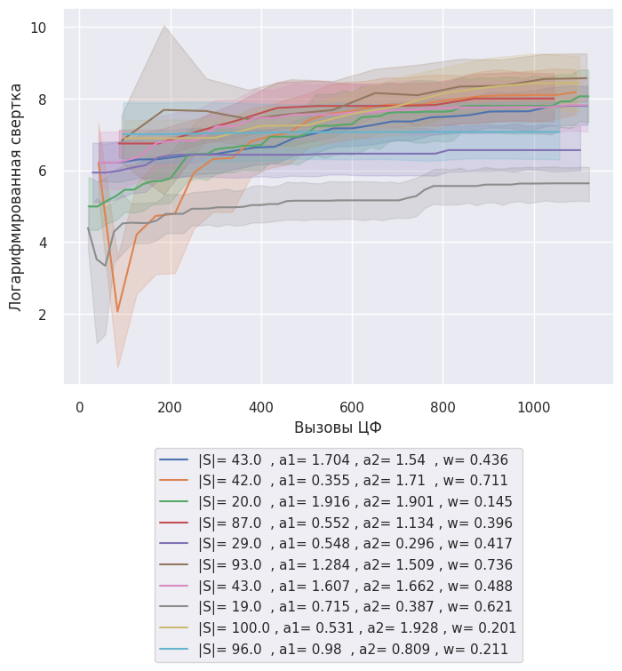
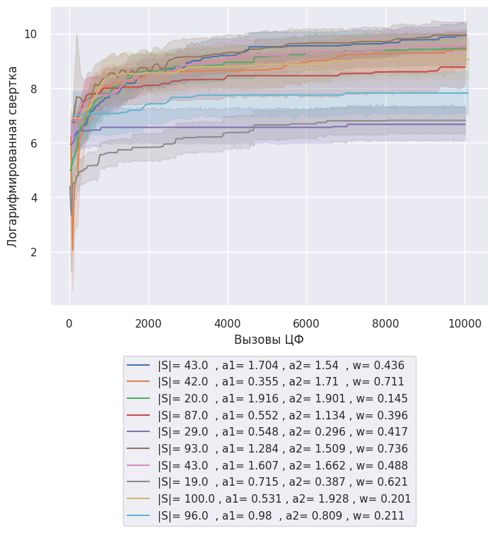

---
jupyter:
  colab:
    gpuType: T4
  kernelspec:
    display_name: Python 3
    name: python3
  language_info:
    codemirror_mode:
      name: ipython
      version: 3
    file_extension: .py
    mimetype: text/x-python
    name: python
    nbconvert_exporter: python
    pygments_lexer: ipython3
    version: 3.12.1
  nbformat: 4
  nbformat_minor: 0
---

EFFECTIVENESS_INTERACTION
```
    array([[ 0.25      ,  0.11111111,  0.0625    ,  0.04      ,  0.02777778,
             0.02040816],
           [ 6.        ,  0.25      ,  0.11111111,  0.0625    ,  0.04      ,
             0.02777778],
           [ 7.        ,  6.        ,  0.25      ,  0.11111111,  0.0625    ,
             0.04      ],
           [ 8.        ,  7.        ,  6.        ,  0.25      ,  0.11111111,
             0.0625    ],
           [ 9.        ,  8.        ,  7.        ,  6.        ,  0.25      ,
             0.11111111],
           [10.        ,  9.        ,  8.        ,  7.        ,  6.        ,
             0.25      ]])
```
# 10x10




# 10x10
# Вызовы ЦФ 0
```
  Расчет доверительных интервалов для каждой группы
  Параметры
  |S|= 19.0  , a1= 0.715 , a2= 0.387 , w= 0.621      (55.019256865848405, 185.0461777805222)
  |S|= 20.0  , a1= 1.916 , a2= 1.901 , w= 0.145      (251.34373697064927, 831.1125524555581)
  |S|= 29.0  , a1= 0.548 , a2= 0.296 , w= 0.417    (-2511.3023366768593, 11429.246050762778)
  |S|= 42.0  , a1= 0.355 , a2= 1.71  , w= 0.711     (-706.6301714279007, 10860.342093418276)
  |S|= 43.0  , a1= 1.607 , a2= 1.662 , w= 0.488      (-6270.887083805437, 22888.69780922786)
  |S|= 43.0  , a1= 1.704 , a2= 1.54  , w= 0.436       (432.5742787889933, 1735.726563945528)
  Name: Свертка, dtype: object
```
## MIN
|       |   Коль-во частиц |   MAX Количесво итераций | c1_c2_w                                                   |   № эксперемента |       Время |   Вызовы ЦФ |   Свертка | Распределение                   |   Логарифмированная свертка | Параметры                                     |   score |   AVG t |   AVG score | t                                                                        | Score                                                            |
|------:|-----------------:|-------------------------:|:----------------------------------------------------------|-----------------:|------------:|------------:|----------:|:--------------------------------|----------------------------:|:----------------------------------------------|--------:|--------:|------------:|:-------------------------------------------------------------------------|:-----------------------------------------------------------------|
| 35481 |               19 |                      526 | 0.7152822531830084_0.3866134304565536_0.620747578431883   |                1 | 0.0162036   |          38 |    0      | [-1 -1  0  8 -1  9  0  2  2  6] |                  -inf       | |S|= 19.0  , a1= 0.715 , a2= 0.387 , w= 0.621 |     3.4 | 1.47435 |     3.9     | [0.         0.         2.15814651 0.85763465 0.         2.39582971       | [7. 1. 9. 1. 1. 1. 7. 1. 8. 8.]                                  |
|       |                  |                          |                                                           |                  |             |             |           |                                 |                             |                                               |         |         |             |  2.10544348 1.21969436 2.1000372  3.90670522]                            |                                                                  |
| 13448 |               20 |                      500 | 1.9164651165895739_1.900872225412764_0.14524109418144696  |                9 | 7.15256e-07 |          20 |   13.3297 | [ 2  3 -1 -1 -1 -1  0  8  9 -1] |                     2.59    | |S|= 20.0  , a1= 1.916 , a2= 1.901 , w= 0.145 |     2.7 | 1.91547 |     3.21111 | [1.56347192 6.40173793 0.         0.         0.         0.               | [10.          1.          8.          0.11111111  1.          1. |
|       |                  |                          |                                                           |                  |             |             |           |                                 |                             |                                               |         |         |             |  2.10544348 2.76106081 6.32301105 0.        ]                            |   1.          1.          8.          6.        ]                |
| 27625 |               29 |                      344 | 0.5484913705011256_0.29601546503836_0.41684659408854485   |               18 | 9.53674e-07 |          29 |   15.3605 | [ 0 -1  9  8  7  1  2  6  3  4] |                     2.7318  | |S|= 29.0  , a1= 0.548 , a2= 0.296 , w= 0.417 |     4.9 | 3.71436 |     4.76111 | [10.41633333  0.          3.19367288  0.85763465  2.10232088  5.1507281  | [ 8.          0.25       10.          6.          9.          1. |
|       |                  |                          |                                                           |                  |             |             |           |                                 |                             |                                               |         |         |             |   2.51761282  3.5853784   6.50300411  2.81694607]                        |   6.          0.11111111  8.          0.25      ]                |
|  7289 |               42 |                      238 | 0.35529206381356226_1.7101241001807421_0.7110196951812913 |               12 | 1.19209e-06 |          42 |   25.4371 | [ 8 -1 -1 -1 -1  9  1  6 -1  3] |                     3.23621 | |S|= 42.0  , a1= 0.355 , a2= 1.71  , w= 0.711 |     3.2 | 1.75355 |     2.925   | [4.61278417 0.         0.         0.         0.         2.39582971       | [1.   0.25 1.   8.   1.   1.   6.   1.   7.   8.  ]              |
|       |                  |                          |                                                           |                  |             |             |           |                                 |                             |                                               |         |         |             |  1.65788487 3.5853784  0.         5.28362249]                            |                                                                  |
| 31519 |               43 |                      232 | 1.6073461591471596_1.6617126804074809_0.48802770234475623 |                4 | 9.53674e-07 |          43 |   48.1275 | [ 3 -1  0  2  1  6  9 -1 -1  4] |                     3.87385 | |S|= 43.0  , a1= 1.607 , a2= 1.662 , w= 0.488 |     3.2 | 3.41852 |     4.60278 | [15.70827807  0.          2.15814651  2.13006809  1.072956    7.31778655 | [7.         0.02777778 9.         6.         9.         1.       |
|       |                  |                          |                                                           |                  |             |             |           |                                 |                             |                                               |         |         |             |   2.98103647  0.          0.          2.81694607]                        |  7.         1.         1.         8.        ]                    |
|  1398 |               43 |                      232 | 1.7044015178975915_1.5401133655865746_0.43645726466467605 |                7 | 9.53674e-07 |          43 |   53.1246 | [ 4  2  3 -1 -1  9  8  0 -1  1] |                     3.97264 | |S|= 43.0  , a1= 1.704 , a2= 1.54  , w= 0.436 |     3.4 | 2.21956 |     3.95    | [2.94863434 2.92813328 3.48205637 0.         0.         2.39582971       | [9.   0.25 6.   0.25 7.   1.   1.   1.   9.   8.  ]              |
|       |                  |                          |                                                           |                  |             |             |           |                                 |                             |                                               |         |         |             |  2.08740937 3.77941141 0.         4.57414905]                            |                                                                  |
```
  AVG
  Коль-во частиц                32.666667
  MAX Количесво итераций       345.333333
  № эксперемента                 8.500000
  Время                          0.002701
  Вызовы ЦФ                     35.833333
  Свертка                       25.896571
  Логарифмированная свертка          -inf
  score                          3.466667
  AVG t                          2.415970
  AVG score                      3.891667
  dtype: float64

  Cвертка : -1,
  Распределение: [-1, -1, 0, 8, -1, 9, 0, 2, 2, 6]
  Колисчесвто целей:10. Количесвто UAV:10
  Ограниечнеи выбор целей не > 1: {'Цель 0 (Количестов нацеленных)': 2, 'Цель 1 (Количестов нацеленных)': 0, 'Цель 2 (Количестов нацеленных)': 2, 'Цель 3 (Количестов нацеленных)': 0, 'Цель 4 (Количестов нацеленных)': 0, 'Цель 5 (Количестов нацеленных)': 0, 'Цель 6 (Количестов нацеленных)': 1, 'Цель 7 (Количестов нацеленных)': 0, 'Цель 8 (Количестов нацеленных)': 1, 'Цель 9 (Количестов нацеленных)': 1}
  t: [0.         0.         2.15814651 0.85763465 0.         2.39582971
  2.10544348 1.21969436 2.1000372  3.90670522]
  AVG t: 1.474349113007111
  score: [7. 1. 9. 1. 1. 1. 7. 1. 8. 8.]
  AVG score: 3.9
  Количесво задействоанных UAV: 7


  Cвертка : 13.329713629369962,
  Распределение: [2, 3, -1, -1, -1, -1, 0, 8, 9, -1]
  Колисчесвто целей:10. Количесвто UAV:10
  Ограниечнеи выбор целей не > 1: {'Цель 0 (Количестов нацеленных)': 1, 'Цель 1 (Количестов нацеленных)': 0, 'Цель 2 (Количестов нацеленных)': 1, 'Цель 3 (Количестов нацеленных)': 1, 'Цель 4 (Количестов нацеленных)': 0, 'Цель 5 (Количестов нацеленных)': 0, 'Цель 6 (Количестов нацеленных)': 0, 'Цель 7 (Количестов нацеленных)': 0, 'Цель 8 (Количестов нацеленных)': 1, 'Цель 9 (Количестов нацеленных)': 1}
  t: [1.56347192 6.40173793 0.         0.         0.         0.
  2.10544348 2.76106081 6.32301105 0.        ]
  AVG t: 1.9154725189897992
  score: [10.          1.          8.          0.11111111  1.          1.
    1.          1.          8.          6.        ]
  AVG score: 3.2111111111111112
  Количесво задействоанных UAV: 5


  Cвертка : 15.360491543594216,
  Распределение: [0, -1, 9, 8, 7, 1, 2, 6, 3, 4]
  Колисчесвто целей:10. Количесвто UAV:10
  Ограниечнеи выбор целей не > 1: {'Цель 0 (Количестов нацеленных)': 1, 'Цель 1 (Количестов нацеленных)': 1, 'Цель 2 (Количестов нацеленных)': 1, 'Цель 3 (Количестов нацеленных)': 1, 'Цель 4 (Количестов нацеленных)': 1, 'Цель 5 (Количестов нацеленных)': 0, 'Цель 6 (Количестов нацеленных)': 1, 'Цель 7 (Количестов нацеленных)': 1, 'Цель 8 (Количестов нацеленных)': 1, 'Цель 9 (Количестов нацеленных)': 1}
  t: [10.41633333  0.          3.19367288  0.85763465  2.10232088  5.1507281
    2.51761282  3.5853784   6.50300411  2.81694607]
  AVG t: 3.71436312481841
  score: [ 8.          0.25       10.          6.          9.          1.
    6.          0.11111111  8.          0.25      ]
  AVG score: 4.761111111111111
  Количесво задействоанных UAV: 9


  Cвертка : 25.437093610380956,
  Распределение: [8, -1, -1, -1, -1, 9, 1, 6, -1, 3]
  Колисчесвто целей:10. Количесвто UAV:10
  Ограниечнеи выбор целей не > 1: {'Цель 0 (Количестов нацеленных)': 0, 'Цель 1 (Количестов нацеленных)': 1, 'Цель 2 (Количестов нацеленных)': 0, 'Цель 3 (Количестов нацеленных)': 1, 'Цель 4 (Количестов нацеленных)': 0, 'Цель 5 (Количестов нацеленных)': 0, 'Цель 6 (Количестов нацеленных)': 1, 'Цель 7 (Количестов нацеленных)': 0, 'Цель 8 (Количестов нацеленных)': 1, 'Цель 9 (Количестов нацеленных)': 1}
  t: [4.61278417 0.         0.         0.         0.         2.39582971
  1.65788487 3.5853784  0.         5.28362249]
  AVG t: 1.7535499639131984
  score: [1.   0.25 1.   8.   1.   1.   6.   1.   7.   8.  ]
  AVG score: 2.925
  Количесво задействоанных UAV: 5


  Cвертка : 48.1274902643898,
  Распределение: [3, -1, 0, 2, 1, 6, 9, -1, -1, 4]
  Колисчесвто целей:10. Количесвто UAV:10
  Ограниечнеи выбор целей не > 1: {'Цель 0 (Количестов нацеленных)': 1, 'Цель 1 (Количестов нацеленных)': 1, 'Цель 2 (Количестов нацеленных)': 1, 'Цель 3 (Количестов нацеленных)': 1, 'Цель 4 (Количестов нацеленных)': 1, 'Цель 5 (Количестов нацеленных)': 0, 'Цель 6 (Количестов нацеленных)': 1, 'Цель 7 (Количестов нацеленных)': 0, 'Цель 8 (Количестов нацеленных)': 0, 'Цель 9 (Количестов нацеленных)': 1}
  t: [15.70827807  0.          2.15814651  2.13006809  1.072956    7.31778655
    2.98103647  0.          0.          2.81694607]
  AVG t: 3.4185217771482335
  score: [7.         0.02777778 9.         6.         9.         1.
  7.         1.         1.         8.        ]
  AVG score: 4.602777777777778
  Количесво задействоанных UAV: 7


  Cвертка : 53.12463531282374,
  Распределение: [4, 2, 3, -1, -1, 9, 8, 0, -1, 1]
  Колисчесвто целей:10. Количесвто UAV:10
  Ограниечнеи выбор целей не > 1: {'Цель 0 (Количестов нацеленных)': 1, 'Цель 1 (Количестов нацеленных)': 1, 'Цель 2 (Количестов нацеленных)': 1, 'Цель 3 (Количестов нацеленных)': 1, 'Цель 4 (Количестов нацеленных)': 1, 'Цель 5 (Количестов нацеленных)': 0, 'Цель 6 (Количестов нацеленных)': 0, 'Цель 7 (Количестов нацеленных)': 0, 'Цель 8 (Количестов нацеленных)': 1, 'Цель 9 (Количестов нацеленных)': 1}
  t: [2.94863434 2.92813328 3.48205637 0.         0.         2.39582971
  2.08740937 3.77941141 0.         4.57414905]
  AVG t: 2.219562352254656
  score: [9.   0.25 6.   0.25 7.   1.   1.   1.   9.   8.  ]
  AVG score: 3.95
  Количесво задействоанных UAV: 7


  Параметры
  |S|= 19.0  , a1= 0.715 , a2= 0.387 , w= 0.621     0.000000
  |S|= 20.0  , a1= 1.916 , a2= 1.901 , w= 0.145    13.329714
  |S|= 29.0  , a1= 0.548 , a2= 0.296 , w= 0.417    15.360492
  |S|= 42.0  , a1= 0.355 , a2= 1.71  , w= 0.711    25.437094
  |S|= 43.0  , a1= 1.607 , a2= 1.662 , w= 0.488    48.127490
  |S|= 43.0  , a1= 1.704 , a2= 1.54  , w= 0.436    53.124635
  Name: Свертка, dtype: float64
```
## MAX
|       |   Коль-во частиц |   MAX Количесво итераций | c1_c2_w                                                   |   № эксперемента |       Время |   Вызовы ЦФ |   Свертка | Распределение                   |   Логарифмированная свертка | Параметры                                     |   score |   AVG t |   AVG score | t                                                                        | Score                                                      |
|------:|-----------------:|-------------------------:|:----------------------------------------------------------|-----------------:|------------:|------------:|----------:|:--------------------------------|----------------------------:|:----------------------------------------------|--------:|--------:|------------:|:-------------------------------------------------------------------------|:-----------------------------------------------------------|
| 44967 |               19 |                      526 | 0.7152822531830084_0.3866134304565536_0.620747578431883   |               19 | 0.0133958   |          38 |   1081.16 | [-1 -1 -1  6 -1  3  0  8  7 -1] |                     6.98579 | |S|= 19.0  , a1= 0.715 , a2= 0.387 , w= 0.621 |     2.9 | 1.43497 |     3.8     | [0.         0.         0.         4.2620757  0.         3.0016662        | [10.  1.  1.  8.  1.  1.  6.  6.  8.  1.]                  |
|       |                  |                          |                                                           |                  |             |             |           |                                 |                             |                                               |         |         |             |  2.10544348 2.76106081 2.21941011 0.        ]                            |                                                            |
| 11444 |               20 |                      500 | 1.9164651165895739_1.900872225412764_0.14524109418144696  |                5 | 9.53674e-07 |          20 |   3742.65 | [ 8  1  2  6 -1  7  4  9  0  3] |                     8.22755 | |S|= 20.0  , a1= 1.916 , a2= 1.901 , w= 0.145 |     4.9 | 4.08533 |     6.00278 | [4.61278417 5.65685425 1.51784547 4.2620757  0.         7.82048592       | [8.         0.02777778 7.         8.         9.         1. |
|       |                  |                          |                                                           |                  |             |             |           |                                 |                             |                                               |         |         |             |  1.91403137 5.17114501 4.61443049 5.28362249]                            |  6.         8.         7.         7.        ]              |
| 22450 |               29 |                      344 | 0.5484913705011256_0.29601546503836_0.41684659408854485   |                3 | 7.15256e-07 |          29 |  71631.8  | [ 3 -1  2  0 -1  4  6  9  7  8] |                    11.1793  | |S|= 29.0  , a1= 0.548 , a2= 0.296 , w= 0.417 |     4.7 | 4.4679  |     6       | [15.70827807  0.          1.51784547  6.27931143  0.          9.44510455 | [9. 1. 7. 6. 9. 1. 7. 6. 9. 7.]                            |
|       |                  |                          |                                                           |                  |             |             |           |                                 |                             |                                               |         |         |             |   0.82951235  5.17114501  2.21941011  3.50836742]                        |                                                            |
|  6811 |               42 |                      238 | 0.35529206381356226_1.7101241001807421_0.7110196951812913 |               10 | 2.14577e-06 |          42 |  58168.6  | [ 9 -1  2  6  0  7  3  8 -1  4] |                    10.9711  | |S|= 42.0  , a1= 0.355 , a2= 1.71  , w= 0.711 |     4.7 | 3.87466 |     5.8     | [14.97219645  0.          1.51784547  4.2620757   1.61206868  7.82048592 | [6. 1. 7. 8. 9. 1. 6. 8. 8. 6.]                            |
|       |                  |                          |                                                           |                  |             |             |           |                                 |                             |                                               |         |         |             |   2.98388868  2.76106081  0.          2.81694607]                        |                                                            |
| 34548 |               43 |                      232 | 1.6073461591471596_1.6617126804074809_0.48802770234475623 |               17 | 9.53674e-07 |          43 | 149532    | [ 8  2 -1  7 -1  0  6  9  3  4] |                    11.9153  | |S|= 43.0  , a1= 1.607 , a2= 1.662 , w= 0.488 |     4.7 | 2.96484 |     5.9     | [4.61278417 2.92813328 0.         2.66132385 0.         4.12553027       | [10.  1.  6.  6.  9.  1.  7.  7.  7.  7.]                  |
|       |                  |                          |                                                           |                  |             |             |           |                                 |                             |                                               |         |         |             |  0.82951235 5.17114501 6.50300411 2.81694607]                            |                                                            |
|  4427 |               43 |                      232 | 1.7044015178975915_1.5401133655865746_0.43645726466467605 |               20 | 1.19209e-06 |          43 |   6200.21 | [ 8 -1 -1  4 -1  0 -1  2  3  7] |                     8.73234 | |S|= 43.0  , a1= 1.704 , a2= 1.54  , w= 0.436 |     3   | 2.01841 |     4.8     | [4.61278417 0.         0.         1.2398347  0.         4.12553027       | [10.  1.  9.  6.  8.  1.  1.  8.  7.  1.]                  |
|       |                  |                          |                                                           |                  |             |             |           |                                 |                             |                                               |         |         |             |  0.         1.21969436 6.50300411 2.4832774 ]                            |                                                            |
```
  AVG
  Коль-во частиц                  32.666667
  MAX Количесво итераций         345.333333
  № эксперемента                  12.333333
  Время                            0.002234
  Вызовы ЦФ                       35.833333
  Свертка                      48392.676091
  Логарифмированная свертка        9.668556
  score                            4.150000
  AVG t                            3.141016
  AVG score                        5.383796
  dtype: float64

  Cвертка : 1081.1633406866738,
  Распределение: [-1, -1, -1, 6, -1, 3, 0, 8, 7, -1]
  Колисчесвто целей:10. Количесвто UAV:10
  Ограниечнеи выбор целей не > 1: {'Цель 0 (Количестов нацеленных)': 1, 'Цель 1 (Количестов нацеленных)': 0, 'Цель 2 (Количестов нацеленных)': 0, 'Цель 3 (Количестов нацеленных)': 1, 'Цель 4 (Количестов нацеленных)': 0, 'Цель 5 (Количестов нацеленных)': 0, 'Цель 6 (Количестов нацеленных)': 1, 'Цель 7 (Количестов нацеленных)': 1, 'Цель 8 (Количестов нацеленных)': 1, 'Цель 9 (Количестов нацеленных)': 0}
  t: [0.         0.         0.         4.2620757  0.         3.0016662
  2.10544348 2.76106081 2.21941011 0.        ]
  AVG t: 1.434965630444489
  score: [10.  1.  1.  8.  1.  1.  6.  6.  8.  1.]
  AVG score: 3.8
  Количесво задействоанных UAV: 5


  Cвертка : 3742.6489400668706,
  Распределение: [8, 1, 2, 6, -1, 7, 4, 9, 0, 3]
  Колисчесвто целей:10. Количесвто UAV:10
  Ограниечнеи выбор целей не > 1: {'Цель 0 (Количестов нацеленных)': 1, 'Цель 1 (Количестов нацеленных)': 1, 'Цель 2 (Количестов нацеленных)': 1, 'Цель 3 (Количестов нацеленных)': 1, 'Цель 4 (Количестов нацеленных)': 1, 'Цель 5 (Количестов нацеленных)': 0, 'Цель 6 (Количестов нацеленных)': 1, 'Цель 7 (Количестов нацеленных)': 1, 'Цель 8 (Количестов нацеленных)': 1, 'Цель 9 (Количестов нацеленных)': 1}
  t: [4.61278417 5.65685425 1.51784547 4.2620757  0.         7.82048592
  1.91403137 5.17114501 4.61443049 5.28362249]
  AVG t: 4.085327486822134
  score: [8.         0.02777778 7.         8.         9.         1.
  6.         8.         7.         7.        ]
  AVG score: 6.002777777777778
  Количесво задействоанных UAV: 9


  Cвертка : 71631.75332226118,
  Распределение: [3, -1, 2, 0, -1, 4, 6, 9, 7, 8]
  Колисчесвто целей:10. Количесвто UAV:10
  Ограниечнеи выбор целей не > 1: {'Цель 0 (Количестов нацеленных)': 1, 'Цель 1 (Количестов нацеленных)': 0, 'Цель 2 (Количестов нацеленных)': 1, 'Цель 3 (Количестов нацеленных)': 1, 'Цель 4 (Количестов нацеленных)': 1, 'Цель 5 (Количестов нацеленных)': 0, 'Цель 6 (Количестов нацеленных)': 1, 'Цель 7 (Количестов нацеленных)': 1, 'Цель 8 (Количестов нацеленных)': 1, 'Цель 9 (Количестов нацеленных)': 1}
  t: [15.70827807  0.          1.51784547  6.27931143  0.          9.44510455
    0.82951235  5.17114501  2.21941011  3.50836742]
  AVG t: 4.467897442620826
  score: [9. 1. 7. 6. 9. 1. 7. 6. 9. 7.]
  AVG score: 6.0
  Количесво задействоанных UAV: 8


  Cвертка : 58168.61959147471,
  Распределение: [9, -1, 2, 6, 0, 7, 3, 8, -1, 4]
  Колисчесвто целей:10. Количесвто UAV:10
  Ограниечнеи выбор целей не > 1: {'Цель 0 (Количестов нацеленных)': 1, 'Цель 1 (Количестов нацеленных)': 0, 'Цель 2 (Количестов нацеленных)': 1, 'Цель 3 (Количестов нацеленных)': 1, 'Цель 4 (Количестов нацеленных)': 1, 'Цель 5 (Количестов нацеленных)': 0, 'Цель 6 (Количестов нацеленных)': 1, 'Цель 7 (Количестов нацеленных)': 1, 'Цель 8 (Количестов нацеленных)': 1, 'Цель 9 (Количестов нацеленных)': 1}
  t: [14.97219645  0.          1.51784547  4.2620757   1.61206868  7.82048592
    2.98388868  2.76106081  0.          2.81694607]
  AVG t: 3.8746567790974646
  score: [6. 1. 7. 8. 9. 1. 6. 8. 8. 6.]
  AVG score: 5.8
  Количесво задействоанных UAV: 8


  Cвертка : 149531.65998828114,
  Распределение: [8, 2, -1, 7, -1, 0, 6, 9, 3, 4]
  Колисчесвто целей:10. Количесвто UAV:10
  Ограниечнеи выбор целей не > 1: {'Цель 0 (Количестов нацеленных)': 1, 'Цель 1 (Количестов нацеленных)': 0, 'Цель 2 (Количестов нацеленных)': 1, 'Цель 3 (Количестов нацеленных)': 1, 'Цель 4 (Количестов нацеленных)': 1, 'Цель 5 (Количестов нацеленных)': 0, 'Цель 6 (Количестов нацеленных)': 1, 'Цель 7 (Количестов нацеленных)': 1, 'Цель 8 (Количестов нацеленных)': 1, 'Цель 9 (Количестов нацеленных)': 1}
  t: [4.61278417 2.92813328 0.         2.66132385 0.         4.12553027
  0.82951235 5.17114501 6.50300411 2.81694607]
  AVG t: 2.964837911332137
  score: [10.  1.  6.  6.  9.  1.  7.  7.  7.  7.]
  AVG score: 5.9
  Количесво задействоанных UAV: 8


  Cвертка : 6200.211363297695,
  Распределение: [8, -1, -1, 4, -1, 0, -1, 2, 3, 7]
  Колисчесвто целей:10. Количесвто UAV:10
  Ограниечнеи выбор целей не > 1: {'Цель 0 (Количестов нацеленных)': 1, 'Цель 1 (Количестов нацеленных)': 0, 'Цель 2 (Количестов нацеленных)': 1, 'Цель 3 (Количестов нацеленных)': 1, 'Цель 4 (Количестов нацеленных)': 1, 'Цель 5 (Количестов нацеленных)': 0, 'Цель 6 (Количестов нацеленных)': 0, 'Цель 7 (Количестов нацеленных)': 1, 'Цель 8 (Количестов нацеленных)': 1, 'Цель 9 (Количестов нацеленных)': 0}
  t: [4.61278417 0.         0.         1.2398347  0.         4.12553027
  0.         1.21969436 6.50300411 2.4832774 ]
  AVG t: 2.018412500971038
  score: [10.  1.  9.  6.  8.  1.  1.  8.  7.  1.]
  AVG score: 4.8
  Количесво задействоанных UAV: 6


  Параметры
  |S|= 19.0  , a1= 0.715 , a2= 0.387 , w= 0.621      1081.163341
  |S|= 20.0  , a1= 1.916 , a2= 1.901 , w= 0.145      3742.648940
  |S|= 29.0  , a1= 0.548 , a2= 0.296 , w= 0.417     71631.753322
  |S|= 42.0  , a1= 0.355 , a2= 1.71  , w= 0.711     58168.619591
  |S|= 43.0  , a1= 1.607 , a2= 1.662 , w= 0.488    149531.659988
  |S|= 43.0  , a1= 1.704 , a2= 1.54  , w= 0.436      6200.211363
  Name: Свертка, dtype: float64
```


# Вызовы ЦФ 1000
```
  Расчет доверительных интервалов для каждой группы
  Параметры
  |S|= 100.0 , a1= 0.531 , a2= 1.928 , w= 0.201     (2839.5252752397464, 36200.83254098607)
  |S|= 19.0  , a1= 0.715 , a2= 0.387 , w= 0.621      (378.0951000552444, 506.0090818229785)
  |S|= 20.0  , a1= 1.916 , a2= 1.901 , w= 0.145     (6753.020083155096, 15127.697050937151)
  |S|= 29.0  , a1= 0.548 , a2= 0.296 , w= 0.417     (1199.4919328947453, 8018.586425887846)
  |S|= 42.0  , a1= 0.355 , a2= 1.71  , w= 0.711     (5923.883039386612, 13393.034982923324)
  |S|= 43.0  , a1= 1.607 , a2= 1.662 , w= 0.488     (2007.2159865093781, 22505.87946791472)
  |S|= 43.0  , a1= 1.704 , a2= 1.54  , w= 0.436     (2771.7998646770884, 6437.631445350316)
  |S|= 87.0  , a1= 0.552 , a2= 1.134 , w= 0.396      (4400.405930459367, 22554.27559047778)
  |S|= 93.0  , a1= 1.284 , a2= 1.509 , w= 0.736    (1806.8556521817172, 26106.116804530095)
  |S|= 96.0  , a1= 0.98  , a2= 0.809 , w= 0.211     (-2965.054017559736, 21040.23598233726)
  Name: Свертка, dtype: object
```
## MIN
|       |   Коль-во частиц |   MAX Количесво итераций | c1_c2_w                                                   |   № эксперемента |    Время |   Вызовы ЦФ |   Свертка | Распределение                   |   Логарифмированная свертка | Параметры                                     |   score |    AVG t |   AVG score | t                                                                        | Score                                                                    |
|------:|-----------------:|-------------------------:|:----------------------------------------------------------|-----------------:|---------:|------------:|----------:|:--------------------------------|----------------------------:|:----------------------------------------------|--------:|---------:|------------:|:-------------------------------------------------------------------------|:-------------------------------------------------------------------------|
| 47847 |              100 |                      100 | 0.5307411328239927_1.9283605680853273_0.20106471892068767 |               19 | 0.504998 |        1000 |  311.272  | [ 8  9 -1  7  2  4  0  6  3  5] |                     5.74067 | |S|= 100.0 , a1= 0.531 , a2= 1.928 , w= 0.201 |     5.3 | 3.89731  |     5.13611 | [4.61278417 5.88298117 0.         2.66132385 3.03172526 9.44510455       | [10.          1.          6.          6.          9.          0.25       |
|       |                  |                          |                                                           |                  |          |             |           |                                 |                             |                                               |         |          |             |  2.10544348 3.5853784  6.50300411 1.14530712]                            |   6.          7.          7.          0.11111111]                        |
| 37637 |               19 |                      526 | 0.7152822531830084_0.3866134304565536_0.620747578431883   |                5 | 0.461107 |         950 |   20.088  | [-1  4  3 -1  2  6  7  9  8 -1] |                     3.00012 | |S|= 19.0  , a1= 0.715 , a2= 0.387 , w= 0.621 |     4.6 | 2.52608  |     3.55    | [0.         4.22447084 3.48205637 0.         3.03172526 7.31778655       | [1.   1.   6.   0.25 0.25 1.   7.   8.   7.   7.  ]                      |
|       |                  |                          |                                                           |                  |          |             |           |                                 |                             |                                               |         |          |             |  1.84616293 5.17114501 0.1875     0.        ]                            |                                                                          |
| 13495 |               20 |                      500 | 1.9164651165895739_1.900872225412764_0.14524109418144696  |                9 | 0.444926 |         960 |   72.7179 | [-1 -1 -1 -1 -1  0  2 -1 -1  4] |                     4.28659 | |S|= 20.0  , a1= 1.916 , a2= 1.901 , w= 0.145 |     0.9 | 0.946009 |     2.9     | [0.         0.         0.         0.         0.         4.12553027       | [10.  1. 10.  1.  9.  1.  1.  1.  1.  1.]                                |
|       |                  |                          |                                                           |                  |          |             |           |                                 |                             |                                               |         |          |             |  2.51761282 0.         0.         2.81694607]                            |                                                                          |
| 24552 |               29 |                      344 | 0.5484913705011256_0.29601546503836_0.41684659408854485   |                9 | 0.454818 |         957 |  102.311  | [ 4 -1  0  9  2  1  5 -1  8  7] |                     4.62802 | |S|= 29.0  , a1= 0.548 , a2= 0.296 , w= 0.417 |     4.4 | 2.78237  |     4.25    | [2.94863434 0.         2.15814651 8.80035687 3.03172526 5.1507281        | [7.   0.25 6.   1.   7.   0.25 1.   8.   7.   7.  ]                      |
|       |                  |                          |                                                           |                  |          |             |           |                                 |                             |                                               |         |          |             |  3.06328956 0.         0.1875     2.4832774 ]                            |                                                                          |
|  8267 |               42 |                      238 | 0.35529206381356226_1.7101241001807421_0.7110196951812913 |               16 | 0.432163 |         966 |  226.252  | [-1 -1 -1  7 -1  3 -1  6 -1  0] |                     5.42165 | |S|= 42.0  , a1= 0.355 , a2= 1.71  , w= 0.711 |     2   | 1.2961   |     3.1     | [0.         0.         0.         2.66132385 0.         3.0016662        | [10.  1.  1.  8.  1.  1.  6.  7.  1.  1.]                                |
|       |                  |                          |                                                           |                  |          |             |           |                                 |                             |                                               |         |          |             |  0.         3.5853784  0.         3.71267432]                            |                                                                          |
| 30842 |               43 |                      232 | 1.6073461591471596_1.6617126804074809_0.48802770234475623 |                1 | 0.493297 |         989 |  137.757  | [ 7  8  2 -1 -1  0 -1  6  4 -1] |                     4.92549 | |S|= 43.0  , a1= 1.607 , a2= 1.662 , w= 0.488 |     3.3 | 1.96034  |     3.625   | [3.83695481 5.3354902  1.51784547 0.         0.         4.12553027       | [10.    1.    7.    1.    7.    1.    6.    6.    0.25  1.  ]            |
|       |                  |                          |                                                           |                  |          |             |           |                                 |                             |                                               |         |          |             |  0.         3.5853784  1.2022115  0.        ]                            |                                                                          |
|  3517 |               43 |                      232 | 1.7044015178975915_1.5401133655865746_0.43645726466467605 |               16 | 0.462897 |         989 |  318.146  | [-1  4  0 -1 -1  3  7 -1  2  8] |                     5.76251 | |S|= 43.0  , a1= 1.704 , a2= 1.54  , w= 0.436 |     3   | 1.68389  |     4.025   | [0.         4.22447084 2.15814651 0.         0.         3.0016662        | [7.   1.   8.   8.   0.25 1.   1.   8.   9.   1.  ]                      |
|       |                  |                          |                                                           |                  |          |             |           |                                 |                             |                                               |         |          |             |  1.84616293 0.         2.1000372  3.50836742]                            |                                                                          |
| 20505 |               87 |                      114 | 0.5521327914745936_1.1340355280623087_0.39596413323846347 |               10 | 0.450307 |         957 |  421.116  | [ 3  4  8  7 -1  2  6  0  9  1] |                     6.04291 | |S|= 87.0  , a1= 0.552 , a2= 1.134 , w= 0.396 |     4.9 | 4.99064  |     5.15    | [15.70827807  4.22447084  2.94392029  2.66132385  0.          8.86227962 | [ 9.    0.25 10.    6.    0.25  1.    7.    7.    6.    6.  ]            |
|       |                  |                          |                                                           |                  |          |             |           |                                 |                             |                                               |         |          |             |   0.82951235  3.77941141  6.32301105  4.57414905]                        |                                                                          |
| 29210 |               93 |                      107 | 1.2835132202904338_1.5093952795953858_0.7361548524525573  |                6 | 0.480694 |        1023 |    0      | [ 3  0  8  5 -1  2  9  5  6  4] |                  -inf       | |S|= 93.0  , a1= 1.284 , a2= 1.509 , w= 0.736 |     5.1 | 4.66901  |     4.53611 | [15.70827807  4.34938614  2.94392029  4.59428319  0.          8.86227962 | [ 6.          1.         10.          6.          9.          0.11111111 |
|       |                  |                          |                                                           |                  |          |             |           |                                 |                             |                                               |         |          |             |   2.98103647  1.43264411  3.0013018   2.81694607]                        |   0.25        1.          6.          8.        ]                        |
| 49309 |               96 |                      104 | 0.9797139798485407_0.8092926696505798_0.21083153001156418 |               13 | 0.452703 |         960 |  104.316  | [ 4 -1 -1  3  5  6  2 -1  8  0] |                     4.64743 | |S|= 96.0  , a1= 0.98  , a2= 0.809 , w= 0.211 |     3.5 | 2.91376  |     4.80278 | [2.94863434 0.         0.         9.13353642 3.31988026 7.31778655       | [10.          1.         10.          7.          7.          0.02777778 |
|       |                  |                          |                                                           |                  |          |             |           |                                 |                             |                                               |         |          |             |  2.51761282 0.         0.1875     3.71267432]                            |   7.          1.          7.          1.        ]                        |
```
  AVG
  Коль-во частиц                57.200000
  MAX Количесво итераций       249.700000
  № эксперемента                10.400000
  Время                          0.463791
  Вызовы ЦФ                    975.100000
  Свертка                      171.397662
  Логарифмированная свертка          -inf
  score                          3.700000
  AVG t                          2.766550
  AVG score                      4.107500
  dtype: float64

  Cвертка : 311.27236165405685,
  Распределение: [8, 9, -1, 7, 2, 4, 0, 6, 3, 5]
  Колисчесвто целей:10. Количесвто UAV:10
  Ограниечнеи выбор целей не > 1: {'Цель 0 (Количестов нацеленных)': 1, 'Цель 1 (Количестов нацеленных)': 0, 'Цель 2 (Количестов нацеленных)': 1, 'Цель 3 (Количестов нацеленных)': 1, 'Цель 4 (Количестов нацеленных)': 1, 'Цель 5 (Количестов нацеленных)': 1, 'Цель 6 (Количестов нацеленных)': 1, 'Цель 7 (Количестов нацеленных)': 1, 'Цель 8 (Количестов нацеленных)': 1, 'Цель 9 (Количестов нацеленных)': 1}
  t: [4.61278417 5.88298117 0.         2.66132385 3.03172526 9.44510455
  2.10544348 3.5853784  6.50300411 1.14530712]
  AVG t: 3.89730521070794
  score: [10.          1.          6.          6.          9.          0.25
    6.          7.          7.          0.11111111]
  AVG score: 5.136111111111111
  Количесво задействоанных UAV: 9


  Cвертка : 20.088041511424304,
  Распределение: [-1, 4, 3, -1, 2, 6, 7, 9, 8, -1]
  Колисчесвто целей:10. Количесвто UAV:10
  Ограниечнеи выбор целей не > 1: {'Цель 0 (Количестов нацеленных)': 0, 'Цель 1 (Количестов нацеленных)': 0, 'Цель 2 (Количестов нацеленных)': 1, 'Цель 3 (Количестов нацеленных)': 1, 'Цель 4 (Количестов нацеленных)': 1, 'Цель 5 (Количестов нацеленных)': 0, 'Цель 6 (Количестов нацеленных)': 1, 'Цель 7 (Количестов нацеленных)': 1, 'Цель 8 (Количестов нацеленных)': 1, 'Цель 9 (Количестов нацеленных)': 1}
  t: [0.         4.22447084 3.48205637 0.         3.03172526 7.31778655
  1.84616293 5.17114501 0.1875     0.        ]
  AVG t: 2.5260846957717122
  score: [1.   1.   6.   0.25 0.25 1.   7.   8.   7.   7.  ]
  AVG score: 3.55
  Количесво задействоанных UAV: 7


  Cвертка : 72.71792483455795,
  Распределение: [-1, -1, -1, -1, -1, 0, 2, -1, -1, 4]
  Колисчесвто целей:10. Количесвто UAV:10
  Ограниечнеи выбор целей не > 1: {'Цель 0 (Количестов нацеленных)': 1, 'Цель 1 (Количестов нацеленных)': 0, 'Цель 2 (Количестов нацеленных)': 1, 'Цель 3 (Количестов нацеленных)': 0, 'Цель 4 (Количестов нацеленных)': 1, 'Цель 5 (Количестов нацеленных)': 0, 'Цель 6 (Количестов нацеленных)': 0, 'Цель 7 (Количестов нацеленных)': 0, 'Цель 8 (Количестов нацеленных)': 0, 'Цель 9 (Количестов нацеленных)': 0}
  t: [0.         0.         0.         0.         0.         4.12553027
  2.51761282 0.         0.         2.81694607]
  AVG t: 0.9460089159154672
  score: [10.  1. 10.  1.  9.  1.  1.  1.  1.  1.]
  AVG score: 2.9
  Количесво задействоанных UAV: 3


  Cвертка : 102.31119187292846,
  Распределение: [4, -1, 0, 9, 2, 1, 5, -1, 8, 7]
  Колисчесвто целей:10. Количесвто UAV:10
  Ограниечнеи выбор целей не > 1: {'Цель 0 (Количестов нацеленных)': 1, 'Цель 1 (Количестов нацеленных)': 1, 'Цель 2 (Количестов нацеленных)': 1, 'Цель 3 (Количестов нацеленных)': 0, 'Цель 4 (Количестов нацеленных)': 1, 'Цель 5 (Количестов нацеленных)': 1, 'Цель 6 (Количестов нацеленных)': 0, 'Цель 7 (Количестов нацеленных)': 1, 'Цель 8 (Количестов нацеленных)': 1, 'Цель 9 (Количестов нацеленных)': 1}
  t: [2.94863434 0.         2.15814651 8.80035687 3.03172526 5.1507281
  3.06328956 0.         0.1875     2.4832774 ]
  AVG t: 2.782365803668051
  score: [7.   0.25 6.   1.   7.   0.25 1.   8.   7.   7.  ]
  AVG score: 4.25
  Количесво задействоанных UAV: 8


  Cвертка : 226.2520025370773,
  Распределение: [-1, -1, -1, 7, -1, 3, -1, 6, -1, 0]
  Колисчесвто целей:10. Количесвто UAV:10
  Ограниечнеи выбор целей не > 1: {'Цель 0 (Количестов нацеленных)': 1, 'Цель 1 (Количестов нацеленных)': 0, 'Цель 2 (Количестов нацеленных)': 0, 'Цель 3 (Количестов нацеленных)': 1, 'Цель 4 (Количестов нацеленных)': 0, 'Цель 5 (Количестов нацеленных)': 0, 'Цель 6 (Количестов нацеленных)': 1, 'Цель 7 (Количестов нацеленных)': 1, 'Цель 8 (Количестов нацеленных)': 0, 'Цель 9 (Количестов нацеленных)': 0}
  t: [0.         0.         0.         2.66132385 0.         3.0016662
  0.         3.5853784  0.         3.71267432]
  AVG t: 1.2961042774269171
  score: [10.  1.  1.  8.  1.  1.  6.  7.  1.  1.]
  AVG score: 3.1
  Количесво задействоанных UAV: 4


  Cвертка : 137.75678956061589,
  Распределение: [7, 8, 2, -1, -1, 0, -1, 6, 4, -1]
  Колисчесвто целей:10. Количесвто UAV:10
  Ограниечнеи выбор целей не > 1: {'Цель 0 (Количестов нацеленных)': 1, 'Цель 1 (Количестов нацеленных)': 0, 'Цель 2 (Количестов нацеленных)': 1, 'Цель 3 (Количестов нацеленных)': 0, 'Цель 4 (Количестов нацеленных)': 1, 'Цель 5 (Количестов нацеленных)': 0, 'Цель 6 (Количестов нацеленных)': 1, 'Цель 7 (Количестов нацеленных)': 1, 'Цель 8 (Количестов нацеленных)': 1, 'Цель 9 (Количестов нацеленных)': 0}
  t: [3.83695481 5.3354902  1.51784547 0.         0.         4.12553027
  0.         3.5853784  1.2022115  0.        ]
  AVG t: 1.9603410650444701
  score: [10.    1.    7.    1.    7.    1.    6.    6.    0.25  1.  ]
  AVG score: 3.625
  Количесво задействоанных UAV: 6


  Cвертка : 318.14635539052756,
  Распределение: [-1, 4, 0, -1, -1, 3, 7, -1, 2, 8]
  Колисчесвто целей:10. Количесвто UAV:10
  Ограниечнеи выбор целей не > 1: {'Цель 0 (Количестов нацеленных)': 1, 'Цель 1 (Количестов нацеленных)': 0, 'Цель 2 (Количестов нацеленных)': 1, 'Цель 3 (Количестов нацеленных)': 1, 'Цель 4 (Количестов нацеленных)': 1, 'Цель 5 (Количестов нацеленных)': 0, 'Цель 6 (Количестов нацеленных)': 0, 'Цель 7 (Количестов нацеленных)': 1, 'Цель 8 (Количестов нацеленных)': 1, 'Цель 9 (Количестов нацеленных)': 0}
  t: [0.         4.22447084 2.15814651 0.         0.         3.0016662
  1.84616293 0.         2.1000372  3.50836742]
  AVG t: 1.6838851112786863
  score: [7.   1.   8.   8.   0.25 1.   1.   8.   9.   1.  ]
  AVG score: 4.025
  Количесво задействоанных UAV: 6


  Cвертка : 421.1155398134108,
  Распределение: [3, 4, 8, 7, -1, 2, 6, 0, 9, 1]
  Колисчесвто целей:10. Количесвто UAV:10
  Ограниечнеи выбор целей не > 1: {'Цель 0 (Количестов нацеленных)': 1, 'Цель 1 (Количестов нацеленных)': 1, 'Цель 2 (Количестов нацеленных)': 1, 'Цель 3 (Количестов нацеленных)': 1, 'Цель 4 (Количестов нацеленных)': 1, 'Цель 5 (Количестов нацеленных)': 0, 'Цель 6 (Количестов нацеленных)': 1, 'Цель 7 (Количестов нацеленных)': 1, 'Цель 8 (Количестов нацеленных)': 1, 'Цель 9 (Количестов нацеленных)': 1}
  t: [15.70827807  4.22447084  2.94392029  2.66132385  0.          8.86227962
    0.82951235  3.77941141  6.32301105  4.57414905]
  AVG t: 4.990635652131527
  score: [ 9.    0.25 10.    6.    0.25  1.    7.    7.    6.    6.  ]
  AVG score: 5.15
  Количесво задействоанных UAV: 9


  Cвертка : -1,
  Распределение: [3, 0, 8, 5, -1, 2, 9, 5, 6, 4]
  Колисчесвто целей:10. Количесвто UAV:10
  Ограниечнеи выбор целей не > 1: {'Цель 0 (Количестов нацеленных)': 1, 'Цель 1 (Количестов нацеленных)': 0, 'Цель 2 (Количестов нацеленных)': 1, 'Цель 3 (Количестов нацеленных)': 1, 'Цель 4 (Количестов нацеленных)': 1, 'Цель 5 (Количестов нацеленных)': 2, 'Цель 6 (Количестов нацеленных)': 1, 'Цель 7 (Количестов нацеленных)': 0, 'Цель 8 (Количестов нацеленных)': 1, 'Цель 9 (Количестов нацеленных)': 1}
  t: [15.70827807  4.34938614  2.94392029  4.59428319  0.          8.86227962
    2.98103647  1.43264411  3.0013018   2.81694607]
  AVG t: 4.669007575656166
  score: [ 6.          1.         10.          6.          9.          0.11111111
    0.25        1.          6.          8.        ]
  AVG score: 4.536111111111111
  Количесво задействоанных UAV: 9


  Cвертка : 104.31641519532832,
  Распределение: [4, -1, -1, 3, 5, 6, 2, -1, 8, 0]
  Колисчесвто целей:10. Количесвто UAV:10
  Ограниечнеи выбор целей не > 1: {'Цель 0 (Количестов нацеленных)': 1, 'Цель 1 (Количестов нацеленных)': 0, 'Цель 2 (Количестов нацеленных)': 1, 'Цель 3 (Количестов нацеленных)': 1, 'Цель 4 (Количестов нацеленных)': 1, 'Цель 5 (Количестов нацеленных)': 1, 'Цель 6 (Количестов нацеленных)': 1, 'Цель 7 (Количестов нацеленных)': 0, 'Цель 8 (Количестов нацеленных)': 1, 'Цель 9 (Количестов нацеленных)': 0}
  t: [2.94863434 0.         0.         9.13353642 3.31988026 7.31778655
  2.51761282 0.         0.1875     3.71267432]
  AVG t: 2.9137624706858265
  score: [10.          1.         10.          7.          7.          0.02777778
    7.          1.          7.          1.        ]
  AVG score: 4.802777777777778
  Количесво задействоанных UAV: 7


  Параметры
  |S|= 100.0 , a1= 0.531 , a2= 1.928 , w= 0.201    311.272362
  |S|= 19.0  , a1= 0.715 , a2= 0.387 , w= 0.621     20.088042
  |S|= 20.0  , a1= 1.916 , a2= 1.901 , w= 0.145     72.717925
  |S|= 29.0  , a1= 0.548 , a2= 0.296 , w= 0.417    102.311192
  |S|= 42.0  , a1= 0.355 , a2= 1.71  , w= 0.711    226.252003
  |S|= 43.0  , a1= 1.607 , a2= 1.662 , w= 0.488    137.756790
  |S|= 43.0  , a1= 1.704 , a2= 1.54  , w= 0.436    318.146355
  |S|= 87.0  , a1= 0.552 , a2= 1.134 , w= 0.396    421.115540
  |S|= 93.0  , a1= 1.284 , a2= 1.509 , w= 0.736      0.000000
  |S|= 96.0  , a1= 0.98  , a2= 0.809 , w= 0.211    104.316415
  Name: Свертка, dtype: float64
```
## MAX
|       |   Коль-во частиц |   MAX Количесво итераций | c1_c2_w                                                   |   № эксперемента |    Время |   Вызовы ЦФ |   Свертка | Распределение                   |   Логарифмированная свертка | Параметры                                     |   score |   AVG t |   AVG score | t                                                                        | Score                                     |
|------:|-----------------:|-------------------------:|:----------------------------------------------------------|-----------------:|---------:|------------:|----------:|:--------------------------------|----------------------------:|:----------------------------------------------|--------:|--------:|------------:|:-------------------------------------------------------------------------|:------------------------------------------|
| 46433 |              100 |                      100 | 0.5307411328239927_1.9283605680853273_0.20106471892068767 |                5 | 0.498653 |        1000 | 131986    | [ 4 -1 -1  6  0  7  9  8  2  3] |                    11.7904  | |S|= 100.0 , a1= 0.531 , a2= 1.928 , w= 0.201 |     4.7 | 2.9769  |         5.9 | [2.94863434 0.         0.         4.2620757  1.61206868 7.82048592       | [6. 1. 8. 8. 7. 1. 6. 8. 8. 8.]           |
|       |                  |                          |                                                           |                  |          |             |           |                                 |                             |                                               |         |         |             |  2.98103647 2.76106081 2.1000372  5.28362249]                            |                                           |
| 38164 |               19 |                      526 | 0.7152822531830084_0.3866134304565536_0.620747578431883   |                6 | 0.450274 |         950 |   1237.56 | [ 3 -1  4 -1  2  0  8 -1  7 -1] |                     7.1209  | |S|= 19.0  , a1= 0.715 , a2= 0.387 , w= 0.621 |     3   | 2.93695 |         4.3 | [15.70827807  0.          2.19719467  0.          3.03172526  4.12553027 | [10.  1.  6.  6.  6.  1.  1.  6.  9.  1.] |
|       |                  |                          |                                                           |                  |          |             |           |                                 |                             |                                               |         |         |             |   2.08740937  0.          2.21941011  0.        ]                        |                                           |
| 18004 |               20 |                      500 | 1.9164651165895739_1.900872225412764_0.14524109418144696  |               18 | 0.472432 |         960 |  86432.2  | [ 4  0 -1  9 -1  8  2  6  3  7] |                    11.3671  | |S|= 20.0  , a1= 1.916 , a2= 1.901 , w= 0.145 |     4.7 | 4.22085 |         5.9 | [ 2.94863434  4.34938614  0.          8.80035687  0.         11.02088926 | [ 6.  1. 10.  6.  7.  1.  6.  8.  9.  7.] |
|       |                  |                          |                                                           |                  |          |             |           |                                 |                             |                                               |         |         |             |   2.51761282  3.5853784   6.50300411  2.4832774 ]                        |                                           |
| 22482 |               29 |                      344 | 0.5484913705011256_0.29601546503836_0.41684659408854485   |                3 | 0.503814 |         957 |  71631.8  | [ 3 -1  2  0 -1  4  6  9  7  8] |                    11.1793  | |S|= 29.0  , a1= 0.548 , a2= 0.296 , w= 0.417 |     4.7 | 4.4679  |         6   | [15.70827807  0.          1.51784547  6.27931143  0.          9.44510455 | [9. 1. 7. 6. 9. 1. 7. 6. 9. 7.]           |
|       |                  |                          |                                                           |                  |          |             |           |                                 |                             |                                               |         |         |             |   0.82951235  5.17114501  2.21941011  3.50836742]                        |                                           |
|  6833 |               42 |                      238 | 0.35529206381356226_1.7101241001807421_0.7110196951812913 |               10 | 0.723708 |         966 |  58168.6  | [ 9 -1  2  6  0  7  3  8 -1  4] |                    10.9711  | |S|= 42.0  , a1= 0.355 , a2= 1.71  , w= 0.711 |     4.7 | 3.87466 |         5.8 | [14.97219645  0.          1.51784547  4.2620757   1.61206868  7.82048592 | [6. 1. 7. 8. 9. 1. 6. 8. 8. 6.]           |
|       |                  |                          |                                                           |                  |          |             |           |                                 |                             |                                               |         |         |             |   2.98388868  2.76106081  0.          2.81694607]                        |                                           |
| 34570 |               43 |                      232 | 1.6073461591471596_1.6617126804074809_0.48802770234475623 |               17 | 0.510956 |         989 | 149532    | [ 8  2 -1  7 -1  0  6  9  3  4] |                    11.9153  | |S|= 43.0  , a1= 1.607 , a2= 1.662 , w= 0.488 |     4.7 | 2.96484 |         5.9 | [4.61278417 2.92813328 0.         2.66132385 0.         4.12553027       | [10.  1.  6.  6.  9.  1.  7.  7.  7.  7.] |
|       |                  |                          |                                                           |                  |          |             |           |                                 |                             |                                               |         |         |             |  0.82951235 5.17114501 6.50300411 2.81694607]                            |                                           |
|  3284 |               43 |                      232 | 1.7044015178975915_1.5401133655865746_0.43645726466467605 |               15 | 0.463439 |         989 |  19132.1  | [ 8 -1  4  0  2 -1  7 -1  3  9] |                     9.85912 | |S|= 43.0  , a1= 1.704 , a2= 1.54  , w= 0.436 |     4   | 2.94199 |         5   | [4.61278417 0.         2.19719467 6.27931143 3.03172526 0.               | [9. 1. 6. 6. 6. 1. 1. 8. 7. 8.]           |
|       |                  |                          |                                                           |                  |          |             |           |                                 |                             |                                               |         |         |             |  1.84616293 0.         6.50300411 4.94974747]                            |                                           |
| 19585 |               87 |                      114 | 0.5521327914745936_1.1340355280623087_0.39596413323846347 |                2 | 0.461635 |         957 | 115457    | [ 4 -1 -1  9  0  7  3  6  2  8] |                    11.6567  | |S|= 87.0  , a1= 0.552 , a2= 1.134 , w= 0.396 |     4.7 | 3.33592 |         5.9 | [2.94863434 0.         0.         8.80035687 1.61206868 7.82048592       | [6. 1. 8. 8. 7. 1. 6. 8. 9. 7.]           |
|       |                  |                          |                                                           |                  |          |             |           |                                 |                             |                                               |         |         |             |  2.98388868 3.5853784  2.1000372  3.50836742]                            |                                           |
| 29534 |               93 |                      107 | 1.2835132202904338_1.5093952795953858_0.7361548524525573  |                9 | 0.462988 |        1023 | 120520    | [ 2  0  4  7 -1  3  8 -1  9  6] |                    11.6996  | |S|= 93.0  , a1= 1.284 , a2= 1.509 , w= 0.736 |     4.7 | 2.60902 |         5.7 | [1.56347192 4.34938614 2.19719467 2.66132385 0.         3.0016662        | [6. 1. 8. 8. 6. 1. 7. 7. 9. 6.]           |
|       |                  |                          |                                                           |                  |          |             |           |                                 |                             |                                               |         |         |             |  2.08740937 0.         6.32301105 3.90670522]                            |                                           |
| 49204 |               96 |                      104 | 0.9797139798485407_0.8092926696505798_0.21083153001156418 |               12 | 0.43525  |         960 | 123544    | [ 8 -1  0  2 -1  4  3  9  7  6] |                    11.7244  | |S|= 96.0  , a1= 0.98  , a2= 0.809 , w= 0.211 |     4.7 | 3.26273 |         6   | [4.61278417 0.         2.15814651 2.13006809 0.         9.44510455       | [7. 1. 9. 8. 9. 1. 7. 6. 7. 7.]           |
|       |                  |                          |                                                           |                  |          |             |           |                                 |                             |                                               |         |         |             |  2.98388868 5.17114501 2.21941011 3.90670522]                            |                                           |
```
  AVG
  Коль-во частиц                  57.200000
  MAX Количесво итераций         249.700000
  № эксперемента                   9.700000
  Время                            0.498315
  Вызовы ЦФ                      975.100000
  Свертка                      87764.049719
  Логарифмированная свертка       10.928382
  score                            4.460000
  AVG t                            3.359176
  AVG score                        5.640000
  dtype: float64

  Cвертка : 131985.66058031743,
  Распределение: [4, -1, -1, 6, 0, 7, 9, 8, 2, 3]
  Колисчесвто целей:10. Количесвто UAV:10
  Ограниечнеи выбор целей не > 1: {'Цель 0 (Количестов нацеленных)': 1, 'Цель 1 (Количестов нацеленных)': 0, 'Цель 2 (Количестов нацеленных)': 1, 'Цель 3 (Количестов нацеленных)': 1, 'Цель 4 (Количестов нацеленных)': 1, 'Цель 5 (Количестов нацеленных)': 0, 'Цель 6 (Количестов нацеленных)': 1, 'Цель 7 (Количестов нацеленных)': 1, 'Цель 8 (Количестов нацеленных)': 1, 'Цель 9 (Количестов нацеленных)': 1}
  t: [2.94863434 0.         0.         4.2620757  1.61206868 7.82048592
  2.98103647 2.76106081 2.1000372  5.28362249]
  AVG t: 2.9769021610963358
  score: [6. 1. 8. 8. 7. 1. 6. 8. 8. 8.]
  AVG score: 5.9
  Количесво задействоанных UAV: 8


  Cвертка : 1237.5640353700237,
  Распределение: [3, -1, 4, -1, 2, 0, 8, -1, 7, -1]
  Колисчесвто целей:10. Количесвто UAV:10
  Ограниечнеи выбор целей не > 1: {'Цель 0 (Количестов нацеленных)': 1, 'Цель 1 (Количестов нацеленных)': 0, 'Цель 2 (Количестов нацеленных)': 1, 'Цель 3 (Количестов нацеленных)': 1, 'Цель 4 (Количестов нацеленных)': 1, 'Цель 5 (Количестов нацеленных)': 0, 'Цель 6 (Количестов нацеленных)': 0, 'Цель 7 (Количестов нацеленных)': 1, 'Цель 8 (Количестов нацеленных)': 1, 'Цель 9 (Количестов нацеленных)': 0}
  t: [15.70827807  0.          2.19719467  0.          3.03172526  4.12553027
    2.08740937  0.          2.21941011  0.        ]
  AVG t: 2.936954774678237
  score: [10.  1.  6.  6.  6.  1.  1.  6.  9.  1.]
  AVG score: 4.3
  Количесво задействоанных UAV: 6


  Cвертка : 86432.22682362236,
  Распределение: [4, 0, -1, 9, -1, 8, 2, 6, 3, 7]
  Колисчесвто целей:10. Количесвто UAV:10
  Ограниечнеи выбор целей не > 1: {'Цель 0 (Количестов нацеленных)': 1, 'Цель 1 (Количестов нацеленных)': 0, 'Цель 2 (Количестов нацеленных)': 1, 'Цель 3 (Количестов нацеленных)': 1, 'Цель 4 (Количестов нацеленных)': 1, 'Цель 5 (Количестов нацеленных)': 0, 'Цель 6 (Количестов нацеленных)': 1, 'Цель 7 (Количестов нацеленных)': 1, 'Цель 8 (Количестов нацеленных)': 1, 'Цель 9 (Количестов нацеленных)': 1}
  t: [ 2.94863434  4.34938614  0.          8.80035687  0.         11.02088926
    2.51761282  3.5853784   6.50300411  2.4832774 ]
  AVG t: 4.220853932928201
  score: [ 6.  1. 10.  6.  7.  1.  6.  8.  9.  7.]
  AVG score: 5.9
  Количесво задействоанных UAV: 8


  Cвертка : 71631.75332226118,
  Распределение: [3, -1, 2, 0, -1, 4, 6, 9, 7, 8]
  Колисчесвто целей:10. Количесвто UAV:10
  Ограниечнеи выбор целей не > 1: {'Цель 0 (Количестов нацеленных)': 1, 'Цель 1 (Количестов нацеленных)': 0, 'Цель 2 (Количестов нацеленных)': 1, 'Цель 3 (Количестов нацеленных)': 1, 'Цель 4 (Количестов нацеленных)': 1, 'Цель 5 (Количестов нацеленных)': 0, 'Цель 6 (Количестов нацеленных)': 1, 'Цель 7 (Количестов нацеленных)': 1, 'Цель 8 (Количестов нацеленных)': 1, 'Цель 9 (Количестов нацеленных)': 1}
  t: [15.70827807  0.          1.51784547  6.27931143  0.          9.44510455
    0.82951235  5.17114501  2.21941011  3.50836742]
  AVG t: 4.467897442620826
  score: [9. 1. 7. 6. 9. 1. 7. 6. 9. 7.]
  AVG score: 6.0
  Количесво задействоанных UAV: 8


  Cвертка : 58168.61959147471,
  Распределение: [9, -1, 2, 6, 0, 7, 3, 8, -1, 4]
  Колисчесвто целей:10. Количесвто UAV:10
  Ограниечнеи выбор целей не > 1: {'Цель 0 (Количестов нацеленных)': 1, 'Цель 1 (Количестов нацеленных)': 0, 'Цель 2 (Количестов нацеленных)': 1, 'Цель 3 (Количестов нацеленных)': 1, 'Цель 4 (Количестов нацеленных)': 1, 'Цель 5 (Количестов нацеленных)': 0, 'Цель 6 (Количестов нацеленных)': 1, 'Цель 7 (Количестов нацеленных)': 1, 'Цель 8 (Количестов нацеленных)': 1, 'Цель 9 (Количестов нацеленных)': 1}
  t: [14.97219645  0.          1.51784547  4.2620757   1.61206868  7.82048592
    2.98388868  2.76106081  0.          2.81694607]
  AVG t: 3.8746567790974646
  score: [6. 1. 7. 8. 9. 1. 6. 8. 8. 6.]
  AVG score: 5.8
  Количесво задействоанных UAV: 8


  Cвертка : 149531.65998828114,
  Распределение: [8, 2, -1, 7, -1, 0, 6, 9, 3, 4]
  Колисчесвто целей:10. Количесвто UAV:10
  Ограниечнеи выбор целей не > 1: {'Цель 0 (Количестов нацеленных)': 1, 'Цель 1 (Количестов нацеленных)': 0, 'Цель 2 (Количестов нацеленных)': 1, 'Цель 3 (Количестов нацеленных)': 1, 'Цель 4 (Количестов нацеленных)': 1, 'Цель 5 (Количестов нацеленных)': 0, 'Цель 6 (Количестов нацеленных)': 1, 'Цель 7 (Количестов нацеленных)': 1, 'Цель 8 (Количестов нацеленных)': 1, 'Цель 9 (Количестов нацеленных)': 1}
  t: [4.61278417 2.92813328 0.         2.66132385 0.         4.12553027
  0.82951235 5.17114501 6.50300411 2.81694607]
  AVG t: 2.964837911332137
  score: [10.  1.  6.  6.  9.  1.  7.  7.  7.  7.]
  AVG score: 5.9
  Количесво задействоанных UAV: 8


  Cвертка : 19132.080778175743,
  Распределение: [8, -1, 4, 0, 2, -1, 7, -1, 3, 9]
  Колисчесвто целей:10. Количесвто UAV:10
  Ограниечнеи выбор целей не > 1: {'Цель 0 (Количестов нацеленных)': 1, 'Цель 1 (Количестов нацеленных)': 0, 'Цель 2 (Количестов нацеленных)': 1, 'Цель 3 (Количестов нацеленных)': 1, 'Цель 4 (Количестов нацеленных)': 1, 'Цель 5 (Количестов нацеленных)': 0, 'Цель 6 (Количестов нацеленных)': 0, 'Цель 7 (Количестов нацеленных)': 1, 'Цель 8 (Количестов нацеленных)': 1, 'Цель 9 (Количестов нацеленных)': 1}
  t: [4.61278417 0.         2.19719467 6.27931143 3.03172526 0.
  1.84616293 0.         6.50300411 4.94974747]
  AVG t: 2.941993003757163
  score: [9. 1. 6. 6. 6. 1. 1. 8. 7. 8.]
  AVG score: 5.0
  Количесво задействоанных UAV: 7


  Cвертка : 115457.13603684597,
  Распределение: [4, -1, -1, 9, 0, 7, 3, 6, 2, 8]
  Колисчесвто целей:10. Количесвто UAV:10
  Ограниечнеи выбор целей не > 1: {'Цель 0 (Количестов нацеленных)': 1, 'Цель 1 (Количестов нацеленных)': 0, 'Цель 2 (Количестов нацеленных)': 1, 'Цель 3 (Количестов нацеленных)': 1, 'Цель 4 (Количестов нацеленных)': 1, 'Цель 5 (Количестов нацеленных)': 0, 'Цель 6 (Количестов нацеленных)': 1, 'Цель 7 (Количестов нацеленных)': 1, 'Цель 8 (Количестов нацеленных)': 1, 'Цель 9 (Количестов нацеленных)': 1}
  t: [2.94863434 0.         0.         8.80035687 1.61206868 7.82048592
  2.98388868 3.5853784  2.1000372  3.50836742]
  AVG t: 3.335921751198639
  score: [6. 1. 8. 8. 7. 1. 6. 8. 9. 7.]
  AVG score: 5.9
  Количесво задействоанных UAV: 8


  Cвертка : 120519.79568969116,
  Распределение: [2, 0, 4, 7, -1, 3, 8, -1, 9, 6]
  Колисчесвто целей:10. Количесвто UAV:10
  Ограниечнеи выбор целей не > 1: {'Цель 0 (Количестов нацеленных)': 1, 'Цель 1 (Количестов нацеленных)': 0, 'Цель 2 (Количестов нацеленных)': 1, 'Цель 3 (Количестов нацеленных)': 1, 'Цель 4 (Количестов нацеленных)': 1, 'Цель 5 (Количестов нацеленных)': 0, 'Цель 6 (Количестов нацеленных)': 1, 'Цель 7 (Количестов нацеленных)': 1, 'Цель 8 (Количестов нацеленных)': 1, 'Цель 9 (Количестов нацеленных)': 1}
  t: [1.56347192 4.34938614 2.19719467 2.66132385 0.         3.0016662
  2.08740937 0.         6.32301105 3.90670522]
  AVG t: 2.609016841724979
  score: [6. 1. 8. 8. 6. 1. 7. 7. 9. 6.]
  AVG score: 5.7
  Количесво задействоанных UAV: 8


  Cвертка : 123544.00034049517,
  Распределение: [8, -1, 0, 2, -1, 4, 3, 9, 7, 6]
  Колисчесвто целей:10. Количесвто UAV:10
  Ограниечнеи выбор целей не > 1: {'Цель 0 (Количестов нацеленных)': 1, 'Цель 1 (Количестов нацеленных)': 0, 'Цель 2 (Количестов нацеленных)': 1, 'Цель 3 (Количестов нацеленных)': 1, 'Цель 4 (Количестов нацеленных)': 1, 'Цель 5 (Количестов нацеленных)': 0, 'Цель 6 (Количестов нацеленных)': 1, 'Цель 7 (Количестов нацеленных)': 1, 'Цель 8 (Количестов нацеленных)': 1, 'Цель 9 (Количестов нацеленных)': 1}
  t: [4.61278417 0.         2.15814651 2.13006809 0.         9.44510455
  2.98388868 5.17114501 2.21941011 3.90670522]
  AVG t: 3.262725235695231
  score: [7. 1. 9. 8. 9. 1. 7. 6. 7. 7.]
  AVG score: 6.0
  Количесво задействоанных UAV: 8


  Параметры
  |S|= 100.0 , a1= 0.531 , a2= 1.928 , w= 0.201    131985.660580
  |S|= 19.0  , a1= 0.715 , a2= 0.387 , w= 0.621      1237.564035
  |S|= 20.0  , a1= 1.916 , a2= 1.901 , w= 0.145     86432.226824
  |S|= 29.0  , a1= 0.548 , a2= 0.296 , w= 0.417     71631.753322
  |S|= 42.0  , a1= 0.355 , a2= 1.71  , w= 0.711     58168.619591
  |S|= 43.0  , a1= 1.607 , a2= 1.662 , w= 0.488    149531.659988
  |S|= 43.0  , a1= 1.704 , a2= 1.54  , w= 0.436     19132.080778
  |S|= 87.0  , a1= 0.552 , a2= 1.134 , w= 0.396    115457.136037
  |S|= 93.0  , a1= 1.284 , a2= 1.509 , w= 0.736    120519.795690
  |S|= 96.0  , a1= 0.98  , a2= 0.809 , w= 0.211    123544.000340
  Name: Свертка, dtype: float64
```


# Вызовы ЦФ 10000
```
  Расчет доверительных интервалов для каждой группы
  Параметры
  |S|= 100.0 , a1= 0.531 , a2= 1.928 , w= 0.201     (10458.884190026285, 53042.66962984749)
  |S|= 19.0  , a1= 0.715 , a2= 0.387 , w= 0.621     (1257.8765818978925, 2193.715383058285)
  |S|= 20.0  , a1= 1.916 , a2= 1.901 , w= 0.145      (21557.30044157121, 39701.40187524048)
  |S|= 29.0  , a1= 0.548 , a2= 0.296 , w= 0.417    (-161.93746579071103, 9531.557807405832)
  |S|= 42.0  , a1= 0.355 , a2= 1.71  , w= 0.711      (19717.38541900586, 38449.96163304828)
  |S|= 43.0  , a1= 1.607 , a2= 1.662 , w= 0.488     (18736.867423808697, 43966.33688099812)
  |S|= 43.0  , a1= 1.704 , a2= 1.54  , w= 0.436    (23665.486269486293, 46362.247253102425)
  |S|= 87.0  , a1= 0.552 , a2= 1.134 , w= 0.396     (7854.674406865965, 36552.300164186236)
  |S|= 93.0  , a1= 1.284 , a2= 1.509 , w= 0.736    (25874.027254855737, 48656.780536561564)
  |S|= 96.0  , a1= 0.98  , a2= 0.809 , w= 0.211    (-519.9469829894697, 23641.785283006062)
  Name: Свертка, dtype: object
```
## MIN
|       |   Коль-во частиц |   MAX Количесво итераций | c1_c2_w                                                   |   № эксперемента |   Время |   Вызовы ЦФ |   Свертка | Распределение                   |   Логарифмированная свертка | Параметры                                     |   score |    AVG t |   AVG score | t                                                                        | Score                                                                |
|------:|-----------------:|-------------------------:|:----------------------------------------------------------|-----------------:|--------:|------------:|----------:|:--------------------------------|----------------------------:|:----------------------------------------------|--------:|---------:|------------:|:-------------------------------------------------------------------------|:---------------------------------------------------------------------|
| 47937 |              100 |                      100 | 0.5307411328239927_1.9283605680853273_0.20106471892068767 |               19 | 6.70575 |       10000 |   518.256 | [ 8  9 -1  7  2  3  0  6  4  5] |                     6.25047 | |S|= 100.0 , a1= 0.531 , a2= 1.928 , w= 0.201 |     5.3 | 2.72288  |     5.13611 | [4.61278417 5.88298117 0.         2.66132385 3.03172526 3.0016662        | [10.          1.          6.          8.          7.          0.25   |
|       |                  |                          |                                                           |                  |         |             |           |                                 |                             |                                               |         |          |             |  2.10544348 3.5853784  1.2022115  1.14530712]                            |   6.          7.          7.          0.11111111]                    |
| 44435 |               19 |                      526 | 0.7152822531830084_0.3866134304565536_0.620747578431883   |               17 | 5.5327  |        9956 |   120.489 | [-1 -1  8  4  2 -1 -1  6 -1 -1] |                     4.79156 | |S|= 19.0  , a1= 0.715 , a2= 0.387 , w= 0.621 |     2.4 | 1.08009  |     2.6     | [0.         0.         2.94392029 1.2398347  3.03172526 0.               | [1. 1. 6. 1. 8. 1. 6. 1. 6. 1.]                                      |
|       |                  |                          |                                                           |                  |         |             |           |                                 |                             |                                               |         |          |             |  0.         3.5853784  0.         0.        ]                            |                                                                      |
| 16951 |               20 |                      500 | 1.9164651165895739_1.900872225412764_0.14524109418144696  |               15 | 4.9186  |        9960 |  1378.84  | [ 7 -1  0  3  6  4  2  9 -1  8] |                     7.229   | |S|= 20.0  , a1= 1.916 , a2= 1.901 , w= 0.145 |     4.7 | 3.64067  |     5.50625 | [3.83695481 0.         2.15814651 9.13353642 0.6358624  9.44510455       | [ 7.      1.     10.      7.      9.      1.      0.0625  6.      9. |
|       |                  |                          |                                                           |                  |         |             |           |                                 |                             |                                               |         |          |             |  2.51761282 5.17114501 0.         3.50836742]                            |   7.    ]                                                            |
| 24863 |               29 |                      344 | 0.5484913705011256_0.29601546503836_0.41684659408854485   |                9 | 6.44216 |        9976 |   102.311 | [ 4 -1  0  9  2  1  5 -1  8  7] |                     4.62802 | |S|= 29.0  , a1= 0.548 , a2= 0.296 , w= 0.417 |     4.4 | 2.78237  |     4.25    | [2.94863434 0.         2.15814651 8.80035687 3.03172526 5.1507281        | [7.   0.25 6.   1.   7.   0.25 1.   8.   7.   7.  ]                  |
|       |                  |                          |                                                           |                  |         |             |           |                                 |                             |                                               |         |          |             |  3.06328956 0.         0.1875     2.4832774 ]                            |                                                                      |
|  9198 |               42 |                      238 | 0.35529206381356226_1.7101241001807421_0.7110196951812913 |               19 | 4.65464 |        9954 |   479.734 | [-1 -1 -1 -1 -1  3  0 -1  2  4] |                     6.17323 | |S|= 42.0  , a1= 0.355 , a2= 1.71  , w= 0.711 |     1.3 | 1.00241  |     3.5     | [0.         0.         0.         0.         0.         3.0016662        | [10.  1.  8.  8.  9.  1.  1.  1.  1.  1.]                            |
|       |                  |                          |                                                           |                  |         |             |           |                                 |                             |                                               |         |          |             |  2.10544348 0.         2.1000372  2.81694607]                            |                                                                      |
| 31517 |               43 |                      232 | 1.6073461591471596_1.6617126804074809_0.48802770234475623 |                3 | 6.32168 |        9976 |  1356.64  | [ 4 -1 -1 -1 -1  0 -1  8  2  3] |                     7.21277 | |S|= 43.0  , a1= 1.607 , a2= 1.662 , w= 0.488 |     2.2 | 1.72189  |     4.1     | [2.94863434 0.         0.         0.         0.         4.12553027       | [10.  1.  8.  8.  7.  1.  1.  1.  8.  1.]                            |
|       |                  |                          |                                                           |                  |         |             |           |                                 |                             |                                               |         |          |             |  0.         2.76106081 2.1000372  5.28362249]                            |                                                                      |
|  1629 |               43 |                      232 | 1.7044015178975915_1.5401133655865746_0.43645726466467605 |                7 | 4.68085 |        9976 |  1689.35  | [-1 -1  2 -1 -1 -1  7  4  8  0] |                     7.4321  | |S|= 43.0  , a1= 1.704 , a2= 1.54  , w= 0.436 |     2.6 | 0.945634 |     4       | [0.         0.         1.51784547 0.         0.         0.               | [10.  1.  7.  1.  8.  1.  1.  8.  7.  1.]                            |
|       |                  |                          |                                                           |                  |         |             |           |                                 |                             |                                               |         |          |             |  1.84616293 2.19215774 0.1875     3.71267432]                            |                                                                      |
| 20609 |               87 |                      114 | 0.5521327914745936_1.1340355280623087_0.39596413323846347 |               10 | 5.05374 |       10005 |   421.116 | [ 3  4  8  7 -1  2  6  0  9  1] |                     6.04291 | |S|= 87.0  , a1= 0.552 , a2= 1.134 , w= 0.396 |     4.9 | 4.99064  |     5.15    | [15.70827807  4.22447084  2.94392029  2.66132385  0.          8.86227962 | [ 9.    0.25 10.    6.    0.25  1.    7.    7.    6.    6.  ]        |
|       |                  |                          |                                                           |                  |         |             |           |                                 |                             |                                               |         |          |             |   0.82951235  3.77941141  6.32301105  4.57414905]                        |                                                                      |
| 28766 |               93 |                      107 | 1.2835132202904338_1.5093952795953858_0.7361548524525573  |                1 | 4.77092 |        9951 |  1645.97  | [-1 -1 -1  4  2  9  8  0 -1 -1] |                     7.40609 | |S|= 93.0  , a1= 1.284 , a2= 1.509 , w= 0.736 |     2.8 | 1.25342  |     4       | [0.         0.         0.         1.2398347  3.03172526 2.39582971       | [9. 1. 6. 1. 8. 1. 1. 1. 9. 8.]                                      |
|       |                  |                          |                                                           |                  |         |             |           |                                 |                             |                                               |         |          |             |  2.08740937 3.77941141 0.         0.        ]                            |                                                                      |
| 48563 |               96 |                      104 | 0.9797139798485407_0.8092926696505798_0.21083153001156418 |                5 | 5.06972 |        9984 |   220.163 | [-1  0 -1  8  4  1  6  2  7  9] |                     5.39437 | |S|= 96.0  , a1= 0.98  , a2= 0.809 , w= 0.211 |     4.5 | 2.21587  |     4.45    | [0.         4.34938614 0.         0.85763465 2.58258651 5.1507281        | [6.   0.25 9.   1.   0.25 1.   7.   6.   8.   8.  ]                  |
|       |                  |                          |                                                           |                  |         |             |           |                                 |                             |                                               |         |          |             |  0.82951235 1.21969436 2.21941011 4.94974747]                            |                                                                      |
```
  AVG
  Коль-во частиц                 57.200000
  MAX Количесво итераций        249.700000
  № эксперемента                 10.500000
  Время                           5.415075
  Вызовы ЦФ                    9973.800000
  Свертка                       793.287162
  Логарифмированная свертка       6.256051
  score                           3.510000
  AVG t                           2.235587
  AVG score                       4.269236
  dtype: float64

  Cвертка : 518.2557618980798,
  Распределение: [8, 9, -1, 7, 2, 3, 0, 6, 4, 5]
  Колисчесвто целей:10. Количесвто UAV:10
  Ограниечнеи выбор целей не > 1: {'Цель 0 (Количестов нацеленных)': 1, 'Цель 1 (Количестов нацеленных)': 0, 'Цель 2 (Количестов нацеленных)': 1, 'Цель 3 (Количестов нацеленных)': 1, 'Цель 4 (Количестов нацеленных)': 1, 'Цель 5 (Количестов нацеленных)': 1, 'Цель 6 (Количестов нацеленных)': 1, 'Цель 7 (Количестов нацеленных)': 1, 'Цель 8 (Количестов нацеленных)': 1, 'Цель 9 (Количестов нацеленных)': 1}
  t: [4.61278417 5.88298117 0.         2.66132385 3.03172526 3.0016662
  2.10544348 3.5853784  1.2022115  1.14530712]
  AVG t: 2.7228821149315103
  score: [10.          1.          6.          8.          7.          0.25
    6.          7.          7.          0.11111111]
  AVG score: 5.136111111111111
  Количесво задействоанных UAV: 9


  Cвертка : 120.48937428556216,
  Распределение: [-1, -1, 8, 4, 2, -1, -1, 6, -1, -1]
  Колисчесвто целей:10. Количесвто UAV:10
  Ограниечнеи выбор целей не > 1: {'Цель 0 (Количестов нацеленных)': 0, 'Цель 1 (Количестов нацеленных)': 0, 'Цель 2 (Количестов нацеленных)': 1, 'Цель 3 (Количестов нацеленных)': 0, 'Цель 4 (Количестов нацеленных)': 1, 'Цель 5 (Количестов нацеленных)': 0, 'Цель 6 (Количестов нацеленных)': 1, 'Цель 7 (Количестов нацеленных)': 0, 'Цель 8 (Количестов нацеленных)': 1, 'Цель 9 (Количестов нацеленных)': 0}
  t: [0.         0.         2.94392029 1.2398347  3.03172526 0.
  0.         3.5853784  0.         0.        ]
  AVG t: 1.0800858644036337
  score: [1. 1. 6. 1. 8. 1. 6. 1. 6. 1.]
  AVG score: 2.6
  Количесво задействоанных UAV: 4


  Cвертка : 1378.839289514455,
  Распределение: [7, -1, 0, 3, 6, 4, 2, 9, -1, 8]
  Колисчесвто целей:10. Количесвто UAV:10
  Ограниечнеи выбор целей не > 1: {'Цель 0 (Количестов нацеленных)': 1, 'Цель 1 (Количестов нацеленных)': 0, 'Цель 2 (Количестов нацеленных)': 1, 'Цель 3 (Количестов нацеленных)': 1, 'Цель 4 (Количестов нацеленных)': 1, 'Цель 5 (Количестов нацеленных)': 0, 'Цель 6 (Количестов нацеленных)': 1, 'Цель 7 (Количестов нацеленных)': 1, 'Цель 8 (Количестов нацеленных)': 1, 'Цель 9 (Количестов нацеленных)': 1}
  t: [3.83695481 0.         2.15814651 9.13353642 0.6358624  9.44510455
  2.51761282 5.17114501 0.         3.50836742]
  AVG t: 3.640672994833097
  score: [ 7.      1.     10.      7.      9.      1.      0.0625  6.      9.
    7.    ]
  AVG score: 5.50625
  Количесво задействоанных UAV: 8


  Cвертка : 102.31119187292846,
  Распределение: [4, -1, 0, 9, 2, 1, 5, -1, 8, 7]
  Колисчесвто целей:10. Количесвто UAV:10
  Ограниечнеи выбор целей не > 1: {'Цель 0 (Количестов нацеленных)': 1, 'Цель 1 (Количестов нацеленных)': 1, 'Цель 2 (Количестов нацеленных)': 1, 'Цель 3 (Количестов нацеленных)': 0, 'Цель 4 (Количестов нацеленных)': 1, 'Цель 5 (Количестов нацеленных)': 1, 'Цель 6 (Количестов нацеленных)': 0, 'Цель 7 (Количестов нацеленных)': 1, 'Цель 8 (Количестов нацеленных)': 1, 'Цель 9 (Количестов нацеленных)': 1}
  t: [2.94863434 0.         2.15814651 8.80035687 3.03172526 5.1507281
  3.06328956 0.         0.1875     2.4832774 ]
  AVG t: 2.782365803668051
  score: [7.   0.25 6.   1.   7.   0.25 1.   8.   7.   7.  ]
  AVG score: 4.25
  Количесво задействоанных UAV: 8


  Cвертка : 479.73355534999416,
  Распределение: [-1, -1, -1, -1, -1, 3, 0, -1, 2, 4]
  Колисчесвто целей:10. Количесвто UAV:10
  Ограниечнеи выбор целей не > 1: {'Цель 0 (Количестов нацеленных)': 1, 'Цель 1 (Количестов нацеленных)': 0, 'Цель 2 (Количестов нацеленных)': 1, 'Цель 3 (Количестов нацеленных)': 1, 'Цель 4 (Количестов нацеленных)': 1, 'Цель 5 (Количестов нацеленных)': 0, 'Цель 6 (Количестов нацеленных)': 0, 'Цель 7 (Количестов нацеленных)': 0, 'Цель 8 (Количестов нацеленных)': 0, 'Цель 9 (Количестов нацеленных)': 0}
  t: [0.         0.         0.         0.         0.         3.0016662
  2.10544348 0.         2.1000372  2.81694607]
  AVG t: 1.0024092960741284
  score: [10.  1.  8.  8.  9.  1.  1.  1.  1.  1.]
  AVG score: 3.5
  Количесво задействоанных UAV: 4


  Cвертка : 1356.6449925536508,
  Распределение: [4, -1, -1, -1, -1, 0, -1, 8, 2, 3]
  Колисчесвто целей:10. Количесвто UAV:10
  Ограниечнеи выбор целей не > 1: {'Цель 0 (Количестов нацеленных)': 1, 'Цель 1 (Количестов нацеленных)': 0, 'Цель 2 (Количестов нацеленных)': 1, 'Цель 3 (Количестов нацеленных)': 1, 'Цель 4 (Количестов нацеленных)': 1, 'Цель 5 (Количестов нацеленных)': 0, 'Цель 6 (Количестов нацеленных)': 0, 'Цель 7 (Количестов нацеленных)': 0, 'Цель 8 (Количестов нацеленных)': 1, 'Цель 9 (Количестов нацеленных)': 0}
  t: [2.94863434 0.         0.         0.         0.         4.12553027
  0.         2.76106081 2.1000372  5.28362249]
  AVG t: 1.7218885110048867
  score: [10.  1.  8.  8.  7.  1.  1.  1.  8.  1.]
  AVG score: 4.1
  Количесво задействоанных UAV: 5


  Cвертка : 1689.3482856101773,
  Распределение: [-1, -1, 2, -1, -1, -1, 7, 4, 8, 0]
  Колисчесвто целей:10. Количесвто UAV:10
  Ограниечнеи выбор целей не > 1: {'Цель 0 (Количестов нацеленных)': 1, 'Цель 1 (Количестов нацеленных)': 0, 'Цель 2 (Количестов нацеленных)': 1, 'Цель 3 (Количестов нацеленных)': 0, 'Цель 4 (Количестов нацеленных)': 1, 'Цель 5 (Количестов нацеленных)': 0, 'Цель 6 (Количестов нацеленных)': 0, 'Цель 7 (Количестов нацеленных)': 1, 'Цель 8 (Количестов нацеленных)': 1, 'Цель 9 (Количестов нацеленных)': 0}
  t: [0.         0.         1.51784547 0.         0.         0.
  1.84616293 2.19215774 0.1875     3.71267432]
  AVG t: 0.9456340467002233
  score: [10.  1.  7.  1.  8.  1.  1.  8.  7.  1.]
  AVG score: 4.0
  Количесво задействоанных UAV: 5


  Cвертка : 421.1155398134108,
  Распределение: [3, 4, 8, 7, -1, 2, 6, 0, 9, 1]
  Колисчесвто целей:10. Количесвто UAV:10
  Ограниечнеи выбор целей не > 1: {'Цель 0 (Количестов нацеленных)': 1, 'Цель 1 (Количестов нацеленных)': 1, 'Цель 2 (Количестов нацеленных)': 1, 'Цель 3 (Количестов нацеленных)': 1, 'Цель 4 (Количестов нацеленных)': 1, 'Цель 5 (Количестов нацеленных)': 0, 'Цель 6 (Количестов нацеленных)': 1, 'Цель 7 (Количестов нацеленных)': 1, 'Цель 8 (Количестов нацеленных)': 1, 'Цель 9 (Количестов нацеленных)': 1}
  t: [15.70827807  4.22447084  2.94392029  2.66132385  0.          8.86227962
    0.82951235  3.77941141  6.32301105  4.57414905]
  AVG t: 4.990635652131527
  score: [ 9.    0.25 10.    6.    0.25  1.    7.    7.    6.    6.  ]
  AVG score: 5.15
  Количесво задействоанных UAV: 9


  Cвертка : 1645.9705818454893,
  Распределение: [-1, -1, -1, 4, 2, 9, 8, 0, -1, -1]
  Колисчесвто целей:10. Количесвто UAV:10
  Ограниечнеи выбор целей не > 1: {'Цель 0 (Количестов нацеленных)': 1, 'Цель 1 (Количестов нацеленных)': 0, 'Цель 2 (Количестов нацеленных)': 1, 'Цель 3 (Количестов нацеленных)': 0, 'Цель 4 (Количестов нацеленных)': 1, 'Цель 5 (Количестов нацеленных)': 0, 'Цель 6 (Количестов нацеленных)': 0, 'Цель 7 (Количестов нацеленных)': 0, 'Цель 8 (Количестов нацеленных)': 1, 'Цель 9 (Количестов нацеленных)': 1}
  t: [0.         0.         0.         1.2398347  3.03172526 2.39582971
  2.08740937 3.77941141 0.         0.        ]
  AVG t: 1.2534210447989875
  score: [9. 1. 6. 1. 8. 1. 1. 1. 9. 8.]
  AVG score: 4.0
  Количесво задействоанных UAV: 5


  Cвертка : 220.16304823931372,
  Распределение: [-1, 0, -1, 8, 4, 1, 6, 2, 7, 9]
  Колисчесвто целей:10. Количесвто UAV:10
  Ограниечнеи выбор целей не > 1: {'Цель 0 (Количестов нацеленных)': 1, 'Цель 1 (Количестов нацеленных)': 1, 'Цель 2 (Количестов нацеленных)': 1, 'Цель 3 (Количестов нацеленных)': 0, 'Цель 4 (Количестов нацеленных)': 1, 'Цель 5 (Количестов нацеленных)': 0, 'Цель 6 (Количестов нацеленных)': 1, 'Цель 7 (Количестов нацеленных)': 1, 'Цель 8 (Количестов нацеленных)': 1, 'Цель 9 (Количестов нацеленных)': 1}
  t: [0.         4.34938614 0.         0.85763465 2.58258651 5.1507281
  0.82951235 1.21969436 2.21941011 4.94974747]
  AVG t: 2.2158699685539043
  score: [6.   0.25 9.   1.   0.25 1.   7.   6.   8.   8.  ]
  AVG score: 4.45
  Количесво задействоанных UAV: 8


  Параметры
  |S|= 100.0 , a1= 0.531 , a2= 1.928 , w= 0.201     518.255762
  |S|= 19.0  , a1= 0.715 , a2= 0.387 , w= 0.621     120.489374
  |S|= 20.0  , a1= 1.916 , a2= 1.901 , w= 0.145    1378.839290
  |S|= 29.0  , a1= 0.548 , a2= 0.296 , w= 0.417     102.311192
  |S|= 42.0  , a1= 0.355 , a2= 1.71  , w= 0.711     479.733555
  |S|= 43.0  , a1= 1.607 , a2= 1.662 , w= 0.488    1356.644993
  |S|= 43.0  , a1= 1.704 , a2= 1.54  , w= 0.436    1689.348286
  |S|= 87.0  , a1= 0.552 , a2= 1.134 , w= 0.396     421.115540
  |S|= 93.0  , a1= 1.284 , a2= 1.509 , w= 0.736    1645.970582
  |S|= 96.0  , a1= 0.98  , a2= 0.809 , w= 0.211     220.163048
  Name: Свертка, dtype: float64
```
## MAX
|       |   Коль-во частиц |   MAX Количесво итераций | c1_c2_w                                                   |   № эксперемента |   Время |   Вызовы ЦФ |   Свертка | Распределение                   |   Логарифмированная свертка | Параметры                                     |   score |   AVG t |   AVG score | t                                                                        | Score                                     |
|------:|-----------------:|-------------------------:|:----------------------------------------------------------|-----------------:|--------:|------------:|----------:|:--------------------------------|----------------------------:|:----------------------------------------------|--------:|--------:|------------:|:-------------------------------------------------------------------------|:------------------------------------------|
| 46523 |              100 |                      100 | 0.5307411328239927_1.9283605680853273_0.20106471892068767 |                5 | 5.04502 |       10000 | 131986    | [ 4 -1 -1  6  0  7  9  8  2  3] |                     11.7904 | |S|= 100.0 , a1= 0.531 , a2= 1.928 , w= 0.201 |     4.7 | 2.9769  |         5.9 | [2.94863434 0.         0.         4.2620757  1.61206868 7.82048592       | [6. 1. 8. 8. 7. 1. 6. 8. 8. 8.]           |
|       |                  |                          |                                                           |                  |         |             |           |                                 |                             |                                               |         |         |             |  2.98103647 2.76106081 2.1000372  5.28362249]                            |                                           |
| 37584 |               19 |                      526 | 0.7152822531830084_0.3866134304565536_0.620747578431883   |                4 | 5.23614 |        9956 |   7920.41 | [ 3  0 -1  4  2  8  7  9 -1 -1] |                      8.9772 | |S|= 19.0  , a1= 0.715 , a2= 0.387 , w= 0.621 |     4   | 4.23674 |         5   | [15.70827807  4.34938614  0.          1.2398347   3.03172526 11.02088926 | [6. 1. 6. 6. 8. 1. 1. 8. 9. 7.]           |
|       |                  |                          |                                                           |                  |         |             |           |                                 |                             |                                               |         |         |             |   1.84616293  5.17114501  0.          0.        ]                        |                                           |
| 19456 |               20 |                      500 | 1.9164651165895739_1.900872225412764_0.14524109418144696  |               20 | 4.84914 |        9960 | 146480    | [ 7  2 -1  4 -1  0  8  9  3  6] |                     11.8946 | |S|= 20.0  , a1= 1.916 , a2= 1.901 , w= 0.145 |     4.7 | 2.97987 |         5.9 | [3.83695481 2.92813328 0.         1.2398347  0.         4.12553027       | [10.  1.  6.  6.  8.  1.  7.  6.  9.  7.] |
|       |                  |                          |                                                           |                  |         |             |           |                                 |                             |                                               |         |         |             |  2.08740937 5.17114501 6.50300411 3.90670522]                            |                                           |
| 22793 |               29 |                      344 | 0.5484913705011256_0.29601546503836_0.41684659408854485   |                3 | 5.30966 |        9976 |  71631.8  | [ 3 -1  2  0 -1  4  6  9  7  8] |                     11.1793 | |S|= 29.0  , a1= 0.548 , a2= 0.296 , w= 0.417 |     4.7 | 4.4679  |         6   | [15.70827807  0.          1.51784547  6.27931143  0.          9.44510455 | [9. 1. 7. 6. 9. 1. 7. 6. 9. 7.]           |
|       |                  |                          |                                                           |                  |         |             |           |                                 |                             |                                               |         |         |             |   0.82951235  5.17114501  2.21941011  3.50836742]                        |                                           |
|  7047 |               42 |                      238 | 0.35529206381356226_1.7101241001807421_0.7110196951812913 |               10 | 5.44535 |        9954 | 165365    | [ 8 -1  2  7 -1  6  4  9  0  3] |                     12.0159 | |S|= 42.0  , a1= 0.355 , a2= 1.71  , w= 0.711 |     4.7 | 3.3093  |         6   | [4.61278417 0.         1.51784547 2.66132385 0.         7.31778655       | [8. 1. 7. 8. 9. 1. 7. 7. 7. 7.]           |
|       |                  |                          |                                                           |                  |         |             |           |                                 |                             |                                               |         |         |             |  1.91403137 5.17114501 4.61443049 5.28362249]                            |                                           |
| 34779 |               43 |                      232 | 1.6073461591471596_1.6617126804074809_0.48802770234475623 |               17 | 4.84739 |        9976 | 151905    | [ 8  2 -1  4 -1  0  7  9  3  6] |                     11.931  | |S|= 43.0  , a1= 1.607 , a2= 1.662 , w= 0.488 |     4.7 | 3.03333 |         5.9 | [4.61278417 2.92813328 0.         1.2398347  0.         4.12553027       | [10.  1.  6.  6.  8.  1.  7.  8.  7.  7.] |
|       |                  |                          |                                                           |                  |         |             |           |                                 |                             |                                               |         |         |             |  1.84616293 5.17114501 6.50300411 3.90670522]                            |                                           |
|   697 |               43 |                      232 | 1.7044015178975915_1.5401133655865746_0.43645726466467605 |                3 | 5.74486 |        9976 | 130991    | [ 7  2  8  4 -1  3  6  9  0 -1] |                     11.7829 | |S|= 43.0  , a1= 1.704 , a2= 1.54  , w= 0.436 |     4.7 | 2.45656 |         5.6 | [3.83695481 2.92813328 2.94392029 1.2398347  0.         3.0016662        | [8. 1. 6. 8. 8. 1. 7. 6. 6. 7.]           |
|       |                  |                          |                                                           |                  |         |             |           |                                 |                             |                                               |         |         |             |  0.82951235 5.17114501 4.61443049 0.        ]                            |                                           |
| 19689 |               87 |                      114 | 0.5521327914745936_1.1340355280623087_0.39596413323846347 |                2 | 5.04616 |       10005 | 115457    | [ 4 -1 -1  9  0  7  3  6  2  8] |                     11.6567 | |S|= 87.0  , a1= 0.552 , a2= 1.134 , w= 0.396 |     4.7 | 3.33592 |         5.9 | [2.94863434 0.         0.         8.80035687 1.61206868 7.82048592       | [6. 1. 8. 8. 7. 1. 6. 8. 9. 7.]           |
|       |                  |                          |                                                           |                  |         |             |           |                                 |                             |                                               |         |         |             |  2.98388868 3.5853784  2.1000372  3.50836742]                            |                                           |
| 29630 |               93 |                      107 | 1.2835132202904338_1.5093952795953858_0.7361548524525573  |                9 | 4.95661 |        9951 | 122433    | [ 2  0  4  8 -1  3  7 -1  9  6] |                     11.7153 | |S|= 93.0  , a1= 1.284 , a2= 1.509 , w= 0.736 |     4.7 | 2.40452 |         5.7 | [1.56347192 4.34938614 2.19719467 0.85763465 0.         3.0016662        | [6. 1. 8. 8. 6. 1. 7. 8. 8. 6.]           |
|       |                  |                          |                                                           |                  |         |             |           |                                 |                             |                                               |         |         |             |  1.84616293 0.         6.32301105 3.90670522]                            |                                           |
| 49298 |               96 |                      104 | 0.9797139798485407_0.8092926696505798_0.21083153001156418 |               12 | 6.54544 |        9984 | 123544    | [ 8 -1  0  2 -1  4  3  9  7  6] |                     11.7244 | |S|= 96.0  , a1= 0.98  , a2= 0.809 , w= 0.211 |     4.7 | 3.26273 |         6   | [4.61278417 0.         2.15814651 2.13006809 0.         9.44510455       | [7. 1. 9. 8. 9. 1. 7. 6. 7. 7.]           |
|       |                  |                          |                                                           |                  |         |             |           |                                 |                             |                                               |         |         |             |  2.98388868 5.17114501 2.21941011 3.90670522]                            |                                           |
```
  AVG
  Коль-во частиц                   57.200000
  MAX Количесво итераций          249.700000
  № эксперемента                    8.500000
  Время                             5.302576
  Вызовы ЦФ                      9973.800000
  Свертка                      116771.318990
  Логарифмированная свертка        11.466772
  score                             4.630000
  AVG t                             3.246377
  AVG score                         5.790000
  dtype: float64

  Cвертка : 131985.66058031743,
  Распределение: [4, -1, -1, 6, 0, 7, 9, 8, 2, 3]
  Колисчесвто целей:10. Количесвто UAV:10
  Ограниечнеи выбор целей не > 1: {'Цель 0 (Количестов нацеленных)': 1, 'Цель 1 (Количестов нацеленных)': 0, 'Цель 2 (Количестов нацеленных)': 1, 'Цель 3 (Количестов нацеленных)': 1, 'Цель 4 (Количестов нацеленных)': 1, 'Цель 5 (Количестов нацеленных)': 0, 'Цель 6 (Количестов нацеленных)': 1, 'Цель 7 (Количестов нацеленных)': 1, 'Цель 8 (Количестов нацеленных)': 1, 'Цель 9 (Количестов нацеленных)': 1}
  t: [2.94863434 0.         0.         4.2620757  1.61206868 7.82048592
  2.98103647 2.76106081 2.1000372  5.28362249]
  AVG t: 2.9769021610963358
  score: [6. 1. 8. 8. 7. 1. 6. 8. 8. 8.]
  AVG score: 5.9
  Количесво задействоанных UAV: 8


  Cвертка : 7920.409826368152,
  Распределение: [3, 0, -1, 4, 2, 8, 7, 9, -1, -1]
  Колисчесвто целей:10. Количесвто UAV:10
  Ограниечнеи выбор целей не > 1: {'Цель 0 (Количестов нацеленных)': 1, 'Цель 1 (Количестов нацеленных)': 0, 'Цель 2 (Количестов нацеленных)': 1, 'Цель 3 (Количестов нацеленных)': 1, 'Цель 4 (Количестов нацеленных)': 1, 'Цель 5 (Количестов нацеленных)': 0, 'Цель 6 (Количестов нацеленных)': 0, 'Цель 7 (Количестов нацеленных)': 1, 'Цель 8 (Количестов нацеленных)': 1, 'Цель 9 (Количестов нацеленных)': 1}
  t: [15.70827807  4.34938614  0.          1.2398347   3.03172526 11.02088926
    1.84616293  5.17114501  0.          0.        ]
  AVG t: 4.236742136724045
  score: [6. 1. 6. 6. 8. 1. 1. 8. 9. 7.]
  AVG score: 5.0
  Количесво задействоанных UAV: 7


  Cвертка : 146479.99345790804,
  Распределение: [7, 2, -1, 4, -1, 0, 8, 9, 3, 6]
  Колисчесвто целей:10. Количесвто UAV:10
  Ограниечнеи выбор целей не > 1: {'Цель 0 (Количестов нацеленных)': 1, 'Цель 1 (Количестов нацеленных)': 0, 'Цель 2 (Количестов нацеленных)': 1, 'Цель 3 (Количестов нацеленных)': 1, 'Цель 4 (Количестов нацеленных)': 1, 'Цель 5 (Количестов нацеленных)': 0, 'Цель 6 (Количестов нацеленных)': 1, 'Цель 7 (Количестов нацеленных)': 1, 'Цель 8 (Количестов нацеленных)': 1, 'Цель 9 (Количестов нацеленных)': 1}
  t: [3.83695481 2.92813328 0.         1.2398347  0.         4.12553027
  2.08740937 5.17114501 6.50300411 3.90670522]
  AVG t: 2.979871677588592
  score: [10.  1.  6.  6.  8.  1.  7.  6.  9.  7.]
  AVG score: 5.9
  Количесво задействоанных UAV: 8


  Cвертка : 71631.75332226118,
  Распределение: [3, -1, 2, 0, -1, 4, 6, 9, 7, 8]
  Колисчесвто целей:10. Количесвто UAV:10
  Ограниечнеи выбор целей не > 1: {'Цель 0 (Количестов нацеленных)': 1, 'Цель 1 (Количестов нацеленных)': 0, 'Цель 2 (Количестов нацеленных)': 1, 'Цель 3 (Количестов нацеленных)': 1, 'Цель 4 (Количестов нацеленных)': 1, 'Цель 5 (Количестов нацеленных)': 0, 'Цель 6 (Количестов нацеленных)': 1, 'Цель 7 (Количестов нацеленных)': 1, 'Цель 8 (Количестов нацеленных)': 1, 'Цель 9 (Количестов нацеленных)': 1}
  t: [15.70827807  0.          1.51784547  6.27931143  0.          9.44510455
    0.82951235  5.17114501  2.21941011  3.50836742]
  AVG t: 4.467897442620826
  score: [9. 1. 7. 6. 9. 1. 7. 6. 9. 7.]
  AVG score: 6.0
  Количесво задействоанных UAV: 8


  Cвертка : 165364.75772204486,
  Распределение: [8, -1, 2, 7, -1, 6, 4, 9, 0, 3]
  Колисчесвто целей:10. Количесвто UAV:10
  Ограниечнеи выбор целей не > 1: {'Цель 0 (Количестов нацеленных)': 1, 'Цель 1 (Количестов нацеленных)': 0, 'Цель 2 (Количестов нацеленных)': 1, 'Цель 3 (Количестов нацеленных)': 1, 'Цель 4 (Количестов нацеленных)': 1, 'Цель 5 (Количестов нацеленных)': 0, 'Цель 6 (Количестов нацеленных)': 1, 'Цель 7 (Количестов нацеленных)': 1, 'Цель 8 (Количестов нацеленных)': 1, 'Цель 9 (Количестов нацеленных)': 1}
  t: [4.61278417 0.         1.51784547 2.66132385 0.         7.31778655
  1.91403137 5.17114501 4.61443049 5.28362249]
  AVG t: 3.3092969401610985
  score: [8. 1. 7. 8. 9. 1. 7. 7. 7. 7.]
  AVG score: 6.0
  Количесво задействоанных UAV: 8


  Cвертка : 151905.17840079355,
  Распределение: [8, 2, -1, 4, -1, 0, 7, 9, 3, 6]
  Колисчесвто целей:10. Количесвто UAV:10
  Ограниечнеи выбор целей не > 1: {'Цель 0 (Количестов нацеленных)': 1, 'Цель 1 (Количестов нацеленных)': 0, 'Цель 2 (Количестов нацеленных)': 1, 'Цель 3 (Количестов нацеленных)': 1, 'Цель 4 (Количестов нацеленных)': 1, 'Цель 5 (Количестов нацеленных)': 0, 'Цель 6 (Количестов нацеленных)': 1, 'Цель 7 (Количестов нацеленных)': 1, 'Цель 8 (Количестов нацеленных)': 1, 'Цель 9 (Количестов нацеленных)': 1}
  t: [4.61278417 2.92813328 0.         1.2398347  0.         4.12553027
  1.84616293 5.17114501 6.50300411 3.90670522]
  AVG t: 3.033329969575032
  score: [10.  1.  6.  6.  8.  1.  7.  8.  7.  7.]
  AVG score: 5.9
  Количесво задействоанных UAV: 8


  Cвертка : 130991.49189532879,
  Распределение: [7, 2, 8, 4, -1, 3, 6, 9, 0, -1]
  Колисчесвто целей:10. Количесвто UAV:10
  Ограниечнеи выбор целей не > 1: {'Цель 0 (Количестов нацеленных)': 1, 'Цель 1 (Количестов нацеленных)': 0, 'Цель 2 (Количестов нацеленных)': 1, 'Цель 3 (Количестов нацеленных)': 1, 'Цель 4 (Количестов нацеленных)': 1, 'Цель 5 (Количестов нацеленных)': 0, 'Цель 6 (Количестов нацеленных)': 1, 'Цель 7 (Количестов нацеленных)': 1, 'Цель 8 (Количестов нацеленных)': 1, 'Цель 9 (Количестов нацеленных)': 1}
  t: [3.83695481 2.92813328 2.94392029 1.2398347  0.         3.0016662
  0.82951235 5.17114501 4.61443049 0.        ]
  AVG t: 2.456559713402275
  score: [8. 1. 6. 8. 8. 1. 7. 6. 6. 7.]
  AVG score: 5.6
  Количесво задействоанных UAV: 8


  Cвертка : 115457.13603684597,
  Распределение: [4, -1, -1, 9, 0, 7, 3, 6, 2, 8]
  Колисчесвто целей:10. Количесвто UAV:10
  Ограниечнеи выбор целей не > 1: {'Цель 0 (Количестов нацеленных)': 1, 'Цель 1 (Количестов нацеленных)': 0, 'Цель 2 (Количестов нацеленных)': 1, 'Цель 3 (Количестов нацеленных)': 1, 'Цель 4 (Количестов нацеленных)': 1, 'Цель 5 (Количестов нацеленных)': 0, 'Цель 6 (Количестов нацеленных)': 1, 'Цель 7 (Количестов нацеленных)': 1, 'Цель 8 (Количестов нацеленных)': 1, 'Цель 9 (Количестов нацеленных)': 1}
  t: [2.94863434 0.         0.         8.80035687 1.61206868 7.82048592
  2.98388868 3.5853784  2.1000372  3.50836742]
  AVG t: 3.335921751198639
  score: [6. 1. 8. 8. 7. 1. 6. 8. 9. 7.]
  AVG score: 5.9
  Количесво задействоанных UAV: 8


  Cвертка : 122432.80831968627,
  Распределение: [2, 0, 4, 8, -1, 3, 7, -1, 9, 6]
  Колисчесвто целей:10. Количесвто UAV:10
  Ограниечнеи выбор целей не > 1: {'Цель 0 (Количестов нацеленных)': 1, 'Цель 1 (Количестов нацеленных)': 0, 'Цель 2 (Количестов нацеленных)': 1, 'Цель 3 (Количестов нацеленных)': 1, 'Цель 4 (Количестов нацеленных)': 1, 'Цель 5 (Количестов нацеленных)': 0, 'Цель 6 (Количестов нацеленных)': 1, 'Цель 7 (Количестов нацеленных)': 1, 'Цель 8 (Количестов нацеленных)': 1, 'Цель 9 (Количестов нацеленных)': 1}
  t: [1.56347192 4.34938614 2.19719467 0.85763465 0.         3.0016662
  1.84616293 0.         6.32301105 3.90670522]
  AVG t: 2.4045232780074786
  score: [6. 1. 8. 8. 6. 1. 7. 8. 8. 6.]
  AVG score: 5.7
  Количесво задействоанных UAV: 8


  Cвертка : 123544.00034049517,
  Распределение: [8, -1, 0, 2, -1, 4, 3, 9, 7, 6]
  Колисчесвто целей:10. Количесвто UAV:10
  Ограниечнеи выбор целей не > 1: {'Цель 0 (Количестов нацеленных)': 1, 'Цель 1 (Количестов нацеленных)': 0, 'Цель 2 (Количестов нацеленных)': 1, 'Цель 3 (Количестов нацеленных)': 1, 'Цель 4 (Количестов нацеленных)': 1, 'Цель 5 (Количестов нацеленных)': 0, 'Цель 6 (Количестов нацеленных)': 1, 'Цель 7 (Количестов нацеленных)': 1, 'Цель 8 (Количестов нацеленных)': 1, 'Цель 9 (Количестов нацеленных)': 1}
  t: [4.61278417 0.         2.15814651 2.13006809 0.         9.44510455
  2.98388868 5.17114501 2.21941011 3.90670522]
  AVG t: 3.262725235695231
  score: [7. 1. 9. 8. 9. 1. 7. 6. 7. 7.]
  AVG score: 6.0
  Количесво задействоанных UAV: 8


  Параметры
  |S|= 100.0 , a1= 0.531 , a2= 1.928 , w= 0.201    131985.660580
  |S|= 19.0  , a1= 0.715 , a2= 0.387 , w= 0.621      7920.409826
  |S|= 20.0  , a1= 1.916 , a2= 1.901 , w= 0.145    146479.993458
  |S|= 29.0  , a1= 0.548 , a2= 0.296 , w= 0.417     71631.753322
  |S|= 42.0  , a1= 0.355 , a2= 1.71  , w= 0.711    165364.757722
  |S|= 43.0  , a1= 1.607 , a2= 1.662 , w= 0.488    151905.178401
  |S|= 43.0  , a1= 1.704 , a2= 1.54  , w= 0.436    130991.491895
  |S|= 87.0  , a1= 0.552 , a2= 1.134 , w= 0.396    115457.136037
  |S|= 93.0  , a1= 1.284 , a2= 1.509 , w= 0.736    122432.808320
  |S|= 96.0  , a1= 0.98  , a2= 0.809 , w= 0.211    123544.000340
  Name: Свертка, dtype: float64
```