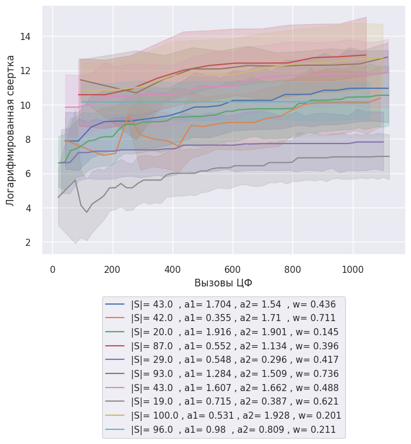
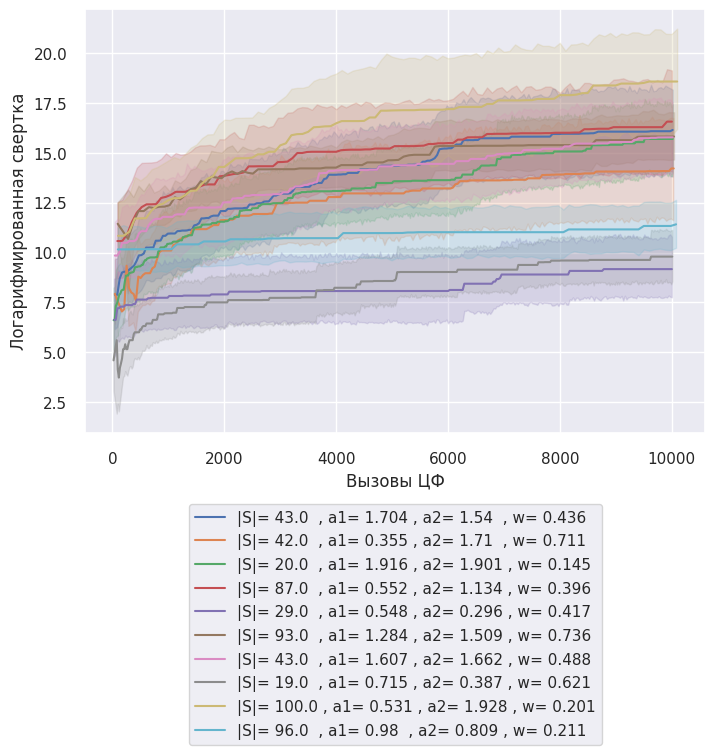

---
jupyter:
  colab:
    gpuType: T4
  kernelspec:
    display_name: Python 3
    name: python3
  language_info:
    codemirror_mode:
      name: ipython
      version: 3
    file_extension: .py
    mimetype: text/x-python
    name: python
    nbconvert_exporter: python
    pygments_lexer: ipython3
    version: 3.12.1
  nbformat: 4
  nbformat_minor: 0
---

EFFECTIVENESS_INTERACTION
```
    array([[ 0.25      ,  0.11111111,  0.0625    ,  0.04      ,  0.02777778,
             0.02040816],
           [ 6.        ,  0.25      ,  0.11111111,  0.0625    ,  0.04      ,
             0.02777778],
           [ 7.        ,  6.        ,  0.25      ,  0.11111111,  0.0625    ,
             0.04      ],
           [ 8.        ,  7.        ,  6.        ,  0.25      ,  0.11111111,
             0.0625    ],
           [ 9.        ,  8.        ,  7.        ,  6.        ,  0.25      ,
             0.11111111],
           [10.        ,  9.        ,  8.        ,  7.        ,  6.        ,
             0.25      ]])
```
# 50x50




# Вызовы ЦФ 0
```
    Расчет доверительных интервалов для каждой группы
    Параметры
    |S|= 19.0  , a1= 0.715 , a2= 0.387 , w= 0.621    (-12498.527915108833, 45508.494256192134)
    |S|= 20.0  , a1= 1.916 , a2= 1.901 , w= 0.145      (-104643.7458922349, 860280.5492499978)
    |S|= 29.0  , a1= 0.548 , a2= 0.296 , w= 0.417    (-14169815.814349372, 43844192.593983635)
    |S|= 42.0  , a1= 0.355 , a2= 1.71  , w= 0.711     (-4522004.460892112, 14152700.223055799)
    |S|= 43.0  , a1= 1.607 , a2= 1.662 , w= 0.488      (-922345.2083824556, 7388904.325582265)
    |S|= 43.0  , a1= 1.704 , a2= 1.54  , w= 0.436     (-4786709.917818733, 14843358.476264615)
    Name: Свертка, dtype: object
```
## MIN
|       |   Коль-во частиц |   MAX Количесво итераций | c1_c2_w                                                   |   № эксперемента |       Время |   Вызовы ЦФ |   Свертка | Распределение                                                            |   Логарифмированная свертка | Параметры                                     |
|------:|-----------------:|-------------------------:|:----------------------------------------------------------|-----------------:|------------:|------------:|----------:|:-------------------------------------------------------------------------|----------------------------:|:----------------------------------------------|
| 35481 |               19 |                      526 | 0.7152822531830084_0.3866134304565536_0.620747578431883   |                1 | 0.023711    |          38 |   0       | [-1 -1 -1 38 -1 -1  8  2 14 -1 -1 -1 -1 -1 29 17 35 -1 26 -1 11 22 39 13 |                  -inf       | |S|= 19.0  , a1= 0.715 , a2= 0.387 , w= 0.621 |
|       |                  |                          |                                                           |                  |             |             |           |   0  2 19 16 -1 -1 47 34  9 27 -1  0 24 36 25 37  5 -1 -1  7 42 31 -1 -1 |                             |                                               |
|       |                  |                          |                                                           |                  |             |             |           |  -1 -1]                                                                  |                             |                                               |
| 10943 |               20 |                      500 | 1.9164651165895739_1.900872225412764_0.14524109418144696  |                4 | 1.19209e-06 |          20 |   1       | [-1 -1 -1 -1 -1 -1 -1 -1 -1 -1 -1 -1 -1 -1 -1 -1 -1 -1 -1 -1 -1 -1 -1 -1 |                     0       | |S|= 20.0  , a1= 1.916 , a2= 1.901 , w= 0.145 |
|       |                  |                          |                                                           |                  |             |             |           |  -1 -1 -1 -1 -1 -1 -1 -1 -1 -1 -1 -1 -1 -1 -1 -1 -1 -1 -1 -1 -1 -1 -1 -1 |                             |                                               |
|       |                  |                          |                                                           |                  |             |             |           |  -1 -1]                                                                  |                             |                                               |
| 26935 |               29 |                      344 | 0.5484913705011256_0.29601546503836_0.41684659408854485   |               16 | 1.19209e-06 |          29 |   1       | [-1 -1 -1 -1 -1 -1 -1 -1 -1 -1 -1 -1 -1 -1 -1 -1 -1 -1 -1 -1 -1 -1 -1 -1 |                     0       | |S|= 29.0  , a1= 0.548 , a2= 0.296 , w= 0.417 |
|       |                  |                          |                                                           |                  |             |             |           |  -1 -1 -1 -1 -1 -1 -1 -1 -1 -1 -1 -1 -1 -1 -1 -1 -1 -1 -1 -1 -1 -1 -1 -1 |                             |                                               |
|       |                  |                          |                                                           |                  |             |             |           |  -1 -1]                                                                  |                             |                                               |
|  7289 |               42 |                      238 | 0.35529206381356226_1.7101241001807421_0.7110196951812913 |               12 | 1.43051e-06 |          42 |   9.75755 | [-1 -1 -1 46 -1  2 -1 -1 -1 -1 -1 -1 -1 -1 26 10 -1 -1 49 -1 -1 -1 11 -1 |                     2.27804 | |S|= 42.0  , a1= 0.355 , a2= 1.71  , w= 0.711 |
|       |                  |                          |                                                           |                  |             |             |           |  -1 -1 -1 -1 33 -1 -1 -1 -1 -1 -1 -1 -1  0 21 -1 -1 -1 -1 -1 -1 -1 -1 -1 |                             |                                               |
|       |                  |                          |                                                           |                  |             |             |           |  -1 -1]                                                                  |                             |                                               |
| 32451 |               43 |                      232 | 1.6073461591471596_1.6617126804074809_0.48802770234475623 |                8 | 9.53674e-07 |          43 |  93.155   | [-1 27  6  1 30  3 41 20 -1 42 -1 13 -1 21 17 34 -1 -1 14 19 -1 18 -1 33 |                     4.53426 | |S|= 43.0  , a1= 1.607 , a2= 1.662 , w= 0.488 |
|       |                  |                          |                                                           |                  |             |             |           |   4 47 25  2 23  0 46 36 -1  9 35 12 16 -1 32 -1 -1 44 -1 10 37 -1 43 29 |                             |                                               |
|       |                  |                          |                                                           |                  |             |             |           |  45 -1]                                                                  |                             |                                               |
|   932 |               43 |                      232 | 1.7044015178975915_1.5401133655865746_0.43645726466467605 |                5 | 1.66893e-06 |          43 |   6.8186  | [-1 -1 -1 -1 -1 -1 -1 -1 -1 -1 -1 32 -1 -1 -1 -1 -1 -1  8 -1 -1 -1 -1 -1 |                     1.91965 | |S|= 43.0  , a1= 1.704 , a2= 1.54  , w= 0.436 |
|       |                  |                          |                                                           |                  |             |             |           |  -1 -1 -1 -1 -1 -1 -1 -1 -1 -1 -1 -1 -1 -1 -1 -1 -1 -1 -1 -1 -1 -1 -1 -1 |                             |                                               |
|       |                  |                          |                                                           |                  |             |             |           |  -1 -1]                                                                  |                             |                                               |
```
    Cвертка : -1,
    Распределение: [-1, -1, -1, 38, -1, -1, 8, 2, 14, -1, -1, -1, -1, -1, 29, 17, 35, -1, 26, -1, 11, 22, 39, 13, 0, 2, 19, 16, -1, -1, 47, 34, 9, 27, -1, 0, 24, 36, 25, 37, 5, -1, -1, 7, 42, 31, -1, -1, -1, -1]
    Колисчесвто целей:50. Количесвто UAV:50
    Ограниечнеи выбор целей не > 1: {'Цель 0 (Количестов нацеленных)': 2, 'Цель 1 (Количестов нацеленных)': 0, 'Цель 2 (Количестов нацеленных)': 2, 'Цель 3 (Количестов нацеленных)': 0, 'Цель 4 (Количестов нацеленных)': 0, 'Цель 5 (Количестов нацеленных)': 1, 'Цель 6 (Количестов нацеленных)': 0, 'Цель 7 (Количестов нацеленных)': 1, 'Цель 8 (Количестов нацеленных)': 1, 'Цель 9 (Количестов нацеленных)': 1, 'Цель 10 (Количестов нацеленных)': 0, 'Цель 11 (Количестов нацеленных)': 1, 'Цель 12 (Количестов нацеленных)': 0, 'Цель 13 (Количестов нацеленных)': 1, 'Цель 14 (Количестов нацеленных)': 1, 'Цель 15 (Количестов нацеленных)': 0, 'Цель 16 (Количестов нацеленных)': 1, 'Цель 17 (Количестов нацеленных)': 1, 'Цель 18 (Количестов нацеленных)': 0, 'Цель 19 (Количестов нацеленных)': 1, 'Цель 20 (Количестов нацеленных)': 0, 'Цель 21 (Количестов нацеленных)': 0, 'Цель 22 (Количестов нацеленных)': 1, 'Цель 23 (Количестов нацеленных)': 0, 'Цель 24 (Количестов нацеленных)': 1, 'Цель 25 (Количестов нацеленных)': 1, 'Цель 26 (Количестов нацеленных)': 1, 'Цель 27 (Количестов нацеленных)': 1, 'Цель 28 (Количестов нацеленных)': 0, 'Цель 29 (Количестов нацеленных)': 1, 'Цель 30 (Количестов нацеленных)': 0, 'Цель 31 (Количестов нацеленных)': 1, 'Цель 32 (Количестов нацеленных)': 0, 'Цель 33 (Количестов нацеленных)': 0, 'Цель 34 (Количестов нацеленных)': 1, 'Цель 35 (Количестов нацеленных)': 1, 'Цель 36 (Количестов нацеленных)': 1, 'Цель 37 (Количестов нацеленных)': 1, 'Цель 38 (Количестов нацеленных)': 1, 'Цель 39 (Количестов нацеленных)': 1, 'Цель 40 (Количестов нацеленных)': 0, 'Цель 41 (Количестов нацеленных)': 0, 'Цель 42 (Количестов нацеленных)': 1, 'Цель 43 (Количестов нацеленных)': 0, 'Цель 44 (Количестов нацеленных)': 0, 'Цель 45 (Количестов нацеленных)': 0, 'Цель 46 (Количестов нацеленных)': 0, 'Цель 47 (Количестов нацеленных)': 1, 'Цель 48 (Количестов нацеленных)': 0, 'Цель 49 (Количестов нацеленных)': 0}
    t: [ 0.          0.          0.          7.71978247  0.          0.
    3.38712117  4.98547272  6.10583737  0.          0.          0.
    0.          0.          0.66332496  5.06488511  2.28939281  0.
    3.51539823  0.         10.07421441  2.76887462  9.45218229  1.34571147
    3.06894164  2.18333326  3.02779356  0.3354102   0.          0.
    2.64691761  3.17274747 53.79591063  2.02330176  0.          1.20066648
    12.88470508  1.34164079  2.63523138  2.24381867  1.5205993   0.
    0.          1.36173361  8.84712411 78.47292527  0.          0.
    0.          0.        ]
    score: [ 7.          1.          9.          1.          1.          0.11111111
    1.          7.         10.          0.0625      1.          7.
    1.          0.25        0.11111111  1.          0.0625      0.11111111
    1.          0.02777778  1.          1.          9.          1.
    7.          8.          0.0625     10.          1.          8.
    1.          6.          1.          1.          9.          0.25
    10.          8.          0.25        6.          1.          1.
    0.0625      1.          1.          1.          1.          8.
    1.          1.        ]
    Количесво задействоанных UAV: 29


    Cвертка : 1.0,
    Распределение: [-1, -1, -1, -1, -1, -1, -1, -1, -1, -1, -1, -1, -1, -1, -1, -1, -1, -1, -1, -1, -1, -1, -1, -1, -1, -1, -1, -1, -1, -1, -1, -1, -1, -1, -1, -1, -1, -1, -1, -1, -1, -1, -1, -1, -1, -1, -1, -1, -1, -1]
    Колисчесвто целей:50. Количесвто UAV:50
    Ограниечнеи выбор целей не > 1: {'Цель 0 (Количестов нацеленных)': 0, 'Цель 1 (Количестов нацеленных)': 0, 'Цель 2 (Количестов нацеленных)': 0, 'Цель 3 (Количестов нацеленных)': 0, 'Цель 4 (Количестов нацеленных)': 0, 'Цель 5 (Количестов нацеленных)': 0, 'Цель 6 (Количестов нацеленных)': 0, 'Цель 7 (Количестов нацеленных)': 0, 'Цель 8 (Количестов нацеленных)': 0, 'Цель 9 (Количестов нацеленных)': 0, 'Цель 10 (Количестов нацеленных)': 0, 'Цель 11 (Количестов нацеленных)': 0, 'Цель 12 (Количестов нацеленных)': 0, 'Цель 13 (Количестов нацеленных)': 0, 'Цель 14 (Количестов нацеленных)': 0, 'Цель 15 (Количестов нацеленных)': 0, 'Цель 16 (Количестов нацеленных)': 0, 'Цель 17 (Количестов нацеленных)': 0, 'Цель 18 (Количестов нацеленных)': 0, 'Цель 19 (Количестов нацеленных)': 0, 'Цель 20 (Количестов нацеленных)': 0, 'Цель 21 (Количестов нацеленных)': 0, 'Цель 22 (Количестов нацеленных)': 0, 'Цель 23 (Количестов нацеленных)': 0, 'Цель 24 (Количестов нацеленных)': 0, 'Цель 25 (Количестов нацеленных)': 0, 'Цель 26 (Количестов нацеленных)': 0, 'Цель 27 (Количестов нацеленных)': 0, 'Цель 28 (Количестов нацеленных)': 0, 'Цель 29 (Количестов нацеленных)': 0, 'Цель 30 (Количестов нацеленных)': 0, 'Цель 31 (Количестов нацеленных)': 0, 'Цель 32 (Количестов нацеленных)': 0, 'Цель 33 (Количестов нацеленных)': 0, 'Цель 34 (Количестов нацеленных)': 0, 'Цель 35 (Количестов нацеленных)': 0, 'Цель 36 (Количестов нацеленных)': 0, 'Цель 37 (Количестов нацеленных)': 0, 'Цель 38 (Количестов нацеленных)': 0, 'Цель 39 (Количестов нацеленных)': 0, 'Цель 40 (Количестов нацеленных)': 0, 'Цель 41 (Количестов нацеленных)': 0, 'Цель 42 (Количестов нацеленных)': 0, 'Цель 43 (Количестов нацеленных)': 0, 'Цель 44 (Количестов нацеленных)': 0, 'Цель 45 (Количестов нацеленных)': 0, 'Цель 46 (Количестов нацеленных)': 0, 'Цель 47 (Количестов нацеленных)': 0, 'Цель 48 (Количестов нацеленных)': 0, 'Цель 49 (Количестов нацеленных)': 0}
    t: [0. 0. 0. 0. 0. 0. 0. 0. 0. 0. 0. 0. 0. 0. 0. 0. 0. 0. 0. 0. 0. 0. 0. 0.
    0. 0. 0. 0. 0. 0. 0. 0. 0. 0. 0. 0. 0. 0. 0. 0. 0. 0. 0. 0. 0. 0. 0. 0.
    0. 0.]
    score: [1. 1. 1. 1. 1. 1. 1. 1. 1. 1. 1. 1. 1. 1. 1. 1. 1. 1. 1. 1. 1. 1. 1. 1.
    1. 1. 1. 1. 1. 1. 1. 1. 1. 1. 1. 1. 1. 1. 1. 1. 1. 1. 1. 1. 1. 1. 1. 1.
    1. 1.]
    Количесво задействоанных UAV: 0


    Cвертка : 1.0,
    Распределение: [-1, -1, -1, -1, -1, -1, -1, -1, -1, -1, -1, -1, -1, -1, -1, -1, -1, -1, -1, -1, -1, -1, -1, -1, -1, -1, -1, -1, -1, -1, -1, -1, -1, -1, -1, -1, -1, -1, -1, -1, -1, -1, -1, -1, -1, -1, -1, -1, -1, -1]
    Колисчесвто целей:50. Количесвто UAV:50
    Ограниечнеи выбор целей не > 1: {'Цель 0 (Количестов нацеленных)': 0, 'Цель 1 (Количестов нацеленных)': 0, 'Цель 2 (Количестов нацеленных)': 0, 'Цель 3 (Количестов нацеленных)': 0, 'Цель 4 (Количестов нацеленных)': 0, 'Цель 5 (Количестов нацеленных)': 0, 'Цель 6 (Количестов нацеленных)': 0, 'Цель 7 (Количестов нацеленных)': 0, 'Цель 8 (Количестов нацеленных)': 0, 'Цель 9 (Количестов нацеленных)': 0, 'Цель 10 (Количестов нацеленных)': 0, 'Цель 11 (Количестов нацеленных)': 0, 'Цель 12 (Количестов нацеленных)': 0, 'Цель 13 (Количестов нацеленных)': 0, 'Цель 14 (Количестов нацеленных)': 0, 'Цель 15 (Количестов нацеленных)': 0, 'Цель 16 (Количестов нацеленных)': 0, 'Цель 17 (Количестов нацеленных)': 0, 'Цель 18 (Количестов нацеленных)': 0, 'Цель 19 (Количестов нацеленных)': 0, 'Цель 20 (Количестов нацеленных)': 0, 'Цель 21 (Количестов нацеленных)': 0, 'Цель 22 (Количестов нацеленных)': 0, 'Цель 23 (Количестов нацеленных)': 0, 'Цель 24 (Количестов нацеленных)': 0, 'Цель 25 (Количестов нацеленных)': 0, 'Цель 26 (Количестов нацеленных)': 0, 'Цель 27 (Количестов нацеленных)': 0, 'Цель 28 (Количестов нацеленных)': 0, 'Цель 29 (Количестов нацеленных)': 0, 'Цель 30 (Количестов нацеленных)': 0, 'Цель 31 (Количестов нацеленных)': 0, 'Цель 32 (Количестов нацеленных)': 0, 'Цель 33 (Количестов нацеленных)': 0, 'Цель 34 (Количестов нацеленных)': 0, 'Цель 35 (Количестов нацеленных)': 0, 'Цель 36 (Количестов нацеленных)': 0, 'Цель 37 (Количестов нацеленных)': 0, 'Цель 38 (Количестов нацеленных)': 0, 'Цель 39 (Количестов нацеленных)': 0, 'Цель 40 (Количестов нацеленных)': 0, 'Цель 41 (Количестов нацеленных)': 0, 'Цель 42 (Количестов нацеленных)': 0, 'Цель 43 (Количестов нацеленных)': 0, 'Цель 44 (Количестов нацеленных)': 0, 'Цель 45 (Количестов нацеленных)': 0, 'Цель 46 (Количестов нацеленных)': 0, 'Цель 47 (Количестов нацеленных)': 0, 'Цель 48 (Количестов нацеленных)': 0, 'Цель 49 (Количестов нацеленных)': 0}
    t: [0. 0. 0. 0. 0. 0. 0. 0. 0. 0. 0. 0. 0. 0. 0. 0. 0. 0. 0. 0. 0. 0. 0. 0.
    0. 0. 0. 0. 0. 0. 0. 0. 0. 0. 0. 0. 0. 0. 0. 0. 0. 0. 0. 0. 0. 0. 0. 0.
    0. 0.]
    score: [1. 1. 1. 1. 1. 1. 1. 1. 1. 1. 1. 1. 1. 1. 1. 1. 1. 1. 1. 1. 1. 1. 1. 1.
    1. 1. 1. 1. 1. 1. 1. 1. 1. 1. 1. 1. 1. 1. 1. 1. 1. 1. 1. 1. 1. 1. 1. 1.
    1. 1.]
    Количесво задействоанных UAV: 0


    Cвертка : 9.757549425887419,
    Распределение: [-1, -1, -1, 46, -1, 2, -1, -1, -1, -1, -1, -1, -1, -1, 26, 10, -1, -1, 49, -1, -1, -1, 11, -1, -1, -1, -1, -1, 33, -1, -1, -1, -1, -1, -1, -1, -1, 0, 21, -1, -1, -1, -1, -1, -1, -1, -1, -1, -1, -1]
    Колисчесвто целей:50. Количесвто UAV:50
    Ограниечнеи выбор целей не > 1: {'Цель 0 (Количестов нацеленных)': 1, 'Цель 1 (Количестов нацеленных)': 0, 'Цель 2 (Количестов нацеленных)': 1, 'Цель 3 (Количестов нацеленных)': 0, 'Цель 4 (Количестов нацеленных)': 0, 'Цель 5 (Количестов нацеленных)': 0, 'Цель 6 (Количестов нацеленных)': 0, 'Цель 7 (Количестов нацеленных)': 0, 'Цель 8 (Количестов нацеленных)': 0, 'Цель 9 (Количестов нацеленных)': 0, 'Цель 10 (Количестов нацеленных)': 1, 'Цель 11 (Количестов нацеленных)': 1, 'Цель 12 (Количестов нацеленных)': 0, 'Цель 13 (Количестов нацеленных)': 0, 'Цель 14 (Количестов нацеленных)': 0, 'Цель 15 (Количестов нацеленных)': 0, 'Цель 16 (Количестов нацеленных)': 0, 'Цель 17 (Количестов нацеленных)': 0, 'Цель 18 (Количестов нацеленных)': 0, 'Цель 19 (Количестов нацеленных)': 0, 'Цель 20 (Количестов нацеленных)': 0, 'Цель 21 (Количестов нацеленных)': 1, 'Цель 22 (Количестов нацеленных)': 0, 'Цель 23 (Количестов нацеленных)': 0, 'Цель 24 (Количестов нацеленных)': 0, 'Цель 25 (Количестов нацеленных)': 0, 'Цель 26 (Количестов нацеленных)': 1, 'Цель 27 (Количестов нацеленных)': 0, 'Цель 28 (Количестов нацеленных)': 0, 'Цель 29 (Количестов нацеленных)': 0, 'Цель 30 (Количестов нацеленных)': 0, 'Цель 31 (Количестов нацеленных)': 0, 'Цель 32 (Количестов нацеленных)': 0, 'Цель 33 (Количестов нацеленных)': 1, 'Цель 34 (Количестов нацеленных)': 0, 'Цель 35 (Количестов нацеленных)': 0, 'Цель 36 (Количестов нацеленных)': 0, 'Цель 37 (Количестов нацеленных)': 0, 'Цель 38 (Количестов нацеленных)': 0, 'Цель 39 (Количестов нацеленных)': 0, 'Цель 40 (Количестов нацеленных)': 0, 'Цель 41 (Количестов нацеленных)': 0, 'Цель 42 (Количестов нацеленных)': 0, 'Цель 43 (Количестов нацеленных)': 0, 'Цель 44 (Количестов нацеленных)': 0, 'Цель 45 (Количестов нацеленных)': 0, 'Цель 46 (Количестов нацеленных)': 1, 'Цель 47 (Количестов нацеленных)': 0, 'Цель 48 (Количестов нацеленных)': 0, 'Цель 49 (Количестов нацеленных)': 1}
    t: [ 0.          0.          0.          7.98966274  0.          1.50665192
    0.          0.          0.          0.          0.          0.
    0.          0.          3.31058907  5.70535016  0.          0.
    4.61278417  0.          0.          0.         10.46198475  0.
    0.          0.          0.          0.          9.35127162  0.
    0.          0.          0.          0.          0.          0.
    0.          1.49986666  3.63284061  0.          0.          0.
    0.          0.          0.          0.          0.          0.
    0.          0.        ]
    score: [10.      1.     10.      1.      1.      1.      1.      1.      1.
    1.      8.      6.      1.      1.      1.      1.      1.      1.
    1.      1.      1.      0.25    1.      1.      1.      1.      7.
    1.      1.      1.      1.      1.      1.      7.      1.      1.
    1.      1.      1.      1.      1.      1.      1.      1.      1.
    1.      0.25    1.      1.      0.0625]
    Количесво задействоанных UAV: 9


    Cвертка : 93.15499839951053,
    Распределение: [-1, 27, 6, 1, 30, 3, 41, 20, -1, 42, -1, 13, -1, 21, 17, 34, -1, -1, 14, 19, -1, 18, -1, 33, 4, 47, 25, 2, 23, 0, 46, 36, -1, 9, 35, 12, 16, -1, 32, -1, -1, 44, -1, 10, 37, -1, 43, 29, 45, -1]
    Колисчесвто целей:50. Количесвто UAV:50
    Ограниечнеи выбор целей не > 1: {'Цель 0 (Количестов нацеленных)': 1, 'Цель 1 (Количестов нацеленных)': 1, 'Цель 2 (Количестов нацеленных)': 1, 'Цель 3 (Количестов нацеленных)': 1, 'Цель 4 (Количестов нацеленных)': 1, 'Цель 5 (Количестов нацеленных)': 0, 'Цель 6 (Количестов нацеленных)': 1, 'Цель 7 (Количестов нацеленных)': 0, 'Цель 8 (Количестов нацеленных)': 0, 'Цель 9 (Количестов нацеленных)': 1, 'Цель 10 (Количестов нацеленных)': 1, 'Цель 11 (Количестов нацеленных)': 0, 'Цель 12 (Количестов нацеленных)': 1, 'Цель 13 (Количестов нацеленных)': 1, 'Цель 14 (Количестов нацеленных)': 1, 'Цель 15 (Количестов нацеленных)': 0, 'Цель 16 (Количестов нацеленных)': 1, 'Цель 17 (Количестов нацеленных)': 1, 'Цель 18 (Количестов нацеленных)': 1, 'Цель 19 (Количестов нацеленных)': 1, 'Цель 20 (Количестов нацеленных)': 1, 'Цель 21 (Количестов нацеленных)': 1, 'Цель 22 (Количестов нацеленных)': 0, 'Цель 23 (Количестов нацеленных)': 1, 'Цель 24 (Количестов нацеленных)': 0, 'Цель 25 (Количестов нацеленных)': 1, 'Цель 26 (Количестов нацеленных)': 0, 'Цель 27 (Количестов нацеленных)': 1, 'Цель 28 (Количестов нацеленных)': 0, 'Цель 29 (Количестов нацеленных)': 1, 'Цель 30 (Количестов нацеленных)': 1, 'Цель 31 (Количестов нацеленных)': 0, 'Цель 32 (Количестов нацеленных)': 1, 'Цель 33 (Количестов нацеленных)': 1, 'Цель 34 (Количестов нацеленных)': 1, 'Цель 35 (Количестов нацеленных)': 1, 'Цель 36 (Количестов нацеленных)': 1, 'Цель 37 (Количестов нацеленных)': 1, 'Цель 38 (Количестов нацеленных)': 0, 'Цель 39 (Количестов нацеленных)': 0, 'Цель 40 (Количестов нацеленных)': 0, 'Цель 41 (Количестов нацеленных)': 1, 'Цель 42 (Количестов нацеленных)': 1, 'Цель 43 (Количестов нацеленных)': 1, 'Цель 44 (Количестов нацеленных)': 1, 'Цель 45 (Количестов нацеленных)': 1, 'Цель 46 (Количестов нацеленных)': 1, 'Цель 47 (Количестов нацеленных)': 1, 'Цель 48 (Количестов нацеленных)': 0, 'Цель 49 (Количестов нацеленных)': 0}
    t: [ 0.          5.22794041  3.07465685  9.58433639  3.87855771  5.20768663
    1.56702794  2.25051434  0.          1.26807913  0.          1.21037184
    0.          2.67908843  5.69209979  4.17475406  0.          0.
    0.68718427  2.90325488  0.          2.1227748   0.          0.75705167
    3.15403181  2.37831063  0.62550708  3.31436268  7.2151127   3.34944025
    5.2786549   3.07474904  0.          3.56633565  3.39070989  0.81584312
    2.53105709  0.          4.00655327  0.          0.         29.82448658
    0.          0.75583061  9.4607702   0.          4.22926929  1.76344531
    3.25600407  0.        ]
    score: [ 7.          0.11111111  7.          8.          7.          1.
    0.0625      1.          1.          6.          9.          1.
    0.25       10.          0.04        1.          0.0625      6.
    8.          0.02040816  6.          0.11111111  1.          0.11111111
    1.          6.          1.          6.          1.          6.
    0.02777778  1.          6.          0.25        7.          0.11111111
    10.          0.0625      1.          1.          1.          7.
    8.          9.          7.          9.          6.          0.25
    1.          1.        ]
    Количесво задействоанных UAV: 35


    Cвертка : 6.818597622869448,
    Распределение: [-1, -1, -1, -1, -1, -1, -1, -1, -1, -1, -1, 32, -1, -1, -1, -1, -1, -1, 8, -1, -1, -1, -1, -1, -1, -1, -1, -1, -1, -1, -1, -1, -1, -1, -1, -1, -1, -1, -1, -1, -1, -1, -1, -1, -1, -1, -1, -1, -1, -1]
    Колисчесвто целей:50. Количесвто UAV:50
    Ограниечнеи выбор целей не > 1: {'Цель 0 (Количестов нацеленных)': 0, 'Цель 1 (Количестов нацеленных)': 0, 'Цель 2 (Количестов нацеленных)': 0, 'Цель 3 (Количестов нацеленных)': 0, 'Цель 4 (Количестов нацеленных)': 0, 'Цель 5 (Количестов нацеленных)': 0, 'Цель 6 (Количестов нацеленных)': 0, 'Цель 7 (Количестов нацеленных)': 0, 'Цель 8 (Количестов нацеленных)': 1, 'Цель 9 (Количестов нацеленных)': 0, 'Цель 10 (Количестов нацеленных)': 0, 'Цель 11 (Количестов нацеленных)': 0, 'Цель 12 (Количестов нацеленных)': 0, 'Цель 13 (Количестов нацеленных)': 0, 'Цель 14 (Количестов нацеленных)': 0, 'Цель 15 (Количестов нацеленных)': 0, 'Цель 16 (Количестов нацеленных)': 0, 'Цель 17 (Количестов нацеленных)': 0, 'Цель 18 (Количестов нацеленных)': 0, 'Цель 19 (Количестов нацеленных)': 0, 'Цель 20 (Количестов нацеленных)': 0, 'Цель 21 (Количестов нацеленных)': 0, 'Цель 22 (Количестов нацеленных)': 0, 'Цель 23 (Количестов нацеленных)': 0, 'Цель 24 (Количестов нацеленных)': 0, 'Цель 25 (Количестов нацеленных)': 0, 'Цель 26 (Количестов нацеленных)': 0, 'Цель 27 (Количестов нацеленных)': 0, 'Цель 28 (Количестов нацеленных)': 0, 'Цель 29 (Количестов нацеленных)': 0, 'Цель 30 (Количестов нацеленных)': 0, 'Цель 31 (Количестов нацеленных)': 0, 'Цель 32 (Количестов нацеленных)': 1, 'Цель 33 (Количестов нацеленных)': 0, 'Цель 34 (Количестов нацеленных)': 0, 'Цель 35 (Количестов нацеленных)': 0, 'Цель 36 (Количестов нацеленных)': 0, 'Цель 37 (Количестов нацеленных)': 0, 'Цель 38 (Количестов нацеленных)': 0, 'Цель 39 (Количестов нацеленных)': 0, 'Цель 40 (Количестов нацеленных)': 0, 'Цель 41 (Количестов нацеленных)': 0, 'Цель 42 (Количестов нацеленных)': 0, 'Цель 43 (Количестов нацеленных)': 0, 'Цель 44 (Количестов нацеленных)': 0, 'Цель 45 (Количестов нацеленных)': 0, 'Цель 46 (Количестов нацеленных)': 0, 'Цель 47 (Количестов нацеленных)': 0, 'Цель 48 (Количестов нацеленных)': 0, 'Цель 49 (Количестов нацеленных)': 0}
    t: [0.         0.         0.         0.         0.         0.
    0.         0.         0.         0.         0.         2.50798724
    0.         0.         0.         0.         0.         0.
    3.51978535 0.         0.         0.         0.         0.
    0.         0.         0.         0.         0.         0.
    0.         0.         0.         0.         0.         0.
    0.         0.         0.         0.         0.         0.
    0.         0.         0.         0.         0.         0.
    0.         0.        ]
    score: [1. 1. 1. 1. 1. 1. 1. 1. 6. 1. 1. 1. 1. 1. 1. 1. 1. 1. 1. 1. 1. 1. 1. 1.
    1. 1. 1. 1. 1. 1. 1. 1. 8. 1. 1. 1. 1. 1. 1. 1. 1. 1. 1. 1. 1. 1. 1. 1.
    1. 1.]
    Количесво задействоанных UAV: 2


    Параметры
    |S|= 19.0  , a1= 0.715 , a2= 0.387 , w= 0.621     0.000000
    |S|= 20.0  , a1= 1.916 , a2= 1.901 , w= 0.145     1.000000
    |S|= 29.0  , a1= 0.548 , a2= 0.296 , w= 0.417     1.000000
    |S|= 42.0  , a1= 0.355 , a2= 1.71  , w= 0.711     9.757549
    |S|= 43.0  , a1= 1.607 , a2= 1.662 , w= 0.488    93.154998
    |S|= 43.0  , a1= 1.704 , a2= 1.54  , w= 0.436     6.818598
    Name: Свертка, dtype: float64
```
## MAX
|       |   Коль-во частиц |   MAX Количесво итераций | c1_c2_w                                                   |   № эксперемента |       Время |   Вызовы ЦФ |          Свертка | Распределение                                                            |   Логарифмированная свертка | Параметры                                     |
|------:|-----------------:|-------------------------:|:----------------------------------------------------------|-----------------:|------------:|------------:|-----------------:|:-------------------------------------------------------------------------|----------------------------:|:----------------------------------------------|
| 37061 |               19 |                      526 | 0.7152822531830084_0.3866134304565536_0.620747578431883   |                4 | 9.53674e-07 |          19 | 592109           | [ 0 -1  3 21 -1 10 41 -1 43 33 -1 14 -1  5 -1 38  2 -1 12 -1 35 46  8 32 |                     13.2914 | |S|= 19.0  , a1= 0.715 , a2= 0.387 , w= 0.621 |
|       |                  |                          |                                                           |                  |             |             |                  |  22 -1 -1 45 -1 -1 20 -1 -1 11 -1 23 -1 -1 -1 -1 44 -1 31  9 -1 -1 25 19 |                             |                                               |
|       |                  |                          |                                                           |                  |             |             |                  |  -1  7]                                                                  |                             |                                               |
| 11945 |               20 |                      500 | 1.9164651165895739_1.900872225412764_0.14524109418144696  |                6 | 1.19209e-06 |          20 |      7.06919e+06 | [40 23 19 35 36 38 24 13 45  6 -1 26 -1 21 20 -1 37 33 27 10  3 -1 15 -1 |                     15.7713 | |S|= 20.0  , a1= 1.916 , a2= 1.901 , w= 0.145 |
|       |                  |                          |                                                           |                  |             |             |                  |  -1  2 31 -1 18 -1 -1 11 30 -1 14 25  8  7 29 22  1 -1 -1 47 -1 -1 -1  5 |                             |                                               |
|       |                  |                          |                                                           |                  |             |             |                  |  46 28]                                                                  |                             |                                               |
| 24175 |               29 |                      344 | 0.5484913705011256_0.29601546503836_0.41684659408854485   |                8 | 1.19209e-06 |          29 |      2.96027e+08 | [18  4 -1 33 -1 14 46 -1 36 -1 -1 -1 -1 -1 -1 24 -1 -1 11 -1 -1 19 -1 -1 |                     19.506  | |S|= 29.0  , a1= 0.548 , a2= 0.296 , w= 0.417 |
|       |                  |                          |                                                           |                  |             |             |                  |  -1 -1  1 -1 -1 -1 44 40 31 23 -1 10 -1  6 35 -1 -1 32 -1  7 22 -1 37 42 |                             |                                               |
|       |                  |                          |                                                           |                  |             |             |                  |  -1 49]                                                                  |                             |                                               |
|  5138 |               42 |                      238 | 0.35529206381356226_1.7101241001807421_0.7110196951812913 |                3 | 1.19209e-06 |          42 |      9.53292e+07 | [32 40 14 -1 -1 -1  7 33 -1 12 -1  5 -1 -1  4 35 13 -1 -1 19 -1 -1 41 -1 |                     18.3728 | |S|= 42.0  , a1= 0.355 , a2= 1.71  , w= 0.711 |
|       |                  |                          |                                                           |                  |             |             |                  |  -1 -1 -1 -1 31 -1 -1 47 -1 39 24 16 -1 49  2 -1 -1 -1 25 -1 46 -1 26 -1 |                             |                                               |
|       |                  |                          |                                                           |                  |             |             |                  |   6  8]                                                                  |                             |                                               |
| 34548 |               43 |                      232 | 1.6073461591471596_1.6617126804074809_0.48802770234475623 |               17 | 1.43051e-06 |          43 |      4.15496e+07 | [-1 -1 -1 -1 24 10 11 38 -1 13 14 -1 -1  5 29 40 -1 -1 43 32 -1 42 -1  3 |                     17.5424 | |S|= 43.0  , a1= 1.607 , a2= 1.662 , w= 0.488 |
|       |                  |                          |                                                           |                  |             |             |                  |   0 -1 -1 -1 22 -1 34 19 27 23 -1 21  2 -1 20 44  8 -1 31 46 -1 -1 26 18 |                             |                                               |
|       |                  |                          |                                                           |                  |             |             |                  |  47 25]                                                                  |                             |                                               |
|  1398 |               43 |                      232 | 1.7044015178975915_1.5401133655865746_0.43645726466467605 |                7 | 9.53674e-07 |          43 |      1.00174e+08 | [-1 -1  6 -1 -1 -1 23 -1  7 -1 -1 46 -1 -1 -1 -1 -1 44  2 35 -1 24 25 -1 |                     18.4224 | |S|= 43.0  , a1= 1.704 , a2= 1.54  , w= 0.436 |
|       |                  |                          |                                                           |                  |             |             |                  |  -1 43 31 -1 10 48  5 14  0 29 -1 49 33 -1  3 18 27 30 -1 11 -1 36 -1 -1 |                             |                                               |
|       |                  |                          |                                                           |                  |             |             |                  |  20 -1]                                                                  |                             |                                               |
```

    Cвертка : 592109.4467712898,
    Распределение: [0, -1, 3, 21, -1, 10, 41, -1, 43, 33, -1, 14, -1, 5, -1, 38, 2, -1, 12, -1, 35, 46, 8, 32, 22, -1, -1, 45, -1, -1, 20, -1, -1, 11, -1, 23, -1, -1, -1, -1, 44, -1, 31, 9, -1, -1, 25, 19, -1, 7]
    Колисчесвто целей:50. Количесвто UAV:50
    Ограниечнеи выбор целей не > 1: {'Цель 0 (Количестов нацеленных)': 1, 'Цель 1 (Количестов нацеленных)': 0, 'Цель 2 (Количестов нацеленных)': 1, 'Цель 3 (Количестов нацеленных)': 1, 'Цель 4 (Количестов нацеленных)': 0, 'Цель 5 (Количестов нацеленных)': 1, 'Цель 6 (Количестов нацеленных)': 0, 'Цель 7 (Количестов нацеленных)': 1, 'Цель 8 (Количестов нацеленных)': 1, 'Цель 9 (Количестов нацеленных)': 1, 'Цель 10 (Количестов нацеленных)': 1, 'Цель 11 (Количестов нацеленных)': 1, 'Цель 12 (Количестов нацеленных)': 1, 'Цель 13 (Количестов нацеленных)': 0, 'Цель 14 (Количестов нацеленных)': 1, 'Цель 15 (Количестов нацеленных)': 0, 'Цель 16 (Количестов нацеленных)': 0, 'Цель 17 (Количестов нацеленных)': 0, 'Цель 18 (Количестов нацеленных)': 0, 'Цель 19 (Количестов нацеленных)': 1, 'Цель 20 (Количестов нацеленных)': 1, 'Цель 21 (Количестов нацеленных)': 1, 'Цель 22 (Количестов нацеленных)': 1, 'Цель 23 (Количестов нацеленных)': 1, 'Цель 24 (Количестов нацеленных)': 0, 'Цель 25 (Количестов нацеленных)': 1, 'Цель 26 (Количестов нацеленных)': 0, 'Цель 27 (Количестов нацеленных)': 0, 'Цель 28 (Количестов нацеленных)': 0, 'Цель 29 (Количестов нацеленных)': 0, 'Цель 30 (Количестов нацеленных)': 0, 'Цель 31 (Количестов нацеленных)': 1, 'Цель 32 (Количестов нацеленных)': 1, 'Цель 33 (Количестов нацеленных)': 1, 'Цель 34 (Количестов нацеленных)': 0, 'Цель 35 (Количестов нацеленных)': 1, 'Цель 36 (Количестов нацеленных)': 0, 'Цель 37 (Количестов нацеленных)': 0, 'Цель 38 (Количестов нацеленных)': 1, 'Цель 39 (Количестов нацеленных)': 0, 'Цель 40 (Количестов нацеленных)': 0, 'Цель 41 (Количестов нацеленных)': 1, 'Цель 42 (Количестов нацеленных)': 0, 'Цель 43 (Количестов нацеленных)': 1, 'Цель 44 (Количестов нацеленных)': 1, 'Цель 45 (Количестов нацеленных)': 1, 'Цель 46 (Количестов нацеленных)': 1, 'Цель 47 (Количестов нацеленных)': 0, 'Цель 48 (Количестов нацеленных)': 0, 'Цель 49 (Количестов нацеленных)': 0}
    t: [ 9.73824077  0.          3.30806751  5.05261572  0.          4.
    1.56702794  0.          0.54843527  3.85461084  0.          1.8533753
    0.          1.39207393  0.         10.72951299  3.6919112   0.
    5.07262077  0.          7.30389887  2.45703827  0.71807033  3.03702871
    3.31662479  0.          0.          3.60381742  0.          0.
    1.32637071  0.          0.          4.51732775  0.          1.66132477
    0.          0.          0.          0.          0.70395707  0.
    1.19070121  0.8418057   0.          0.          3.62553875  3.0442552
    0.          7.75112895]
    score: [ 8.          1.          7.          0.25        1.          6.
    1.          7.          9.          0.25       10.          7.
    0.02777778  1.          6.          1.          1.          1.
    1.          0.0625      7.          6.          6.          7.
    1.          9.          1.          1.          1.          1.
    1.          0.25        0.0625     10.          1.          8.
    1.          1.          0.11111111  1.          1.          7.
    1.          8.          0.04        6.          6.          1.
    1.          1.        ]
    Количесво задействоанных UAV: 27


    Cвертка : 7069191.070265721,
    Распределение: [40, 23, 19, 35, 36, 38, 24, 13, 45, 6, -1, 26, -1, 21, 20, -1, 37, 33, 27, 10, 3, -1, 15, -1, -1, 2, 31, -1, 18, -1, -1, 11, 30, -1, 14, 25, 8, 7, 29, 22, 1, -1, -1, 47, -1, -1, -1, 5, 46, 28]
    Колисчесвто целей:50. Количесвто UAV:50
    Ограниечнеи выбор целей не > 1: {'Цель 0 (Количестов нацеленных)': 0, 'Цель 1 (Количестов нацеленных)': 1, 'Цель 2 (Количестов нацеленных)': 1, 'Цель 3 (Количестов нацеленных)': 1, 'Цель 4 (Количестов нацеленных)': 0, 'Цель 5 (Количестов нацеленных)': 1, 'Цель 6 (Количестов нацеленных)': 1, 'Цель 7 (Количестов нацеленных)': 1, 'Цель 8 (Количестов нацеленных)': 1, 'Цель 9 (Количестов нацеленных)': 0, 'Цель 10 (Количестов нацеленных)': 1, 'Цель 11 (Количестов нацеленных)': 1, 'Цель 12 (Количестов нацеленных)': 0, 'Цель 13 (Количестов нацеленных)': 1, 'Цель 14 (Количестов нацеленных)': 1, 'Цель 15 (Количестов нацеленных)': 1, 'Цель 16 (Количестов нацеленных)': 0, 'Цель 17 (Количестов нацеленных)': 0, 'Цель 18 (Количестов нацеленных)': 1, 'Цель 19 (Количестов нацеленных)': 1, 'Цель 20 (Количестов нацеленных)': 1, 'Цель 21 (Количестов нацеленных)': 1, 'Цель 22 (Количестов нацеленных)': 1, 'Цель 23 (Количестов нацеленных)': 1, 'Цель 24 (Количестов нацеленных)': 1, 'Цель 25 (Количестов нацеленных)': 1, 'Цель 26 (Количестов нацеленных)': 1, 'Цель 27 (Количестов нацеленных)': 1, 'Цель 28 (Количестов нацеленных)': 1, 'Цель 29 (Количестов нацеленных)': 1, 'Цель 30 (Количестов нацеленных)': 1, 'Цель 31 (Количестов нацеленных)': 1, 'Цель 32 (Количестов нацеленных)': 0, 'Цель 33 (Количестов нацеленных)': 1, 'Цель 34 (Количестов нацеленных)': 0, 'Цель 35 (Количестов нацеленных)': 1, 'Цель 36 (Количестов нацеленных)': 1, 'Цель 37 (Количестов нацеленных)': 1, 'Цель 38 (Количестов нацеленных)': 1, 'Цель 39 (Количестов нацеленных)': 0, 'Цель 40 (Количестов нацеленных)': 1, 'Цель 41 (Количестов нацеленных)': 0, 'Цель 42 (Количестов нацеленных)': 0, 'Цель 43 (Количестов нацеленных)': 0, 'Цель 44 (Количестов нацеленных)': 0, 'Цель 45 (Количестов нацеленных)': 1, 'Цель 46 (Количестов нацеленных)': 1, 'Цель 47 (Количестов нацеленных)': 1, 'Цель 48 (Количестов нацеленных)': 0, 'Цель 49 (Количестов нацеленных)': 0}
    t: [13.41744304  2.34709943  2.96234876  6.56436662  3.39616705  5.10489961
    1.40885667  3.17250923  5.18297996  4.71044282  0.          1.75285481
    0.          2.67908843  7.29657454  0.          0.89462127  0.40946007
    0.52704628  2.96910013  7.19552015  0.          8.17293552  0.
    0.          2.18333326  1.52229358  0.          8.30712131  0.
    0.          3.56427856 12.72792206  0.          0.93128081  0.70767224
    3.02076149  1.25666225  0.63098982  0.95197164  2.42143208  0.
    0.          1.06987896  0.          0.          0.          2.45172876
    5.37681655  4.24735212]
    score: [ 1.          0.02040816  7.          8.          1.          7.
    6.          8.          7.          1.          0.25        7.
    1.          9.          0.04        0.25        1.          1.
    0.25        0.04        7.          0.11111111  9.          0.0625
    10.         10.          7.          6.          0.25        6.
    0.04        6.          1.          8.          1.          7.
    6.          0.25        6.          1.          8.          1.
    1.          1.          1.          7.          6.          7.
    1.          1.        ]
    Количесво задействоанных UAV: 35


    Cвертка : 296027178.9987256,
    Распределение: [18, 4, -1, 33, -1, 14, 46, -1, 36, -1, -1, -1, -1, -1, -1, 24, -1, -1, 11, -1, -1, 19, -1, -1, -1, -1, 1, -1, -1, -1, 44, 40, 31, 23, -1, 10, -1, 6, 35, -1, -1, 32, -1, 7, 22, -1, 37, 42, -1, 49]
    Колисчесвто целей:50. Количесвто UAV:50
    Ограниечнеи выбор целей не > 1: {'Цель 0 (Количестов нацеленных)': 0, 'Цель 1 (Количестов нацеленных)': 1, 'Цель 2 (Количестов нацеленных)': 0, 'Цель 3 (Количестов нацеленных)': 0, 'Цель 4 (Количестов нацеленных)': 1, 'Цель 5 (Количестов нацеленных)': 0, 'Цель 6 (Количестов нацеленных)': 1, 'Цель 7 (Количестов нацеленных)': 1, 'Цель 8 (Количестов нацеленных)': 0, 'Цель 9 (Количестов нацеленных)': 0, 'Цель 10 (Количестов нацеленных)': 1, 'Цель 11 (Количестов нацеленных)': 1, 'Цель 12 (Количестов нацеленных)': 0, 'Цель 13 (Количестов нацеленных)': 0, 'Цель 14 (Количестов нацеленных)': 1, 'Цель 15 (Количестов нацеленных)': 0, 'Цель 16 (Количестов нацеленных)': 0, 'Цель 17 (Количестов нацеленных)': 0, 'Цель 18 (Количестов нацеленных)': 1, 'Цель 19 (Количестов нацеленных)': 1, 'Цель 20 (Количестов нацеленных)': 0, 'Цель 21 (Количестов нацеленных)': 0, 'Цель 22 (Количестов нацеленных)': 1, 'Цель 23 (Количестов нацеленных)': 1, 'Цель 24 (Количестов нацеленных)': 1, 'Цель 25 (Количестов нацеленных)': 0, 'Цель 26 (Количестов нацеленных)': 0, 'Цель 27 (Количестов нацеленных)': 0, 'Цель 28 (Количестов нацеленных)': 0, 'Цель 29 (Количестов нацеленных)': 0, 'Цель 30 (Количестов нацеленных)': 0, 'Цель 31 (Количестов нацеленных)': 1, 'Цель 32 (Количестов нацеленных)': 1, 'Цель 33 (Количестов нацеленных)': 1, 'Цель 34 (Количестов нацеленных)': 0, 'Цель 35 (Количестов нацеленных)': 1, 'Цель 36 (Количестов нацеленных)': 1, 'Цель 37 (Количестов нацеленных)': 1, 'Цель 38 (Количестов нацеленных)': 0, 'Цель 39 (Количестов нацеленных)': 0, 'Цель 40 (Количестов нацеленных)': 1, 'Цель 41 (Количестов нацеленных)': 0, 'Цель 42 (Количестов нацеленных)': 1, 'Цель 43 (Количестов нацеленных)': 0, 'Цель 44 (Количестов нацеленных)': 1, 'Цель 45 (Количестов нацеленных)': 0, 'Цель 46 (Количестов нацеленных)': 1, 'Цель 47 (Количестов нацеленных)': 0, 'Цель 48 (Количестов нацеленных)': 0, 'Цель 49 (Количестов нацеленных)': 1}
    t: [ 9.31694991  5.49663695  0.          2.40350983  0.          1.67630546
    1.52979236  0.          5.24180909  0.          0.          0.
    0.          0.          0.          6.47443954  0.          0.
    3.1041589   0.          0.          8.33259256  0.          0.
    0.          0.          3.33960561  0.          0.          0.
    4.42495728  2.95631458 92.13576938  7.7600741   0.          2.35457002
    0.          1.88679623  0.81080664  0.          0.         18.9076704
    0.          1.36173361  6.28932075  0.          3.53553391  1.05604277
    0.          8.89269363]
    score: [ 1.          0.02777778  1.          1.          6.          1.
    6.          7.          1.          1.         10.          0.0625
    1.          1.          6.          1.          1.          1.
    6.          0.25        1.          1.          0.11111111  7.
    8.          1.          1.          1.          1.          1.
    1.          7.          8.          9.          1.          6.
    8.          7.          1.          1.         10.          1.
    6.          1.          7.          1.          6.          1.
    1.          6.        ]
    Количесво задействоанных UAV: 23


    Cвертка : 95329214.63924855,
    Распределение: [32, 40, 14, -1, -1, -1, 7, 33, -1, 12, -1, 5, -1, -1, 4, 35, 13, -1, -1, 19, -1, -1, 41, -1, -1, -1, -1, -1, 31, -1, -1, 47, -1, 39, 24, 16, -1, 49, 2, -1, -1, -1, 25, -1, 46, -1, 26, -1, 6, 8]
    Колисчесвто целей:50. Количесвто UAV:50
    Ограниечнеи выбор целей не > 1: {'Цель 0 (Количестов нацеленных)': 0, 'Цель 1 (Количестов нацеленных)': 0, 'Цель 2 (Количестов нацеленных)': 1, 'Цель 3 (Количестов нацеленных)': 0, 'Цель 4 (Количестов нацеленных)': 1, 'Цель 5 (Количестов нацеленных)': 1, 'Цель 6 (Количестов нацеленных)': 1, 'Цель 7 (Количестов нацеленных)': 1, 'Цель 8 (Количестов нацеленных)': 1, 'Цель 9 (Количестов нацеленных)': 0, 'Цель 10 (Количестов нацеленных)': 0, 'Цель 11 (Количестов нацеленных)': 0, 'Цель 12 (Количестов нацеленных)': 1, 'Цель 13 (Количестов нацеленных)': 1, 'Цель 14 (Количестов нацеленных)': 1, 'Цель 15 (Количестов нацеленных)': 0, 'Цель 16 (Количестов нацеленных)': 1, 'Цель 17 (Количестов нацеленных)': 0, 'Цель 18 (Количестов нацеленных)': 0, 'Цель 19 (Количестов нацеленных)': 1, 'Цель 20 (Количестов нацеленных)': 0, 'Цель 21 (Количестов нацеленных)': 0, 'Цель 22 (Количестов нацеленных)': 0, 'Цель 23 (Количестов нацеленных)': 0, 'Цель 24 (Количестов нацеленных)': 1, 'Цель 25 (Количестов нацеленных)': 1, 'Цель 26 (Количестов нацеленных)': 1, 'Цель 27 (Количестов нацеленных)': 0, 'Цель 28 (Количестов нацеленных)': 0, 'Цель 29 (Количестов нацеленных)': 0, 'Цель 30 (Количестов нацеленных)': 0, 'Цель 31 (Количестов нацеленных)': 1, 'Цель 32 (Количестов нацеленных)': 1, 'Цель 33 (Количестов нацеленных)': 1, 'Цель 34 (Количестов нацеленных)': 0, 'Цель 35 (Количестов нацеленных)': 1, 'Цель 36 (Количестов нацеленных)': 0, 'Цель 37 (Количестов нацеленных)': 0, 'Цель 38 (Количестов нацеленных)': 0, 'Цель 39 (Количестов нацеленных)': 1, 'Цель 40 (Количестов нацеленных)': 1, 'Цель 41 (Количестов нацеленных)': 1, 'Цель 42 (Количестов нацеленных)': 0, 'Цель 43 (Количестов нацеленных)': 0, 'Цель 44 (Количестов нацеленных)': 0, 'Цель 45 (Количестов нацеленных)': 0, 'Цель 46 (Количестов нацеленных)': 1, 'Цель 47 (Количестов нацеленных)': 1, 'Цель 48 (Количестов нацеленных)': 0, 'Цель 49 (Количестов нацеленных)': 1}
    t: [14.56880228  6.19314376  2.60689823  0.          0.          0.
    1.11188799  3.27542288  0.          3.62305716  0.          0.85586214
    0.          0.          2.27156334  3.65892814  1.83380676  0.
    0.          2.90325488  0.          0.          9.13184675  0.
    0.          0.          0.          0.          8.6330137   0.
    0.          1.73939938  0.          2.25346955  5.32725348  1.84737652
    0.          1.50837661  3.29280923  0.          0.          0.
    2.52959795  0.          8.22822604  0.          4.32154848  0.
    3.15547639  3.89358447]
    score: [ 1.          1.          8.          1.         10.          9.
    6.          8.          9.          1.          1.          1.
    0.25        7.          0.0625      1.          6.          1.
    1.          0.02040816  1.          1.          1.          1.
    6.          0.25        6.          1.          1.          1.
    1.          7.          6.          9.          1.          6.
    1.          1.          1.          7.          6.          6.
    1.          1.          1.          1.          0.02777778  8.
    1.          7.        ]
    Количесво задействоанных UAV: 24


    Cвертка : 41549619.45548223,
    Распределение: [-1, -1, -1, -1, 24, 10, 11, 38, -1, 13, 14, -1, -1, 5, 29, 40, -1, -1, 43, 32, -1, 42, -1, 3, 0, -1, -1, -1, 22, -1, 34, 19, 27, 23, -1, 21, 2, -1, 20, 44, 8, -1, 31, 46, -1, -1, 26, 18, 47, 25]
    Колисчесвто целей:50. Количесвто UAV:50
    Ограниечнеи выбор целей не > 1: {'Цель 0 (Количестов нацеленных)': 1, 'Цель 1 (Количестов нацеленных)': 0, 'Цель 2 (Количестов нацеленных)': 1, 'Цель 3 (Количестов нацеленных)': 1, 'Цель 4 (Количестов нацеленных)': 0, 'Цель 5 (Количестов нацеленных)': 1, 'Цель 6 (Количестов нацеленных)': 0, 'Цель 7 (Количестов нацеленных)': 0, 'Цель 8 (Количестов нацеленных)': 1, 'Цель 9 (Количестов нацеленных)': 0, 'Цель 10 (Количестов нацеленных)': 1, 'Цель 11 (Количестов нацеленных)': 1, 'Цель 12 (Количестов нацеленных)': 0, 'Цель 13 (Количестов нацеленных)': 1, 'Цель 14 (Количестов нацеленных)': 1, 'Цель 15 (Количестов нацеленных)': 0, 'Цель 16 (Количестов нацеленных)': 0, 'Цель 17 (Количестов нацеленных)': 0, 'Цель 18 (Количестов нацеленных)': 1, 'Цель 19 (Количестов нацеленных)': 1, 'Цель 20 (Количестов нацеленных)': 1, 'Цель 21 (Количестов нацеленных)': 1, 'Цель 22 (Количестов нацеленных)': 1, 'Цель 23 (Количестов нацеленных)': 1, 'Цель 24 (Количестов нацеленных)': 1, 'Цель 25 (Количестов нацеленных)': 1, 'Цель 26 (Количестов нацеленных)': 1, 'Цель 27 (Количестов нацеленных)': 1, 'Цель 28 (Количестов нацеленных)': 0, 'Цель 29 (Количестов нацеленных)': 1, 'Цель 30 (Количестов нацеленных)': 0, 'Цель 31 (Количестов нацеленных)': 1, 'Цель 32 (Количестов нацеленных)': 1, 'Цель 33 (Количестов нацеленных)': 0, 'Цель 34 (Количестов нацеленных)': 1, 'Цель 35 (Количестов нацеленных)': 0, 'Цель 36 (Количестов нацеленных)': 0, 'Цель 37 (Количестов нацеленных)': 0, 'Цель 38 (Количестов нацеленных)': 1, 'Цель 39 (Количестов нацеленных)': 0, 'Цель 40 (Количестов нацеленных)': 1, 'Цель 41 (Количестов нацеленных)': 0, 'Цель 42 (Количестов нацеленных)': 1, 'Цель 43 (Количестов нацеленных)': 1, 'Цель 44 (Количестов нацеленных)': 1, 'Цель 45 (Количестов нацеленных)': 0, 'Цель 46 (Количестов нацеленных)': 1, 'Цель 47 (Количестов нацеленных)': 1, 'Цель 48 (Количестов нацеленных)': 0, 'Цель 49 (Количестов нацеленных)': 0}
    t: [ 0.          0.          0.          0.          2.0824072   4.
    1.3365588   3.10515302  0.          3.28718049  1.42616641  0.
    0.          1.39207393  0.66332496  5.33375849  0.          0.
    5.36276601  2.58907963  0.          8.65026939  0.          1.61370468
    3.06894164  0.          0.          0.          6.80665693  0.
    4.22879605  3.70190243 27.09243437  7.7600741   0.          2.2374986
    10.10337196  0.          2.50985711  1.43493128  2.45198332  0.
    1.19070121  1.14049481  0.          0.          4.32154848  1.63509186
    5.1678846   6.84981752]
    score: [ 7.          1.          7.          0.0625      1.          6.
    1.          1.          0.25        1.         10.          7.
    1.         10.          0.02777778  1.          1.          1.
    6.          0.25        0.25        7.          6.          7.
    6.          9.          6.          7.          1.          8.
    1.          0.25        0.0625      1.          9.          1.
    1.          1.          0.25        1.          8.          1.
    8.          6.          7.          1.          0.25        8.
    1.          1.        ]
    Количесво задействоанных UAV: 30


    Cвертка : 100173965.64922066,
    Распределение: [-1, -1, 6, -1, -1, -1, 23, -1, 7, -1, -1, 46, -1, -1, -1, -1, -1, 44, 2, 35, -1, 24, 25, -1, -1, 43, 31, -1, 10, 48, 5, 14, 0, 29, -1, 49, 33, -1, 3, 18, 27, 30, -1, 11, -1, 36, -1, -1, 20, -1]
    Колисчесвто целей:50. Количесвто UAV:50
    Ограниечнеи выбор целей не > 1: {'Цель 0 (Количестов нацеленных)': 1, 'Цель 1 (Количестов нацеленных)': 0, 'Цель 2 (Количестов нацеленных)': 1, 'Цель 3 (Количестов нацеленных)': 1, 'Цель 4 (Количестов нацеленных)': 0, 'Цель 5 (Количестов нацеленных)': 1, 'Цель 6 (Количестов нацеленных)': 1, 'Цель 7 (Количестов нацеленных)': 1, 'Цель 8 (Количестов нацеленных)': 0, 'Цель 9 (Количестов нацеленных)': 0, 'Цель 10 (Количестов нацеленных)': 1, 'Цель 11 (Количестов нацеленных)': 1, 'Цель 12 (Количестов нацеленных)': 0, 'Цель 13 (Количестов нацеленных)': 0, 'Цель 14 (Количестов нацеленных)': 1, 'Цель 15 (Количестов нацеленных)': 0, 'Цель 16 (Количестов нацеленных)': 0, 'Цель 17 (Количестов нацеленных)': 0, 'Цель 18 (Количестов нацеленных)': 1, 'Цель 19 (Количестов нацеленных)': 0, 'Цель 20 (Количестов нацеленных)': 1, 'Цель 21 (Количестов нацеленных)': 0, 'Цель 22 (Количестов нацеленных)': 0, 'Цель 23 (Количестов нацеленных)': 1, 'Цель 24 (Количестов нацеленных)': 1, 'Цель 25 (Количестов нацеленных)': 1, 'Цель 26 (Количестов нацеленных)': 0, 'Цель 27 (Количестов нацеленных)': 1, 'Цель 28 (Количестов нацеленных)': 0, 'Цель 29 (Количестов нацеленных)': 1, 'Цель 30 (Количестов нацеленных)': 1, 'Цель 31 (Количестов нацеленных)': 1, 'Цель 32 (Количестов нацеленных)': 0, 'Цель 33 (Количестов нацеленных)': 1, 'Цель 34 (Количестов нацеленных)': 0, 'Цель 35 (Количестов нацеленных)': 1, 'Цель 36 (Количестов нацеленных)': 1, 'Цель 37 (Количестов нацеленных)': 0, 'Цель 38 (Количестов нацеленных)': 0, 'Цель 39 (Количестов нацеленных)': 0, 'Цель 40 (Количестов нацеленных)': 0, 'Цель 41 (Количестов нацеленных)': 0, 'Цель 42 (Количестов нацеленных)': 0, 'Цель 43 (Количестов нацеленных)': 1, 'Цель 44 (Количестов нацеленных)': 1, 'Цель 45 (Количестов нацеленных)': 0, 'Цель 46 (Количестов нацеленных)': 1, 'Цель 47 (Количестов нацеленных)': 0, 'Цель 48 (Количестов нацеленных)': 1, 'Цель 49 (Количестов нацеленных)': 1}
    t: [ 0.          0.          3.07465685  0.          0.          0.
    2.43982397  0.          1.96054839  0.          0.          2.31408729
    0.          0.          0.          0.          0.          2.1407101
    0.28867513  3.04795013  0.          2.14015114  6.125       0.
    0.          2.28680754  1.52229358  0.          3.95114797  6.50120181
    3.56465849  3.50582605 67.21606951  4.93235491  0.          0.57827329
    6.88521968  0.          1.3585577   1.65935898  1.89179515 25.69533032
    0.          0.5329907   0.         33.07567082  0.          0.
    4.67498329  0.        ]
    score: [ 7.      1.      6.      6.      1.      9.      0.0625  6.      1.
    1.      7.      6.      1.      1.      6.      1.      1.      1.
    8.      1.      7.      1.      1.      7.     10.      9.      1.
    0.25    1.      8.      0.25    6.      1.      7.      1.      0.0625
    6.      1.      1.      1.      1.      1.      1.      7.      0.25
    1.      6.      1.      0.04    7.    ]
    Количесво задействоанных UAV: 26


    Параметры
    |S|= 19.0  , a1= 0.715 , a2= 0.387 , w= 0.621    5.921094e+05
    |S|= 20.0  , a1= 1.916 , a2= 1.901 , w= 0.145    7.069191e+06
    |S|= 29.0  , a1= 0.548 , a2= 0.296 , w= 0.417    2.960272e+08
    |S|= 42.0  , a1= 0.355 , a2= 1.71  , w= 0.711    9.532921e+07
    |S|= 43.0  , a1= 1.607 , a2= 1.662 , w= 0.488    4.154962e+07
    |S|= 43.0  , a1= 1.704 , a2= 1.54  , w= 0.436    1.001740e+08
    Name: Свертка, dtype: float64
```


# Вызовы ЦФ 1000
```
    Расчет доверительных интервалов для каждой группы
    Параметры
    |S|= 100.0 , a1= 0.531 , a2= 1.928 , w= 0.201    (-1093307019.7010074, 4068546183.1591277)
    |S|= 19.0  , a1= 0.715 , a2= 0.387 , w= 0.621      (21766.813364798094, 69407.32143096908)
    |S|= 20.0  , a1= 1.916 , a2= 1.901 , w= 0.145       (1280123.623726243, 4360291.667951418)
    |S|= 29.0  , a1= 0.548 , a2= 0.296 , w= 0.417      (613458.5109627936, 29064200.027419686)
    |S|= 42.0  , a1= 0.355 , a2= 1.71  , w= 0.711        (1839756.509501746, 27381556.9538671)
    |S|= 43.0  , a1= 1.607 , a2= 1.662 , w= 0.488    (-30378670.272824004, 232038151.31153142)
    |S|= 43.0  , a1= 1.704 , a2= 1.54  , w= 0.436      (-75181798.47720799, 554592448.3735929)
    |S|= 87.0  , a1= 0.552 , a2= 1.134 , w= 0.396      (63668487.78379041, 434676095.19837475)
    |S|= 93.0  , a1= 1.284 , a2= 1.509 , w= 0.736      (1406.855523957056, 1188379.5576945352)
    |S|= 96.0  , a1= 0.98  , a2= 0.809 , w= 0.211    (-27448.902546882397, 1056974.6507571365)
    Name: Свертка, dtype: object
```
## MIN
|       |   Коль-во частиц |   MAX Количесво итераций | c1_c2_w                                                   |   № эксперемента |   Время |   Вызовы ЦФ |   Свертка | Распределение                                                            |   Логарифмированная свертка | Параметры                                     |
|------:|-----------------:|-------------------------:|:----------------------------------------------------------|-----------------:|--------:|------------:|----------:|:-------------------------------------------------------------------------|----------------------------:|:----------------------------------------------|
| 47645 |              100 |                      100 | 0.5307411328239927_1.9283605680853273_0.20106471892068767 |               17 | 1.9387  |        1000 | 1255.03   | [33  4 34  1 -1 25 45 11 -1 10 36 21 13 -1 14 30  3 40 41 -1 -1 46 47 -1 |                     7.13491 | |S|= 100.0 , a1= 0.531 , a2= 1.928 , w= 0.201 |
|       |                  |                          |                                                           |                  |         |             |           |   5  7 -1 28 -1 26 17  8 43 32 27 31 -1 -1 29 -1 37 35 20 15 44  2 -1 23 |                             |                                               |
|       |                  |                          |                                                           |                  |         |             |           |  -1  0]                                                                  |                             |                                               |
| 39745 |               19 |                      526 | 0.7152822531830084_0.3866134304565536_0.620747578431883   |                9 | 1.24078 |         950 |   29.6029 | [ 4 45 -1 11 27 34 32 -1 23 -1 -1 46 17 35 10 16 13 43 14 -1 -1  6 -1 -1 |                     3.38787 | |S|= 19.0  , a1= 0.715 , a2= 0.387 , w= 0.621 |
|       |                  |                          |                                                           |                  |         |             |           |  29 49 -1 37 19 31 12 20 15 22  2 33  8  9 48  5 -1 26 -1 -1 -1  7 25 42 |                             |                                               |
|       |                  |                          |                                                           |                  |         |             |           |  -1 -1]                                                                  |                             |                                               |
| 14497 |               20 |                      500 | 1.9164651165895739_1.900872225412764_0.14524109418144696  |               11 | 1.20209 |         960 |   13.0538 | [ 7  4 42 15  8 -1 13 18 11 40 -1 26 43  1  2  5 10 39 38 -1 41 23 -1 31 |                     2.56908 | |S|= 20.0  , a1= 1.916 , a2= 1.901 , w= 0.145 |
|       |                  |                          |                                                           |                  |         |             |           |  17 -1 36 24 48 -1 46  0 27 25 34 32 14 -1  9 45 28 -1 16 12 -1 -1 49 22 |                             |                                               |
|       |                  |                          |                                                           |                  |         |             |           |  -1 35]                                                                  |                             |                                               |
| 28347 |               29 |                      344 | 0.5484913705011256_0.29601546503836_0.41684659408854485   |               20 | 1.18789 |         957 |   10.906  | [-1 -1 -1 15 -1 -1 -1 -1 24 -1 -1 -1 10 -1 -1 25 33 -1 -1 31 -1 -1  0 -1 |                     2.38931 | |S|= 29.0  , a1= 0.548 , a2= 0.296 , w= 0.417 |
|       |                  |                          |                                                           |                  |         |             |           |   3 -1 -1 -1 -1 -1 19 36 -1 -1 -1 -1 -1 35 37 46 -1 -1 -1 -1  5 -1  6 43 |                             |                                               |
|       |                  |                          |                                                           |                  |         |             |           |  -1 -1]                                                                  |                             |                                               |
|  9223 |               42 |                      238 | 0.35529206381356226_1.7101241001807421_0.7110196951812913 |               20 | 1.25946 |         966 |  107.784  | [18 38 39 21 25 29 36 27 -1  7 32 14 24  6 33 47 40 35 12 10  8 41  5 17 |                     4.68013 | |S|= 42.0  , a1= 0.355 , a2= 1.71  , w= 0.711 |
|       |                  |                          |                                                           |                  |         |             |           |  13  4 28  2  9 -1 23  0 31 -1 20 26 43 45 -1 34 44 11  1 42 -1 22 37 15 |                             |                                               |
|       |                  |                          |                                                           |                  |         |             |           |  19 46]                                                                  |                             |                                               |
| 32473 |               43 |                      232 | 1.6073461591471596_1.6617126804074809_0.48802770234475623 |                8 | 1.76895 |         989 |   93.155  | [-1 27  6  1 30  3 41 20 -1 42 -1 13 -1 21 17 34 -1 -1 14 19 -1 18 -1 33 |                     4.53426 | |S|= 43.0  , a1= 1.607 , a2= 1.662 , w= 0.488 |
|       |                  |                          |                                                           |                  |         |             |           |   4 47 25  2 23  0 46 36 -1  9 35 12 16 -1 32 -1 -1 44 -1 10 37 -1 43 29 |                             |                                               |
|       |                  |                          |                                                           |                  |         |             |           |  45 -1]                                                                  |                             |                                               |
|  4449 |               43 |                      232 | 1.7044015178975915_1.5401133655865746_0.43645726466467605 |               20 | 1.21478 |         989 |   66.7916 | [44 43 -1 33 -1 -1 16 -1 -1  8 23 37 -1 -1  9 13 14 18 21 -1 -1 17 39 47 |                     4.20158 | |S|= 43.0  , a1= 1.704 , a2= 1.54  , w= 0.436 |
|       |                  |                          |                                                           |                  |         |             |           |  31 46 -1 -1 19 -1 -1 35 34 -1  4 45  3 -1 48  2 -1 -1 -1 -1 29 -1 41 -1 |                             |                                               |
|       |                  |                          |                                                           |                  |         |             |           |  25  0]                                                                  |                             |                                               |
| 20965 |               87 |                      114 | 0.5521327914745936_1.1340355280623087_0.39596413323846347 |               14 | 1.88507 |         957 |  239.291  | [42  4 31 43 17 13 49 21 29 25 22 33  8 47 44 19 26 -1 -1 16 27 10 35 36 |                     5.47768 | |S|= 87.0  , a1= 0.552 , a2= 1.134 , w= 0.396 |
|       |                  |                          |                                                           |                  |         |             |           |  39  9 24 28 18  5 -1 12 30 11  0 41 34 14 40  6  1 -1 20 32  3 -1 -1  2 |                             |                                               |
|       |                  |                          |                                                           |                  |         |             |           |  45  7]                                                                  |                             |                                               |
| 29102 |               93 |                      107 | 1.2835132202904338_1.5093952795953858_0.7361548524525573  |                5 | 1.18142 |        1023 |    0      | [-1 -1  3 25  9 36 -1 -1 31 18 -1 39 -1 17 -1 -1 -1 -1 -1 -1  8 27 20 -1 |                  -inf       | |S|= 93.0  , a1= 1.284 , a2= 1.509 , w= 0.736 |
|       |                  |                          |                                                           |                  |         |             |           |  -1 -1 41 -1 48 -1  3 -1 -1 46 42 -1 -1 -1 35  4 -1 -1 -1 -1 -1 22 11  5 |                             |                                               |
|       |                  |                          |                                                           |                  |         |             |           |  -1 43]                                                                  |                             |                                               |
| 49834 |               96 |                      104 | 0.9797139798485407_0.8092926696505798_0.21083153001156418 |               18 | 1.07976 |         960 |  589.625  | [-1 -1 -1 -1 -1  6 -1 -1 -1 34 -1 -1 -1  8 -1 32 41 -1 -1 -1 -1 -1 47 -1 |                     6.37949 | |S|= 96.0  , a1= 0.98  , a2= 0.809 , w= 0.211 |
|       |                  |                          |                                                           |                  |         |             |           |  -1 -1 -1 -1 -1 -1  0 -1 -1 13 -1 -1 14 -1 27 40 12 -1 -1 20 19 -1 49 -1 |                             |                                               |
|       |                  |                          |                                                           |                  |         |             |           |  26 -1]                                                                  |                             |                                               |
```

    Cвертка : 1255.029761014523,
    Распределение: [33, 4, 34, 1, -1, 25, 45, 11, -1, 10, 36, 21, 13, -1, 14, 30, 3, 40, 41, -1, -1, 46, 47, -1, 5, 7, -1, 28, -1, 26, 17, 8, 43, 32, 27, 31, -1, -1, 29, -1, 37, 35, 20, 15, 44, 2, -1, 23, -1, 0]
    Колисчесвто целей:50. Количесвто UAV:50
    Ограниечнеи выбор целей не > 1: {'Цель 0 (Количестов нацеленных)': 1, 'Цель 1 (Количестов нацеленных)': 1, 'Цель 2 (Количестов нацеленных)': 1, 'Цель 3 (Количестов нацеленных)': 1, 'Цель 4 (Количестов нацеленных)': 1, 'Цель 5 (Количестов нацеленных)': 1, 'Цель 6 (Количестов нацеленных)': 0, 'Цель 7 (Количестов нацеленных)': 1, 'Цель 8 (Количестов нацеленных)': 1, 'Цель 9 (Количестов нацеленных)': 0, 'Цель 10 (Количестов нацеленных)': 1, 'Цель 11 (Количестов нацеленных)': 1, 'Цель 12 (Количестов нацеленных)': 0, 'Цель 13 (Количестов нацеленных)': 1, 'Цель 14 (Количестов нацеленных)': 1, 'Цель 15 (Количестов нацеленных)': 1, 'Цель 16 (Количестов нацеленных)': 0, 'Цель 17 (Количестов нацеленных)': 1, 'Цель 18 (Количестов нацеленных)': 0, 'Цель 19 (Количестов нацеленных)': 0, 'Цель 20 (Количестов нацеленных)': 1, 'Цель 21 (Количестов нацеленных)': 1, 'Цель 22 (Количестов нацеленных)': 0, 'Цель 23 (Количестов нацеленных)': 1, 'Цель 24 (Количестов нацеленных)': 0, 'Цель 25 (Количестов нацеленных)': 1, 'Цель 26 (Количестов нацеленных)': 1, 'Цель 27 (Количестов нацеленных)': 1, 'Цель 28 (Количестов нацеленных)': 1, 'Цель 29 (Количестов нацеленных)': 1, 'Цель 30 (Количестов нацеленных)': 1, 'Цель 31 (Количестов нацеленных)': 1, 'Цель 32 (Количестов нацеленных)': 1, 'Цель 33 (Количестов нацеленных)': 1, 'Цель 34 (Количестов нацеленных)': 1, 'Цель 35 (Количестов нацеленных)': 1, 'Цель 36 (Количестов нацеленных)': 1, 'Цель 37 (Количестов нацеленных)': 1, 'Цель 38 (Количестов нацеленных)': 0, 'Цель 39 (Количестов нацеленных)': 0, 'Цель 40 (Количестов нацеленных)': 1, 'Цель 41 (Количестов нацеленных)': 1, 'Цель 42 (Количестов нацеленных)': 0, 'Цель 43 (Количестов нацеленных)': 1, 'Цель 44 (Количестов нацеленных)': 1, 'Цель 45 (Количестов нацеленных)': 1, 'Цель 46 (Количестов нацеленных)': 1, 'Цель 47 (Количестов нацеленных)': 1, 'Цель 48 (Количестов нацеленных)': 0, 'Цель 49 (Количестов нацеленных)': 0}
    t: [  6.24944442   5.49663695   3.84359762   9.58433639   0.
    8.81816307   1.68894997   5.54777233   0.           4.73429828
    1.97905701   2.68747093   8.2631713    0.          11.86086
    10.771277     2.66014828   2.45240061   5.20801851   0.
    0.           2.45703827   7.63830806   0.           2.86410981
    2.1175334    0.           0.57227616   0.           5.4886246
    4.26621815   2.99489361 109.04127659   5.04510902   1.44871165
    0.62737549   0.           0.           0.63098982   0.
    1.32916014  20.02498439   2.64825084   1.10292394   6.81320432
    9.48683298   0.           0.89504044   0.           8.655634  ]
    score: [ 9.          0.11111111  6.          0.25        6.          6.
    1.          0.25       10.          1.         10.          6.
    1.          0.25        6.          0.25        1.          6.
    1.          1.          0.04        7.          1.          0.25
    1.         10.          0.11111111  6.          0.0625      6.
    0.0625     10.          8.          8.          6.          8.
    0.25        0.0625      1.          1.          8.          0.0625
    1.          7.          0.04        9.          6.          7.
    1.          1.        ]
    Количесво задействоанных UAV: 37


    Cвертка : 29.60288079826607,
    Распределение: [4, 45, -1, 11, 27, 34, 32, -1, 23, -1, -1, 46, 17, 35, 10, 16, 13, 43, 14, -1, -1, 6, -1, -1, 29, 49, -1, 37, 19, 31, 12, 20, 15, 22, 2, 33, 8, 9, 48, 5, -1, 26, -1, -1, -1, 7, 25, 42, -1, -1]
    Колисчесвто целей:50. Количесвто UAV:50
    Ограниечнеи выбор целей не > 1: {'Цель 0 (Количестов нацеленных)': 0, 'Цель 1 (Количестов нацеленных)': 0, 'Цель 2 (Количестов нацеленных)': 1, 'Цель 3 (Количестов нацеленных)': 0, 'Цель 4 (Количестов нацеленных)': 1, 'Цель 5 (Количестов нацеленных)': 1, 'Цель 6 (Количестов нацеленных)': 1, 'Цель 7 (Количестов нацеленных)': 1, 'Цель 8 (Количестов нацеленных)': 1, 'Цель 9 (Количестов нацеленных)': 1, 'Цель 10 (Количестов нацеленных)': 1, 'Цель 11 (Количестов нацеленных)': 1, 'Цель 12 (Количестов нацеленных)': 1, 'Цель 13 (Количестов нацеленных)': 1, 'Цель 14 (Количестов нацеленных)': 1, 'Цель 15 (Количестов нацеленных)': 1, 'Цель 16 (Количестов нацеленных)': 1, 'Цель 17 (Количестов нацеленных)': 1, 'Цель 18 (Количестов нацеленных)': 0, 'Цель 19 (Количестов нацеленных)': 1, 'Цель 20 (Количестов нацеленных)': 1, 'Цель 21 (Количестов нацеленных)': 0, 'Цель 22 (Количестов нацеленных)': 1, 'Цель 23 (Количестов нацеленных)': 1, 'Цель 24 (Количестов нацеленных)': 0, 'Цель 25 (Количестов нацеленных)': 1, 'Цель 26 (Количестов нацеленных)': 1, 'Цель 27 (Количестов нацеленных)': 1, 'Цель 28 (Количестов нацеленных)': 0, 'Цель 29 (Количестов нацеленных)': 1, 'Цель 30 (Количестов нацеленных)': 0, 'Цель 31 (Количестов нацеленных)': 1, 'Цель 32 (Количестов нацеленных)': 1, 'Цель 33 (Количестов нацеленных)': 1, 'Цель 34 (Количестов нацеленных)': 1, 'Цель 35 (Количестов нацеленных)': 1, 'Цель 36 (Количестов нацеленных)': 0, 'Цель 37 (Количестов нацеленных)': 1, 'Цель 38 (Количестов нацеленных)': 0, 'Цель 39 (Количестов нацеленных)': 0, 'Цель 40 (Количестов нацеленных)': 0, 'Цель 41 (Количестов нацеленных)': 0, 'Цель 42 (Количестов нацеленных)': 1, 'Цель 43 (Количестов нацеленных)': 1, 'Цель 44 (Количестов нацеленных)': 0, 'Цель 45 (Количестов нацеленных)': 1, 'Цель 46 (Количестов нацеленных)': 1, 'Цель 47 (Количестов нацеленных)': 0, 'Цель 48 (Количестов нацеленных)': 1, 'Цель 49 (Количестов нацеленных)': 1}
    t: [ 9.97079067  6.68877006  0.          7.37821229  2.49320063  7.80832889
    3.69795325  0.          2.88652581  0.          0.          2.31408729
    15.24204711  0.52313348  7.65767589  5.96759959  1.83380676  0.48887748
    0.68718427  0.          0.          4.17073875  0.          0.
    3.31400647  2.24800083  0.          1.66282891  2.01441089  6.53237132
    2.1602469   0.73192505 88.69047299  4.40347874  1.06718737  0.36441734
    3.02076149  1.06583301  4.32442103  0.56672794  0.         20.5121915
    0.          0.          0.         72.82856582  3.62553875  1.05604277
    0.          0.        ]
    score: [ 1.          1.          6.          1.          8.          9.
    6.          0.11111111  7.          6.         10.          6.
    0.25        7.          0.04        0.0625      0.11111111  0.02777778
    1.          0.04        7.          1.          9.          0.25
    1.          9.          7.          6.          1.          0.25
    1.          7.          8.         10.          9.          0.25
    1.          0.25        1.          1.          1.          1.
    6.          8.          1.          0.25        6.          1.
    0.0625      0.11111111]
    Количесво задействоанных UAV: 35


    Cвертка : 13.053825740050476,
    Распределение: [7, 4, 42, 15, 8, -1, 13, 18, 11, 40, -1, 26, 43, 1, 2, 5, 10, 39, 38, -1, 41, 23, -1, 31, 17, -1, 36, 24, 48, -1, 46, 0, 27, 25, 34, 32, 14, -1, 9, 45, 28, -1, 16, 12, -1, -1, 49, 22, -1, 35]
    Колисчесвто целей:50. Количесвто UAV:50
    Ограниечнеи выбор целей не > 1: {'Цель 0 (Количестов нацеленных)': 1, 'Цель 1 (Количестов нацеленных)': 1, 'Цель 2 (Количестов нацеленных)': 1, 'Цель 3 (Количестов нацеленных)': 0, 'Цель 4 (Количестов нацеленных)': 1, 'Цель 5 (Количестов нацеленных)': 1, 'Цель 6 (Количестов нацеленных)': 0, 'Цель 7 (Количестов нацеленных)': 1, 'Цель 8 (Количестов нацеленных)': 1, 'Цель 9 (Количестов нацеленных)': 1, 'Цель 10 (Количестов нацеленных)': 1, 'Цель 11 (Количестов нацеленных)': 1, 'Цель 12 (Количестов нацеленных)': 1, 'Цель 13 (Количестов нацеленных)': 1, 'Цель 14 (Количестов нацеленных)': 1, 'Цель 15 (Количестов нацеленных)': 1, 'Цель 16 (Количестов нацеленных)': 1, 'Цель 17 (Количестов нацеленных)': 1, 'Цель 18 (Количестов нацеленных)': 1, 'Цель 19 (Количестов нацеленных)': 0, 'Цель 20 (Количестов нацеленных)': 0, 'Цель 21 (Количестов нацеленных)': 0, 'Цель 22 (Количестов нацеленных)': 1, 'Цель 23 (Количестов нацеленных)': 1, 'Цель 24 (Количестов нацеленных)': 1, 'Цель 25 (Количестов нацеленных)': 1, 'Цель 26 (Количестов нацеленных)': 1, 'Цель 27 (Количестов нацеленных)': 1, 'Цель 28 (Количестов нацеленных)': 1, 'Цель 29 (Количестов нацеленных)': 0, 'Цель 30 (Количестов нацеленных)': 0, 'Цель 31 (Количестов нацеленных)': 1, 'Цель 32 (Количестов нацеленных)': 1, 'Цель 33 (Количестов нацеленных)': 0, 'Цель 34 (Количестов нацеленных)': 1, 'Цель 35 (Количестов нацеленных)': 1, 'Цель 36 (Количестов нацеленных)': 1, 'Цель 37 (Количестов нацеленных)': 0, 'Цель 38 (Количестов нацеленных)': 1, 'Цель 39 (Количестов нацеленных)': 1, 'Цель 40 (Количестов нацеленных)': 1, 'Цель 41 (Количестов нацеленных)': 1, 'Цель 42 (Количестов нацеленных)': 1, 'Цель 43 (Количестов нацеленных)': 1, 'Цель 44 (Количестов нацеленных)': 0, 'Цель 45 (Количестов нацеленных)': 1, 'Цель 46 (Количестов нацеленных)': 1, 'Цель 47 (Количестов нацеленных)': 0, 'Цель 48 (Количестов нацеленных)': 1, 'Цель 49 (Количестов нацеленных)': 1}
    t: [ 5.89962334  5.49663695  0.65465367  3.86229923  3.62859018  0.
    1.64644315  4.14065958  4.98552593  4.99165971  0.          1.75285481
    5.09901951  2.24991782 12.18687819  5.58971358  2.89275916  2.63381468
    3.24417807  0.         11.26399356  7.71402443  0.          0.18569534
    3.76040224  0.          2.36981539  4.59075157  3.88044472  0.
    5.2786549   1.53529895 27.09243437  8.2329369   4.45727315  3.42461677
    9.13868836  0.          1.74801475  0.80902033  2.31972221  0.
    3.3826534   2.03353774  0.          0.          4.22557319  1.86697528
    0.         10.71447619]
    score: [10.          0.04       10.          1.          6.          7.
    1.          6.          6.          0.11111111  7.          0.25
    0.11111111 10.          0.0625      0.25        0.02777778  0.0625
    7.          1.          1.          1.          7.          7.
    7.         10.          7.          7.          0.02777778  1.
    1.          0.25        8.          1.          0.25        7.
    6.          1.          0.04        0.25       10.          7.
    0.25        0.25        1.          9.          6.          1.
    0.04        6.        ]
    Количесво задействоанных UAV: 39


    Cвертка : 10.905988842613626,
    Распределение: [-1, -1, -1, 15, -1, -1, -1, -1, 24, -1, -1, -1, 10, -1, -1, 25, 33, -1, -1, 31, -1, -1, 0, -1, 3, -1, -1, -1, -1, -1, 19, 36, -1, -1, -1, -1, -1, 35, 37, 46, -1, -1, -1, -1, 5, -1, 6, 43, -1, -1]
    Колисчесвто целей:50. Количесвто UAV:50
    Ограниечнеи выбор целей не > 1: {'Цель 0 (Количестов нацеленных)': 1, 'Цель 1 (Количестов нацеленных)': 0, 'Цель 2 (Количестов нацеленных)': 0, 'Цель 3 (Количестов нацеленных)': 1, 'Цель 4 (Количестов нацеленных)': 0, 'Цель 5 (Количестов нацеленных)': 1, 'Цель 6 (Количестов нацеленных)': 1, 'Цель 7 (Количестов нацеленных)': 0, 'Цель 8 (Количестов нацеленных)': 0, 'Цель 9 (Количестов нацеленных)': 0, 'Цель 10 (Количестов нацеленных)': 1, 'Цель 11 (Количестов нацеленных)': 0, 'Цель 12 (Количестов нацеленных)': 0, 'Цель 13 (Количестов нацеленных)': 0, 'Цель 14 (Количестов нацеленных)': 0, 'Цель 15 (Количестов нацеленных)': 1, 'Цель 16 (Количестов нацеленных)': 0, 'Цель 17 (Количестов нацеленных)': 0, 'Цель 18 (Количестов нацеленных)': 0, 'Цель 19 (Количестов нацеленных)': 1, 'Цель 20 (Количестов нацеленных)': 0, 'Цель 21 (Количестов нацеленных)': 0, 'Цель 22 (Количестов нацеленных)': 0, 'Цель 23 (Количестов нацеленных)': 0, 'Цель 24 (Количестов нацеленных)': 1, 'Цель 25 (Количестов нацеленных)': 1, 'Цель 26 (Количестов нацеленных)': 0, 'Цель 27 (Количестов нацеленных)': 0, 'Цель 28 (Количестов нацеленных)': 0, 'Цель 29 (Количестов нацеленных)': 0, 'Цель 30 (Количестов нацеленных)': 0, 'Цель 31 (Количестов нацеленных)': 1, 'Цель 32 (Количестов нацеленных)': 0, 'Цель 33 (Количестов нацеленных)': 1, 'Цель 34 (Количестов нацеленных)': 0, 'Цель 35 (Количестов нацеленных)': 1, 'Цель 36 (Количестов нацеленных)': 1, 'Цель 37 (Количестов нацеленных)': 1, 'Цель 38 (Количестов нацеленных)': 0, 'Цель 39 (Количестов нацеленных)': 0, 'Цель 40 (Количестов нацеленных)': 0, 'Цель 41 (Количестов нацеленных)': 0, 'Цель 42 (Количестов нацеленных)': 0, 'Цель 43 (Количестов нацеленных)': 1, 'Цель 44 (Количестов нацеленных)': 0, 'Цель 45 (Количестов нацеленных)': 0, 'Цель 46 (Количестов нацеленных)': 1, 'Цель 47 (Количестов нацеленных)': 0, 'Цель 48 (Количестов нацеленных)': 0, 'Цель 49 (Количестов нацеленных)': 0}
    t: [ 0.          0.          0.          3.86229923  0.          0.
    0.          0.          5.09518768  0.          0.          0.
    14.44160656  0.          0.          3.86243024  0.40397332  0.
    0.          2.96441862  0.          0.          7.09202898  0.
    3.54264692  0.          0.          0.          0.          0.
    4.29218354  3.07474904  0.          0.          0.          0.
    0.          1.94525063  2.74255445  2.11394182  0.          0.
    0.          0.          2.8393183   0.          4.71119014  0.60178062
    0.          0.        ]
    score: [ 9.          1.          1.          0.25        1.          0.11111111
    0.25        1.          1.          1.          0.25        1.
    1.          1.          1.          0.25        1.          1.
    1.          0.25        1.          1.          1.          1.
    8.          8.          1.          1.          1.          1.
    1.          0.25        1.          7.          1.          8.
    10.          6.          1.          1.          1.          1.
    1.          8.          1.          1.          6.          1.
    1.          1.        ]
    Количесво задействоанных UAV: 16


    Cвертка : 107.7840944840479,
    Распределение: [18, 38, 39, 21, 25, 29, 36, 27, -1, 7, 32, 14, 24, 6, 33, 47, 40, 35, 12, 10, 8, 41, 5, 17, 13, 4, 28, 2, 9, -1, 23, 0, 31, -1, 20, 26, 43, 45, -1, 34, 44, 11, 1, 42, -1, 22, 37, 15, 19, 46]
    Колисчесвто целей:50. Количесвто UAV:50
    Ограниечнеи выбор целей не > 1: {'Цель 0 (Количестов нацеленных)': 1, 'Цель 1 (Количестов нацеленных)': 1, 'Цель 2 (Количестов нацеленных)': 1, 'Цель 3 (Количестов нацеленных)': 0, 'Цель 4 (Количестов нацеленных)': 1, 'Цель 5 (Количестов нацеленных)': 1, 'Цель 6 (Количестов нацеленных)': 1, 'Цель 7 (Количестов нацеленных)': 1, 'Цель 8 (Количестов нацеленных)': 1, 'Цель 9 (Количестов нацеленных)': 1, 'Цель 10 (Количестов нацеленных)': 1, 'Цель 11 (Количестов нацеленных)': 1, 'Цель 12 (Количестов нацеленных)': 1, 'Цель 13 (Количестов нацеленных)': 1, 'Цель 14 (Количестов нацеленных)': 1, 'Цель 15 (Количестов нацеленных)': 1, 'Цель 16 (Количестов нацеленных)': 0, 'Цель 17 (Количестов нацеленных)': 1, 'Цель 18 (Количестов нацеленных)': 1, 'Цель 19 (Количестов нацеленных)': 1, 'Цель 20 (Количестов нацеленных)': 1, 'Цель 21 (Количестов нацеленных)': 1, 'Цель 22 (Количестов нацеленных)': 1, 'Цель 23 (Количестов нацеленных)': 1, 'Цель 24 (Количестов нацеленных)': 1, 'Цель 25 (Количестов нацеленных)': 1, 'Цель 26 (Количестов нацеленных)': 1, 'Цель 27 (Количестов нацеленных)': 1, 'Цель 28 (Количестов нацеленных)': 1, 'Цель 29 (Количестов нацеленных)': 1, 'Цель 30 (Количестов нацеленных)': 0, 'Цель 31 (Количестов нацеленных)': 1, 'Цель 32 (Количестов нацеленных)': 1, 'Цель 33 (Количестов нацеленных)': 1, 'Цель 34 (Количестов нацеленных)': 1, 'Цель 35 (Количестов нацеленных)': 1, 'Цель 36 (Количестов нацеленных)': 1, 'Цель 37 (Количестов нацеленных)': 1, 'Цель 38 (Количестов нацеленных)': 1, 'Цель 39 (Количестов нацеленных)': 1, 'Цель 40 (Количестов нацеленных)': 1, 'Цель 41 (Количестов нацеленных)': 1, 'Цель 42 (Количестов нацеленных)': 1, 'Цель 43 (Количестов нацеленных)': 1, 'Цель 44 (Количестов нацеленных)': 1, 'Цель 45 (Количестов нацеленных)': 1, 'Цель 46 (Количестов нацеленных)': 1, 'Цель 47 (Количестов нацеленных)': 1, 'Цель 48 (Количестов нацеленных)': 0, 'Цель 49 (Количестов нацеленных)': 0}
    t: [ 9.31694991  2.2832034   3.73771609  5.05261572  2.11695099  7.40067564
    3.38851613  4.67921593  0.          3.48940194  2.04954075  1.8533753
    17.70988425  0.5870899   6.57875368  1.47080431  2.8053149   2.05165169
    5.07262077  2.96910013  3.85714286  5.23284971  6.28614548  1.56507665
    2.34002018  2.3318607   1.33705689  3.31436268  5.22312088  0.
    0.72222222  1.53529895 92.13576938  0.          3.882137    0.48826222
    5.39386225  2.32344572  0.          1.33203061  0.70395707 29.55080371
    3.55433121  2.13927157  0.         59.16079783  3.53553391  1.40935538
    0.97628121 17.41034175]
    score: [10.          0.02040816  7.          1.          7.          8.
    0.0625      8.         10.          0.0625      0.25        7.
    0.02777778  7.          6.          0.11111111  1.          0.02777778
    6.          0.25        0.0625      6.          0.25        7.
    0.25        6.          7.          9.          0.04        8.
    1.          7.          0.0625     10.          9.          6.
    10.          7.          0.04        0.11111111  7.          7.
    7.          7.          0.04        9.          0.25        6.
    1.          1.        ]
    Количесво задействоанных UAV: 45


    Cвертка : 93.15499839951053,
    Распределение: [-1, 27, 6, 1, 30, 3, 41, 20, -1, 42, -1, 13, -1, 21, 17, 34, -1, -1, 14, 19, -1, 18, -1, 33, 4, 47, 25, 2, 23, 0, 46, 36, -1, 9, 35, 12, 16, -1, 32, -1, -1, 44, -1, 10, 37, -1, 43, 29, 45, -1]
    Колисчесвто целей:50. Количесвто UAV:50
    Ограниечнеи выбор целей не > 1: {'Цель 0 (Количестов нацеленных)': 1, 'Цель 1 (Количестов нацеленных)': 1, 'Цель 2 (Количестов нацеленных)': 1, 'Цель 3 (Количестов нацеленных)': 1, 'Цель 4 (Количестов нацеленных)': 1, 'Цель 5 (Количестов нацеленных)': 0, 'Цель 6 (Количестов нацеленных)': 1, 'Цель 7 (Количестов нацеленных)': 0, 'Цель 8 (Количестов нацеленных)': 0, 'Цель 9 (Количестов нацеленных)': 1, 'Цель 10 (Количестов нацеленных)': 1, 'Цель 11 (Количестов нацеленных)': 0, 'Цель 12 (Количестов нацеленных)': 1, 'Цель 13 (Количестов нацеленных)': 1, 'Цель 14 (Количестов нацеленных)': 1, 'Цель 15 (Количестов нацеленных)': 0, 'Цель 16 (Количестов нацеленных)': 1, 'Цель 17 (Количестов нацеленных)': 1, 'Цель 18 (Количестов нацеленных)': 1, 'Цель 19 (Количестов нацеленных)': 1, 'Цель 20 (Количестов нацеленных)': 1, 'Цель 21 (Количестов нацеленных)': 1, 'Цель 22 (Количестов нацеленных)': 0, 'Цель 23 (Количестов нацеленных)': 1, 'Цель 24 (Количестов нацеленных)': 0, 'Цель 25 (Количестов нацеленных)': 1, 'Цель 26 (Количестов нацеленных)': 0, 'Цель 27 (Количестов нацеленных)': 1, 'Цель 28 (Количестов нацеленных)': 0, 'Цель 29 (Количестов нацеленных)': 1, 'Цель 30 (Количестов нацеленных)': 1, 'Цель 31 (Количестов нацеленных)': 0, 'Цель 32 (Количестов нацеленных)': 1, 'Цель 33 (Количестов нацеленных)': 1, 'Цель 34 (Количестов нацеленных)': 1, 'Цель 35 (Количестов нацеленных)': 1, 'Цель 36 (Количестов нацеленных)': 1, 'Цель 37 (Количестов нацеленных)': 1, 'Цель 38 (Количестов нацеленных)': 0, 'Цель 39 (Количестов нацеленных)': 0, 'Цель 40 (Количестов нацеленных)': 0, 'Цель 41 (Количестов нацеленных)': 1, 'Цель 42 (Количестов нацеленных)': 1, 'Цель 43 (Количестов нацеленных)': 1, 'Цель 44 (Количестов нацеленных)': 1, 'Цель 45 (Количестов нацеленных)': 1, 'Цель 46 (Количестов нацеленных)': 1, 'Цель 47 (Количестов нацеленных)': 1, 'Цель 48 (Количестов нацеленных)': 0, 'Цель 49 (Количестов нацеленных)': 0}
    t: [ 0.          5.22794041  3.07465685  9.58433639  3.87855771  5.20768663
    1.56702794  2.25051434  0.          1.26807913  0.          1.21037184
    0.          2.67908843  5.69209979  4.17475406  0.          0.
    0.68718427  2.90325488  0.          2.1227748   0.          0.75705167
    3.15403181  2.37831063  0.62550708  3.31436268  7.2151127   3.34944025
    5.2786549   3.07474904  0.          3.56633565  3.39070989  0.81584312
    2.53105709  0.          4.00655327  0.          0.         29.82448658
    0.          0.75583061  9.4607702   0.          4.22926929  1.76344531
    3.25600407  0.        ]
    score: [ 7.          0.11111111  7.          8.          7.          1.
    0.0625      1.          1.          6.          9.          1.
    0.25       10.          0.04        1.          0.0625      6.
    8.          0.02040816  6.          0.11111111  1.          0.11111111
    1.          6.          1.          6.          1.          6.
    0.02777778  1.          6.          0.25        7.          0.11111111
    10.          0.0625      1.          1.          1.          7.
    8.          9.          7.          9.          6.          0.25
    1.          1.        ]
    Количесво задействоанных UAV: 35


    Cвертка : 66.79155025602056,
    Распределение: [44, 43, -1, 33, -1, -1, 16, -1, -1, 8, 23, 37, -1, -1, 9, 13, 14, 18, 21, -1, -1, 17, 39, 47, 31, 46, -1, -1, 19, -1, -1, 35, 34, -1, 4, 45, 3, -1, 48, 2, -1, -1, -1, -1, 29, -1, 41, -1, 25, 0]
    Колисчесвто целей:50. Количесвто UAV:50
    Ограниечнеи выбор целей не > 1: {'Цель 0 (Количестов нацеленных)': 1, 'Цель 1 (Количестов нацеленных)': 0, 'Цель 2 (Количестов нацеленных)': 1, 'Цель 3 (Количестов нацеленных)': 1, 'Цель 4 (Количестов нацеленных)': 1, 'Цель 5 (Количестов нацеленных)': 0, 'Цель 6 (Количестов нацеленных)': 0, 'Цель 7 (Количестов нацеленных)': 0, 'Цель 8 (Количестов нацеленных)': 1, 'Цель 9 (Количестов нацеленных)': 1, 'Цель 10 (Количестов нацеленных)': 0, 'Цель 11 (Количестов нацеленных)': 0, 'Цель 12 (Количестов нацеленных)': 0, 'Цель 13 (Количестов нацеленных)': 1, 'Цель 14 (Количестов нацеленных)': 1, 'Цель 15 (Количестов нацеленных)': 0, 'Цель 16 (Количестов нацеленных)': 1, 'Цель 17 (Количестов нацеленных)': 1, 'Цель 18 (Количестов нацеленных)': 1, 'Цель 19 (Количестов нацеленных)': 1, 'Цель 20 (Количестов нацеленных)': 0, 'Цель 21 (Количестов нацеленных)': 1, 'Цель 22 (Количестов нацеленных)': 0, 'Цель 23 (Количестов нацеленных)': 1, 'Цель 24 (Количестов нацеленных)': 0, 'Цель 25 (Количестов нацеленных)': 1, 'Цель 26 (Количестов нацеленных)': 0, 'Цель 27 (Количестов нацеленных)': 0, 'Цель 28 (Количестов нацеленных)': 0, 'Цель 29 (Количестов нацеленных)': 1, 'Цель 30 (Количестов нацеленных)': 0, 'Цель 31 (Количестов нацеленных)': 1, 'Цель 32 (Количестов нацеленных)': 0, 'Цель 33 (Количестов нацеленных)': 1, 'Цель 34 (Количестов нацеленных)': 1, 'Цель 35 (Количестов нацеленных)': 1, 'Цель 36 (Количестов нацеленных)': 0, 'Цель 37 (Количестов нацеленных)': 1, 'Цель 38 (Количестов нацеленных)': 0, 'Цель 39 (Количестов нацеленных)': 1, 'Цель 40 (Количестов нацеленных)': 0, 'Цель 41 (Количестов нацеленных)': 1, 'Цель 42 (Количестов нацеленных)': 0, 'Цель 43 (Количестов нацеленных)': 1, 'Цель 44 (Количестов нацеленных)': 1, 'Цель 45 (Количестов нацеленных)': 1, 'Цель 46 (Количестов нацеленных)': 1, 'Цель 47 (Количестов нацеленных)': 1, 'Цель 48 (Количестов нацеленных)': 1, 'Цель 49 (Количестов нацеленных)': 0}
    t: [13.56977851  4.87658334  0.          2.40350983  0.          0.
    2.59452674  0.          0.          1.25462109  2.31873742  2.72763634
    0.          0.          5.47722558  2.73301807  3.54656524  1.17747387
    3.07016708  0.          0.          4.27741701  9.45218229  0.41808123
    3.57120039  3.76020213  0.          0.          2.01441089  0.
    0.          2.43591327 81.0246876   0.          3.78634649  2.10180874
    10.12885729  0.          4.32442103  1.41544065  0.          0.
    0.          0.          6.75314284  0.          5.10093435  0.
    5.71798151  8.655634  ]
    score: [ 9.      1.     10.      0.25    6.      1.      1.      1.     10.
    6.      1.      1.      1.      8.      0.0625  1.      6.      6.
    6.      0.04    1.      0.0625  1.      0.04    1.     10.      1.
    1.      1.      0.0625  1.      7.      1.      9.      6.      8.
    1.      8.      1.      6.      1.      6.      1.      6.      0.25
    9.      0.0625  0.0625  0.0625  1.    ]
    Количесво задействоанных UAV: 29


    Cвертка : 239.2905845768858,
    Распределение: [42, 4, 31, 43, 17, 13, 49, 21, 29, 25, 22, 33, 8, 47, 44, 19, 26, -1, -1, 16, 27, 10, 35, 36, 39, 9, 24, 28, 18, 5, -1, 12, 30, 11, 0, 41, 34, 14, 40, 6, 1, -1, 20, 32, 3, -1, -1, 2, 45, 7]
    Колисчесвто целей:50. Количесвто UAV:50
    Ограниечнеи выбор целей не > 1: {'Цель 0 (Количестов нацеленных)': 1, 'Цель 1 (Количестов нацеленных)': 1, 'Цель 2 (Количестов нацеленных)': 1, 'Цель 3 (Количестов нацеленных)': 1, 'Цель 4 (Количестов нацеленных)': 1, 'Цель 5 (Количестов нацеленных)': 1, 'Цель 6 (Количестов нацеленных)': 1, 'Цель 7 (Количестов нацеленных)': 1, 'Цель 8 (Количестов нацеленных)': 1, 'Цель 9 (Количестов нацеленных)': 1, 'Цель 10 (Количестов нацеленных)': 1, 'Цель 11 (Количестов нацеленных)': 1, 'Цель 12 (Количестов нацеленных)': 1, 'Цель 13 (Количестов нацеленных)': 1, 'Цель 14 (Количестов нацеленных)': 1, 'Цель 15 (Количестов нацеленных)': 0, 'Цель 16 (Количестов нацеленных)': 1, 'Цель 17 (Количестов нацеленных)': 1, 'Цель 18 (Количестов нацеленных)': 1, 'Цель 19 (Количестов нацеленных)': 1, 'Цель 20 (Количестов нацеленных)': 1, 'Цель 21 (Количестов нацеленных)': 1, 'Цель 22 (Количестов нацеленных)': 1, 'Цель 23 (Количестов нацеленных)': 0, 'Цель 24 (Количестов нацеленных)': 1, 'Цель 25 (Количестов нацеленных)': 1, 'Цель 26 (Количестов нацеленных)': 1, 'Цель 27 (Количестов нацеленных)': 1, 'Цель 28 (Количестов нацеленных)': 1, 'Цель 29 (Количестов нацеленных)': 1, 'Цель 30 (Количестов нацеленных)': 1, 'Цель 31 (Количестов нацеленных)': 1, 'Цель 32 (Количестов нацеленных)': 1, 'Цель 33 (Количестов нацеленных)': 1, 'Цель 34 (Количестов нацеленных)': 1, 'Цель 35 (Количестов нацеленных)': 1, 'Цель 36 (Количестов нацеленных)': 1, 'Цель 37 (Количестов нацеленных)': 0, 'Цель 38 (Количестов нацеленных)': 0, 'Цель 39 (Количестов нацеленных)': 1, 'Цель 40 (Количестов нацеленных)': 1, 'Цель 41 (Количестов нацеленных)': 1, 'Цель 42 (Количестов нацеленных)': 1, 'Цель 43 (Количестов нацеленных)': 1, 'Цель 44 (Количестов нацеленных)': 1, 'Цель 45 (Количестов нацеленных)': 1, 'Цель 46 (Количестов нацеленных)': 0, 'Цель 47 (Количестов нацеленных)': 1, 'Цель 48 (Количестов нацеленных)': 0, 'Цель 49 (Количестов нацеленных)': 1}
    t: [ 4.03112887  5.49663695  3.325501    0.20327891  1.38999956  5.66833309
    1.50926565  1.95157423  3.44487844  2.96793564  1.74536423  2.73175768
    7.51531769  1.37765344  4.42266888  8.21273277  0.9537936   0.
    0.          1.15758369  4.54231803  5.93171014  8.12596148  2.71626974
    3.91400619  1.74402326  2.71600643  0.57227616  8.30712131  1.03077641
    0.          2.90056293 12.72792206  4.51732775  3.68011004  0.77252832
    10.82459584  2.03135423  1.54060274  0.41247896  2.42143208  0.
    2.64825084  1.97960464  3.81840895  0.          0.          3.10515302
    3.25600407  7.75112895]
    score: [ 6.          0.02040816  8.          0.0625      6.          6.
    6.          7.          0.25        0.0625     10.          7.
    0.25       10.          6.          1.          0.02777778  0.04
    0.25        0.0625      0.04        6.          0.11111111  1.
    6.         10.          0.11111111 10.          0.0625      6.
    0.04        7.          7.         10.          6.          7.
    0.25        1.          1.          0.11111111  8.          7.
    6.          9.          7.          9.          1.          0.25
    1.          7.        ]
    Количесво задействоанных UAV: 44


    Cвертка : -1,
    Распределение: [-1, -1, 3, 25, 9, 36, -1, -1, 31, 18, -1, 39, -1, 17, -1, -1, -1, -1, -1, -1, 8, 27, 20, -1, -1, -1, 41, -1, 48, -1, 3, -1, -1, 46, 42, -1, -1, -1, 35, 4, -1, -1, -1, -1, -1, 22, 11, 5, -1, 43]
    Колисчесвто целей:50. Количесвто UAV:50
    Ограниечнеи выбор целей не > 1: {'Цель 0 (Количестов нацеленных)': 0, 'Цель 1 (Количестов нацеленных)': 0, 'Цель 2 (Количестов нацеленных)': 0, 'Цель 3 (Количестов нацеленных)': 2, 'Цель 4 (Количестов нацеленных)': 1, 'Цель 5 (Количестов нацеленных)': 1, 'Цель 6 (Количестов нацеленных)': 0, 'Цель 7 (Количестов нацеленных)': 0, 'Цель 8 (Количестов нацеленных)': 1, 'Цель 9 (Количестов нацеленных)': 1, 'Цель 10 (Количестов нацеленных)': 0, 'Цель 11 (Количестов нацеленных)': 1, 'Цель 12 (Количестов нацеленных)': 0, 'Цель 13 (Количестов нацеленных)': 0, 'Цель 14 (Количестов нацеленных)': 0, 'Цель 15 (Количестов нацеленных)': 0, 'Цель 16 (Количестов нацеленных)': 0, 'Цель 17 (Количестов нацеленных)': 1, 'Цель 18 (Количестов нацеленных)': 1, 'Цель 19 (Количестов нацеленных)': 0, 'Цель 20 (Количестов нацеленных)': 1, 'Цель 21 (Количестов нацеленных)': 0, 'Цель 22 (Количестов нацеленных)': 1, 'Цель 23 (Количестов нацеленных)': 0, 'Цель 24 (Количестов нацеленных)': 0, 'Цель 25 (Количестов нацеленных)': 1, 'Цель 26 (Количестов нацеленных)': 0, 'Цель 27 (Количестов нацеленных)': 1, 'Цель 28 (Количестов нацеленных)': 0, 'Цель 29 (Количестов нацеленных)': 0, 'Цель 30 (Количестов нацеленных)': 0, 'Цель 31 (Количестов нацеленных)': 1, 'Цель 32 (Количестов нацеленных)': 0, 'Цель 33 (Количестов нацеленных)': 0, 'Цель 34 (Количестов нацеленных)': 0, 'Цель 35 (Количестов нацеленных)': 1, 'Цель 36 (Количестов нацеленных)': 1, 'Цель 37 (Количестов нацеленных)': 0, 'Цель 38 (Количестов нацеленных)': 0, 'Цель 39 (Количестов нацеленных)': 1, 'Цель 40 (Количестов нацеленных)': 0, 'Цель 41 (Количестов нацеленных)': 1, 'Цель 42 (Количестов нацеленных)': 1, 'Цель 43 (Количестов нацеленных)': 1, 'Цель 44 (Количестов нацеленных)': 0, 'Цель 45 (Количестов нацеленных)': 0, 'Цель 46 (Количестов нацеленных)': 1, 'Цель 47 (Количестов нацеленных)': 0, 'Цель 48 (Количестов нацеленных)': 1, 'Цель 49 (Количестов нацеленных)': 0}
    t: [ 0.          0.          3.30806751  1.87413892  1.16003406  4.11946598
    0.          0.          2.75142009  4.55995722  0.          0.86890736
    0.          0.51024997  0.          0.          0.          0.
    0.          0.          3.85714286  7.61090835  4.13067791  0.
    0.          0.          0.77955135  0.          3.88044472  0.
    4.07529443  0.          0.          6.95184328  4.04030619  0.
    0.          0.          0.81080664  0.87201873  0.          0.
    0.          0.          0.         59.16079783  6.02112168  2.45172876
    0.          9.9378066 ]
    score: [ 1.          1.          1.          0.25       10.          7.
    1.          1.         10.          0.04        1.          6.
    1.          1.          1.          1.          1.          0.0625
    8.          1.          6.          1.          0.25        1.
    1.          9.          1.         10.          1.          1.
    1.          8.          1.          1.          1.          6.
    10.          1.          1.          7.          1.          0.0625
    0.11111111  9.          1.          1.          6.          1.
    0.04        1.        ]
    Количесво задействоанных UAV: 22


    Cвертка : 589.6252249457507,
    Распределение: [-1, -1, -1, -1, -1, 6, -1, -1, -1, 34, -1, -1, -1, 8, -1, 32, 41, -1, -1, -1, -1, -1, 47, -1, -1, -1, -1, -1, -1, -1, 0, -1, -1, 13, -1, -1, 14, -1, 27, 40, 12, -1, -1, 20, 19, -1, 49, -1, 26, -1]
    Колисчесвто целей:50. Количесвто UAV:50
    Ограниечнеи выбор целей не > 1: {'Цель 0 (Количестов нацеленных)': 1, 'Цель 1 (Количестов нацеленных)': 0, 'Цель 2 (Количестов нацеленных)': 0, 'Цель 3 (Количестов нацеленных)': 0, 'Цель 4 (Количестов нацеленных)': 0, 'Цель 5 (Количестов нацеленных)': 0, 'Цель 6 (Количестов нацеленных)': 1, 'Цель 7 (Количестов нацеленных)': 0, 'Цель 8 (Количестов нацеленных)': 1, 'Цель 9 (Количестов нацеленных)': 0, 'Цель 10 (Количестов нацеленных)': 0, 'Цель 11 (Количестов нацеленных)': 0, 'Цель 12 (Количестов нацеленных)': 1, 'Цель 13 (Количестов нацеленных)': 1, 'Цель 14 (Количестов нацеленных)': 1, 'Цель 15 (Количестов нацеленных)': 0, 'Цель 16 (Количестов нацеленных)': 0, 'Цель 17 (Количестов нацеленных)': 0, 'Цель 18 (Количестов нацеленных)': 0, 'Цель 19 (Количестов нацеленных)': 1, 'Цель 20 (Количестов нацеленных)': 1, 'Цель 21 (Количестов нацеленных)': 0, 'Цель 22 (Количестов нацеленных)': 0, 'Цель 23 (Количестов нацеленных)': 0, 'Цель 24 (Количестов нацеленных)': 0, 'Цель 25 (Количестов нацеленных)': 0, 'Цель 26 (Количестов нацеленных)': 1, 'Цель 27 (Количестов нацеленных)': 1, 'Цель 28 (Количестов нацеленных)': 0, 'Цель 29 (Количестов нацеленных)': 0, 'Цель 30 (Количестов нацеленных)': 0, 'Цель 31 (Количестов нацеленных)': 0, 'Цель 32 (Количестов нацеленных)': 1, 'Цель 33 (Количестов нацеленных)': 0, 'Цель 34 (Количестов нацеленных)': 1, 'Цель 35 (Количестов нацеленных)': 0, 'Цель 36 (Количестов нацеленных)': 0, 'Цель 37 (Количестов нацеленных)': 0, 'Цель 38 (Количестов нацеленных)': 0, 'Цель 39 (Количестов нацеленных)': 0, 'Цель 40 (Количестов нацеленных)': 1, 'Цель 41 (Количестов нацеленных)': 1, 'Цель 42 (Количестов нацеленных)': 0, 'Цель 43 (Количестов нацеленных)': 0, 'Цель 44 (Количестов нацеленных)': 0, 'Цель 45 (Количестов нацеленных)': 0, 'Цель 46 (Количестов нацеленных)': 0, 'Цель 47 (Количестов нацеленных)': 1, 'Цель 48 (Количестов нацеленных)': 0, 'Цель 49 (Количестов нацеленных)': 1}
    t: [0.         0.         0.         0.         0.         5.53082272
    0.         0.         0.         5.47525297 0.         0.
    0.         3.11609678 0.         9.81252843 0.36324158 0.
    0.         0.         0.         0.         7.63830806 0.
    0.         0.         0.         0.         0.         0.
    3.02714061 0.         0.         4.3210965  0.         0.
    9.13868836 0.         2.74311709 0.46022338 1.44760338 0.
    0.         1.47190123 1.35628396 0.         4.22557319 0.
    4.97258107 0.        ]
    score: [10.          1.          1.          1.          1.          1.
    6.          1.          7.          1.          1.          1.
    0.02040816 10.          0.0625      1.          1.          1.
    1.          0.02040816  6.          1.          1.          1.
    1.          1.          7.          8.          1.          1.
    1.          1.          6.          1.          9.          1.
    1.          1.          1.          1.         10.          0.11111111
    1.          1.          1.          1.          1.          7.
    1.          6.        ]
    Количесво задействоанных UAV: 16


    Параметры
    |S|= 100.0 , a1= 0.531 , a2= 1.928 , w= 0.201    1255.029761
    |S|= 19.0  , a1= 0.715 , a2= 0.387 , w= 0.621      29.602881
    |S|= 20.0  , a1= 1.916 , a2= 1.901 , w= 0.145      13.053826
    |S|= 29.0  , a1= 0.548 , a2= 0.296 , w= 0.417      10.905989
    |S|= 42.0  , a1= 0.355 , a2= 1.71  , w= 0.711     107.784094
    |S|= 43.0  , a1= 1.607 , a2= 1.662 , w= 0.488      93.154998
    |S|= 43.0  , a1= 1.704 , a2= 1.54  , w= 0.436      66.791550
    |S|= 87.0  , a1= 0.552 , a2= 1.134 , w= 0.396     239.290585
    |S|= 93.0  , a1= 1.284 , a2= 1.509 , w= 0.736       0.000000
    |S|= 96.0  , a1= 0.98  , a2= 0.809 , w= 0.211     589.625225
    Name: Свертка, dtype: float64
```
## MAX
|       |   Коль-во частиц |   MAX Количесво итераций | c1_c2_w                                                   |   № эксперемента |   Время |   Вызовы ЦФ |          Свертка | Распределение                                                            |   Логарифмированная свертка | Параметры                                     |
|------:|-----------------:|-------------------------:|:----------------------------------------------------------|-----------------:|--------:|------------:|-----------------:|:-------------------------------------------------------------------------|----------------------------:|:----------------------------------------------|
| 47039 |              100 |                      100 | 0.5307411328239927_1.9283605680853273_0.20106471892068767 |               11 | 1.18322 |        1000 |      2.63085e+10 | [-1 -1 -1 34 20 45  8 39 -1 16 -1 -1 -1 -1 -1 -1 -1 27 -1 -1 -1 -1 11 -1 |                     23.9932 | |S|= 100.0 , a1= 0.531 , a2= 1.928 , w= 0.201 |
|       |                  |                          |                                                           |                  |         |             |                  |  49 -1 -1 -1 -1 -1  3  4 -1 41 40  0 -1 35  7 -1 -1 31 -1  2 -1 -1 23 43 |                             |                                               |
|       |                  |                          |                                                           |                  |         |             |                  |  30 -1]                                                                  |                             |                                               |
| 37110 |               19 |                      526 | 0.7152822531830084_0.3866134304565536_0.620747578431883   |                4 | 1.24911 |         950 | 592109           | [ 0 -1  3 21 -1 10 41 -1 43 33 -1 14 -1  5 -1 38  2 -1 12 -1 35 46  8 32 |                     13.2914 | |S|= 19.0  , a1= 0.715 , a2= 0.387 , w= 0.621 |
|       |                  |                          |                                                           |                  |         |             |                  |  22 -1 -1 45 -1 -1 20 -1 -1 11 -1 23 -1 -1 -1 -1 44 -1 31  9 -1 -1 25 19 |                             |                                               |
|       |                  |                          |                                                           |                  |         |             |                  |  -1  7]                                                                  |                             |                                               |
| 13996 |               20 |                      500 | 1.9164651165895739_1.900872225412764_0.14524109418144696  |               10 | 1.16946 |         960 |      3.5628e+07  | [16  4 -1 20 -1 -1 -1 -1  0 15 44 11 -1 -1 12  9 -1 -1  5 48 29 37 10 -1 |                     17.3886 | |S|= 20.0  , a1= 1.916 , a2= 1.901 , w= 0.145 |
|       |                  |                          |                                                           |                  |         |             |                  |  -1 -1 27 -1 -1 13 32 -1 -1 18 31 -1 -1 17 -1 40 -1 35 -1 47 -1 -1 41 49 |                             |                                               |
|       |                  |                          |                                                           |                  |         |             |                  |  14 24]                                                                  |                             |                                               |
| 24207 |               29 |                      344 | 0.5484913705011256_0.29601546503836_0.41684659408854485   |                8 | 1.21759 |         957 |      2.96027e+08 | [18  4 -1 33 -1 14 46 -1 36 -1 -1 -1 -1 -1 -1 24 -1 -1 11 -1 -1 19 -1 -1 |                     19.506  | |S|= 29.0  , a1= 0.548 , a2= 0.296 , w= 0.417 |
|       |                  |                          |                                                           |                  |         |             |                  |  -1 -1  1 -1 -1 -1 44 40 31 23 -1 10 -1  6 35 -1 -1 32 -1  7 22 -1 37 42 |                             |                                               |
|       |                  |                          |                                                           |                  |         |             |                  |  -1 49]                                                                  |                             |                                               |
|  5160 |               42 |                      238 | 0.35529206381356226_1.7101241001807421_0.7110196951812913 |                3 | 1.19049 |         966 |      2.24214e+08 | [32 40 14 -1 -1 -1  7 33 -1 12 -1  5 -1 -1  3 35 13 -1 -1 20 -1 -1 41 -1 |                     19.2281 | |S|= 42.0  , a1= 0.355 , a2= 1.71  , w= 0.711 |
|       |                  |                          |                                                           |                  |         |             |                  |  -1 -1 -1 -1 31 -1 -1 47 -1 39 24 17 -1 49  2 -1 -1 -1 25 -1 46 -1 27 -1 |                             |                                               |
|       |                  |                          |                                                           |                  |         |             |                  |   6  8]                                                                  |                             |                                               |
| 34104 |               43 |                      232 | 1.6073461591471596_1.6617126804074809_0.48802770234475623 |               15 | 1.19309 |         989 |      1.92259e+09 | [32 -1 -1 -1 -1 43 33  4 -1 11 -1 -1 -1 36 28 25 -1 22 -1 -1 -1 26 37 -1 |                     21.3769 | |S|= 43.0  , a1= 1.607 , a2= 1.662 , w= 0.488 |
|       |                  |                          |                                                           |                  |         |             |                  |  -1 35 -1 34 -1 27 -1 -1 -1 -1 -1 -1  5 17 -1  0 44  7 47 15 13 -1 -1 40 |                             |                                               |
|       |                  |                          |                                                           |                  |         |             |                  |  16 -1]                                                                  |                             |                                               |
|   488 |               43 |                      232 | 1.7044015178975915_1.5401133655865746_0.43645726466467605 |                3 | 1.19473 |         989 |      4.61174e+09 | [-1 -1 -1 -1 -1 -1 -1 26 -1 -1 -1  1 -1 28 -1  4 14 -1 -1 -1 31  0 29 13 |                     22.2519 | |S|= 43.0  , a1= 1.704 , a2= 1.54  , w= 0.436 |
|       |                  |                          |                                                           |                  |         |             |                  |   8  5 -1 -1 -1 -1 25 47 33 18 -1 32 -1 11 -1 40 -1  7 -1  3 -1 10 20 35 |                             |                                               |
|       |                  |                          |                                                           |                  |         |             |                  |  -1 -1]                                                                  |                             |                                               |
| 19930 |               87 |                      114 | 0.5521327914745936_1.1340355280623087_0.39596413323846347 |                5 | 1.1649  |         957 |      1.7678e+09  | [49 35 -1 -1 -1 -1 -1 24 -1 40 13  3 -1 10 30 32 -1 31 27 -1 16  0 22 -1 |                     21.293  | |S|= 87.0  , a1= 0.552 , a2= 1.134 , w= 0.396 |
|       |                  |                          |                                                           |                  |         |             |                  |  -1  5 -1 -1 36 -1  1 11  4 -1 -1 25 33 46 -1 -1 -1 20 45 -1 -1 14 41 -1 |                             |                                               |
|       |                  |                          |                                                           |                  |         |             |                  |   8  7]                                                                  |                             |                                               |
| 28670 |               93 |                      107 | 1.2835132202904338_1.5093952795953858_0.7361548524525573  |                1 | 1.18139 |        1023 |      6.18444e+06 | [-1 -1 -1 -1 -1 34 -1 -1 -1 -1 -1 41 -1 -1 -1 -1  4 -1 -1 -1 -1  2 -1 -1 |                     15.6375 | |S|= 93.0  , a1= 1.284 , a2= 1.509 , w= 0.736 |
|       |                  |                          |                                                           |                  |         |             |                  |  48 -1 -1 30  5 36 20 22 -1 -1 -1 11 -1 21 -1 42 18 27 -1 -1 -1 -1 33 32 |                             |                                               |
|       |                  |                          |                                                           |                  |         |             |                  |  23 -1]                                                                  |                             |                                               |
| 48994 |               96 |                      104 | 0.9797139798485407_0.8092926696505798_0.21083153001156418 |               10 | 1.12734 |         960 |      4.20154e+06 | [-1  5 -1 18  4 35 44 11 33 16 -1  6 49 34 20 45 29 10 -1 -1  1 26 15 -1 |                     15.251  | |S|= 96.0  , a1= 0.98  , a2= 0.809 , w= 0.211 |
|       |                  |                          |                                                           |                  |         |             |                  |  30 -1 25 -1  8 -1 -1 -1  0 -1 -1 36 43 -1 -1 -1 -1 46 -1 -1 40 23 28 32 |                             |                                               |
|       |                  |                          |                                                           |                  |         |             |                  |  21 -1]                                                                  |                             |                                               |
```

    Cвертка : 26308541084.381813,
    Распределение: [-1, -1, -1, 34, 20, 45, 8, 39, -1, 16, -1, -1, -1, -1, -1, -1, -1, 27, -1, -1, -1, -1, 11, -1, 49, -1, -1, -1, -1, -1, 3, 4, -1, 41, 40, 0, -1, 35, 7, -1, -1, 31, -1, 2, -1, -1, 23, 43, 30, -1]
    Колисчесвто целей:50. Количесвто UAV:50
    Ограниечнеи выбор целей не > 1: {'Цель 0 (Количестов нацеленных)': 1, 'Цель 1 (Количестов нацеленных)': 0, 'Цель 2 (Количестов нацеленных)': 1, 'Цель 3 (Количестов нацеленных)': 1, 'Цель 4 (Количестов нацеленных)': 1, 'Цель 5 (Количестов нацеленных)': 0, 'Цель 6 (Количестов нацеленных)': 0, 'Цель 7 (Количестов нацеленных)': 1, 'Цель 8 (Количестов нацеленных)': 1, 'Цель 9 (Количестов нацеленных)': 0, 'Цель 10 (Количестов нацеленных)': 0, 'Цель 11 (Количестов нацеленных)': 1, 'Цель 12 (Количестов нацеленных)': 0, 'Цель 13 (Количестов нацеленных)': 0, 'Цель 14 (Количестов нацеленных)': 0, 'Цель 15 (Количестов нацеленных)': 0, 'Цель 16 (Количестов нацеленных)': 1, 'Цель 17 (Количестов нацеленных)': 0, 'Цель 18 (Количестов нацеленных)': 0, 'Цель 19 (Количестов нацеленных)': 0, 'Цель 20 (Количестов нацеленных)': 1, 'Цель 21 (Количестов нацеленных)': 0, 'Цель 22 (Количестов нацеленных)': 0, 'Цель 23 (Количестов нацеленных)': 1, 'Цель 24 (Количестов нацеленных)': 0, 'Цель 25 (Количестов нацеленных)': 0, 'Цель 26 (Количестов нацеленных)': 0, 'Цель 27 (Количестов нацеленных)': 1, 'Цель 28 (Количестов нацеленных)': 0, 'Цель 29 (Количестов нацеленных)': 0, 'Цель 30 (Количестов нацеленных)': 1, 'Цель 31 (Количестов нацеленных)': 1, 'Цель 32 (Количестов нацеленных)': 0, 'Цель 33 (Количестов нацеленных)': 0, 'Цель 34 (Количестов нацеленных)': 1, 'Цель 35 (Количестов нацеленных)': 1, 'Цель 36 (Количестов нацеленных)': 0, 'Цель 37 (Количестов нацеленных)': 0, 'Цель 38 (Количестов нацеленных)': 0, 'Цель 39 (Количестов нацеленных)': 1, 'Цель 40 (Количестов нацеленных)': 1, 'Цель 41 (Количестов нацеленных)': 1, 'Цель 42 (Количестов нацеленных)': 0, 'Цель 43 (Количестов нацеленных)': 1, 'Цель 44 (Количестов нацеленных)': 0, 'Цель 45 (Количестов нацеленных)': 1, 'Цель 46 (Количестов нацеленных)': 0, 'Цель 47 (Количестов нацеленных)': 0, 'Цель 48 (Количестов нацеленных)': 0, 'Цель 49 (Количестов нацеленных)': 1}
    t: [ 0.          0.          0.          6.63947623  1.86338998  5.92114854
    3.38712117  5.47130562  0.          1.64429429  0.          0.
    0.          0.          0.          0.          0.          2.75624898
    0.          0.          0.          0.         10.46198475  0.
    2.84464653  0.          0.          0.          0.          0.
    4.07529443  1.67971086  0.         10.12885729  2.79825784  1.20066648
    0.          1.94525063  2.00385431  0.          0.         27.23967694
    0.          1.5369199   0.          0.          1.98726414  0.60178062
    0.46770717  0.        ]
    score: [10.          1.          9.          8.         10.          1.
    1.          6.         10.          1.          1.          6.
    1.          1.          1.          1.          6.          1.
    1.          1.          0.0625      1.          1.          6.
    1.          1.          1.          8.          1.          1.
    0.25       10.          1.          1.          8.          8.
    1.          1.          1.          6.          6.          7.
    1.          8.          1.          9.          1.          1.
    1.          0.11111111]
    Количесво задействоанных UAV: 21


    Cвертка : 592109.4467712898,
    Распределение: [0, -1, 3, 21, -1, 10, 41, -1, 43, 33, -1, 14, -1, 5, -1, 38, 2, -1, 12, -1, 35, 46, 8, 32, 22, -1, -1, 45, -1, -1, 20, -1, -1, 11, -1, 23, -1, -1, -1, -1, 44, -1, 31, 9, -1, -1, 25, 19, -1, 7]
    Колисчесвто целей:50. Количесвто UAV:50
    Ограниечнеи выбор целей не > 1: {'Цель 0 (Количестов нацеленных)': 1, 'Цель 1 (Количестов нацеленных)': 0, 'Цель 2 (Количестов нацеленных)': 1, 'Цель 3 (Количестов нацеленных)': 1, 'Цель 4 (Количестов нацеленных)': 0, 'Цель 5 (Количестов нацеленных)': 1, 'Цель 6 (Количестов нацеленных)': 0, 'Цель 7 (Количестов нацеленных)': 1, 'Цель 8 (Количестов нацеленных)': 1, 'Цель 9 (Количестов нацеленных)': 1, 'Цель 10 (Количестов нацеленных)': 1, 'Цель 11 (Количестов нацеленных)': 1, 'Цель 12 (Количестов нацеленных)': 1, 'Цель 13 (Количестов нацеленных)': 0, 'Цель 14 (Количестов нацеленных)': 1, 'Цель 15 (Количестов нацеленных)': 0, 'Цель 16 (Количестов нацеленных)': 0, 'Цель 17 (Количестов нацеленных)': 0, 'Цель 18 (Количестов нацеленных)': 0, 'Цель 19 (Количестов нацеленных)': 1, 'Цель 20 (Количестов нацеленных)': 1, 'Цель 21 (Количестов нацеленных)': 1, 'Цель 22 (Количестов нацеленных)': 1, 'Цель 23 (Количестов нацеленных)': 1, 'Цель 24 (Количестов нацеленных)': 0, 'Цель 25 (Количестов нацеленных)': 1, 'Цель 26 (Количестов нацеленных)': 0, 'Цель 27 (Количестов нацеленных)': 0, 'Цель 28 (Количестов нацеленных)': 0, 'Цель 29 (Количестов нацеленных)': 0, 'Цель 30 (Количестов нацеленных)': 0, 'Цель 31 (Количестов нацеленных)': 1, 'Цель 32 (Количестов нацеленных)': 1, 'Цель 33 (Количестов нацеленных)': 1, 'Цель 34 (Количестов нацеленных)': 0, 'Цель 35 (Количестов нацеленных)': 1, 'Цель 36 (Количестов нацеленных)': 0, 'Цель 37 (Количестов нацеленных)': 0, 'Цель 38 (Количестов нацеленных)': 1, 'Цель 39 (Количестов нацеленных)': 0, 'Цель 40 (Количестов нацеленных)': 0, 'Цель 41 (Количестов нацеленных)': 1, 'Цель 42 (Количестов нацеленных)': 0, 'Цель 43 (Количестов нацеленных)': 1, 'Цель 44 (Количестов нацеленных)': 1, 'Цель 45 (Количестов нацеленных)': 1, 'Цель 46 (Количестов нацеленных)': 1, 'Цель 47 (Количестов нацеленных)': 0, 'Цель 48 (Количестов нацеленных)': 0, 'Цель 49 (Количестов нацеленных)': 0}
    t: [ 9.73824077  0.          3.30806751  5.05261572  0.          4.
    1.56702794  0.          0.54843527  3.85461084  0.          1.8533753
    0.          1.39207393  0.         10.72951299  3.6919112   0.
    5.07262077  0.          7.30389887  2.45703827  0.71807033  3.03702871
    3.31662479  0.          0.          3.60381742  0.          0.
    1.32637071  0.          0.          4.51732775  0.          1.66132477
    0.          0.          0.          0.          0.70395707  0.
    1.19070121  0.8418057   0.          0.          3.62553875  3.0442552
    0.          7.75112895]
    score: [ 8.          1.          7.          0.25        1.          6.
    1.          7.          9.          0.25       10.          7.
    0.02777778  1.          6.          1.          1.          1.
    1.          0.0625      7.          6.          6.          7.
    1.          9.          1.          1.          1.          1.
    1.          0.25        0.0625     10.          1.          8.
    1.          1.          0.11111111  1.          1.          7.
    1.          8.          0.04        6.          6.          1.
    1.          1.        ]
    Количесво задействоанных UAV: 27


    Cвертка : 35628048.25934976,
    Распределение: [16, 4, -1, 20, -1, -1, -1, -1, 0, 15, 44, 11, -1, -1, 12, 9, -1, -1, 5, 48, 29, 37, 10, -1, -1, -1, 27, -1, -1, 13, 32, -1, -1, 18, 31, -1, -1, 17, -1, 40, -1, 35, -1, 47, -1, -1, 41, 49, 14, 24]
    Колисчесвто целей:50. Количесвто UAV:50
    Ограниечнеи выбор целей не > 1: {'Цель 0 (Количестов нацеленных)': 1, 'Цель 1 (Количестов нацеленных)': 0, 'Цель 2 (Количестов нацеленных)': 0, 'Цель 3 (Количестов нацеленных)': 0, 'Цель 4 (Количестов нацеленных)': 1, 'Цель 5 (Количестов нацеленных)': 1, 'Цель 6 (Количестов нацеленных)': 0, 'Цель 7 (Количестов нацеленных)': 0, 'Цель 8 (Количестов нацеленных)': 0, 'Цель 9 (Количестов нацеленных)': 1, 'Цель 10 (Количестов нацеленных)': 1, 'Цель 11 (Количестов нацеленных)': 1, 'Цель 12 (Количестов нацеленных)': 1, 'Цель 13 (Количестов нацеленных)': 1, 'Цель 14 (Количестов нацеленных)': 1, 'Цель 15 (Количестов нацеленных)': 1, 'Цель 16 (Количестов нацеленных)': 1, 'Цель 17 (Количестов нацеленных)': 1, 'Цель 18 (Количестов нацеленных)': 1, 'Цель 19 (Количестов нацеленных)': 0, 'Цель 20 (Количестов нацеленных)': 1, 'Цель 21 (Количестов нацеленных)': 0, 'Цель 22 (Количестов нацеленных)': 0, 'Цель 23 (Количестов нацеленных)': 0, 'Цель 24 (Количестов нацеленных)': 1, 'Цель 25 (Количестов нацеленных)': 0, 'Цель 26 (Количестов нацеленных)': 0, 'Цель 27 (Количестов нацеленных)': 1, 'Цель 28 (Количестов нацеленных)': 0, 'Цель 29 (Количестов нацеленных)': 1, 'Цель 30 (Количестов нацеленных)': 0, 'Цель 31 (Количестов нацеленных)': 1, 'Цель 32 (Количестов нацеленных)': 1, 'Цель 33 (Количестов нацеленных)': 0, 'Цель 34 (Количестов нацеленных)': 0, 'Цель 35 (Количестов нацеленных)': 1, 'Цель 36 (Количестов нацеленных)': 0, 'Цель 37 (Количестов нацеленных)': 1, 'Цель 38 (Количестов нацеленных)': 0, 'Цель 39 (Количестов нацеленных)': 0, 'Цель 40 (Количестов нацеленных)': 1, 'Цель 41 (Количестов нацеленных)': 1, 'Цель 42 (Количестов нацеленных)': 0, 'Цель 43 (Количестов нацеленных)': 0, 'Цель 44 (Количестов нацеленных)': 1, 'Цель 45 (Количестов нацеленных)': 0, 'Цель 46 (Количестов нацеленных)': 0, 'Цель 47 (Количестов нацеленных)': 1, 'Цель 48 (Количестов нацеленных)': 1, 'Цель 49 (Количестов нацеленных)': 1}
    t: [ 4.85912658  5.49663695  0.          3.3500956   0.          0.
    0.          0.          3.70651875  4.25571511  2.61229288  1.36473441
    0.          0.          9.1760558   3.11349925  0.          0.
    0.98130676  1.77169097  7.96932896  5.92442111  7.49270479  0.
    0.          0.          2.81034213  0.          0.          3.42098305
    4.21270858  0.          0.          6.55386336  5.04455458  0.
    0.          2.29154969  0.          0.46022338  0.         20.02498439
    0.          1.06987896  0.          0.          5.10093435  0.65420451
    1.30653406 16.83092392]
    score: [ 8.          1.          1.          1.          6.          0.25
    1.          1.          1.          0.11111111  9.          7.
    0.25        7.          6.          6.          0.11111111  6.
    8.          1.          6.          1.          1.          1.
    9.          1.          1.          6.          1.          8.
    1.          6.          8.          1.          1.          8.
    1.          8.          1.          1.         10.          6.
    1.          1.          0.04        1.          1.          7.
    0.02040816  0.25      ]
    Количесво задействоанных UAV: 27


    Cвертка : 296027178.9987256,
    Распределение: [18, 4, -1, 33, -1, 14, 46, -1, 36, -1, -1, -1, -1, -1, -1, 24, -1, -1, 11, -1, -1, 19, -1, -1, -1, -1, 1, -1, -1, -1, 44, 40, 31, 23, -1, 10, -1, 6, 35, -1, -1, 32, -1, 7, 22, -1, 37, 42, -1, 49]
    Колисчесвто целей:50. Количесвто UAV:50
    Ограниечнеи выбор целей не > 1: {'Цель 0 (Количестов нацеленных)': 0, 'Цель 1 (Количестов нацеленных)': 1, 'Цель 2 (Количестов нацеленных)': 0, 'Цель 3 (Количестов нацеленных)': 0, 'Цель 4 (Количестов нацеленных)': 1, 'Цель 5 (Количестов нацеленных)': 0, 'Цель 6 (Количестов нацеленных)': 1, 'Цель 7 (Количестов нацеленных)': 1, 'Цель 8 (Количестов нацеленных)': 0, 'Цель 9 (Количестов нацеленных)': 0, 'Цель 10 (Количестов нацеленных)': 1, 'Цель 11 (Количестов нацеленных)': 1, 'Цель 12 (Количестов нацеленных)': 0, 'Цель 13 (Количестов нацеленных)': 0, 'Цель 14 (Количестов нацеленных)': 1, 'Цель 15 (Количестов нацеленных)': 0, 'Цель 16 (Количестов нацеленных)': 0, 'Цель 17 (Количестов нацеленных)': 0, 'Цель 18 (Количестов нацеленных)': 1, 'Цель 19 (Количестов нацеленных)': 1, 'Цель 20 (Количестов нацеленных)': 0, 'Цель 21 (Количестов нацеленных)': 0, 'Цель 22 (Количестов нацеленных)': 1, 'Цель 23 (Количестов нацеленных)': 1, 'Цель 24 (Количестов нацеленных)': 1, 'Цель 25 (Количестов нацеленных)': 0, 'Цель 26 (Количестов нацеленных)': 0, 'Цель 27 (Количестов нацеленных)': 0, 'Цель 28 (Количестов нацеленных)': 0, 'Цель 29 (Количестов нацеленных)': 0, 'Цель 30 (Количестов нацеленных)': 0, 'Цель 31 (Количестов нацеленных)': 1, 'Цель 32 (Количестов нацеленных)': 1, 'Цель 33 (Количестов нацеленных)': 1, 'Цель 34 (Количестов нацеленных)': 0, 'Цель 35 (Количестов нацеленных)': 1, 'Цель 36 (Количестов нацеленных)': 1, 'Цель 37 (Количестов нацеленных)': 1, 'Цель 38 (Количестов нацеленных)': 0, 'Цель 39 (Количестов нацеленных)': 0, 'Цель 40 (Количестов нацеленных)': 1, 'Цель 41 (Количестов нацеленных)': 0, 'Цель 42 (Количестов нацеленных)': 1, 'Цель 43 (Количестов нацеленных)': 0, 'Цель 44 (Количестов нацеленных)': 1, 'Цель 45 (Количестов нацеленных)': 0, 'Цель 46 (Количестов нацеленных)': 1, 'Цель 47 (Количестов нацеленных)': 0, 'Цель 48 (Количестов нацеленных)': 0, 'Цель 49 (Количестов нацеленных)': 1}
    t: [ 9.31694991  5.49663695  0.          2.40350983  0.          1.67630546
    1.52979236  0.          5.24180909  0.          0.          0.
    0.          0.          0.          6.47443954  0.          0.
    3.1041589   0.          0.          8.33259256  0.          0.
    0.          0.          3.33960561  0.          0.          0.
    4.42495728  2.95631458 92.13576938  7.7600741   0.          2.35457002
    0.          1.88679623  0.81080664  0.          0.         18.9076704
    0.          1.36173361  6.28932075  0.          3.53553391  1.05604277
    0.          8.89269363]
    score: [ 1.          0.02777778  1.          1.          6.          1.
    6.          7.          1.          1.         10.          0.0625
    1.          1.          6.          1.          1.          1.
    6.          0.25        1.          1.          0.11111111  7.
    8.          1.          1.          1.          1.          1.
    1.          7.          8.          9.          1.          6.
    8.          7.          1.          1.         10.          1.
    6.          1.          7.          1.          6.          1.
    1.          6.        ]
    Количесво задействоанных UAV: 23


    Cвертка : 224214312.8315127,
    Распределение: [32, 40, 14, -1, -1, -1, 7, 33, -1, 12, -1, 5, -1, -1, 3, 35, 13, -1, -1, 20, -1, -1, 41, -1, -1, -1, -1, -1, 31, -1, -1, 47, -1, 39, 24, 17, -1, 49, 2, -1, -1, -1, 25, -1, 46, -1, 27, -1, 6, 8]
    Колисчесвто целей:50. Количесвто UAV:50
    Ограниечнеи выбор целей не > 1: {'Цель 0 (Количестов нацеленных)': 0, 'Цель 1 (Количестов нацеленных)': 0, 'Цель 2 (Количестов нацеленных)': 1, 'Цель 3 (Количестов нацеленных)': 1, 'Цель 4 (Количестов нацеленных)': 0, 'Цель 5 (Количестов нацеленных)': 1, 'Цель 6 (Количестов нацеленных)': 1, 'Цель 7 (Количестов нацеленных)': 1, 'Цель 8 (Количестов нацеленных)': 1, 'Цель 9 (Количестов нацеленных)': 0, 'Цель 10 (Количестов нацеленных)': 0, 'Цель 11 (Количестов нацеленных)': 0, 'Цель 12 (Количестов нацеленных)': 1, 'Цель 13 (Количестов нацеленных)': 1, 'Цель 14 (Количестов нацеленных)': 1, 'Цель 15 (Количестов нацеленных)': 0, 'Цель 16 (Количестов нацеленных)': 0, 'Цель 17 (Количестов нацеленных)': 1, 'Цель 18 (Количестов нацеленных)': 0, 'Цель 19 (Количестов нацеленных)': 0, 'Цель 20 (Количестов нацеленных)': 1, 'Цель 21 (Количестов нацеленных)': 0, 'Цель 22 (Количестов нацеленных)': 0, 'Цель 23 (Количестов нацеленных)': 0, 'Цель 24 (Количестов нацеленных)': 1, 'Цель 25 (Количестов нацеленных)': 1, 'Цель 26 (Количестов нацеленных)': 0, 'Цель 27 (Количестов нацеленных)': 1, 'Цель 28 (Количестов нацеленных)': 0, 'Цель 29 (Количестов нацеленных)': 0, 'Цель 30 (Количестов нацеленных)': 0, 'Цель 31 (Количестов нацеленных)': 1, 'Цель 32 (Количестов нацеленных)': 1, 'Цель 33 (Количестов нацеленных)': 1, 'Цель 34 (Количестов нацеленных)': 0, 'Цель 35 (Количестов нацеленных)': 1, 'Цель 36 (Количестов нацеленных)': 0, 'Цель 37 (Количестов нацеленных)': 0, 'Цель 38 (Количестов нацеленных)': 0, 'Цель 39 (Количестов нацеленных)': 1, 'Цель 40 (Количестов нацеленных)': 1, 'Цель 41 (Количестов нацеленных)': 1, 'Цель 42 (Количестов нацеленных)': 0, 'Цель 43 (Количестов нацеленных)': 0, 'Цель 44 (Количестов нацеленных)': 0, 'Цель 45 (Количестов нацеленных)': 0, 'Цель 46 (Количестов нацеленных)': 1, 'Цель 47 (Количестов нацеленных)': 1, 'Цель 48 (Количестов нацеленных)': 0, 'Цель 49 (Количестов нацеленных)': 1}
    t: [14.56880228  6.19314376  2.60689823  0.          0.          0.
    1.11188799  3.27542288  0.          3.62305716  0.          0.85586214
    0.          0.          5.96657356  3.65892814  1.83380676  0.
    0.          1.7         0.          0.          9.13184675  0.
    0.          0.          0.          0.          8.6330137   0.
    0.          1.73939938  0.          2.25346955  5.32725348  2.13053984
    0.          1.50837661  3.29280923  0.          0.          0.
    2.52959795  0.          8.22822604  0.          4.02094128  0.
    3.15547639  3.89358447]
    score: [1.         1.         8.         8.         1.         9.
    6.         8.         9.         1.         1.         1.
    0.25       7.         0.0625     1.         1.         6.
    1.         1.         0.04       1.         1.         1.
    6.         0.25       1.         9.         1.         1.
    1.         7.         6.         9.         1.         6.
    1.         1.         1.         7.         6.         6.
    1.         1.         1.         1.         0.02777778 8.
    1.         7.        ]
    Количесво задействоанных UAV: 24


    Cвертка : 1922592907.1537507,
    Распределение: [32, -1, -1, -1, -1, 43, 33, 4, -1, 11, -1, -1, -1, 36, 28, 25, -1, 22, -1, -1, -1, 26, 37, -1, -1, 35, -1, 34, -1, 27, -1, -1, -1, -1, -1, -1, 5, 17, -1, 0, 44, 7, 47, 15, 13, -1, -1, 40, 16, -1]
    Колисчесвто целей:50. Количесвто UAV:50
    Ограниечнеи выбор целей не > 1: {'Цель 0 (Количестов нацеленных)': 1, 'Цель 1 (Количестов нацеленных)': 0, 'Цель 2 (Количестов нацеленных)': 0, 'Цель 3 (Количестов нацеленных)': 0, 'Цель 4 (Количестов нацеленных)': 1, 'Цель 5 (Количестов нацеленных)': 1, 'Цель 6 (Количестов нацеленных)': 0, 'Цель 7 (Количестов нацеленных)': 1, 'Цель 8 (Количестов нацеленных)': 0, 'Цель 9 (Количестов нацеленных)': 0, 'Цель 10 (Количестов нацеленных)': 0, 'Цель 11 (Количестов нацеленных)': 1, 'Цель 12 (Количестов нацеленных)': 0, 'Цель 13 (Количестов нацеленных)': 1, 'Цель 14 (Количестов нацеленных)': 0, 'Цель 15 (Количестов нацеленных)': 1, 'Цель 16 (Количестов нацеленных)': 1, 'Цель 17 (Количестов нацеленных)': 1, 'Цель 18 (Количестов нацеленных)': 0, 'Цель 19 (Количестов нацеленных)': 0, 'Цель 20 (Количестов нацеленных)': 0, 'Цель 21 (Количестов нацеленных)': 0, 'Цель 22 (Количестов нацеленных)': 1, 'Цель 23 (Количестов нацеленных)': 0, 'Цель 24 (Количестов нацеленных)': 0, 'Цель 25 (Количестов нацеленных)': 1, 'Цель 26 (Количестов нацеленных)': 1, 'Цель 27 (Количестов нацеленных)': 1, 'Цель 28 (Количестов нацеленных)': 1, 'Цель 29 (Количестов нацеленных)': 0, 'Цель 30 (Количестов нацеленных)': 0, 'Цель 31 (Количестов нацеленных)': 0, 'Цель 32 (Количестов нацеленных)': 1, 'Цель 33 (Количестов нацеленных)': 1, 'Цель 34 (Количестов нацеленных)': 1, 'Цель 35 (Количестов нацеленных)': 1, 'Цель 36 (Количестов нацеленных)': 1, 'Цель 37 (Количестов нацеленных)': 1, 'Цель 38 (Количестов нацеленных)': 0, 'Цель 39 (Количестов нацеленных)': 0, 'Цель 40 (Количестов нацеленных)': 1, 'Цель 41 (Количестов нацеленных)': 0, 'Цель 42 (Количестов нацеленных)': 0, 'Цель 43 (Количестов нацеленных)': 1, 'Цель 44 (Количестов нацеленных)': 1, 'Цель 45 (Количестов нацеленных)': 0, 'Цель 46 (Количестов нацеленных)': 0, 'Цель 47 (Количестов нацеленных)': 1, 'Цель 48 (Количестов нацеленных)': 0, 'Цель 49 (Количестов нацеленных)': 0}
    t: [14.56880228  0.          0.          0.          0.         10.83235893
    1.18033669  4.06467772  0.          5.7558344   0.          0.
    0.          2.79607713 13.33566646  3.86243024  0.          1.56431672
    0.          0.          0.          3.40297618  6.0259854   0.
    0.          2.52667105  0.          3.73229152  0.          2.18660696
    0.          0.          0.          0.          0.          0.
    8.64038483  2.29154969  0.          0.80255668  0.70395707 21.41261311
    1.51738508  1.10292394  5.72842167  0.          0.          2.66589495
    4.71367691  0.        ]
    score: [10.      1.      1.      1.      9.      6.      1.      8.      1.
    1.      1.      7.      1.      0.25    1.      0.25    6.      6.
    1.      1.      1.      1.      7.      1.      1.      8.      7.
    7.      6.      1.      1.      1.      6.     10.      6.      0.25
    7.      7.      1.      1.      8.      1.      1.     10.      0.04
    1.      1.      0.0625  1.      1.    ]
    Количесво задействоанных UAV: 24


    Cвертка : 4611740373.520186,
    Распределение: [-1, -1, -1, -1, -1, -1, -1, 26, -1, -1, -1, 1, -1, 28, -1, 4, 14, -1, -1, -1, 31, 0, 29, 13, 8, 5, -1, -1, -1, -1, 25, 47, 33, 18, -1, 32, -1, 11, -1, 40, -1, 7, -1, 3, -1, 10, 20, 35, -1, -1]
    Колисчесвто целей:50. Количесвто UAV:50
    Ограниечнеи выбор целей не > 1: {'Цель 0 (Количестов нацеленных)': 1, 'Цель 1 (Количестов нацеленных)': 1, 'Цель 2 (Количестов нацеленных)': 0, 'Цель 3 (Количестов нацеленных)': 1, 'Цель 4 (Количестов нацеленных)': 1, 'Цель 5 (Количестов нацеленных)': 1, 'Цель 6 (Количестов нацеленных)': 0, 'Цель 7 (Количестов нацеленных)': 1, 'Цель 8 (Количестов нацеленных)': 1, 'Цель 9 (Количестов нацеленных)': 0, 'Цель 10 (Количестов нацеленных)': 1, 'Цель 11 (Количестов нацеленных)': 1, 'Цель 12 (Количестов нацеленных)': 0, 'Цель 13 (Количестов нацеленных)': 1, 'Цель 14 (Количестов нацеленных)': 1, 'Цель 15 (Количестов нацеленных)': 0, 'Цель 16 (Количестов нацеленных)': 0, 'Цель 17 (Количестов нацеленных)': 0, 'Цель 18 (Количестов нацеленных)': 1, 'Цель 19 (Количестов нацеленных)': 0, 'Цель 20 (Количестов нацеленных)': 1, 'Цель 21 (Количестов нацеленных)': 0, 'Цель 22 (Количестов нацеленных)': 0, 'Цель 23 (Количестов нацеленных)': 0, 'Цель 24 (Количестов нацеленных)': 0, 'Цель 25 (Количестов нацеленных)': 1, 'Цель 26 (Количестов нацеленных)': 1, 'Цель 27 (Количестов нацеленных)': 0, 'Цель 28 (Количестов нацеленных)': 1, 'Цель 29 (Количестов нацеленных)': 1, 'Цель 30 (Количестов нацеленных)': 0, 'Цель 31 (Количестов нацеленных)': 1, 'Цель 32 (Количестов нацеленных)': 1, 'Цель 33 (Количестов нацеленных)': 1, 'Цель 34 (Количестов нацеленных)': 0, 'Цель 35 (Количестов нацеленных)': 1, 'Цель 36 (Количестов нацеленных)': 0, 'Цель 37 (Количестов нацеленных)': 0, 'Цель 38 (Количестов нацеленных)': 0, 'Цель 39 (Количестов нацеленных)': 0, 'Цель 40 (Количестов нацеленных)': 1, 'Цель 41 (Количестов нацеленных)': 0, 'Цель 42 (Количестов нацеленных)': 0, 'Цель 43 (Количестов нацеленных)': 0, 'Цель 44 (Количестов нацеленных)': 0, 'Цель 45 (Количестов нацеленных)': 0, 'Цель 46 (Количестов нацеленных)': 0, 'Цель 47 (Количестов нацеленных)': 1, 'Цель 48 (Количестов нацеленных)': 0, 'Цель 49 (Количестов нацеленных)': 0}
    t: [ 0.          0.          0.          0.          0.          0.
    0.          3.48276178  0.          0.          0.          2.11955184
    0.          3.16881999  0.          1.72614942  3.54656524  0.
    0.          0.          9.74993459  3.45696649  7.90964601  1.34571147
    0.59657588  2.00059444  0.          0.          0.          0.
    1.48344777  1.73939938 98.56977224  6.55386336  0.          3.42461677
    0.          2.62541425  0.          0.46022338  0.         21.41261311
    0.          0.40930895  0.         30.87069808  2.76699295  2.31444441
    0.          0.        ]
    score: [10.      0.25    1.      7.      8.      6.      1.      8.      7.
    1.      6.      7.      1.      0.25    0.0625  1.      1.      1.
    8.      1.      6.      1.      1.      1.      1.     10.      6.
    1.      0.0625  7.      1.     10.      8.      7.      1.      6.
    1.      1.      1.      1.     10.      1.      1.      1.      1.
    1.      1.      8.      1.      1.    ]
    Количесво задействоанных UAV: 23


    Cвертка : 1767804104.347826,
    Распределение: [49, 35, -1, -1, -1, -1, -1, 24, -1, 40, 13, 3, -1, 10, 30, 32, -1, 31, 27, -1, 16, 0, 22, -1, -1, 5, -1, -1, 36, -1, 1, 11, 4, -1, -1, 25, 33, 46, -1, -1, -1, 20, 45, -1, -1, 14, 41, -1, 8, 7]
    Колисчесвто целей:50. Количесвто UAV:50
    Ограниечнеи выбор целей не > 1: {'Цель 0 (Количестов нацеленных)': 1, 'Цель 1 (Количестов нацеленных)': 1, 'Цель 2 (Количестов нацеленных)': 0, 'Цель 3 (Количестов нацеленных)': 1, 'Цель 4 (Количестов нацеленных)': 1, 'Цель 5 (Количестов нацеленных)': 1, 'Цель 6 (Количестов нацеленных)': 0, 'Цель 7 (Количестов нацеленных)': 1, 'Цель 8 (Количестов нацеленных)': 1, 'Цель 9 (Количестов нацеленных)': 0, 'Цель 10 (Количестов нацеленных)': 1, 'Цель 11 (Количестов нацеленных)': 1, 'Цель 12 (Количестов нацеленных)': 0, 'Цель 13 (Количестов нацеленных)': 1, 'Цель 14 (Количестов нацеленных)': 1, 'Цель 15 (Количестов нацеленных)': 0, 'Цель 16 (Количестов нацеленных)': 1, 'Цель 17 (Количестов нацеленных)': 0, 'Цель 18 (Количестов нацеленных)': 0, 'Цель 19 (Количестов нацеленных)': 0, 'Цель 20 (Количестов нацеленных)': 1, 'Цель 21 (Количестов нацеленных)': 0, 'Цель 22 (Количестов нацеленных)': 1, 'Цель 23 (Количестов нацеленных)': 0, 'Цель 24 (Количестов нацеленных)': 1, 'Цель 25 (Количестов нацеленных)': 1, 'Цель 26 (Количестов нацеленных)': 0, 'Цель 27 (Количестов нацеленных)': 1, 'Цель 28 (Количестов нацеленных)': 0, 'Цель 29 (Количестов нацеленных)': 0, 'Цель 30 (Количестов нацеленных)': 1, 'Цель 31 (Количестов нацеленных)': 1, 'Цель 32 (Количестов нацеленных)': 1, 'Цель 33 (Количестов нацеленных)': 1, 'Цель 34 (Количестов нацеленных)': 0, 'Цель 35 (Количестов нацеленных)': 1, 'Цель 36 (Количестов нацеленных)': 1, 'Цель 37 (Количестов нацеленных)': 0, 'Цель 38 (Количестов нацеленных)': 0, 'Цель 39 (Количестов нацеленных)': 0, 'Цель 40 (Количестов нацеленных)': 1, 'Цель 41 (Количестов нацеленных)': 1, 'Цель 42 (Количестов нацеленных)': 0, 'Цель 43 (Количестов нацеленных)': 0, 'Цель 44 (Количестов нацеленных)': 0, 'Цель 45 (Количестов нацеленных)': 1, 'Цель 46 (Количестов нацеленных)': 1, 'Цель 47 (Количестов нацеленных)': 0, 'Цель 48 (Количестов нацеленных)': 0, 'Цель 49 (Количестов нацеленных)': 1}
    t: [ 4.83620604  6.07740991  0.          0.          0.          0.
    0.          6.07895581  0.          4.99165971  0.90437892  0.41533119
    0.          1.11869535 15.07846146  9.81252843  0.          1.12479355
    0.52704628  0.          4.26423187  3.45696649  7.84418574  0.
    0.          2.00059444  0.          0.          4.32559173  0.
    4.80065582  3.56427856 69.          0.          0.          0.70767224
    6.88521968  3.23258411  0.          0.          0.         12.509996
    1.48654965  0.          0.          5.65685425  5.10093435  0.
    4.6594997   7.75112895]
    score: [10.          0.25        1.          8.          7.          6.
    1.          7.         10.          1.          7.          7.
    1.          0.25        0.04        1.          6.          1.
    1.          1.          7.          1.          8.          1.
    9.         10.          1.          6.          1.          1.
    0.25        8.          6.          7.          1.          0.11111111
    7.          1.          1.          1.         10.          6.
    1.          1.          1.          0.11111111  6.          1.
    1.          0.25      ]
    Количесво задействоанных UAV: 28


    Cвертка : 6184436.434432601,
    Распределение: [-1, -1, -1, -1, -1, 34, -1, -1, -1, -1, -1, 41, -1, -1, -1, -1, 4, -1, -1, -1, -1, 2, -1, -1, 48, -1, -1, 30, 5, 36, 20, 22, -1, -1, -1, 11, -1, 21, -1, 42, 18, 27, -1, -1, -1, -1, 33, 32, 23, -1]
    Колисчесвто целей:50. Количесвто UAV:50
    Ограниечнеи выбор целей не > 1: {'Цель 0 (Количестов нацеленных)': 0, 'Цель 1 (Количестов нацеленных)': 0, 'Цель 2 (Количестов нацеленных)': 1, 'Цель 3 (Количестов нацеленных)': 0, 'Цель 4 (Количестов нацеленных)': 1, 'Цель 5 (Количестов нацеленных)': 1, 'Цель 6 (Количестов нацеленных)': 0, 'Цель 7 (Количестов нацеленных)': 0, 'Цель 8 (Количестов нацеленных)': 0, 'Цель 9 (Количестов нацеленных)': 0, 'Цель 10 (Количестов нацеленных)': 0, 'Цель 11 (Количестов нацеленных)': 1, 'Цель 12 (Количестов нацеленных)': 0, 'Цель 13 (Количестов нацеленных)': 0, 'Цель 14 (Количестов нацеленных)': 0, 'Цель 15 (Количестов нацеленных)': 0, 'Цель 16 (Количестов нацеленных)': 0, 'Цель 17 (Количестов нацеленных)': 0, 'Цель 18 (Количестов нацеленных)': 1, 'Цель 19 (Количестов нацеленных)': 0, 'Цель 20 (Количестов нацеленных)': 1, 'Цель 21 (Количестов нацеленных)': 1, 'Цель 22 (Количестов нацеленных)': 1, 'Цель 23 (Количестов нацеленных)': 1, 'Цель 24 (Количестов нацеленных)': 0, 'Цель 25 (Количестов нацеленных)': 0, 'Цель 26 (Количестов нацеленных)': 0, 'Цель 27 (Количестов нацеленных)': 1, 'Цель 28 (Количестов нацеленных)': 0, 'Цель 29 (Количестов нацеленных)': 0, 'Цель 30 (Количестов нацеленных)': 1, 'Цель 31 (Количестов нацеленных)': 0, 'Цель 32 (Количестов нацеленных)': 1, 'Цель 33 (Количестов нацеленных)': 1, 'Цель 34 (Количестов нацеленных)': 1, 'Цель 35 (Количестов нацеленных)': 0, 'Цель 36 (Количестов нацеленных)': 1, 'Цель 37 (Количестов нацеленных)': 0, 'Цель 38 (Количестов нацеленных)': 0, 'Цель 39 (Количестов нацеленных)': 0, 'Цель 40 (Количестов нацеленных)': 0, 'Цель 41 (Количестов нацеленных)': 1, 'Цель 42 (Количестов нацеленных)': 1, 'Цель 43 (Количестов нацеленных)': 0, 'Цель 44 (Количестов нацеленных)': 0, 'Цель 45 (Количестов нацеленных)': 0, 'Цель 46 (Количестов нацеленных)': 0, 'Цель 47 (Количестов нацеленных)': 0, 'Цель 48 (Количестов нацеленных)': 1, 'Цель 49 (Количестов нацеленных)': 0}
    t: [ 0.          0.          0.          0.          0.          7.80832889
    0.          0.          0.          0.          0.          3.31247642
    0.          0.          0.          0.          1.68788576  0.
    0.          0.          0.          8.67022719  0.          0.
    1.66353873  0.          0.          3.89390549  3.60096406  5.95949872
    1.32637071  1.90728999  0.          0.          0.          1.98030301
    0.          0.66211781  0.          2.41882088  0.31622777 15.53222457
    0.          0.          0.          0.          4.6101959   3.14684069
    4.97807694  0.        ]
    score: [ 1.      1.     10.      1.      7.      6.      1.      1.      1.
    1.      1.      7.      1.      1.      1.      1.      1.      1.
    0.0625  1.      7.      7.      9.      7.      1.      1.      1.
    10.      1.      1.      0.04    1.      6.      9.      9.      1.
    7.      1.      1.      1.      1.      7.      8.      1.      1.
    1.      1.      1.      0.04    1.    ]
    Количесво задействоанных UAV: 18


    Cвертка : 4201535.217682538,
    Распределение: [-1, 5, -1, 18, 4, 35, 44, 11, 33, 16, -1, 6, 49, 34, 20, 45, 29, 10, -1, -1, 1, 26, 15, -1, 30, -1, 25, -1, 8, -1, -1, -1, 0, -1, -1, 36, 43, -1, -1, -1, -1, 46, -1, -1, 40, 23, 28, 32, 21, -1]
    Колисчесвто целей:50. Количесвто UAV:50
    Ограниечнеи выбор целей не > 1: {'Цель 0 (Количестов нацеленных)': 1, 'Цель 1 (Количестов нацеленных)': 1, 'Цель 2 (Количестов нацеленных)': 0, 'Цель 3 (Количестов нацеленных)': 0, 'Цель 4 (Количестов нацеленных)': 1, 'Цель 5 (Количестов нацеленных)': 1, 'Цель 6 (Количестов нацеленных)': 1, 'Цель 7 (Количестов нацеленных)': 0, 'Цель 8 (Количестов нацеленных)': 1, 'Цель 9 (Количестов нацеленных)': 0, 'Цель 10 (Количестов нацеленных)': 1, 'Цель 11 (Количестов нацеленных)': 1, 'Цель 12 (Количестов нацеленных)': 0, 'Цель 13 (Количестов нацеленных)': 0, 'Цель 14 (Количестов нацеленных)': 0, 'Цель 15 (Количестов нацеленных)': 1, 'Цель 16 (Количестов нацеленных)': 1, 'Цель 17 (Количестов нацеленных)': 0, 'Цель 18 (Количестов нацеленных)': 1, 'Цель 19 (Количестов нацеленных)': 0, 'Цель 20 (Количестов нацеленных)': 1, 'Цель 21 (Количестов нацеленных)': 1, 'Цель 22 (Количестов нацеленных)': 0, 'Цель 23 (Количестов нацеленных)': 1, 'Цель 24 (Количестов нацеленных)': 0, 'Цель 25 (Количестов нацеленных)': 1, 'Цель 26 (Количестов нацеленных)': 1, 'Цель 27 (Количестов нацеленных)': 0, 'Цель 28 (Количестов нацеленных)': 1, 'Цель 29 (Количестов нацеленных)': 1, 'Цель 30 (Количестов нацеленных)': 1, 'Цель 31 (Количестов нацеленных)': 0, 'Цель 32 (Количестов нацеленных)': 1, 'Цель 33 (Количестов нацеленных)': 1, 'Цель 34 (Количестов нацеленных)': 1, 'Цель 35 (Количестов нацеленных)': 1, 'Цель 36 (Количестов нацеленных)': 1, 'Цель 37 (Количестов нацеленных)': 0, 'Цель 38 (Количестов нацеленных)': 0, 'Цель 39 (Количестов нацеленных)': 0, 'Цель 40 (Количестов нацеленных)': 1, 'Цель 41 (Количестов нацеленных)': 0, 'Цель 42 (Количестов нацеленных)': 0, 'Цель 43 (Количестов нацеленных)': 1, 'Цель 44 (Количестов нацеленных)': 1, 'Цель 45 (Количестов нацеленных)': 1, 'Цель 46 (Количестов нацеленных)': 1, 'Цель 47 (Количестов нацеленных)': 0, 'Цель 48 (Количестов нацеленных)': 0, 'Цель 49 (Количестов нацеленных)': 1}
    t: [ 0.          4.99763258  0.          4.41260404  0.124226    5.98915687
    1.07383383  5.54777233  1.45102335  1.64429429  0.          0.21213203
    5.81721583  0.36689969  7.29657454  5.04065108  1.49362069  2.50825036
    0.          0.          6.06259862  3.40297618  8.17293552  0.
    3.46234707  0.          0.62550708  0.          6.36688229  0.
    0.          0.         67.21606951  0.          0.          2.84253408
    5.39386225  0.          0.          0.          0.         38.45126786
    0.          0.          3.30357083 61.45730225  1.44832878  3.14684069
    4.27108739  0.        ]
    score: [ 7.      0.25    1.      1.      6.      0.25    6.      1.      7.
    1.      8.      6.      1.      1.      1.      0.25    6.      1.
    7.      1.      7.      7.      1.      0.0625  1.      6.      7.
    1.      0.25    0.25    0.04    1.      6.      8.      6.      8.
    10.      1.      1.      1.      0.25    1.      1.      7.      7.
    7.      6.      1.      1.      0.04  ]
    Количесво задействоанных UAV: 30


    Параметры
    |S|= 100.0 , a1= 0.531 , a2= 1.928 , w= 0.201    2.630854e+10
    |S|= 19.0  , a1= 0.715 , a2= 0.387 , w= 0.621    5.921094e+05
    |S|= 20.0  , a1= 1.916 , a2= 1.901 , w= 0.145    3.562805e+07
    |S|= 29.0  , a1= 0.548 , a2= 0.296 , w= 0.417    2.960272e+08
    |S|= 42.0  , a1= 0.355 , a2= 1.71  , w= 0.711    2.242143e+08
    |S|= 43.0  , a1= 1.607 , a2= 1.662 , w= 0.488    1.922593e+09
    |S|= 43.0  , a1= 1.704 , a2= 1.54  , w= 0.436    4.611740e+09
    |S|= 87.0  , a1= 0.552 , a2= 1.134 , w= 0.396    1.767804e+09
    |S|= 93.0  , a1= 1.284 , a2= 1.509 , w= 0.736    6.184436e+06
    |S|= 96.0  , a1= 0.98  , a2= 0.809 , w= 0.211    4.201535e+06
    Name: Свертка, dtype: float64
```


# Вызовы ЦФ 10000
```
    Расчет доверительных интервалов для каждой группы
    Параметры
    |S|= 100.0 , a1= 0.531 , a2= 1.928 , w= 0.201    (-27032273896.264343, 186624829106.81638)
    |S|= 19.0  , a1= 0.715 , a2= 0.387 , w= 0.621      (144726.94288726652, 1259144.103568968)
    |S|= 20.0  , a1= 1.916 , a2= 1.901 , w= 0.145      (339957832.13389826, 6557941279.234133)
    |S|= 29.0  , a1= 0.548 , a2= 0.296 , w= 0.417      (-5358940.117532682, 35127154.53577462)
    |S|= 42.0  , a1= 0.355 , a2= 1.71  , w= 0.711      (999341524.4803076, 12599580274.420784)
    |S|= 43.0  , a1= 1.607 , a2= 1.662 , w= 0.488    (-1491059669.4491882, 12383353393.768154)
    |S|= 43.0  , a1= 1.704 , a2= 1.54  , w= 0.436     (-810417042.0794315, 20887958531.445763)
    |S|= 87.0  , a1= 0.552 , a2= 1.134 , w= 0.396     (-616945543354.2031, 1928698244262.3477)
    |S|= 93.0  , a1= 1.284 , a2= 1.509 , w= 0.736     (19641704.596815616, 301839776.03401494)
    |S|= 96.0  , a1= 0.98  , a2= 0.809 , w= 0.211      (-27774.621565394104, 2547360.78467855)
    Name: Свертка, dtype: object
```
## MIN
|       |   Коль-во частиц |   MAX Количесво итераций | c1_c2_w                                                   |   № эксперемента |   Время |   Вызовы ЦФ |    Свертка | Распределение                                                            |   Логарифмированная свертка | Параметры                                     |
|------:|-----------------:|-------------------------:|:----------------------------------------------------------|-----------------:|--------:|------------:|-----------:|:-------------------------------------------------------------------------|----------------------------:|:----------------------------------------------|
| 47735 |              100 |                      100 | 0.5307411328239927_1.9283605680853273_0.20106471892068767 |               17 | 15.0233 |       10000 |  2231.16   | [33  4 34  1 -1 25 45 11 -1 10 36 21 13 -1 14 30  3 40 42 -1 -1 46 47 -1 |                     7.71028 | |S|= 100.0 , a1= 0.531 , a2= 1.928 , w= 0.201 |
|       |                  |                          |                                                           |                  |         |             |            |   5  7 -1 28 -1 26 17  8 43 32 27 31 -1 -1 29 -1 37 35 20 15 44  2 -1 23 |                             |                                               |
|       |                  |                          |                                                           |                  |         |             |            |  -1  0]                                                                  |                             |                                               |
| 44435 |               19 |                      526 | 0.7152822531830084_0.3866134304565536_0.620747578431883   |               17 | 15.0382 |        9956 |   161.958  | [19 13 45 14 47 46 31 37 28 10 41 -1 -1 -1 12  0 -1  5 -1 40 36 16  8 24 |                     5.08733 | |S|= 19.0  , a1= 0.715 , a2= 0.387 , w= 0.621 |
|       |                  |                          |                                                           |                  |         |             |            |   9 34 33 39 43  4 17 11 42 29 30 -1 27  1  7 23 20 21 15 49 -1 48 -1 18 |                             |                                               |
|       |                  |                          |                                                           |                  |         |             |            |   3 35]                                                                  |                             |                                               |
| 13945 |               20 |                      500 | 1.9164651165895739_1.900872225412764_0.14524109418144696  |                9 | 14.3267 |        9960 |  5804.69   | [-1 -1 -1 -1 -1 -1 16 34 10 29 27  4 -1 22 -1 -1 21 49 -1  8 18 15 -1 40 |                     8.66642 | |S|= 20.0  , a1= 1.916 , a2= 1.901 , w= 0.145 |
|       |                  |                          |                                                           |                  |         |             |            |  48 -1 24 -1 -1 -1 -1 -1  0 37 -1 14 -1 -1  3 12 39 -1 -1 -1 -1 -1 32 13 |                             |                                               |
|       |                  |                          |                                                           |                  |         |             |            |  -1 36]                                                                  |                             |                                               |
| 28313 |               29 |                      344 | 0.5484913705011256_0.29601546503836_0.41684659408854485   |               19 | 14.448  |        9976 |    36.9997 | [-1 -1 -1 12 -1 -1 -1 -1 -1 -1 -1 40  8 -1  7  5 -1 -1 -1 -1 -1 -1 15 17 |                     3.61091 | |S|= 29.0  , a1= 0.548 , a2= 0.296 , w= 0.417 |
|       |                  |                          |                                                           |                  |         |             |            |  33 -1 27 -1 28 -1 -1 -1 24 -1 -1 -1 -1 37 -1  0 -1 10 -1 11 -1 31 -1 -1 |                             |                                               |
|       |                  |                          |                                                           |                  |         |             |            |  -1 -1]                                                                  |                             |                                               |
|  9437 |               42 |                      238 | 0.35529206381356226_1.7101241001807421_0.7110196951812913 |               20 | 15.5487 |        9954 |   107.784  | [18 38 39 21 25 29 36 27 -1  7 32 14 24  6 33 47 40 35 12 10  8 41  5 17 |                     4.68013 | |S|= 42.0  , a1= 0.355 , a2= 1.71  , w= 0.711 |
|       |                  |                          |                                                           |                  |         |             |            |  13  4 28  2  9 -1 23  0 31 -1 20 26 43 45 -1 34 44 11  1 42 -1 22 37 15 |                             |                                               |
|       |                  |                          |                                                           |                  |         |             |            |  19 46]                                                                  |                             |                                               |
| 35245 |               43 |                      232 | 1.6073461591471596_1.6617126804074809_0.48802770234475623 |               19 | 14.7573 |        9976 |   674.31   | [26 11 -1 49 -1 36 32 29 13 30 -1  6 -1 -1 39 42 10 46 12 -1 44  1 -1 21 |                     6.51369 | |S|= 43.0  , a1= 1.607 , a2= 1.662 , w= 0.488 |
|       |                  |                          |                                                           |                  |         |             |            |  -1 22 -1  0 43 -1 -1 -1 14 38 41 -1 -1 27  3  8  5  7  2 -1 20 -1 24 47 |                             |                                               |
|       |                  |                          |                                                           |                  |         |             |            |  15 -1]                                                                  |                             |                                               |
|  3493 |               43 |                      232 | 1.7044015178975915_1.5401133655865746_0.43645726466467605 |               15 | 14.8528 |        9976 |   112.686  | [39 19 36 -1 33 31 12 46 20 -1  8 41 -1 32 28 13 -1 18 -1 30 47 21 11 26 |                     4.7246  | |S|= 43.0  , a1= 1.704 , a2= 1.54  , w= 0.436 |
|       |                  |                          |                                                           |                  |         |             |            |   7 29 -1  5 45 10 35 -1 -1  0 24 42 14  9 43 44 48 25  2  1 -1  3  4 22 |                             |                                               |
|       |                  |                          |                                                           |                  |         |             |            |  27  6]                                                                  |                             |                                               |
| 21069 |               87 |                      114 | 0.5521327914745936_1.1340355280623087_0.39596413323846347 |               14 | 16.1103 |       10005 |   239.291  | [42  4 31 43 17 13 49 21 29 25 22 33  8 47 44 19 26 -1 -1 16 27 10 35 36 |                     5.47768 | |S|= 87.0  , a1= 0.552 , a2= 1.134 , w= 0.396 |
|       |                  |                          |                                                           |                  |         |             |            |  39  9 24 28 18  5 -1 12 30 11  0 41 34 14 40  6  1 -1 20 32  3 -1 -1  2 |                             |                                               |
|       |                  |                          |                                                           |                  |         |             |            |  45  7]                                                                  |                             |                                               |
| 29522 |               93 |                      107 | 1.2835132202904338_1.5093952795953858_0.7361548524525573  |                8 | 14.3551 |        9951 | 79762.8    | [-1 19 15 -1 25 -1 -1 -1 45 -1 -1 -1 -1 -1 11 37 43 10 -1 -1 -1 47 40 24 |                    11.2868  | |S|= 93.0  , a1= 1.284 , a2= 1.509 , w= 0.736 |
|       |                  |                          |                                                           |                  |         |             |            |  49 30 -1 -1 -1 -1 29  7 34 -1 36  5 -1 -1 12  0 28 27 -1 31 -1 -1 -1 18 |                             |                                               |
|       |                  |                          |                                                           |                  |         |             |            |  26  2]                                                                  |                             |                                               |
| 48248 |               96 |                      104 | 0.9797139798485407_0.8092926696505798_0.21083153001156418 |                2 | 14.922  |        9984 |  1163.02   | [ 2 -1 34 21 24 44 47 31 40 -1 -1  7 42 45 16 37  0 33 23 17 49 13 20 36 |                     7.05877 | |S|= 96.0  , a1= 0.98  , a2= 0.809 , w= 0.211 |
|       |                  |                          |                                                           |                  |         |             |            |  43 41 10 11 -1 22 29 -1 38  9 46 28 32 -1 26 -1 -1  8  6 -1 -1  3 -1 30 |                             |                                               |
|       |                  |                          |                                                           |                  |         |             |            |  -1 -1]                                                                  |                             |                                               |
```

    Cвертка : 2231.1640195813743,
    Распределение: [33, 4, 34, 1, -1, 25, 45, 11, -1, 10, 36, 21, 13, -1, 14, 30, 3, 40, 42, -1, -1, 46, 47, -1, 5, 7, -1, 28, -1, 26, 17, 8, 43, 32, 27, 31, -1, -1, 29, -1, 37, 35, 20, 15, 44, 2, -1, 23, -1, 0]
    Колисчесвто целей:50. Количесвто UAV:50
    Ограниечнеи выбор целей не > 1: {'Цель 0 (Количестов нацеленных)': 1, 'Цель 1 (Количестов нацеленных)': 1, 'Цель 2 (Количестов нацеленных)': 1, 'Цель 3 (Количестов нацеленных)': 1, 'Цель 4 (Количестов нацеленных)': 1, 'Цель 5 (Количестов нацеленных)': 1, 'Цель 6 (Количестов нацеленных)': 0, 'Цель 7 (Количестов нацеленных)': 1, 'Цель 8 (Количестов нацеленных)': 1, 'Цель 9 (Количестов нацеленных)': 0, 'Цель 10 (Количестов нацеленных)': 1, 'Цель 11 (Количестов нацеленных)': 1, 'Цель 12 (Количестов нацеленных)': 0, 'Цель 13 (Количестов нацеленных)': 1, 'Цель 14 (Количестов нацеленных)': 1, 'Цель 15 (Количестов нацеленных)': 1, 'Цель 16 (Количестов нацеленных)': 0, 'Цель 17 (Количестов нацеленных)': 1, 'Цель 18 (Количестов нацеленных)': 0, 'Цель 19 (Количестов нацеленных)': 0, 'Цель 20 (Количестов нацеленных)': 1, 'Цель 21 (Количестов нацеленных)': 1, 'Цель 22 (Количестов нацеленных)': 0, 'Цель 23 (Количестов нацеленных)': 1, 'Цель 24 (Количестов нацеленных)': 0, 'Цель 25 (Количестов нацеленных)': 1, 'Цель 26 (Количестов нацеленных)': 1, 'Цель 27 (Количестов нацеленных)': 1, 'Цель 28 (Количестов нацеленных)': 1, 'Цель 29 (Количестов нацеленных)': 1, 'Цель 30 (Количестов нацеленных)': 1, 'Цель 31 (Количестов нацеленных)': 1, 'Цель 32 (Количестов нацеленных)': 1, 'Цель 33 (Количестов нацеленных)': 1, 'Цель 34 (Количестов нацеленных)': 1, 'Цель 35 (Количестов нацеленных)': 1, 'Цель 36 (Количестов нацеленных)': 1, 'Цель 37 (Количестов нацеленных)': 1, 'Цель 38 (Количестов нацеленных)': 0, 'Цель 39 (Количестов нацеленных)': 0, 'Цель 40 (Количестов нацеленных)': 1, 'Цель 41 (Количестов нацеленных)': 0, 'Цель 42 (Количестов нацеленных)': 1, 'Цель 43 (Количестов нацеленных)': 1, 'Цель 44 (Количестов нацеленных)': 1, 'Цель 45 (Количестов нацеленных)': 1, 'Цель 46 (Количестов нацеленных)': 1, 'Цель 47 (Количестов нацеленных)': 1, 'Цель 48 (Количестов нацеленных)': 0, 'Цель 49 (Количестов нацеленных)': 0}
    t: [  6.24944442   5.49663695   3.84359762   9.58433639   0.
    8.81816307   1.68894997   5.54777233   0.           4.73429828
    1.97905701   2.68747093   8.2631713    0.          11.86086
    10.771277     2.66014828   2.45240061   3.85260854   0.
    0.           2.45703827   7.63830806   0.           2.86410981
    2.1175334    0.           0.57227616   0.           5.4886246
    4.26621815   2.99489361 109.04127659   5.04510902   1.44871165
    0.62737549   0.           0.           0.63098982   0.
    1.32916014  20.02498439   2.64825084   1.10292394   6.81320432
    9.48683298   0.           0.89504044   0.           8.655634  ]
    score: [ 9.          0.11111111  6.          0.25        6.          6.
    1.          0.25       10.          1.         10.          6.
    1.          0.25        6.          0.25        1.          6.
    1.          1.          0.04        7.          1.          0.25
    1.         10.          0.11111111  6.          0.0625      6.
    0.0625     10.          8.          8.          6.          8.
    0.25        0.0625      1.          1.          8.          1.
    0.11111111  7.          0.04        9.          6.          7.
    1.          1.        ]
    Количесво задействоанных UAV: 37


    Cвертка : 161.95755913910568,
    Распределение: [19, 13, 45, 14, 47, 46, 31, 37, 28, 10, 41, -1, -1, -1, 12, 0, -1, 5, -1, 40, 36, 16, 8, 24, 9, 34, 33, 39, 43, 4, 17, 11, 42, 29, 30, -1, 27, 1, 7, 23, 20, 21, 15, 49, -1, 48, -1, 18, 3, 35]
    Колисчесвто целей:50. Количесвто UAV:50
    Ограниечнеи выбор целей не > 1: {'Цель 0 (Количестов нацеленных)': 1, 'Цель 1 (Количестов нацеленных)': 1, 'Цель 2 (Количестов нацеленных)': 0, 'Цель 3 (Количестов нацеленных)': 1, 'Цель 4 (Количестов нацеленных)': 1, 'Цель 5 (Количестов нацеленных)': 1, 'Цель 6 (Количестов нацеленных)': 0, 'Цель 7 (Количестов нацеленных)': 1, 'Цель 8 (Количестов нацеленных)': 1, 'Цель 9 (Количестов нацеленных)': 1, 'Цель 10 (Количестов нацеленных)': 1, 'Цель 11 (Количестов нацеленных)': 1, 'Цель 12 (Количестов нацеленных)': 1, 'Цель 13 (Количестов нацеленных)': 1, 'Цель 14 (Количестов нацеленных)': 1, 'Цель 15 (Количестов нацеленных)': 1, 'Цель 16 (Количестов нацеленных)': 1, 'Цель 17 (Количестов нацеленных)': 1, 'Цель 18 (Количестов нацеленных)': 1, 'Цель 19 (Количестов нацеленных)': 1, 'Цель 20 (Количестов нацеленных)': 1, 'Цель 21 (Количестов нацеленных)': 1, 'Цель 22 (Количестов нацеленных)': 0, 'Цель 23 (Количестов нацеленных)': 1, 'Цель 24 (Количестов нацеленных)': 1, 'Цель 25 (Количестов нацеленных)': 0, 'Цель 26 (Количестов нацеленных)': 0, 'Цель 27 (Количестов нацеленных)': 1, 'Цель 28 (Количестов нацеленных)': 1, 'Цель 29 (Количестов нацеленных)': 1, 'Цель 30 (Количестов нацеленных)': 1, 'Цель 31 (Количестов нацеленных)': 1, 'Цель 32 (Количестов нацеленных)': 0, 'Цель 33 (Количестов нацеленных)': 1, 'Цель 34 (Количестов нацеленных)': 1, 'Цель 35 (Количестов нацеленных)': 1, 'Цель 36 (Количестов нацеленных)': 1, 'Цель 37 (Количестов нацеленных)': 1, 'Цель 38 (Количестов нацеленных)': 0, 'Цель 39 (Количестов нацеленных)': 1, 'Цель 40 (Количестов нацеленных)': 1, 'Цель 41 (Количестов нацеленных)': 1, 'Цель 42 (Количестов нацеленных)': 1, 'Цель 43 (Количестов нацеленных)': 1, 'Цель 44 (Количестов нацеленных)': 0, 'Цель 45 (Количестов нацеленных)': 1, 'Цель 46 (Количестов нацеленных)': 1, 'Цель 47 (Количестов нацеленных)': 1, 'Цель 48 (Количестов нацеленных)': 1, 'Цель 49 (Количестов нацеленных)': 1}
    t: [14.53539741  3.99555967  3.59137288  8.367588    1.0613874   9.48314294
    0.27498067  2.31273981  3.31485765  4.73429828  3.77859468  0.
    0.          0.          9.1760558   1.62254524  0.          2.39971263
    0.          3.1458968   1.45686272  8.05229819  0.71807033  1.2943672
    2.48642146  3.05342832  0.87632759  3.80065784 10.41732505  3.47535969
    4.26621815  3.56427856 74.15524257  4.93235491  0.70272837  0.
    9.35247294  2.61197243  2.00385431  2.1355945   1.2970051  10.45227248
    1.42154632  1.78588523  0.         31.46426545  0.          1.63509186
    2.85180864 10.71447619]
    score: [ 8.          0.25        1.          8.          7.          7.
    1.          6.          9.          0.0625     10.          7.
    0.25        6.          0.25        0.02777778  6.          6.
    6.          0.0625      0.04        7.          1.          7.
    0.25        1.          1.          7.          0.11111111  8.
    0.02777778 10.          1.          6.          6.          7.
    10.          7.          1.          0.11111111  0.25        0.04
    0.25        7.          1.          6.          6.          0.11111111
    0.02777778  6.        ]
    Количесво задействоанных UAV: 42


    Cвертка : 5804.691926505246,
    Распределение: [-1, -1, -1, -1, -1, -1, 16, 34, 10, 29, 27, 4, -1, 22, -1, -1, 21, 49, -1, 8, 18, 15, -1, 40, 48, -1, 24, -1, -1, -1, -1, -1, 0, 37, -1, 14, -1, -1, 3, 12, 39, -1, -1, -1, -1, -1, 32, 13, -1, 36]
    Колисчесвто целей:50. Количесвто UAV:50
    Ограниечнеи выбор целей не > 1: {'Цель 0 (Количестов нацеленных)': 1, 'Цель 1 (Количестов нацеленных)': 0, 'Цель 2 (Количестов нацеленных)': 0, 'Цель 3 (Количестов нацеленных)': 1, 'Цель 4 (Количестов нацеленных)': 1, 'Цель 5 (Количестов нацеленных)': 0, 'Цель 6 (Количестов нацеленных)': 0, 'Цель 7 (Количестов нацеленных)': 0, 'Цель 8 (Количестов нацеленных)': 1, 'Цель 9 (Количестов нацеленных)': 0, 'Цель 10 (Количестов нацеленных)': 1, 'Цель 11 (Количестов нацеленных)': 0, 'Цель 12 (Количестов нацеленных)': 1, 'Цель 13 (Количестов нацеленных)': 1, 'Цель 14 (Количестов нацеленных)': 1, 'Цель 15 (Количестов нацеленных)': 1, 'Цель 16 (Количестов нацеленных)': 1, 'Цель 17 (Количестов нацеленных)': 0, 'Цель 18 (Количестов нацеленных)': 1, 'Цель 19 (Количестов нацеленных)': 0, 'Цель 20 (Количестов нацеленных)': 0, 'Цель 21 (Количестов нацеленных)': 1, 'Цель 22 (Количестов нацеленных)': 1, 'Цель 23 (Количестов нацеленных)': 0, 'Цель 24 (Количестов нацеленных)': 1, 'Цель 25 (Количестов нацеленных)': 0, 'Цель 26 (Количестов нацеленных)': 0, 'Цель 27 (Количестов нацеленных)': 1, 'Цель 28 (Количестов нацеленных)': 0, 'Цель 29 (Количестов нацеленных)': 1, 'Цель 30 (Количестов нацеленных)': 0, 'Цель 31 (Количестов нацеленных)': 0, 'Цель 32 (Количестов нацеленных)': 1, 'Цель 33 (Количестов нацеленных)': 0, 'Цель 34 (Количестов нацеленных)': 1, 'Цель 35 (Количестов нацеленных)': 0, 'Цель 36 (Количестов нацеленных)': 1, 'Цель 37 (Количестов нацеленных)': 1, 'Цель 38 (Количестов нацеленных)': 0, 'Цель 39 (Количестов нацеленных)': 1, 'Цель 40 (Количестов нацеленных)': 1, 'Цель 41 (Количестов нацеленных)': 0, 'Цель 42 (Количестов нацеленных)': 0, 'Цель 43 (Количестов нацеленных)': 0, 'Цель 44 (Количестов нацеленных)': 0, 'Цель 45 (Количестов нацеленных)': 0, 'Цель 46 (Количестов нацеленных)': 0, 'Цель 47 (Количестов нацеленных)': 0, 'Цель 48 (Количестов нацеленных)': 1, 'Цель 49 (Количестов нацеленных)': 1}
    t: [ 0.          0.          0.          0.          0.          0.
    2.59452674  5.19407307  5.4159054   4.43436357  1.12491426  0.89721792
    0.          0.73076923  0.          0.          2.54337374  0.14217606
    0.          0.83931189  9.34377453  2.8196839   0.          1.74504565
    1.66353873  0.          2.71600643  0.          0.          0.
    0.          0.         67.21606951  8.3899121   0.          3.00825531
    0.          0.          1.3585577   2.76699295  1.30724477  0.
    0.          0.          0.          0.          3.56414436  1.49301069
    0.          5.54977477]
    score: [ 7.          1.          1.          6.         10.          1.
    1.          1.          0.25        1.          8.          1.
    0.25        8.          6.          6.          6.          1.
    8.          1.          1.          0.11111111  6.          1.
    6.          1.          1.          0.25        1.          8.
    1.          1.          7.          1.          8.          1.
    9.          8.          1.          0.04        0.25        1.
    1.          1.          1.          1.          1.          1.
    0.04        0.25      ]
    Количесво задействоанных UAV: 24


    Cвертка : 36.99972249290098,
    Распределение: [-1, -1, -1, 12, -1, -1, -1, -1, -1, -1, -1, 40, 8, -1, 7, 5, -1, -1, -1, -1, -1, -1, 15, 17, 33, -1, 27, -1, 28, -1, -1, -1, 24, -1, -1, -1, -1, 37, -1, 0, -1, 10, -1, 11, -1, 31, -1, -1, -1, -1]
    Колисчесвто целей:50. Количесвто UAV:50
    Ограниечнеи выбор целей не > 1: {'Цель 0 (Количестов нацеленных)': 1, 'Цель 1 (Количестов нацеленных)': 0, 'Цель 2 (Количестов нацеленных)': 0, 'Цель 3 (Количестов нацеленных)': 0, 'Цель 4 (Количестов нацеленных)': 0, 'Цель 5 (Количестов нацеленных)': 1, 'Цель 6 (Количестов нацеленных)': 0, 'Цель 7 (Количестов нацеленных)': 1, 'Цель 8 (Количестов нацеленных)': 1, 'Цель 9 (Количестов нацеленных)': 0, 'Цель 10 (Количестов нацеленных)': 1, 'Цель 11 (Количестов нацеленных)': 1, 'Цель 12 (Количестов нацеленных)': 1, 'Цель 13 (Количестов нацеленных)': 0, 'Цель 14 (Количестов нацеленных)': 0, 'Цель 15 (Количестов нацеленных)': 1, 'Цель 16 (Количестов нацеленных)': 0, 'Цель 17 (Количестов нацеленных)': 1, 'Цель 18 (Количестов нацеленных)': 0, 'Цель 19 (Количестов нацеленных)': 0, 'Цель 20 (Количестов нацеленных)': 0, 'Цель 21 (Количестов нацеленных)': 0, 'Цель 22 (Количестов нацеленных)': 0, 'Цель 23 (Количестов нацеленных)': 0, 'Цель 24 (Количестов нацеленных)': 1, 'Цель 25 (Количестов нацеленных)': 0, 'Цель 26 (Количестов нацеленных)': 0, 'Цель 27 (Количестов нацеленных)': 1, 'Цель 28 (Количестов нацеленных)': 1, 'Цель 29 (Количестов нацеленных)': 0, 'Цель 30 (Количестов нацеленных)': 0, 'Цель 31 (Количестов нацеленных)': 1, 'Цель 32 (Количестов нацеленных)': 0, 'Цель 33 (Количестов нацеленных)': 1, 'Цель 34 (Количестов нацеленных)': 0, 'Цель 35 (Количестов нацеленных)': 0, 'Цель 36 (Количестов нацеленных)': 0, 'Цель 37 (Количестов нацеленных)': 1, 'Цель 38 (Количестов нацеленных)': 0, 'Цель 39 (Количестов нацеленных)': 0, 'Цель 40 (Количестов нацеленных)': 1, 'Цель 41 (Количестов нацеленных)': 0, 'Цель 42 (Количестов нацеленных)': 0, 'Цель 43 (Количестов нацеленных)': 0, 'Цель 44 (Количестов нацеленных)': 0, 'Цель 45 (Количестов нацеленных)': 0, 'Цель 46 (Количестов нацеленных)': 0, 'Цель 47 (Количестов нацеленных)': 0, 'Цель 48 (Количестов нацеленных)': 0, 'Цель 49 (Количестов нацеленных)': 0}
    t: [ 0.          0.          0.          1.31110955  0.          0.
    0.          0.          0.          0.          0.          0.51478151
    7.51531769  0.          5.23450093  5.58971358  0.          0.
    0.          0.          0.          0.          8.17293552  1.56507665
    3.1322139   0.          2.81034213  0.          7.90072703  0.
    0.          0.         96.56603958  0.          0.          0.
    0.          1.09471457  0.          0.80255668  0.         17.16828471
    0.          0.5329907   0.         78.47292527  0.          0.
    0.          0.        ]
    score: [10.          1.          1.          1.          1.          7.
    1.          8.          0.25        1.         10.          6.
    0.11111111  1.          1.          0.25        1.          0.02777778
    1.          1.          1.          1.          1.          1.
    7.          1.          1.          6.          0.0625      1.
    1.          6.          1.          7.          1.          1.
    1.          8.          1.          1.         10.          1.
    1.          1.          1.          1.          1.          1.
    1.          1.        ]
    Количесво задействоанных UAV: 16


    Cвертка : 107.7840944840479,
    Распределение: [18, 38, 39, 21, 25, 29, 36, 27, -1, 7, 32, 14, 24, 6, 33, 47, 40, 35, 12, 10, 8, 41, 5, 17, 13, 4, 28, 2, 9, -1, 23, 0, 31, -1, 20, 26, 43, 45, -1, 34, 44, 11, 1, 42, -1, 22, 37, 15, 19, 46]
    Колисчесвто целей:50. Количесвто UAV:50
    Ограниечнеи выбор целей не > 1: {'Цель 0 (Количестов нацеленных)': 1, 'Цель 1 (Количестов нацеленных)': 1, 'Цель 2 (Количестов нацеленных)': 1, 'Цель 3 (Количестов нацеленных)': 0, 'Цель 4 (Количестов нацеленных)': 1, 'Цель 5 (Количестов нацеленных)': 1, 'Цель 6 (Количестов нацеленных)': 1, 'Цель 7 (Количестов нацеленных)': 1, 'Цель 8 (Количестов нацеленных)': 1, 'Цель 9 (Количестов нацеленных)': 1, 'Цель 10 (Количестов нацеленных)': 1, 'Цель 11 (Количестов нацеленных)': 1, 'Цель 12 (Количестов нацеленных)': 1, 'Цель 13 (Количестов нацеленных)': 1, 'Цель 14 (Количестов нацеленных)': 1, 'Цель 15 (Количестов нацеленных)': 1, 'Цель 16 (Количестов нацеленных)': 0, 'Цель 17 (Количестов нацеленных)': 1, 'Цель 18 (Количестов нацеленных)': 1, 'Цель 19 (Количестов нацеленных)': 1, 'Цель 20 (Количестов нацеленных)': 1, 'Цель 21 (Количестов нацеленных)': 1, 'Цель 22 (Количестов нацеленных)': 1, 'Цель 23 (Количестов нацеленных)': 1, 'Цель 24 (Количестов нацеленных)': 1, 'Цель 25 (Количестов нацеленных)': 1, 'Цель 26 (Количестов нацеленных)': 1, 'Цель 27 (Количестов нацеленных)': 1, 'Цель 28 (Количестов нацеленных)': 1, 'Цель 29 (Количестов нацеленных)': 1, 'Цель 30 (Количестов нацеленных)': 0, 'Цель 31 (Количестов нацеленных)': 1, 'Цель 32 (Количестов нацеленных)': 1, 'Цель 33 (Количестов нацеленных)': 1, 'Цель 34 (Количестов нацеленных)': 1, 'Цель 35 (Количестов нацеленных)': 1, 'Цель 36 (Количестов нацеленных)': 1, 'Цель 37 (Количестов нацеленных)': 1, 'Цель 38 (Количестов нацеленных)': 1, 'Цель 39 (Количестов нацеленных)': 1, 'Цель 40 (Количестов нацеленных)': 1, 'Цель 41 (Количестов нацеленных)': 1, 'Цель 42 (Количестов нацеленных)': 1, 'Цель 43 (Количестов нацеленных)': 1, 'Цель 44 (Количестов нацеленных)': 1, 'Цель 45 (Количестов нацеленных)': 1, 'Цель 46 (Количестов нацеленных)': 1, 'Цель 47 (Количестов нацеленных)': 1, 'Цель 48 (Количестов нацеленных)': 0, 'Цель 49 (Количестов нацеленных)': 0}
    t: [ 9.31694991  2.2832034   3.73771609  5.05261572  2.11695099  7.40067564
    3.38851613  4.67921593  0.          3.48940194  2.04954075  1.8533753
    17.70988425  0.5870899   6.57875368  1.47080431  2.8053149   2.05165169
    5.07262077  2.96910013  3.85714286  5.23284971  6.28614548  1.56507665
    2.34002018  2.3318607   1.33705689  3.31436268  5.22312088  0.
    0.72222222  1.53529895 92.13576938  0.          3.882137    0.48826222
    5.39386225  2.32344572  0.          1.33203061  0.70395707 29.55080371
    3.55433121  2.13927157  0.         59.16079783  3.53553391  1.40935538
    0.97628121 17.41034175]
    score: [10.          0.02040816  7.          1.          7.          8.
    0.0625      8.         10.          0.0625      0.25        7.
    0.02777778  7.          6.          0.11111111  1.          0.02777778
    6.          0.25        0.0625      6.          0.25        7.
    0.25        6.          7.          9.          0.04        8.
    1.          7.          0.0625     10.          9.          6.
    10.          7.          0.04        0.11111111  7.          7.
    7.          7.          0.04        9.          0.25        6.
    1.          1.        ]
    Количесво задействоанных UAV: 45


    Cвертка : 674.3100824753615,
    Распределение: [26, 11, -1, 49, -1, 36, 32, 29, 13, 30, -1, 6, -1, -1, 39, 42, 10, 46, 12, -1, 44, 1, -1, 21, -1, 22, -1, 0, 43, -1, -1, -1, 14, 38, 41, -1, -1, 27, 3, 8, 5, 7, 2, -1, 20, -1, 24, 47, 15, -1]
    Колисчесвто целей:50. Количесвто UAV:50
    Ограниечнеи выбор целей не > 1: {'Цель 0 (Количестов нацеленных)': 1, 'Цель 1 (Количестов нацеленных)': 1, 'Цель 2 (Количестов нацеленных)': 1, 'Цель 3 (Количестов нацеленных)': 1, 'Цель 4 (Количестов нацеленных)': 0, 'Цель 5 (Количестов нацеленных)': 1, 'Цель 6 (Количестов нацеленных)': 1, 'Цель 7 (Количестов нацеленных)': 1, 'Цель 8 (Количестов нацеленных)': 1, 'Цель 9 (Количестов нацеленных)': 0, 'Цель 10 (Количестов нацеленных)': 1, 'Цель 11 (Количестов нацеленных)': 1, 'Цель 12 (Количестов нацеленных)': 1, 'Цель 13 (Количестов нацеленных)': 1, 'Цель 14 (Количестов нацеленных)': 1, 'Цель 15 (Количестов нацеленных)': 1, 'Цель 16 (Количестов нацеленных)': 0, 'Цель 17 (Количестов нацеленных)': 0, 'Цель 18 (Количестов нацеленных)': 0, 'Цель 19 (Количестов нацеленных)': 0, 'Цель 20 (Количестов нацеленных)': 1, 'Цель 21 (Количестов нацеленных)': 1, 'Цель 22 (Количестов нацеленных)': 1, 'Цель 23 (Количестов нацеленных)': 0, 'Цель 24 (Количестов нацеленных)': 1, 'Цель 25 (Количестов нацеленных)': 0, 'Цель 26 (Количестов нацеленных)': 1, 'Цель 27 (Количестов нацеленных)': 1, 'Цель 28 (Количестов нацеленных)': 0, 'Цель 29 (Количестов нацеленных)': 1, 'Цель 30 (Количестов нацеленных)': 1, 'Цель 31 (Количестов нацеленных)': 0, 'Цель 32 (Количестов нацеленных)': 1, 'Цель 33 (Количестов нацеленных)': 0, 'Цель 34 (Количестов нацеленных)': 0, 'Цель 35 (Количестов нацеленных)': 0, 'Цель 36 (Количестов нацеленных)': 1, 'Цель 37 (Количестов нацеленных)': 0, 'Цель 38 (Количестов нацеленных)': 1, 'Цель 39 (Количестов нацеленных)': 1, 'Цель 40 (Количестов нацеленных)': 0, 'Цель 41 (Количестов нацеленных)': 1, 'Цель 42 (Количестов нацеленных)': 1, 'Цель 43 (Количестов нацеленных)': 1, 'Цель 44 (Количестов нацеленных)': 1, 'Цель 45 (Количестов нацеленных)': 0, 'Цель 46 (Количестов нацеленных)': 1, 'Цель 47 (Количестов нацеленных)': 1, 'Цель 48 (Количестов нацеленных)': 0, 'Цель 49 (Количестов нацеленных)': 1}
    t: [ 7.65578939  7.48054676  0.          1.66886907  0.          4.11946598
    3.69795325  4.13394559  3.60013021  5.23166994  0.          0.21213203
    0.          0.          7.13582511  6.80036013  2.89275916  2.53630008
    5.07262077  0.         10.29959381  9.24428419  0.          2.29355712
    0.          2.45070302  0.          2.58311827 10.41732505  0.
    0.          0.         17.74823935  8.61140232  6.06294147  0.
    0.          2.00079984  1.3585577   2.53893296  1.5205993  21.41261311
    3.35487682  0.          7.63196656  0.          6.9135284   1.30263003
    5.34146515  0.        ]
    score: [ 7.          0.25        0.25        6.          1.          0.11111111
    6.          8.         10.          1.          7.          0.0625
    0.02777778  8.          0.0625      6.          1.          1.
    1.          1.          0.04        0.04        6.          1.
    9.          1.          0.25       10.          1.          7.
    0.25        1.          8.          1.          1.          1.
    10.          1.          6.          7.          1.          0.0625
    6.          7.          7.          1.          0.11111111  6.
    1.          6.        ]
    Количесво задействоанных UAV: 33


    Cвертка : 112.68576601257949,
    Распределение: [39, 19, 36, -1, 33, 31, 12, 46, 20, -1, 8, 41, -1, 32, 28, 13, -1, 18, -1, 30, 47, 21, 11, 26, 7, 29, -1, 5, 45, 10, 35, -1, -1, 0, 24, 42, 14, 9, 43, 44, 48, 25, 2, 1, -1, 3, 4, 22, 27, 6]
    Колисчесвто целей:50. Количесвто UAV:50
    Ограниечнеи выбор целей не > 1: {'Цель 0 (Количестов нацеленных)': 1, 'Цель 1 (Количестов нацеленных)': 1, 'Цель 2 (Количестов нацеленных)': 1, 'Цель 3 (Количестов нацеленных)': 1, 'Цель 4 (Количестов нацеленных)': 1, 'Цель 5 (Количестов нацеленных)': 1, 'Цель 6 (Количестов нацеленных)': 1, 'Цель 7 (Количестов нацеленных)': 1, 'Цель 8 (Количестов нацеленных)': 1, 'Цель 9 (Количестов нацеленных)': 1, 'Цель 10 (Количестов нацеленных)': 1, 'Цель 11 (Количестов нацеленных)': 1, 'Цель 12 (Количестов нацеленных)': 1, 'Цель 13 (Количестов нацеленных)': 1, 'Цель 14 (Количестов нацеленных)': 1, 'Цель 15 (Количестов нацеленных)': 0, 'Цель 16 (Количестов нацеленных)': 0, 'Цель 17 (Количестов нацеленных)': 0, 'Цель 18 (Количестов нацеленных)': 1, 'Цель 19 (Количестов нацеленных)': 1, 'Цель 20 (Количестов нацеленных)': 1, 'Цель 21 (Количестов нацеленных)': 1, 'Цель 22 (Количестов нацеленных)': 1, 'Цель 23 (Количестов нацеленных)': 0, 'Цель 24 (Количестов нацеленных)': 1, 'Цель 25 (Количестов нацеленных)': 1, 'Цель 26 (Количестов нацеленных)': 1, 'Цель 27 (Количестов нацеленных)': 1, 'Цель 28 (Количестов нацеленных)': 1, 'Цель 29 (Количестов нацеленных)': 1, 'Цель 30 (Количестов нацеленных)': 1, 'Цель 31 (Количестов нацеленных)': 1, 'Цель 32 (Количестов нацеленных)': 1, 'Цель 33 (Количестов нацеленных)': 1, 'Цель 34 (Количестов нацеленных)': 0, 'Цель 35 (Количестов нацеленных)': 1, 'Цель 36 (Количестов нацеленных)': 1, 'Цель 37 (Количестов нацеленных)': 0, 'Цель 38 (Количестов нацеленных)': 0, 'Цель 39 (Количестов нацеленных)': 1, 'Цель 40 (Количестов нацеленных)': 0, 'Цель 41 (Количестов нацеленных)': 1, 'Цель 42 (Количестов нацеленных)': 1, 'Цель 43 (Количестов нацеленных)': 1, 'Цель 44 (Количестов нацеленных)': 1, 'Цель 45 (Количестов нацеленных)': 1, 'Цель 46 (Количестов нацеленных)': 1, 'Цель 47 (Количестов нацеленных)': 1, 'Цель 48 (Количестов нацеленных)': 1, 'Цель 49 (Количестов нацеленных)': 0}
    t: [14.70921858  5.49286789  1.20561799  0.          2.05029357  9.02607334
    1.74455675  6.25660145  2.71425634  0.          2.63991208  3.31247642
    0.          2.65049956 13.33566646  2.73301807  0.          1.17747387
    0.          3.21212979  8.429782    8.79253331 10.46198475  0.54956474
    2.77012836  2.469553    0.          2.71154937  5.64002813  0.5
    3.74083242  0.          0.          4.02725092  5.32725348  1.97423403
    9.13868836  1.06583301  3.68094862  1.43493128  2.66166197 21.78875857
    3.35487682  1.69131958  0.         42.95346319  4.49044124  1.86697528
    1.41421356 10.29563014]
    score: [10.          0.11111111  0.25        0.11111111  9.          6.
    0.25        0.25        0.25        6.          7.          6.
    0.25        8.          0.0625      1.          1.          1.
    6.          0.02777778  0.25        7.          7.          1.
    6.         10.          0.04       10.          6.          0.25
    0.02040816 10.          0.25        6.          1.          8.
    7.          1.          1.          0.25        1.          7.
    8.          8.          7.          6.          0.25        8.
    0.02040816  1.        ]
    Количесво задействоанных UAV: 41


    Cвертка : 239.2905845768858,
    Распределение: [42, 4, 31, 43, 17, 13, 49, 21, 29, 25, 22, 33, 8, 47, 44, 19, 26, -1, -1, 16, 27, 10, 35, 36, 39, 9, 24, 28, 18, 5, -1, 12, 30, 11, 0, 41, 34, 14, 40, 6, 1, -1, 20, 32, 3, -1, -1, 2, 45, 7]
    Колисчесвто целей:50. Количесвто UAV:50
    Ограниечнеи выбор целей не > 1: {'Цель 0 (Количестов нацеленных)': 1, 'Цель 1 (Количестов нацеленных)': 1, 'Цель 2 (Количестов нацеленных)': 1, 'Цель 3 (Количестов нацеленных)': 1, 'Цель 4 (Количестов нацеленных)': 1, 'Цель 5 (Количестов нацеленных)': 1, 'Цель 6 (Количестов нацеленных)': 1, 'Цель 7 (Количестов нацеленных)': 1, 'Цель 8 (Количестов нацеленных)': 1, 'Цель 9 (Количестов нацеленных)': 1, 'Цель 10 (Количестов нацеленных)': 1, 'Цель 11 (Количестов нацеленных)': 1, 'Цель 12 (Количестов нацеленных)': 1, 'Цель 13 (Количестов нацеленных)': 1, 'Цель 14 (Количестов нацеленных)': 1, 'Цель 15 (Количестов нацеленных)': 0, 'Цель 16 (Количестов нацеленных)': 1, 'Цель 17 (Количестов нацеленных)': 1, 'Цель 18 (Количестов нацеленных)': 1, 'Цель 19 (Количестов нацеленных)': 1, 'Цель 20 (Количестов нацеленных)': 1, 'Цель 21 (Количестов нацеленных)': 1, 'Цель 22 (Количестов нацеленных)': 1, 'Цель 23 (Количестов нацеленных)': 0, 'Цель 24 (Количестов нацеленных)': 1, 'Цель 25 (Количестов нацеленных)': 1, 'Цель 26 (Количестов нацеленных)': 1, 'Цель 27 (Количестов нацеленных)': 1, 'Цель 28 (Количестов нацеленных)': 1, 'Цель 29 (Количестов нацеленных)': 1, 'Цель 30 (Количестов нацеленных)': 1, 'Цель 31 (Количестов нацеленных)': 1, 'Цель 32 (Количестов нацеленных)': 1, 'Цель 33 (Количестов нацеленных)': 1, 'Цель 34 (Количестов нацеленных)': 1, 'Цель 35 (Количестов нацеленных)': 1, 'Цель 36 (Количестов нацеленных)': 1, 'Цель 37 (Количестов нацеленных)': 0, 'Цель 38 (Количестов нацеленных)': 0, 'Цель 39 (Количестов нацеленных)': 1, 'Цель 40 (Количестов нацеленных)': 1, 'Цель 41 (Количестов нацеленных)': 1, 'Цель 42 (Количестов нацеленных)': 1, 'Цель 43 (Количестов нацеленных)': 1, 'Цель 44 (Количестов нацеленных)': 1, 'Цель 45 (Количестов нацеленных)': 1, 'Цель 46 (Количестов нацеленных)': 0, 'Цель 47 (Количестов нацеленных)': 1, 'Цель 48 (Количестов нацеленных)': 0, 'Цель 49 (Количестов нацеленных)': 1}
    t: [ 4.03112887  5.49663695  3.325501    0.20327891  1.38999956  5.66833309
    1.50926565  1.95157423  3.44487844  2.96793564  1.74536423  2.73175768
    7.51531769  1.37765344  4.42266888  8.21273277  0.9537936   0.
    0.          1.15758369  4.54231803  5.93171014  8.12596148  2.71626974
    3.91400619  1.74402326  2.71600643  0.57227616  8.30712131  1.03077641
    0.          2.90056293 12.72792206  4.51732775  3.68011004  0.77252832
    10.82459584  2.03135423  1.54060274  0.41247896  2.42143208  0.
    2.64825084  1.97960464  3.81840895  0.          0.          3.10515302
    3.25600407  7.75112895]
    score: [ 6.          0.02040816  8.          0.0625      6.          6.
    6.          7.          0.25        0.0625     10.          7.
    0.25       10.          6.          1.          0.02777778  0.04
    0.25        0.0625      0.04        6.          0.11111111  1.
    6.         10.          0.11111111 10.          0.0625      6.
    0.04        7.          7.         10.          6.          7.
    0.25        1.          1.          0.11111111  8.          7.
    6.          9.          7.          9.          1.          0.25
    1.          7.        ]
    Количесво задействоанных UAV: 44


    Cвертка : 79762.76641766098,
    Распределение: [-1, 19, 15, -1, 25, -1, -1, -1, 45, -1, -1, -1, -1, -1, 11, 37, 43, 10, -1, -1, -1, 47, 40, 24, 49, 30, -1, -1, -1, -1, 29, 7, 34, -1, 36, 5, -1, -1, 12, 0, 28, 27, -1, 31, -1, -1, -1, 18, 26, 2]
    Колисчесвто целей:50. Количесвто UAV:50
    Ограниечнеи выбор целей не > 1: {'Цель 0 (Количестов нацеленных)': 1, 'Цель 1 (Количестов нацеленных)': 0, 'Цель 2 (Количестов нацеленных)': 1, 'Цель 3 (Количестов нацеленных)': 0, 'Цель 4 (Количестов нацеленных)': 0, 'Цель 5 (Количестов нацеленных)': 1, 'Цель 6 (Количестов нацеленных)': 0, 'Цель 7 (Количестов нацеленных)': 1, 'Цель 8 (Количестов нацеленных)': 0, 'Цель 9 (Количестов нацеленных)': 0, 'Цель 10 (Количестов нацеленных)': 1, 'Цель 11 (Количестов нацеленных)': 1, 'Цель 12 (Количестов нацеленных)': 1, 'Цель 13 (Количестов нацеленных)': 0, 'Цель 14 (Количестов нацеленных)': 0, 'Цель 15 (Количестов нацеленных)': 1, 'Цель 16 (Количестов нацеленных)': 0, 'Цель 17 (Количестов нацеленных)': 0, 'Цель 18 (Количестов нацеленных)': 1, 'Цель 19 (Количестов нацеленных)': 1, 'Цель 20 (Количестов нацеленных)': 0, 'Цель 21 (Количестов нацеленных)': 0, 'Цель 22 (Количестов нацеленных)': 0, 'Цель 23 (Количестов нацеленных)': 0, 'Цель 24 (Количестов нацеленных)': 1, 'Цель 25 (Количестов нацеленных)': 1, 'Цель 26 (Количестов нацеленных)': 1, 'Цель 27 (Количестов нацеленных)': 1, 'Цель 28 (Количестов нацеленных)': 1, 'Цель 29 (Количестов нацеленных)': 1, 'Цель 30 (Количестов нацеленных)': 1, 'Цель 31 (Количестов нацеленных)': 1, 'Цель 32 (Количестов нацеленных)': 0, 'Цель 33 (Количестов нацеленных)': 0, 'Цель 34 (Количестов нацеленных)': 1, 'Цель 35 (Количестов нацеленных)': 0, 'Цель 36 (Количестов нацеленных)': 1, 'Цель 37 (Количестов нацеленных)': 1, 'Цель 38 (Количестов нацеленных)': 0, 'Цель 39 (Количестов нацеленных)': 0, 'Цель 40 (Количестов нацеленных)': 1, 'Цель 41 (Количестов нацеленных)': 0, 'Цель 42 (Количестов нацеленных)': 0, 'Цель 43 (Количестов нацеленных)': 1, 'Цель 44 (Количестов нацеленных)': 0, 'Цель 45 (Количестов нацеленных)': 1, 'Цель 46 (Количестов нацеленных)': 0, 'Цель 47 (Количестов нацеленных)': 1, 'Цель 48 (Количестов нацеленных)': 0, 'Цель 49 (Количестов нацеленных)': 1}
    t: [ 0.          5.49286789  3.02746311  0.          2.11695099  0.
    0.          0.          5.18297996  0.          0.          0.
    0.          0.          5.03587132  4.16496564  1.03581691  2.50825036
    0.          0.          0.          3.11309461  8.2329369   1.2943672
    2.84464653  2.47844453  0.          0.          0.          0.
    3.15543818  1.52027119 81.0246876   0.          2.16238894  2.31205536
    0.          0.          3.0696644   0.80255668  2.31972221 15.53222457
    0.          1.09772255  0.          0.          0.          1.63509186
    4.97258107 11.26765282]
    score: [10.          1.          9.          1.          1.          9.
    1.          8.          1.          1.          8.          7.
    0.0625      1.          1.          0.0625      1.          1.
    6.          0.02777778  1.          1.          1.          1.
    0.25        6.          7.         10.          0.02777778  8.
    0.04        9.          1.          1.          6.          1.
    6.          6.          1.          1.          9.          1.
    1.          7.          1.          7.          1.          8.
    1.          0.11111111]
    Количесво задействоанных UAV: 26


    Cвертка : 1163.0171437657484,
    Распределение: [2, -1, 34, 21, 24, 44, 47, 31, 40, -1, -1, 7, 42, 45, 16, 37, 0, 33, 23, 17, 49, 13, 20, 36, 43, 41, 10, 11, -1, 22, 29, -1, 38, 9, 46, 28, 32, -1, 26, -1, -1, 8, 6, -1, -1, 3, -1, 30, -1, -1]
    Колисчесвто целей:50. Количесвто UAV:50
    Ограниечнеи выбор целей не > 1: {'Цель 0 (Количестов нацеленных)': 1, 'Цель 1 (Количестов нацеленных)': 0, 'Цель 2 (Количестов нацеленных)': 1, 'Цель 3 (Количестов нацеленных)': 1, 'Цель 4 (Количестов нацеленных)': 0, 'Цель 5 (Количестов нацеленных)': 0, 'Цель 6 (Количестов нацеленных)': 1, 'Цель 7 (Количестов нацеленных)': 1, 'Цель 8 (Количестов нацеленных)': 1, 'Цель 9 (Количестов нацеленных)': 1, 'Цель 10 (Количестов нацеленных)': 1, 'Цель 11 (Количестов нацеленных)': 1, 'Цель 12 (Количестов нацеленных)': 0, 'Цель 13 (Количестов нацеленных)': 1, 'Цель 14 (Количестов нацеленных)': 0, 'Цель 15 (Количестов нацеленных)': 0, 'Цель 16 (Количестов нацеленных)': 1, 'Цель 17 (Количестов нацеленных)': 1, 'Цель 18 (Количестов нацеленных)': 0, 'Цель 19 (Количестов нацеленных)': 0, 'Цель 20 (Количестов нацеленных)': 1, 'Цель 21 (Количестов нацеленных)': 1, 'Цель 22 (Количестов нацеленных)': 1, 'Цель 23 (Количестов нацеленных)': 1, 'Цель 24 (Количестов нацеленных)': 1, 'Цель 25 (Количестов нацеленных)': 0, 'Цель 26 (Количестов нацеленных)': 1, 'Цель 27 (Количестов нацеленных)': 0, 'Цель 28 (Количестов нацеленных)': 1, 'Цель 29 (Количестов нацеленных)': 1, 'Цель 30 (Количестов нацеленных)': 1, 'Цель 31 (Количестов нацеленных)': 1, 'Цель 32 (Количестов нацеленных)': 1, 'Цель 33 (Количестов нацеленных)': 1, 'Цель 34 (Количестов нацеленных)': 1, 'Цель 35 (Количестов нацеленных)': 0, 'Цель 36 (Количестов нацеленных)': 1, 'Цель 37 (Количестов нацеленных)': 1, 'Цель 38 (Количестов нацеленных)': 1, 'Цель 39 (Количестов нацеленных)': 0, 'Цель 40 (Количестов нацеленных)': 1, 'Цель 41 (Количестов нацеленных)': 1, 'Цель 42 (Количестов нацеленных)': 1, 'Цель 43 (Количестов нацеленных)': 1, 'Цель 44 (Количестов нацеленных)': 1, 'Цель 45 (Количестов нацеленных)': 1, 'Цель 46 (Количестов нацеленных)': 1, 'Цель 47 (Количестов нацеленных)': 1, 'Цель 48 (Количестов нацеленных)': 0, 'Цель 49 (Количестов нацеленных)': 1}
    t: [14.81084438  0.          3.84359762  5.05261572  2.0824072   8.01061795
    0.62403044  4.16370265  5.31066145  0.          0.          2.21697993
    3.8         0.42132504 10.4995238   4.16496564  1.70477271  0.40946007
    3.63708607  3.3149493   9.31424189  5.32985998  4.13067791  2.71626974
    2.75913886  2.73307134  2.62700298  3.97020151  0.          3.98630468
    3.15543818  0.         48.20788317  3.56633565  5.39232422  2.2317706
    9.40495215  0.          1.42940893  0.          0.         15.72418519
    1.6116307   0.          0.         42.95346319  0.          3.63944252
    0.          0.        ]
    score: [ 7.          1.          8.          0.11111111  1.          1.
    0.02777778  8.         10.          6.          6.          0.11111111
    1.         10.          1.          1.          6.          0.02777778
    1.          1.          6.          6.          6.          0.0625
    6.          1.          0.25        1.          6.          8.
    0.0625      9.          0.25        8.          6.          1.
    0.25        6.          0.0625      1.          8.          0.11111111
    0.0625      7.          7.          6.          0.04        8.
    1.          7.        ]
    Количесво задействоанных UAV: 37


    Параметры
    |S|= 100.0 , a1= 0.531 , a2= 1.928 , w= 0.201     2231.164020
    |S|= 19.0  , a1= 0.715 , a2= 0.387 , w= 0.621      161.957559
    |S|= 20.0  , a1= 1.916 , a2= 1.901 , w= 0.145     5804.691927
    |S|= 29.0  , a1= 0.548 , a2= 0.296 , w= 0.417       36.999722
    |S|= 42.0  , a1= 0.355 , a2= 1.71  , w= 0.711      107.784094
    |S|= 43.0  , a1= 1.607 , a2= 1.662 , w= 0.488      674.310082
    |S|= 43.0  , a1= 1.704 , a2= 1.54  , w= 0.436      112.685766
    |S|= 87.0  , a1= 0.552 , a2= 1.134 , w= 0.396      239.290585
    |S|= 93.0  , a1= 1.284 , a2= 1.509 , w= 0.736    79762.766418
    |S|= 96.0  , a1= 0.98  , a2= 0.809 , w= 0.211     1163.017144
    Name: Свертка, dtype: float64
```
## MAX
|       |   Коль-во частиц |   MAX Количесво итераций | c1_c2_w                                                   |   № эксперемента |   Время |   Вызовы ЦФ |     Свертка | Распределение                                                            |   Логарифмированная свертка | Параметры                                     |
|------:|-----------------:|-------------------------:|:----------------------------------------------------------|-----------------:|--------:|------------:|------------:|:-------------------------------------------------------------------------|----------------------------:|:----------------------------------------------|
| 47129 |              100 |                      100 | 0.5307411328239927_1.9283605680853273_0.20106471892068767 |               11 | 13.5222 |       10000 | 1.0781e+12  | [-1 -1 -1 35 21 47  8 39 -1 16 -1 -1 -1 -1 -1 -1 -1 27 -1 -1 -1 -1 11 -1 |                     27.7062 | |S|= 100.0 , a1= 0.531 , a2= 1.928 , w= 0.201 |
|       |                  |                          |                                                           |                  |         |             |             |  49 -1 -1 -1 -1 -1  3  4 -1 42 40  0 -1 36  7 -1 -1 32 -1  2 -1 -1 23 43 |                             |                                               |
|       |                  |                          |                                                           |                  |         |             |             |  29 -1]                                                                  |                             |                                               |
| 43908 |               19 |                      526 | 0.7152822531830084_0.3866134304565536_0.620747578431883   |               16 | 13.005  |        9956 | 1.16842e+07 | [-1 -1 34 22 -1 -1 18 42 -1 49 -1 -1 31 -1 -1 45 -1 -1 -1 -1 -1 -1  7  2 |                     16.2737 | |S|= 19.0  , a1= 0.715 , a2= 0.387 , w= 0.621 |
|       |                  |                          |                                                           |                  |         |             |             |  -1 -1 -1 -1  4 -1 -1 -1 -1 -1 -1 -1 -1 -1 -1 14 -1 -1 -1 -1 -1 -1 -1 40 |                             |                                               |
|       |                  |                          |                                                           |                  |         |             |             |  36  8]                                                                  |                             |                                               |
| 15949 |               20 |                      500 | 1.9164651165895739_1.900872225412764_0.14524109418144696  |               13 | 14.336  |        9960 | 6.48583e+10 | [37 -1 -1 26 -1 18 -1 31 -1 20 -1 32 11 -1 23 -1 43 38 -1 -1 16 30 44 -1 |                     24.8955 | |S|= 20.0  , a1= 1.916 , a2= 1.901 , w= 0.145 |
|       |                  |                          |                                                           |                  |         |             |             |   8 36 22 34 25  0 -1 -1 -1 -1 10 -1 33  6 21  9 -1 -1 -1 -1 -1 -1 -1 -1 |                             |                                               |
|       |                  |                          |                                                           |                  |         |             |             |   2  3]                                                                  |                             |                                               |
| 24518 |               29 |                      344 | 0.5484913705011256_0.29601546503836_0.41684659408854485   |                8 | 15.0039 |        9976 | 2.96027e+08 | [18  4 -1 33 -1 14 46 -1 36 -1 -1 -1 -1 -1 -1 24 -1 -1 11 -1 -1 19 -1 -1 |                     19.506  | |S|= 29.0  , a1= 0.548 , a2= 0.296 , w= 0.417 |
|       |                  |                          |                                                           |                  |         |             |             |  -1 -1  1 -1 -1 -1 44 40 31 23 -1 10 -1  6 35 -1 -1 32 -1  7 22 -1 37 42 |                             |                                               |
|       |                  |                          |                                                           |                  |         |             |             |  -1 49]                                                                  |                             |                                               |
|  8242 |               42 |                      238 | 0.35529206381356226_1.7101241001807421_0.7110196951812913 |               15 | 14.1214 |        9954 | 1.01465e+11 | [25 -1 -1  3 -1 -1 -1  2  5 11 -1  4 -1 -1 47  7 -1 -1 -1 -1 -1 41 -1 -1 |                     25.343  | |S|= 42.0  , a1= 0.355 , a2= 1.71  , w= 0.711 |
|       |                  |                          |                                                           |                  |         |             |             |  -1 -1 -1 22 10 -1 43 -1 -1 -1 -1 -1 -1 49 -1  9 -1 -1 -1 -1 -1 -1 -1 -1 |                             |                                               |
|       |                  |                          |                                                           |                  |         |             |             |  -1  0]                                                                  |                             |                                               |
| 33847 |               43 |                      232 | 1.6073461591471596_1.6617126804074809_0.48802770234475623 |               13 | 14.532  |        9976 | 1.01655e+11 | [43 -1 -1  5 -1 -1 36 21 -1 26 -1 -1 -1  0 37 -1 -1 -1 20  4 -1 24 32 -1 |                     25.3448 | |S|= 43.0  , a1= 1.607 , a2= 1.662 , w= 0.488 |
|       |                  |                          |                                                           |                  |         |             |             |  -1 -1 -1 -1 -1 -1 23 29 -1 25 -1 -1 -1 17 27 33  2  1 -1 18 -1 40 -1 10 |                             |                                               |
|       |                  |                          |                                                           |                  |         |             |             |  31 -1]                                                                  |                             |                                               |
|   697 |               43 |                      232 | 1.7044015178975915_1.5401133655865746_0.43645726466467605 |                3 | 13.5093 |        9976 | 1.54954e+11 | [-1 -1 -1 -1 -1 -1 -1 26 -1 -1 -1  1 -1 27 -1  4 13 -1 -1 -1 31  0 28 12 |                     25.7664 | |S|= 43.0  , a1= 1.704 , a2= 1.54  , w= 0.436 |
|       |                  |                          |                                                           |                  |         |             |             |   8  5 -1 -1 -1 -1 25 45 33 18 -1 32 -1 11 -1 39 -1  7 -1  3 -1 10 20 34 |                             |                                               |
|       |                  |                          |                                                           |                  |         |             |             |  -1 -1]                                                                  |                             |                                               |
| 20264 |               87 |                      114 | 0.5521327914745936_1.1340355280623087_0.39596413323846347 |                7 | 15.4317 |       10005 | 1.29942e+13 | [45 37 -1 32 43  9 42  8 -1 39 47 12 -1 40 -1 21 -1  3 -1 -1 26 15 11 -1 |                     30.1955 | |S|= 87.0  , a1= 0.552 , a2= 1.134 , w= 0.396 |
|       |                  |                          |                                                           |                  |         |             |             |  24 -1 14 -1 -1 27 49  5  0 34 10 31 -1 13  4 19 36 28 -1 33 -1 -1 -1 -1 |                             |                                               |
|       |                  |                          |                                                           |                  |         |             |             |  44 22]                                                                  |                             |                                               |
| 28766 |               93 |                      107 | 1.2835132202904338_1.5093952795953858_0.7361548524525573  |                1 | 14.2686 |        9951 | 1.93767e+09 | [-1 -1 -1 -1 -1 45 -1 -1 -1 -1 -1 35 -1 -1 -1 -1 -1 -1 -1 -1 -1  1 -1 -1 |                     21.3848 | |S|= 93.0  , a1= 1.284 , a2= 1.509 , w= 0.736 |
|       |                  |                          |                                                           |                  |         |             |             |  43  0 -1 26  5 31 11 18 -1 -1 -1 10 -1 32 -1 46 24 23 -1  3 -1 -1 29 27 |                             |                                               |
|       |                  |                          |                                                           |                  |         |             |             |  20 -1]                                                                  |                             |                                               |
| 49508 |               96 |                      104 | 0.9797139798485407_0.8092926696505798_0.21083153001156418 |               14 | 13.6886 |        9984 | 1.25798e+07 | [-1 -1 24 -1 -1 15  7 -1 -1  2 -1 -1 -1 -1 -1 22 -1 -1 -1 -1 13 16  4 -1 |                     16.3476 | |S|= 96.0  , a1= 0.98  , a2= 0.809 , w= 0.211 |
|       |                  |                          |                                                           |                  |         |             |             |  -1 33 -1 -1  9 -1 -1 -1 -1 -1 -1 -1 -1  1 -1  0 -1 -1 -1 -1 -1 -1 27 11 |                             |                                               |
|       |                  |                          |                                                           |                  |         |             |             |  25 18]                                                                  |                             |                                               |
```

    Cвертка : 1078097777646.7957,
    Распределение: [-1, -1, -1, 35, 21, 47, 8, 39, -1, 16, -1, -1, -1, -1, -1, -1, -1, 27, -1, -1, -1, -1, 11, -1, 49, -1, -1, -1, -1, -1, 3, 4, -1, 42, 40, 0, -1, 36, 7, -1, -1, 32, -1, 2, -1, -1, 23, 43, 29, -1]
    Колисчесвто целей:50. Количесвто UAV:50
    Ограниечнеи выбор целей не > 1: {'Цель 0 (Количестов нацеленных)': 1, 'Цель 1 (Количестов нацеленных)': 0, 'Цель 2 (Количестов нацеленных)': 1, 'Цель 3 (Количестов нацеленных)': 1, 'Цель 4 (Количестов нацеленных)': 1, 'Цель 5 (Количестов нацеленных)': 0, 'Цель 6 (Количестов нацеленных)': 0, 'Цель 7 (Количестов нацеленных)': 1, 'Цель 8 (Количестов нацеленных)': 1, 'Цель 9 (Количестов нацеленных)': 0, 'Цель 10 (Количестов нацеленных)': 0, 'Цель 11 (Количестов нацеленных)': 1, 'Цель 12 (Количестов нацеленных)': 0, 'Цель 13 (Количестов нацеленных)': 0, 'Цель 14 (Количестов нацеленных)': 0, 'Цель 15 (Количестов нацеленных)': 0, 'Цель 16 (Количестов нацеленных)': 1, 'Цель 17 (Количестов нацеленных)': 0, 'Цель 18 (Количестов нацеленных)': 0, 'Цель 19 (Количестов нацеленных)': 0, 'Цель 20 (Количестов нацеленных)': 0, 'Цель 21 (Количестов нацеленных)': 1, 'Цель 22 (Количестов нацеленных)': 0, 'Цель 23 (Количестов нацеленных)': 1, 'Цель 24 (Количестов нацеленных)': 0, 'Цель 25 (Количестов нацеленных)': 0, 'Цель 26 (Количестов нацеленных)': 0, 'Цель 27 (Количестов нацеленных)': 1, 'Цель 28 (Количестов нацеленных)': 0, 'Цель 29 (Количестов нацеленных)': 1, 'Цель 30 (Количестов нацеленных)': 0, 'Цель 31 (Количестов нацеленных)': 0, 'Цель 32 (Количестов нацеленных)': 1, 'Цель 33 (Количестов нацеленных)': 0, 'Цель 34 (Количестов нацеленных)': 0, 'Цель 35 (Количестов нацеленных)': 1, 'Цель 36 (Количестов нацеленных)': 1, 'Цель 37 (Количестов нацеленных)': 0, 'Цель 38 (Количестов нацеленных)': 0, 'Цель 39 (Количестов нацеленных)': 1, 'Цель 40 (Количестов нацеленных)': 1, 'Цель 41 (Количестов нацеленных)': 0, 'Цель 42 (Количестов нацеленных)': 1, 'Цель 43 (Количестов нацеленных)': 1, 'Цель 44 (Количестов нацеленных)': 0, 'Цель 45 (Количестов нацеленных)': 0, 'Цель 46 (Количестов нацеленных)': 0, 'Цель 47 (Количестов нацеленных)': 1, 'Цель 48 (Количестов нацеленных)': 0, 'Цель 49 (Количестов нацеленных)': 1}
    t: [ 0.          0.          0.          6.56436662  2.99485155  8.34086326
    3.38712117  5.47130562  0.          1.64429429  0.          0.
    0.          0.          0.          0.          0.          2.75624898
    0.          0.          0.          0.         10.46198475  0.
    2.84464653  0.          0.          0.          0.          0.
    4.07529443  1.67971086  0.          8.50826804  2.79825784  1.20066648
    0.          1.34164079  2.00385431  0.          0.         18.9076704
    0.          1.5369199   0.          0.          1.98726414  0.60178062
    4.44541548  0.        ]
    score: [10.          1.          9.          8.         10.          1.
    1.          6.         10.          1.          1.          6.
    1.          1.          1.          1.          6.          1.
    1.          1.          1.          0.0625      1.          6.
    1.          1.          1.          8.          1.          8.
    1.          1.          8.          1.          1.          7.
    10.          1.          1.          6.          6.          1.
    8.          8.          1.          1.          1.          8.
    1.          0.11111111]
    Количесво задействоанных UAV: 21


    Cвертка : 11684159.835728252,
    Распределение: [-1, -1, 34, 22, -1, -1, 18, 42, -1, 49, -1, -1, 31, -1, -1, 45, -1, -1, -1, -1, -1, -1, 7, 2, -1, -1, -1, -1, 4, -1, -1, -1, -1, -1, -1, -1, -1, -1, -1, 14, -1, -1, -1, -1, -1, -1, -1, 40, 36, 8]
    Колисчесвто целей:50. Количесвто UAV:50
    Ограниечнеи выбор целей не > 1: {'Цель 0 (Количестов нацеленных)': 0, 'Цель 1 (Количестов нацеленных)': 0, 'Цель 2 (Количестов нацеленных)': 1, 'Цель 3 (Количестов нацеленных)': 0, 'Цель 4 (Количестов нацеленных)': 1, 'Цель 5 (Количестов нацеленных)': 0, 'Цель 6 (Количестов нацеленных)': 0, 'Цель 7 (Количестов нацеленных)': 1, 'Цель 8 (Количестов нацеленных)': 1, 'Цель 9 (Количестов нацеленных)': 0, 'Цель 10 (Количестов нацеленных)': 0, 'Цель 11 (Количестов нацеленных)': 0, 'Цель 12 (Количестов нацеленных)': 0, 'Цель 13 (Количестов нацеленных)': 0, 'Цель 14 (Количестов нацеленных)': 1, 'Цель 15 (Количестов нацеленных)': 0, 'Цель 16 (Количестов нацеленных)': 0, 'Цель 17 (Количестов нацеленных)': 0, 'Цель 18 (Количестов нацеленных)': 1, 'Цель 19 (Количестов нацеленных)': 0, 'Цель 20 (Количестов нацеленных)': 0, 'Цель 21 (Количестов нацеленных)': 0, 'Цель 22 (Количестов нацеленных)': 1, 'Цель 23 (Количестов нацеленных)': 0, 'Цель 24 (Количестов нацеленных)': 0, 'Цель 25 (Количестов нацеленных)': 0, 'Цель 26 (Количестов нацеленных)': 0, 'Цель 27 (Количестов нацеленных)': 0, 'Цель 28 (Количестов нацеленных)': 0, 'Цель 29 (Количестов нацеленных)': 0, 'Цель 30 (Количестов нацеленных)': 0, 'Цель 31 (Количестов нацеленных)': 1, 'Цель 32 (Количестов нацеленных)': 0, 'Цель 33 (Количестов нацеленных)': 0, 'Цель 34 (Количестов нацеленных)': 1, 'Цель 35 (Количестов нацеленных)': 0, 'Цель 36 (Количестов нацеленных)': 1, 'Цель 37 (Количестов нацеленных)': 0, 'Цель 38 (Количестов нацеленных)': 0, 'Цель 39 (Количестов нацеленных)': 0, 'Цель 40 (Количестов нацеленных)': 1, 'Цель 41 (Количестов нацеленных)': 0, 'Цель 42 (Количестов нацеленных)': 1, 'Цель 43 (Количестов нацеленных)': 0, 'Цель 44 (Количестов нацеленных)': 0, 'Цель 45 (Количестов нацеленных)': 1, 'Цель 46 (Количестов нацеленных)': 0, 'Цель 47 (Количестов нацеленных)': 0, 'Цель 48 (Количестов нацеленных)': 0, 'Цель 49 (Количестов нацеленных)': 1}
    t: [ 0.          0.          3.84359762  5.33505482  0.          0.
    0.2216965   1.23102888  0.          3.43007756  0.          0.
    10.65269919  0.          0.          5.04065108  0.          0.
    0.          0.          0.          0.          6.77080128  2.69164383
    0.          0.          0.          0.          6.47053078  0.
    0.          0.          0.          0.          0.          0.
    0.          0.          0.          1.37815295  0.          0.
    0.          0.          0.          0.          0.          2.66589495
    3.31839099  3.89358447]
    score: [ 1.    1.    0.25  1.    7.    1.    1.    7.    9.    1.    1.    1.
    1.    1.    6.    1.    1.    1.    8.    1.    1.    1.    8.    1.
    1.    1.    1.    1.    1.    1.    1.    0.25  1.    1.    6.    1.
    10.    1.    1.    1.    8.    1.    7.    1.    1.    7.    1.    1.
    1.    7.  ]
    Количесво задействоанных UAV: 14


    Cвертка : 64858295945.41722,
    Распределение: [37, -1, -1, 26, -1, 18, -1, 31, -1, 20, -1, 32, 11, -1, 23, -1, 43, 38, -1, -1, 16, 30, 44, -1, 8, 36, 22, 34, 25, 0, -1, -1, -1, -1, 10, -1, 33, 6, 21, 9, -1, -1, -1, -1, -1, -1, -1, -1, 2, 3]
    Колисчесвто целей:50. Количесвто UAV:50
    Ограниечнеи выбор целей не > 1: {'Цель 0 (Количестов нацеленных)': 1, 'Цель 1 (Количестов нацеленных)': 0, 'Цель 2 (Количестов нацеленных)': 1, 'Цель 3 (Количестов нацеленных)': 1, 'Цель 4 (Количестов нацеленных)': 0, 'Цель 5 (Количестов нацеленных)': 0, 'Цель 6 (Количестов нацеленных)': 1, 'Цель 7 (Количестов нацеленных)': 0, 'Цель 8 (Количестов нацеленных)': 1, 'Цель 9 (Количестов нацеленных)': 1, 'Цель 10 (Количестов нацеленных)': 1, 'Цель 11 (Количестов нацеленных)': 1, 'Цель 12 (Количестов нацеленных)': 0, 'Цель 13 (Количестов нацеленных)': 0, 'Цель 14 (Количестов нацеленных)': 0, 'Цель 15 (Количестов нацеленных)': 0, 'Цель 16 (Количестов нацеленных)': 1, 'Цель 17 (Количестов нацеленных)': 0, 'Цель 18 (Количестов нацеленных)': 1, 'Цель 19 (Количестов нацеленных)': 0, 'Цель 20 (Количестов нацеленных)': 1, 'Цель 21 (Количестов нацеленных)': 1, 'Цель 22 (Количестов нацеленных)': 1, 'Цель 23 (Количестов нацеленных)': 1, 'Цель 24 (Количестов нацеленных)': 0, 'Цель 25 (Количестов нацеленных)': 1, 'Цель 26 (Количестов нацеленных)': 1, 'Цель 27 (Количестов нацеленных)': 0, 'Цель 28 (Количестов нацеленных)': 0, 'Цель 29 (Количестов нацеленных)': 0, 'Цель 30 (Количестов нацеленных)': 1, 'Цель 31 (Количестов нацеленных)': 1, 'Цель 32 (Количестов нацеленных)': 1, 'Цель 33 (Количестов нацеленных)': 1, 'Цель 34 (Количестов нацеленных)': 1, 'Цель 35 (Количестов нацеленных)': 0, 'Цель 36 (Количестов нацеленных)': 1, 'Цель 37 (Количестов нацеленных)': 1, 'Цель 38 (Количестов нацеленных)': 1, 'Цель 39 (Количестов нацеленных)': 0, 'Цель 40 (Количестов нацеленных)': 0, 'Цель 41 (Количестов нацеленных)': 0, 'Цель 42 (Количестов нацеленных)': 0, 'Цель 43 (Количестов нацеленных)': 1, 'Цель 44 (Количестов нацеленных)': 1, 'Цель 45 (Количестов нацеленных)': 0, 'Цель 46 (Количестов нацеленных)': 0, 'Цель 47 (Количестов нацеленных)': 0, 'Цель 48 (Количестов нацеленных)': 0, 'Цель 49 (Количестов нацеленных)': 0}
    t: [ 3.57848509  0.          0.          3.74938011  0.          8.67006344
    0.          4.16370265  0.          2.54041408  0.          2.50798724
    16.07731321  0.         10.          0.          1.03581691  2.9220959
    0.          0.          4.26423187 10.25357511 10.43581573  0.
    0.59657588  0.77796649  1.86679178  3.73229152  8.57104486  3.34944025
    0.          0.          0.          0.          2.39211668  0.
    6.88521968  1.88679623  3.63284061  0.71321845  0.          0.
    0.          0.          0.          0.          0.          0.
    0.94579662 11.38595626]
    score: [ 7.          1.         10.          7.          1.          1.
    6.          1.          7.          6.          6.          0.04
    1.          1.          1.          1.          6.          1.
    8.          1.          7.          0.25        0.25        7.
    1.          7.          6.          1.          1.          1.
    0.25        9.          8.          7.          6.          1.
    7.          6.          0.11111111  1.          1.          1.
    1.          7.          6.          1.          1.          1.
    1.          1.        ]
    Количесво задействоанных UAV: 26


    Cвертка : 296027178.9987256,
    Распределение: [18, 4, -1, 33, -1, 14, 46, -1, 36, -1, -1, -1, -1, -1, -1, 24, -1, -1, 11, -1, -1, 19, -1, -1, -1, -1, 1, -1, -1, -1, 44, 40, 31, 23, -1, 10, -1, 6, 35, -1, -1, 32, -1, 7, 22, -1, 37, 42, -1, 49]
    Колисчесвто целей:50. Количесвто UAV:50
    Ограниечнеи выбор целей не > 1: {'Цель 0 (Количестов нацеленных)': 0, 'Цель 1 (Количестов нацеленных)': 1, 'Цель 2 (Количестов нацеленных)': 0, 'Цель 3 (Количестов нацеленных)': 0, 'Цель 4 (Количестов нацеленных)': 1, 'Цель 5 (Количестов нацеленных)': 0, 'Цель 6 (Количестов нацеленных)': 1, 'Цель 7 (Количестов нацеленных)': 1, 'Цель 8 (Количестов нацеленных)': 0, 'Цель 9 (Количестов нацеленных)': 0, 'Цель 10 (Количестов нацеленных)': 1, 'Цель 11 (Количестов нацеленных)': 1, 'Цель 12 (Количестов нацеленных)': 0, 'Цель 13 (Количестов нацеленных)': 0, 'Цель 14 (Количестов нацеленных)': 1, 'Цель 15 (Количестов нацеленных)': 0, 'Цель 16 (Количестов нацеленных)': 0, 'Цель 17 (Количестов нацеленных)': 0, 'Цель 18 (Количестов нацеленных)': 1, 'Цель 19 (Количестов нацеленных)': 1, 'Цель 20 (Количестов нацеленных)': 0, 'Цель 21 (Количестов нацеленных)': 0, 'Цель 22 (Количестов нацеленных)': 1, 'Цель 23 (Количестов нацеленных)': 1, 'Цель 24 (Количестов нацеленных)': 1, 'Цель 25 (Количестов нацеленных)': 0, 'Цель 26 (Количестов нацеленных)': 0, 'Цель 27 (Количестов нацеленных)': 0, 'Цель 28 (Количестов нацеленных)': 0, 'Цель 29 (Количестов нацеленных)': 0, 'Цель 30 (Количестов нацеленных)': 0, 'Цель 31 (Количестов нацеленных)': 1, 'Цель 32 (Количестов нацеленных)': 1, 'Цель 33 (Количестов нацеленных)': 1, 'Цель 34 (Количестов нацеленных)': 0, 'Цель 35 (Количестов нацеленных)': 1, 'Цель 36 (Количестов нацеленных)': 1, 'Цель 37 (Количестов нацеленных)': 1, 'Цель 38 (Количестов нацеленных)': 0, 'Цель 39 (Количестов нацеленных)': 0, 'Цель 40 (Количестов нацеленных)': 1, 'Цель 41 (Количестов нацеленных)': 0, 'Цель 42 (Количестов нацеленных)': 1, 'Цель 43 (Количестов нацеленных)': 0, 'Цель 44 (Количестов нацеленных)': 1, 'Цель 45 (Количестов нацеленных)': 0, 'Цель 46 (Количестов нацеленных)': 1, 'Цель 47 (Количестов нацеленных)': 0, 'Цель 48 (Количестов нацеленных)': 0, 'Цель 49 (Количестов нацеленных)': 1}
    t: [ 9.31694991  5.49663695  0.          2.40350983  0.          1.67630546
    1.52979236  0.          5.24180909  0.          0.          0.
    0.          0.          0.          6.47443954  0.          0.
    3.1041589   0.          0.          8.33259256  0.          0.
    0.          0.          3.33960561  0.          0.          0.
    4.42495728  2.95631458 92.13576938  7.7600741   0.          2.35457002
    0.          1.88679623  0.81080664  0.          0.         18.9076704
    0.          1.36173361  6.28932075  0.          3.53553391  1.05604277
    0.          8.89269363]
    score: [ 1.          0.02777778  1.          1.          6.          1.
    6.          7.          1.          1.         10.          0.0625
    1.          1.          6.          1.          1.          1.
    6.          0.25        1.          1.          0.11111111  7.
    8.          1.          1.          1.          1.          1.
    1.          7.          8.          9.          1.          6.
    8.          7.          1.          1.         10.          1.
    6.          1.          7.          1.          6.          1.
    1.          6.        ]
    Количесво задействоанных UAV: 23


    Cвертка : 101465135736.99988,
    Распределение: [25, -1, -1, 3, -1, -1, -1, 2, 5, 11, -1, 4, -1, -1, 47, 7, -1, -1, -1, -1, -1, 41, -1, -1, -1, -1, -1, 22, 10, -1, 43, -1, -1, -1, -1, -1, -1, 49, -1, 9, -1, -1, -1, -1, -1, -1, -1, -1, -1, 0]
    Колисчесвто целей:50. Количесвто UAV:50
    Ограниечнеи выбор целей не > 1: {'Цель 0 (Количестов нацеленных)': 1, 'Цель 1 (Количестов нацеленных)': 0, 'Цель 2 (Количестов нацеленных)': 1, 'Цель 3 (Количестов нацеленных)': 1, 'Цель 4 (Количестов нацеленных)': 1, 'Цель 5 (Количестов нацеленных)': 1, 'Цель 6 (Количестов нацеленных)': 0, 'Цель 7 (Количестов нацеленных)': 1, 'Цель 8 (Количестов нацеленных)': 0, 'Цель 9 (Количестов нацеленных)': 1, 'Цель 10 (Количестов нацеленных)': 1, 'Цель 11 (Количестов нацеленных)': 1, 'Цель 12 (Количестов нацеленных)': 0, 'Цель 13 (Количестов нацеленных)': 0, 'Цель 14 (Количестов нацеленных)': 0, 'Цель 15 (Количестов нацеленных)': 0, 'Цель 16 (Количестов нацеленных)': 0, 'Цель 17 (Количестов нацеленных)': 0, 'Цель 18 (Количестов нацеленных)': 0, 'Цель 19 (Количестов нацеленных)': 0, 'Цель 20 (Количестов нацеленных)': 0, 'Цель 21 (Количестов нацеленных)': 0, 'Цель 22 (Количестов нацеленных)': 1, 'Цель 23 (Количестов нацеленных)': 0, 'Цель 24 (Количестов нацеленных)': 0, 'Цель 25 (Количестов нацеленных)': 1, 'Цель 26 (Количестов нацеленных)': 0, 'Цель 27 (Количестов нацеленных)': 0, 'Цель 28 (Количестов нацеленных)': 0, 'Цель 29 (Количестов нацеленных)': 0, 'Цель 30 (Количестов нацеленных)': 0, 'Цель 31 (Количестов нацеленных)': 0, 'Цель 32 (Количестов нацеленных)': 0, 'Цель 33 (Количестов нацеленных)': 0, 'Цель 34 (Количестов нацеленных)': 0, 'Цель 35 (Количестов нацеленных)': 0, 'Цель 36 (Количестов нацеленных)': 0, 'Цель 37 (Количестов нацеленных)': 0, 'Цель 38 (Количестов нацеленных)': 0, 'Цель 39 (Количестов нацеленных)': 0, 'Цель 40 (Количестов нацеленных)': 0, 'Цель 41 (Количестов нацеленных)': 1, 'Цель 42 (Количестов нацеленных)': 0, 'Цель 43 (Количестов нацеленных)': 1, 'Цель 44 (Количестов нацеленных)': 0, 'Цель 45 (Количестов нацеленных)': 0, 'Цель 46 (Количестов нацеленных)': 0, 'Цель 47 (Количестов нацеленных)': 1, 'Цель 48 (Количестов нацеленных)': 0, 'Цель 49 (Количестов нацеленных)': 1}
    t: [4.00693843 0.         0.         7.33439762 0.         0.
    0.         4.98547272 5.20854166 5.7558344  0.         0.89721792
    0.         0.         3.20624391 2.39897937 0.         0.
    0.         0.         0.         5.23284971 0.         0.
    0.         0.         0.         2.82046096 3.95114797 0.
    1.79247398 0.         0.         0.         0.         0.
    0.         1.50837661 0.         0.71321845 0.         0.
    0.         0.         0.         0.         0.         0.
    0.         8.655634  ]
    score: [ 9.  1.  9.  7. 10.  7.  1.  6.  1.  6.  7.  7.  1.  1.  1.  1.  1.  1.
    1.  1.  1.  1.  6.  1.  1.  8.  1.  1.  1.  1.  1.  1.  1.  1.  1.  1.
    1.  1.  1.  1.  1.  7.  1. 10.  1.  1.  1.  8.  1.  7.]
    Количесво задействоанных UAV: 15


    Cвертка : 101654717325.10895,
    Распределение: [43, -1, -1, 5, -1, -1, 36, 21, -1, 26, -1, -1, -1, 0, 37, -1, -1, -1, 20, 4, -1, 24, 32, -1, -1, -1, -1, -1, -1, -1, 23, 29, -1, 25, -1, -1, -1, 17, 27, 33, 2, 1, -1, 18, -1, 40, -1, 10, 31, -1]
    Колисчесвто целей:50. Количесвто UAV:50
    Ограниечнеи выбор целей не > 1: {'Цель 0 (Количестов нацеленных)': 1, 'Цель 1 (Количестов нацеленных)': 1, 'Цель 2 (Количестов нацеленных)': 1, 'Цель 3 (Количестов нацеленных)': 0, 'Цель 4 (Количестов нацеленных)': 1, 'Цель 5 (Количестов нацеленных)': 1, 'Цель 6 (Количестов нацеленных)': 0, 'Цель 7 (Количестов нацеленных)': 0, 'Цель 8 (Количестов нацеленных)': 0, 'Цель 9 (Количестов нацеленных)': 0, 'Цель 10 (Количестов нацеленных)': 1, 'Цель 11 (Количестов нацеленных)': 0, 'Цель 12 (Количестов нацеленных)': 0, 'Цель 13 (Количестов нацеленных)': 0, 'Цель 14 (Количестов нацеленных)': 0, 'Цель 15 (Количестов нацеленных)': 0, 'Цель 16 (Количестов нацеленных)': 0, 'Цель 17 (Количестов нацеленных)': 1, 'Цель 18 (Количестов нацеленных)': 1, 'Цель 19 (Количестов нацеленных)': 0, 'Цель 20 (Количестов нацеленных)': 1, 'Цель 21 (Количестов нацеленных)': 1, 'Цель 22 (Количестов нацеленных)': 0, 'Цель 23 (Количестов нацеленных)': 1, 'Цель 24 (Количестов нацеленных)': 1, 'Цель 25 (Количестов нацеленных)': 1, 'Цель 26 (Количестов нацеленных)': 1, 'Цель 27 (Количестов нацеленных)': 1, 'Цель 28 (Количестов нацеленных)': 0, 'Цель 29 (Количестов нацеленных)': 1, 'Цель 30 (Количестов нацеленных)': 0, 'Цель 31 (Количестов нацеленных)': 1, 'Цель 32 (Количестов нацеленных)': 1, 'Цель 33 (Количестов нацеленных)': 1, 'Цель 34 (Количестов нацеленных)': 0, 'Цель 35 (Количестов нацеленных)': 0, 'Цель 36 (Количестов нацеленных)': 1, 'Цель 37 (Количестов нацеленных)': 1, 'Цель 38 (Количестов нацеленных)': 0, 'Цель 39 (Количестов нацеленных)': 0, 'Цель 40 (Количестов нацеленных)': 1, 'Цель 41 (Количестов нацеленных)': 0, 'Цель 42 (Количестов нацеленных)': 0, 'Цель 43 (Количестов нацеленных)': 1, 'Цель 44 (Количестов нацеленных)': 0, 'Цель 45 (Количестов нацеленных)': 0, 'Цель 46 (Количестов нацеленных)': 0, 'Цель 47 (Количестов нацеленных)': 0, 'Цель 48 (Количестов нацеленных)': 0, 'Цель 49 (Количестов нацеленных)': 0}
    t: [ 3.55121263  0.          0.          7.18871935  0.          0.
    3.38851613  1.95157423  0.          3.8991927   0.          0.
    0.          0.81589244  7.86638418  0.          0.          0.
    3.27023615  2.75620512  0.          2.14015114  6.17454452  0.
    0.          0.          0.          0.          0.          0.
    0.72222222  1.87491496  0.          8.2329369   0.          0.
    0.          2.29154969  2.74311709  2.3052627   2.21459803 22.83090011
    0.          0.98373875  0.         39.74921383  0.          2.63822279
    5.48328426  0.        ]
    score: [ 7.      0.25    0.25    1.      0.25    8.      1.      1.      1.
    1.      8.      1.      1.      1.      1.      1.      1.      6.
    7.      1.      0.0625  6.      1.      7.     10.     10.      7.
    8.      1.      8.      1.     10.      7.     10.      1.      1.
    10.      8.      1.      1.      6.      1.      1.      8.      1.
    1.      1.      1.      1.      1.    ]
    Количесво задействоанных UAV: 23


    Cвертка : 154954476550.27826,
    Распределение: [-1, -1, -1, -1, -1, -1, -1, 26, -1, -1, -1, 1, -1, 27, -1, 4, 13, -1, -1, -1, 31, 0, 28, 12, 8, 5, -1, -1, -1, -1, 25, 45, 33, 18, -1, 32, -1, 11, -1, 39, -1, 7, -1, 3, -1, 10, 20, 34, -1, -1]
    Колисчесвто целей:50. Количесвто UAV:50
    Ограниечнеи выбор целей не > 1: {'Цель 0 (Количестов нацеленных)': 1, 'Цель 1 (Количестов нацеленных)': 1, 'Цель 2 (Количестов нацеленных)': 0, 'Цель 3 (Количестов нацеленных)': 1, 'Цель 4 (Количестов нацеленных)': 1, 'Цель 5 (Количестов нацеленных)': 1, 'Цель 6 (Количестов нацеленных)': 0, 'Цель 7 (Количестов нацеленных)': 1, 'Цель 8 (Количестов нацеленных)': 1, 'Цель 9 (Количестов нацеленных)': 0, 'Цель 10 (Количестов нацеленных)': 1, 'Цель 11 (Количестов нацеленных)': 1, 'Цель 12 (Количестов нацеленных)': 1, 'Цель 13 (Количестов нацеленных)': 1, 'Цель 14 (Количестов нацеленных)': 0, 'Цель 15 (Количестов нацеленных)': 0, 'Цель 16 (Количестов нацеленных)': 0, 'Цель 17 (Количестов нацеленных)': 0, 'Цель 18 (Количестов нацеленных)': 1, 'Цель 19 (Количестов нацеленных)': 0, 'Цель 20 (Количестов нацеленных)': 1, 'Цель 21 (Количестов нацеленных)': 0, 'Цель 22 (Количестов нацеленных)': 0, 'Цель 23 (Количестов нацеленных)': 0, 'Цель 24 (Количестов нацеленных)': 0, 'Цель 25 (Количестов нацеленных)': 1, 'Цель 26 (Количестов нацеленных)': 1, 'Цель 27 (Количестов нацеленных)': 1, 'Цель 28 (Количестов нацеленных)': 1, 'Цель 29 (Количестов нацеленных)': 0, 'Цель 30 (Количестов нацеленных)': 0, 'Цель 31 (Количестов нацеленных)': 1, 'Цель 32 (Количестов нацеленных)': 1, 'Цель 33 (Количестов нацеленных)': 1, 'Цель 34 (Количестов нацеленных)': 1, 'Цель 35 (Количестов нацеленных)': 0, 'Цель 36 (Количестов нацеленных)': 0, 'Цель 37 (Количестов нацеленных)': 0, 'Цель 38 (Количестов нацеленных)': 0, 'Цель 39 (Количестов нацеленных)': 1, 'Цель 40 (Количестов нацеленных)': 0, 'Цель 41 (Количестов нацеленных)': 0, 'Цель 42 (Количестов нацеленных)': 0, 'Цель 43 (Количестов нацеленных)': 0, 'Цель 44 (Количестов нацеленных)': 0, 'Цель 45 (Количестов нацеленных)': 1, 'Цель 46 (Количестов нацеленных)': 0, 'Цель 47 (Количестов нацеленных)': 0, 'Цель 48 (Количестов нацеленных)': 0, 'Цель 49 (Количестов нацеленных)': 0}
    t: [ 0.          0.          0.          0.          0.          0.
    0.          3.48276178  0.          0.          0.          2.11955184
    0.          1.7482028   0.          1.72614942  1.83380676  0.
    0.          0.          9.74993459  3.45696649  2.76416805  1.17696884
    0.59657588  2.00059444  0.          0.          0.          0.
    1.48344777  3.12494898 98.56977224  6.55386336  0.          3.42461677
    0.          2.62541425  0.          0.87994634  0.         21.41261311
    0.          0.40930895  0.         30.87069808  2.76699295  2.46261485
    0.          0.        ]
    score: [10.          0.25        1.          7.          8.          6.
    1.          8.          7.          1.          6.          7.
    0.02040816  7.          1.          1.          1.          1.
    8.          1.          6.          1.          1.          1.
    1.         10.          6.          7.          0.25        1.
    1.         10.          8.          7.          7.          1.
    1.          1.          1.          7.          1.          1.
    1.          1.          1.          9.          1.          1.
    1.          1.        ]
    Количесво задействоанных UAV: 23


    Cвертка : 12994202555050.898,
    Распределение: [45, 37, -1, 32, 43, 9, 42, 8, -1, 39, 47, 12, -1, 40, -1, 21, -1, 3, -1, -1, 26, 15, 11, -1, 24, -1, 14, -1, -1, 27, 49, 5, 0, 34, 10, 31, -1, 13, 4, 19, 36, 28, -1, 33, -1, -1, -1, -1, 44, 22]
    Колисчесвто целей:50. Количесвто UAV:50
    Ограниечнеи выбор целей не > 1: {'Цель 0 (Количестов нацеленных)': 1, 'Цель 1 (Количестов нацеленных)': 0, 'Цель 2 (Количестов нацеленных)': 0, 'Цель 3 (Количестов нацеленных)': 1, 'Цель 4 (Количестов нацеленных)': 1, 'Цель 5 (Количестов нацеленных)': 1, 'Цель 6 (Количестов нацеленных)': 0, 'Цель 7 (Количестов нацеленных)': 0, 'Цель 8 (Количестов нацеленных)': 1, 'Цель 9 (Количестов нацеленных)': 1, 'Цель 10 (Количестов нацеленных)': 1, 'Цель 11 (Количестов нацеленных)': 1, 'Цель 12 (Количестов нацеленных)': 1, 'Цель 13 (Количестов нацеленных)': 1, 'Цель 14 (Количестов нацеленных)': 1, 'Цель 15 (Количестов нацеленных)': 1, 'Цель 16 (Количестов нацеленных)': 0, 'Цель 17 (Количестов нацеленных)': 0, 'Цель 18 (Количестов нацеленных)': 0, 'Цель 19 (Количестов нацеленных)': 1, 'Цель 20 (Количестов нацеленных)': 0, 'Цель 21 (Количестов нацеленных)': 1, 'Цель 22 (Количестов нацеленных)': 1, 'Цель 23 (Количестов нацеленных)': 0, 'Цель 24 (Количестов нацеленных)': 1, 'Цель 25 (Количестов нацеленных)': 0, 'Цель 26 (Количестов нацеленных)': 1, 'Цель 27 (Количестов нацеленных)': 1, 'Цель 28 (Количестов нацеленных)': 1, 'Цель 29 (Количестов нацеленных)': 0, 'Цель 30 (Количестов нацеленных)': 0, 'Цель 31 (Количестов нацеленных)': 1, 'Цель 32 (Количестов нацеленных)': 1, 'Цель 33 (Количестов нацеленных)': 1, 'Цель 34 (Количестов нацеленных)': 1, 'Цель 35 (Количестов нацеленных)': 0, 'Цель 36 (Количестов нацеленных)': 1, 'Цель 37 (Количестов нацеленных)': 1, 'Цель 38 (Количестов нацеленных)': 0, 'Цель 39 (Количестов нацеленных)': 1, 'Цель 40 (Количестов нацеленных)': 1, 'Цель 41 (Количестов нацеленных)': 0, 'Цель 42 (Количестов нацеленных)': 1, 'Цель 43 (Количестов нацеленных)': 1, 'Цель 44 (Количестов нацеленных)': 1, 'Цель 45 (Количестов нацеленных)': 1, 'Цель 46 (Количестов нацеленных)': 0, 'Цель 47 (Количестов нацеленных)': 1, 'Цель 48 (Количестов нацеленных)': 0, 'Цель 49 (Количестов нацеленных)': 1}
    t: [13.73559852  4.15099617  0.          9.02246966  3.24037035  5.19230199
    2.80628514  1.80020575  0.          5.52351874  2.34454976  3.29317476
    0.          0.84352739  0.          6.92378332  0.          2.36979607
    0.          0.          7.87789467  2.8196839  10.46198475  0.
    4.77369819  0.          2.90770264  0.          0.          2.18660696
    1.94126725  2.49897938 67.21606951  4.9544803   2.39211668  0.62737549
    0.          0.85135187  0.80699106  1.26587146  2.39490199 20.08108563
    0.          1.63246206  0.          0.          0.          0.
    4.56592337  9.81019877]
    score: [ 7.          1.          1.          6.          8.          9.
    1.          1.          9.          6.          6.          6.
    0.25       10.          0.04        6.          1.          1.
    1.          0.25        1.          0.25        8.          1.
    7.          1.          7.          7.          6.          1.
    1.         10.          7.          9.          9.          1.
    0.25        0.11111111  1.          7.          7.          1.
    8.          6.          7.          7.          1.          0.0625
    1.          7.        ]
    Количесво задействоанных UAV: 33


    Cвертка : 1937673858.6879146,
    Распределение: [-1, -1, -1, -1, -1, 45, -1, -1, -1, -1, -1, 35, -1, -1, -1, -1, -1, -1, -1, -1, -1, 1, -1, -1, 43, 0, -1, 26, 5, 31, 11, 18, -1, -1, -1, 10, -1, 32, -1, 46, 24, 23, -1, 3, -1, -1, 29, 27, 20, -1]
    Колисчесвто целей:50. Количесвто UAV:50
    Ограниечнеи выбор целей не > 1: {'Цель 0 (Количестов нацеленных)': 1, 'Цель 1 (Количестов нацеленных)': 1, 'Цель 2 (Количестов нацеленных)': 0, 'Цель 3 (Количестов нацеленных)': 1, 'Цель 4 (Количестов нацеленных)': 0, 'Цель 5 (Количестов нацеленных)': 1, 'Цель 6 (Количестов нацеленных)': 0, 'Цель 7 (Количестов нацеленных)': 0, 'Цель 8 (Количестов нацеленных)': 0, 'Цель 9 (Количестов нацеленных)': 0, 'Цель 10 (Количестов нацеленных)': 1, 'Цель 11 (Количестов нацеленных)': 1, 'Цель 12 (Количестов нацеленных)': 0, 'Цель 13 (Количестов нацеленных)': 0, 'Цель 14 (Количестов нацеленных)': 0, 'Цель 15 (Количестов нацеленных)': 0, 'Цель 16 (Количестов нацеленных)': 0, 'Цель 17 (Количестов нацеленных)': 0, 'Цель 18 (Количестов нацеленных)': 1, 'Цель 19 (Количестов нацеленных)': 0, 'Цель 20 (Количестов нацеленных)': 1, 'Цель 21 (Количестов нацеленных)': 0, 'Цель 22 (Количестов нацеленных)': 0, 'Цель 23 (Количестов нацеленных)': 1, 'Цель 24 (Количестов нацеленных)': 1, 'Цель 25 (Количестов нацеленных)': 0, 'Цель 26 (Количестов нацеленных)': 1, 'Цель 27 (Количестов нацеленных)': 1, 'Цель 28 (Количестов нацеленных)': 0, 'Цель 29 (Количестов нацеленных)': 1, 'Цель 30 (Количестов нацеленных)': 0, 'Цель 31 (Количестов нацеленных)': 1, 'Цель 32 (Количестов нацеленных)': 1, 'Цель 33 (Количестов нацеленных)': 0, 'Цель 34 (Количестов нацеленных)': 0, 'Цель 35 (Количестов нацеленных)': 1, 'Цель 36 (Количестов нацеленных)': 0, 'Цель 37 (Количестов нацеленных)': 0, 'Цель 38 (Количестов нацеленных)': 0, 'Цель 39 (Количестов нацеленных)': 0, 'Цель 40 (Количестов нацеленных)': 0, 'Цель 41 (Количестов нацеленных)': 0, 'Цель 42 (Количестов нацеленных)': 0, 'Цель 43 (Количестов нацеленных)': 1, 'Цель 44 (Количестов нацеленных)': 0, 'Цель 45 (Количестов нацеленных)': 1, 'Цель 46 (Количестов нацеленных)': 1, 'Цель 47 (Количестов нацеленных)': 0, 'Цель 48 (Количестов нацеленных)': 0, 'Цель 49 (Количестов нацеленных)': 0}
    t: [ 0.          0.          0.          0.          0.          5.92114854
    0.          0.          0.          0.          0.          0.47434165
    0.          0.          0.          0.          0.          0.
    0.          0.          0.          9.24428419  0.          0.
    2.75913886  2.25222839  0.          2.38589606  3.60096406  6.53237132
    4.57414905  2.30017746  0.          0.          0.          2.35457002
    0.          2.26309523  0.          2.11394182  1.05934991 14.43086969
    0.          0.40930895  0.          0.          4.7269176   2.79917683
    4.67498329  0.        ]
    score: [ 7.          0.25        1.          7.          1.          6.
    1.          1.          1.          1.         10.          7.
    1.          1.          1.          1.          1.          1.
    8.          1.          7.          1.          1.          7.
    0.25        1.          0.11111111  8.          1.          7.
    1.          7.          8.          1.          1.          8.
    1.          1.          1.          1.          1.          1.
    1.          7.          1.          9.          6.          1.
    1.          1.        ]
    Количесво задействоанных UAV: 19


    Cвертка : 12579821.465131287,
    Распределение: [-1, -1, 24, -1, -1, 15, 7, -1, -1, 2, -1, -1, -1, -1, -1, 22, -1, -1, -1, -1, 13, 16, 4, -1, -1, 33, -1, -1, 9, -1, -1, -1, -1, -1, -1, -1, -1, 1, -1, 0, -1, -1, -1, -1, -1, -1, 27, 11, 25, 18]
    Колисчесвто целей:50. Количесвто UAV:50
    Ограниечнеи выбор целей не > 1: {'Цель 0 (Количестов нацеленных)': 1, 'Цель 1 (Количестов нацеленных)': 1, 'Цель 2 (Количестов нацеленных)': 1, 'Цель 3 (Количестов нацеленных)': 0, 'Цель 4 (Количестов нацеленных)': 1, 'Цель 5 (Количестов нацеленных)': 0, 'Цель 6 (Количестов нацеленных)': 0, 'Цель 7 (Количестов нацеленных)': 1, 'Цель 8 (Количестов нацеленных)': 0, 'Цель 9 (Количестов нацеленных)': 1, 'Цель 10 (Количестов нацеленных)': 0, 'Цель 11 (Количестов нацеленных)': 1, 'Цель 12 (Количестов нацеленных)': 0, 'Цель 13 (Количестов нацеленных)': 1, 'Цель 14 (Количестов нацеленных)': 0, 'Цель 15 (Количестов нацеленных)': 1, 'Цель 16 (Количестов нацеленных)': 1, 'Цель 17 (Количестов нацеленных)': 0, 'Цель 18 (Количестов нацеленных)': 1, 'Цель 19 (Количестов нацеленных)': 0, 'Цель 20 (Количестов нацеленных)': 0, 'Цель 21 (Количестов нацеленных)': 0, 'Цель 22 (Количестов нацеленных)': 1, 'Цель 23 (Количестов нацеленных)': 0, 'Цель 24 (Количестов нацеленных)': 1, 'Цель 25 (Количестов нацеленных)': 1, 'Цель 26 (Количестов нацеленных)': 0, 'Цель 27 (Количестов нацеленных)': 1, 'Цель 28 (Количестов нацеленных)': 0, 'Цель 29 (Количестов нацеленных)': 0, 'Цель 30 (Количестов нацеленных)': 0, 'Цель 31 (Количестов нацеленных)': 0, 'Цель 32 (Количестов нацеленных)': 0, 'Цель 33 (Количестов нацеленных)': 1, 'Цель 34 (Количестов нацеленных)': 0, 'Цель 35 (Количестов нацеленных)': 0, 'Цель 36 (Количестов нацеленных)': 0, 'Цель 37 (Количестов нацеленных)': 0, 'Цель 38 (Количестов нацеленных)': 0, 'Цель 39 (Количестов нацеленных)': 0, 'Цель 40 (Количестов нацеленных)': 0, 'Цель 41 (Количестов нацеленных)': 0, 'Цель 42 (Количестов нацеленных)': 0, 'Цель 43 (Количестов нацеленных)': 0, 'Цель 44 (Количестов нацеленных)': 0, 'Цель 45 (Количестов нацеленных)': 0, 'Цель 46 (Количестов нацеленных)': 0, 'Цель 47 (Количестов нацеленных)': 0, 'Цель 48 (Количестов нацеленных)': 0, 'Цель 49 (Количестов нацеленных)': 0}
    t: [ 0.          0.          4.68436876  0.          0.          8.70057469
    1.11188799  0.          0.          4.69469099  0.          0.
    0.          0.          0.          1.77281052  0.          0.
    0.          0.          4.48580528  8.05229819  7.37182135  0.
    0.          2.44997513  0.          0.          5.22312088  0.
    0.          0.          0.          0.          0.          0.
    0.          2.61197243  0.          0.80255668  0.          0.
    0.          0.          0.          0.          4.02094128  2.7432421
    5.71798151 10.87014259]
    score: [10.      0.25   10.      1.      9.      1.      1.      8.      1.
    0.0625  1.      0.25    1.     10.      1.      6.      6.      1.
    7.      1.      1.      1.      7.      1.      7.     10.      1.
    9.      1.      1.      1.      1.      1.      7.      1.      1.
    1.      1.      1.      1.      1.      1.      1.      1.      1.
    1.      1.      1.      1.      1.    ]
    Количесво задействоанных UAV: 16


    Параметры
    |S|= 100.0 , a1= 0.531 , a2= 1.928 , w= 0.201    1.078098e+12
    |S|= 19.0  , a1= 0.715 , a2= 0.387 , w= 0.621    1.168416e+07
    |S|= 20.0  , a1= 1.916 , a2= 1.901 , w= 0.145    6.485830e+10
    |S|= 29.0  , a1= 0.548 , a2= 0.296 , w= 0.417    2.960272e+08
    |S|= 42.0  , a1= 0.355 , a2= 1.71  , w= 0.711    1.014651e+11
    |S|= 43.0  , a1= 1.607 , a2= 1.662 , w= 0.488    1.016547e+11
    |S|= 43.0  , a1= 1.704 , a2= 1.54  , w= 0.436    1.549545e+11
    |S|= 87.0  , a1= 0.552 , a2= 1.134 , w= 0.396    1.299420e+13
    |S|= 93.0  , a1= 1.284 , a2= 1.509 , w= 0.736    1.937674e+09
    |S|= 96.0  , a1= 0.98  , a2= 0.809 , w= 0.211    1.257982e+07
    Name: Свертка, dtype: float64
```
