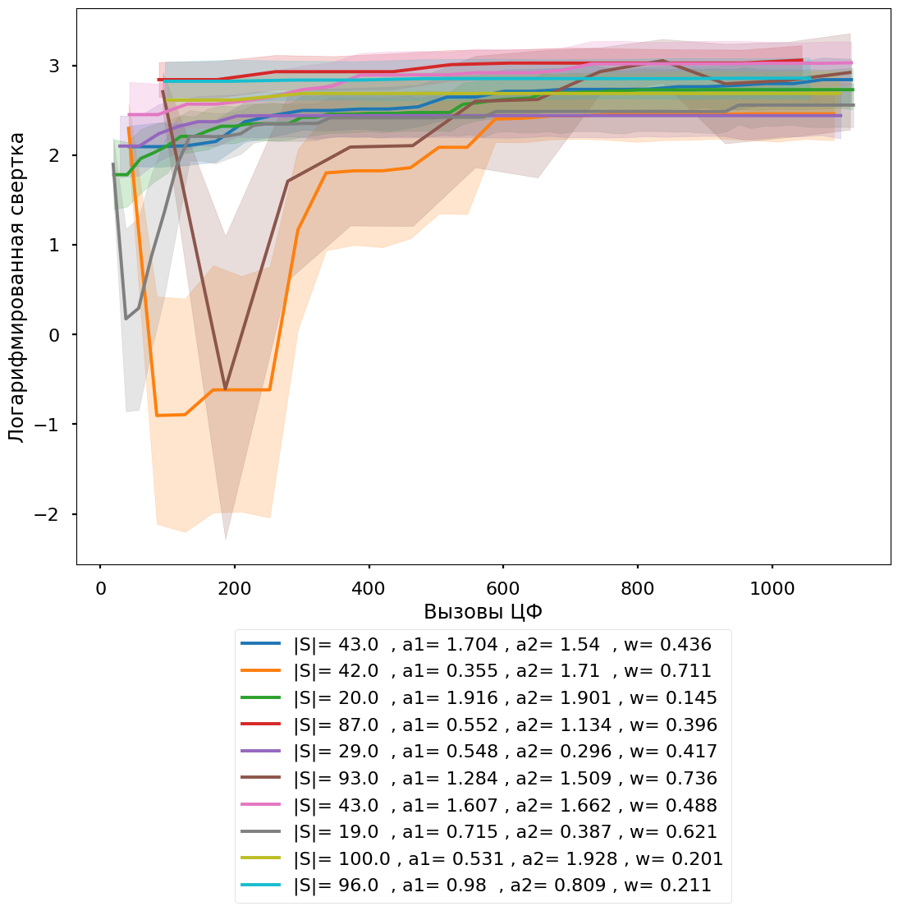
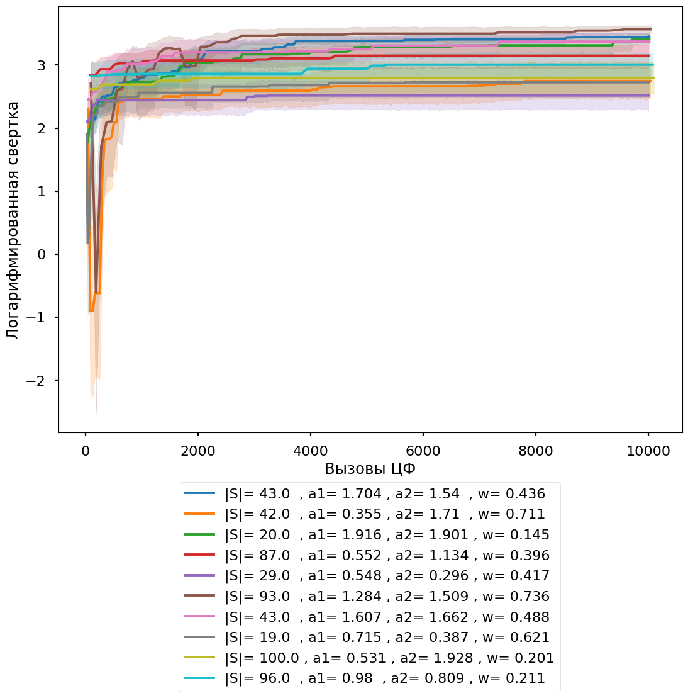

---
jupyter:
  colab:
    gpuType: T4
  kernelspec:
    display_name: Python 3
    name: python3
  language_info:
    codemirror_mode:
      name: ipython
      version: 3
    file_extension: .py
    mimetype: text/x-python
    name: python
    nbconvert_exporter: python
    pygments_lexer: ipython3
    version: 3.12.1
  nbformat: 4
  nbformat_minor: 0
---

EFFECTIVENESS_INTERACTION
```
    array([[ 0.25      ,  0.11111111,  0.0625    ,  0.04      ,  0.02777778,
             0.02040816],
           [ 6.        ,  0.25      ,  0.11111111,  0.0625    ,  0.04      ,
             0.02777778],
           [ 7.        ,  6.        ,  0.25      ,  0.11111111,  0.0625    ,
             0.04      ],
           [ 8.        ,  7.        ,  6.        ,  0.25      ,  0.11111111,
             0.0625    ],
           [ 9.        ,  8.        ,  7.        ,  6.        ,  0.25      ,
             0.11111111],
           [10.        ,  9.        ,  8.        ,  7.        ,  6.        ,
             0.25      ]])
```

# 5x5




# Вызовы ЦФ 0
```
  Расчет доверительных интервалов для каждой группы
  Параметры
  |S|= 19.0  , a1= 0.715 , a2= 0.387 , w= 0.621      (4.534984969177359, 8.591371929295118)
  |S|= 20.0  , a1= 1.916 , a2= 1.901 , w= 0.145     (5.955294233005493, 10.958660906077291)
  |S|= 29.0  , a1= 0.548 , a2= 0.296 , w= 0.417     (6.841221928871873, 15.636220373661383)
  |S|= 42.0  , a1= 0.355 , a2= 1.71  , w= 0.711     (8.378587408051143, 16.629934362627054)
  |S|= 43.0  , a1= 1.607 , a2= 1.662 , w= 0.488     (10.438596742938895, 20.76974291063247)
  |S|= 43.0  , a1= 1.704 , a2= 1.54  , w= 0.436    (6.7561418893700775, 12.218161225177283)
  Name: Свертка, dtype: object
```
## MIN
|       |   Коль-во частиц |   MAX Количесво итераций | c1_c2_w                                                   |   № эксперемента |       Время |   Вызовы ЦФ |   Свертка | Распределение    |   Логарифмированная свертка | Параметры                                     |   score |    AVG t |   AVG score | t                                                             | Score                                |
|------:|-----------------:|-------------------------:|:----------------------------------------------------------|-----------------:|------------:|------------:|----------:|:-----------------|----------------------------:|:----------------------------------------------|--------:|---------:|------------:|:--------------------------------------------------------------|:-------------------------------------|
| 36535 |               19 |                      526 | 0.7152822531830084_0.3866134304565536_0.620747578431883   |                3 | 0.0114858   |          38 |   0       | [ 0 -1  3  0  2] |                 -inf        | |S|= 19.0  , a1= 0.715 , a2= 0.387 , w= 0.621 |     1.8 | 6.09734  |      2.6125 | [16.02255355  0.          0.99317398  9.71366933  3.75729743] | [0.0625 1.     6.     7.     1.    ] |
| 17456 |               20 |                      500 | 1.9164651165895739_1.900872225412764_0.14524109418144696  |               17 | 1.19209e-06 |          20 |   1       | [-1 -1 -1 -1 -1] |                    0        | |S|= 20.0  , a1= 1.916 , a2= 1.901 , w= 0.145 |     0   | 0        |      0      | [0. 0. 0. 0. 0.]                                              | [1. 1. 1. 1. 1.]                     |
| 23830 |               29 |                      344 | 0.5484913705011256_0.29601546503836_0.41684659408854485   |                7 | 7.15256e-07 |          29 |   2.34521 | [-1 -1 -1  3 -1] |                    0.852374 | |S|= 29.0  , a1= 0.548 , a2= 0.296 , w= 0.417 |     0.8 | 0.767523 |      1.8    | [0.         0.         0.         3.83761289 0.        ]      | [1. 1. 1. 9. 1.]                     |
|  4660 |               42 |                      238 | 0.35529206381356226_1.7101241001807421_0.7110196951812913 |                1 | 7.15256e-07 |          42 |   2.81866 | [ 2 -1 -1 -1 -1] |                    1.03626  | |S|= 42.0  , a1= 0.355 , a2= 1.71  , w= 0.711 |     0.6 | 0.567646 |      1.6    | [2.83823106 0.         0.         0.         0.        ]      | [1. 1. 8. 1. 1.]                     |
| 33150 |               43 |                      232 | 1.6073461591471596_1.6617126804074809_0.48802770234475623 |               11 | 9.53674e-07 |          43 |   2.11775 | [-1 -1 -1  4 -1] |                    0.750355 | |S|= 43.0  , a1= 1.607 , a2= 1.662 , w= 0.488 |     1   | 0.661079 |      1.4    | [0.         0.         0.         3.30539254 0.        ]      | [1. 1. 1. 1. 7.]                     |
|   233 |               43 |                      232 | 1.7044015178975915_1.5401133655865746_0.43645726466467605 |                2 | 1.43051e-06 |          43 |   2.81866 | [ 2 -1 -1 -1 -1] |                    1.03626  | |S|= 43.0  , a1= 1.704 , a2= 1.54  , w= 0.436 |     0.6 | 0.567646 |      1.6    | [2.83823106 0.         0.         0.         0.        ]      | [1. 1. 8. 1. 1.]                     |
```
  AVG
  Коль-во частиц                32.666667
  MAX Количесво итераций       345.333333
  № эксперемента                 6.833333
  Время                          0.001915
  Вызовы ЦФ                     35.833333
  Свертка                        1.850046
  Логарифмированная свертка          -inf
  score                          0.800000
  AVG t                          1.443539
  AVG score                      1.502083
  dtype: float64

  Cвертка : -1,
  Распределение: [0, -1, 3, 0, 2]
  Колисчесвто целей:5. Количесвто UAV:5
  Ограниечнеи выбор целей не > 1: {'Цель 0 (Количестов нацеленных)': 2, 'Цель 1 (Количестов нацеленных)': 0, 'Цель 2 (Количестов нацеленных)': 1, 'Цель 3 (Количестов нацеленных)': 1, 'Цель 4 (Количестов нацеленных)': 0}
  t: [16.02255355  0.          0.99317398  9.71366933  3.75729743]
  AVG t: 6.097338857859133
  score: [0.0625 1.     6.     7.     1.    ]
  AVG score: 2.6125
  Количесво задействоанных UAV: 4


  Cвертка : 1.0,
  Распределение: [-1, -1, -1, -1, -1]
  Колисчесвто целей:5. Количесвто UAV:5
  Ограниечнеи выбор целей не > 1: {'Цель 0 (Количестов нацеленных)': 0, 'Цель 1 (Количестов нацеленных)': 0, 'Цель 2 (Количестов нацеленных)': 0, 'Цель 3 (Количестов нацеленных)': 0, 'Цель 4 (Количестов нацеленных)': 0}
  t: [0. 0. 0. 0. 0.]
  AVG t: 0.0
  score: [1. 1. 1. 1. 1.]
  AVG score: 0.0
  Количесво задействоанных UAV: 0


  Cвертка : 2.345207879911715,
  Распределение: [-1, -1, -1, 3, -1]
  Колисчесвто целей:5. Количесвто UAV:5
  Ограниечнеи выбор целей не > 1: {'Цель 0 (Количестов нацеленных)': 0, 'Цель 1 (Количестов нацеленных)': 0, 'Цель 2 (Количестов нацеленных)': 0, 'Цель 3 (Количестов нацеленных)': 1, 'Цель 4 (Количестов нацеленных)': 0}
  t: [0.         0.         0.         3.83761289 0.        ]
  AVG t: 0.7675225788801976
  score: [1. 1. 1. 9. 1.]
  AVG score: 1.8
  Количесво задействоанных UAV: 1


  Cвертка : 2.8186570536705764,
  Распределение: [2, -1, -1, -1, -1]
  Колисчесвто целей:5. Количесвто UAV:5
  Ограниечнеи выбор целей не > 1: {'Цель 0 (Количестов нацеленных)': 0, 'Цель 1 (Количестов нацеленных)': 0, 'Цель 2 (Количестов нацеленных)': 1, 'Цель 3 (Количестов нацеленных)': 0, 'Цель 4 (Количестов нацеленных)': 0}
  t: [2.83823106 0.         0.         0.         0.        ]
  AVG t: 0.5676462121975467
  score: [1. 1. 8. 1. 1.]
  AVG score: 1.6
  Количесво задействоанных UAV: 1


  Cвертка : 2.1177514979239547,
  Распределение: [-1, -1, -1, 4, -1]
  Колисчесвто целей:5. Количесвто UAV:5
  Ограниечнеи выбор целей не > 1: {'Цель 0 (Количестов нацеленных)': 0, 'Цель 1 (Количестов нацеленных)': 0, 'Цель 2 (Количестов нацеленных)': 0, 'Цель 3 (Количестов нацеленных)': 0, 'Цель 4 (Количестов нацеленных)': 1}
  t: [0.         0.         0.         3.30539254 0.        ]
  AVG t: 0.661078507734467
  score: [1. 1. 1. 1. 7.]
  AVG score: 1.4
  Количесво задействоанных UAV: 1


  Cвертка : 2.8186570536705764,
  Распределение: [2, -1, -1, -1, -1]
  Колисчесвто целей:5. Количесвто UAV:5
  Ограниечнеи выбор целей не > 1: {'Цель 0 (Количестов нацеленных)': 0, 'Цель 1 (Количестов нацеленных)': 0, 'Цель 2 (Количестов нацеленных)': 1, 'Цель 3 (Количестов нацеленных)': 0, 'Цель 4 (Количестов нацеленных)': 0}
  t: [2.83823106 0.         0.         0.         0.        ]
  AVG t: 0.5676462121975467
  score: [1. 1. 8. 1. 1.]
  AVG score: 1.6
  Количесво задействоанных UAV: 1


  Параметры
  |S|= 19.0  , a1= 0.715 , a2= 0.387 , w= 0.621    0.000000
  |S|= 20.0  , a1= 1.916 , a2= 1.901 , w= 0.145    1.000000
  |S|= 29.0  , a1= 0.548 , a2= 0.296 , w= 0.417    2.345208
  |S|= 42.0  , a1= 0.355 , a2= 1.71  , w= 0.711    2.818657
  |S|= 43.0  , a1= 1.607 , a2= 1.662 , w= 0.488    2.117751
  |S|= 43.0  , a1= 1.704 , a2= 1.54  , w= 0.436    2.818657
  Name: Свертка, dtype: float64
```
## MAX
|       |   Коль-во частиц |   MAX Количесво итераций | c1_c2_w                                                   |   № эксперемента |       Время |   Вызовы ЦФ |   Свертка | Распределение    |   Логарифмированная свертка | Параметры                                     |   score |   AVG t |   AVG score | t                                                        | Score            |
|------:|-----------------:|-------------------------:|:----------------------------------------------------------|-----------------:|------------:|------------:|----------:|:-----------------|----------------------------:|:----------------------------------------------|--------:|--------:|------------:|:---------------------------------------------------------|:-----------------|
| 41277 |               19 |                      526 | 0.7152822531830084_0.3866134304565536_0.620747578431883   |               12 | 9.53674e-07 |          19 |   26.0826 | [-1 -1  3  4  2] |                     3.26127 | |S|= 19.0  , a1= 0.715 , a2= 0.387 , w= 0.621 |     2.4 | 1.61117 |         4   | [0.         0.         0.99317398 3.30539254 3.75729743] | [1. 1. 6. 7. 7.] |
| 18959 |               20 |                      500 | 1.9164651165895739_1.900872225412764_0.14524109418144696  |               20 | 4.76837e-07 |          20 |   32.5819 | [ 3 -1  2  4 -1] |                     3.48376 | |S|= 20.0  , a1= 1.916 , a2= 1.901 , w= 0.145 |     2.4 | 1.98358 |         4.4 | [4.01040314 0.         2.60210973 3.30539254 0.        ] | [1. 1. 7. 8. 7.] |
| 25900 |               29 |                      344 | 0.5484913705011256_0.29601546503836_0.41684659408854485   |               13 | 7.15256e-07 |          29 |   33.884  | [ 2  3 -1  4 -1] |                     3.52294 | |S|= 29.0  , a1= 0.548 , a2= 0.296 , w= 0.417 |     2.4 | 1.54626 |         4.2 | [2.83823106 1.58767442 0.         3.30539254 0.        ] | [1. 1. 8. 6. 7.] |
|  5616 |               42 |                      238 | 0.35529206381356226_1.7101241001807421_0.7110196951812913 |                5 | 1.19209e-06 |          42 |   32.5819 | [ 3 -1  2  4 -1] |                     3.48376 | |S|= 42.0  , a1= 0.355 , a2= 1.71  , w= 0.711 |     2.4 | 1.98358 |         4.4 | [4.01040314 0.         2.60210973 3.30539254 0.        ] | [1. 1. 7. 8. 7.] |
| 34315 |               43 |                      232 | 1.6073461591471596_1.6617126804074809_0.48802770234475623 |               16 | 9.53674e-07 |          43 |   39.5314 | [ 2 -1  3  4 -1] |                     3.67709 | |S|= 43.0  , a1= 1.607 , a2= 1.662 , w= 0.488 |     2.4 | 1.42736 |         4.4 | [2.83823106 0.         0.99317398 3.30539254 0.        ] | [1. 1. 8. 7. 7.] |
|  4427 |               43 |                      232 | 1.7044015178975915_1.5401133655865746_0.43645726466467605 |               20 | 7.15256e-07 |          43 |   27.9274 | [ 3 -1 -1  4  2] |                     3.32961 | |S|= 43.0  , a1= 1.704 , a2= 1.54  , w= 0.436 |     2.4 | 2.21462 |         4.2 | [4.01040314 0.         0.         3.30539254 3.75729743] | [1. 1. 6. 8. 7.] |
```
  AVG
  Коль-во частиц               3.266667e+01
  MAX Количесво итераций       3.453333e+02
  № эксперемента               1.433333e+01
  Время                        8.344650e-07
  Вызовы ЦФ                    3.266667e+01
  Свертка                      3.209820e+01
  Логарифмированная свертка    3.459738e+00
  score                        2.400000e+00
  AVG t                        1.794429e+00
  AVG score                    4.266667e+00
  dtype: float64

  Cвертка : 26.082577149942157,
  Распределение: [-1, -1, 3, 4, 2]
  Колисчесвто целей:5. Количесвто UAV:5
  Ограниечнеи выбор целей не > 1: {'Цель 0 (Количестов нацеленных)': 0, 'Цель 1 (Количестов нацеленных)': 0, 'Цель 2 (Количестов нацеленных)': 1, 'Цель 3 (Количестов нацеленных)': 1, 'Цель 4 (Количестов нацеленных)': 1}
  t: [0.         0.         0.99317398 3.30539254 3.75729743]
  AVG t: 1.611172789349056
  score: [1. 1. 6. 7. 7.]
  AVG score: 4.0
  Количесво задействоанных UAV: 3


  Cвертка : 32.58192808899659,
  Распределение: [3, -1, 2, 4, -1]
  Колисчесвто целей:5. Количесвто UAV:5
  Ограниечнеи выбор целей не > 1: {'Цель 0 (Количестов нацеленных)': 0, 'Цель 1 (Количестов нацеленных)': 0, 'Цель 2 (Количестов нацеленных)': 1, 'Цель 3 (Количестов нацеленных)': 1, 'Цель 4 (Количестов нацеленных)': 1}
  t: [4.01040314 0.         2.60210973 3.30539254 0.        ]
  AVG t: 1.9835810818094075
  score: [1. 1. 7. 8. 7.]
  AVG score: 4.4
  Количесво задействоанных UAV: 3


  Cвертка : 33.884023966783275,
  Распределение: [2, 3, -1, 4, -1]
  Колисчесвто целей:5. Количесвто UAV:5
  Ограниечнеи выбор целей не > 1: {'Цель 0 (Количестов нацеленных)': 0, 'Цель 1 (Количестов нацеленных)': 0, 'Цель 2 (Количестов нацеленных)': 1, 'Цель 3 (Количестов нацеленных)': 1, 'Цель 4 (Количестов нацеленных)': 1}
  t: [2.83823106 1.58767442 0.         3.30539254 0.        ]
  AVG t: 1.5462596036327874
  score: [1. 1. 8. 6. 7.]
  AVG score: 4.2
  Количесво задействоанных UAV: 3


  Cвертка : 32.58192808899659,
  Распределение: [3, -1, 2, 4, -1]
  Колисчесвто целей:5. Количесвто UAV:5
  Ограниечнеи выбор целей не > 1: {'Цель 0 (Количестов нацеленных)': 0, 'Цель 1 (Количестов нацеленных)': 0, 'Цель 2 (Количестов нацеленных)': 1, 'Цель 3 (Количестов нацеленных)': 1, 'Цель 4 (Количестов нацеленных)': 1}
  t: [4.01040314 0.         2.60210973 3.30539254 0.        ]
  AVG t: 1.9835810818094075
  score: [1. 1. 7. 8. 7.]
  AVG score: 4.4
  Количесво задействоанных UAV: 3


  Cвертка : 39.531361294580485,
  Распределение: [2, -1, 3, 4, -1]
  Колисчесвто целей:5. Количесвто UAV:5
  Ограниечнеи выбор целей не > 1: {'Цель 0 (Количестов нацеленных)': 0, 'Цель 1 (Количестов нацеленных)': 0, 'Цель 2 (Количестов нацеленных)': 1, 'Цель 3 (Количестов нацеленных)': 1, 'Цель 4 (Количестов нацеленных)': 1}
  t: [2.83823106 0.         0.99317398 3.30539254 0.        ]
  AVG t: 1.427359516261673
  score: [1. 1. 8. 7. 7.]
  AVG score: 4.4
  Количесво задействоанных UAV: 3


  Cвертка : 27.927366933425652,
  Распределение: [3, -1, -1, 4, 2]
  Колисчесвто целей:5. Количесвто UAV:5
  Ограниечнеи выбор целей не > 1: {'Цель 0 (Количестов нацеленных)': 0, 'Цель 1 (Количестов нацеленных)': 0, 'Цель 2 (Количестов нацеленных)': 1, 'Цель 3 (Количестов нацеленных)': 1, 'Цель 4 (Количестов нацеленных)': 1}
  t: [4.01040314 0.         0.         3.30539254 3.75729743]
  AVG t: 2.214618620720461
  score: [1. 1. 6. 8. 7.]
  AVG score: 4.2
  Количесво задействоанных UAV: 3


  Параметры
  |S|= 19.0  , a1= 0.715 , a2= 0.387 , w= 0.621    26.082577
  |S|= 20.0  , a1= 1.916 , a2= 1.901 , w= 0.145    32.581928
  |S|= 29.0  , a1= 0.548 , a2= 0.296 , w= 0.417    33.884024
  |S|= 42.0  , a1= 0.355 , a2= 1.71  , w= 0.711    32.581928
  |S|= 43.0  , a1= 1.607 , a2= 1.662 , w= 0.488    39.531361
  |S|= 43.0  , a1= 1.704 , a2= 1.54  , w= 0.436    27.927367
  Name: Свертка, dtype: float64
```


# Вызовы ЦФ 1000
```
  Расчет доверительных интервалов для каждой группы
  Параметры
  |S|= 100.0 , a1= 0.531 , a2= 1.928 , w= 0.201     (12.712375394676162, 21.43584631273254)
  |S|= 19.0  , a1= 0.715 , a2= 0.387 , w= 0.621    (13.633453495971441, 16.830546862151515)
  |S|= 20.0  , a1= 1.916 , a2= 1.901 , w= 0.145    (15.797845557524848, 19.647928487943798)
  |S|= 29.0  , a1= 0.548 , a2= 0.296 , w= 0.417    (11.751200292748564, 15.696617891522852)
  |S|= 42.0  , a1= 0.355 , a2= 1.71  , w= 0.711     (12.088204902883163, 17.96999332451181)
  |S|= 43.0  , a1= 1.607 , a2= 1.662 , w= 0.488      (20.31260193633844, 27.42013921170409)
  |S|= 43.0  , a1= 1.704 , a2= 1.54  , w= 0.436     (15.942612564172723, 22.14129782234767)
  |S|= 87.0  , a1= 0.552 , a2= 1.134 , w= 0.396     (20.17299344957439, 24.891924037898423)
  |S|= 93.0  , a1= 1.284 , a2= 1.509 , w= 0.736     (18.254442795302264, 28.88254567008332)
  |S|= 96.0  , a1= 0.98  , a2= 0.809 , w= 0.211     (15.646374673033982, 23.76836682902764)
  Name: Свертка, dtype: object
```
## MIN
|       |   Коль-во частиц |   MAX Количесво итераций | c1_c2_w                                                   |   № эксперемента |    Время |   Вызовы ЦФ |   Свертка | Распределение    |   Логарифмированная свертка | Параметры                                     |   score |    AVG t |   AVG score | t                                                        | Score                      |
|------:|-----------------:|-------------------------:|:----------------------------------------------------------|-----------------:|---------:|------------:|----------:|:-----------------|----------------------------:|:----------------------------------------------|--------:|---------:|------------:|:---------------------------------------------------------|:---------------------------|
| 47746 |              100 |                      100 | 0.5307411328239927_1.9283605680853273_0.20106471892068767 |               18 | 0.490943 |        1000 |  8.07037  | [-1  3  2 -1 -1] |                     2.0882  | |S|= 100.0 , a1= 0.531 , a2= 1.928 , w= 0.201 |     1.4 | 0.837957 |       2.6   | [0.         1.58767442 2.60210973 0.         0.        ] | [1. 1. 7. 6. 1.]           |
| 36583 |               19 |                      526 | 0.7152822531830084_0.3866134304565536_0.620747578431883   |                3 | 0.438849 |         950 |  5.58912  | [-1 -1  3 -1  2] |                     1.72082 | |S|= 19.0  , a1= 0.715 , a2= 0.387 , w= 0.621 |     1.4 | 0.950094 |       2.6   | [0.         0.         0.99317398 0.         3.75729743] | [1. 1. 6. 7. 1.]           |
| 13495 |               20 |                      500 | 1.9164651165895739_1.900872225412764_0.14524109418144696  |                9 | 0.345994 |         960 |  8.3373   | [-1 -1 -1  2 -1] |                     2.12074 | |S|= 20.0  , a1= 1.916 , a2= 1.901 , w= 0.145 |     0.6 | 0.215897 |       1.8   | [0.         0.         0.         1.07948564 0.        ] | [1. 1. 9. 1. 1.]           |
| 21792 |               29 |                      344 | 0.5484913705011256_0.29601546503836_0.41684659408854485   |                1 | 0.558913 |         957 |  5.23281  | [ 3  2 -1 -1 -1] |                     1.65495 | |S|= 29.0  , a1= 0.548 , a2= 0.296 , w= 0.417 |     1.4 | 1.71937  |       2.8   | [4.01040314 4.58644775 0.         0.         0.        ] | [1. 1. 6. 8. 1.]           |
|  4682 |               42 |                      238 | 0.35529206381356226_1.7101241001807421_0.7110196951812913 |                1 | 0.523023 |         966 |  2.81866  | [ 2 -1 -1 -1 -1] |                     1.03626 | |S|= 42.0  , a1= 0.355 , a2= 1.71  , w= 0.711 |     0.6 | 0.567646 |       1.6   | [2.83823106 0.         0.         0.         0.        ] | [1. 1. 8. 1. 1.]           |
| 31308 |               43 |                      232 | 1.6073461591471596_1.6617126804074809_0.48802770234475623 |                3 | 0.5603   |         989 |  8.07037  | [-1  3  2 -1 -1] |                     2.0882  | |S|= 43.0  , a1= 1.607 , a2= 1.662 , w= 0.488 |     1.4 | 0.837957 |       2.6   | [0.         1.58767442 2.60210973 0.         0.        ] | [1. 1. 7. 6. 1.]           |
|   721 |               43 |                      232 | 1.7044015178975915_1.5401133655865746_0.43645726466467605 |                4 | 0.361487 |         989 |  7.04811  | [-1 -1  3 -1 -1] |                     1.95276 | |S|= 43.0  , a1= 1.704 , a2= 1.54  , w= 0.436 |     0.8 | 0.198635 |       1.4   | [0.         0.         0.99317398 0.         0.        ] | [1. 1. 1. 7. 1.]           |
| 20620 |               87 |                      114 | 0.5521327914745936_1.1340355280623087_0.39596413323846347 |               11 | 0.519096 |         957 |  9.55294  | [ 4  2 -1 -1  3] |                     2.25685 | |S|= 87.0  , a1= 0.552 , a2= 1.134 , w= 0.396 |     2.4 | 3.18032  |       3.6   | [7.53694604 4.58644775 0.         0.         3.77818625] | [1. 1. 6. 6. 6.]           |
| 30506 |               93 |                      107 | 1.2835132202904338_1.5093952795953858_0.7361548524525573  |               18 | 0.381668 |        1023 |  0.122099 | [-1  2  1  4 -1] |                    -2.10292 | |S|= 93.0  , a1= 1.284 , a2= 1.509 , w= 0.736 |     2   | 2.27099  |       2.608 | [0.         4.58644775 3.46311959 3.30539254 0.        ] | [1.   0.04 6.   1.   7.  ] |
| 48364 |               96 |                      104 | 0.9797139798485407_0.8092926696505798_0.21083153001156418 |                4 | 0.373475 |         960 |  8.07037  | [-1  3  2 -1 -1] |                     2.0882  | |S|= 96.0  , a1= 0.98  , a2= 0.809 , w= 0.211 |     1.4 | 0.837957 |       2.6   | [0.         1.58767442 2.60210973 0.         0.        ] | [1. 1. 7. 6. 1.]           |
```
  AVG
  Коль-во частиц                57.200000
  MAX Количесво итераций       249.700000
  № эксперемента                 7.200000
  Время                          0.455375
  Вызовы ЦФ                    975.100000
  Свертка                        6.291217
  Логарифмированная свертка      1.490405
  score                          1.340000
  AVG t                          1.161682
  AVG score                      2.420800
  dtype: float64

  Cвертка : 8.070374489900315,
  Распределение: [-1, 3, 2, -1, -1]
  Колисчесвто целей:5. Количесвто UAV:5
  Ограниечнеи выбор целей не > 1: {'Цель 0 (Количестов нацеленных)': 0, 'Цель 1 (Количестов нацеленных)': 0, 'Цель 2 (Количестов нацеленных)': 1, 'Цель 3 (Количестов нацеленных)': 1, 'Цель 4 (Количестов нацеленных)': 0}
  t: [0.         1.58767442 2.60210973 0.         0.        ]
  AVG t: 0.8379568300746498
  score: [1. 1. 7. 6. 1.]
  AVG score: 2.6
  Количесво задействоанных UAV: 2


  Cвертка : 5.589123674987605,
  Распределение: [-1, -1, 3, -1, 2]
  Колисчесвто целей:5. Количесвто UAV:5
  Ограниечнеи выбор целей не > 1: {'Цель 0 (Количестов нацеленных)': 0, 'Цель 1 (Количестов нацеленных)': 0, 'Цель 2 (Количестов нацеленных)': 1, 'Цель 3 (Количестов нацеленных)': 1, 'Цель 4 (Количестов нацеленных)': 0}
  t: [0.         0.         0.99317398 0.         3.75729743]
  AVG t: 0.9500942816145888
  score: [1. 1. 6. 7. 1.]
  AVG score: 2.6
  Количесво задействоанных UAV: 2


  Cвертка : 8.337304018558537,
  Распределение: [-1, -1, -1, 2, -1]
  Колисчесвто целей:5. Количесвто UAV:5
  Ограниечнеи выбор целей не > 1: {'Цель 0 (Количестов нацеленных)': 0, 'Цель 1 (Количестов нацеленных)': 0, 'Цель 2 (Количестов нацеленных)': 1, 'Цель 3 (Количестов нацеленных)': 0, 'Цель 4 (Количестов нацеленных)': 0}
  t: [0.         0.         0.         1.07948564 0.        ]
  AVG t: 0.21589712885523485
  score: [1. 1. 9. 1. 1.]
  AVG score: 1.8
  Количесво задействоанных UAV: 1


  Cвертка : 5.232807896436928,
  Распределение: [3, 2, -1, -1, -1]
  Колисчесвто целей:5. Количесвто UAV:5
  Ограниечнеи выбор целей не > 1: {'Цель 0 (Количестов нацеленных)': 0, 'Цель 1 (Количестов нацеленных)': 0, 'Цель 2 (Количестов нацеленных)': 1, 'Цель 3 (Количестов нацеленных)': 1, 'Цель 4 (Количестов нацеленных)': 0}
  t: [4.01040314 4.58644775 0.         0.         0.        ]
  AVG t: 1.7193701775942238
  score: [1. 1. 6. 8. 1.]
  AVG score: 2.8
  Количесво задействоанных UAV: 2


  Cвертка : 2.8186570536705764,
  Распределение: [2, -1, -1, -1, -1]
  Колисчесвто целей:5. Количесвто UAV:5
  Ограниечнеи выбор целей не > 1: {'Цель 0 (Количестов нацеленных)': 0, 'Цель 1 (Количестов нацеленных)': 0, 'Цель 2 (Количестов нацеленных)': 1, 'Цель 3 (Количестов нацеленных)': 0, 'Цель 4 (Количестов нацеленных)': 0}
  t: [2.83823106 0.         0.         0.         0.        ]
  AVG t: 0.5676462121975467
  score: [1. 1. 8. 1. 1.]
  AVG score: 1.6
  Количесво задействоанных UAV: 1


  Cвертка : 8.070374489900315,
  Распределение: [-1, 3, 2, -1, -1]
  Колисчесвто целей:5. Количесвто UAV:5
  Ограниечнеи выбор целей не > 1: {'Цель 0 (Количестов нацеленных)': 0, 'Цель 1 (Количестов нацеленных)': 0, 'Цель 2 (Количестов нацеленных)': 1, 'Цель 3 (Количестов нацеленных)': 1, 'Цель 4 (Количестов нацеленных)': 0}
  t: [0.         1.58767442 2.60210973 0.         0.        ]
  AVG t: 0.8379568300746498
  score: [1. 1. 7. 6. 1.]
  AVG score: 2.6
  Количесво задействоанных UAV: 2


  Cвертка : 7.048110531835147,
  Распределение: [-1, -1, 3, -1, -1]
  Колисчесвто целей:5. Количесвто UAV:5
  Ограниечнеи выбор целей не > 1: {'Цель 0 (Количестов нацеленных)': 0, 'Цель 1 (Количестов нацеленных)': 0, 'Цель 2 (Количестов нацеленных)': 0, 'Цель 3 (Количестов нацеленных)': 1, 'Цель 4 (Количестов нацеленных)': 0}
  t: [0.         0.         0.99317398 0.         0.        ]
  AVG t: 0.19863479632965914
  score: [1. 1. 1. 7. 1.]
  AVG score: 1.4
  Количесво задействоанных UAV: 1


  Cвертка : 9.552940893075885,
  Распределение: [4, 2, -1, -1, 3]
  Колисчесвто целей:5. Количесвто UAV:5
  Ограниечнеи выбор целей не > 1: {'Цель 0 (Количестов нацеленных)': 0, 'Цель 1 (Количестов нацеленных)': 0, 'Цель 2 (Количестов нацеленных)': 1, 'Цель 3 (Количестов нацеленных)': 1, 'Цель 4 (Количестов нацеленных)': 1}
  t: [7.53694604 4.58644775 0.         0.         3.77818625]
  AVG t: 3.1803160076577965
  score: [1. 1. 6. 6. 6.]
  AVG score: 3.6
  Количесво задействоанных UAV: 3


  Cвертка : 0.12209885091686164,
  Распределение: [-1, 2, 1, 4, -1]
  Колисчесвто целей:5. Количесвто UAV:5
  Ограниечнеи выбор целей не > 1: {'Цель 0 (Количестов нацеленных)': 0, 'Цель 1 (Количестов нацеленных)': 1, 'Цель 2 (Количестов нацеленных)': 1, 'Цель 3 (Количестов нацеленных)': 0, 'Цель 4 (Количестов нацеленных)': 1}
  t: [0.         4.58644775 3.46311959 3.30539254 0.        ]
  AVG t: 2.270991975173406
  score: [1.   0.04 6.   1.   7.  ]
  AVG score: 2.6079999999999997
  Количесво задействоанных UAV: 3


  Cвертка : 8.070374489900315,
  Распределение: [-1, 3, 2, -1, -1]
  Колисчесвто целей:5. Количесвто UAV:5
  Ограниечнеи выбор целей не > 1: {'Цель 0 (Количестов нацеленных)': 0, 'Цель 1 (Количестов нацеленных)': 0, 'Цель 2 (Количестов нацеленных)': 1, 'Цель 3 (Количестов нацеленных)': 1, 'Цель 4 (Количестов нацеленных)': 0}
  t: [0.         1.58767442 2.60210973 0.         0.        ]
  AVG t: 0.8379568300746498
  score: [1. 1. 7. 6. 1.]
  AVG score: 2.6
  Количесво задействоанных UAV: 2


  Параметры
  |S|= 100.0 , a1= 0.531 , a2= 1.928 , w= 0.201    8.070374
  |S|= 19.0  , a1= 0.715 , a2= 0.387 , w= 0.621    5.589124
  |S|= 20.0  , a1= 1.916 , a2= 1.901 , w= 0.145    8.337304
  |S|= 29.0  , a1= 0.548 , a2= 0.296 , w= 0.417    5.232808
  |S|= 42.0  , a1= 0.355 , a2= 1.71  , w= 0.711    2.818657
  |S|= 43.0  , a1= 1.607 , a2= 1.662 , w= 0.488    8.070374
  |S|= 43.0  , a1= 1.704 , a2= 1.54  , w= 0.436    7.048111
  |S|= 87.0  , a1= 0.552 , a2= 1.134 , w= 0.396    9.552941
  |S|= 93.0  , a1= 1.284 , a2= 1.509 , w= 0.736    0.122099
  |S|= 96.0  , a1= 0.98  , a2= 0.809 , w= 0.211    8.070374
  Name: Свертка, dtype: float64
```
## MAX
|       |   Коль-во частиц |   MAX Количесво итераций | c1_c2_w                                                   |   № эксперемента |    Время |   Вызовы ЦФ |   Свертка | Распределение    |   Логарифмированная свертка | Параметры                                     |   score |    AVG t |   AVG score | t                                                        | Score            |
|------:|-----------------:|-------------------------:|:----------------------------------------------------------|-----------------:|---------:|------------:|----------:|:-----------------|----------------------------:|:----------------------------------------------|--------:|---------:|------------:|:---------------------------------------------------------|:-----------------|
| 46029 |              100 |                      100 | 0.5307411328239927_1.9283605680853273_0.20106471892068767 |                1 | 0.420635 |        1000 |   39.5314 | [ 2 -1  3  4 -1] |                     3.67709 | |S|= 100.0 , a1= 0.531 , a2= 1.928 , w= 0.201 |     2.4 | 1.42736  |         4.4 | [2.83823106 0.         0.99317398 3.30539254 0.        ] | [1. 1. 8. 7. 7.] |
| 37637 |               19 |                      526 | 0.7152822531830084_0.3866134304565536_0.620747578431883   |                5 | 0.35912  |         950 |   29.1806 | [-1 -1  3  2 -1] |                     3.3735  | |S|= 19.0  , a1= 0.715 , a2= 0.387 , w= 0.621 |     1.4 | 0.414532 |         3.2 | [0.         0.         0.99317398 1.07948564 0.        ] | [1. 1. 9. 7. 1.] |
| 19006 |               20 |                      500 | 1.9164651165895739_1.900872225412764_0.14524109418144696  |               20 | 0.359641 |         960 |   39.5314 | [ 2 -1  3  4 -1] |                     3.67709 | |S|= 20.0  , a1= 1.916 , a2= 1.901 , w= 0.145 |     2.4 | 1.42736  |         4.4 | [2.83823106 0.         0.99317398 3.30539254 0.        ] | [1. 1. 8. 7. 7.] |
| 25932 |               29 |                      344 | 0.5484913705011256_0.29601546503836_0.41684659408854485   |               13 | 0.359    |         957 |   33.884  | [ 2  3 -1  4 -1] |                     3.52294 | |S|= 29.0  , a1= 0.548 , a2= 0.296 , w= 0.417 |     2.4 | 1.54626  |         4.2 | [2.83823106 1.58767442 0.         3.30539254 0.        ] | [1. 1. 8. 6. 7.] |
|  5638 |               42 |                      238 | 0.35529206381356226_1.7101241001807421_0.7110196951812913 |                5 | 0.550382 |         966 |   39.5314 | [ 2 -1  3  4 -1] |                     3.67709 | |S|= 42.0  , a1= 0.355 , a2= 1.71  , w= 0.711 |     2.4 | 1.42736  |         4.4 | [2.83823106 0.         0.99317398 3.30539254 0.        ] | [1. 1. 8. 7. 7.] |
| 33638 |               43 |                      232 | 1.6073461591471596_1.6617126804074809_0.48802770234475623 |               13 | 0.572451 |         989 |   39.5314 | [ 2 -1  3  4 -1] |                     3.67709 | |S|= 43.0  , a1= 1.607 , a2= 1.662 , w= 0.488 |     2.4 | 1.42736  |         4.4 | [2.83823106 0.         0.99317398 3.30539254 0.        ] | [1. 1. 8. 7. 7.] |
|  2585 |               43 |                      232 | 1.7044015178975915_1.5401133655865746_0.43645726466467605 |               12 | 0.565814 |         989 |   39.5314 | [ 2 -1  3  4 -1] |                     3.67709 | |S|= 43.0  , a1= 1.704 , a2= 1.54  , w= 0.436 |     2.4 | 1.42736  |         4.4 | [2.83823106 0.         0.99317398 3.30539254 0.        ] | [1. 1. 8. 7. 7.] |
| 21426 |               87 |                      114 | 0.5521327914745936_1.1340355280623087_0.39596413323846347 |               18 | 0.567118 |        1044 |   32.5819 | [ 3 -1  2  4 -1] |                     3.48376 | |S|= 87.0  , a1= 0.552 , a2= 1.134 , w= 0.396 |     2.4 | 1.98358  |         4.4 | [4.01040314 0.         2.60210973 3.30539254 0.        ] | [1. 1. 7. 8. 7.] |
| 28670 |               93 |                      107 | 1.2835132202904338_1.5093952795953858_0.7361548524525573  |                1 | 0.416498 |        1023 |   39.5314 | [ 2 -1  3  4 -1] |                     3.67709 | |S|= 93.0  , a1= 1.284 , a2= 1.509 , w= 0.736 |     2.4 | 1.42736  |         4.4 | [2.83823106 0.         0.99317398 3.30539254 0.        ] | [1. 1. 8. 7. 7.] |
| 49414 |               96 |                      104 | 0.9797139798485407_0.8092926696505798_0.21083153001156418 |               14 | 0.556129 |         960 |   33.884  | [ 2  3 -1  4 -1] |                     3.52294 | |S|= 96.0  , a1= 0.98  , a2= 0.809 , w= 0.211 |     2.4 | 1.54626  |         4.2 | [2.83823106 1.58767442 0.         3.30539254 0.        ] | [1. 1. 8. 6. 7.] |
```
  AVG
  Коль-во частиц                57.200000
  MAX Количесво итераций       249.700000
  № эксперемента                10.200000
  Время                          0.472679
  Вызовы ЦФ                    983.800000
  Свертка                       36.671871
  Логарифмированная свертка      3.596571
  score                          2.300000
  AVG t                          1.405479
  AVG score                      4.240000
  dtype: float64

  Cвертка : 39.531361294580485,
  Распределение: [2, -1, 3, 4, -1]
  Колисчесвто целей:5. Количесвто UAV:5
  Ограниечнеи выбор целей не > 1: {'Цель 0 (Количестов нацеленных)': 0, 'Цель 1 (Количестов нацеленных)': 0, 'Цель 2 (Количестов нацеленных)': 1, 'Цель 3 (Количестов нацеленных)': 1, 'Цель 4 (Количестов нацеленных)': 1}
  t: [2.83823106 0.         0.99317398 3.30539254 0.        ]
  AVG t: 1.427359516261673
  score: [1. 1. 8. 7. 7.]
  AVG score: 4.4
  Количесво задействоанных UAV: 3


  Cвертка : 29.180564064954883,
  Распределение: [-1, -1, 3, 2, -1]
  Колисчесвто целей:5. Количесвто UAV:5
  Ограниечнеи выбор целей не > 1: {'Цель 0 (Количестов нацеленных)': 0, 'Цель 1 (Количестов нацеленных)': 0, 'Цель 2 (Количестов нацеленных)': 1, 'Цель 3 (Количестов нацеленных)': 1, 'Цель 4 (Количестов нацеленных)': 0}
  t: [0.         0.         0.99317398 1.07948564 0.        ]
  AVG t: 0.41453192518489396
  score: [1. 1. 9. 7. 1.]
  AVG score: 3.2
  Количесво задействоанных UAV: 2


  Cвертка : 39.531361294580485,
  Распределение: [2, -1, 3, 4, -1]
  Колисчесвто целей:5. Количесвто UAV:5
  Ограниечнеи выбор целей не > 1: {'Цель 0 (Количестов нацеленных)': 0, 'Цель 1 (Количестов нацеленных)': 0, 'Цель 2 (Количестов нацеленных)': 1, 'Цель 3 (Количестов нацеленных)': 1, 'Цель 4 (Количестов нацеленных)': 1}
  t: [2.83823106 0.         0.99317398 3.30539254 0.        ]
  AVG t: 1.427359516261673
  score: [1. 1. 8. 7. 7.]
  AVG score: 4.4
  Количесво задействоанных UAV: 3


  Cвертка : 33.884023966783275,
  Распределение: [2, 3, -1, 4, -1]
  Колисчесвто целей:5. Количесвто UAV:5
  Ограниечнеи выбор целей не > 1: {'Цель 0 (Количестов нацеленных)': 0, 'Цель 1 (Количестов нацеленных)': 0, 'Цель 2 (Количестов нацеленных)': 1, 'Цель 3 (Количестов нацеленных)': 1, 'Цель 4 (Количестов нацеленных)': 1}
  t: [2.83823106 1.58767442 0.         3.30539254 0.        ]
  AVG t: 1.5462596036327874
  score: [1. 1. 8. 6. 7.]
  AVG score: 4.2
  Количесво задействоанных UAV: 3


  Cвертка : 39.531361294580485,
  Распределение: [2, -1, 3, 4, -1]
  Колисчесвто целей:5. Количесвто UAV:5
  Ограниечнеи выбор целей не > 1: {'Цель 0 (Количестов нацеленных)': 0, 'Цель 1 (Количестов нацеленных)': 0, 'Цель 2 (Количестов нацеленных)': 1, 'Цель 3 (Количестов нацеленных)': 1, 'Цель 4 (Количестов нацеленных)': 1}
  t: [2.83823106 0.         0.99317398 3.30539254 0.        ]
  AVG t: 1.427359516261673
  score: [1. 1. 8. 7. 7.]
  AVG score: 4.4
  Количесво задействоанных UAV: 3


  Cвертка : 39.531361294580485,
  Распределение: [2, -1, 3, 4, -1]
  Колисчесвто целей:5. Количесвто UAV:5
  Ограниечнеи выбор целей не > 1: {'Цель 0 (Количестов нацеленных)': 0, 'Цель 1 (Количестов нацеленных)': 0, 'Цель 2 (Количестов нацеленных)': 1, 'Цель 3 (Количестов нацеленных)': 1, 'Цель 4 (Количестов нацеленных)': 1}
  t: [2.83823106 0.         0.99317398 3.30539254 0.        ]
  AVG t: 1.427359516261673
  score: [1. 1. 8. 7. 7.]
  AVG score: 4.4
  Количесво задействоанных UAV: 3


  Cвертка : 39.531361294580485,
  Распределение: [2, -1, 3, 4, -1]
  Колисчесвто целей:5. Количесвто UAV:5
  Ограниечнеи выбор целей не > 1: {'Цель 0 (Количестов нацеленных)': 0, 'Цель 1 (Количестов нацеленных)': 0, 'Цель 2 (Количестов нацеленных)': 1, 'Цель 3 (Количестов нацеленных)': 1, 'Цель 4 (Количестов нацеленных)': 1}
  t: [2.83823106 0.         0.99317398 3.30539254 0.        ]
  AVG t: 1.427359516261673
  score: [1. 1. 8. 7. 7.]
  AVG score: 4.4
  Количесво задействоанных UAV: 3


  Cвертка : 32.58192808899659,
  Распределение: [3, -1, 2, 4, -1]
  Колисчесвто целей:5. Количесвто UAV:5
  Ограниечнеи выбор целей не > 1: {'Цель 0 (Количестов нацеленных)': 0, 'Цель 1 (Количестов нацеленных)': 0, 'Цель 2 (Количестов нацеленных)': 1, 'Цель 3 (Количестов нацеленных)': 1, 'Цель 4 (Количестов нацеленных)': 1}
  t: [4.01040314 0.         2.60210973 3.30539254 0.        ]
  AVG t: 1.9835810818094075
  score: [1. 1. 7. 8. 7.]
  AVG score: 4.4
  Количесво задействоанных UAV: 3


  Cвертка : 39.531361294580485,
  Распределение: [2, -1, 3, 4, -1]
  Колисчесвто целей:5. Количесвто UAV:5
  Ограниечнеи выбор целей не > 1: {'Цель 0 (Количестов нацеленных)': 0, 'Цель 1 (Количестов нацеленных)': 0, 'Цель 2 (Количестов нацеленных)': 1, 'Цель 3 (Количестов нацеленных)': 1, 'Цель 4 (Количестов нацеленных)': 1}
  t: [2.83823106 0.         0.99317398 3.30539254 0.        ]
  AVG t: 1.427359516261673
  score: [1. 1. 8. 7. 7.]
  AVG score: 4.4
  Количесво задействоанных UAV: 3


  Cвертка : 33.884023966783275,
  Распределение: [2, 3, -1, 4, -1]
  Колисчесвто целей:5. Количесвто UAV:5
  Ограниечнеи выбор целей не > 1: {'Цель 0 (Количестов нацеленных)': 0, 'Цель 1 (Количестов нацеленных)': 0, 'Цель 2 (Количестов нацеленных)': 1, 'Цель 3 (Количестов нацеленных)': 1, 'Цель 4 (Количестов нацеленных)': 1}
  t: [2.83823106 1.58767442 0.         3.30539254 0.        ]
  AVG t: 1.5462596036327874
  score: [1. 1. 8. 6. 7.]
  AVG score: 4.2
  Количесво задействоанных UAV: 3


  Параметры
  |S|= 100.0 , a1= 0.531 , a2= 1.928 , w= 0.201    39.531361
  |S|= 19.0  , a1= 0.715 , a2= 0.387 , w= 0.621    29.180564
  |S|= 20.0  , a1= 1.916 , a2= 1.901 , w= 0.145    39.531361
  |S|= 29.0  , a1= 0.548 , a2= 0.296 , w= 0.417    33.884024
  |S|= 42.0  , a1= 0.355 , a2= 1.71  , w= 0.711    39.531361
  |S|= 43.0  , a1= 1.607 , a2= 1.662 , w= 0.488    39.531361
  |S|= 43.0  , a1= 1.704 , a2= 1.54  , w= 0.436    39.531361
  |S|= 87.0  , a1= 0.552 , a2= 1.134 , w= 0.396    32.581928
  |S|= 93.0  , a1= 1.284 , a2= 1.509 , w= 0.736    39.531361
  |S|= 96.0  , a1= 0.98  , a2= 0.809 , w= 0.211    33.884024
  Name: Свертка, dtype: float64
```


# Вызовы ЦФ 10000
```
  Расчет доверительных интервалов для каждой группы
  Параметры
  |S|= 100.0 , a1= 0.531 , a2= 1.928 , w= 0.201    (14.436714524239246, 23.751294450526036)
  |S|= 19.0  , a1= 0.715 , a2= 0.387 , w= 0.621     (15.600883948947086, 19.84777942738431)
  |S|= 20.0  , a1= 1.916 , a2= 1.901 , w= 0.145    (29.563545779025354, 31.973540907755627)
  |S|= 29.0  , a1= 0.548 , a2= 0.296 , w= 0.417     (11.703680542958462, 17.13980396903153)
  |S|= 42.0  , a1= 0.355 , a2= 1.71  , w= 0.711     (16.126026503747063, 22.54075493906536)
  |S|= 43.0  , a1= 1.607 , a2= 1.662 , w= 0.488    (28.198661081925525, 33.266318113653824)
  |S|= 43.0  , a1= 1.704 , a2= 1.54  , w= 0.436       (30.35290174297637, 33.0569390142392)
  |S|= 87.0  , a1= 0.552 , a2= 1.134 , w= 0.396    (21.278536912893227, 29.122849990842806)
  |S|= 93.0  , a1= 1.284 , a2= 1.509 , w= 0.736        (34.263150811963, 37.29263087512021)
  |S|= 96.0  , a1= 0.98  , a2= 0.809 , w= 0.211     (18.351864284464874, 25.83745299091462)
  Name: Свертка, dtype: object
```
## MIN
|       |   Коль-во частиц |   MAX Количесво итераций | c1_c2_w                                                   |   № эксперемента |   Время |   Вызовы ЦФ |   Свертка | Распределение    |   Логарифмированная свертка | Параметры                                     |   score |    AVG t |   AVG score | t                                                        | Score            |
|------:|-----------------:|-------------------------:|:----------------------------------------------------------|-----------------:|--------:|------------:|----------:|:-----------------|----------------------------:|:----------------------------------------------|--------:|---------:|------------:|:---------------------------------------------------------|:-----------------|
| 47836 |              100 |                      100 | 0.5307411328239927_1.9283605680853273_0.20106471892068767 |               18 | 5.44581 |       10000 |   8.07037 | [-1  3  2 -1 -1] |                     2.0882  | |S|= 100.0 , a1= 0.531 , a2= 1.928 , w= 0.201 |     1.4 | 0.837957 |         2.6 | [0.         1.58767442 2.60210973 0.         0.        ] | [1. 1. 7. 6. 1.] |
| 43381 |               19 |                      526 | 0.7152822531830084_0.3866134304565536_0.620747578431883   |               15 | 4.78288 |        9956 |   7.04811 | [-1 -1  3 -1 -1] |                     1.95276 | |S|= 19.0  , a1= 0.715 , a2= 0.387 , w= 0.621 |     0.8 | 0.198635 |         1.4 | [0.         0.         0.99317398 0.         0.        ] | [1. 1. 1. 7. 1.] |
| 18955 |               20 |                      500 | 1.9164651165895739_1.900872225412764_0.14524109418144696  |               19 | 3.85706 |        9960 |  17.006   | [-1  3 -1  2 -1] |                     2.83357 | |S|= 20.0  , a1= 1.916 , a2= 1.901 , w= 0.145 |     1.4 | 0.533432 |         3   | [0.         1.58767442 0.         1.07948564 0.        ] | [1. 1. 9. 6. 1.] |
| 27968 |               29 |                      344 | 0.5484913705011256_0.29601546503836_0.41684659408854485   |               18 | 4.05635 |        9976 |   7.04811 | [-1 -1  3 -1 -1] |                     1.95276 | |S|= 29.0  , a1= 0.548 , a2= 0.296 , w= 0.417 |     0.8 | 0.198635 |         1.4 | [0.         0.         0.99317398 0.         0.        ] | [1. 1. 1. 7. 1.] |
|  4896 |               42 |                      238 | 0.35529206381356226_1.7101241001807421_0.7110196951812913 |                1 | 5.72356 |        9954 |   6.35225 | [ 2 -1 -1 -1  3] |                     1.84881 | |S|= 42.0  , a1= 0.355 , a2= 1.71  , w= 0.711 |     1.4 | 1.32328  |         2.8 | [2.83823106 0.         0.         0.         3.77818625] | [1. 1. 8. 6. 1.] |
| 31284 |               43 |                      232 | 1.6073461591471596_1.6617126804074809_0.48802770234475623 |                2 | 4.53079 |        9976 |   9.38083 | [ 2 -1 -1  3 -1] |                     2.23867 | |S|= 43.0  , a1= 1.607 , a2= 1.662 , w= 0.488 |     1.4 | 1.33517  |         3.4 | [2.83823106 0.         0.         3.83761289 0.        ] | [1. 1. 8. 9. 1.] |
|  2561 |               43 |                      232 | 1.7044015178975915_1.5401133655865746_0.43645726466467605 |               11 | 5.55287 |        9976 |  22.3565  | [-1  3 -1  4  2] |                     3.10712 | |S|= 43.0  , a1= 1.704 , a2= 1.54  , w= 0.436 |     2.4 | 1.73007  |         3.8 | [0.         1.58767442 0.         3.30539254 3.75729743] | [1. 1. 6. 6. 7.] |
| 20724 |               87 |                      114 | 0.5521327914745936_1.1340355280623087_0.39596413323846347 |               11 | 5.08207 |       10005 |   9.55294 | [ 4  2 -1 -1  3] |                     2.25685 | |S|= 87.0  , a1= 0.552 , a2= 1.134 , w= 0.396 |     2.4 | 3.18032  |         3.6 | [7.53694604 4.58644775 0.         0.         3.77818625] | [1. 1. 6. 6. 6.] |
| 30062 |               93 |                      107 | 1.2835132202904338_1.5093952795953858_0.7361548524525573  |               13 | 5.19825 |        9951 |  22.3565  | [-1  3 -1  4  2] |                     3.10712 | |S|= 93.0  , a1= 1.284 , a2= 1.509 , w= 0.736 |     2.4 | 1.73007  |         3.8 | [0.         1.58767442 0.         3.30539254 3.75729743] | [1. 1. 6. 6. 7.] |
| 48248 |               96 |                      104 | 0.9797139798485407_0.8092926696505798_0.21083153001156418 |                2 | 3.99877 |        9984 |   9.38083 | [ 2 -1 -1  3 -1] |                     2.23867 | |S|= 96.0  , a1= 0.98  , a2= 0.809 , w= 0.211 |     1.4 | 1.33517  |         3.4 | [2.83823106 0.         0.         3.83761289 0.        ] | [1. 1. 8. 9. 1.] |
```
  AVG
  Коль-во частиц                 57.200000
  MAX Количесво итераций        249.700000
  № эксперемента                 11.000000
  Время                           4.822841
  Вызовы ЦФ                    9973.800000
  Свертка                        11.855245
  Логарифмированная свертка       2.362451
  score                           1.580000
  AVG t                           1.240274
  AVG score                       2.920000
  dtype: float64

  Cвертка : 8.070374489900315,
  Распределение: [-1, 3, 2, -1, -1]
  Колисчесвто целей:5. Количесвто UAV:5
  Ограниечнеи выбор целей не > 1: {'Цель 0 (Количестов нацеленных)': 0, 'Цель 1 (Количестов нацеленных)': 0, 'Цель 2 (Количестов нацеленных)': 1, 'Цель 3 (Количестов нацеленных)': 1, 'Цель 4 (Количестов нацеленных)': 0}
  t: [0.         1.58767442 2.60210973 0.         0.        ]
  AVG t: 0.8379568300746498
  score: [1. 1. 7. 6. 1.]
  AVG score: 2.6
  Количесво задействоанных UAV: 2


  Cвертка : 7.048110531835147,
  Распределение: [-1, -1, 3, -1, -1]
  Колисчесвто целей:5. Количесвто UAV:5
  Ограниечнеи выбор целей не > 1: {'Цель 0 (Количестов нацеленных)': 0, 'Цель 1 (Количестов нацеленных)': 0, 'Цель 2 (Количестов нацеленных)': 0, 'Цель 3 (Количестов нацеленных)': 1, 'Цель 4 (Количестов нацеленных)': 0}
  t: [0.         0.         0.99317398 0.         0.        ]
  AVG t: 0.19863479632965914
  score: [1. 1. 1. 7. 1.]
  AVG score: 1.4
  Количесво задействоанных UAV: 1


  Cвертка : 17.006005567213975,
  Распределение: [-1, 3, -1, 2, -1]
  Колисчесвто целей:5. Количесвто UAV:5
  Ограниечнеи выбор целей не > 1: {'Цель 0 (Количестов нацеленных)': 0, 'Цель 1 (Количестов нацеленных)': 0, 'Цель 2 (Количестов нацеленных)': 1, 'Цель 3 (Количестов нацеленных)': 1, 'Цель 4 (Количестов нацеленных)': 0}
  t: [0.         1.58767442 0.         1.07948564 0.        ]
  AVG t: 0.5334320125560086
  score: [1. 1. 9. 6. 1.]
  AVG score: 3.0
  Количесво задействоанных UAV: 2


  Cвертка : 7.048110531835147,
  Распределение: [-1, -1, 3, -1, -1]
  Колисчесвто целей:5. Количесвто UAV:5
  Ограниечнеи выбор целей не > 1: {'Цель 0 (Количестов нацеленных)': 0, 'Цель 1 (Количестов нацеленных)': 0, 'Цель 2 (Количестов нацеленных)': 0, 'Цель 3 (Количестов нацеленных)': 1, 'Цель 4 (Количестов нацеленных)': 0}
  t: [0.         0.         0.99317398 0.         0.        ]
  AVG t: 0.19863479632965914
  score: [1. 1. 1. 7. 1.]
  AVG score: 1.4
  Количесво задействоанных UAV: 1


  Cвертка : 6.352254334890499,
  Распределение: [2, -1, -1, -1, 3]
  Колисчесвто целей:5. Количесвто UAV:5
  Ограниечнеи выбор целей не > 1: {'Цель 0 (Количестов нацеленных)': 0, 'Цель 1 (Количестов нацеленных)': 0, 'Цель 2 (Количестов нацеленных)': 1, 'Цель 3 (Количестов нацеленных)': 1, 'Цель 4 (Количестов нацеленных)': 0}
  t: [2.83823106 0.         0.         0.         3.77818625]
  AVG t: 1.3232834626828491
  score: [1. 1. 8. 6. 1.]
  AVG score: 2.8
  Количесво задействоанных UAV: 2


  Cвертка : 9.38083151964686,
  Распределение: [2, -1, -1, 3, -1]
  Колисчесвто целей:5. Количесвто UAV:5
  Ограниечнеи выбор целей не > 1: {'Цель 0 (Количестов нацеленных)': 0, 'Цель 1 (Количестов нацеленных)': 0, 'Цель 2 (Количестов нацеленных)': 1, 'Цель 3 (Количестов нацеленных)': 1, 'Цель 4 (Количестов нацеленных)': 0}
  t: [2.83823106 0.         0.         3.83761289 0.        ]
  AVG t: 1.3351687910777443
  score: [1. 1. 8. 9. 1.]
  AVG score: 3.4
  Количесво задействоанных UAV: 2


  Cвертка : 22.35649469995042,
  Распределение: [-1, 3, -1, 4, 2]
  Колисчесвто целей:5. Количесвто UAV:5
  Ограниечнеи выбор целей не > 1: {'Цель 0 (Количестов нацеленных)': 0, 'Цель 1 (Количестов нацеленных)': 0, 'Цель 2 (Количестов нацеленных)': 1, 'Цель 3 (Количестов нацеленных)': 1, 'Цель 4 (Количестов нацеленных)': 1}
  t: [0.         1.58767442 0.         3.30539254 3.75729743]
  AVG t: 1.7300728767201705
  score: [1. 1. 6. 6. 7.]
  AVG score: 3.8
  Количесво задействоанных UAV: 3


  Cвертка : 9.552940893075885,
  Распределение: [4, 2, -1, -1, 3]
  Колисчесвто целей:5. Количесвто UAV:5
  Ограниечнеи выбор целей не > 1: {'Цель 0 (Количестов нацеленных)': 0, 'Цель 1 (Количестов нацеленных)': 0, 'Цель 2 (Количестов нацеленных)': 1, 'Цель 3 (Количестов нацеленных)': 1, 'Цель 4 (Количестов нацеленных)': 1}
  t: [7.53694604 4.58644775 0.         0.         3.77818625]
  AVG t: 3.1803160076577965
  score: [1. 1. 6. 6. 6.]
  AVG score: 3.6
  Количесво задействоанных UAV: 3


  Cвертка : 22.35649469995042,
  Распределение: [-1, 3, -1, 4, 2]
  Колисчесвто целей:5. Количесвто UAV:5
  Ограниечнеи выбор целей не > 1: {'Цель 0 (Количестов нацеленных)': 0, 'Цель 1 (Количестов нацеленных)': 0, 'Цель 2 (Количестов нацеленных)': 1, 'Цель 3 (Количестов нацеленных)': 1, 'Цель 4 (Количестов нацеленных)': 1}
  t: [0.         1.58767442 0.         3.30539254 3.75729743]
  AVG t: 1.7300728767201705
  score: [1. 1. 6. 6. 7.]
  AVG score: 3.8
  Количесво задействоанных UAV: 3


  Cвертка : 9.38083151964686,
  Распределение: [2, -1, -1, 3, -1]
  Колисчесвто целей:5. Количесвто UAV:5
  Ограниечнеи выбор целей не > 1: {'Цель 0 (Количестов нацеленных)': 0, 'Цель 1 (Количестов нацеленных)': 0, 'Цель 2 (Количестов нацеленных)': 1, 'Цель 3 (Количестов нацеленных)': 1, 'Цель 4 (Количестов нацеленных)': 0}
  t: [2.83823106 0.         0.         3.83761289 0.        ]
  AVG t: 1.3351687910777443
  score: [1. 1. 8. 9. 1.]
  AVG score: 3.4
  Количесво задействоанных UAV: 2


  Параметры
  |S|= 100.0 , a1= 0.531 , a2= 1.928 , w= 0.201     8.070374
  |S|= 19.0  , a1= 0.715 , a2= 0.387 , w= 0.621     7.048111
  |S|= 20.0  , a1= 1.916 , a2= 1.901 , w= 0.145    17.006006
  |S|= 29.0  , a1= 0.548 , a2= 0.296 , w= 0.417     7.048111
  |S|= 42.0  , a1= 0.355 , a2= 1.71  , w= 0.711     6.352254
  |S|= 43.0  , a1= 1.607 , a2= 1.662 , w= 0.488     9.380832
  |S|= 43.0  , a1= 1.704 , a2= 1.54  , w= 0.436    22.356495
  |S|= 87.0  , a1= 0.552 , a2= 1.134 , w= 0.396     9.552941
  |S|= 93.0  , a1= 1.284 , a2= 1.509 , w= 0.736    22.356495
  |S|= 96.0  , a1= 0.98  , a2= 0.809 , w= 0.211     9.380832
  Name: Свертка, dtype: float64
```
## MAX
|       |   Коль-во частиц |   MAX Количесво итераций | c1_c2_w                                                   |   № эксперемента |    Время |   Вызовы ЦФ |   Свертка | Распределение    |   Логарифмированная свертка | Параметры                                     |   score |   AVG t |   AVG score | t                                                        | Score            |
|------:|-----------------:|-------------------------:|:----------------------------------------------------------|-----------------:|---------:|------------:|----------:|:-----------------|----------------------------:|:----------------------------------------------|--------:|--------:|------------:|:---------------------------------------------------------|:-----------------|
| 46119 |              100 |                      100 | 0.5307411328239927_1.9283605680853273_0.20106471892068767 |                1 |  4.20607 |       10000 |   39.5314 | [ 2 -1  3  4 -1] |                     3.67709 | |S|= 100.0 , a1= 0.531 , a2= 1.928 , w= 0.201 |     2.4 | 1.42736 |         4.4 | [2.83823106 0.         0.99317398 3.30539254 0.        ] | [1. 1. 8. 7. 7.] |
| 37057 |               19 |                      526 | 0.7152822531830084_0.3866134304565536_0.620747578431883   |                3 |  4.04622 |        9956 |   39.5314 | [ 2 -1  3  4 -1] |                     3.67709 | |S|= 19.0  , a1= 0.715 , a2= 0.387 , w= 0.621 |     2.4 | 1.42736 |         4.4 | [2.83823106 0.         0.99317398 3.30539254 0.        ] | [1. 1. 8. 7. 7.] |
| 11941 |               20 |                      500 | 1.9164651165895739_1.900872225412764_0.14524109418144696  |                5 |  5.42605 |        9960 |   39.5314 | [ 2 -1  3  4 -1] |                     3.67709 | |S|= 20.0  , a1= 1.916 , a2= 1.901 , w= 0.145 |     2.4 | 1.42736 |         4.4 | [2.83823106 0.         0.99317398 3.30539254 0.        ] | [1. 1. 8. 7. 7.] |
| 26243 |               29 |                      344 | 0.5484913705011256_0.29601546503836_0.41684659408854485   |               13 |  4.67722 |        9976 |   33.884  | [ 2  3 -1  4 -1] |                     3.52294 | |S|= 29.0  , a1= 0.548 , a2= 0.296 , w= 0.417 |     2.4 | 1.54626 |         4.2 | [2.83823106 1.58767442 0.         3.30539254 0.        ] | [1. 1. 8. 6. 7.] |
|  5852 |               42 |                      238 | 0.35529206381356226_1.7101241001807421_0.7110196951812913 |                5 |  4.69499 |        9954 |   39.5314 | [ 2 -1  3  4 -1] |                     3.67709 | |S|= 42.0  , a1= 0.355 , a2= 1.71  , w= 0.711 |     2.4 | 1.42736 |         4.4 | [2.83823106 0.         0.99317398 3.30539254 0.        ] | [1. 1. 8. 7. 7.] |
| 31517 |               43 |                      232 | 1.6073461591471596_1.6617126804074809_0.48802770234475623 |                3 |  4.72362 |        9976 |   39.5314 | [ 2 -1  3  4 -1] |                     3.67709 | |S|= 43.0  , a1= 1.607 , a2= 1.662 , w= 0.488 |     2.4 | 1.42736 |         4.4 | [2.83823106 0.         0.99317398 3.30539254 0.        ] | [1. 1. 8. 7. 7.] |
|   464 |               43 |                      232 | 1.7044015178975915_1.5401133655865746_0.43645726466467605 |                2 | 12.3324  |        9976 |   39.5314 | [ 2 -1  3  4 -1] |                     3.67709 | |S|= 43.0  , a1= 1.704 , a2= 1.54  , w= 0.436 |     2.4 | 1.42736 |         4.4 | [2.83823106 0.         0.99317398 3.30539254 0.        ] | [1. 1. 8. 7. 7.] |
| 21529 |               87 |                      114 | 0.5521327914745936_1.1340355280623087_0.39596413323846347 |               18 |  4.16427 |       10005 |   39.5314 | [ 2 -1  3  4 -1] |                     3.67709 | |S|= 87.0  , a1= 0.552 , a2= 1.134 , w= 0.396 |     2.4 | 1.42736 |         4.4 | [2.83823106 0.         0.99317398 3.30539254 0.        ] | [1. 1. 8. 7. 7.] |
| 28766 |               93 |                      107 | 1.2835132202904338_1.5093952795953858_0.7361548524525573  |                1 |  3.95608 |        9951 |   39.5314 | [ 2 -1  3  4 -1] |                     3.67709 | |S|= 93.0  , a1= 1.284 , a2= 1.509 , w= 0.736 |     2.4 | 1.42736 |         4.4 | [2.83823106 0.         0.99317398 3.30539254 0.        ] | [1. 1. 8. 7. 7.] |
| 49508 |               96 |                      104 | 0.9797139798485407_0.8092926696505798_0.21083153001156418 |               14 |  5.40947 |        9984 |   33.884  | [ 2  3 -1  4 -1] |                     3.52294 | |S|= 96.0  , a1= 0.98  , a2= 0.809 , w= 0.211 |     2.4 | 1.54626 |         4.2 | [2.83823106 1.58767442 0.         3.30539254 0.        ] | [1. 1. 8. 6. 7.] |
```
  AVG
  Коль-во частиц                 57.200000
  MAX Количесво итераций        249.700000
  № эксперемента                  6.500000
  Время                           5.363637
  Вызовы ЦФ                    9973.800000
  Свертка                        38.401894
  Логарифмированная свертка       3.646264
  score                           2.400000
  AVG t                           1.451140
  AVG score                       4.360000
  dtype: float64

  Cвертка : 39.531361294580485,
  Распределение: [2, -1, 3, 4, -1]
  Колисчесвто целей:5. Количесвто UAV:5
  Ограниечнеи выбор целей не > 1: {'Цель 0 (Количестов нацеленных)': 0, 'Цель 1 (Количестов нацеленных)': 0, 'Цель 2 (Количестов нацеленных)': 1, 'Цель 3 (Количестов нацеленных)': 1, 'Цель 4 (Количестов нацеленных)': 1}
  t: [2.83823106 0.         0.99317398 3.30539254 0.        ]
  AVG t: 1.427359516261673
  score: [1. 1. 8. 7. 7.]
  AVG score: 4.4
  Количесво задействоанных UAV: 3


  Cвертка : 39.531361294580485,
  Распределение: [2, -1, 3, 4, -1]
  Колисчесвто целей:5. Количесвто UAV:5
  Ограниечнеи выбор целей не > 1: {'Цель 0 (Количестов нацеленных)': 0, 'Цель 1 (Количестов нацеленных)': 0, 'Цель 2 (Количестов нацеленных)': 1, 'Цель 3 (Количестов нацеленных)': 1, 'Цель 4 (Количестов нацеленных)': 1}
  t: [2.83823106 0.         0.99317398 3.30539254 0.        ]
  AVG t: 1.427359516261673
  score: [1. 1. 8. 7. 7.]
  AVG score: 4.4
  Количесво задействоанных UAV: 3


  Cвертка : 39.531361294580485,
  Распределение: [2, -1, 3, 4, -1]
  Колисчесвто целей:5. Количесвто UAV:5
  Ограниечнеи выбор целей не > 1: {'Цель 0 (Количестов нацеленных)': 0, 'Цель 1 (Количестов нацеленных)': 0, 'Цель 2 (Количестов нацеленных)': 1, 'Цель 3 (Количестов нацеленных)': 1, 'Цель 4 (Количестов нацеленных)': 1}
  t: [2.83823106 0.         0.99317398 3.30539254 0.        ]
  AVG t: 1.427359516261673
  score: [1. 1. 8. 7. 7.]
  AVG score: 4.4
  Количесво задействоанных UAV: 3


  Cвертка : 33.884023966783275,
  Распределение: [2, 3, -1, 4, -1]
  Колисчесвто целей:5. Количесвто UAV:5
  Ограниечнеи выбор целей не > 1: {'Цель 0 (Количестов нацеленных)': 0, 'Цель 1 (Количестов нацеленных)': 0, 'Цель 2 (Количестов нацеленных)': 1, 'Цель 3 (Количестов нацеленных)': 1, 'Цель 4 (Количестов нацеленных)': 1}
  t: [2.83823106 1.58767442 0.         3.30539254 0.        ]
  AVG t: 1.5462596036327874
  score: [1. 1. 8. 6. 7.]
  AVG score: 4.2
  Количесво задействоанных UAV: 3


  Cвертка : 39.531361294580485,
  Распределение: [2, -1, 3, 4, -1]
  Колисчесвто целей:5. Количесвто UAV:5
  Ограниечнеи выбор целей не > 1: {'Цель 0 (Количестов нацеленных)': 0, 'Цель 1 (Количестов нацеленных)': 0, 'Цель 2 (Количестов нацеленных)': 1, 'Цель 3 (Количестов нацеленных)': 1, 'Цель 4 (Количестов нацеленных)': 1}
  t: [2.83823106 0.         0.99317398 3.30539254 0.        ]
  AVG t: 1.427359516261673
  score: [1. 1. 8. 7. 7.]
  AVG score: 4.4
  Количесво задействоанных UAV: 3


  Cвертка : 39.531361294580485,
  Распределение: [2, -1, 3, 4, -1]
  Колисчесвто целей:5. Количесвто UAV:5
  Ограниечнеи выбор целей не > 1: {'Цель 0 (Количестов нацеленных)': 0, 'Цель 1 (Количестов нацеленных)': 0, 'Цель 2 (Количестов нацеленных)': 1, 'Цель 3 (Количестов нацеленных)': 1, 'Цель 4 (Количестов нацеленных)': 1}
  t: [2.83823106 0.         0.99317398 3.30539254 0.        ]
  AVG t: 1.427359516261673
  score: [1. 1. 8. 7. 7.]
  AVG score: 4.4
  Количесво задействоанных UAV: 3


  Cвертка : 39.531361294580485,
  Распределение: [2, -1, 3, 4, -1]
  Колисчесвто целей:5. Количесвто UAV:5
  Ограниечнеи выбор целей не > 1: {'Цель 0 (Количестов нацеленных)': 0, 'Цель 1 (Количестов нацеленных)': 0, 'Цель 2 (Количестов нацеленных)': 1, 'Цель 3 (Количестов нацеленных)': 1, 'Цель 4 (Количестов нацеленных)': 1}
  t: [2.83823106 0.         0.99317398 3.30539254 0.        ]
  AVG t: 1.427359516261673
  score: [1. 1. 8. 7. 7.]
  AVG score: 4.4
  Количесво задействоанных UAV: 3


  Cвертка : 39.531361294580485,
  Распределение: [2, -1, 3, 4, -1]
  Колисчесвто целей:5. Количесвто UAV:5
  Ограниечнеи выбор целей не > 1: {'Цель 0 (Количестов нацеленных)': 0, 'Цель 1 (Количестов нацеленных)': 0, 'Цель 2 (Количестов нацеленных)': 1, 'Цель 3 (Количестов нацеленных)': 1, 'Цель 4 (Количестов нацеленных)': 1}
  t: [2.83823106 0.         0.99317398 3.30539254 0.        ]
  AVG t: 1.427359516261673
  score: [1. 1. 8. 7. 7.]
  AVG score: 4.4
  Количесво задействоанных UAV: 3


  Cвертка : 39.531361294580485,
  Распределение: [2, -1, 3, 4, -1]
  Колисчесвто целей:5. Количесвто UAV:5
  Ограниечнеи выбор целей не > 1: {'Цель 0 (Количестов нацеленных)': 0, 'Цель 1 (Количестов нацеленных)': 0, 'Цель 2 (Количестов нацеленных)': 1, 'Цель 3 (Количестов нацеленных)': 1, 'Цель 4 (Количестов нацеленных)': 1}
  t: [2.83823106 0.         0.99317398 3.30539254 0.        ]
  AVG t: 1.427359516261673
  score: [1. 1. 8. 7. 7.]
  AVG score: 4.4
  Количесво задействоанных UAV: 3


  Cвертка : 33.884023966783275,
  Распределение: [2, 3, -1, 4, -1]
  Колисчесвто целей:5. Количесвто UAV:5
  Ограниечнеи выбор целей не > 1: {'Цель 0 (Количестов нацеленных)': 0, 'Цель 1 (Количестов нацеленных)': 0, 'Цель 2 (Количестов нацеленных)': 1, 'Цель 3 (Количестов нацеленных)': 1, 'Цель 4 (Количестов нацеленных)': 1}
  t: [2.83823106 1.58767442 0.         3.30539254 0.        ]
  AVG t: 1.5462596036327874
  score: [1. 1. 8. 6. 7.]
  AVG score: 4.2
  Количесво задействоанных UAV: 3


  Параметры
  |S|= 100.0 , a1= 0.531 , a2= 1.928 , w= 0.201    39.531361
  |S|= 19.0  , a1= 0.715 , a2= 0.387 , w= 0.621    39.531361
  |S|= 20.0  , a1= 1.916 , a2= 1.901 , w= 0.145    39.531361
  |S|= 29.0  , a1= 0.548 , a2= 0.296 , w= 0.417    33.884024
  |S|= 42.0  , a1= 0.355 , a2= 1.71  , w= 0.711    39.531361
  |S|= 43.0  , a1= 1.607 , a2= 1.662 , w= 0.488    39.531361
  |S|= 43.0  , a1= 1.704 , a2= 1.54  , w= 0.436    39.531361
  |S|= 87.0  , a1= 0.552 , a2= 1.134 , w= 0.396    39.531361
  |S|= 93.0  , a1= 1.284 , a2= 1.509 , w= 0.736    39.531361
  |S|= 96.0  , a1= 0.98  , a2= 0.809 , w= 0.211    33.884024
  Name: Свертка, dtype: float64
```