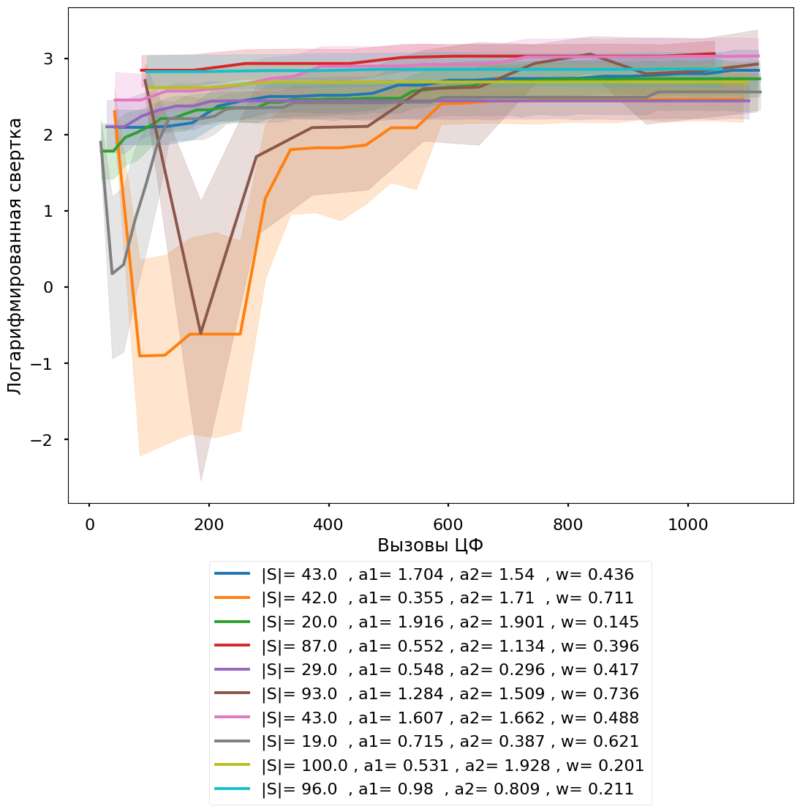
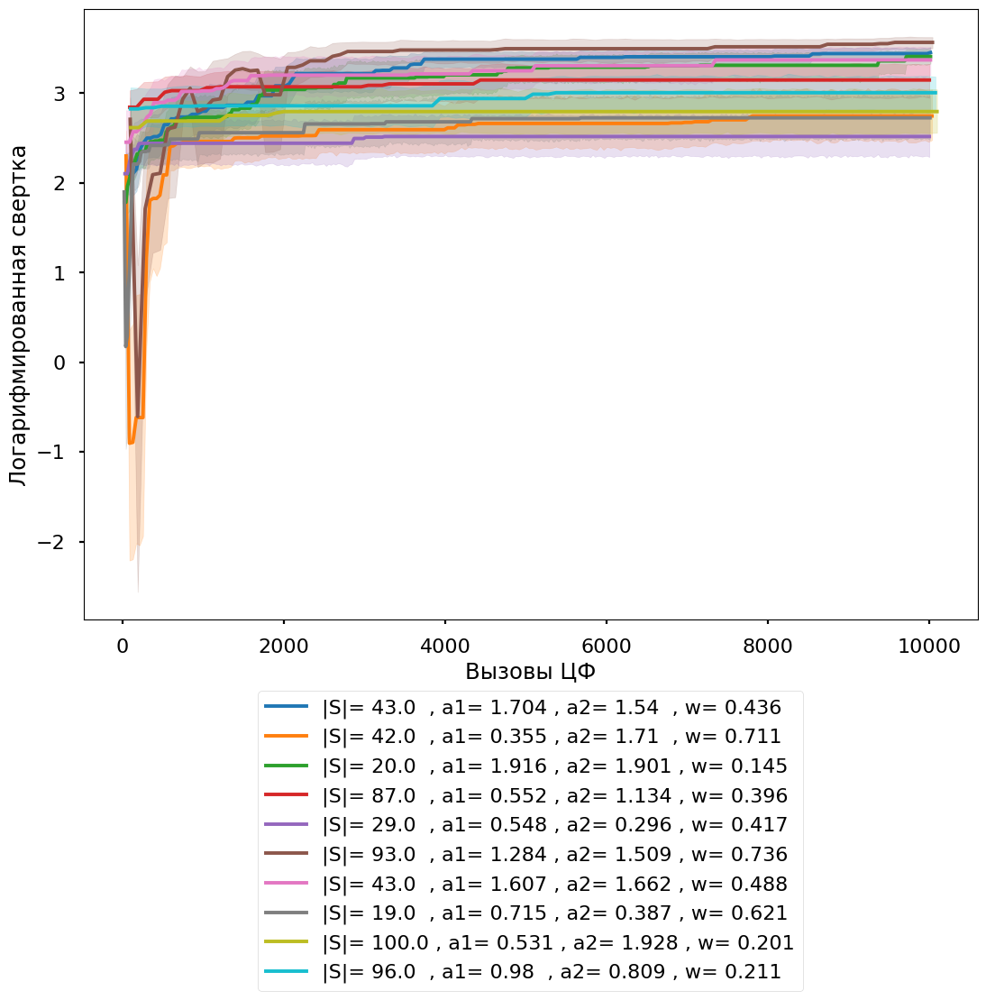

---
jupyter:
  accelerator: GPU
  colab:
    gpuType: T4
  kernelspec:
    display_name: Python 3
    name: python3
  language_info:
    codemirror_mode:
      name: ipython
      version: 3
    file_extension: .py
    mimetype: text/x-python
    name: python
    nbconvert_exporter: python
    pygments_lexer: ipython3
    version: 3.12.1
  nbformat: 4
  nbformat_minor: 0
---

::: {.cell .code execution_count="1" id="qZxJhqEE_tQ4"}
``` python
import random
import numpy as np
import pandas as pd
import networkx as nx
import seaborn as sns
import shapely
```
:::

::: {.cell .code execution_count="2" colab="{\"base_uri\":\"https://localhost:8080/\"}" id="D67luV1ZLBJd" outputId="33b295a3-5e7b-4651-e115-c9c25c66e61e"}
``` python
import matplotlib.pyplot as plt
plt.style.use('seaborn-poster')

import itertools
import copy
import os
import time

from dataclasses import dataclass
from functools import reduce
```

::: {.output .stream .stderr}
    <ipython-input-2-55945a2661b4>:2: MatplotlibDeprecationWarning: The seaborn styles shipped by Matplotlib are deprecated since 3.6, as they no longer correspond to the styles shipped by seaborn. However, they will remain available as 'seaborn-v0_8-<style>'. Alternatively, directly use the seaborn API instead.
      plt.style.use('seaborn-poster')
:::
:::

::: {.cell .code execution_count="3" colab="{\"base_uri\":\"https://localhost:8080/\"}" id="xfvvysfFrGmb" outputId="430f467b-3390-4764-d5bf-b84b56c97a8d"}
``` python
from google.colab import drive
drive.mount('/content/drive')
```

::: {.output .stream .stdout}
    Drive already mounted at /content/drive; to attempt to forcibly remount, call drive.mount("/content/drive", force_remount=True).
:::
:::

::: {.cell .code execution_count="4" id="Vvprju7vMnlq"}
``` python
CARD_SIZE = 100
NUMBER_UAVS = 100
NUMBER_TARGETS = 100
MAX_MODEL = 6

RANDOM_SEED = 1
random.seed(RANDOM_SEED)
np.random.seed(RANDOM_SEED)
```
:::

::: {.cell .code execution_count="5" id="MWpdBRa3o0a7"}
``` python
def log(x):
    return np.log(x) if x > 0 else -np.inf
```
:::

::: {.cell .code execution_count="6" id="ZT3r5tyVE6Y4"}
``` python
class Obj:
    min_x, max_x = x = (0, CARD_SIZE)
    min_y, max_y = y = (10, 20)
    min_z, max_z = z = (0, CARD_SIZE)

    def __init__(self, cord = None):
        if cord is None:
            self.set_random_cord()
        else:
            self.set_cord(cord)
        self.model = np.random.randint(0, MAX_MODEL)

    def set_random_cord(self):
        self.set_cord((np.random.randint(self.min_x, self.max_x), np.random.randint(self.min_y, self.max_y), np.random.randint(self.min_z, self.max_z)))

    def set_cord(self, cord):
        self.cord = cord

    def __str__(self):
        return f'''Координаты : {self.cord},\nМодель: {self.model}'''
```
:::

::: {.cell .code execution_count="7" id="Mkp9jgFqFzDy"}
``` python
class Target(Obj):
    id_iter = itertools.count()

    def __init__(self, cord = None):
        super().__init__(cord)
        self.numbear = next(self.id_iter)

    def __str__(self):
        return f'''Цель {self.numbear}\nКоординаты : {self.cord},\nМодель: {self.model}'''
```
:::

::: {.cell .code execution_count="8" id="MlxyWoxarByj"}
``` python
class UAV(Obj):
    id_iter = itertools.count()

    def __init__(self, cord = None, velocity = None):
        super().__init__(cord)
        self.numbear = next(self.id_iter)

        if velocity is None:
            self.v = np.random.randint(1, round(CARD_SIZE/3))
        else:
            self.v = velocity


    def __str__(self):
        return f'''UAV {self.numbear}\nКоординаты : {self.cord},\nМодель: {self.model}'''
```
:::

::: {.cell .code execution_count="9" colab="{\"base_uri\":\"https://localhost:8080/\"}" id="rqJpnYz75j1e" outputId="6361f9cb-f336-423a-844c-3c43f2c6d9bb"}
``` python
EFFECTIVENESS_INTERACTION = np.zeros((MAX_MODEL, MAX_MODEL))
for i in range(MAX_MODEL):
    for j  in range(MAX_MODEL):
        if i <= j:
            EFFECTIVENESS_INTERACTION[i, j] = 1 / abs( -i + j  + 2) ** 2
        elif i > j:
            EFFECTIVENESS_INTERACTION[i, j] = i - j + MAX_MODEL - 1

EFFECTIVENESS_INTERACTION
```

::: {.output .execute_result execution_count="9"}
    array([[ 0.25      ,  0.11111111,  0.0625    ,  0.04      ,  0.02777778,
             0.02040816],
           [ 6.        ,  0.25      ,  0.11111111,  0.0625    ,  0.04      ,
             0.02777778],
           [ 7.        ,  6.        ,  0.25      ,  0.11111111,  0.0625    ,
             0.04      ],
           [ 8.        ,  7.        ,  6.        ,  0.25      ,  0.11111111,
             0.0625    ],
           [ 9.        ,  8.        ,  7.        ,  6.        ,  0.25      ,
             0.11111111],
           [10.        ,  9.        ,  8.        ,  7.        ,  6.        ,
             0.25      ]])
:::
:::

::: {.cell .code execution_count="10" id="hKq69I7eQKVx"}
``` python
class MapArea:
    EFFECTIVENESS_INTERACTION = EFFECTIVENESS_INTERACTION
    def __init__(self, uavs = None, targets = None):
        if uavs is None:
            self.set_random_uavs()
        else:
            self.uavs = uavs

        if targets is None:
            self.set_random_targets()
        else:
            self.targets = targets

    def set_random_uavs(self):
        self.uavs = [UAV() for _ in range(NUMBER_UAVS)]

    def set_random_targets(self):
        self.targets = [Target() for _ in range(NUMBER_TARGETS)]
```
:::

::: {.cell .code execution_count="11" id="wYGcSGOCvi2r"}
``` python
def g1(solution, parameters):
    """
    Время достижения цели для БЛА

    """
    def distance(point1, point2):
        return np.sqrt(sum([(point2[i] - point1[i]) ** 2 for i in range(3)]))

    str_out = getattr(solution, 'str')
    index = parameters['index']
    t = np.zeros(NUMBER_UAVS)

    for i_uav, i_target in enumerate(solution.distribution):
        if i_uav in index:
            if i_target >= 0:
                t[i_uav] = distance(solution.MAP.uavs[i_uav].cord, solution.MAP.targets[i_target].cord) / solution.MAP.uavs[i_uav].v
    str_out += f't: {t}\n'
    setattr(solution, 'str', str_out)
    return max(t)

def g2(solution, parameters):
    """
    Произведение значений эффективности БЛА назначенных на определенные цели

    """
    str_out = getattr(solution, 'str')
    index = parameters['index']

    res = np.ones(NUMBER_TARGETS)
    for i_uav, i_target in enumerate(solution.distribution):
        if i_uav in index:
            if i_target >= 0:
                if res[i_target] == 1:
                    res[i_target] =  solution.MAP.EFFECTIVENESS_INTERACTION[solution.MAP.uavs[i_uav].model][solution.MAP.targets[i_target].model]

    str_out += f'score: {res}\n'
    setattr(solution, 'str', str_out)
    return np.prod(res)

def g3(solution, parameters):
    """
    Количество задействованных при этом БЛА

    """
    str_out = getattr(solution, 'str')
    index = parameters['index']
    str_out += f'Количесво задействоанных UAV: {sum([1 for i in index if solution.distribution[i] > -1])}\n'
    setattr(solution, 'str', str_out)
    return sum([1 for i in index if solution.distribution[i] > -1])
```
:::

::: {.cell .code execution_count="12" id="5wMNdGuYljhb"}
``` python
def f1(solution, parameters):
    """
    intersection_trajectories

    """
    def are_segments_intersecting(segment1, segment2):
        def orientation(p, q, r):
            val = (q[1] - p[1]) * (r[0] - q[0]) - (q[0] - p[0]) * (r[1] - q[1])
            if val == 0:
                return 0
            return 1 if val > 0 else 2

        def on_segment(p, q, r):
            if (q[0] <= max(p[0], r[0]) and q[0] >= min(p[0], r[0]) and
                    q[1] <= max(p[1], r[1]) and q[1] >= min(p[1], r[1])):
                return True
            return False

        p1, q1 = segment1
        p2, q2 = segment2

        o1 = orientation(p1, q1, p2)
        o2 = orientation(p1, q1, q2)
        o3 = orientation(p2, q2, p1)
        o4 = orientation(p2, q2, q1)

        if (o1 != o2 and o3 != o4) or \
                (o1 == 0 and on_segment(p1, p2, q1)) or \
                (o2 == 0 and on_segment(p1, q2, q1)) or \
                (o3 == 0 and on_segment(p2, p1, q2)) or \
                (o4 == 0 and on_segment(p2, q1, q2)):
            return True
        return False

    str_out = getattr(solution, 'str')
    index = parameters['index']
    segments = []
    for i_uav, i_target in enumerate(solution.distribution):
        if i_target >= 0:
            segments.append((solution.MAP.uavs[i_uav].cord, solution.MAP.targets[i_target].cord))

    flag = False
    for i in range(len(segments)):
        for j in range(i+1, len(segments)):
            flag = are_segments_intersecting(segments[i], segments[j])
            if flag:
                return flag

    setattr(solution, 'str', str_out)
    return not flag

def f2(solution, parameters):
    """


    """
    str_out = getattr(solution, 'str')
    index = parameters['index']

    f = {f'Цель {i} (Количестов нацеленных)':0 for i in range(NUMBER_TARGETS)}
    for i_uav, i_target in enumerate(solution.distribution):
        if i_uav in index:
            if i_target >= 0:
                f[f'Цель {i_target} (Количестов нацеленных)'] = f[f'Цель {i_target} (Количестов нацеленных)'] + 1

    str_out += f'Колисчесвто целей:{NUMBER_TARGETS}. Количесвто UAV:{NUMBER_UAVS}\nОграниечнеи выбор целей не > 1: {f}\n'
    setattr(solution, 'str', str_out)
    return sum([1 for i in range(NUMBER_TARGETS) if f[f'Цель {i} (Количестов нацеленных)'] > 1]) == 0
```
:::

::: {.cell .code execution_count="13" id="CPLJM_fc8q0m"}
``` python
CRITERIA = {
    'all/group':{
        'Время достижения цели для БЛА ' :[g1, 'min', {'index':[i for i in range(NUMBER_UAVS)]}],
        'произведение значений эффективности БЛА назначенных на определенные цели ' : [g2, 'max', {'index':[i for i in range(NUMBER_UAVS)]}],
        'Количество задействованных при этом БЛА  ' :[g3, 'min', {'index':[i for i in range(NUMBER_UAVS)]}],
    },
    'individual': {

    }
    # 'Название':[функция, 'min'/'max', [узлы на которые вещаем критерий]]
}

LIMITATIONS = {
    'all/group':{
        'Пересечение траекторий' :[f1, {'index':[i for i in range(NUMBER_UAVS)]}],
        'Выбор целей' :[f2, {'index':[i for i in range(NUMBER_UAVS)]}]
    },
    'individual': {
    }
    # 'Название':[функция, 'min'/'max', [узлы на которые вещаем критерий]]
}
```
:::

::: {.cell .code execution_count="14" id="l32jHmE-MGd5"}
``` python
class Solution:
    MAP = MapArea()
    _CRITERIA = CRITERIA
    _LIMITATIONS = LIMITATIONS

    def __init__(self, distribution = None):
        if distribution is None:
            self.set_random_distribution()
        else:
            self.set_distribution(distribution)

        self.velocity = np.random.uniform(-1, 1, NUMBER_UAVS)
        self.best_position = copy.deepcopy(self)
        self.best_score = float('inf')

    def update_velocity(self, global_best_position, omega, phi_p, phi_g):
        rp, rg = np.random.random(), np.random.random()
        self.velocity = (omega * self.velocity +
                            phi_p * rp * (self.best_position.distribution - self.distribution) +
                            phi_g * rg * (global_best_position.distribution - self.distribution))

    def set_random_distribution(self, CONST_DISTRIBUTION={}):
        self.set_distribution(np.random.randint(-1, NUMBER_TARGETS, size=NUMBER_UAVS))

    def set_distribution(self, distr):
        self.distribution = distr
        setattr(self, 'str', "")
        self.calculation_limitations()
        self.calculation_objective_function()

    def update_distribution(self):
        disrt = np.clip(np.round(self.distribution + self.velocity), -1, NUMBER_TARGETS-1).astype(int)
        self.set_distribution(disrt)

    def calculation_objective_function(self):
        # Считаем все критрии вида all/group для объекта
        convolution = 1
        for k, v in self._CRITERIA['all/group'].items():

            value = v[0](self, v[2])
            value = value if not value == 0 else 1

            setattr(self, k, value)
            if v[1] == "max":
                convolution *= value
            else:
                convolution *= 1/value

        # Считаем все критрии для объекта
        for k, v in self._CRITERIA['individual'].items():
            for index_m in v['index_node']:

                value = v['f'][0](self, index_m, v['f'][2])
                value = value if not value == 0 else 1

                setattr(self, k + ' m' + str(index_m), value)
                if v['f'][1] == "max":
                    convolution *=     value
                else:
                    convolution *= 1 / value

        setattr(self, 'Свертка', convolution if getattr(self, 'Выполнение ограничеий') > 0 else -1)

    def calculation_limitations(self):
        # Считаем все критрии вида all/group для объекта
        convolution = 1
        for k, v in self._LIMITATIONS['all/group'].items():
            value = v[0](self, v[1])
            setattr(self, k, value)
            convolution *= value

        # Считаем все критрии для объекта
        for k, v in self._LIMITATIONS['individual'].items():
            for index_m in v['index_node']:
                value = v['f'][0](self, index_m, v['f'][1])
                setattr(self, k + ' m' + str(index_m), value)
                convolution *=  value

        setattr(self, 'Выполнение ограничеий', convolution)

    def __str__(self):
        return f'''Cвертка : {getattr(self, 'Свертка')},\nРаспределение: {self.distribution}\n{getattr(self, 'str')}'''
```
:::

::: {.cell .code execution_count="15" id="peQ505qG_O9S"}
``` python
CARD_SIZE = 100
NUMBER_UAVS = 5
NUMBER_TARGETS = 5
MAX_MODEL = 6

RANDOM_SEED = 1
random.seed(RANDOM_SEED)
np.random.seed(RANDOM_SEED)

Solution.MAP = MapArea()
CRITERIA = {
    'all/group':{
        'Время достижения цели для БЛА ' :[g1, 'min', {'index':[i for i in range(NUMBER_UAVS)]}],
        'произведение значений эффективности БЛА назначенных на определенные цели ' : [g2, 'max', {'index':[i for i in range(NUMBER_UAVS)]}],
        'Количество задействованных при этом БЛА  ' :[g3, 'min', {'index':[i for i in range(NUMBER_UAVS)]}],
    },
    'individual': {

    }
    # 'Название':[функция, 'min'/'max', [узлы на которые вещаем критерий]]
}

LIMITATIONS = {
    'all/group':{
        'Пересечение траекторий' :[f1, {'index':[i for i in range(NUMBER_UAVS)]}],
        'Выбор целей' :[f2, {'index':[i for i in range(NUMBER_UAVS)]}]
    },
    'individual': {
    }
    # 'Название':[функция, 'min'/'max', [узлы на которые вещаем критерий]]
}

Solution._CRITERIA = CRITERIA
Solution._LIMITATIONS = LIMITATIONS

x = NUMBER_UAVS
# Путь к папке с файлами .csv
folder_path = f'/content/drive/MyDrive/data/{NUMBER_UAVS}x{NUMBER_TARGETS}/1/'
# Получение списка файлов в папке
file_list = [f for f in os.listdir(folder_path) if f.endswith('.csv')]

# Инициализация DataFrame для объединенных данных
combined_df = pd.DataFrame()

for file in file_list:
    file_path = os.path.join(folder_path, file)
    data = pd.read_csv(file_path)
    combined_df = pd.concat([combined_df, data])

# Сброс индексов для объединенного DataFrame
combined_df.reset_index(drop=True, inplace=True)
```
:::

::: {.cell .code execution_count="16" colab="{\"base_uri\":\"https://localhost:8080/\"}" id="_amD8WKwg7ie" outputId="f4ad9738-0cc5-4c37-daaa-bbebdeed5406"}
``` python
# Вывод объединенного DataFrame
plt.rcParams ['figure.figsize'] = [10, 7]
plt.style.use('seaborn-poster')
```

::: {.output .stream .stderr}
    <ipython-input-16-282670e14dc8>:3: MatplotlibDeprecationWarning: The seaborn styles shipped by Matplotlib are deprecated since 3.6, as they no longer correspond to the styles shipped by seaborn. However, they will remain available as 'seaborn-v0_8-<style>'. Alternatively, directly use the seaborn API instead.
      plt.style.use('seaborn-poster')
:::
:::

::: {.cell .code execution_count="17" colab="{\"base_uri\":\"https://localhost:8080/\",\"height\":1000}" id="po77fvaFf9td" outputId="cff93fa8-5087-48c7-c305-38a4d02dae0d"}
``` python
df1 = combined_df.copy()
df1 = df1[df1['Вызовы ЦФ'] <= 1125]
# df1 = df1[df1['c1_c2_w'].apply(lambda x: not(3< int(x.split('_')[0][2])>6))]
df1['Логарифмированная свертка'] = df1['Свертка'].apply(np.log)

df1['Параметры'] = df1['Коль-во частиц'].astype(str) + '_' + df1['c1_c2_w']
df1['Параметры'] = df1['Параметры'].apply(lambda x: "|S|= {:<6}, a1= {:<6}, a2= {:<6}, w= {}".format(*np.round([float(y) for y in x.split('_')], 3)))

sns.lineplot(x='Вызовы ЦФ',y='Логарифмированная свертка',data=df1, hue='Параметры')
plt.legend(loc='upper center', bbox_to_anchor=(0.5, -0.1))
plt.show()
```

::: {.output .display_data}

:::
:::

::: {.cell .code execution_count="18" colab="{\"base_uri\":\"https://localhost:8080/\",\"height\":1000}" id="mkaGhmZkgCC0" outputId="f4191c80-4530-44c0-a7a2-0ed74ab3dd59"}
``` python
df1 = combined_df.copy()
df1 = df1[df1['Вызовы ЦФ'] <= 10125]
# df1 = df1[df1['c1_c2_w'].apply(lambda x: not(3< int(x.split('_')[0][2])>6))]
df1['Логарифмированная свертка'] = df1['Свертка'].apply(np.log)

df1['Параметры'] = df1['Коль-во частиц'].astype(str) + '_' + df1['c1_c2_w']
df1['Параметры'] = df1['Параметры'].apply(lambda x: "|S|= {:<6}, a1= {:<6}, a2= {:<6}, w= {}".format(*np.round([float(y) for y in x.split('_')], 3)))

sns.lineplot(x='Вызовы ЦФ',y='Логарифмированная свертка',data=df1, hue='Параметры')
plt.legend(loc='upper center', bbox_to_anchor=(0.5, -0.1))
plt.show()
```

::: {.output .display_data}

:::
:::

::: {.cell .code execution_count="19" colab="{\"base_uri\":\"https://localhost:8080/\"}" id="ceu3N_fBf6bG" outputId="461c34a1-e1ce-422c-8476-554bfdcad585"}
``` python
arr = [0, 1000, 10000]

for n in arr:
    # Функция для расчета доверительного интервала
    def confidence_interval(data):
        mean = np.mean(data)
        std_err = np.std(data, ddof=1) / np.sqrt(len(data))
        margin_of_error = 1.96 * std_err  # Для 95% доверительного интервала
        return (mean - margin_of_error, mean + margin_of_error)

    # Расчет доверительных интервалов для каждой группы
    print(f'Расчет доверительных интервалов для каждой группы')
    confidence_intervals = df1[(df1['Вызовы ЦФ'] >= n-50) & (df1['Вызовы ЦФ']<= n+50)].groupby('Параметры')['Свертка'].apply(confidence_interval)
    print(confidence_intervals)

    print(f'MIN')
    confidence_intervals = df1[(df1['Вызовы ЦФ'] >= n-50) & (df1['Вызовы ЦФ']<= n+50)].groupby('Параметры')['Свертка'].min()
    print(confidence_intervals)

    confidence_intervals = df1.loc[df1[(df1['Вызовы ЦФ'] >= n-50) & (df1['Вызовы ЦФ']<= n+50)].groupby('Параметры')['Свертка'].idxmin()]
    for index, row in confidence_intervals.iterrows():
        print(index)
        s = Solution(list(np.array([int(x) for x in row['Распределение'].strip('[]').split()])) )
        print(s)

    print(f'MAX')
    confidence_intervals = df1[(df1['Вызовы ЦФ'] >= n-50) & (df1['Вызовы ЦФ']<= n+50)].groupby('Параметры')['Свертка'].max()
    print(confidence_intervals)

    confidence_intervals = df1.loc[df1[(df1['Вызовы ЦФ'] >= n-50) & (df1['Вызовы ЦФ']<= n+50)].groupby('Параметры')['Свертка'].idxmax()]
    print(confidence_intervals)

    for index, row in confidence_intervals.iterrows ():
        print()
        s = Solution( list(np.array([int(x) for x in row['Распределение'].strip('[]').split()])) )
        print(s)
```

::: {.output .stream .stdout}
    Расчет доверительных интервалов для каждой группы
    Параметры
    |S|= 19.0  , a1= 0.715 , a2= 0.387 , w= 0.621      (4.534984969177359, 8.591371929295118)
    |S|= 20.0  , a1= 1.916 , a2= 1.901 , w= 0.145     (5.955294233005493, 10.958660906077291)
    |S|= 29.0  , a1= 0.548 , a2= 0.296 , w= 0.417     (6.841221928871873, 15.636220373661383)
    |S|= 42.0  , a1= 0.355 , a2= 1.71  , w= 0.711     (8.378587408051143, 16.629934362627054)
    |S|= 43.0  , a1= 1.607 , a2= 1.662 , w= 0.488     (10.438596742938895, 20.76974291063247)
    |S|= 43.0  , a1= 1.704 , a2= 1.54  , w= 0.436    (6.7561418893700775, 12.218161225177283)
    Name: Свертка, dtype: object
    MIN
    Параметры
    |S|= 19.0  , a1= 0.715 , a2= 0.387 , w= 0.621    0.000000
    |S|= 20.0  , a1= 1.916 , a2= 1.901 , w= 0.145    1.000000
    |S|= 29.0  , a1= 0.548 , a2= 0.296 , w= 0.417    2.345208
    |S|= 42.0  , a1= 0.355 , a2= 1.71  , w= 0.711    2.818657
    |S|= 43.0  , a1= 1.607 , a2= 1.662 , w= 0.488    2.117751
    |S|= 43.0  , a1= 1.704 , a2= 1.54  , w= 0.436    2.818657
    Name: Свертка, dtype: float64
    36535
    Cвертка : -1,
    Распределение: [0, -1, 3, 0, 2]
    Колисчесвто целей:5. Количесвто UAV:5
    Ограниечнеи выбор целей не > 1: {'Цель 0 (Количестов нацеленных)': 2, 'Цель 1 (Количестов нацеленных)': 0, 'Цель 2 (Количестов нацеленных)': 1, 'Цель 3 (Количестов нацеленных)': 1, 'Цель 4 (Количестов нацеленных)': 0}
    t: [16.02255355  0.          0.99317398  9.71366933  3.75729743]
    score: [0.0625 1.     6.     7.     1.    ]
    Количесво задействоанных UAV: 4

    17456
    Cвертка : 1.0,
    Распределение: [-1, -1, -1, -1, -1]
    Колисчесвто целей:5. Количесвто UAV:5
    Ограниечнеи выбор целей не > 1: {'Цель 0 (Количестов нацеленных)': 0, 'Цель 1 (Количестов нацеленных)': 0, 'Цель 2 (Количестов нацеленных)': 0, 'Цель 3 (Количестов нацеленных)': 0, 'Цель 4 (Количестов нацеленных)': 0}
    t: [0. 0. 0. 0. 0.]
    score: [1. 1. 1. 1. 1.]
    Количесво задействоанных UAV: 0

    23830
    Cвертка : 2.345207879911715,
    Распределение: [-1, -1, -1, 3, -1]
    Колисчесвто целей:5. Количесвто UAV:5
    Ограниечнеи выбор целей не > 1: {'Цель 0 (Количестов нацеленных)': 0, 'Цель 1 (Количестов нацеленных)': 0, 'Цель 2 (Количестов нацеленных)': 0, 'Цель 3 (Количестов нацеленных)': 1, 'Цель 4 (Количестов нацеленных)': 0}
    t: [0.         0.         0.         3.83761289 0.        ]
    score: [1. 1. 1. 9. 1.]
    Количесво задействоанных UAV: 1

    4660
    Cвертка : 2.8186570536705764,
    Распределение: [2, -1, -1, -1, -1]
    Колисчесвто целей:5. Количесвто UAV:5
    Ограниечнеи выбор целей не > 1: {'Цель 0 (Количестов нацеленных)': 0, 'Цель 1 (Количестов нацеленных)': 0, 'Цель 2 (Количестов нацеленных)': 1, 'Цель 3 (Количестов нацеленных)': 0, 'Цель 4 (Количестов нацеленных)': 0}
    t: [2.83823106 0.         0.         0.         0.        ]
    score: [1. 1. 8. 1. 1.]
    Количесво задействоанных UAV: 1

    33150
    Cвертка : 2.1177514979239547,
    Распределение: [-1, -1, -1, 4, -1]
    Колисчесвто целей:5. Количесвто UAV:5
    Ограниечнеи выбор целей не > 1: {'Цель 0 (Количестов нацеленных)': 0, 'Цель 1 (Количестов нацеленных)': 0, 'Цель 2 (Количестов нацеленных)': 0, 'Цель 3 (Количестов нацеленных)': 0, 'Цель 4 (Количестов нацеленных)': 1}
    t: [0.         0.         0.         3.30539254 0.        ]
    score: [1. 1. 1. 1. 7.]
    Количесво задействоанных UAV: 1

    233
    Cвертка : 2.8186570536705764,
    Распределение: [2, -1, -1, -1, -1]
    Колисчесвто целей:5. Количесвто UAV:5
    Ограниечнеи выбор целей не > 1: {'Цель 0 (Количестов нацеленных)': 0, 'Цель 1 (Количестов нацеленных)': 0, 'Цель 2 (Количестов нацеленных)': 1, 'Цель 3 (Количестов нацеленных)': 0, 'Цель 4 (Количестов нацеленных)': 0}
    t: [2.83823106 0.         0.         0.         0.        ]
    score: [1. 1. 8. 1. 1.]
    Количесво задействоанных UAV: 1

    MAX
    Параметры
    |S|= 19.0  , a1= 0.715 , a2= 0.387 , w= 0.621    26.082577
    |S|= 20.0  , a1= 1.916 , a2= 1.901 , w= 0.145    32.581928
    |S|= 29.0  , a1= 0.548 , a2= 0.296 , w= 0.417    33.884024
    |S|= 42.0  , a1= 0.355 , a2= 1.71  , w= 0.711    32.581928
    |S|= 43.0  , a1= 1.607 , a2= 1.662 , w= 0.488    39.531361
    |S|= 43.0  , a1= 1.704 , a2= 1.54  , w= 0.436    27.927367
    Name: Свертка, dtype: float64
           Коль-во частиц  MAX Количесво итераций  \
    41277              19                     526   
    18959              20                     500   
    25900              29                     344   
    5616               42                     238   
    34315              43                     232   
    4427               43                     232   

                                                     c1_c2_w  № эксперемента  \
    41277  0.7152822531830084_0.3866134304565536_0.620747...              12   
    18959  1.9164651165895739_1.900872225412764_0.1452410...              20   
    25900  0.5484913705011256_0.29601546503836_0.41684659...              13   
    5616   0.35529206381356226_1.7101241001807421_0.71101...               5   
    34315  1.6073461591471596_1.6617126804074809_0.488027...              16   
    4427   1.7044015178975915_1.5401133655865746_0.436457...              20   

                  Время  Вызовы ЦФ    Свертка     Распределение  \
    41277  9.536743e-07         19  26.082577  [-1 -1  3  4  2]   
    18959  4.768372e-07         20  32.581928  [ 3 -1  2  4 -1]   
    25900  7.152557e-07         29  33.884024  [ 2  3 -1  4 -1]   
    5616   1.192093e-06         42  32.581928  [ 3 -1  2  4 -1]   
    34315  9.536743e-07         43  39.531361  [ 2 -1  3  4 -1]   
    4427   7.152557e-07         43  27.927367  [ 3 -1 -1  4  2]   

           Логарифмированная свертка  \
    41277                   3.261268   
    18959                   3.483758   
    25900                   3.522944   
    5616                    3.483758   
    34315                   3.677094   
    4427                    3.329607   

                                               Параметры  
    41277  |S|= 19.0  , a1= 0.715 , a2= 0.387 , w= 0.621  
    18959  |S|= 20.0  , a1= 1.916 , a2= 1.901 , w= 0.145  
    25900  |S|= 29.0  , a1= 0.548 , a2= 0.296 , w= 0.417  
    5616   |S|= 42.0  , a1= 0.355 , a2= 1.71  , w= 0.711  
    34315  |S|= 43.0  , a1= 1.607 , a2= 1.662 , w= 0.488  
    4427   |S|= 43.0  , a1= 1.704 , a2= 1.54  , w= 0.436  

    Cвертка : 26.082577149942157,
    Распределение: [-1, -1, 3, 4, 2]
    Колисчесвто целей:5. Количесвто UAV:5
    Ограниечнеи выбор целей не > 1: {'Цель 0 (Количестов нацеленных)': 0, 'Цель 1 (Количестов нацеленных)': 0, 'Цель 2 (Количестов нацеленных)': 1, 'Цель 3 (Количестов нацеленных)': 1, 'Цель 4 (Количестов нацеленных)': 1}
    t: [0.         0.         0.99317398 3.30539254 3.75729743]
    score: [1. 1. 6. 7. 7.]
    Количесво задействоанных UAV: 3


    Cвертка : 32.58192808899659,
    Распределение: [3, -1, 2, 4, -1]
    Колисчесвто целей:5. Количесвто UAV:5
    Ограниечнеи выбор целей не > 1: {'Цель 0 (Количестов нацеленных)': 0, 'Цель 1 (Количестов нацеленных)': 0, 'Цель 2 (Количестов нацеленных)': 1, 'Цель 3 (Количестов нацеленных)': 1, 'Цель 4 (Количестов нацеленных)': 1}
    t: [4.01040314 0.         2.60210973 3.30539254 0.        ]
    score: [1. 1. 7. 8. 7.]
    Количесво задействоанных UAV: 3


    Cвертка : 33.884023966783275,
    Распределение: [2, 3, -1, 4, -1]
    Колисчесвто целей:5. Количесвто UAV:5
    Ограниечнеи выбор целей не > 1: {'Цель 0 (Количестов нацеленных)': 0, 'Цель 1 (Количестов нацеленных)': 0, 'Цель 2 (Количестов нацеленных)': 1, 'Цель 3 (Количестов нацеленных)': 1, 'Цель 4 (Количестов нацеленных)': 1}
    t: [2.83823106 1.58767442 0.         3.30539254 0.        ]
    score: [1. 1. 8. 6. 7.]
    Количесво задействоанных UAV: 3


    Cвертка : 32.58192808899659,
    Распределение: [3, -1, 2, 4, -1]
    Колисчесвто целей:5. Количесвто UAV:5
    Ограниечнеи выбор целей не > 1: {'Цель 0 (Количестов нацеленных)': 0, 'Цель 1 (Количестов нацеленных)': 0, 'Цель 2 (Количестов нацеленных)': 1, 'Цель 3 (Количестов нацеленных)': 1, 'Цель 4 (Количестов нацеленных)': 1}
    t: [4.01040314 0.         2.60210973 3.30539254 0.        ]
    score: [1. 1. 7. 8. 7.]
    Количесво задействоанных UAV: 3


    Cвертка : 39.531361294580485,
    Распределение: [2, -1, 3, 4, -1]
    Колисчесвто целей:5. Количесвто UAV:5
    Ограниечнеи выбор целей не > 1: {'Цель 0 (Количестов нацеленных)': 0, 'Цель 1 (Количестов нацеленных)': 0, 'Цель 2 (Количестов нацеленных)': 1, 'Цель 3 (Количестов нацеленных)': 1, 'Цель 4 (Количестов нацеленных)': 1}
    t: [2.83823106 0.         0.99317398 3.30539254 0.        ]
    score: [1. 1. 8. 7. 7.]
    Количесво задействоанных UAV: 3


    Cвертка : 27.927366933425652,
    Распределение: [3, -1, -1, 4, 2]
    Колисчесвто целей:5. Количесвто UAV:5
    Ограниечнеи выбор целей не > 1: {'Цель 0 (Количестов нацеленных)': 0, 'Цель 1 (Количестов нацеленных)': 0, 'Цель 2 (Количестов нацеленных)': 1, 'Цель 3 (Количестов нацеленных)': 1, 'Цель 4 (Количестов нацеленных)': 1}
    t: [4.01040314 0.         0.         3.30539254 3.75729743]
    score: [1. 1. 6. 8. 7.]
    Количесво задействоанных UAV: 3

    Расчет доверительных интервалов для каждой группы
    Параметры
    |S|= 100.0 , a1= 0.531 , a2= 1.928 , w= 0.201     (12.712375394676162, 21.43584631273254)
    |S|= 19.0  , a1= 0.715 , a2= 0.387 , w= 0.621    (13.633453495971441, 16.830546862151515)
    |S|= 20.0  , a1= 1.916 , a2= 1.901 , w= 0.145    (15.797845557524848, 19.647928487943798)
    |S|= 29.0  , a1= 0.548 , a2= 0.296 , w= 0.417    (11.751200292748564, 15.696617891522852)
    |S|= 42.0  , a1= 0.355 , a2= 1.71  , w= 0.711     (12.088204902883163, 17.96999332451181)
    |S|= 43.0  , a1= 1.607 , a2= 1.662 , w= 0.488      (20.31260193633844, 27.42013921170409)
    |S|= 43.0  , a1= 1.704 , a2= 1.54  , w= 0.436     (15.942612564172723, 22.14129782234767)
    |S|= 87.0  , a1= 0.552 , a2= 1.134 , w= 0.396     (20.17299344957439, 24.891924037898423)
    |S|= 93.0  , a1= 1.284 , a2= 1.509 , w= 0.736     (18.254442795302264, 28.88254567008332)
    |S|= 96.0  , a1= 0.98  , a2= 0.809 , w= 0.211     (15.646374673033982, 23.76836682902764)
    Name: Свертка, dtype: object
    MIN
    Параметры
    |S|= 100.0 , a1= 0.531 , a2= 1.928 , w= 0.201    8.070374
    |S|= 19.0  , a1= 0.715 , a2= 0.387 , w= 0.621    5.589124
    |S|= 20.0  , a1= 1.916 , a2= 1.901 , w= 0.145    8.337304
    |S|= 29.0  , a1= 0.548 , a2= 0.296 , w= 0.417    5.232808
    |S|= 42.0  , a1= 0.355 , a2= 1.71  , w= 0.711    2.818657
    |S|= 43.0  , a1= 1.607 , a2= 1.662 , w= 0.488    8.070374
    |S|= 43.0  , a1= 1.704 , a2= 1.54  , w= 0.436    7.048111
    |S|= 87.0  , a1= 0.552 , a2= 1.134 , w= 0.396    9.552941
    |S|= 93.0  , a1= 1.284 , a2= 1.509 , w= 0.736    0.122099
    |S|= 96.0  , a1= 0.98  , a2= 0.809 , w= 0.211    8.070374
    Name: Свертка, dtype: float64
    47746
    Cвертка : 8.070374489900315,
    Распределение: [-1, 3, 2, -1, -1]
    Колисчесвто целей:5. Количесвто UAV:5
    Ограниечнеи выбор целей не > 1: {'Цель 0 (Количестов нацеленных)': 0, 'Цель 1 (Количестов нацеленных)': 0, 'Цель 2 (Количестов нацеленных)': 1, 'Цель 3 (Количестов нацеленных)': 1, 'Цель 4 (Количестов нацеленных)': 0}
    t: [0.         1.58767442 2.60210973 0.         0.        ]
    score: [1. 1. 7. 6. 1.]
    Количесво задействоанных UAV: 2

    36583
    Cвертка : 5.589123674987605,
    Распределение: [-1, -1, 3, -1, 2]
    Колисчесвто целей:5. Количесвто UAV:5
    Ограниечнеи выбор целей не > 1: {'Цель 0 (Количестов нацеленных)': 0, 'Цель 1 (Количестов нацеленных)': 0, 'Цель 2 (Количестов нацеленных)': 1, 'Цель 3 (Количестов нацеленных)': 1, 'Цель 4 (Количестов нацеленных)': 0}
    t: [0.         0.         0.99317398 0.         3.75729743]
    score: [1. 1. 6. 7. 1.]
    Количесво задействоанных UAV: 2

    13495
    Cвертка : 8.337304018558537,
    Распределение: [-1, -1, -1, 2, -1]
    Колисчесвто целей:5. Количесвто UAV:5
    Ограниечнеи выбор целей не > 1: {'Цель 0 (Количестов нацеленных)': 0, 'Цель 1 (Количестов нацеленных)': 0, 'Цель 2 (Количестов нацеленных)': 1, 'Цель 3 (Количестов нацеленных)': 0, 'Цель 4 (Количестов нацеленных)': 0}
    t: [0.         0.         0.         1.07948564 0.        ]
    score: [1. 1. 9. 1. 1.]
    Количесво задействоанных UAV: 1

    21792
    Cвертка : 5.232807896436928,
    Распределение: [3, 2, -1, -1, -1]
    Колисчесвто целей:5. Количесвто UAV:5
    Ограниечнеи выбор целей не > 1: {'Цель 0 (Количестов нацеленных)': 0, 'Цель 1 (Количестов нацеленных)': 0, 'Цель 2 (Количестов нацеленных)': 1, 'Цель 3 (Количестов нацеленных)': 1, 'Цель 4 (Количестов нацеленных)': 0}
    t: [4.01040314 4.58644775 0.         0.         0.        ]
    score: [1. 1. 6. 8. 1.]
    Количесво задействоанных UAV: 2

    4682
    Cвертка : 2.8186570536705764,
    Распределение: [2, -1, -1, -1, -1]
    Колисчесвто целей:5. Количесвто UAV:5
    Ограниечнеи выбор целей не > 1: {'Цель 0 (Количестов нацеленных)': 0, 'Цель 1 (Количестов нацеленных)': 0, 'Цель 2 (Количестов нацеленных)': 1, 'Цель 3 (Количестов нацеленных)': 0, 'Цель 4 (Количестов нацеленных)': 0}
    t: [2.83823106 0.         0.         0.         0.        ]
    score: [1. 1. 8. 1. 1.]
    Количесво задействоанных UAV: 1

    31308
    Cвертка : 8.070374489900315,
    Распределение: [-1, 3, 2, -1, -1]
    Колисчесвто целей:5. Количесвто UAV:5
    Ограниечнеи выбор целей не > 1: {'Цель 0 (Количестов нацеленных)': 0, 'Цель 1 (Количестов нацеленных)': 0, 'Цель 2 (Количестов нацеленных)': 1, 'Цель 3 (Количестов нацеленных)': 1, 'Цель 4 (Количестов нацеленных)': 0}
    t: [0.         1.58767442 2.60210973 0.         0.        ]
    score: [1. 1. 7. 6. 1.]
    Количесво задействоанных UAV: 2

    721
    Cвертка : 7.048110531835147,
    Распределение: [-1, -1, 3, -1, -1]
    Колисчесвто целей:5. Количесвто UAV:5
    Ограниечнеи выбор целей не > 1: {'Цель 0 (Количестов нацеленных)': 0, 'Цель 1 (Количестов нацеленных)': 0, 'Цель 2 (Количестов нацеленных)': 0, 'Цель 3 (Количестов нацеленных)': 1, 'Цель 4 (Количестов нацеленных)': 0}
    t: [0.         0.         0.99317398 0.         0.        ]
    score: [1. 1. 1. 7. 1.]
    Количесво задействоанных UAV: 1

    20620
    Cвертка : 9.552940893075885,
    Распределение: [4, 2, -1, -1, 3]
    Колисчесвто целей:5. Количесвто UAV:5
    Ограниечнеи выбор целей не > 1: {'Цель 0 (Количестов нацеленных)': 0, 'Цель 1 (Количестов нацеленных)': 0, 'Цель 2 (Количестов нацеленных)': 1, 'Цель 3 (Количестов нацеленных)': 1, 'Цель 4 (Количестов нацеленных)': 1}
    t: [7.53694604 4.58644775 0.         0.         3.77818625]
    score: [1. 1. 6. 6. 6.]
    Количесво задействоанных UAV: 3

    30506
    Cвертка : 0.12209885091686164,
    Распределение: [-1, 2, 1, 4, -1]
    Колисчесвто целей:5. Количесвто UAV:5
    Ограниечнеи выбор целей не > 1: {'Цель 0 (Количестов нацеленных)': 0, 'Цель 1 (Количестов нацеленных)': 1, 'Цель 2 (Количестов нацеленных)': 1, 'Цель 3 (Количестов нацеленных)': 0, 'Цель 4 (Количестов нацеленных)': 1}
    t: [0.         4.58644775 3.46311959 3.30539254 0.        ]
    score: [1.   0.04 6.   1.   7.  ]
    Количесво задействоанных UAV: 3

    48364
    Cвертка : 8.070374489900315,
    Распределение: [-1, 3, 2, -1, -1]
    Колисчесвто целей:5. Количесвто UAV:5
    Ограниечнеи выбор целей не > 1: {'Цель 0 (Количестов нацеленных)': 0, 'Цель 1 (Количестов нацеленных)': 0, 'Цель 2 (Количестов нацеленных)': 1, 'Цель 3 (Количестов нацеленных)': 1, 'Цель 4 (Количестов нацеленных)': 0}
    t: [0.         1.58767442 2.60210973 0.         0.        ]
    score: [1. 1. 7. 6. 1.]
    Количесво задействоанных UAV: 2

    MAX
    Параметры
    |S|= 100.0 , a1= 0.531 , a2= 1.928 , w= 0.201    39.531361
    |S|= 19.0  , a1= 0.715 , a2= 0.387 , w= 0.621    29.180564
    |S|= 20.0  , a1= 1.916 , a2= 1.901 , w= 0.145    39.531361
    |S|= 29.0  , a1= 0.548 , a2= 0.296 , w= 0.417    33.884024
    |S|= 42.0  , a1= 0.355 , a2= 1.71  , w= 0.711    39.531361
    |S|= 43.0  , a1= 1.607 , a2= 1.662 , w= 0.488    39.531361
    |S|= 43.0  , a1= 1.704 , a2= 1.54  , w= 0.436    39.531361
    |S|= 87.0  , a1= 0.552 , a2= 1.134 , w= 0.396    32.581928
    |S|= 93.0  , a1= 1.284 , a2= 1.509 , w= 0.736    39.531361
    |S|= 96.0  , a1= 0.98  , a2= 0.809 , w= 0.211    33.884024
    Name: Свертка, dtype: float64
           Коль-во частиц  MAX Количесво итераций  \
    46029             100                     100   
    37637              19                     526   
    19006              20                     500   
    25932              29                     344   
    5638               42                     238   
    33638              43                     232   
    2585               43                     232   
    21426              87                     114   
    28670              93                     107   
    49414              96                     104   

                                                     c1_c2_w  № эксперемента  \
    46029  0.5307411328239927_1.9283605680853273_0.201064...               1   
    37637  0.7152822531830084_0.3866134304565536_0.620747...               5   
    19006  1.9164651165895739_1.900872225412764_0.1452410...              20   
    25932  0.5484913705011256_0.29601546503836_0.41684659...              13   
    5638   0.35529206381356226_1.7101241001807421_0.71101...               5   
    33638  1.6073461591471596_1.6617126804074809_0.488027...              13   
    2585   1.7044015178975915_1.5401133655865746_0.436457...              12   
    21426  0.5521327914745936_1.1340355280623087_0.395964...              18   
    28670  1.2835132202904338_1.5093952795953858_0.736154...               1   
    49414  0.9797139798485407_0.8092926696505798_0.210831...              14   

              Время  Вызовы ЦФ    Свертка     Распределение  \
    46029  0.420635       1000  39.531361  [ 2 -1  3  4 -1]   
    37637  0.359120        950  29.180564  [-1 -1  3  2 -1]   
    19006  0.359641        960  39.531361  [ 2 -1  3  4 -1]   
    25932  0.359000        957  33.884024  [ 2  3 -1  4 -1]   
    5638   0.550382        966  39.531361  [ 2 -1  3  4 -1]   
    33638  0.572451        989  39.531361  [ 2 -1  3  4 -1]   
    2585   0.565814        989  39.531361  [ 2 -1  3  4 -1]   
    21426  0.567118       1044  32.581928  [ 3 -1  2  4 -1]   
    28670  0.416498       1023  39.531361  [ 2 -1  3  4 -1]   
    49414  0.556129        960  33.884024  [ 2  3 -1  4 -1]   

           Логарифмированная свертка  \
    46029                   3.677094   
    37637                   3.373503   
    19006                   3.677094   
    25932                   3.522944   
    5638                    3.677094   
    33638                   3.677094   
    2585                    3.677094   
    21426                   3.483758   
    28670                   3.677094   
    49414                   3.522944   

                                               Параметры  
    46029  |S|= 100.0 , a1= 0.531 , a2= 1.928 , w= 0.201  
    37637  |S|= 19.0  , a1= 0.715 , a2= 0.387 , w= 0.621  
    19006  |S|= 20.0  , a1= 1.916 , a2= 1.901 , w= 0.145  
    25932  |S|= 29.0  , a1= 0.548 , a2= 0.296 , w= 0.417  
    5638   |S|= 42.0  , a1= 0.355 , a2= 1.71  , w= 0.711  
    33638  |S|= 43.0  , a1= 1.607 , a2= 1.662 , w= 0.488  
    2585   |S|= 43.0  , a1= 1.704 , a2= 1.54  , w= 0.436  
    21426  |S|= 87.0  , a1= 0.552 , a2= 1.134 , w= 0.396  
    28670  |S|= 93.0  , a1= 1.284 , a2= 1.509 , w= 0.736  
    49414  |S|= 96.0  , a1= 0.98  , a2= 0.809 , w= 0.211  

    Cвертка : 39.531361294580485,
    Распределение: [2, -1, 3, 4, -1]
    Колисчесвто целей:5. Количесвто UAV:5
    Ограниечнеи выбор целей не > 1: {'Цель 0 (Количестов нацеленных)': 0, 'Цель 1 (Количестов нацеленных)': 0, 'Цель 2 (Количестов нацеленных)': 1, 'Цель 3 (Количестов нацеленных)': 1, 'Цель 4 (Количестов нацеленных)': 1}
    t: [2.83823106 0.         0.99317398 3.30539254 0.        ]
    score: [1. 1. 8. 7. 7.]
    Количесво задействоанных UAV: 3


    Cвертка : 29.180564064954883,
    Распределение: [-1, -1, 3, 2, -1]
    Колисчесвто целей:5. Количесвто UAV:5
    Ограниечнеи выбор целей не > 1: {'Цель 0 (Количестов нацеленных)': 0, 'Цель 1 (Количестов нацеленных)': 0, 'Цель 2 (Количестов нацеленных)': 1, 'Цель 3 (Количестов нацеленных)': 1, 'Цель 4 (Количестов нацеленных)': 0}
    t: [0.         0.         0.99317398 1.07948564 0.        ]
    score: [1. 1. 9. 7. 1.]
    Количесво задействоанных UAV: 2


    Cвертка : 39.531361294580485,
    Распределение: [2, -1, 3, 4, -1]
    Колисчесвто целей:5. Количесвто UAV:5
    Ограниечнеи выбор целей не > 1: {'Цель 0 (Количестов нацеленных)': 0, 'Цель 1 (Количестов нацеленных)': 0, 'Цель 2 (Количестов нацеленных)': 1, 'Цель 3 (Количестов нацеленных)': 1, 'Цель 4 (Количестов нацеленных)': 1}
    t: [2.83823106 0.         0.99317398 3.30539254 0.        ]
    score: [1. 1. 8. 7. 7.]
    Количесво задействоанных UAV: 3


    Cвертка : 33.884023966783275,
    Распределение: [2, 3, -1, 4, -1]
    Колисчесвто целей:5. Количесвто UAV:5
    Ограниечнеи выбор целей не > 1: {'Цель 0 (Количестов нацеленных)': 0, 'Цель 1 (Количестов нацеленных)': 0, 'Цель 2 (Количестов нацеленных)': 1, 'Цель 3 (Количестов нацеленных)': 1, 'Цель 4 (Количестов нацеленных)': 1}
    t: [2.83823106 1.58767442 0.         3.30539254 0.        ]
    score: [1. 1. 8. 6. 7.]
    Количесво задействоанных UAV: 3


    Cвертка : 39.531361294580485,
    Распределение: [2, -1, 3, 4, -1]
    Колисчесвто целей:5. Количесвто UAV:5
    Ограниечнеи выбор целей не > 1: {'Цель 0 (Количестов нацеленных)': 0, 'Цель 1 (Количестов нацеленных)': 0, 'Цель 2 (Количестов нацеленных)': 1, 'Цель 3 (Количестов нацеленных)': 1, 'Цель 4 (Количестов нацеленных)': 1}
    t: [2.83823106 0.         0.99317398 3.30539254 0.        ]
    score: [1. 1. 8. 7. 7.]
    Количесво задействоанных UAV: 3


    Cвертка : 39.531361294580485,
    Распределение: [2, -1, 3, 4, -1]
    Колисчесвто целей:5. Количесвто UAV:5
    Ограниечнеи выбор целей не > 1: {'Цель 0 (Количестов нацеленных)': 0, 'Цель 1 (Количестов нацеленных)': 0, 'Цель 2 (Количестов нацеленных)': 1, 'Цель 3 (Количестов нацеленных)': 1, 'Цель 4 (Количестов нацеленных)': 1}
    t: [2.83823106 0.         0.99317398 3.30539254 0.        ]
    score: [1. 1. 8. 7. 7.]
    Количесво задействоанных UAV: 3


    Cвертка : 39.531361294580485,
    Распределение: [2, -1, 3, 4, -1]
    Колисчесвто целей:5. Количесвто UAV:5
    Ограниечнеи выбор целей не > 1: {'Цель 0 (Количестов нацеленных)': 0, 'Цель 1 (Количестов нацеленных)': 0, 'Цель 2 (Количестов нацеленных)': 1, 'Цель 3 (Количестов нацеленных)': 1, 'Цель 4 (Количестов нацеленных)': 1}
    t: [2.83823106 0.         0.99317398 3.30539254 0.        ]
    score: [1. 1. 8. 7. 7.]
    Количесво задействоанных UAV: 3


    Cвертка : 32.58192808899659,
    Распределение: [3, -1, 2, 4, -1]
    Колисчесвто целей:5. Количесвто UAV:5
    Ограниечнеи выбор целей не > 1: {'Цель 0 (Количестов нацеленных)': 0, 'Цель 1 (Количестов нацеленных)': 0, 'Цель 2 (Количестов нацеленных)': 1, 'Цель 3 (Количестов нацеленных)': 1, 'Цель 4 (Количестов нацеленных)': 1}
    t: [4.01040314 0.         2.60210973 3.30539254 0.        ]
    score: [1. 1. 7. 8. 7.]
    Количесво задействоанных UAV: 3


    Cвертка : 39.531361294580485,
    Распределение: [2, -1, 3, 4, -1]
    Колисчесвто целей:5. Количесвто UAV:5
    Ограниечнеи выбор целей не > 1: {'Цель 0 (Количестов нацеленных)': 0, 'Цель 1 (Количестов нацеленных)': 0, 'Цель 2 (Количестов нацеленных)': 1, 'Цель 3 (Количестов нацеленных)': 1, 'Цель 4 (Количестов нацеленных)': 1}
    t: [2.83823106 0.         0.99317398 3.30539254 0.        ]
    score: [1. 1. 8. 7. 7.]
    Количесво задействоанных UAV: 3


    Cвертка : 33.884023966783275,
    Распределение: [2, 3, -1, 4, -1]
    Колисчесвто целей:5. Количесвто UAV:5
    Ограниечнеи выбор целей не > 1: {'Цель 0 (Количестов нацеленных)': 0, 'Цель 1 (Количестов нацеленных)': 0, 'Цель 2 (Количестов нацеленных)': 1, 'Цель 3 (Количестов нацеленных)': 1, 'Цель 4 (Количестов нацеленных)': 1}
    t: [2.83823106 1.58767442 0.         3.30539254 0.        ]
    score: [1. 1. 8. 6. 7.]
    Количесво задействоанных UAV: 3

    Расчет доверительных интервалов для каждой группы
    Параметры
    |S|= 100.0 , a1= 0.531 , a2= 1.928 , w= 0.201    (14.436714524239246, 23.751294450526036)
    |S|= 19.0  , a1= 0.715 , a2= 0.387 , w= 0.621     (15.600883948947086, 19.84777942738431)
    |S|= 20.0  , a1= 1.916 , a2= 1.901 , w= 0.145    (29.563545779025354, 31.973540907755627)
    |S|= 29.0  , a1= 0.548 , a2= 0.296 , w= 0.417     (11.703680542958462, 17.13980396903153)
    |S|= 42.0  , a1= 0.355 , a2= 1.71  , w= 0.711     (16.126026503747063, 22.54075493906536)
    |S|= 43.0  , a1= 1.607 , a2= 1.662 , w= 0.488    (28.198661081925525, 33.266318113653824)
    |S|= 43.0  , a1= 1.704 , a2= 1.54  , w= 0.436       (30.35290174297637, 33.0569390142392)
    |S|= 87.0  , a1= 0.552 , a2= 1.134 , w= 0.396    (21.278536912893227, 29.122849990842806)
    |S|= 93.0  , a1= 1.284 , a2= 1.509 , w= 0.736        (34.263150811963, 37.29263087512021)
    |S|= 96.0  , a1= 0.98  , a2= 0.809 , w= 0.211     (18.351864284464874, 25.83745299091462)
    Name: Свертка, dtype: object
    MIN
    Параметры
    |S|= 100.0 , a1= 0.531 , a2= 1.928 , w= 0.201     8.070374
    |S|= 19.0  , a1= 0.715 , a2= 0.387 , w= 0.621     7.048111
    |S|= 20.0  , a1= 1.916 , a2= 1.901 , w= 0.145    17.006006
    |S|= 29.0  , a1= 0.548 , a2= 0.296 , w= 0.417     7.048111
    |S|= 42.0  , a1= 0.355 , a2= 1.71  , w= 0.711     6.352254
    |S|= 43.0  , a1= 1.607 , a2= 1.662 , w= 0.488     9.380832
    |S|= 43.0  , a1= 1.704 , a2= 1.54  , w= 0.436    22.356495
    |S|= 87.0  , a1= 0.552 , a2= 1.134 , w= 0.396     9.552941
    |S|= 93.0  , a1= 1.284 , a2= 1.509 , w= 0.736    22.356495
    |S|= 96.0  , a1= 0.98  , a2= 0.809 , w= 0.211     9.380832
    Name: Свертка, dtype: float64
    47836
    Cвертка : 8.070374489900315,
    Распределение: [-1, 3, 2, -1, -1]
    Колисчесвто целей:5. Количесвто UAV:5
    Ограниечнеи выбор целей не > 1: {'Цель 0 (Количестов нацеленных)': 0, 'Цель 1 (Количестов нацеленных)': 0, 'Цель 2 (Количестов нацеленных)': 1, 'Цель 3 (Количестов нацеленных)': 1, 'Цель 4 (Количестов нацеленных)': 0}
    t: [0.         1.58767442 2.60210973 0.         0.        ]
    score: [1. 1. 7. 6. 1.]
    Количесво задействоанных UAV: 2

    43381
    Cвертка : 7.048110531835147,
    Распределение: [-1, -1, 3, -1, -1]
    Колисчесвто целей:5. Количесвто UAV:5
    Ограниечнеи выбор целей не > 1: {'Цель 0 (Количестов нацеленных)': 0, 'Цель 1 (Количестов нацеленных)': 0, 'Цель 2 (Количестов нацеленных)': 0, 'Цель 3 (Количестов нацеленных)': 1, 'Цель 4 (Количестов нацеленных)': 0}
    t: [0.         0.         0.99317398 0.         0.        ]
    score: [1. 1. 1. 7. 1.]
    Количесво задействоанных UAV: 1

    18955
    Cвертка : 17.006005567213975,
    Распределение: [-1, 3, -1, 2, -1]
    Колисчесвто целей:5. Количесвто UAV:5
    Ограниечнеи выбор целей не > 1: {'Цель 0 (Количестов нацеленных)': 0, 'Цель 1 (Количестов нацеленных)': 0, 'Цель 2 (Количестов нацеленных)': 1, 'Цель 3 (Количестов нацеленных)': 1, 'Цель 4 (Количестов нацеленных)': 0}
    t: [0.         1.58767442 0.         1.07948564 0.        ]
    score: [1. 1. 9. 6. 1.]
    Количесво задействоанных UAV: 2

    27968
    Cвертка : 7.048110531835147,
    Распределение: [-1, -1, 3, -1, -1]
    Колисчесвто целей:5. Количесвто UAV:5
    Ограниечнеи выбор целей не > 1: {'Цель 0 (Количестов нацеленных)': 0, 'Цель 1 (Количестов нацеленных)': 0, 'Цель 2 (Количестов нацеленных)': 0, 'Цель 3 (Количестов нацеленных)': 1, 'Цель 4 (Количестов нацеленных)': 0}
    t: [0.         0.         0.99317398 0.         0.        ]
    score: [1. 1. 1. 7. 1.]
    Количесво задействоанных UAV: 1

    4896
    Cвертка : 6.352254334890499,
    Распределение: [2, -1, -1, -1, 3]
    Колисчесвто целей:5. Количесвто UAV:5
    Ограниечнеи выбор целей не > 1: {'Цель 0 (Количестов нацеленных)': 0, 'Цель 1 (Количестов нацеленных)': 0, 'Цель 2 (Количестов нацеленных)': 1, 'Цель 3 (Количестов нацеленных)': 1, 'Цель 4 (Количестов нацеленных)': 0}
    t: [2.83823106 0.         0.         0.         3.77818625]
    score: [1. 1. 8. 6. 1.]
    Количесво задействоанных UAV: 2

    31284
    Cвертка : 9.38083151964686,
    Распределение: [2, -1, -1, 3, -1]
    Колисчесвто целей:5. Количесвто UAV:5
    Ограниечнеи выбор целей не > 1: {'Цель 0 (Количестов нацеленных)': 0, 'Цель 1 (Количестов нацеленных)': 0, 'Цель 2 (Количестов нацеленных)': 1, 'Цель 3 (Количестов нацеленных)': 1, 'Цель 4 (Количестов нацеленных)': 0}
    t: [2.83823106 0.         0.         3.83761289 0.        ]
    score: [1. 1. 8. 9. 1.]
    Количесво задействоанных UAV: 2

    2561
    Cвертка : 22.35649469995042,
    Распределение: [-1, 3, -1, 4, 2]
    Колисчесвто целей:5. Количесвто UAV:5
    Ограниечнеи выбор целей не > 1: {'Цель 0 (Количестов нацеленных)': 0, 'Цель 1 (Количестов нацеленных)': 0, 'Цель 2 (Количестов нацеленных)': 1, 'Цель 3 (Количестов нацеленных)': 1, 'Цель 4 (Количестов нацеленных)': 1}
    t: [0.         1.58767442 0.         3.30539254 3.75729743]
    score: [1. 1. 6. 6. 7.]
    Количесво задействоанных UAV: 3

    20724
    Cвертка : 9.552940893075885,
    Распределение: [4, 2, -1, -1, 3]
    Колисчесвто целей:5. Количесвто UAV:5
    Ограниечнеи выбор целей не > 1: {'Цель 0 (Количестов нацеленных)': 0, 'Цель 1 (Количестов нацеленных)': 0, 'Цель 2 (Количестов нацеленных)': 1, 'Цель 3 (Количестов нацеленных)': 1, 'Цель 4 (Количестов нацеленных)': 1}
    t: [7.53694604 4.58644775 0.         0.         3.77818625]
    score: [1. 1. 6. 6. 6.]
    Количесво задействоанных UAV: 3

    30062
    Cвертка : 22.35649469995042,
    Распределение: [-1, 3, -1, 4, 2]
    Колисчесвто целей:5. Количесвто UAV:5
    Ограниечнеи выбор целей не > 1: {'Цель 0 (Количестов нацеленных)': 0, 'Цель 1 (Количестов нацеленных)': 0, 'Цель 2 (Количестов нацеленных)': 1, 'Цель 3 (Количестов нацеленных)': 1, 'Цель 4 (Количестов нацеленных)': 1}
    t: [0.         1.58767442 0.         3.30539254 3.75729743]
    score: [1. 1. 6. 6. 7.]
    Количесво задействоанных UAV: 3

    48248
    Cвертка : 9.38083151964686,
    Распределение: [2, -1, -1, 3, -1]
    Колисчесвто целей:5. Количесвто UAV:5
    Ограниечнеи выбор целей не > 1: {'Цель 0 (Количестов нацеленных)': 0, 'Цель 1 (Количестов нацеленных)': 0, 'Цель 2 (Количестов нацеленных)': 1, 'Цель 3 (Количестов нацеленных)': 1, 'Цель 4 (Количестов нацеленных)': 0}
    t: [2.83823106 0.         0.         3.83761289 0.        ]
    score: [1. 1. 8. 9. 1.]
    Количесво задействоанных UAV: 2

    MAX
    Параметры
    |S|= 100.0 , a1= 0.531 , a2= 1.928 , w= 0.201    39.531361
    |S|= 19.0  , a1= 0.715 , a2= 0.387 , w= 0.621    39.531361
    |S|= 20.0  , a1= 1.916 , a2= 1.901 , w= 0.145    39.531361
    |S|= 29.0  , a1= 0.548 , a2= 0.296 , w= 0.417    33.884024
    |S|= 42.0  , a1= 0.355 , a2= 1.71  , w= 0.711    39.531361
    |S|= 43.0  , a1= 1.607 , a2= 1.662 , w= 0.488    39.531361
    |S|= 43.0  , a1= 1.704 , a2= 1.54  , w= 0.436    39.531361
    |S|= 87.0  , a1= 0.552 , a2= 1.134 , w= 0.396    39.531361
    |S|= 93.0  , a1= 1.284 , a2= 1.509 , w= 0.736    39.531361
    |S|= 96.0  , a1= 0.98  , a2= 0.809 , w= 0.211    33.884024
    Name: Свертка, dtype: float64
           Коль-во частиц  MAX Количесво итераций  \
    46119             100                     100   
    37057              19                     526   
    11941              20                     500   
    26243              29                     344   
    5852               42                     238   
    31517              43                     232   
    464                43                     232   
    21529              87                     114   
    28766              93                     107   
    49508              96                     104   

                                                     c1_c2_w  № эксперемента  \
    46119  0.5307411328239927_1.9283605680853273_0.201064...               1   
    37057  0.7152822531830084_0.3866134304565536_0.620747...               3   
    11941  1.9164651165895739_1.900872225412764_0.1452410...               5   
    26243  0.5484913705011256_0.29601546503836_0.41684659...              13   
    5852   0.35529206381356226_1.7101241001807421_0.71101...               5   
    31517  1.6073461591471596_1.6617126804074809_0.488027...               3   
    464    1.7044015178975915_1.5401133655865746_0.436457...               2   
    21529  0.5521327914745936_1.1340355280623087_0.395964...              18   
    28766  1.2835132202904338_1.5093952795953858_0.736154...               1   
    49508  0.9797139798485407_0.8092926696505798_0.210831...              14   

               Время  Вызовы ЦФ    Свертка     Распределение  \
    46119   4.206071      10000  39.531361  [ 2 -1  3  4 -1]   
    37057   4.046217       9956  39.531361  [ 2 -1  3  4 -1]   
    11941   5.426048       9960  39.531361  [ 2 -1  3  4 -1]   
    26243   4.677221       9976  33.884024  [ 2  3 -1  4 -1]   
    5852    4.694994       9954  39.531361  [ 2 -1  3  4 -1]   
    31517   4.723621       9976  39.531361  [ 2 -1  3  4 -1]   
    464    12.332385       9976  39.531361  [ 2 -1  3  4 -1]   
    21529   4.164270      10005  39.531361  [ 2 -1  3  4 -1]   
    28766   3.956077       9951  39.531361  [ 2 -1  3  4 -1]   
    49508   5.409467       9984  33.884024  [ 2  3 -1  4 -1]   

           Логарифмированная свертка  \
    46119                   3.677094   
    37057                   3.677094   
    11941                   3.677094   
    26243                   3.522944   
    5852                    3.677094   
    31517                   3.677094   
    464                     3.677094   
    21529                   3.677094   
    28766                   3.677094   
    49508                   3.522944   

                                               Параметры  
    46119  |S|= 100.0 , a1= 0.531 , a2= 1.928 , w= 0.201  
    37057  |S|= 19.0  , a1= 0.715 , a2= 0.387 , w= 0.621  
    11941  |S|= 20.0  , a1= 1.916 , a2= 1.901 , w= 0.145  
    26243  |S|= 29.0  , a1= 0.548 , a2= 0.296 , w= 0.417  
    5852   |S|= 42.0  , a1= 0.355 , a2= 1.71  , w= 0.711  
    31517  |S|= 43.0  , a1= 1.607 , a2= 1.662 , w= 0.488  
    464    |S|= 43.0  , a1= 1.704 , a2= 1.54  , w= 0.436  
    21529  |S|= 87.0  , a1= 0.552 , a2= 1.134 , w= 0.396  
    28766  |S|= 93.0  , a1= 1.284 , a2= 1.509 , w= 0.736  
    49508  |S|= 96.0  , a1= 0.98  , a2= 0.809 , w= 0.211  

    Cвертка : 39.531361294580485,
    Распределение: [2, -1, 3, 4, -1]
    Колисчесвто целей:5. Количесвто UAV:5
    Ограниечнеи выбор целей не > 1: {'Цель 0 (Количестов нацеленных)': 0, 'Цель 1 (Количестов нацеленных)': 0, 'Цель 2 (Количестов нацеленных)': 1, 'Цель 3 (Количестов нацеленных)': 1, 'Цель 4 (Количестов нацеленных)': 1}
    t: [2.83823106 0.         0.99317398 3.30539254 0.        ]
    score: [1. 1. 8. 7. 7.]
    Количесво задействоанных UAV: 3


    Cвертка : 39.531361294580485,
    Распределение: [2, -1, 3, 4, -1]
    Колисчесвто целей:5. Количесвто UAV:5
    Ограниечнеи выбор целей не > 1: {'Цель 0 (Количестов нацеленных)': 0, 'Цель 1 (Количестов нацеленных)': 0, 'Цель 2 (Количестов нацеленных)': 1, 'Цель 3 (Количестов нацеленных)': 1, 'Цель 4 (Количестов нацеленных)': 1}
    t: [2.83823106 0.         0.99317398 3.30539254 0.        ]
    score: [1. 1. 8. 7. 7.]
    Количесво задействоанных UAV: 3


    Cвертка : 39.531361294580485,
    Распределение: [2, -1, 3, 4, -1]
    Колисчесвто целей:5. Количесвто UAV:5
    Ограниечнеи выбор целей не > 1: {'Цель 0 (Количестов нацеленных)': 0, 'Цель 1 (Количестов нацеленных)': 0, 'Цель 2 (Количестов нацеленных)': 1, 'Цель 3 (Количестов нацеленных)': 1, 'Цель 4 (Количестов нацеленных)': 1}
    t: [2.83823106 0.         0.99317398 3.30539254 0.        ]
    score: [1. 1. 8. 7. 7.]
    Количесво задействоанных UAV: 3


    Cвертка : 33.884023966783275,
    Распределение: [2, 3, -1, 4, -1]
    Колисчесвто целей:5. Количесвто UAV:5
    Ограниечнеи выбор целей не > 1: {'Цель 0 (Количестов нацеленных)': 0, 'Цель 1 (Количестов нацеленных)': 0, 'Цель 2 (Количестов нацеленных)': 1, 'Цель 3 (Количестов нацеленных)': 1, 'Цель 4 (Количестов нацеленных)': 1}
    t: [2.83823106 1.58767442 0.         3.30539254 0.        ]
    score: [1. 1. 8. 6. 7.]
    Количесво задействоанных UAV: 3


    Cвертка : 39.531361294580485,
    Распределение: [2, -1, 3, 4, -1]
    Колисчесвто целей:5. Количесвто UAV:5
    Ограниечнеи выбор целей не > 1: {'Цель 0 (Количестов нацеленных)': 0, 'Цель 1 (Количестов нацеленных)': 0, 'Цель 2 (Количестов нацеленных)': 1, 'Цель 3 (Количестов нацеленных)': 1, 'Цель 4 (Количестов нацеленных)': 1}
    t: [2.83823106 0.         0.99317398 3.30539254 0.        ]
    score: [1. 1. 8. 7. 7.]
    Количесво задействоанных UAV: 3


    Cвертка : 39.531361294580485,
    Распределение: [2, -1, 3, 4, -1]
    Колисчесвто целей:5. Количесвто UAV:5
    Ограниечнеи выбор целей не > 1: {'Цель 0 (Количестов нацеленных)': 0, 'Цель 1 (Количестов нацеленных)': 0, 'Цель 2 (Количестов нацеленных)': 1, 'Цель 3 (Количестов нацеленных)': 1, 'Цель 4 (Количестов нацеленных)': 1}
    t: [2.83823106 0.         0.99317398 3.30539254 0.        ]
    score: [1. 1. 8. 7. 7.]
    Количесво задействоанных UAV: 3


    Cвертка : 39.531361294580485,
    Распределение: [2, -1, 3, 4, -1]
    Колисчесвто целей:5. Количесвто UAV:5
    Ограниечнеи выбор целей не > 1: {'Цель 0 (Количестов нацеленных)': 0, 'Цель 1 (Количестов нацеленных)': 0, 'Цель 2 (Количестов нацеленных)': 1, 'Цель 3 (Количестов нацеленных)': 1, 'Цель 4 (Количестов нацеленных)': 1}
    t: [2.83823106 0.         0.99317398 3.30539254 0.        ]
    score: [1. 1. 8. 7. 7.]
    Количесво задействоанных UAV: 3


    Cвертка : 39.531361294580485,
    Распределение: [2, -1, 3, 4, -1]
    Колисчесвто целей:5. Количесвто UAV:5
    Ограниечнеи выбор целей не > 1: {'Цель 0 (Количестов нацеленных)': 0, 'Цель 1 (Количестов нацеленных)': 0, 'Цель 2 (Количестов нацеленных)': 1, 'Цель 3 (Количестов нацеленных)': 1, 'Цель 4 (Количестов нацеленных)': 1}
    t: [2.83823106 0.         0.99317398 3.30539254 0.        ]
    score: [1. 1. 8. 7. 7.]
    Количесво задействоанных UAV: 3


    Cвертка : 39.531361294580485,
    Распределение: [2, -1, 3, 4, -1]
    Колисчесвто целей:5. Количесвто UAV:5
    Ограниечнеи выбор целей не > 1: {'Цель 0 (Количестов нацеленных)': 0, 'Цель 1 (Количестов нацеленных)': 0, 'Цель 2 (Количестов нацеленных)': 1, 'Цель 3 (Количестов нацеленных)': 1, 'Цель 4 (Количестов нацеленных)': 1}
    t: [2.83823106 0.         0.99317398 3.30539254 0.        ]
    score: [1. 1. 8. 7. 7.]
    Количесво задействоанных UAV: 3


    Cвертка : 33.884023966783275,
    Распределение: [2, 3, -1, 4, -1]
    Колисчесвто целей:5. Количесвто UAV:5
    Ограниечнеи выбор целей не > 1: {'Цель 0 (Количестов нацеленных)': 0, 'Цель 1 (Количестов нацеленных)': 0, 'Цель 2 (Количестов нацеленных)': 1, 'Цель 3 (Количестов нацеленных)': 1, 'Цель 4 (Количестов нацеленных)': 1}
    t: [2.83823106 1.58767442 0.         3.30539254 0.        ]
    score: [1. 1. 8. 6. 7.]
    Количесво задействоанных UAV: 3
:::
:::
