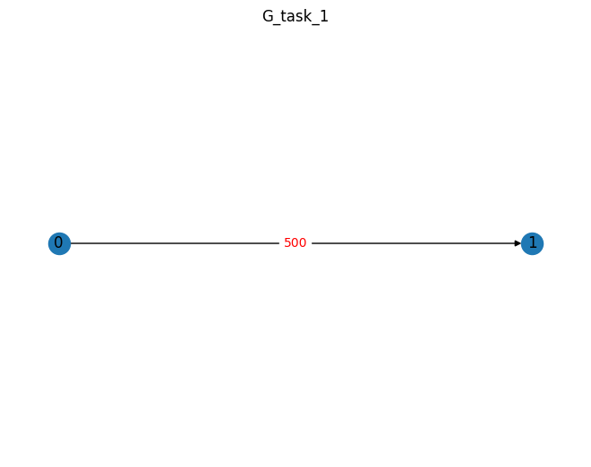
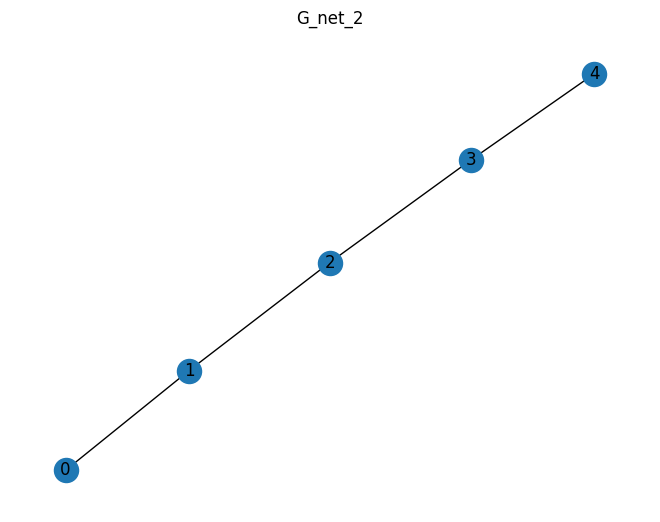
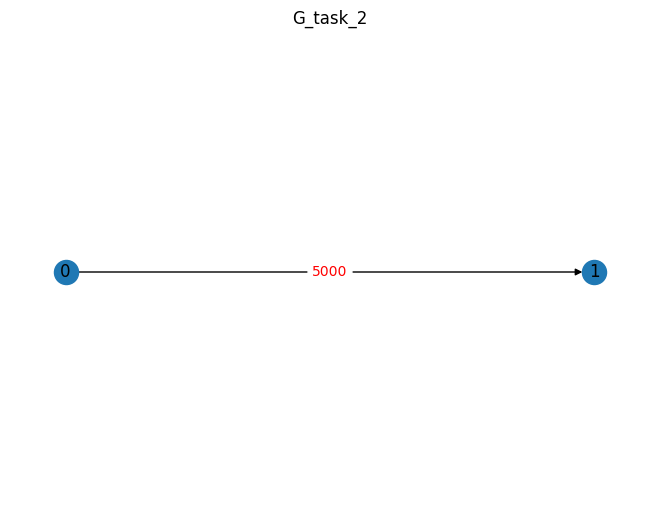
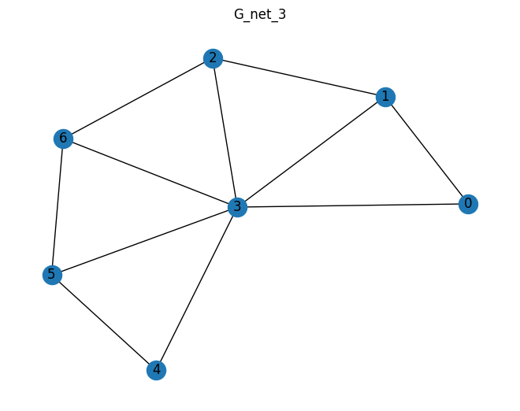

    


    

    


    T огр =  100
    t =  1000
    ---------------------------
    1  решение
    f 0.9045848321042758
    Нагруженность на узлы [510, 1000, 1000, 0, 0]
    Производительность [100, 100, 100, 100, 100]
    D [0.204, 0.4, 0.2, 0.0, 0.0]
    T_task [50.0, 50.0]
    T_NET [25.0, 25.0, 50.0, 0, 0]
    Распределение [[0], [], [1], [], []]
    Задача1задача2:ПутьВГрафеСети {'01': [0, 1, 2]}
    кр путь [0, 1]
    t 50.0
    epsilon [1, 1, 1, 1, 1]
    ---------------------------
    2  решение
    f 0.5820932893792801
    Нагруженность на узлы [510, 1000, 1000, 1000, 1000]
    Производительность [100, 100, 100, 100, 100]
    D [0.408, 0.8, 0.8, 0.8, 0.2]
    T_task [50.0, 50.0]
    T_NET [12.5, 12.5, 12.5, 12.5, 50.0]
    Распределение [[0], [], [], [], [1]]
    Задача1задача2:ПутьВГрафеСети {'01': [0, 1, 2, 3, 4]}
    кр путь [0, 1]
    t 50.0
    epsilon [1, 1, 1, 1, 1]
    ---------------------------
    3  решение
    f 0.9377794346191205
    Нагруженность на узлы [510, 1000, 0, 0, 0]
    Производительность [100, 100, 100, 100, 100]
    D [0.102, 0.2, 0.0, 0.0, 0.0]
    T_task [50.0, 50.0]
    T_NET [50.0, 50.0, 0, 0, 0]
    Распределение [[0], [1], [], [], []]
    Задача1задача2:ПутьВГрафеСети {'01': [0, 1]}
    кр путь [0, 1]
    t 50.0
    epsilon [1, 1, 1, 1, 1]
    ---------------------------
    4  решение
    f 0.9493921346661919
    Нагруженность на узлы [510, 0, 0, 0, 0]
    Производительность [100, 100, 100, 100, 100]
    D [0.051, 0.0, 0.0, 0.0, 0.0]
    T_task [50.0, 50.0]
    T_NET [100.0, 0, 0, 0, 0]
    Распределение [[0, 1], [], [], [], []]
    Задача1задача2:ПутьВГрафеСети {'01': [0]}
    кр путь [0, 1]
    t 50.0
    epsilon [1, 1, 1, 1, 1]
    ---------------------------
    После оптимизации
    f 0.9493921346661919
    Нагруженность на узлы [510, 0, 0, 0, 0]
    Производительность [100, 100, 100, 100, 100]
    D [0.051, 0.0, 0.0, 0.0, 0.0]
    T_task [50.0, 50.0]
    T_NET [100.0, 0, 0, 0, 0]
    Распределение [[0, 1], [], [], [], []]
    Задача1задача2:ПутьВГрафеСети {'01': [0]}
    кр путь [0, 1]
    t 50.0
    epsilon [1, 1, 1, 1, 1]
    ---------------------------


    

    


    

    


    T огр =  100
    t =  1000
    ---------------------------
    1  решение
    f 0.929713876271712
    Нагруженность на узлы [510, 1000, 1000, 0, 0]
    Производительность [100, 200, 300, 400, 500]
    D [0.204, 0.2, 0.06666666666666667, 0.0, 0.0]
    T_task [50.0, 50.0]
    T_NET [25.0, 25.0, 50.0, 0, 0]
    Распределение [[0], [], [1], [], []]
    Задача1задача2:ПутьВГрафеСети {'01': [0, 1, 2]}
    кр путь [0, 1]
    t 50.0
    epsilon [1, 1, 1, 1, 1]
    ---------------------------
    2  решение
    f 0.8712642531508668
    Нагруженность на узлы [510, 1000, 1000, 1000, 1000]
    Производительность [100, 200, 300, 400, 500]
    D [0.408, 0.4, 0.26666666666666666, 0.2, 0.04]
    T_task [50.0, 50.0]
    T_NET [12.5, 12.5, 12.5, 12.5, 50.0]
    Распределение [[0], [], [], [], [1]]
    Задача1задача2:ПутьВГрафеСети {'01': [0, 1, 2, 3, 4]}
    кр путь [0, 1]
    t 50.0
    epsilon [1, 1, 1, 1, 1]
    ---------------------------
    3  решение
    f 0.9493921346661919
    Нагруженность на узлы [510, 0, 0, 0, 0]
    Производительность [100, 200, 300, 400, 500]
    D [0.051, 0.0, 0.0, 0.0, 0.0]
    T_task [50.0, 50.0]
    T_NET [100.0, 0, 0, 0, 0]
    Распределение [[0, 1], [], [], [], []]
    Задача1задача2:ПутьВГрафеСети {'01': [0]}
    кр путь [0, 1]
    t 50.0
    epsilon [1, 1, 1, 1, 1]
    ---------------------------
    4  решение
    f 0.943288940576626
    Нагруженность на узлы [510, 1000, 0, 0, 0]
    Производительность [100, 200, 300, 400, 500]
    D [0.102, 0.1, 0.0, 0.0, 0.0]
    T_task [50.0, 50.0]
    T_NET [50.0, 50.0, 0, 0, 0]
    Распределение [[0], [1], [], [], []]
    Задача1задача2:ПутьВГрафеСети {'01': [0, 1]}
    кр путь [0, 1]
    t 50.0
    epsilon [1, 1, 1, 1, 1]
    ---------------------------
    После оптимизации
    f 0.9493921346661919
    Нагруженность на узлы [510, 0, 0, 0, 0]
    Производительность [100, 200, 300, 400, 500]
    D [0.051, 0.0, 0.0, 0.0, 0.0]
    T_task [50.0, 50.0]
    T_NET [100.0, 0, 0, 0, 0]
    Распределение [[0, 1], [], [], [], []]
    Задача1задача2:ПутьВГрафеСети {'01': [0]}
    кр путь [0, 1]
    t 50.0
    epsilon [1, 1, 1, 1, 1]
    ---------------------------


    

    


    

    


    T огр =  100
    t =  1000
    ---------------------------
    1  решение
    f 0.9493921346661919
    Нагруженность на узлы [510, 0, 0, 0, 0]
    Производительность [100, 200, 300, 400, 500]
    D [0.051, 0.0, 0.0, 0.0, 0.0]
    T_task [50.0, 50.0]
    T_NET [100.0, 0, 0, 0, 0]
    Распределение [[0, 1], [], [], [], []]
    Задача1задача2:ПутьВГрафеСети {'01': [0]}
    кр путь [0, 1]
    t 50.0
    epsilon [1, 1, 1, 1, 1]
    ---------------------------
    2  решение
    f 0.9493921346661919
    Нагруженность на узлы [510, 0, 0, 0, 0]
    Производительность [100, 200, 300, 400, 500]
    D [0.051, 0.0, 0.0, 0.0, 0.0]
    T_task [50.0, 50.0]
    T_NET [100.0, 0, 0, 0, 0]
    Распределение [[0, 1], [], [], [], []]
    Задача1задача2:ПутьВГрафеСети {'01': [0]}
    кр путь [0, 1]
    t 50.0
    epsilon [1, 1, 1, 1, 1]
    ---------------------------
    3  решение
    f 0.9493921346661919
    Нагруженность на узлы [510, 0, 0, 0, 0]
    Производительность [100, 200, 300, 400, 500]
    D [0.051, 0.0, 0.0, 0.0, 0.0]
    T_task [50.0, 50.0]
    T_NET [100.0, 0, 0, 0, 0]
    Распределение [[0, 1], [], [], [], []]
    Задача1задача2:ПутьВГрафеСети {'01': [0]}
    кр путь [0, 1]
    t 50.0
    epsilon [1, 1, 1, 1, 1]
    ---------------------------
    4  решение
    f 0.9493921346661919
    Нагруженность на узлы [510, 0, 0, 0, 0]
    Производительность [100, 200, 300, 400, 500]
    D [0.051, 0.0, 0.0, 0.0, 0.0]
    T_task [50.0, 50.0]
    T_NET [100.0, 0, 0, 0, 0]
    Распределение [[0, 1], [], [], [], []]
    Задача1задача2:ПутьВГрафеСети {'01': [0]}
    кр путь [0, 1]
    t 50.0
    epsilon [1, 1, 1, 1, 1]
    ---------------------------
    После оптимизации
    f 0.9493921346661919
    Нагруженность на узлы [510, 0, 0, 0, 0]
    Производительность [100, 200, 300, 400, 500]
    D [0.051, 0.0, 0.0, 0.0, 0.0]
    T_task [50.0, 50.0]
    T_NET [100.0, 0, 0, 0, 0]
    Распределение [[0, 1], [], [], [], []]
    Задача1задача2:ПутьВГрафеСети {'01': [0]}
    кр путь [0, 1]
    t 50.0
    epsilon [1, 1, 1, 1, 1]
    ---------------------------



    


    

    


    T огр =  100
    t =  1000
    ---------------------------
    1  решение
    f 0.9493921346661919
    Нагруженность на узлы [510, 0, 0, 0, 0]
    Производительность [100, 200, 300, 400, 500]
    D [0.051, 0.0, 0.0, 0.0, 0.0]
    T_task [50.0, 50.0]
    T_NET [100.0, 0, 0, 0, 0]
    Распределение [[0, 1], [], [], [], []]
    Задача1задача2:ПутьВГрафеСети {'01': [0]}
    кр путь [0, 1]
    t 50.0
    epsilon [1, 1, 1, 1, 1]
    ---------------------------
    2  решение
    f 0.9493921346661919
    Нагруженность на узлы [510, 0, 0, 0, 0]
    Производительность [100, 200, 300, 400, 500]
    D [0.051, 0.0, 0.0, 0.0, 0.0]
    T_task [50.0, 50.0]
    T_NET [100.0, 0, 0, 0, 0]
    Распределение [[0, 1], [], [], [], []]
    Задача1задача2:ПутьВГрафеСети {'01': [0]}
    кр путь [0, 1]
    t 50.0
    epsilon [1, 1, 1, 1, 1]
    ---------------------------
    3  решение
    f 0.9493921346661919
    Нагруженность на узлы [510, 0, 0, 0, 0]
    Производительность [100, 200, 300, 400, 500]
    D [0.051, 0.0, 0.0, 0.0, 0.0]
    T_task [50.0, 50.0]
    T_NET [100.0, 0, 0, 0, 0]
    Распределение [[0, 1], [], [], [], []]
    Задача1задача2:ПутьВГрафеСети {'01': [0]}
    кр путь [0, 1]
    t 50.0
    epsilon [1, 1, 1, 1, 1]
    ---------------------------
    4  решение
    f 0.9493921346661919
    Нагруженность на узлы [510, 0, 0, 0, 0]
    Производительность [100, 200, 300, 400, 500]
    D [0.051, 0.0, 0.0, 0.0, 0.0]
    T_task [50.0, 50.0]
    T_NET [100.0, 0, 0, 0, 0]
    Распределение [[0, 1], [], [], [], []]
    Задача1задача2:ПутьВГрафеСети {'01': [0]}
    кр путь [0, 1]
    t 50.0
    epsilon [1, 1, 1, 1, 1]
    ---------------------------
    После оптимизации
    f 0.9493921346661919
    Нагруженность на узлы [510, 0, 0, 0, 0]
    Производительность [100, 200, 300, 400, 500]
    D [0.051, 0.0, 0.0, 0.0, 0.0]
    T_task [50.0, 50.0]
    T_NET [100.0, 0, 0, 0, 0]
    Распределение [[0, 1], [], [], [], []]
    Задача1задача2:ПутьВГрафеСети {'01': [0]}
    кр путь [0, 1]
    t 50.0
    epsilon [1, 1, 1, 1, 1]
    ---------------------------

    

    


    

    


    T огр =  100
    t =  1000
    ---------------------------
    1 решение
    f 0.749777798167498
    Нагруженность на узлы [3200, 2900, 1200, 2950, 850, 400, 300]
    Производительность [500, 500, 200, 200, 500, 500, 1000]
    D [0.512, 0.464, 0.48, 0.59, 0.272, 0.064, 0.024]
    T_task [12.5, 25.0, 25.0, 12.5, 12.5, 12.5, 12.5, 12.5, 12.5, 12.5]
    T_NET [12.5, 12.5, 12.5, 25.0, 6.25, 12.5, 12.5]
    Распределение [[0, 2], [5, 1], [4], [3, 6], [8], [7], [9]]
    Задача1задача2:ПутьВГрафеСети {'01': [0, 1], '02': [0], '03': [0, 3], '15': [1], '25': [0, 1], '34': [3, 2], '45': [2, 1], '56': [1, 3], '67': [3, 5], '68': [3, 4], '69': [3, 6], '78': [5, 4], '89': [4, 3, 6]}
    кр путь [0, 3, 4, 5, 6, 7, 8, 9]
    t 12.5
    epsilon [1, 1, 1, 1, 1, 1, 1]
    ---------------------------
    После оптимизации
    f 0.9035810164695264
    Нагруженность на узлы [3600, 1200, 0, 1500, 0, 400, 0]
    Производительность [500, 500, 200, 200, 500, 500, 1000]
    D [0.192, 0.192, 0.0, 0.2, 0.0, 0.064, 0.0]
    T_task [12.5, 25.0, 25.0, 12.5, 12.5, 12.5, 12.5, 12.5, 12.5, 12.5]
    T_NET [37.5, 12.5, 0, 37.5, 0, 12.5, 0]
    Распределение [[0, 2, 1, 5, 3], [4], [], [6, 9, 8], [], [7], []]
    Задача1задача2:ПутьВГрафеСети {'01': [0], '02': [0], '03': [0], '15': [0], '25': [0], '34': [0, 1], '45': [1, 0], '56': [0, 3], '67': [3, 5], '68': [3], '69': [3], '78': [5, 3], '89': [3]}
    кр путь [0, 3, 4, 5, 6, 7, 8, 9]
    t 12.5
    epsilon [1, 1, 1, 1, 1, 1, 1]
    ---------------------------


```python

```
