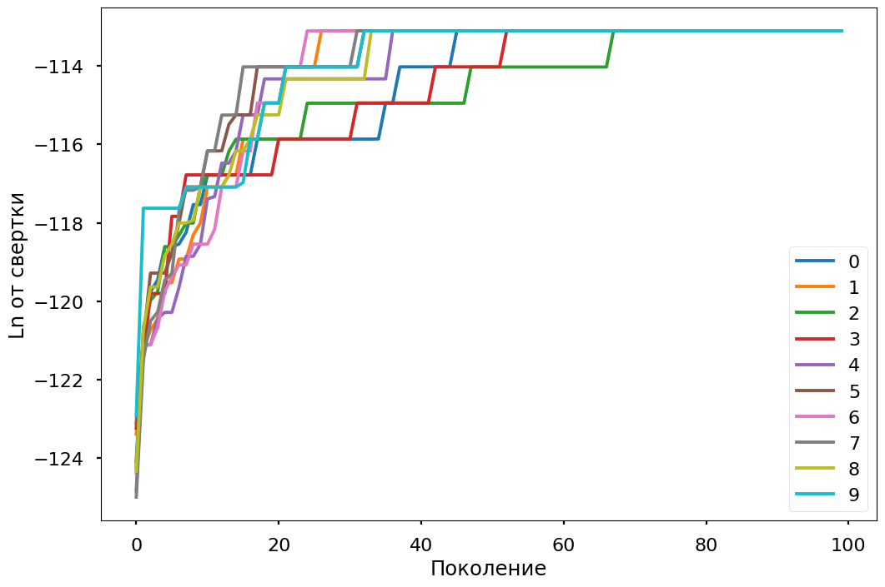
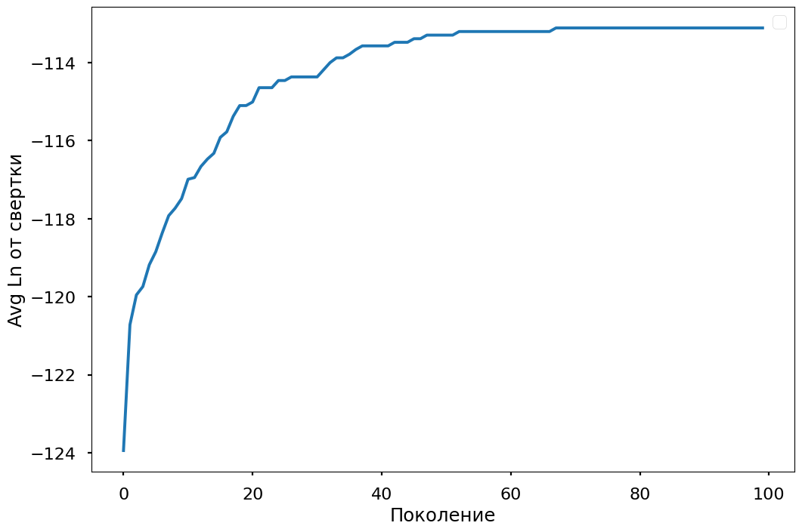
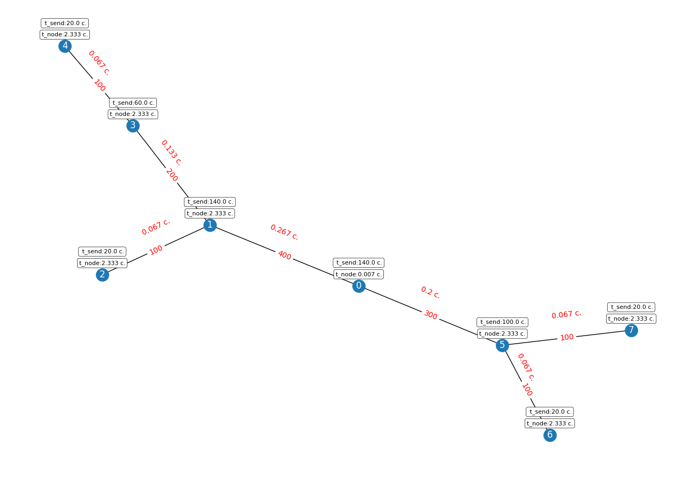
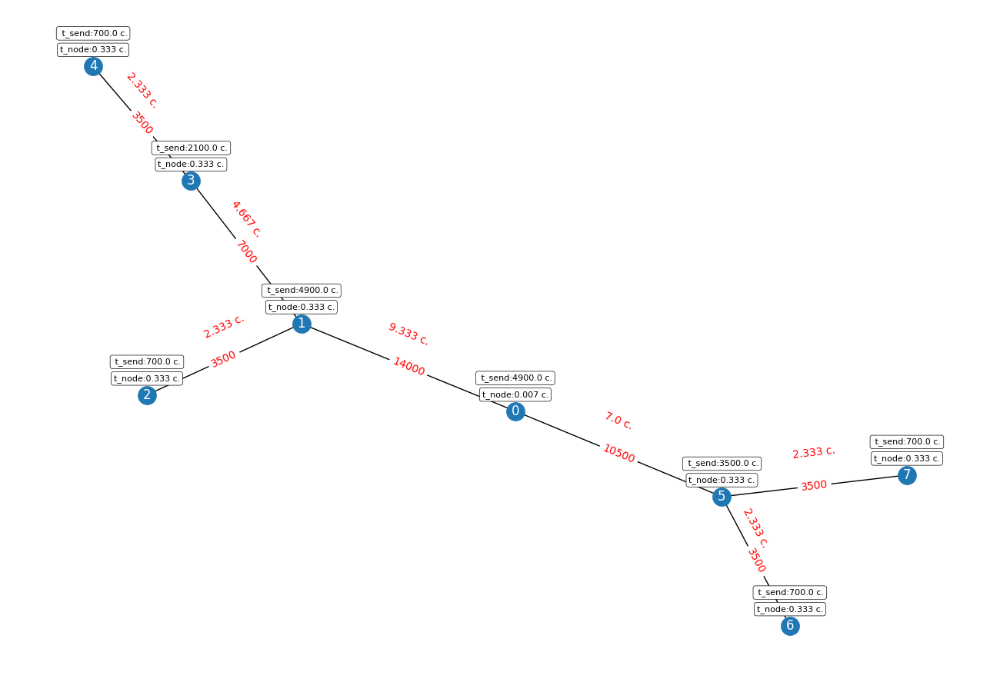
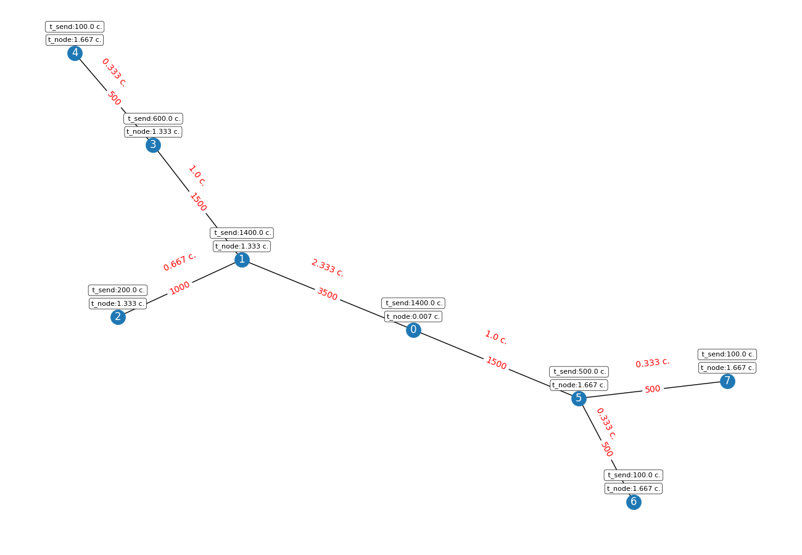

```
Cвертка : 7.534033550558397e-50,
Хромосома: [6 6 6 6 6 6 6 6]
Распределение: [0, 1, 2, 3, 4, 5, 6, 7],
Маршруты передачи данных  задача1задача2:путь: {'10': [1, 0], '20': [2, 1, 0], '30': [3, 1, 0], '40': [4, 3, 1, 0], '50': [5, 0], '60': [6, 5, 0], '70': [7, 5, 0]},
Нагруженность на узлы: [10, 3500, 3500, 3500, 3500, 3500, 3500, 3500]
Нагрузка на сеть: {'01': 400, '05': 300, '12': 100, '13': 200, '34': 100, '56': 100, '57': 100}, 
Целивые функции (критерии оценки)
Энергопотребление (Вт) / min:81715363.86929336
Нагрузка m0 / min:10
Нагрузка m1 / min:3500
Нагрузка m2 / min:3500
Нагрузка m3 / min:3500
Нагрузка m4 / min:3500
Нагрузка m5 / min:3500
Нагрузка m6 / min:3500
Нагрузка m7 / min:3500
Объемы передаваемой информации m0 / min:1
Объемы передаваемой информации m1 / min:401
Объемы передаваемой информации m2 / min:101
Объемы передаваемой информации m3 / min:201
Объемы передаваемой информации m4 / min:101
Объемы передаваемой информации m5 / min:301
Объемы передаваемой информации m6 / min:101
Объемы передаваемой информации m7 / min:101
```


```
Cвертка : 6.768843621235693e-54,
Хромосома: [0 0 0 0 0 0 0 0]
Распределение: [0, 1, 2, 3, 4, 5, 6, 7],
Маршруты передачи данных  задача1задача2:путь: {'10': [1, 0], '20': [2, 1, 0], '30': [3, 1, 0], '40': [4, 3, 1, 0], '50': [5, 0], '60': [6, 5, 0], '70': [7, 5, 0]},
Нагруженность на узлы: [10, 500, 500, 500, 500, 500, 500, 500]
Нагрузка на сеть: {'01': 14000, '05': 10500, '12': 3500, '13': 7000, '34': 3500, '56': 3500, '57': 3500}, 
Целивые функции (критерии оценки)
Энергопотребление (Вт) / min:12228614.491426665
Нагрузка m0 / min:10
Нагрузка m1 / min:500
Нагрузка m2 / min:500
Нагрузка m3 / min:500
Нагрузка m4 / min:500
Нагрузка m5 / min:500
Нагрузка m6 / min:500
Нагрузка m7 / min:500
Объемы передаваемой информации m0 / min:1
Объемы передаваемой информации m1 / min:14001
Объемы передаваемой информации m2 / min:3501
Объемы передаваемой информации m3 / min:7001
Объемы передаваемой информации m4 / min:3501
Объемы передаваемой информации m5 / min:10501
Объемы передаваемой информации m6 / min:3501
Объемы передаваемой информации m7 / min:3501
```

```
Cвертка : 3.9545440116472117e-54,
Хромосома: [3 3 3 3 4 4 4 4]
Распределение: [0, 1, 2, 3, 4, 5, 6, 7],
Маршруты передачи данных  задача1задача2:путь: {'10': [1, 0], '20': [2, 1, 0], '30': [3, 1, 0], '40': [4, 3, 1, 0], '50': [5, 0], '60': [6, 5, 0], '70': [7, 5, 0]},
Нагруженность на узлы: [10, 2000, 2000, 2000, 2500, 2500, 2500, 2500]
 Нагрузка на сеть: {'01': 3500, '05': 1500, '12': 1000, '13': 1500, '34': 500, '56': 500, '57': 500}, 
Целивые функции (критерии оценки)
Энергопотребление (Вт) / min:53494604.085426666
Нагрузка m0 / min:10
Нагрузка m1 / min:2000
Нагрузка m2 / min:2000
Нагрузка m3 / min:2000
Нагрузка m4 / min:2500
Нагрузка m5 / min:2500
Нагрузка m6 / min:2500
Нагрузка m7 / min:2500
Объемы передаваемой информации m0 / min:1
Объемы передаваемой информации m1 / min:4001
Объемы передаваемой информации m2 / min:1001
Объемы передаваемой информации m3 / min:2001
Объемы передаваемой информации m4 / min:501
Объемы передаваемой информации m5 / min:1501
Объемы передаваемой информации m6 / min:501
Объемы передаваемой информации m7 / min:501
```