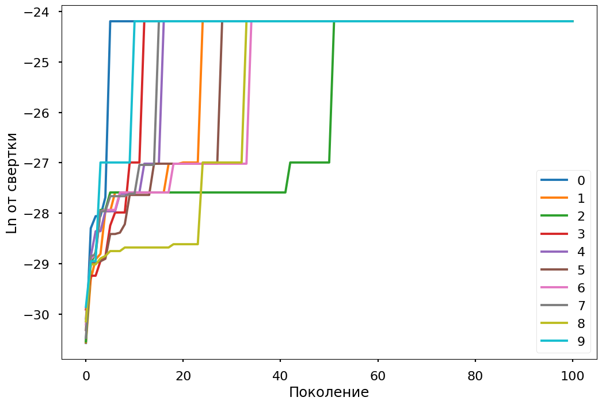
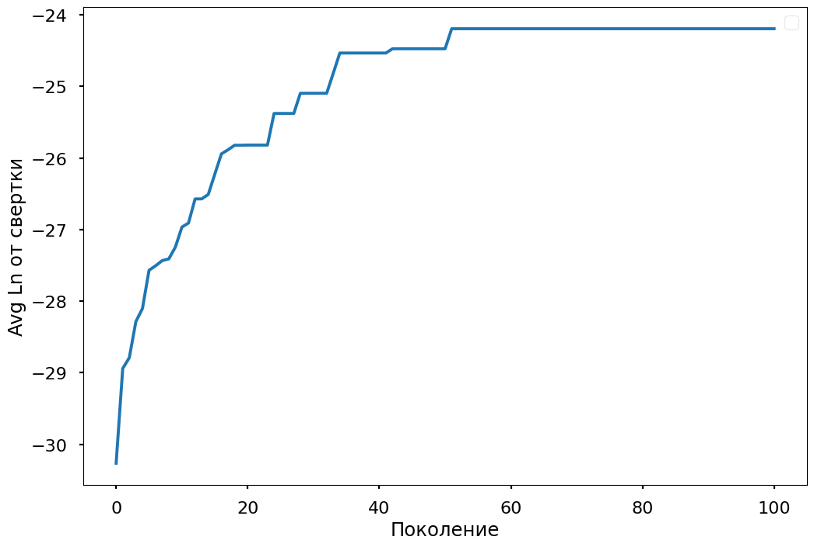
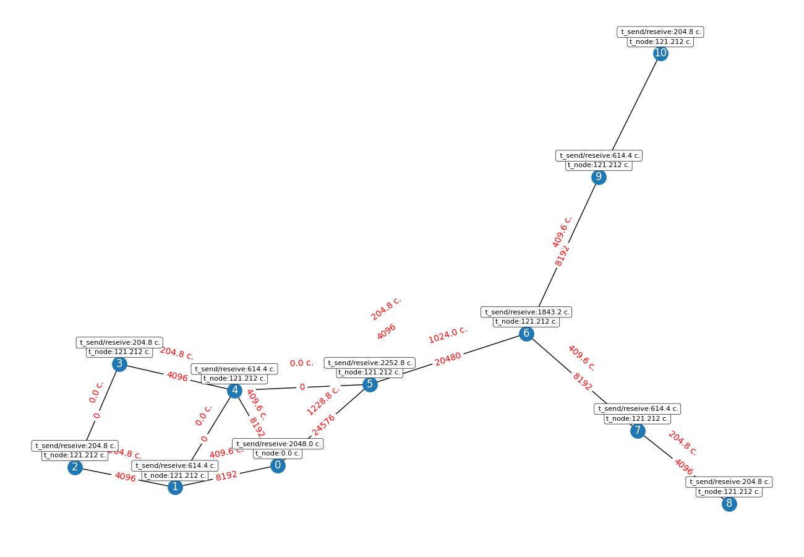

Что получается при разных типах задач
```
    Cвертка: 3.1111149782941424e-11,
    Временя выполнение задачи (с): 15343.321212424242,
    Хромосома: [0 0 0 0 0 0 0 0 0 0 0]
    Распределение: [0, 1, 2, 3, 4, 5, 6, 7, 8, 9, 10],
    Маршруты передачи данных  задача1задача2:путь: {'10': [1, 0], '20': [2, 1, 0], '30': [3, 4, 0], '40': [4, 0], '50': [5, 0], '60': [6, 5, 0], '70': [7, 6, 5, 0], '80': [8, 7, 6, 5, 0], '90': [9, 6, 5, 0], '100': [10, 9, 6, 5, 0]}
    Нагруженность на узлы: [10, 4000000000, 4000000000, 4000000000, 4000000000, 4000000000, 4000000000, 4000000000, 4000000000, 4000000000, 4000000000]
    Нагрузка на сеть: {'01': 8192, '04': 8192, '05': 24576, '12': 4096, '14': 0, '23': 0, '34': 4096, '45': 0, '56': 20480, '67': 8192, '69': 8192, '78': 4096, '910': 4096}
    v_reseive_to_node: [40960, 4096, 0, 0, 4096, 20480, 16384, 4096, 0, 4096, 0]
    v_sent_to_node: [0, 8192, 4096, 4096, 8192, 24576, 20480, 8192, 4096, 8192, 4096]
    t_node: [3.0303030303030305e-07, 121.21212121212122, 121.21212121212122, 121.21212121212122, 121.21212121212122, 121.21212121212122, 121.21212121212122, 121.21212121212122, 121.21212121212122, 121.21212121212122, 121.21212121212122]
    t_send_reseive_data_node: [2048.0, 614.4, 204.8, 204.8, 614.4, 2252.8, 1843.2, 614.4, 204.8, 614.4, 204.8]
    t_edges: [409.6, 409.6, 1228.8, 204.8, 0.0, 0.0, 204.8, 0.0, 1024.0, 409.6, 409.6, 204.8, 204.8]

    Целевые функции (критерии оценки)
    Энергопотребление (МВт) / min:341189.89033407276
    Объемы передаваемой информации / min:94208
    Ограничения
    1


    Cвертка: 3.5339885857563085e-13,
    Временя выполнение задачи (с): 2331527.0647427277,
    Хромосома: [1 1 1 1 1 1 1 1 1 1 1]
    Распределение: [0, 1, 2, 3, 4, 5, 6, 7, 8, 9, 10],
    Маршруты передачи данных  задача1задача2:путь: {'10': [1, 0], '20': [2, 1, 0], '30': [3, 4, 0], '40': [4, 0], '50': [5, 0], '60': [6, 5, 0], '70': [7, 6, 5, 0], '80': [8, 7, 6, 5, 0], '90': [9, 6, 5, 0], '100': [10, 9, 6, 5, 0]}
    Нагруженность на узлы: [10, 7670000000000.0, 7670000000000.0, 7670000000000.0, 7670000000000.0, 7670000000000.0, 7670000000000.0, 7670000000000.0, 7670000000000.0, 7670000000000.0, 7670000000000.0]
    Нагрузка на сеть: {'01': 4222.98, '04': 4222.98, '05': 12668.939999999999, '12': 2111.49, '14': 0, '23': 0, '34': 2111.49, '45': 0, '56': 10557.449999999999, '67': 4222.98, '69': 4222.98, '78': 2111.49, '910': 2111.49}
    v_reseive_to_node: [21114.899999999994, 2111.49, 0, 0, 2111.49, 10557.449999999999, 8445.96, 2111.49, 0, 2111.49, 0]
    v_sent_to_node: [0, 4222.98, 2111.49, 2111.49, 4222.98, 12668.939999999999, 10557.449999999999, 4222.98, 2111.49, 4222.98, 2111.49]
    t_node: [3.0303030303030305e-07, 232424.24242424243, 232424.24242424243, 232424.24242424243, 232424.24242424243, 232424.24242424243, 232424.24242424243, 232424.24242424243, 232424.24242424243, 232424.24242424243, 232424.24242424243]
    t_send_reseive_data_node: [1055.7449999999997, 316.72349999999994, 105.57449999999999, 105.57449999999999, 316.72349999999994, 1161.3195, 950.1704999999998, 316.72349999999994, 105.57449999999999, 316.72349999999994, 105.57449999999999]
    t_edges: [211.14899999999997, 211.14899999999997, 633.4469999999999, 105.57449999999999, 0.0, 0.0, 105.57449999999999, 0.0, 527.8725, 211.14899999999997, 211.14899999999997, 105.57449999999999, 105.57449999999999]

    Целевые функции (критерии оценки)
    Энергопотребление (МВт) / min:58266374.05379717
    Объемы передаваемой информации / min:48564.26999999999
    Ограничения
    1


    Cвертка: 1.0421991861890114e-13,
    Временя выполнение задачи (с): 12731794.711273031,
    Хромосома: [2 2 2 2 2 2 2 2 2 2 2]
    Распределение: [0, 1, 2, 3, 4, 5, 6, 7, 8, 9, 10],
    Маршруты передачи данных  задача1задача2:путь: {'10': [1, 0], '20': [2, 1, 0], '30': [3, 4, 0], '40': [4, 0], '50': [5, 0], '60': [6, 5, 0], '70': [7, 6, 5, 0], '80': [8, 7, 6, 5, 0], '90': [9, 6, 5, 0], '100': [10, 9, 6, 5, 0]}
    Нагруженность на узлы: [10, 42000000000000, 42000000000000, 42000000000000, 42000000000000, 42000000000000, 42000000000000, 42000000000000, 42000000000000, 42000000000000, 42000000000000]
    Нагрузка на сеть: {'01': 2621.44, '04': 2621.44, '05': 7864.320000000001, '12': 1310.72, '14': 0, '23': 0, '34': 1310.72, '45': 0, '56': 6553.6, '67': 2621.44, '69': 2621.44, '78': 1310.72, '910': 1310.72}
    v_reseive_to_node: [13107.199999999999, 1310.72, 0, 0, 1310.72, 6553.6, 5242.88, 1310.72, 0, 1310.72, 0]
    v_sent_to_node: [0, 2621.44, 1310.72, 1310.72, 2621.44, 7864.320000000001, 6553.6, 2621.44, 1310.72, 2621.44, 1310.72]
    t_node: [3.0303030303030305e-07, 1272727.2727272727, 1272727.2727272727, 1272727.2727272727, 1272727.2727272727, 1272727.2727272727, 1272727.2727272727, 1272727.2727272727, 1272727.2727272727, 1272727.2727272727, 1272727.2727272727]
    t_send_reseive_data_node: [655.3599999999999, 196.608, 65.536, 65.536, 196.608, 720.8960000000001, 589.824, 196.608, 65.536, 196.608, 65.536]
    t_edges: [131.072, 131.072, 393.216, 65.536, 0.0, 0.0, 65.536, 0.0, 327.68, 131.072, 131.072, 65.536, 65.536]

    Целевые функции (критерии оценки)
    Энергопотребление (МВт) / min:318281581.96849996
    Объемы передаваемой информации / min:30146.559999999998
    Ограничения
    1


    Cвертка: 5.095380108441329e-14,
    Временя выполнение задачи (с): 28488981.86084878,
    Хромосома: [3 3 3 3 3 3 3 3 3 3 3]
    Распределение: [0, 1, 2, 3, 4, 5, 6, 7, 8, 9, 10],
    Маршруты передачи данных  задача1задача2:путь: {'10': [1, 0], '20': [2, 1, 0], '30': [3, 4, 0], '40': [4, 0], '50': [5, 0], '60': [6, 5, 0], '70': [7, 6, 5, 0], '80': [8, 7, 6, 5, 0], '90': [9, 6, 5, 0], '100': [10, 9, 6, 5, 0]}
    Нагруженность на узлы: [10, 94000000000000, 94000000000000, 94000000000000, 94000000000000, 94000000000000, 94000000000000, 94000000000000, 94000000000000, 94000000000000, 94000000000000]
    Нагрузка на сеть: {'01': 2396.16, '04': 2396.16, '05': 7188.48, '12': 1198.08, '14': 0, '23': 0, '34': 1198.08, '45': 0, '56': 5990.4, '67': 2396.16, '69': 2396.16, '78': 1198.08, '910': 1198.08}
    v_reseive_to_node: [11980.8, 1198.08, 0, 0, 1198.08, 5990.4, 4792.32, 1198.08, 0, 1198.08, 0]
    v_sent_to_node: [0, 2396.16, 1198.08, 1198.08, 2396.16, 7188.48, 5990.4, 2396.16, 1198.08, 2396.16, 1198.08]
    t_node: [3.0303030303030305e-07, 2848484.8484848486, 2848484.8484848486, 2848484.8484848486, 2848484.8484848486, 2848484.8484848486, 2848484.8484848486, 2848484.8484848486, 2848484.8484848486, 2848484.8484848486, 2848484.8484848486]
    t_send_reseive_data_node: [599.04, 179.712, 59.903999999999996, 59.903999999999996, 179.712, 658.944, 539.136, 179.712, 59.903999999999996, 179.712, 59.903999999999996]
    t_edges: [119.80799999999999, 119.80799999999999, 359.424, 59.903999999999996, 0.0, 0.0, 59.903999999999996, 0.0, 299.52, 119.80799999999999, 119.80799999999999, 59.903999999999996, 59.903999999999996]

    Целевые функции (критерии оценки)
    Энергопотребление (МВт) / min:712212773.1866432
    Объемы передаваемой информации / min:27555.840000000004
    Ограничения
    1


    Cвертка: 7.116868743444013e-15,
    Временя выполнение задачи (с): 227276436.71272752,
    Хромосома: [4 4 4 4 4 4 4 4 4 4 4]
    Распределение: [0, 1, 2, 3, 4, 5, 6, 7, 8, 9, 10],
    Маршруты передачи данных  задача1задача2:путь: {'10': [1, 0], '20': [2, 1, 0], '30': [3, 4, 0], '40': [4, 0], '50': [5, 0], '60': [6, 5, 0], '70': [7, 6, 5, 0], '80': [8, 7, 6, 5, 0], '90': [9, 6, 5, 0], '100': [10, 9, 6, 5, 0]}
    Нагруженность на узлы: [10, 750000000000000, 750000000000000, 750000000000000, 750000000000000, 750000000000000, 750000000000000, 750000000000000, 750000000000000, 750000000000000, 750000000000000]
    Нагрузка на сеть: {'01': 2150.4, '04': 2150.4, '05': 6451.2, '12': 1075.2, '14': 0, '23': 0, '34': 1075.2, '45': 0, '56': 5376.0, '67': 2150.4, '69': 2150.4, '78': 1075.2, '910': 1075.2}
    v_reseive_to_node: [10752.000000000002, 1075.2, 0, 0, 1075.2, 5376.0, 4300.8, 1075.2, 0, 1075.2, 0]
    v_sent_to_node: [0, 2150.4, 1075.2, 1075.2, 2150.4, 6451.2, 5376.0, 2150.4, 1075.2, 2150.4, 1075.2]
    t_node: [3.0303030303030305e-07, 22727272.727272727, 22727272.727272727, 22727272.727272727, 22727272.727272727, 22727272.727272727, 22727272.727272727, 22727272.727272727, 22727272.727272727, 22727272.727272727, 22727272.727272727]
    t_send_reseive_data_node: [537.6000000000001, 161.28000000000003, 53.760000000000005, 53.760000000000005, 161.28000000000003, 591.36, 483.84, 161.28000000000003, 53.760000000000005, 161.28000000000003, 53.760000000000005]
    t_edges: [107.52000000000001, 107.52000000000001, 322.56, 53.760000000000005, 0.0, 0.0, 53.760000000000005, 0.0, 268.8, 107.52000000000001, 107.52000000000001, 53.760000000000005, 53.760000000000005]

    Целевые функции (критерии оценки)
    Энергопотребление (МВт) / min:5681904789.611944
    Объемы передаваемой информации / min:24729.600000000006
    Ограничения
    1
```


## GA
``` 
    Cвертка: 3.1111149782941424e-11,
    Временя выполнение задачи (с): 15343.321212424242,
    Хромосома: [3 0 0 0 0 0 0 0 0 0 0]
    Распределение: [0, 1, 2, 3, 4, 5, 6, 7, 8, 9, 10],
    Маршруты передачи данных  задача1задача2:путь: {'10': [1, 0], '20': [2, 1, 0], '30': [3, 4, 0], '40': [4, 0], '50': [5, 0], '60': [6, 5, 0], '70': [7, 6, 5, 0], '80': [8, 7, 6, 5, 0], '90': [9, 6, 5, 0], '100': [10, 9, 6, 5, 0]}
    Нагруженность на узлы: [10, 4000000000, 4000000000, 4000000000, 4000000000, 4000000000, 4000000000, 4000000000, 4000000000, 4000000000, 4000000000]
    Нагрузка на сеть: {'01': 8192, '04': 8192, '05': 24576, '12': 4096, '14': 0, '23': 0, '34': 4096, '45': 0, '56': 20480, '67': 8192, '69': 8192, '78': 4096, '910': 4096}
    v_reseive_to_node: [40960, 4096, 0, 0, 4096, 20480, 16384, 4096, 0, 4096, 0]
    v_sent_to_node: [0, 8192, 4096, 4096, 8192, 24576, 20480, 8192, 4096, 8192, 4096]
    t_node: [3.0303030303030305e-07, 121.21212121212122, 121.21212121212122, 121.21212121212122, 121.21212121212122, 121.21212121212122, 121.21212121212122, 121.21212121212122, 121.21212121212122, 121.21212121212122, 121.21212121212122]
    t_send_reseive_data_node: [2048.0, 614.4, 204.8, 204.8, 614.4, 2252.8, 1843.2, 614.4, 204.8, 614.4, 204.8]
    t_edges: [409.6, 409.6, 1228.8, 204.8, 0.0, 0.0, 204.8, 0.0, 1024.0, 409.6, 409.6, 204.8, 204.8]

    Целевые функции (критерии оценки)
    Энергопотребление (МВт) / min:341189.89033407276
    Объемы передаваемой информации / min:94208
    Ограничения
    1


    Cвертка: 3.1111149782941424e-11,
    Временя выполнение задачи (с): 15343.321212424242,
    Хромосома: [3 0 0 0 0 0 0 0 0 0 0]
    Распределение: [0, 1, 2, 3, 4, 5, 6, 7, 8, 9, 10],
    Маршруты передачи данных  задача1задача2:путь: {'10': [1, 0], '20': [2, 1, 0], '30': [3, 4, 0], '40': [4, 0], '50': [5, 0], '60': [6, 5, 0], '70': [7, 6, 5, 0], '80': [8, 7, 6, 5, 0], '90': [9, 6, 5, 0], '100': [10, 9, 6, 5, 0]}
    Нагруженность на узлы: [10, 4000000000, 4000000000, 4000000000, 4000000000, 4000000000, 4000000000, 4000000000, 4000000000, 4000000000, 4000000000]
    Нагрузка на сеть: {'01': 8192, '04': 8192, '05': 24576, '12': 4096, '14': 0, '23': 0, '34': 4096, '45': 0, '56': 20480, '67': 8192, '69': 8192, '78': 4096, '910': 4096}
    v_reseive_to_node: [40960, 4096, 0, 0, 4096, 20480, 16384, 4096, 0, 4096, 0]
    v_sent_to_node: [0, 8192, 4096, 4096, 8192, 24576, 20480, 8192, 4096, 8192, 4096]
    t_node: [3.0303030303030305e-07, 121.21212121212122, 121.21212121212122, 121.21212121212122, 121.21212121212122, 121.21212121212122, 121.21212121212122, 121.21212121212122, 121.21212121212122, 121.21212121212122, 121.21212121212122]
    t_send_reseive_data_node: [2048.0, 614.4, 204.8, 204.8, 614.4, 2252.8, 1843.2, 614.4, 204.8, 614.4, 204.8]
    t_edges: [409.6, 409.6, 1228.8, 204.8, 0.0, 0.0, 204.8, 0.0, 1024.0, 409.6, 409.6, 204.8, 204.8]

    Целевые функции (критерии оценки)
    Энергопотребление (МВт) / min:341189.89033407276
    Объемы передаваемой информации / min:94208
    Ограничения
    1


    Cвертка: 3.1111149782941424e-11,
    Временя выполнение задачи (с): 15343.321212424242,
    Хромосома: [0 0 0 0 0 0 0 0 0 0 0]
    Распределение: [0, 1, 2, 3, 4, 5, 6, 7, 8, 9, 10],
    Маршруты передачи данных  задача1задача2:путь: {'10': [1, 0], '20': [2, 1, 0], '30': [3, 4, 0], '40': [4, 0], '50': [5, 0], '60': [6, 5, 0], '70': [7, 6, 5, 0], '80': [8, 7, 6, 5, 0], '90': [9, 6, 5, 0], '100': [10, 9, 6, 5, 0]}
    Нагруженность на узлы: [10, 4000000000, 4000000000, 4000000000, 4000000000, 4000000000, 4000000000, 4000000000, 4000000000, 4000000000, 4000000000]
    Нагрузка на сеть: {'01': 8192, '04': 8192, '05': 24576, '12': 4096, '14': 0, '23': 0, '34': 4096, '45': 0, '56': 20480, '67': 8192, '69': 8192, '78': 4096, '910': 4096}
    v_reseive_to_node: [40960, 4096, 0, 0, 4096, 20480, 16384, 4096, 0, 4096, 0]
    v_sent_to_node: [0, 8192, 4096, 4096, 8192, 24576, 20480, 8192, 4096, 8192, 4096]
    t_node: [3.0303030303030305e-07, 121.21212121212122, 121.21212121212122, 121.21212121212122, 121.21212121212122, 121.21212121212122, 121.21212121212122, 121.21212121212122, 121.21212121212122, 121.21212121212122, 121.21212121212122]
    t_send_reseive_data_node: [2048.0, 614.4, 204.8, 204.8, 614.4, 2252.8, 1843.2, 614.4, 204.8, 614.4, 204.8]
    t_edges: [409.6, 409.6, 1228.8, 204.8, 0.0, 0.0, 204.8, 0.0, 1024.0, 409.6, 409.6, 204.8, 204.8]

    Целевые функции (критерии оценки)
    Энергопотребление (МВт) / min:341189.89033407276
    Объемы передаваемой информации / min:94208
    Ограничения
    1


    Cвертка: 3.1111149782941424e-11,
    Временя выполнение задачи (с): 15343.321212424242,
    Хромосома: [1 0 0 0 0 0 0 0 0 0 0]
    Распределение: [0, 1, 2, 3, 4, 5, 6, 7, 8, 9, 10],
    Маршруты передачи данных  задача1задача2:путь: {'10': [1, 0], '20': [2, 1, 0], '30': [3, 4, 0], '40': [4, 0], '50': [5, 0], '60': [6, 5, 0], '70': [7, 6, 5, 0], '80': [8, 7, 6, 5, 0], '90': [9, 6, 5, 0], '100': [10, 9, 6, 5, 0]}
    Нагруженность на узлы: [10, 4000000000, 4000000000, 4000000000, 4000000000, 4000000000, 4000000000, 4000000000, 4000000000, 4000000000, 4000000000]
    Нагрузка на сеть: {'01': 8192, '04': 8192, '05': 24576, '12': 4096, '14': 0, '23': 0, '34': 4096, '45': 0, '56': 20480, '67': 8192, '69': 8192, '78': 4096, '910': 4096}
    v_reseive_to_node: [40960, 4096, 0, 0, 4096, 20480, 16384, 4096, 0, 4096, 0]
    v_sent_to_node: [0, 8192, 4096, 4096, 8192, 24576, 20480, 8192, 4096, 8192, 4096]
    t_node: [3.0303030303030305e-07, 121.21212121212122, 121.21212121212122, 121.21212121212122, 121.21212121212122, 121.21212121212122, 121.21212121212122, 121.21212121212122, 121.21212121212122, 121.21212121212122, 121.21212121212122]
    t_send_reseive_data_node: [2048.0, 614.4, 204.8, 204.8, 614.4, 2252.8, 1843.2, 614.4, 204.8, 614.4, 204.8]
    t_edges: [409.6, 409.6, 1228.8, 204.8, 0.0, 0.0, 204.8, 0.0, 1024.0, 409.6, 409.6, 204.8, 204.8]

    Целевые функции (критерии оценки)
    Энергопотребление (МВт) / min:341189.89033407276
    Объемы передаваемой информации / min:94208
    Ограничения
    1


    Cвертка: 3.1111149782941424e-11,
    Временя выполнение задачи (с): 15343.321212424242,
    Хромосома: [0 0 0 0 0 0 0 0 0 0 0]
    Распределение: [0, 1, 2, 3, 4, 5, 6, 7, 8, 9, 10],
    Маршруты передачи данных  задача1задача2:путь: {'10': [1, 0], '20': [2, 1, 0], '30': [3, 4, 0], '40': [4, 0], '50': [5, 0], '60': [6, 5, 0], '70': [7, 6, 5, 0], '80': [8, 7, 6, 5, 0], '90': [9, 6, 5, 0], '100': [10, 9, 6, 5, 0]}
    Нагруженность на узлы: [10, 4000000000, 4000000000, 4000000000, 4000000000, 4000000000, 4000000000, 4000000000, 4000000000, 4000000000, 4000000000]
    Нагрузка на сеть: {'01': 8192, '04': 8192, '05': 24576, '12': 4096, '14': 0, '23': 0, '34': 4096, '45': 0, '56': 20480, '67': 8192, '69': 8192, '78': 4096, '910': 4096}
    v_reseive_to_node: [40960, 4096, 0, 0, 4096, 20480, 16384, 4096, 0, 4096, 0]
    v_sent_to_node: [0, 8192, 4096, 4096, 8192, 24576, 20480, 8192, 4096, 8192, 4096]
    t_node: [3.0303030303030305e-07, 121.21212121212122, 121.21212121212122, 121.21212121212122, 121.21212121212122, 121.21212121212122, 121.21212121212122, 121.21212121212122, 121.21212121212122, 121.21212121212122, 121.21212121212122]
    t_send_reseive_data_node: [2048.0, 614.4, 204.8, 204.8, 614.4, 2252.8, 1843.2, 614.4, 204.8, 614.4, 204.8]
    t_edges: [409.6, 409.6, 1228.8, 204.8, 0.0, 0.0, 204.8, 0.0, 1024.0, 409.6, 409.6, 204.8, 204.8]

    Целевые функции (критерии оценки)
    Энергопотребление (МВт) / min:341189.89033407276
    Объемы передаваемой информации / min:94208
    Ограничения
    1


    Cвертка: 3.1111149782941424e-11,
    Временя выполнение задачи (с): 15343.321212424242,
    Хромосома: [0 0 0 0 0 0 0 0 0 0 0]
    Распределение: [0, 1, 2, 3, 4, 5, 6, 7, 8, 9, 10],
    Маршруты передачи данных  задача1задача2:путь: {'10': [1, 0], '20': [2, 1, 0], '30': [3, 4, 0], '40': [4, 0], '50': [5, 0], '60': [6, 5, 0], '70': [7, 6, 5, 0], '80': [8, 7, 6, 5, 0], '90': [9, 6, 5, 0], '100': [10, 9, 6, 5, 0]}
    Нагруженность на узлы: [10, 4000000000, 4000000000, 4000000000, 4000000000, 4000000000, 4000000000, 4000000000, 4000000000, 4000000000, 4000000000]
    Нагрузка на сеть: {'01': 8192, '04': 8192, '05': 24576, '12': 4096, '14': 0, '23': 0, '34': 4096, '45': 0, '56': 20480, '67': 8192, '69': 8192, '78': 4096, '910': 4096}
    v_reseive_to_node: [40960, 4096, 0, 0, 4096, 20480, 16384, 4096, 0, 4096, 0]
    v_sent_to_node: [0, 8192, 4096, 4096, 8192, 24576, 20480, 8192, 4096, 8192, 4096]
    t_node: [3.0303030303030305e-07, 121.21212121212122, 121.21212121212122, 121.21212121212122, 121.21212121212122, 121.21212121212122, 121.21212121212122, 121.21212121212122, 121.21212121212122, 121.21212121212122, 121.21212121212122]
    t_send_reseive_data_node: [2048.0, 614.4, 204.8, 204.8, 614.4, 2252.8, 1843.2, 614.4, 204.8, 614.4, 204.8]
    t_edges: [409.6, 409.6, 1228.8, 204.8, 0.0, 0.0, 204.8, 0.0, 1024.0, 409.6, 409.6, 204.8, 204.8]

    Целевые функции (критерии оценки)
    Энергопотребление (МВт) / min:341189.89033407276
    Объемы передаваемой информации / min:94208
    Ограничения
    1


    Cвертка: 3.1111149782941424e-11,
    Временя выполнение задачи (с): 15343.321212424242,
    Хромосома: [4 0 0 0 0 0 0 0 0 0 0]
    Распределение: [0, 1, 2, 3, 4, 5, 6, 7, 8, 9, 10],
    Маршруты передачи данных  задача1задача2:путь: {'10': [1, 0], '20': [2, 1, 0], '30': [3, 4, 0], '40': [4, 0], '50': [5, 0], '60': [6, 5, 0], '70': [7, 6, 5, 0], '80': [8, 7, 6, 5, 0], '90': [9, 6, 5, 0], '100': [10, 9, 6, 5, 0]}
    Нагруженность на узлы: [10, 4000000000, 4000000000, 4000000000, 4000000000, 4000000000, 4000000000, 4000000000, 4000000000, 4000000000, 4000000000]
    Нагрузка на сеть: {'01': 8192, '04': 8192, '05': 24576, '12': 4096, '14': 0, '23': 0, '34': 4096, '45': 0, '56': 20480, '67': 8192, '69': 8192, '78': 4096, '910': 4096}
    v_reseive_to_node: [40960, 4096, 0, 0, 4096, 20480, 16384, 4096, 0, 4096, 0]
    v_sent_to_node: [0, 8192, 4096, 4096, 8192, 24576, 20480, 8192, 4096, 8192, 4096]
    t_node: [3.0303030303030305e-07, 121.21212121212122, 121.21212121212122, 121.21212121212122, 121.21212121212122, 121.21212121212122, 121.21212121212122, 121.21212121212122, 121.21212121212122, 121.21212121212122, 121.21212121212122]
    t_send_reseive_data_node: [2048.0, 614.4, 204.8, 204.8, 614.4, 2252.8, 1843.2, 614.4, 204.8, 614.4, 204.8]
    t_edges: [409.6, 409.6, 1228.8, 204.8, 0.0, 0.0, 204.8, 0.0, 1024.0, 409.6, 409.6, 204.8, 204.8]

    Целевые функции (критерии оценки)
    Энергопотребление (МВт) / min:341189.89033407276
    Объемы передаваемой информации / min:94208
    Ограничения
    1


    Cвертка: 3.1111149782941424e-11,
    Временя выполнение задачи (с): 15343.321212424242,
    Хромосома: [3 0 0 0 0 0 0 0 0 0 0]
    Распределение: [0, 1, 2, 3, 4, 5, 6, 7, 8, 9, 10],
    Маршруты передачи данных  задача1задача2:путь: {'10': [1, 0], '20': [2, 1, 0], '30': [3, 4, 0], '40': [4, 0], '50': [5, 0], '60': [6, 5, 0], '70': [7, 6, 5, 0], '80': [8, 7, 6, 5, 0], '90': [9, 6, 5, 0], '100': [10, 9, 6, 5, 0]}
    Нагруженность на узлы: [10, 4000000000, 4000000000, 4000000000, 4000000000, 4000000000, 4000000000, 4000000000, 4000000000, 4000000000, 4000000000]
    Нагрузка на сеть: {'01': 8192, '04': 8192, '05': 24576, '12': 4096, '14': 0, '23': 0, '34': 4096, '45': 0, '56': 20480, '67': 8192, '69': 8192, '78': 4096, '910': 4096}
    v_reseive_to_node: [40960, 4096, 0, 0, 4096, 20480, 16384, 4096, 0, 4096, 0]
    v_sent_to_node: [0, 8192, 4096, 4096, 8192, 24576, 20480, 8192, 4096, 8192, 4096]
    t_node: [3.0303030303030305e-07, 121.21212121212122, 121.21212121212122, 121.21212121212122, 121.21212121212122, 121.21212121212122, 121.21212121212122, 121.21212121212122, 121.21212121212122, 121.21212121212122, 121.21212121212122]
    t_send_reseive_data_node: [2048.0, 614.4, 204.8, 204.8, 614.4, 2252.8, 1843.2, 614.4, 204.8, 614.4, 204.8]
    t_edges: [409.6, 409.6, 1228.8, 204.8, 0.0, 0.0, 204.8, 0.0, 1024.0, 409.6, 409.6, 204.8, 204.8]

    Целевые функции (критерии оценки)
    Энергопотребление (МВт) / min:341189.89033407276
    Объемы передаваемой информации / min:94208
    Ограничения
    1


    Cвертка: 3.1111149782941424e-11,
    Временя выполнение задачи (с): 15343.321212424242,
    Хромосома: [0 0 0 0 0 0 0 0 0 0 0]
    Распределение: [0, 1, 2, 3, 4, 5, 6, 7, 8, 9, 10],
    Маршруты передачи данных  задача1задача2:путь: {'10': [1, 0], '20': [2, 1, 0], '30': [3, 4, 0], '40': [4, 0], '50': [5, 0], '60': [6, 5, 0], '70': [7, 6, 5, 0], '80': [8, 7, 6, 5, 0], '90': [9, 6, 5, 0], '100': [10, 9, 6, 5, 0]}
    Нагруженность на узлы: [10, 4000000000, 4000000000, 4000000000, 4000000000, 4000000000, 4000000000, 4000000000, 4000000000, 4000000000, 4000000000]
    Нагрузка на сеть: {'01': 8192, '04': 8192, '05': 24576, '12': 4096, '14': 0, '23': 0, '34': 4096, '45': 0, '56': 20480, '67': 8192, '69': 8192, '78': 4096, '910': 4096}
    v_reseive_to_node: [40960, 4096, 0, 0, 4096, 20480, 16384, 4096, 0, 4096, 0]
    v_sent_to_node: [0, 8192, 4096, 4096, 8192, 24576, 20480, 8192, 4096, 8192, 4096]
    t_node: [3.0303030303030305e-07, 121.21212121212122, 121.21212121212122, 121.21212121212122, 121.21212121212122, 121.21212121212122, 121.21212121212122, 121.21212121212122, 121.21212121212122, 121.21212121212122, 121.21212121212122]
    t_send_reseive_data_node: [2048.0, 614.4, 204.8, 204.8, 614.4, 2252.8, 1843.2, 614.4, 204.8, 614.4, 204.8]
    t_edges: [409.6, 409.6, 1228.8, 204.8, 0.0, 0.0, 204.8, 0.0, 1024.0, 409.6, 409.6, 204.8, 204.8]

    Целевые функции (критерии оценки)
    Энергопотребление (МВт) / min:341189.89033407276
    Объемы передаваемой информации / min:94208
    Ограничения
    1


    Cвертка: 3.1111149782941424e-11,
    Временя выполнение задачи (с): 15343.321212424242,
    Хромосома: [0 0 0 0 0 0 0 0 0 0 0]
    Распределение: [0, 1, 2, 3, 4, 5, 6, 7, 8, 9, 10],
    Маршруты передачи данных  задача1задача2:путь: {'10': [1, 0], '20': [2, 1, 0], '30': [3, 4, 0], '40': [4, 0], '50': [5, 0], '60': [6, 5, 0], '70': [7, 6, 5, 0], '80': [8, 7, 6, 5, 0], '90': [9, 6, 5, 0], '100': [10, 9, 6, 5, 0]}
    Нагруженность на узлы: [10, 4000000000, 4000000000, 4000000000, 4000000000, 4000000000, 4000000000, 4000000000, 4000000000, 4000000000, 4000000000]
    Нагрузка на сеть: {'01': 8192, '04': 8192, '05': 24576, '12': 4096, '14': 0, '23': 0, '34': 4096, '45': 0, '56': 20480, '67': 8192, '69': 8192, '78': 4096, '910': 4096}
    v_reseive_to_node: [40960, 4096, 0, 0, 4096, 20480, 16384, 4096, 0, 4096, 0]
    v_sent_to_node: [0, 8192, 4096, 4096, 8192, 24576, 20480, 8192, 4096, 8192, 4096]
    t_node: [3.0303030303030305e-07, 121.21212121212122, 121.21212121212122, 121.21212121212122, 121.21212121212122, 121.21212121212122, 121.21212121212122, 121.21212121212122, 121.21212121212122, 121.21212121212122, 121.21212121212122]
    t_send_reseive_data_node: [2048.0, 614.4, 204.8, 204.8, 614.4, 2252.8, 1843.2, 614.4, 204.8, 614.4, 204.8]
    t_edges: [409.6, 409.6, 1228.8, 204.8, 0.0, 0.0, 204.8, 0.0, 1024.0, 409.6, 409.6, 204.8, 204.8]

    Целевые функции (критерии оценки)
    Энергопотребление (МВт) / min:341189.89033407276
    Объемы передаваемой информации / min:94208
    Ограничения
    1
```







## GA res
```
    Cвертка: 3.1111149782941424e-11,
    Временя выполнение задачи (с): 15343.321212424242,
    Хромосома: [3 0 0 0 0 0 0 0 0 0 0]
    Распределение: [0, 1, 2, 3, 4, 5, 6, 7, 8, 9, 10],
    Маршруты передачи данных  задача1задача2:путь: {'10': [1, 0], '20': [2, 1, 0], '30': [3, 4, 0], '40': [4, 0], '50': [5, 0], '60': [6, 5, 0], '70': [7, 6, 5, 0], '80': [8, 7, 6, 5, 0], '90': [9, 6, 5, 0], '100': [10, 9, 6, 5, 0]}
    Нагруженность на узлы: [10, 4000000000, 4000000000, 4000000000, 4000000000, 4000000000, 4000000000, 4000000000, 4000000000, 4000000000, 4000000000]
    Нагрузка на сеть: {'01': 8192, '04': 8192, '05': 24576, '12': 4096, '14': 0, '23': 0, '34': 4096, '45': 0, '56': 20480, '67': 8192, '69': 8192, '78': 4096, '910': 4096}
    v_reseive_to_node: [40960, 4096, 0, 0, 4096, 20480, 16384, 4096, 0, 4096, 0]
    v_sent_to_node: [0, 8192, 4096, 4096, 8192, 24576, 20480, 8192, 4096, 8192, 4096]
    t_node: [3.0303030303030305e-07, 121.21212121212122, 121.21212121212122, 121.21212121212122, 121.21212121212122, 121.21212121212122, 121.21212121212122, 121.21212121212122, 121.21212121212122, 121.21212121212122, 121.21212121212122]
    t_send_reseive_data_node: [2048.0, 614.4, 204.8, 204.8, 614.4, 2252.8, 1843.2, 614.4, 204.8, 614.4, 204.8]
    t_edges: [409.6, 409.6, 1228.8, 204.8, 0.0, 0.0, 204.8, 0.0, 1024.0, 409.6, 409.6, 204.8, 204.8]

    Целевые функции (критерии оценки)
    Энергопотребление (МВт) / min:341189.89033407276
    Объемы передаваемой информации / min:94208
    Ограничения
    1
```
```
