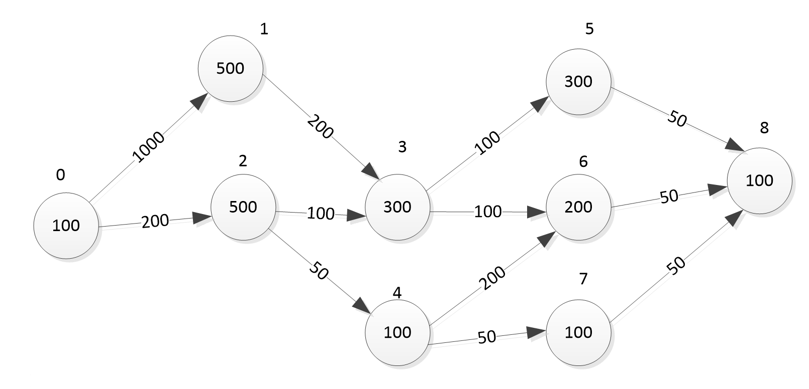
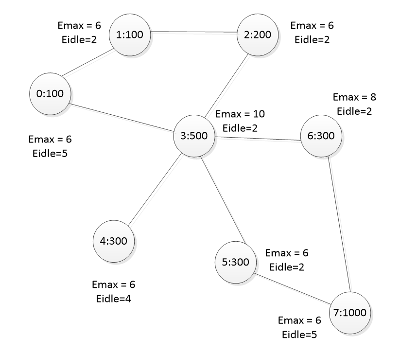

# Результат

    T огр =  300
    t =  100
    ---------------------------
    1  решение
    f: 0.8888475327618474
     
    Распределение: [[0, 4], [6, 7], [], [5], [8, 3, 1], [], [2], []], 

    Нагруженность на узлы: [2000, 1250, 400, 3850, 3950, 0, 1850, 0], 

    Производительность узлов: [100, 100, 200, 500, 300, 300, 300, 1000]

    трудоемкость задач: [100, 500, 500, 300, 100, 300, 200, 100, 100]

    D [0.6666666666666666, 0.625, 0.1, 0.385, 0.6583333333333333, 0.0, 0.20555555555555555, 0.0]

    T_task [60.0, 60.0, 60.0, 60.0, 60.0, 60.0, 60.0, 60.0, 60.0]

    T_NET [30.0, 20.0, 20.0, 20.0, 180.0, 0, 30.0, 0] 

    short_path [0, 1, 3, 5, 8]

    Сколько каждый узел должен обработать задач 

    [900, 800, 0, 600, 2600, 0, 1100, 0]

    Сколько каждый узел должен отправить

    [1450, 100, 200, 1600, 200, 0, 150, 0] 

    Сколько каждый узел должен принять 

    [50, 350, 200, 1650, 1250, 0, 200, 0]

    'Задача1задача2:ПутьВГрафеСети {'01': [0, 3, 4], '02': [0, 3, 6], '13': [4], '23': [6, 3, 4], '24': [6, 3, 0], '35': [4, 3], '36': [4, 3, 2, 1], '46': [0, 1], '47': [0, 1], '58': [3, 4], '68': [1, 2, 3, 4], '78': [1, 2, 3, 4]}' 

    epsi [1, 4, 4, 8, 2, 4, 6, 1]
     
    ---------------------------
    После оптимизации
    f: 0.9633953250319989
     
    Распределение: [[0, 1], [], [], [4, 7, 3, 6, 2], [5, 8], [], [], []], 

    Нагруженность на узлы: [1600, 0, 0, 4400, 1100, 0, 0, 0], 

    Производительность узлов: [100, 100, 200, 500, 300, 300, 300, 1000]

    трудоемкость задач: [100, 500, 500, 300, 100, 300, 200, 100, 100]

    D [0.26666666666666666, 0.0, 0.0, 0.14666666666666667, 0.06111111111111111, 0.0, 0.0, 0.0]

    T_task [60.0, 60.0, 60.0, 60.0, 60.0, 60.0, 60.0, 60.0, 60.0]

    T_NET [120.0, 0, 0, 60.0, 120.0, 0, 0, 0] 

    short_path [0, 1, 3, 5, 8]

    Сколько каждый узел должен обработать задач 

    [1200, 0, 0, 3600, 1000, 0, 0, 0]

    Сколько каждый узел должен отправить

    [400, 0, 0, 200, 0, 0, 0, 0] 

    Сколько каждый узел должен принять 

    [0, 0, 0, 400, 200, 0, 0, 0]

    'Задача1задача2:ПутьВГрафеСети {'01': [0], '02': [0, 3], '13': [0, 3], '23': [3], '24': [3], '35': [3, 4], '36': [3], '46': [3], '47': [3], '58': [4], '68': [3, 4], '78': [3, 4]}' 

    epsi [1, 4, 4, 8, 2, 4, 6, 1]
    ---------------------------
    ---------------------------
    ---------------------------
    ---------------------------
    T огр =  300
    t =  100
    ---------------------------
    1  решение
    f: 0.9628609001165657
    
    Распределение: [[0, 4], [6, 7], [], [5], [8, 3, 1], [], [2], []], 

    Нагруженность на узлы: [2000, 1250, 400, 3850, 3950, 0, 1850, 0], 

    Производительность узлов: [100, 100, 200, 500, 300, 300, 300, 1000]

    трудоемкость задач: [100, 500, 500, 300, 100, 300, 200, 100, 100]

    D [0.6666666666666666, 0.625, 0.1, 0.385, 0.6583333333333333, 0.0, 0.20555555555555555, 0.0]

    T_task [60.0, 60.0, 60.0, 60.0, 60.0, 60.0, 60.0, 60.0, 60.0]

    T_NET [30.0, 20.0, 20.0, 20.0, 180.0, 0, 30.0, 0] 

    short_path [0, 1, 3, 5, 8]

    Сколько каждый узел должен обработать задач 

    [900, 800, 0, 600, 2600, 0, 1100, 0]

    Сколько каждый узел должен отправить

    [1450, 100, 200, 1600, 200, 0, 150, 0] 

    Сколько каждый узел должен принять 

    [50, 350, 200, 1650, 1250, 0, 200, 0]

    'Задача1задача2:ПутьВГрафеСети {'01': [0, 3, 4], '02': [0, 3, 6], '13': [4], '23': [6, 3, 4], '24': [6, 3, 0], '35': [4, 3], '36': [4, 3, 2, 1], '46': [0, 1], '47': [0, 1], '58': [3, 4], '68': [1, 2, 3, 4], '78': [1, 2, 3, 4]}' 

    epsi [1, 1, 1, 1, 1, 1, 1, 1]

    
    ---------------------------
    После оптимизации
    f: 0.9896358692422238
    
    Распределение: [[0, 1], [], [], [4, 7, 3, 6, 2], [5, 8], [], [], []], 

    Нагруженность на узлы: [1600, 0, 0, 4400, 1100, 0, 0, 0], 

    Производительность узлов: [100, 100, 200, 500, 300, 300, 300, 1000]

    трудоемкость задач: [100, 500, 500, 300, 100, 300, 200, 100, 100]

    D [0.26666666666666666, 0.0, 0.0, 0.14666666666666667, 0.06111111111111111, 0.0, 0.0, 0.0]

    T_task [60.0, 60.0, 60.0, 60.0, 60.0, 60.0, 60.0, 60.0, 60.0]

    T_NET [120.0, 0, 0, 60.0, 120.0, 0, 0, 0] 

    short_path [0, 1, 3, 5, 8]

    Сколько каждый узел должен обработать задач 

    [1200, 0, 0, 3600, 1000, 0, 0, 0]

    Сколько каждый узел должен отправить

    [400, 0, 0, 200, 0, 0, 0, 0] 

    Сколько каждый узел должен принять 

    [0, 0, 0, 400, 200, 0, 0, 0]

    'Задача1задача2:ПутьВГрафеСети {'01': [0], '02': [0, 3], '13': [0, 3], '23': [3], '24': [3], '35': [3, 4], '36': [3], '46': [3], '47': [3], '58': [4], '68': [3, 4], '78': [3, 4]}' 

    epsi [1, 1, 1, 1, 1, 1, 1, 1]
    ---------------------------