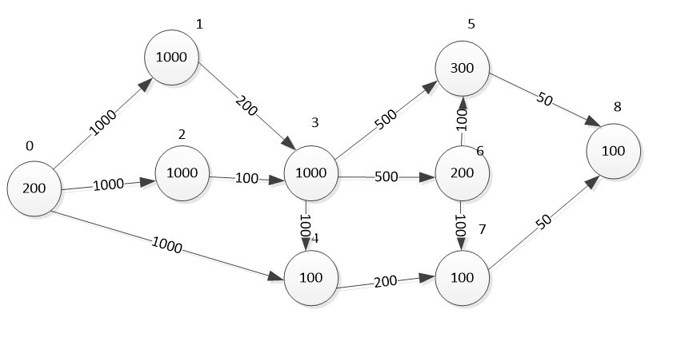
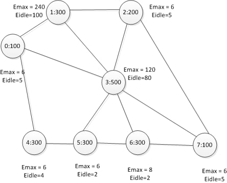

T огр =  300
t =  100
---------------------------
1  решение
f: 0.29886103039112394
 
Распределение: [[0, 8], [1, 7, 2, 4], [], [3], [], [5], [6], []], 

Нагруженность на узлы: [3900, 8150, 0, 6600, 100, 1550, 1300, 0], 

Производительность узлов: [100, 300, 200, 500, 300, 300, 300, 100]

трудоемкость задач: [200, 1000, 1000, 1000, 100, 300, 200, 100, 100]

D [0.78, 0.5433333333333333, 0.0, 0.528, 0.013333333333333334, 0.20666666666666667, 0.17333333333333334, 0.0]

T_task [50.0, 50.0, 50.0, 50.0, 50.0, 50.0, 50.0, 50.0, 50.0]

T_NET [100.0, 150.0, 0, 25.0, 25.0, 25.0, 25.0, 0] 

short_path [0, 1, 3, 4, 7, 8]

# Сколько каждый узел должен обработать задач 

[1000, 4100, 0, 5000, 0, 1500, 1400, 0]

# Сколько каждый узел должен отправить

[3000, 350, 0, 1200, 50, 50, 200, 0] 

# Сколько каждый узел должен принять 

[100, 3200, 0, 400, 50, 600, 500, 0]

'Задача1задача2:ПутьВГрафеСети {'01': [0, 1], '02': [0, 1], '04': [0, 1], '13': [1, 3], '23': [1, 3], '34': [3, 1], '35': [3, 5], '36': [3, 6], '47': [1], '58': [5, 4, 0], '65': [6, 5], '67': [6, 3, 1], '78': [1, 0]}' 

epsi [1, 140, 1, 40, 2, 4, 6, 1]
 
---------------------------
После оптимизации
f: 0.7566215272142816
 
Распределение: [[0, 7, 4, 8], [], [], [2], [1, 5, 6, 3], [], [], []], 

Нагруженность на узлы: [3650, 0, 0, 3100, 9850, 200, 0, 0], 

Производительность узлов: [100, 300, 200, 500, 300, 300, 300, 100]

трудоемкость задач: [200, 1000, 1000, 1000, 100, 300, 200, 100, 100]

D [0.73, 0.0, 0.0, 0.248, 0.6566666666666666, 0.02666666666666667, 0.0, 0.0]

T_task [50.0, 50.0, 50.0, 50.0, 50.0, 50.0, 50.0, 50.0, 50.0]

T_NET [200.0, 0, 0, 25.0, 100.0, 25.0, 0, 0] 

short_path [0, 1, 3, 4, 7, 8]

# Сколько каждый узел должен обработать задач 

[2600, 0, 0, 1200, 7700, 0, 0, 0]

# Сколько каждый узел должен отправить

[2000, 0, 0, 100, 250, 100, 0, 0] 

# Сколько каждый узел должен принять 

[250, 0, 0, 1000, 1100, 100, 0, 0]

'Задача1задача2:ПутьВГрафеСети {'01': [0, 4], '02': [0, 3], '04': [0], '13': [4], '23': [3, 5, 4], '34': [4, 0], '35': [4], '36': [4], '47': [0], '58': [4, 0], '65': [4], '67': [4, 0], '78': [0]}' 

epsi [1, 140, 1, 40, 2, 4, 6, 1]
---------------------------
---------------------------
---------------------------
---------------------------

T огр =  300
t =  100
---------------------------
1  решение
f: 0.9659406805990421
 
Распределение: [[0, 8], [1, 7, 2, 4], [], [3], [], [5], [6], []], 

Нагруженность на узлы: [3900, 8150, 0, 6600, 100, 1550, 1300, 0], 

Производительность узлов: [100, 300, 200, 500, 300, 300, 300, 100]

трудоемкость задач: [200, 1000, 1000, 1000, 100, 300, 200, 100, 100]

D [0.78, 0.5433333333333333, 0.0, 0.528, 0.013333333333333334, 0.20666666666666667, 0.17333333333333334, 0.0]

T_task [50.0, 50.0, 50.0, 50.0, 50.0, 50.0, 50.0, 50.0, 50.0]

T_NET [100.0, 150.0, 0, 25.0, 25.0, 25.0, 25.0, 0] 

short_path [0, 1, 3, 4, 7, 8]

# Сколько каждый узел должен обработать задач 

[1000, 4100, 0, 5000, 0, 1500, 1400, 0]

# Сколько каждый узел должен отправить

[3000, 350, 0, 1200, 50, 50, 200, 0] 

# Сколько каждый узел должен принять 

[100, 3200, 0, 400, 50, 600, 500, 0]

'Задача1задача2:ПутьВГрафеСети {'01': [0, 1], '02': [0, 1], '04': [0, 1], '13': [1, 3], '23': [1, 3], '34': [3, 1], '35': [3, 5], '36': [3, 6], '47': [1], '58': [5, 4, 0], '65': [6, 5], '67': [6, 3, 1], '78': [1, 0]}' 

epsi [1, 1, 1, 1, 1, 1, 1, 1]

 
---------------------------
После оптимизации
f: 0.9791747511847608
 
Распределение: [[0, 4], [2], [], [7, 3, 8, 1], [], [6], [5], []], 

Нагруженность на узлы: [3200, 3100, 0, 10050, 0, 1300, 1550, 0], 

Производительность узлов: [100, 300, 200, 500, 300, 300, 300, 100]

трудоемкость задач: [200, 1000, 1000, 1000, 100, 300, 200, 100, 100]

D [0.64, 0.20666666666666667, 0.0, 0.402, 0.0, 0.08666666666666667, 0.10333333333333333, 0.0]

T_task [50.0, 50.0, 50.0, 50.0, 50.0, 50.0, 50.0, 50.0, 50.0]

T_NET [100.0, 50.0, 0, 200.0, 0, 50.0, 50.0, 0] 

short_path [0, 1, 3, 4, 7, 8]

# Сколько каждый узел должен обработать задач 

[1800, 1200, 0, 7000, 0, 1400, 1500, 0]

# Сколько каждый узел должен отправить

[2200, 100, 0, 1100, 0, 200, 50, 0] 

# Сколько каждый узел должен принять 

[100, 1000, 0, 1450, 0, 500, 600, 0]

'Задача1задача2:ПутьВГрафеСети {'01': [0, 3], '02': [0, 1], '04': [0], '13': [3], '23': [1, 3], '34': [3, 0], '35': [3, 6], '36': [3, 5], '47': [0, 3], '58': [6, 3], '65': [5, 6], '67': [5, 3], '78': [3]}' 

epsi [1, 1, 1, 1, 1, 1, 1, 1]
---------------------------