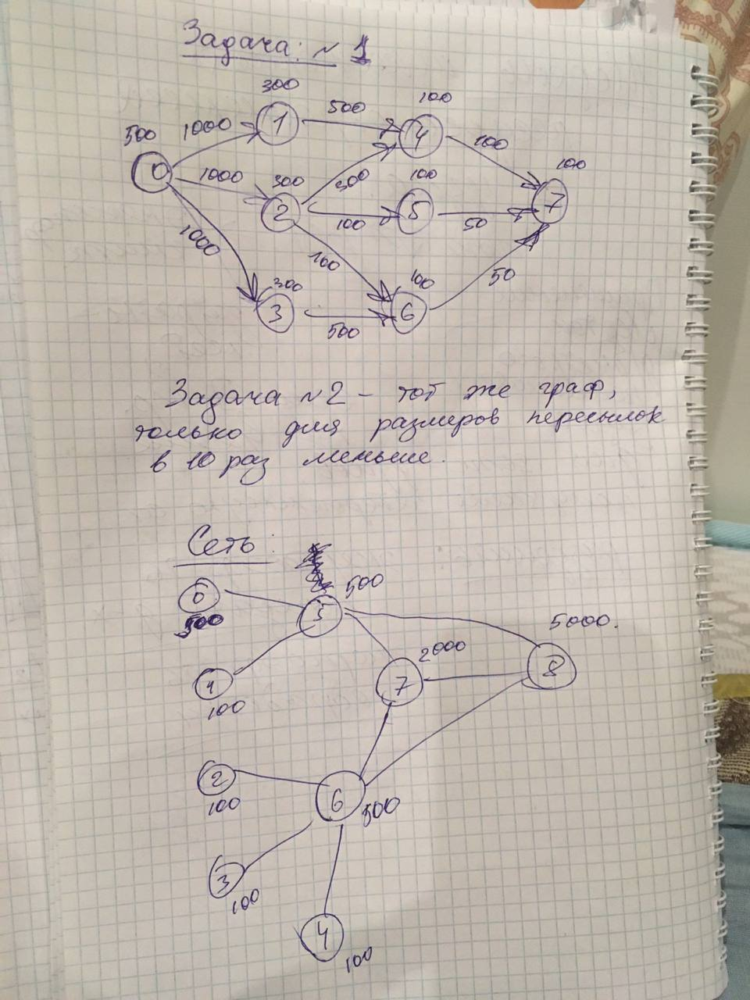

# Результат

# Задача №1
    T огр =  150
    t =  1000
    ---------------------------
    1  решение
    f: 0.7651978839917907, E: 620.02, 
 
    Распределение: [[0, 2], [6], [], [], [], [5, 7], [], [3], [4, 1]], 

    Нагруженность на узлы: [5200, 950, 0, 0, 0, 6550, 0, 2100, 2300], 

    Производительность узлов: [500, 100, 100, 100, 100, 500, 500, 2000, 5000]

    трудоемкость задач: [500, 300, 300, 300, 100, 100, 100, 100]

    D [0.5546666666666666, 0.25333333333333335, 0.0, 0.0, 0.0, 0.6986666666666667, 0.0, 0.056, 0.012266666666666667]

    T_task [37.5, 37.5, 37.5, 37.5, 37.5, 37.5, 37.5, 37.5]

    T_NET [18.75, 37.5, 0, 0, 0, 18.75, 0, 18.75, 75.0] 

    short_path [0, 1, 4, 7]

    # Сколько каждый узел должен обработать задач 

    [2700, 700, 0, 0, 0, 700, 0, 800, 1300]

    # Сколько каждый узел должен отправить

    [2500, 50, 0, 0, 0, 2900, 0, 500, 100] 

    # Сколько каждый узел должен принять 

    [0, 600, 0, 0, 0, 3150, 0, 1000, 1300]

    'Задача1задача2:ПутьВГрафеСети {'01': [0, 5, 8], '02': [0], '03': [0, 5, 7], '14': [8], '24': [0, 5, 8], '25': [0, 5], '26': [0, 5, 1], '36': [7, 5, 1], '47': [8, 5], '57': [5], '67': [1, 5]}' 

    {0: 0, 1: 8, 2: 0, 3: 7, 4: 8, 5: 5, 6: 1, 7: 5}

 
    ---------------------------
    После оптимизации
    f: 0.896962607459555, E: 130.80000000000018, 
 
    Распределение: [[0, 4, 3, 1, 2, 5], [], [], [], [], [7, 6], [], [], []], 

    Нагруженность на узлы: [5150, 0, 0, 0, 0, 1350, 0, 0, 0], 

    Производительность узлов: [500, 100, 100, 100, 100, 500, 500, 2000, 5000]

    трудоемкость задач: [500, 300, 300, 300, 100, 100, 100, 100]

    D [0.27466666666666667, 0.0, 0.0, 0.0, 0.0, 0.072, 0.0, 0.0, 0.0]

    T_task [37.5, 37.5, 37.5, 37.5, 37.5, 37.5, 37.5, 37.5]

    T_NET [112.5, 0, 0, 0, 0, 37.5, 0, 0, 0] 

    short_path [0, 1, 4, 7]

    # Сколько каждый узел должен обработать задач 

    [4400, 0, 0, 0, 0, 1000, 0, 0, 0]

    # Сколько каждый узел должен отправить

    [750, 0, 0, 0, 0, 0, 0, 0, 0] 

    # Сколько каждый узел должен принять 

    [0, 0, 0, 0, 0, 750, 0, 0, 0]

    'Задача1задача2:ПутьВГрафеСети {'01': [0], '02': [0], '03': [0], '14': [0], '24': [0], '25': [0], '26': [0, 5], '36': [0, 5], '47': [0, 5], '57': [0, 5], '67': [5]}' 

    {0: 0, 1: 0, 2: 0, 3: 0, 4: 0, 5: 0, 6: 5, 7: 5}

    ---------------------------

# Задача №2

    T огр =  150
    t =  1000
    ---------------------------
    1  решение
    f: 0.8135604619190789, E: 263.5609999999997, 
 
    Распределение: [[0], [], [3], [1], [5], [7], [], [2, 6], [4]], 

    Нагруженность на узлы: [1800, 0, 750, 750, 215, 920, 630, 1905, 590], 

    Производительность узлов: [500, 100, 100, 100, 100, 500, 500, 2000, 5000]

    трудоемкость задач: [500, 300, 300, 300, 100, 100, 100, 100]

    D [0.384, 0.0, 0.4, 0.4, 0.172, 0.19626666666666667, 0.1344, 0.1016, 0.012586666666666666]

    T_task [37.5, 37.5, 37.5, 37.5, 37.5, 37.5, 37.5, 37.5]

    T_NET [9.375, 0, 18.75, 18.75, 12.5, 9.375, 9.375, 9.375, 9.375] 

    short_path [0, 1, 4, 7]

    # Сколько каждый узел должен обработать задач 

    [1500, 0, 800, 800, 400, 300, 0, 1900, 700]

    # Сколько каждый узел должен отправить

    [300, 0, 50, 50, 5, 300, 315, 150, 110] 

    # Сколько каждый узел должен принять 

    [0, 0, 100, 100, 10, 320, 315, 255, 180]

    'Задача1задача2:ПутьВГрафеСети {'01': [0, 5, 8, 6, 3], '02': [0, 5, 7], '03': [0, 5, 7, 6, 2], '14': [3, 6, 8], '24': [7, 8], '25': [7, 6, 4], '26': [7], '36': [2, 6, 7], '47': [8, 5], '57': [4, 6, 7, 5], '67': [7, 5]}' 

    {0: 0, 1: 3, 2: 7, 3: 2, 4: 8, 5: 4, 6: 7, 7: 5}

 
    ---------------------------
    После оптимизации
    f: 0.9030279130443342, E: 91.375, 
 
    Распределение: [[0, 1], [], [], [], [], [2, 3, 4, 5], [], [7, 6], []], 

    Нагруженность на узлы: [2350, 0, 0, 0, 0, 2625, 0, 675, 0], 

    Производительность узлов: [500, 100, 100, 100, 100, 500, 500, 2000, 5000]

    трудоемкость задач: [500, 300, 300, 300, 100, 100, 100, 100]

    D [0.12533333333333332, 0.0, 0.0, 0.0, 0.0, 0.14, 0.0, 0.009, 0.0]

    T_task [37.5, 37.5, 37.5, 37.5, 37.5, 37.5, 37.5, 37.5]

    T_NET [75.0, 0, 0, 0, 0, 37.5, 0, 37.5, 0] 

    short_path [0, 1, 4, 7]

    # Сколько каждый узел должен обработать задач 

    [2100, 0, 0, 0, 0, 2900, 0, 1000, 0]

    # Сколько каждый узел должен отправить

    [250, 0, 0, 0, 0, 75, 0, 0, 0] 

    # Сколько каждый узел должен принять 

    [0, 0, 0, 0, 0, 250, 0, 75, 0]

    'Задача1задача2:ПутьВГрафеСети {'01': [0], '02': [0, 5], '03': [0, 5], '14': [0, 5], '24': [5], '25': [5], '26': [5, 7], '36': [5, 7], '47': [5, 7], '57': [5, 7], '67': [7]}' 

    {0: 0, 1: 0, 2: 5, 3: 5, 4: 5, 5: 5, 6: 7, 7: 7}

    ---------------------------