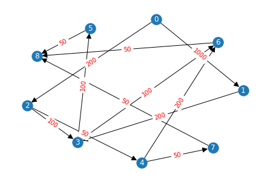

# Результат

# СП
    T огр =  150
    t =  300
    Энергопотребление при отсутствии загруженности (E0) =  [10, 10, 10, 10, 10, 10, 10, 10, 10, 10, 10, 10]
    Энергопотребление при максимальной загруженности (EMax) =  [100, 100, 100, 100, 100, 100, 100, 100, 100, 100, 100, 100]
    ---------------------------
    1  решение
    Cвертка : -0.0001,
    ВБР: -1, Энергопотребление : 10000000000,
    Распределение: [[0, 3], [1], [2, 6], [4], [], [], [], [8], [], [7, 5], [], []], 
    Нагруженность на узлы: [3100, 3200, 2900, 600, 0, 200, 500, 450, 100, 1050, 0, 0], 
    Производительность узлов: [300, 300, 300, 300, 300, 300, 300, 300, 300, 300, 300, 300]
    трудоемкость задач: [100, 500, 500, 300, 100, 300, 200, 100, 100]
    D [1.0333333333333334, 1.0666666666666667, 1.288888888888889, 0.26666666666666666, 0.0, 0.08888888888888889, 0.2222222222222222, 0.05, 0.022222222222222223, 0.23333333333333334, 0.0, 0.0]
    Сколько времени уделено задаче (T_task) [30.0, 30.0, 30.0, 30.0, 30.0, 30.0, 30.0, 30.0, 30.0]
    Сколько времени работает узел (T_NET) [60.0, 10.0, 7.5, 7.5, 0, 7.5, 7.5, 30.0, 15.0, 15.0, 0, 0] 
    Энергопотребление на каждый узел (Ei) : []
    Кратчайший путь (short_path) [0, 1, 3, 5, 8]
    # Сколько каждый узел должен обработать задач 
    [1800, 600, 1700, 700, 0, 0, 0, 600, 0, 800, 0, 0]
    # Сколько каждый узел должен отправить
    [1400, 700, 250, 250, 0, 100, 250, 0, 50, 100, 0, 0] 
    # Сколько каждый узел должен принять 
    [300, 1500, 550, 50, 0, 100, 250, 150, 50, 150, 0, 0]
    'Задача1задача2:ПутьВГрафеСети {'01': [0, 1], '02': [0, 1, 2], '13': [1, 0], '23': [2, 1, 0], '24': [2, 3], '35': [0, 1, 6, 9], '36': [0, 1, 2], '46': [3, 2], '47': [3, 2, 5, 6, 9], '58': [9, 6, 7], '68': [2, 5, 6, 7], '78': [9, 8, 7]}' 
    ---------------------------

    После оптимизации
    Cвертка : 45.88739,
    ВБР: 0.9512455758227333, Энергопотребление : 20730.0,
    Распределение: [[], [], [], [], [], [7, 8], [4, 6], [], [0, 1], [2, 3], [5], []], 
    Нагруженность на узлы: [0, 0, 0, 0, 0, 650, 1150, 0, 1600, 3350, 750, 0], 
    Производительность узлов: [300, 300, 300, 300, 300, 300, 300, 300, 300, 300, 300, 300]
    трудоемкость задач: [100, 500, 500, 300, 100, 300, 200, 100, 100]
    D [0.0, 0.0, 0.0, 0.0, 0.0, 0.07222222222222222, 0.12777777777777777, 0.0, 0.17777777777777778, 0.37222222222222223, 0.08333333333333333, 0.0]
    Сколько времени уделено задаче (T_task) [30.0, 30.0, 30.0, 30.0, 30.0, 30.0, 30.0, 30.0, 30.0]
    Сколько времени работает узел (T_NET) [0, 0, 0, 0, 0, 30.0, 30.0, 0, 60.0, 30.0, 30.0, 0] 
    Энергопотребление на каждый узел (Ei) : [10.0, 10.0, 10.0, 10.0, 10.0, 16.5, 21.5, 10.0, 26.0, 43.5, 17.5, 10.0]
    Кратчайший путь (short_path) [0, 1, 3, 5, 8]
    # Сколько каждый узел должен обработать задач 
    [0, 0, 0, 0, 0, 800, 1400, 0, 1200, 2500, 600, 0]
    # Сколько каждый узел должен отправить
    [0, 0, 0, 0, 0, 0, 100, 0, 400, 250, 50, 0] 
    # Сколько каждый узел должен принять 
    [0, 0, 0, 0, 0, 150, 150, 0, 0, 400, 100, 0]
    'Задача1задача2:ПутьВГрафеСети {'01': [8], '02': [8, 9], '13': [8, 9], '23': [9], '24': [9, 6], '35': [9, 10], '36': [9, 6], '46': [6], '47': [6, 5], '58': [10, 5], '68': [6, 5], '78': [5]}' 

# ИО
    Cвертка : 43.3649,
    ВБР: 0.9184686346559262, Энергопотребление : 21180.0,
    Распределение: [[5], [3], [8], [1], [0], [2, 7], [4, 6], [], [], [], [], []],  
    Нагруженность на узлы: [750, 1800, 850, 2200, 1400, 2250, 1350, 0, 0, 0, 0, 0],  
    Производительность узлов: [300, 300, 300, 300, 300, 300, 300, 300, 300, 300, 300, 300] 
    трудоемкость задач: [100, 500, 500, 300, 100, 300, 200, 100, 100] 
    D [0.16666666666666666, 0.4, 0.18888888888888888, 0.4888888888888889, 0.15555555555555556, 0.5, 0.3, 0.0, 0.0, 0.0, 0.0, 0.0] 
    Сколько времени уделено задаче (T_task) [30.0, 30.0, 30.0, 30.0, 30.0, 30.0, 30.0, 30.0, 30.0] 
    Сколько времени работает узел (T_NET) [15.0, 15.0, 15.0, 15.0, 30.0, 15.0, 15.0, 0, 0, 0, 0, 0]  
    Энергопотребление на каждый узел (Ei) : [25.0, 46.0, 27.0, 54.0, 24.0, 55.0, 37.0, 10.0, 10.0, 10.0, 10.0, 10.0]

    Кратчайший путь (short_path) [0, 1, 3, 5, 8] 
    # Сколько каждый узел должен обработать задач  
    [600, 1600, 600, 600, 200, 1300, 1400, 0, 0, 0, 0, 0] 
    # Сколько каждый узел должен отправить 
    [50, 250, 200, 200, 1200, 250, 200, 0, 0, 0, 0, 0]  
    # Сколько каждый узел должен принять  
    [100, 350, 350, 1000, 0, 300, 250, 0, 0, 0, 0, 0] 
    'Задача1задача2:ПутьВГрафеСети {'01': [4, 3], '02': [4, 5], '13': [3, 2, 1], '23': [5, 6, 1], '24': [5, 6], '35': [1, 0], '36': [1, 6], '46': [6], '47': [6, 5], '58': [0, 1, 2], '68': [6, 5, 2], '78': [5, 2]}' 